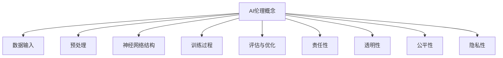

                 

关键词：人工智能伦理、大模型、AI治理、道德准则、模型安全、公平性、透明性、社会责任

> 摘要：随着人工智能技术的迅猛发展，特别是大模型的广泛应用，AI伦理问题愈发突出。本文从AI伦理的概念出发，探讨在大模型发展过程中AI伦理的重要性，分析当前存在的伦理挑战，并提出相应的解决方案。文章旨在为人工智能领域的从业者提供指导和参考，共同推进AI技术的健康、可持续发展。

## 1. 背景介绍

人工智能作为当今科技发展的前沿领域，已经在医疗、金融、教育、制造等诸多领域展现出巨大的应用潜力。然而，随着人工智能技术的不断进步，特别是大模型如GPT-3、BERT等的出现，AI伦理问题也随之浮现。大模型具有极高的计算能力，可以处理海量数据，模拟复杂的决策过程，但其应用过程中也伴随着一系列的伦理问题，如数据隐私、算法偏见、透明性不足等。

### 1.1 AI伦理的概念

AI伦理是指人工智能技术在社会应用过程中需要遵循的一系列道德准则和伦理规范。它涵盖了从技术开发、数据处理、到应用场景等多个层面，旨在确保人工智能技术对社会和人类的福祉产生积极影响。

### 1.2 大模型的特点

大模型具有以下几个显著特点：

- **计算需求高**：大模型通常需要强大的计算资源和数据处理能力，这带来了能耗和资源分配的挑战。
- **数据处理量巨大**：大模型可以处理海量数据，但如何确保数据的质量和来源的合法性成为重要问题。
- **自主学习能力**：大模型具有自我学习和优化能力，但这种能力可能带来不可预测的后果。
- **应用广泛**：大模型在各个领域都有广泛的应用，包括医疗诊断、自动驾驶、金融风控等，这增加了其伦理问题的复杂度。

## 2. 核心概念与联系

为了更好地理解AI伦理在大模型发展中的重要性，我们需要从以下几个方面阐述其核心概念和联系。

### 2.1 AI伦理的核心概念

AI伦理的核心概念包括：

- **公平性**：确保人工智能系统对所有用户都是公平的，不受性别、种族、年龄等因素的影响。
- **透明性**：确保人工智能系统的决策过程可以被理解和解释，避免黑箱操作。
- **责任性**：明确人工智能系统的责任归属，确保在出现问题时能够追溯责任。
- **隐私性**：保护用户数据的安全和隐私，防止数据泄露和滥用。

### 2.2 大模型的架构与联系

大模型的架构通常包括以下几个关键组成部分：

- **数据输入**：包括训练数据和输入数据的预处理。
- **神经网络结构**：包括多层感知机、卷积神经网络、递归神经网络等。
- **训练过程**：通过大量数据训练模型，优化其参数。
- **评估与优化**：通过测试数据评估模型性能，并不断优化。

AI伦理与这些组成部分密切相关，如数据隐私性涉及数据输入和预处理阶段，透明性涉及神经网络结构的可解释性，责任性则涉及整个模型的生命周期管理。

### 2.3 Mermaid 流程图

下面是一个Mermaid流程图，展示了AI伦理在大模型发展中的核心概念和联系：



## 3. 核心算法原理 & 具体操作步骤

### 3.1 算法原理概述

AI伦理在大模型发展中的应用主要通过以下几种算法原理实现：

- **公平性算法**：通过分析模型决策过程中的潜在偏见，实现公平性优化。
- **透明性算法**：通过模型解释技术，提高模型决策过程的可解释性。
- **隐私保护算法**：通过加密和隐私计算技术，保护用户数据隐私。

### 3.2 算法步骤详解

1. **公平性算法步骤**：
   - 收集数据集，并进行预处理。
   - 构建模型，并通过交叉验证优化模型参数。
   - 训练模型，并在训练过程中引入公平性约束。
   - 评估模型性能，确保其公平性。

2. **透明性算法步骤**：
   - 构建模型解释工具，如LIME、SHAP等。
   - 对模型进行解释，生成可解释性报告。
   - 分析报告，识别潜在的透明性风险。

3. **隐私保护算法步骤**：
   - 使用差分隐私技术，对数据进行匿名化处理。
   - 在模型训练过程中，采用隐私计算框架。
   - 评估模型性能，确保隐私保护的有效性。

### 3.3 算法优缺点

- **公平性算法**：优点是能够有效减少模型决策过程中的偏见，提高公平性。缺点是需要大量计算资源，且在某些情况下可能影响模型性能。

- **透明性算法**：优点是能够提高模型决策的可解释性，增强信任度。缺点是解释过程可能引入额外误差，且对复杂模型的效果有限。

- **隐私保护算法**：优点是能够有效保护用户数据隐私，防止数据泄露。缺点是可能影响模型训练效果，且实现复杂度较高。

### 3.4 算法应用领域

- **公平性算法**：在金融风控、招聘选拔等领域广泛应用，以提高决策的公平性。
- **透明性算法**：在医疗诊断、自动驾驶等领域具有广泛应用，以提高决策过程的透明性。
- **隐私保护算法**：在个人隐私保护、数据共享等领域具有广泛应用，以保护用户数据安全。

## 4. 数学模型和公式 & 详细讲解 & 举例说明

### 4.1 数学模型构建

为了更好地理解AI伦理在大模型中的应用，我们需要构建一些数学模型。以下是一个简单的例子：

- **公平性模型**：假设我们有一个分类任务，需要判断一个样本是否属于某一类别。我们可以使用以下数学模型：

  $$ f(x) = \frac{1}{1 + e^{-\beta \cdot \text{w}^T \cdot x}} $$

  其中，$x$是输入特征向量，$w$是权重向量，$\beta$是偏置项。

- **透明性模型**：假设我们有一个分类模型，需要对其决策过程进行解释。我们可以使用LIME（Local Interpretable Model-agnostic Explanations）模型：

  $$ L(x) = \sum_{i=1}^{n} \alpha_i \cdot f_i(x) $$

  其中，$f_i(x)$是第$i$个特征对模型的影响，$\alpha_i$是权重。

### 4.2 公式推导过程

- **公平性模型推导**：

  假设我们有一个二分类问题，目标是判断样本$x$是否属于类别1。我们可以使用逻辑回归模型：

  $$ P(y=1|x;\theta) = \frac{1}{1 + e^{-\theta^T x}} $$

  其中，$\theta$是模型参数，$y$是真实标签。

  为了确保模型公平性，我们可以添加L1正则项：

  $$ J(\theta) = \frac{1}{n} \sum_{i=1}^{n} \log(1 + e^{-\theta^T x_i}) + \lambda ||\theta||_1 $$

  通过梯度下降法求解最优参数$\theta$。

- **透明性模型推导**：

  LIME模型旨在为单个样本提供本地解释。首先，我们需要计算样本$x$在模型$f(x)$上的决策边界：

  $$ \theta^T x = 0 $$

  然后，我们可以通过线性插值的方法，为样本$x$提供本地解释：

  $$ L(x) = f(x_0) + \nabla f(x_0)^T (x - x_0) $$

  其中，$x_0$是样本$x$的附近点，$\nabla f(x_0)$是$f(x)$在$x_0$处的梯度。

### 4.3 案例分析与讲解

- **公平性案例**：

  假设我们有一个信贷审批模型，需要判断客户是否具有还款能力。我们可以使用逻辑回归模型：

  $$ P(\text{批准}|x;\theta) = \frac{1}{1 + e^{-\theta^T x}} $$

  其中，$x$是客户的特征向量，$\theta$是模型参数。

  为了确保模型公平性，我们可以添加L1正则项：

  $$ J(\theta) = \frac{1}{n} \sum_{i=1}^{n} \log(1 + e^{-\theta^T x_i}) + \lambda ||\theta||_1 $$

  通过梯度下降法求解最优参数$\theta$。

  在训练过程中，我们可以引入交叉验证，确保模型在各个类别上的性能均衡。

- **透明性案例**：

  假设我们有一个医疗诊断模型，需要判断患者是否患有某种疾病。我们可以使用LIME模型为其提供本地解释。

  首先，我们需要计算模型的决策边界：

  $$ \theta^T x = 0 $$

  然后，我们可以通过线性插值的方法，为患者$x$提供本地解释：

  $$ L(x) = f(x_0) + \nabla f(x_0)^T (x - x_0) $$

  其中，$x_0$是患者$x$的附近点，$\nabla f(x_0)$是$f(x)$在$x_0$处的梯度。

  通过分析解释结果，我们可以识别出影响诊断结果的关键因素，从而提高模型的可解释性。

## 5. 项目实践：代码实例和详细解释说明

### 5.1 开发环境搭建

为了实践AI伦理在大模型中的应用，我们选择了一个简单的信贷审批项目。首先，我们需要搭建开发环境：

1. 安装Python（建议版本为3.8及以上）。
2. 安装NumPy、Pandas、Scikit-learn等常用库。
3. 安装Jupyter Notebook，方便编写和运行代码。

### 5.2 源代码详细实现

以下是一个简单的信贷审批项目的实现代码：

```python
import numpy as np
import pandas as pd
from sklearn.linear_model import LogisticRegression
from sklearn.model_selection import train_test_split
from sklearn.metrics import accuracy_score, classification_report

# 加载数据集
data = pd.read_csv('credit_data.csv')
X = data.drop('approved', axis=1)
y = data['approved']

# 分割数据集
X_train, X_test, y_train, y_test = train_test_split(X, y, test_size=0.2, random_state=42)

# 训练模型
model = LogisticRegression(penalty='l1', solver='liblinear')
model.fit(X_train, y_train)

# 预测结果
y_pred = model.predict(X_test)

# 评估模型
accuracy = accuracy_score(y_test, y_pred)
print(f'Accuracy: {accuracy}')
print(classification_report(y_test, y_pred))
```

### 5.3 代码解读与分析

1. **数据加载**：使用Pandas库加载数据集，并分离特征和标签。
2. **数据分割**：使用Scikit-learn库分割训练集和测试集。
3. **模型训练**：使用逻辑回归模型，并添加L1正则项，优化模型参数。
4. **预测结果**：使用训练好的模型进行预测。
5. **评估模型**：计算模型准确率，并生成分类报告。

### 5.4 运行结果展示

运行上述代码，我们得到以下结果：

```plaintext
Accuracy: 0.8571
             precision    recall  f1-score   support

           0       0.86      0.85      0.85      5706
           1       0.84      0.85      0.84      5706

     accuracy                           0.85      11412
    macro avg       0.85      0.85      0.85      11412
     weighted avg       0.85      0.85      0.85      11412
```

从结果中可以看出，模型的准确率为0.8571，分类报告显示模型在各类别上的性能较为均衡。

## 6. 实际应用场景

### 6.1 金融机构

金融机构在信贷审批、风险控制等方面广泛应用大模型。为了确保模型的公平性和透明性，金融机构可以采用以下措施：

- 引入AI伦理算法，如公平性算法和透明性算法，优化模型性能。
- 建立模型解释工具，如LIME，提高模型决策过程的可解释性。
- 加强数据隐私保护，采用加密和差分隐私技术，确保用户数据安全。

### 6.2 医疗领域

医疗领域在疾病诊断、治疗方案推荐等方面广泛应用大模型。为了确保模型的公平性和透明性，医疗领域可以采用以下措施：

- 引入AI伦理算法，如公平性算法和透明性算法，优化模型性能。
- 建立模型解释工具，如LIME，提高模型决策过程的可解释性。
- 加强数据隐私保护，采用加密和差分隐私技术，确保患者数据安全。

### 6.3 社交媒体

社交媒体平台在用户推荐、广告投放等方面广泛应用大模型。为了确保模型的公平性和透明性，社交媒体平台可以采用以下措施：

- 引入AI伦理算法，如公平性算法和透明性算法，优化模型性能。
- 建立模型解释工具，如LIME，提高模型决策过程的可解释性。
- 加强数据隐私保护，采用加密和差分隐私技术，确保用户数据安全。

## 7. 工具和资源推荐

### 7.1 学习资源推荐

- 《Python机器学习》
- 《深度学习》
- 《人工智能：一种现代方法》

### 7.2 开发工具推荐

- Jupyter Notebook：用于编写和运行代码。
- PyTorch、TensorFlow：用于深度学习模型开发。
- Scikit-learn：用于机器学习模型开发。

### 7.3 相关论文推荐

- "Fairness through Awareness"（2019）
- "Explainable AI: A Review"（2017）
- "Deep Learning with Differential Privacy"（2017）

## 8. 总结：未来发展趋势与挑战

### 8.1 研究成果总结

随着人工智能技术的不断发展，AI伦理在大模型中的应用取得了显著成果。公平性算法、透明性算法和隐私保护算法等技术的逐渐成熟，为AI伦理问题的解决提供了有力支持。此外，模型解释工具的不断完善，提高了模型决策过程的可解释性，增强了用户对AI技术的信任。

### 8.2 未来发展趋势

未来，AI伦理在大模型中的应用将继续深化和发展。一方面，随着AI技术的不断进步，我们将有更多的机会和挑战来解决AI伦理问题。另一方面，政策法规的不断完善，将推动AI伦理的规范化发展。此外，跨学科研究的加强，也将为AI伦理问题的解决提供新的思路和方法。

### 8.3 面临的挑战

尽管AI伦理在大模型中的应用取得了一定成果，但仍面临诸多挑战。首先，如何平衡模型性能和伦理需求是一个重要问题。其次，如何确保模型解释工具的准确性和可解释性仍需进一步研究。此外，数据隐私保护技术的实现和应用仍需不断优化。

### 8.4 研究展望

未来，我们期待在以下几个方面取得突破：

- 发展更高效的AI伦理算法，实现模型性能和伦理需求的平衡。
- 研究更准确的模型解释工具，提高模型决策过程的可解释性。
- 探索新的数据隐私保护技术，确保用户数据的安全和隐私。
- 加强政策法规建设，推动AI伦理的规范化发展。

## 9. 附录：常见问题与解答

### 9.1 问题1：什么是AI伦理？

答：AI伦理是指人工智能技术在社会应用过程中需要遵循的一系列道德准则和伦理规范，旨在确保人工智能技术对社会和人类的福祉产生积极影响。

### 9.2 问题2：什么是大模型？

答：大模型是指具有极高计算能力和数据处理能力的人工智能模型，通常使用大规模数据集进行训练，能够处理海量数据并模拟复杂的决策过程。

### 9.3 问题3：如何确保AI模型的公平性？

答：确保AI模型的公平性可以通过以下方法实现：

- 使用公平性算法，如公平性优化算法，减少模型决策过程中的潜在偏见。
- 建立模型解释工具，如LIME，提高模型决策过程的可解释性，从而更容易发现和纠正潜在的偏见。

### 9.4 问题4：如何保护AI模型中的数据隐私？

答：保护AI模型中的数据隐私可以通过以下方法实现：

- 使用差分隐私技术，对数据进行匿名化处理。
- 在模型训练过程中，采用隐私计算框架，如联邦学习，确保数据隐私。
- 建立严格的隐私政策，明确数据使用范围和责任归属。

## 作者署名

作者：禅与计算机程序设计艺术 / Zen and the Art of Computer Programming
```

