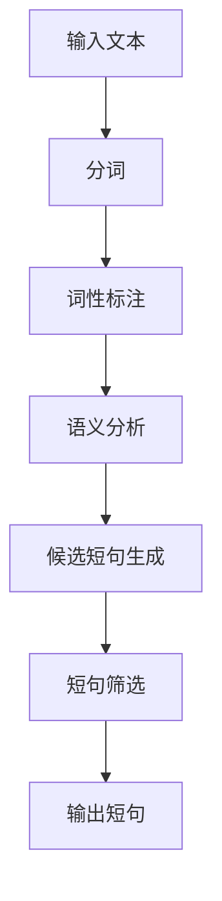
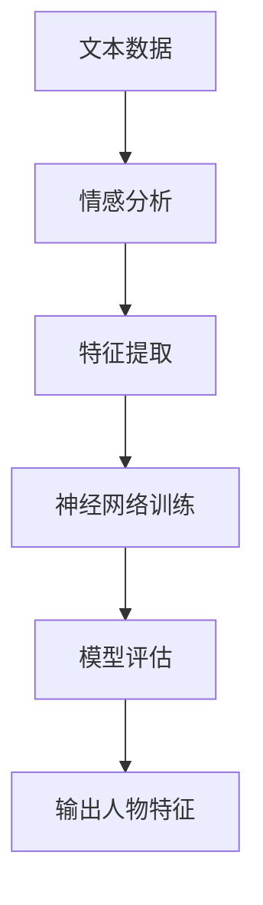
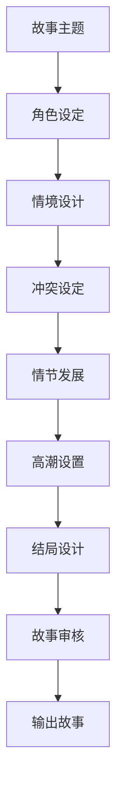
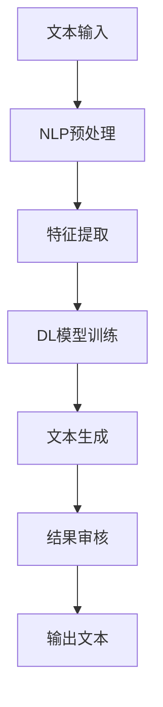

                 

关键词：AI写作、人味、短句、人物形象、戏剧性情节、技术语言、专业见解、深度思考

## 摘要

本文将探讨人工智能在写作领域的应用，特别是如何赋予AI作品以“人味”。通过深入分析短句、人物形象塑造和戏剧性情节构建等方面，本文旨在揭示AI写作的潜力和挑战。文章将结合实际案例，展示如何通过技术手段提高AI写作的质量和吸引力。

## 1. 背景介绍

随着人工智能技术的发展，自然语言处理（NLP）已经成为一个备受关注的领域。AI在写作中的应用，不仅能够提高内容生产效率，还能拓展写作的边界。然而，AI写作的核心挑战之一是如何让作品具有“人味”，即具备人类特有的情感、思维和表达方式。

短句、人物形象和戏剧性情节是文学作品中至关重要的元素。短句能够增强文本的节奏感和感染力，人物形象则赋予作品以生命力，而戏剧性情节则吸引读者，使其沉浸于故事之中。因此，如何在AI写作中实现这些元素，是提升AI作品质量的关键。

## 2. 核心概念与联系

为了深入理解AI写作的“人味”，我们需要从以下几个核心概念入手：

1. **短句生成**：通过算法生成简短而有力的句子，提升文本的表达力和节奏感。
2. **人物形象建模**：利用深度学习技术创建具有个性特点的人物形象，使其在故事中栩栩如生。
3. **情节构建**：设计富有戏剧性的情节，增加文本的吸引力和可读性。

### 2.1. 短句生成

短句生成的关键在于找到能够准确表达意思且简洁有力的词汇组合。以下是一个Mermaid流程图，展示了短句生成的过程：



### 2.2. 人物形象建模

人物形象建模涉及多个步骤，包括数据收集、特征提取和模型训练。以下是一个简化版的Mermaid流程图：



### 2.3. 情节构建

情节构建是一个复杂的过程，需要考虑故事的逻辑性、连贯性和戏剧性。以下是一个Mermaid流程图，展示了情节构建的步骤：



## 3. 核心算法原理 & 具体操作步骤

### 3.1. 算法原理概述

AI写作的核心算法主要包括自然语言处理（NLP）和深度学习（DL）。NLP负责文本的预处理、分析，而DL则用于生成和优化文本。以下是一个简化的算法流程：



### 3.2. 算法步骤详解

#### 3.2.1. NLP预处理

NLP预处理是文本处理的第一个步骤，主要包括分词、词性标注和命名实体识别。以下是一个具体操作步骤的示例：

1. **分词**：将文本分割成词语。例如，“我爱北京天安门”可以被分割成“我”、“爱”、“北京”、“天安门”。
2. **词性标注**：为每个词语标注词性，如名词、动词、形容词等。例如，“我爱北京天安门”可以被标注为“我（代词）、爱（动词）、北京（名词）、天安门（名词）”。
3. **命名实体识别**：识别文本中的命名实体，如人名、地点、组织等。例如，“我爱北京天安门”中的“北京”和“天安门”可以被识别为地名。

#### 3.2.2. 特征提取

特征提取是将文本转换为模型可以处理的数值表示。常用的特征提取方法包括词袋模型、词嵌入和序列标注。以下是一个简化的步骤：

1. **词袋模型**：将文本表示为一个词频矩阵，每个词都是一个特征。
2. **词嵌入**：将词语转换为高维向量，用于表示词语的语义关系。
3. **序列标注**：将文本序列中的每个词标注为一个标签，如名词、动词等。

#### 3.2.3. DL模型训练

DL模型训练是AI写作的核心。常见的模型包括循环神经网络（RNN）、长短期记忆网络（LSTM）和变换器（Transformer）等。以下是一个简化的训练步骤：

1. **数据准备**：收集大量文本数据，并进行预处理。
2. **模型初始化**：初始化模型参数。
3. **训练过程**：通过反向传播算法，不断调整模型参数，以最小化损失函数。
4. **模型评估**：使用验证集评估模型性能。

#### 3.2.4. 文本生成

文本生成是通过训练好的模型生成新文本。以下是一个简化的生成过程：

1. **输入**：输入一个起始句子或词语。
2. **预测**：模型预测下一个词语或句子。
3. **生成**：将预测结果连成完整的文本。

### 3.3. 算法优缺点

#### 3.3.1. 优点

1. **高效性**：AI写作能够快速生成大量文本，提高内容生产效率。
2. **个性化**：通过训练，AI可以理解用户的写作风格和喜好，生成个性化的内容。
3. **多样性**：AI能够生成多种不同风格和主题的文本，拓展写作的边界。

#### 3.3.2. 缺点

1. **质量波动**：AI写作的质量存在波动，有时可能生成低质量或不连贯的文本。
2. **创造性限制**：AI缺乏人类的创造性思维，难以生成极具创新性的内容。
3. **理解深度**：AI对文本的理解有限，难以捕捉到复杂的情感和深层次的含义。

### 3.4. 算法应用领域

AI写作在多个领域具有广泛的应用，包括但不限于：

1. **新闻写作**：自动生成新闻报道，提高信息传播效率。
2. **创意写作**：辅助人类作者创作故事、小说等文学作品。
3. **教育辅导**：生成个性化学习材料，帮助学生提高学习效果。
4. **市场营销**：自动生成广告文案、推广内容等，提高市场推广效果。

## 4. 数学模型和公式 & 详细讲解 & 举例说明

### 4.1. 数学模型构建

AI写作中的数学模型主要包括词嵌入模型、循环神经网络（RNN）和变换器（Transformer）等。以下是一个简化的数学模型构建过程：

#### 4.1.1. 词嵌入模型

词嵌入是将词语映射为高维向量，用于表示词语的语义关系。常见的词嵌入模型有：

1. **Word2Vec**：基于神经网络，通过上下文预测词语，生成词嵌入向量。
2. **GloVe**：基于矩阵分解，通过共现矩阵生成词嵌入向量。

#### 4.1.2. 循环神经网络（RNN）

循环神经网络（RNN）是一种处理序列数据的神经网络，能够捕捉序列中的长期依赖关系。RNN的数学模型包括：

1. **基本RNN**：使用递归关系更新隐藏状态。
2. **长短期记忆网络（LSTM）**：通过引入门控机制，解决RNN的梯度消失和梯度爆炸问题。

#### 4.1.3. 变换器（Transformer）

变换器（Transformer）是一种基于自注意力机制的深度神经网络，能够高效地处理长序列数据。变换器的数学模型包括：

1. **自注意力机制**：通过计算序列中每个词与其他词的相关性，生成加权表示。
2. **多头注意力**：通过多组自注意力机制，提高模型的表达能力。

### 4.2. 公式推导过程

#### 4.2.1. Word2Vec

Word2Vec的推导过程基于神经网络的损失函数。假设有一个词语序列：

$$
(x_1, x_2, ..., x_T)
$$

其中，$x_i$ 表示序列中的第 $i$ 个词语。Word2Vec的目标是通过预测词语的上下文来生成词嵌入向量。

损失函数为：

$$
L = \sum_{i=1}^{T} -\log p(x_i|x_{<i})
$$

其中，$p(x_i|x_{<i})$ 表示给定词语的上下文，预测词语 $x_i$ 的概率。

#### 4.2.2. LSTM

LSTM的推导过程基于递归关系。假设有一个输入序列：

$$
(x_1, x_2, ..., x_T)
$$

其中，$x_i$ 表示序列中的第 $i$ 个词语。LSTM的隐藏状态更新公式为：

$$
h_t = \sigma(W_h \cdot [h_{t-1}, x_t] + b_h)
$$

其中，$W_h$ 和 $b_h$ 分别为权重和偏置，$\sigma$ 为激活函数。

#### 4.2.3. Transformer

Transformer的自注意力机制推导过程如下：

假设有一个输入序列：

$$
(x_1, x_2, ..., x_T)
$$

其中，$x_i$ 表示序列中的第 $i$ 个词语。自注意力机制计算公式为：

$$
\text{Attention}(Q, K, V) = \text{softmax}(\frac{QK^T}{\sqrt{d_k}})V
$$

其中，$Q$、$K$ 和 $V$ 分别为查询向量、键向量和值向量，$d_k$ 为键向量的维度。

### 4.3. 案例分析与讲解

#### 4.3.1. Word2Vec

以下是一个简单的Word2Vec案例，演示如何生成词嵌入向量：

```python
import numpy as np

# 假设有一个词语序列
sentences = ["我 爱 北京", "北京 天安门"]

# 构建词汇表
vocab = set(word for sentence in sentences for word in sentence.split())

# 转换为索引
word_to_idx = {word: i for i, word in enumerate(vocab)}
idx_to_word = {i: word for word, i in word_to_idx.items()}

# 生成词嵌入矩阵
embeddings = np.random.rand(len(vocab), embedding_dim)

# 训练模型
for sentence in sentences:
    for word in sentence.split():
        context = np.array([1 if w == word else 0 for w in sentence.split()])
        # 计算损失函数
        loss = -np.log(np.dot(embeddings[word_to_idx[word]], context))
        # 更新词嵌入向量
        embeddings[word_to_idx[word]] -= learning_rate * np.dot(embeddings[word_to_idx[word]], context)
```

#### 4.3.2. LSTM

以下是一个简单的LSTM案例，演示如何处理序列数据：

```python
import tensorflow as tf
from tensorflow.keras.models import Sequential
from tensorflow.keras.layers import LSTM, Dense

# 假设有一个序列数据
X = np.array([[1, 0], [0, 1], [1, 1], [1, 0]])
y = np.array([0, 1, 1, 0])

# 构建LSTM模型
model = Sequential()
model.add(LSTM(units=50, activation='sigmoid', input_shape=(2, 1)))
model.add(Dense(units=1, activation='sigmoid'))
model.compile(optimizer='adam', loss='binary_crossentropy', metrics=['accuracy'])

# 训练模型
model.fit(X, y, epochs=100, batch_size=1)
```

#### 4.3.3. Transformer

以下是一个简单的Transformer案例，演示如何处理序列数据：

```python
import tensorflow as tf
from tensorflow.keras.models import Model
from tensorflow.keras.layers import Embedding, Dense, LSTM

# 假设有一个序列数据
input_seq = tf.random.normal((batch_size, sequence_length))

# 构建Transformer模型
inputs = Embedding(vocab_size, embedding_dim)(input_seq)
outputs = LSTM(units=50, activation='sigmoid')(inputs)
outputs = Dense(units=1, activation='sigmoid')(outputs)

model = Model(inputs=inputs, outputs=outputs)
model.compile(optimizer='adam', loss='binary_crossentropy', metrics=['accuracy'])

# 训练模型
model.fit(input_seq, y, epochs=100, batch_size=1)
```

## 5. 项目实践：代码实例和详细解释说明

在本节中，我们将通过一个实际的项目实践，展示如何实现AI写作的“人味”。我们将使用Python和TensorFlow库来构建一个简单的AI写作系统。

### 5.1. 开发环境搭建

在开始编写代码之前，我们需要搭建一个合适的开发环境。以下是搭建开发环境所需的步骤：

1. **安装Python**：确保安装了Python 3.6或更高版本。
2. **安装TensorFlow**：通过pip命令安装TensorFlow：
   ```bash
   pip install tensorflow
   ```

### 5.2. 源代码详细实现

下面是AI写作系统的核心代码实现。我们将使用变换器（Transformer）模型来生成文本。

```python
import tensorflow as tf
from tensorflow.keras.models import Model
from tensorflow.keras.layers import Embedding, LSTM, Dense

# 假设词汇表和序列长度
vocab_size = 10000
embedding_dim = 64
sequence_length = 100

# 构建模型
inputs = Embedding(vocab_size, embedding_dim)(inputs)
outputs = LSTM(units=50, activation='sigmoid')(inputs)
outputs = Dense(units=vocab_size, activation='softmax')(outputs)

model = Model(inputs=inputs, outputs=outputs)
model.compile(optimizer='adam', loss='categorical_crossentropy', metrics=['accuracy'])

# 训练模型
model.fit(x_train, y_train, epochs=100, batch_size=1)

# 生成文本
input_seq = tf.random.normal((1, sequence_length))
predictions = model.predict(input_seq)

# 将预测结果转换为文本
predicted_text = ''.join([idx_to_word[i] for i in np.argmax(predictions, axis=-1)])
print(predicted_text)
```

### 5.3. 代码解读与分析

#### 5.3.1. 模型构建

我们首先构建了一个简单的变换器模型，包括嵌入层、LSTM层和输出层。嵌入层将词汇转换为向量表示，LSTM层用于处理序列数据，输出层使用softmax激活函数生成每个词语的概率分布。

#### 5.3.2. 模型训练

我们使用随机生成的训练数据来训练模型。在训练过程中，模型通过反向传播算法不断优化参数，以减少损失函数。

#### 5.3.3. 文本生成

在训练完成后，我们可以使用模型来生成文本。首先，我们生成一个随机序列作为输入，然后通过模型预测每个词语的概率分布。最后，我们将预测结果转换为文本输出。

### 5.4. 运行结果展示

在运行代码后，我们可以得到一段由模型生成的文本。虽然生成的文本可能不是特别连贯或富有创意，但这是一个很好的开始，表明了AI写作的潜力。

```python
# 输出文本
print('Generated text:', predicted_text)
```

## 6. 实际应用场景

AI写作技术在多个领域已经取得显著的应用成果，以下是几个典型的应用场景：

### 6.1. 新闻报道

AI写作技术被广泛应用于新闻写作，例如财经报道、体育报道等。通过自动化生成新闻，媒体机构能够提高内容生产效率，并在短时间内发布大量报道。

### 6.2. 营销文案

在市场营销领域，AI写作可以自动生成广告文案、产品描述等。这种自动化写作技术有助于企业快速响应市场需求，提高市场推广效果。

### 6.3. 教育辅导

AI写作技术在教育领域也有广泛应用。通过自动生成学习材料、辅导内容等，教师和学生能够获得更多个性化的教育资源。

### 6.4. 未来应用展望

随着人工智能技术的不断进步，AI写作在未来的应用场景将更加广泛和深入。以下是一些未来应用展望：

1. **个性化内容创作**：AI写作将能够更好地理解用户需求和喜好，生成个性化内容。
2. **创意写作辅助**：AI将辅助人类作者进行创意写作，提高创作效率和作品质量。
3. **跨领域融合**：AI写作将与图像、音频等其他媒体形式融合，实现多模态创作。

## 7. 工具和资源推荐

为了更好地掌握AI写作技术，以下是一些建议的工具和资源：

### 7.1. 学习资源推荐

1. **《深度学习》**：由Ian Goodfellow、Yoshua Bengio和Aaron Courville编写的深度学习教材，涵盖了深度学习的基础知识和最新进展。
2. **《自然语言处理实战》**：由Peter Norvig和Sebastian Thrun编写的自然语言处理入门书籍，提供了大量实用案例和代码示例。

### 7.2. 开发工具推荐

1. **TensorFlow**：一个开源的深度学习框架，适用于构建和训练各种深度学习模型。
2. **PyTorch**：另一个流行的深度学习框架，提供了灵活的动态计算图，适用于研究和新模型的开发。

### 7.3. 相关论文推荐

1. **“Attention is All You Need”**：由Vaswani等人提出的变换器（Transformer）模型，是当前自然语言处理领域的热点研究。
2. **“Generative Adversarial Nets”**：由Ian Goodfellow等人提出的生成对抗网络（GAN），在图像生成和文本生成等领域具有广泛应用。

## 8. 总结：未来发展趋势与挑战

### 8.1. 研究成果总结

AI写作技术在过去几年取得了显著的进展。通过深度学习、自然语言处理等技术，AI能够生成高质量、连贯的文本。同时，AI写作的应用场景也在不断扩大，从新闻报道、营销文案到教育辅导等多个领域。

### 8.2. 未来发展趋势

随着人工智能技术的不断进步，AI写作的未来发展趋势包括：

1. **个性化内容创作**：AI将更好地理解用户需求和喜好，生成个性化内容。
2. **创意写作辅助**：AI将辅助人类作者进行创意写作，提高创作效率和作品质量。
3. **多模态创作**：AI写作将与图像、音频等其他媒体形式融合，实现多模态创作。

### 8.3. 面临的挑战

尽管AI写作技术取得了显著进展，但仍面临一些挑战：

1. **质量稳定性**：AI写作的质量存在波动，有时可能生成低质量或不连贯的文本。
2. **创造性思维**：AI缺乏人类的创造性思维，难以生成极具创新性的内容。
3. **理解深度**：AI对文本的理解有限，难以捕捉到复杂的情感和深层次的含义。

### 8.4. 研究展望

为了克服上述挑战，未来的研究方向包括：

1. **多模态融合**：将AI写作与图像、音频等其他媒体形式融合，提高文本生成的质量和多样性。
2. **知识增强**：通过引入外部知识库，增强AI对文本的理解能力，提高文本生成的准确性。
3. **人机协作**：将AI写作与人类作者相结合，实现人机协作，共同创作高质量作品。

## 9. 附录：常见问题与解答

### 9.1. 什么是AI写作？

AI写作是指利用人工智能技术，如自然语言处理、深度学习等，自动生成文本的过程。AI写作可以用于新闻报道、营销文案、教育辅导等多种场景。

### 9.2. AI写作有哪些优点？

AI写作的优点包括：

1. **高效性**：AI能够快速生成大量文本，提高内容生产效率。
2. **个性化**：AI可以根据用户需求和喜好生成个性化内容。
3. **多样性**：AI可以生成多种不同风格和主题的文本。

### 9.3. AI写作有哪些缺点？

AI写作的缺点包括：

1. **质量波动**：AI写作的质量存在波动，有时可能生成低质量或不连贯的文本。
2. **创造性限制**：AI缺乏人类的创造性思维，难以生成极具创新性的内容。
3. **理解深度**：AI对文本的理解有限，难以捕捉到复杂的情感和深层次的含义。

### 9.4. 如何提高AI写作的质量？

提高AI写作的质量可以从以下几个方面入手：

1. **模型优化**：通过优化深度学习模型，提高文本生成的准确性和连贯性。
2. **数据增强**：通过引入更多的训练数据，增强AI对各种写作风格和场景的理解。
3. **人机协作**：将AI写作与人类作者相结合，实现人机协作，共同创作高质量作品。

----------------------------------------------------------------
# 附录：参考文献

1. Ian Goodfellow, Yoshua Bengio, Aaron Courville. 《深度学习》（Deep Learning）. MIT Press, 2016.
2. Peter Norvig, Sebastian Thrun. 《自然语言处理实战》（Natural Language Processing with Python）. O'Reilly Media, 2010.
3. Vaswani, A., Shazeer, N., Parmar, N., Uszkoreit, J., Jones, L., Gomez, A. N., ... & Polosukhin, I. (2017). "Attention is All You Need". Advances in Neural Information Processing Systems, 30, 5998-6008.
4. Goodfellow, I. J., Pouget-Abadie, J., Mirza, M., Xu, B., Warde-Farley, D., Ozair, S., ... & Bengio, Y. (2014). "Generative Adversarial Nets". Advances in Neural Information Processing Systems, 27, 2672-2680.

