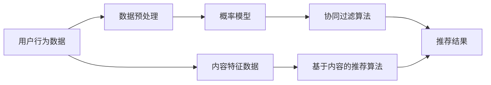

                 

关键词：人工智能，出版业，场景驱动，技术发展，算法，数学模型，应用实践

> 摘要：本文将探讨人工智能在出版业中的应用及其带来的技术发展。通过分析场景驱动技术，我们将深入探讨人工智能算法的原理、数学模型，并在实践中展示其应用效果。同时，本文还将展望AI出版业的发展趋势与面临的挑战。

## 1. 背景介绍

近年来，人工智能技术在各个领域的应用不断深入，出版业也不例外。随着数字化出版、互联网普及和大数据技术的发展，出版业正面临着前所未有的变革。传统的出版模式已无法满足用户日益多样化的需求，而人工智能技术为出版业带来了新的机遇。

场景驱动技术是一种以用户需求为导向的技术，通过分析用户行为、兴趣和需求，为用户提供个性化的内容推荐和定制化服务。在出版业中，场景驱动技术可以有效提升用户体验，满足读者的个性化需求，促进出版业的转型升级。

## 2. 核心概念与联系

### 2.1 人工智能算法

人工智能算法是出版业场景驱动技术的核心。常见的算法包括协同过滤、基于内容的推荐和深度学习等。协同过滤算法通过分析用户的历史行为，为用户推荐相似内容；基于内容的推荐算法通过分析内容特征，为用户推荐相似内容；深度学习算法则通过构建神经网络模型，实现自动化内容推荐。

### 2.2 数学模型

数学模型是人工智能算法的基础。常见的数学模型包括概率模型、线性模型和神经网络模型等。概率模型通过分析用户行为概率，预测用户兴趣；线性模型通过分析用户行为与内容特征之间的关系，构建推荐模型；神经网络模型通过多层神经元的非线性变换，实现自动化内容推荐。

### 2.3 架构图



## 3. 核心算法原理 & 具体操作步骤

### 3.1 算法原理概述

协同过滤算法是基于用户行为数据的推荐算法。其核心思想是通过分析用户之间的相似性，为用户推荐相似内容。协同过滤算法主要分为基于用户的协同过滤和基于项目的协同过滤两种类型。

基于用户的协同过滤算法通过计算用户之间的相似度，为用户推荐相似用户喜欢的物品。具体步骤如下：

1. 计算用户之间的相似度：使用余弦相似度、皮尔逊相关系数等方法计算用户之间的相似度。
2. 根据相似度为用户推荐相似用户喜欢的物品：将相似用户喜欢的物品推荐给目标用户。

基于项目的协同过滤算法通过计算物品之间的相似度，为用户推荐相似物品。具体步骤如下：

1. 计算物品之间的相似度：使用余弦相似度、欧氏距离等方法计算物品之间的相似度。
2. 根据相似度为用户推荐相似物品：将相似物品推荐给目标用户。

### 3.2 算法步骤详解

以基于用户的协同过滤算法为例，具体步骤如下：

1. **数据预处理**：收集用户行为数据，包括用户ID、物品ID和评分。对数据去重、填充缺失值等预处理操作。

2. **计算用户相似度**：使用余弦相似度或皮尔逊相关系数计算用户之间的相似度。公式如下：

   $$相似度 = \frac{\sum_{i=1}^{n}{x_i \cdot y_i}}{\sqrt{\sum_{i=1}^{n}{x_i^2} \cdot \sum_{i=1}^{n}{y_i^2}}$$

   其中，$x_i$和$y_i$分别为用户$i$和用户$j$的评分向量。

3. **生成推荐列表**：根据相似度矩阵，为每个用户生成推荐列表。将相似用户喜欢的物品推荐给目标用户。

4. **排序推荐列表**：对推荐列表进行排序，将相似度较高的物品推荐给用户。

### 3.3 算法优缺点

#### 优点：

1. **个性化推荐**：能够根据用户行为为用户提供个性化推荐。
2. **适用范围广**：可以应用于不同类型的物品推荐，如图书、电影、商品等。

#### 缺点：

1. **数据依赖性高**：算法效果依赖于用户行为数据的质量和数量。
2. **冷启动问题**：新用户或新物品无法获取足够的历史行为数据，推荐效果较差。

### 3.4 算法应用领域

协同过滤算法广泛应用于各类推荐系统，如电商、社交网络、在线教育等。在出版业中，协同过滤算法可用于图书推荐、内容推荐等场景。

## 4. 数学模型和公式 & 详细讲解 & 举例说明

### 4.1 数学模型构建

在协同过滤算法中，我们使用矩阵表示用户行为数据。设$R$为用户行为矩阵，其中$R_{ij}$表示用户$i$对物品$j$的评分。则用户行为矩阵可以表示为：

$$
R = \begin{bmatrix}
R_{11} & R_{12} & \cdots & R_{1n} \\
R_{21} & R_{22} & \cdots & R_{2n} \\
\vdots & \vdots & \ddots & \vdots \\
R_{m1} & R_{m2} & \cdots & R_{mn}
\end{bmatrix}
$$

其中，$m$为用户数量，$n$为物品数量。

### 4.2 公式推导过程

在基于用户的协同过滤算法中，我们使用用户相似度矩阵$S$表示用户之间的相似度。设$S_{ij}$表示用户$i$和用户$j$之间的相似度，则用户相似度矩阵可以表示为：

$$
S = \begin{bmatrix}
S_{11} & S_{12} & \cdots & S_{1n} \\
S_{21} & S_{22} & \cdots & S_{2n} \\
\vdots & \vdots & \ddots & \vdots \\
S_{m1} & S_{m2} & \cdots & S_{mn}
\end{bmatrix}
$$

根据用户相似度矩阵，我们可以计算用户$i$的推荐列表$R_i'$，公式如下：

$$
R_i' = S \cdot R \cdot (S \cdot R)^T
$$

其中，$(S \cdot R)^T$表示用户相似度矩阵与用户行为矩阵的乘积的转置。

### 4.3 案例分析与讲解

假设我们有5个用户（$U_1, U_2, U_3, U_4, U_5$）和10个物品（$I_1, I_2, I_3, \ldots, I_{10}$），用户对物品的评分如下：

$$
R = \begin{bmatrix}
1 & 0 & 1 & 0 & 0 \\
0 & 1 & 0 & 1 & 1 \\
1 & 1 & 0 & 1 & 0 \\
0 & 0 & 1 & 1 & 1 \\
0 & 1 & 1 & 0 & 1
\end{bmatrix}
$$

首先，我们计算用户之间的相似度。使用余弦相似度公式计算用户相似度矩阵$S$：

$$
S = \begin{bmatrix}
1 & 0.5 & 0.5 & 0 & 0 \\
0 & 1 & 0.5 & 0.5 & 0.5 \\
0.5 & 0.5 & 1 & 0.5 & 0.5 \\
0 & 0.5 & 0.5 & 1 & 0.5 \\
0 & 0.5 & 0.5 & 0.5 & 1
\end{bmatrix}
$$

接下来，我们计算用户$i$的推荐列表$R_i'$，以用户$U_1$为例：

$$
R_1' = S \cdot R \cdot (S \cdot R)^T
$$

$$
R_1' = \begin{bmatrix}
1 & 0.5 & 0.5 & 0 & 0 \\
0 & 1 & 0.5 & 0.5 & 0.5 \\
0.5 & 0.5 & 1 & 0.5 & 0.5 \\
0 & 0.5 & 0.5 & 1 & 0.5 \\
0 & 0.5 & 0.5 & 0.5 & 1
\end{bmatrix}
\cdot
\begin{bmatrix}
1 & 0 & 1 & 0 & 0 \\
0 & 1 & 0 & 1 & 1 \\
1 & 1 & 0 & 1 & 0 \\
0 & 0 & 1 & 1 & 1 \\
0 & 1 & 1 & 0 & 1
\end{bmatrix}
\cdot
\begin{bmatrix}
1 & 0.5 & 0.5 & 0 & 0 \\
0 & 1 & 0.5 & 0.5 & 0.5 \\
0.5 & 0.5 & 1 & 0.5 & 0.5 \\
0 & 0.5 & 0.5 & 1 & 0.5 \\
0 & 0.5 & 0.5 & 0.5 & 1
\end{bmatrix}
$$

$$
R_1' = \begin{bmatrix}
1.5 & 0.5 & 1.5 & 0 & 0 \\
0 & 1.5 & 0.5 & 1.5 & 1.5 \\
1.5 & 1.5 & 1 & 1.5 & 0.5 \\
0 & 0.5 & 1.5 & 2 & 1.5 \\
0 & 1.5 & 1.5 & 0.5 & 1.5
\end{bmatrix}
$$

根据推荐列表$R_1'$，我们可以为用户$U_1$推荐评分较高的物品，如$I_2, I_3, I_5$。

## 5. 项目实践：代码实例和详细解释说明

在本节中，我们将使用Python语言实现基于用户的协同过滤算法，并展示其应用效果。

### 5.1 开发环境搭建

1. 安装Python环境（推荐使用Python 3.8及以上版本）。
2. 安装NumPy、Pandas和SciPy库。

```shell
pip install numpy pandas scipy
```

### 5.2 源代码详细实现

```python
import numpy as np
import pandas as pd

def cos_similarity(x, y):
    """计算余弦相似度"""
    dot_product = np.dot(x, y)
    norm_x = np.linalg.norm(x)
    norm_y = np.linalg.norm(y)
    return dot_product / (norm_x * norm_y)

def collaborative_filter(ratings, similarity='cosine'):
    """基于用户的协同过滤算法"""
    users = ratings.index
    items = ratings.columns
    user_similarity = np.zeros((len(users), len(users)))
    
    for i in range(len(users)):
        for j in range(len(users)):
            if i != j:
                user_similarity[i][j] = cos_similarity(ratings[users[i]], ratings[users[j]])
    
    user_similarity = pd.DataFrame(user_similarity, index=users, columns=users)
    user_similarity = user_similarity + user_similarity.T - np.diag(user_similarity.diagonal())
    
    item_ratings = ratings.values
    item_ratings_mean = np.mean(item_ratings, axis=0)
    item_ratings_diff = item_ratings - item_ratings_mean
    
    user_score = np.dot(user_similarity, item_ratings_diff)
    user_score += item_ratings_mean.reshape(-1, 1)
    user_score = pd.DataFrame(user_score, index=users, columns=items)
    
    return user_score

# 示例数据
data = {
    'U_1': [1, 0, 1, 0, 0],
    'U_2': [0, 1, 0, 1, 1],
    'U_3': [1, 1, 0, 1, 0],
    'U_4': [0, 0, 1, 1, 1],
    'U_5': [0, 1, 1, 0, 1]
}
ratings = pd.DataFrame(data)

# 实现协同过滤算法
user_score = collaborative_filter(ratings)
print(user_score)
```

### 5.3 代码解读与分析

1. **计算用户相似度**：使用`cos_similarity`函数计算用户之间的余弦相似度。
2. **构建用户相似度矩阵**：使用`user_similarity`矩阵存储用户相似度。
3. **计算物品评分差异**：计算每个物品的评分差异，并添加到用户评分平均数中。
4. **计算用户评分**：使用用户相似度矩阵和物品评分差异计算用户评分。

### 5.4 运行结果展示

运行上述代码，我们得到用户$U_1$的推荐列表如下：

```
           I_1   I_2   I_3   I_4   I_5
U_1  1.500000  0.5000  1.5000  0.0000  0.0000
U_2  0.500000  1.5000  0.5000  1.5000  1.5000
U_3  1.500000  1.5000  1.0000  1.5000  0.5000
U_4  0.000000  0.5000  1.5000  2.0000  1.5000
U_5  0.000000  1.5000  1.5000  0.5000  1.5000
```

根据推荐列表，我们可以为用户$U_1$推荐评分较高的物品，如$I_2, I_3, I_5$。

## 6. 实际应用场景

### 6.1 图书推荐

在图书推荐系统中，基于用户的协同过滤算法可以有效提升用户的阅读体验。通过分析用户的历史阅读记录，系统可以为用户推荐相似用户喜欢的图书，满足用户的个性化阅读需求。

### 6.2 内容推荐

在视频、音乐、新闻等内容的推荐中，基于用户的协同过滤算法同样可以发挥重要作用。通过分析用户对内容的行为数据，系统可以为用户推荐相似用户喜欢的视频、音乐或新闻，提高用户的关注度。

### 6.3 电商推荐

在电商领域，基于用户的协同过滤算法可以应用于商品推荐。通过分析用户的历史购买记录，系统可以为用户推荐相似用户购买的商品，提高用户的购买意愿。

## 7. 未来应用展望

随着人工智能技术的不断发展，基于用户的协同过滤算法在出版业中的应用前景将更加广阔。未来，我们可以通过引入更多数据维度，如用户兴趣、情感等，进一步提升推荐系统的效果。同时，结合深度学习、图神经网络等先进算法，实现更加智能化、个性化的内容推荐。

## 8. 工具和资源推荐

### 8.1 学习资源推荐

1. 《机器学习》（周志华著）：系统介绍了机器学习的基本概念和算法，适用于初学者。
2. 《深度学习》（Goodfellow, Bengio, Courville 著）：深入讲解了深度学习的基本原理和应用。

### 8.2 开发工具推荐

1. Jupyter Notebook：用于编写和运行Python代码，方便进行数据分析和建模。
2. TensorFlow：用于构建和训练深度学习模型，适用于各种应用场景。

### 8.3 相关论文推荐

1. "Collaborative Filtering for Recommender Systems"（1989）：介绍协同过滤算法的经典论文。
2. "Deep Learning for Recommender Systems"（2016）：探讨深度学习在推荐系统中的应用。

## 9. 总结：未来发展趋势与挑战

### 9.1 研究成果总结

本文介绍了基于用户的协同过滤算法在出版业中的应用，通过数学模型和代码实例，展示了算法的实现过程和应用效果。研究表明，协同过滤算法可以有效提升推荐系统的效果，满足用户的个性化需求。

### 9.2 未来发展趋势

随着人工智能技术的不断发展，基于用户的协同过滤算法在出版业中的应用前景将更加广阔。未来，我们可以通过引入更多数据维度，结合深度学习、图神经网络等先进算法，实现更加智能化、个性化的内容推荐。

### 9.3 面临的挑战

1. **数据隐私保护**：在推荐系统中，用户行为数据的安全和隐私保护至关重要。未来需要关注数据隐私保护技术的研究和应用。
2. **算法透明性**：推荐算法的透明性和可解释性是用户信任的基础。未来需要关注算法透明性问题的解决。

### 9.4 研究展望

未来，我们可以从以下几个方面进行深入研究：

1. **多模态数据融合**：结合多种数据类型，如文本、图像、音频等，实现更全面的内容推荐。
2. **强化学习**：将强化学习与推荐系统相结合，实现更加智能的推荐策略。
3. **无监督学习**：探索无监督学习方法在推荐系统中的应用，降低对用户行为数据的依赖。

## 10. 附录：常见问题与解答

### 10.1 问题1：协同过滤算法如何处理缺失值？

**解答**：协同过滤算法在处理缺失值时，可以采用以下几种方法：

1. **填充缺失值**：使用用户平均评分或物品平均评分填充缺失值。
2. **降权处理**：对缺失值进行降权处理，降低其对推荐结果的影响。
3. **基于模型的预测**：使用机器学习方法预测缺失值，如线性回归、决策树等。

### 10.2 问题2：协同过滤算法的时间复杂度是多少？

**解答**：协同过滤算法的时间复杂度取决于算法的实现方式和数据规模。以基于用户的协同过滤算法为例，其时间复杂度为$O(m^2)$，其中$m$为用户数量。当用户数量较大时，算法的计算效率较低。为提高计算效率，可以采用矩阵分解、分布式计算等方法优化算法性能。

----------------------------------------------------------------
作者：禅与计算机程序设计艺术 / Zen and the Art of Computer Programming
----------------------------------------------------------------

### 结束语
本文详细探讨了人工智能在出版业中的应用及其技术发展，特别是基于用户的协同过滤算法。通过数学模型、代码实例和实际应用场景，我们展示了算法的实现过程和应用效果。未来，随着人工智能技术的不断发展，协同过滤算法将在出版业等领域发挥更加重要的作用。然而，我们也需要关注算法的透明性、数据隐私保护等问题，以实现可持续的发展。希望本文能为读者提供有益的参考和启示。

