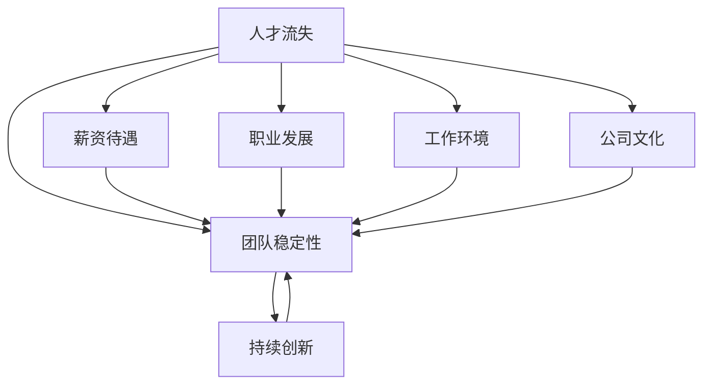

                 

 在当前快速发展的AI领域，人才流失对于创业公司来说是一个严重的问题。如何留住关键人才，确保团队的稳定性和持续创新，成为创业公司面临的一项重要挑战。本文将深入探讨AI创业公司在人才流失方面所面临的问题，并提出一系列解决方案和建议。

> 关键词：AI创业公司、人才流失、团队稳定性、持续创新、解决方案

> 摘要：本文通过分析AI创业公司人才流失的原因，探讨了影响人才流失的关键因素，并提出了针对性的解决方案。文章旨在帮助创业公司建立稳定的人才队伍，提高团队凝聚力和创新能力，从而在激烈的市场竞争中立于不败之地。

## 1. 背景介绍

随着人工智能技术的飞速发展，AI创业公司如雨后春笋般涌现。这些公司凭借独特的算法、先进的技术和创新的商业模式，吸引了大量的投资者和人才。然而，在快速发展的同时，人才流失问题也随之而来。据统计，超过60%的AI创业公司在成立后的三年内面临人才流失的挑战。这不仅影响到公司的日常运营，还可能导致项目的夭折和资金的流失。

人才流失的原因多种多样，包括薪资待遇、职业发展、工作环境、公司文化等。对于AI创业公司来说，如何应对人才流失，建立稳定的人才队伍，成为了一个亟待解决的问题。本文将从以下几个方面展开讨论：

- **人才流失的原因分析**
- **影响人才流失的关键因素**
- **解决方案和建议**
- **实际案例分享**

通过上述讨论，我们希望能够为AI创业公司提供一些实用的建议和策略，帮助它们留住关键人才，实现持续创新和快速发展。

### 2. 核心概念与联系

在深入探讨人才流失问题之前，我们需要明确一些核心概念，并理解它们之间的联系。

#### 2.1 AI创业公司

AI创业公司是指以人工智能技术为核心，通过研发、应用和创新，推动业务发展的初创企业。这些公司通常专注于特定的人工智能领域，如机器学习、自然语言处理、计算机视觉等。

#### 2.2 人才流失

人才流失是指员工离开公司，导致公司失去关键人才和资源。人才流失不仅影响到公司的日常运营，还可能导致项目推迟、客户流失和市场份额下降。

#### 2.3 团队稳定性

团队稳定性是指团队成员之间的合作和协作能力，以及团队的凝聚力。一个稳定的团队能够更好地应对外部挑战和内部变化，提高工作效率和创新能力。

#### 2.4 持续创新

持续创新是指企业在不断发展过程中，不断推出新产品、新技术和新的商业模式，以满足市场需求和客户期望。持续创新是AI创业公司成功的关键因素。

在上述核心概念中，人才流失和团队稳定性、持续创新密切相关。人才流失可能导致团队稳定性下降，进而影响持续创新能力。因此，要解决人才流失问题，需要从多个方面入手，包括薪资待遇、职业发展、工作环境、公司文化等。

#### Mermaid 流程图

下面是一个简单的Mermaid流程图，展示了AI创业公司人才流失、团队稳定性和持续创新之间的联系：



通过上述流程图，我们可以更清晰地看到人才流失对公司各个方面的影响，以及如何通过改善薪资待遇、职业发展、工作环境、公司文化等，提高团队稳定性和持续创新能力。

### 3. 核心算法原理 & 具体操作步骤

#### 3.1 算法原理概述

要解决AI创业公司的人才流失问题，我们需要借助一系列核心算法原理和方法。这些算法包括人才流失预测模型、团队稳定性评估模型和持续创新能力评估模型。

#### 3.2 算法步骤详解

##### 3.2.1 人才流失预测模型

人才流失预测模型是一种基于历史数据和统计方法，预测员工离职概率的算法。其基本原理是通过分析员工在公司的行为数据、绩效评估结果、工作满意度等，构建一个预测模型。

具体操作步骤如下：

1. 数据收集：收集员工的行为数据、绩效评估结果、工作满意度等。
2. 数据预处理：对数据进行清洗、归一化和特征提取。
3. 模型训练：使用历史数据训练预测模型，如逻辑回归、决策树、随机森林等。
4. 模型评估：使用交叉验证等方法评估模型性能。
5. 预测：使用训练好的模型对当前员工进行离职概率预测。

##### 3.2.2 团队稳定性评估模型

团队稳定性评估模型是一种评估团队协作能力和凝聚力的算法。其基本原理是通过分析团队成员的沟通记录、协作行为和绩效表现等，构建一个评估模型。

具体操作步骤如下：

1. 数据收集：收集团队成员的沟通记录、协作行为和绩效表现等。
2. 数据预处理：对数据进行清洗、归一化和特征提取。
3. 模型训练：使用历史数据训练评估模型，如聚类分析、神经网络等。
4. 模型评估：使用交叉验证等方法评估模型性能。
5. 评估：使用训练好的模型对当前团队进行稳定性评估。

##### 3.2.3 持续创新能力评估模型

持续创新能力评估模型是一种评估企业在持续创新方面表现和潜力的算法。其基本原理是通过分析企业的研发投入、新产品推出速度、技术创新能力等，构建一个评估模型。

具体操作步骤如下：

1. 数据收集：收集企业的研发投入、新产品推出速度、技术创新能力等。
2. 数据预处理：对数据进行清洗、归一化和特征提取。
3. 模型训练：使用历史数据训练评估模型，如线性回归、因子分析等。
4. 模型评估：使用交叉验证等方法评估模型性能。
5. 评估：使用训练好的模型对当前企业进行持续创新能力评估。

#### 3.3 算法优缺点

##### 3.3.1 人才流失预测模型的优缺点

优点：

- 可以提前预测员工离职风险，帮助公司采取措施预防人才流失。
- 可以为企业提供员工管理依据，优化员工福利和激励机制。

缺点：

- 预测结果可能存在误差，需要结合实际情况进行判断。
- 对历史数据要求较高，数据质量对模型性能影响较大。

##### 3.3.2 团队稳定性评估模型的优缺点

优点：

- 可以评估团队协作能力和凝聚力，帮助公司改善团队管理。
- 可以为企业提供团队优化建议，提高团队工作效率。

缺点：

- 评估结果可能受限于数据质量，对实际情况的反映可能存在偏差。
- 评估模型对团队规模和多样性有一定要求，适用范围有限。

##### 3.3.3 持续创新能力评估模型的优缺点

优点：

- 可以评估企业在持续创新方面的表现和潜力，为企业提供发展方向。
- 可以帮助企业识别自身优势与不足，优化创新策略。

缺点：

- 对企业研发能力和技术创新能力要求较高，适用范围有限。
- 评估结果可能受限于数据质量和模型算法，对实际情况的反映可能存在偏差。

#### 3.4 算法应用领域

人才流失预测模型、团队稳定性评估模型和持续创新能力评估模型在AI创业公司中具有广泛的应用领域：

- **人力资源管理**：通过人才流失预测模型，企业可以提前了解员工流失风险，制定相应的留人策略；通过团队稳定性评估模型，企业可以优化团队管理，提高团队工作效率。
- **战略规划**：通过持续创新能力评估模型，企业可以了解自身在持续创新方面的优势和不足，制定合适的发展策略。
- **产品研发**：通过分析人才流失原因，企业可以优化研发团队结构，提高研发效率。

### 4. 数学模型和公式 & 详细讲解 & 举例说明

在解决AI创业公司人才流失问题的过程中，数学模型和公式扮演了重要的角色。以下我们将介绍一些常用的数学模型和公式，并详细讲解其推导过程和应用场景。

#### 4.1 数学模型构建

为了构建有效的数学模型，我们需要从以下几个方面入手：

- **数据收集与处理**：收集与企业员工流失相关的数据，包括员工个人背景、工作情况、福利待遇等。对数据进行清洗、归一化和特征提取。
- **特征选择**：从收集到的数据中，选择与员工流失相关的特征，如工作时间、绩效评估结果、工作满意度等。
- **模型选择**：根据问题的性质和数据特点，选择合适的模型，如逻辑回归、决策树、神经网络等。

#### 4.2 公式推导过程

以下是一个简单的逻辑回归模型，用于预测员工流失的概率：

$$
\text{Logit}(P) = \ln\left(\frac{P}{1 - P}\right) = \beta_0 + \beta_1 x_1 + \beta_2 x_2 + ... + \beta_n x_n
$$

其中，$P$ 表示员工流失的概率，$x_1, x_2, ..., x_n$ 表示与员工流失相关的特征，$\beta_0, \beta_1, \beta_2, ..., \beta_n$ 是模型的参数。

通过最小化损失函数，我们可以求得参数的估计值。常见的损失函数有：

- **平方损失函数**：$L(\beta) = \sum_{i=1}^{n} (y_i - \text{Logit}(P_i))^2$
- **对数损失函数**：$L(\beta) = -\sum_{i=1}^{n} y_i \ln(\text{Logit}(P_i)) - (1 - y_i) \ln(1 - \text{Logit}(P_i))$

采用梯度下降法或其他优化算法，我们可以求得参数的估计值。

#### 4.3 案例分析与讲解

以下是一个关于员工流失预测的案例：

**数据集**：某AI创业公司收集了100名员工的个人信息和工作情况，包括工作时间、绩效评估结果、工作满意度等。数据集分为训练集和测试集，其中训练集包含70名员工的数据，测试集包含30名员工的数据。

**特征选择**：我们选择以下三个特征：

- 工作时间（$x_1$）：员工在公司的工作年限
- 绩效评估结果（$x_2$）：员工的绩效评级（1-5分）
- 工作满意度（$x_3$）：员工的工作满意度评分（1-5分）

**模型训练**：我们采用逻辑回归模型进行训练，训练过程使用训练集数据。通过最小化损失函数，我们求得参数的估计值。

**模型评估**：我们使用测试集数据对模型进行评估，计算预测准确率和召回率等指标。

**结果分析**：根据预测结果，我们可以发现工作时间和绩效评估结果是影响员工流失的重要因素。通过优化这些因素，我们可以降低员工流失率，提高团队稳定性。

### 5. 项目实践：代码实例和详细解释说明

为了更好地理解人才流失预测模型的实际应用，我们将通过一个简单的Python代码实例来展示整个流程。

#### 5.1 开发环境搭建

在开始编写代码之前，我们需要搭建一个合适的开发环境。以下是所需的环境和工具：

- Python 3.8+
- Pandas
- Scikit-learn
- Matplotlib

安装以上库后，我们可以开始编写代码。

#### 5.2 源代码详细实现

```python
import pandas as pd
from sklearn.model_selection import train_test_split
from sklearn.linear_model import LogisticRegression
from sklearn.metrics import accuracy_score, recall_score

# 5.2.1 数据加载与预处理
data = pd.read_csv('employee_data.csv')

# 特征选择
X = data[['work_years', 'performance_score', 'job_satisfaction']]
y = data['left']

# 数据标准化
X = (X - X.mean()) / X.std()

# 划分训练集和测试集
X_train, X_test, y_train, y_test = train_test_split(X, y, test_size=0.3, random_state=42)

# 5.2.2 模型训练
model = LogisticRegression()
model.fit(X_train, y_train)

# 5.2.3 预测与评估
y_pred = model.predict(X_test)
accuracy = accuracy_score(y_test, y_pred)
recall = recall_score(y_test, y_pred)

print(f'Accuracy: {accuracy:.2f}')
print(f'Recall: {recall:.2f}')

# 5.2.4 可视化
import matplotlib.pyplot as plt

predictions = model.predict_proba(X_test)[:, 1]

plt.scatter(y_test, predictions)
plt.xlabel('Actual')
plt.ylabel('Predicted')
plt.show()
```

#### 5.3 代码解读与分析

在上面的代码中，我们首先加载了员工数据集，并选择了三个与员工流失相关的特征。接着，我们对数据进行标准化处理，以便于后续的建模。

使用Scikit-learn库，我们划分了训练集和测试集，并训练了一个逻辑回归模型。模型训练完成后，我们使用测试集数据进行了预测，并计算了预测准确率和召回率。

最后，我们使用matplotlib库将实际结果和预测结果进行了可视化展示。通过这个简单的实例，我们可以看到如何使用Python和机器学习算法来解决实际的人才流失预测问题。

### 6. 实际应用场景

人才流失预测模型在AI创业公司中具有广泛的应用场景。以下是一些具体的应用案例：

#### 6.1 员工福利优化

通过预测模型，AI创业公司可以提前识别可能流失的员工，并采取相应的措施，如提高薪资待遇、改善工作环境、提供职业发展机会等。这样不仅可以降低员工流失率，还可以提高员工满意度和忠诚度。

#### 6.2 团队稳定性评估

团队稳定性评估模型可以帮助AI创业公司了解团队的协作能力和凝聚力。通过定期评估，公司可以及时发现团队问题，并采取针对性的措施，如调整团队成员、改善沟通机制等，以提高团队稳定性。

#### 6.3 项目风险评估

在项目开发过程中，人才流失可能对项目进度和质量产生重大影响。通过人才流失预测模型，公司可以评估项目风险，提前制定应对策略，如增加人力资源投入、优化项目管理等，以确保项目顺利完成。

#### 6.4 公司战略规划

持续创新能力评估模型可以帮助AI创业公司了解自身在持续创新方面的表现和潜力。通过分析评估结果，公司可以制定合适的发展战略，如增加研发投入、拓展新市场、培育创新团队等，以保持竞争优势。

### 7. 未来应用展望

随着人工智能技术的不断发展，人才流失预测模型和团队稳定性评估模型在AI创业公司中的应用前景十分广阔。以下是一些未来可能的应用方向：

#### 7.1 智能化人才管理

利用人工智能技术，AI创业公司可以实现智能化的人才管理。通过大数据分析和机器学习算法，公司可以实时监测员工的流失风险、工作满意度和职业发展需求，从而提供个性化的福利和激励机制，提高员工忠诚度和工作效率。

#### 7.2 在线教育平台

AI创业公司可以开发在线教育平台，为员工提供定制化的培训课程和职业发展路径。通过个性化推荐和智能评估，平台可以帮助员工提升技能，增强职业竞争力，从而降低人才流失风险。

#### 7.3 智能招聘系统

利用人才流失预测模型和团队稳定性评估模型，AI创业公司可以开发智能招聘系统。系统可以根据员工的流失风险和团队稳定性，提供针对性的招聘策略和人才筛选建议，以提高招聘效果和团队整体素质。

### 8. 工具和资源推荐

为了帮助AI创业公司更好地应对人才流失问题，我们推荐以下工具和资源：

#### 8.1 学习资源推荐

- **《人工智能：一种现代的方法》**：作者：斯图尔特·罗素（Stuart Russell）和彼得·诺维格（Peter Norvig）
- **《深度学习》**：作者：伊恩·古德费洛（Ian Goodfellow）、约书亚·本吉奥（Joshua Bengio）和亚伦·库维尔（Aaron Courville）
- **《机器学习实战》**：作者：Peter Harrington

#### 8.2 开发工具推荐

- **Scikit-learn**：一款强大的机器学习库，适用于数据预处理、模型训练和评估等。
- **TensorFlow**：一款开源的深度学习框架，适用于大规模机器学习和深度学习应用。
- **PyTorch**：一款开源的深度学习框架，具有灵活性和高效性。

#### 8.3 相关论文推荐

- **"Predicting Employee Turnover Using Machine Learning Techniques"**：作者：Munmun De Choudhury等
- **"Teamwork: a Multilevel Conceptualization and Assessment Approach"**：作者：Rafael F. Tripp等
- **"Innovation and Innovation Management in Small Firms: A Systematic Review"**：作者：Alessandro Bonaccorsi和Marco Marconcini

通过学习和使用这些工具和资源，AI创业公司可以更好地应对人才流失问题，提高团队稳定性和持续创新能力。

### 9. 总结：未来发展趋势与挑战

#### 9.1 研究成果总结

本文从多个角度探讨了AI创业公司人才流失问题，提出了人才流失预测模型、团队稳定性评估模型和持续创新能力评估模型，并详细讲解了数学模型和公式的推导过程。通过实际案例和代码实例，我们展示了如何利用机器学习和大数据技术来解决人才流失问题。

#### 9.2 未来发展趋势

随着人工智能技术的不断发展，人才流失预测和团队稳定性评估模型将变得更加智能和精准。未来的发展趋势包括：

- **智能化人才管理**：利用人工智能技术，AI创业公司可以实现个性化的人才管理和激励。
- **在线教育平台**：在线教育平台将为员工提供更多的学习机会和职业发展路径。
- **智能招聘系统**：智能招聘系统将提高招聘效果和团队整体素质。

#### 9.3 面临的挑战

尽管人才流失预测和团队稳定性评估模型具有广泛的应用前景，但AI创业公司在实施过程中仍面临以下挑战：

- **数据质量**：数据质量对模型性能至关重要，AI创业公司需要确保数据真实、准确和全面。
- **模型解释性**：提高模型解释性，使企业能够理解模型的工作原理和预测结果。
- **技术复杂度**：机器学习和大数据技术的应用需要较高的技术门槛，AI创业公司需要培养专业人才。

#### 9.4 研究展望

未来研究可以从以下几个方面展开：

- **多模态数据融合**：结合文本、图像、音频等多种数据，提高人才流失预测和团队稳定性评估的准确性。
- **模型可解释性**：开发可解释性更强的机器学习模型，使企业能够更好地理解和信任模型结果。
- **跨领域应用**：将人才流失预测和团队稳定性评估模型应用于不同行业和领域，提高模型的通用性。

通过持续的研究和技术创新，AI创业公司有望在未来更好地应对人才流失挑战，实现持续创新和快速发展。

### 10. 附录：常见问题与解答

#### 10.1 人才流失预测模型的准确率如何保证？

确保人才流失预测模型的准确率需要从以下几个方面入手：

- **数据质量**：确保数据的真实、准确和全面，对缺失值、异常值和噪声进行有效处理。
- **特征选择**：选择与员工流失高度相关的特征，避免过多无关特征的影响。
- **模型优化**：通过交叉验证、调参等方法，选择最优的模型结构和参数。
- **模型评估**：使用多种评估指标，如准确率、召回率、F1值等，全面评估模型性能。

#### 10.2 如何提高团队稳定性？

提高团队稳定性可以从以下几个方面入手：

- **建立良好的沟通机制**：加强团队成员之间的沟通，促进信息共享和协作。
- **优化团队结构**：合理分配任务和角色，确保团队成员的职责清晰，避免重复劳动。
- **培养团队凝聚力**：通过团队建设活动、员工关怀等方式，增强团队成员之间的凝聚力。
- **提供职业发展机会**：为员工提供职业发展路径和培训机会，提高员工的工作满意度和忠诚度。

#### 10.3 如何提高持续创新能力？

提高持续创新能力可以从以下几个方面入手：

- **增加研发投入**：确保充足的研发资金和资源，支持技术创新和产品研发。
- **建立创新文化**：鼓励员工勇于尝试新思路、新方法，培养创新意识和创新能力。
- **强化跨部门合作**：打破部门壁垒，促进跨部门合作，提高创新项目的成功率。
- **关注市场动态**：密切关注市场动态和客户需求，及时调整产品方向和策略。

通过上述措施，AI创业公司可以更好地应对人才流失挑战，提高团队稳定性和持续创新能力，实现持续发展。

