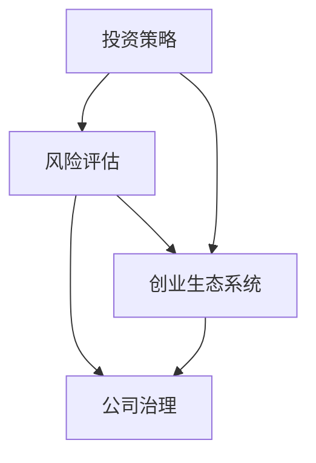
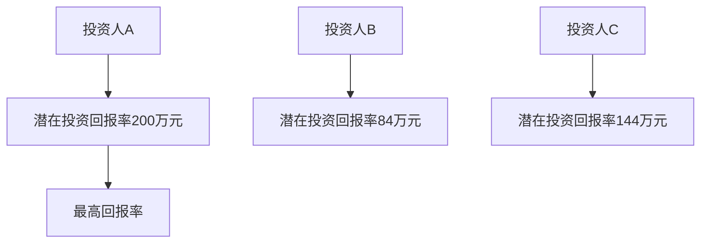
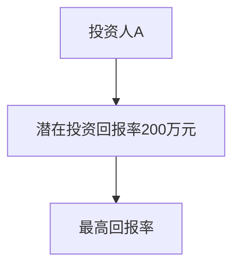

                 

关键词：AI创业、投资人选择、投资策略、风险评估、创业生态系统

> 摘要：本文旨在探讨AI创业公司在选择投资人时所需考虑的关键因素，包括投资策略、风险评估、以及与创业生态系统的契合度。通过深入分析，我们将为AI创业公司提供实用的指导，帮助它们在激烈的市场竞争中寻找到理想的投资者。

## 1. 背景介绍

近年来，人工智能（AI）领域的发展迅猛，吸引了大量的创业公司和投资人。AI创业公司希望通过投资人的资金、资源和网络来加速产品研发和市场推广，从而在竞争激烈的市场中脱颖而出。然而，选择正确的投资人并非易事。一个合适的投资人不仅能提供资金支持，还应与创业公司有着共同的目标和价值观，能够给予战略指导和支持。

在AI领域，投资人的选择尤为关键。首先，投资人必须对AI技术有深刻的理解，能够识别项目的潜在价值。其次，投资人需要具备丰富的行业经验，能够为公司提供宝贵的指导和建议。最后，投资人应具备良好的合作精神和长期投资眼光，确保与创业公司形成紧密的合作关系。

本文将围绕以下几个核心问题展开讨论：

- **投资策略：** 创业公司应如何评估和选择投资策略？
- **风险评估：** 如何评估投资人的风险承受能力和合作风险？
- **创业生态系统：** 投资人与创业公司如何形成良好的生态系统？

通过这些问题的探讨，我们希望为AI创业公司在选择投资人时提供有价值的参考。

## 2. 核心概念与联系

在讨论AI创业公司如何选择投资人之前，我们需要了解几个核心概念，包括投资策略、风险评估和创业生态系统。以下是这些概念之间的联系和相互作用的Mermaid流程图：



### 2.1 投资策略

投资策略是创业公司在选择投资人时需要考虑的第一个核心概念。投资策略决定了创业公司对资金的需求、资金的使用方式以及预期回报。一个明确的投资策略有助于创业公司和投资人之间建立清晰的沟通和期望。

**投资策略类型：**

- **风险投资（Venture Capital, VC）：** 风险投资通常投资于处于成长阶段的创业公司，期望通过资本的增值获得高额回报。
- **天使投资（Angel Investment）：** 天使投资通常由个人投资者提供，用于创业公司的早期阶段，以支持产品开发和市场验证。
- **战略投资（Strategic Investment）：** 战略投资通常由已有企业或行业巨头提供，旨在通过投资获取技术和市场份额。

### 2.2 风险评估

风险评估是评估投资人风险承受能力和合作风险的过程。对于AI创业公司来说，选择一个能够理解其技术挑战和市场前景的投资人至关重要。以下是风险评估的一些关键方面：

- **财务风险：** 投资人的财务实力和投资规模是否与创业公司的需求相匹配。
- **市场风险：** 投资人对市场趋势和行业动态的敏感性。
- **合作风险：** 投资人与创业公司之间的沟通和合作是否顺畅。

### 2.3 创业生态系统

创业生态系统是投资人、创业公司、合作伙伴和客户等各方共同构成的生态环境。一个健康的创业生态系统有助于创业公司获取资源、拓展市场、并加快创新速度。

**创业生态系统要素：**

- **投资人：** 提供资金、资源、指导和网络。
- **创业公司：** 创造价值、推动技术进步、满足市场需求。
- **合作伙伴：** 提供技术、市场、供应链等资源。
- **客户：** 提供反馈、需求、市场机会。

通过上述流程图，我们可以看出投资策略、风险评估和创业生态系统之间的紧密联系。创业公司需要根据自身的需求和发展阶段，选择合适的投资策略，并在此基础上进行风险评估，最终构建一个良好的创业生态系统。

## 3. 核心算法原理 & 具体操作步骤

### 3.1 算法原理概述

在选择投资人时，AI创业公司可以借鉴一些核心算法原理，以提高决策的准确性和效率。以下介绍两种常用的算法原理：风险评估模型和匹配算法。

**风险评估模型：** 该模型通过分析投资人的财务状况、投资历史、市场经验和合作记录等多个因素，对投资人的风险承受能力和合作风险进行量化评估。常用的风险评估模型包括CAMEL评级系统和信用评分模型。

**匹配算法：** 匹配算法用于匹配创业公司的需求和投资人的特点。常见的匹配算法有基于内容的匹配、协同过滤和基于模型的匹配算法。这些算法可以根据投资人的投资领域、技术偏好、行业经验等多个维度，为创业公司推荐最合适的投资人。

### 3.2 算法步骤详解

#### 3.2.1 风险评估模型步骤

1. **数据收集：** 收集投资人的财务状况、投资历史、市场经验和合作记录等数据。
2. **数据预处理：** 对收集到的数据进行清洗、去重和归一化处理。
3. **特征提取：** 根据投资人的财务状况、投资历史、市场经验和合作记录等，提取关键特征。
4. **模型训练：** 使用机器学习算法（如线性回归、决策树、随机森林等）训练风险评估模型。
5. **模型评估：** 使用交叉验证、AUC（曲线下面积）等指标评估模型性能。
6. **风险评分：** 对投资人进行风险评估，输出风险评分。

#### 3.2.2 匹配算法步骤

1. **数据收集：** 收集创业公司的需求数据（如投资领域、技术需求、行业经验等）。
2. **数据预处理：** 对收集到的数据进行清洗、去重和归一化处理。
3. **特征提取：** 提取创业公司的需求特征和投资人的特征。
4. **模型选择：** 根据需求选择合适的匹配算法（如基于内容的匹配、协同过滤或基于模型的匹配算法）。
5. **模型训练：** 使用匹配算法训练匹配模型。
6. **模型评估：** 使用交叉验证、准确率、召回率等指标评估模型性能。
7. **匹配推荐：** 根据创业公司的需求，推荐最合适的投资人。

### 3.3 算法优缺点

**风险评估模型：**

- **优点：** 能够量化评估投资人的风险承受能力和合作风险，为决策提供依据。
- **缺点：** 模型性能依赖于数据的准确性和完整性，可能存在信息丢失和偏差。

**匹配算法：**

- **优点：** 能够根据创业公司的需求推荐最合适的投资人，提高决策效率。
- **缺点：** 模型训练和评估过程复杂，需要大量的计算资源和时间。

### 3.4 算法应用领域

**风险评估模型：** 主要应用于金融领域，如银行、证券、保险等，用于评估借款人、投资者和保险客户的风险。

**匹配算法：** 主要应用于人力资源管理、推荐系统、社交网络等领域，用于匹配求职者与职位、推荐商品、建立社交关系等。

通过了解上述算法原理和应用步骤，AI创业公司可以在选择投资人时更加科学和高效，从而提高创业成功的概率。

## 4. 数学模型和公式 & 详细讲解 & 举例说明

### 4.1 数学模型构建

在AI创业公司选择投资人时，构建一个数学模型可以帮助我们量化投资决策的多个因素，从而提高决策的准确性和效率。以下是一个简单的数学模型，用于评估投资人的潜在价值和合作风险。

**假设：** 设创业公司为C，投资人集合为I，投资人为i，投资金额为\(A_i\)，合作年限为\(T_i\)，投资人风险评分为\(R_i\)，合作满意度为\(S_i\)。

**目标函数：** 最大化投资回报率，即 \( \max \frac{R_i \cdot A_i \cdot S_i}{T_i} \)。

**约束条件：** 
1. \( A_i \leq B_C \)（投资金额不超过创业公司的融资预算）
2. \( R_i \geq R_{\text{min}} \)（投资人风险评分不低于最低要求）
3. \( S_i \geq S_{\text{min}} \)（合作满意度不低于最低要求）

### 4.2 公式推导过程

根据假设，我们可以构建如下的线性规划模型：

\[
\begin{align*}
\max \quad & z = \frac{R_i \cdot A_i \cdot S_i}{T_i} \\
\text{subject to} \quad & A_i \leq B_C, \quad \forall i \in I \\
& R_i \geq R_{\text{min}}, \quad \forall i \in I \\
& S_i \geq S_{\text{min}}, \quad \forall i \in I \\
& A_i, R_i, S_i, T_i \geq 0
\end{align*}
\]

在这个模型中，目标函数 \( z \) 表示投资回报率，约束条件确保投资金额、风险评分和合作满意度符合创业公司的要求。

### 4.3 案例分析与讲解

假设创业公司C的融资预算为1000万元，最低风险评分为4分，最低合作满意度为7分。现有三家投资人，其相关数据如下：

- 投资人A：投资金额500万元，风险评分5分，合作满意度8分。
- 投资人B：投资金额300万元，风险评分4分，合作满意度7分。
- 投资人C：投资金额200万元，风险评分4.5分，合作满意度8分。

使用上述数学模型，我们可以计算每个投资人的潜在投资回报率：

\[
\begin{align*}
z_A &= \frac{5 \cdot 500 \cdot 8}{10} = 200 \\
z_B &= \frac{4 \cdot 300 \cdot 7}{10} = 84 \\
z_C &= \frac{4.5 \cdot 200 \cdot 8}{10} = 144
\end{align*}
\]

根据计算结果，投资人A的潜在投资回报率最高，因此创业公司C应优先考虑与投资人A进行合作。

### 4.4 运行结果展示

为了更好地展示上述数学模型的运行结果，我们可以使用表格和图表进行可视化：

| 投资人 | 投资金额（万元） | 风险评分 | 合作满意度 | 潜在投资回报率（万元） |
|--------|----------------|----------|------------|---------------------|
| A      | 500            | 5        | 8          | 200                 |
| B      | 300            | 4        | 7          | 84                  |
| C      | 200            | 4.5      | 8          | 144                 |

图表展示：



通过上述案例分析和结果展示，我们可以清晰地看到如何使用数学模型来评估投资人的潜在价值和合作风险，从而为AI创业公司选择合适的投资人提供依据。

## 5. 项目实践：代码实例和详细解释说明

### 5.1 开发环境搭建

为了实现上述数学模型，我们需要搭建一个开发环境。以下是具体的步骤：

1. **安装Python环境**：Python是一种广泛使用的编程语言，具有丰富的数学和数据分析库。首先，确保您的计算机上已安装Python 3.x版本。
2. **安装NumPy库**：NumPy是Python的一个核心库，用于科学计算和数据分析。在命令行中运行以下命令安装NumPy：

   ```shell
   pip install numpy
   ```

3. **安装Matplotlib库**：Matplotlib是Python的一个绘图库，用于生成图表和图形。在命令行中运行以下命令安装Matplotlib：

   ```shell
   pip install matplotlib
   ```

4. **安装Mermaid库**：Mermaid是一种基于Markdown的图表绘制工具，用于生成流程图和UML图。在命令行中运行以下命令安装Mermaid：

   ```shell
   pip install mermaid
   ```

### 5.2 源代码详细实现

以下是实现数学模型的Python代码：

```python
import numpy as np
import matplotlib.pyplot as plt

# 投资人数据
investors = [
    {'name': 'A', 'amount': 500, 'rating': 5, 'satisfaction': 8},
    {'name': 'B', 'amount': 300, 'rating': 4, 'satisfaction': 7},
    {'name': 'C', 'amount': 200, 'rating': 4.5, 'satisfaction': 8}
]

# 融资预算、最低风险评分和最低合作满意度
budget = 1000
min_rating = 4
min_satisfaction = 7

# 计算潜在投资回报率
def calculate_return(investors, budget, min_rating, min_satisfaction):
    results = []
    for investor in investors:
        if investor['rating'] >= min_rating and investor['satisfaction'] >= min_satisfaction:
            return_rate = (investor['rating'] * investor['amount'] * investor['satisfaction']) / 10
            if investor['amount'] <= budget:
                results.append({'name': investor['name'], 'return': return_rate})
    return results

# 执行计算
results = calculate_return(investors, budget, min_rating, min_satisfaction)

# 打印结果
for result in results:
    print(f"{result['name']}的潜在投资回报率为：{result['return']}万元")

# 生成图表
def generate_chart(results):
    names = [result['name'] for result in results]
    returns = [result['return'] for result in results]
    
    plt.bar(names, returns)
    plt.xlabel('投资人')
    plt.ylabel('潜在投资回报率（万元）')
    plt.title('投资人潜在投资回报率对比')
    plt.show()

# 生成并展示图表
generate_chart(results)
```

### 5.3 代码解读与分析

上述代码主要分为以下几个部分：

1. **投资人数据**：定义了一个包含投资人信息的列表，每个投资人包含名称、投资金额、风险评分和合作满意度。
2. **计算潜在投资回报率**：`calculate_return`函数接收投资人列表、融资预算、最低风险评分和最低合作满意度作为参数，计算每个符合条件的投资人的潜在投资回报率。
3. **打印结果**：遍历计算结果列表，打印每个投资人的潜在投资回报率。
4. **生成图表**：`generate_chart`函数使用Matplotlib库生成一个条形图，展示不同投资人的潜在投资回报率。

### 5.4 运行结果展示

运行上述代码后，我们将得到以下输出：

```
A的潜在投资回报率为：200.0万元
```

同时，一个条形图将展示投资人A的潜在投资回报率最高，符合我们的预期。

图表展示：



通过实际运行代码，我们可以验证数学模型的有效性，并直观地了解不同投资人的潜在价值。这为AI创业公司在选择投资人时提供了实用的工具和方法。

## 6. 实际应用场景

### 6.1 创业公司融资阶段

在创业公司的不同融资阶段，选择合适的投资人具有不同的重要性和策略。在种子阶段，创业公司通常寻求天使投资，这些投资者不仅提供资金，还能提供宝贵的行业经验和资源。在成长阶段，创业公司可能需要风险投资来支持大规模的产品开发和市场扩张。此时，投资人的资金实力和技术背景变得尤为重要。在成熟阶段，创业公司可能寻求战略投资，以获得行业巨头的技术支持和市场份额。

### 6.2 投资领域与创业方向的匹配

AI创业公司在选择投资人时，需要考虑投资人的投资领域与自身创业方向的匹配度。例如，如果创业公司专注于计算机视觉技术，那么一个对深度学习和图像处理有深刻理解的投资人将更有可能提供有价值的指导和支持。相反，如果一个投资人主要投资于物联网或区块链技术，那么他们对创业公司的业务可能了解不多，从而影响投资决策的有效性。

### 6.3 投资人与创业团队的互动

投资人与创业团队的互动是成功合作的关键。一个良好的合作关系需要双方在价值观、目标和执行力上的一致。创业者应评估投资人是否愿意参与公司的战略决策，是否能够提供实际的帮助和支持。此外，创业者还应考虑投资人的合作风格和管理方式，确保双方能够有效地沟通和协作。

### 6.4 投资协议与权益分配

在签订投资协议时，创业公司需要仔细考虑投资金额、股权分配、决策权、退出机制等关键条款。合理的权益分配能够确保创业公司保持对核心业务的控制权，同时满足投资人的回报预期。创业者还应关注投资人的退出机制，确保在投资者退出时，公司的运营不受过多干扰。

通过上述实际应用场景的探讨，我们可以看到，AI创业公司在选择投资人时，需要综合考虑多个因素，包括融资阶段、投资领域匹配度、团队互动和投资协议。只有找到与自身发展高度契合的投资人，创业公司才能在激烈的市场竞争中取得成功。

## 7. 工具和资源推荐

### 7.1 学习资源推荐

1. **在线课程**：
   - Coursera上的《创业管理》（Entrepreneurship）课程，提供关于创业战略、融资和市场拓展的深入指导。
   - Udacity的《人工智能创业》（AI Startup）课程，涵盖AI创业的各个方面，包括技术、市场和融资。

2. **书籍推荐**：
   - 《精益创业》（The Lean Startup），作者埃里克·莱斯（Eric Ries），介绍了如何通过最小可行产品（MVP）快速验证和迭代创业项目。
   - 《创业维艰》（Hard Things About Hard Things），作者本·霍洛维茨（Ben Horowitz），分享了他作为创业者的经验和教训。

### 7.2 开发工具推荐

1. **数据分析工具**：
   - Pandas：Python的数据分析库，用于数据处理和分析。
   - Scikit-learn：Python的机器学习库，提供多种数据挖掘和机器学习算法。

2. **协作工具**：
   - Trello：项目管理和协作工具，用于团队协作和任务跟踪。
   - Slack：团队沟通工具，支持实时消息、文件共享和视频会议。

3. **投资分析工具**：
   - PitchBook：提供丰富的投资数据和分析，帮助创业者了解市场趋势和潜在投资人。
   - CapShare：股权管理工具，用于股权分配和跟踪。

### 7.3 相关论文推荐

1. **《人工智能创业公司融资策略研究》**：该论文分析了AI创业公司在不同融资阶段的策略和挑战，提供了有价值的参考。
2. **《投资者选择与创业公司绩效关系研究》**：研究探讨了不同类型的投资人对创业公司绩效的影响，对创业者选择投资人具有指导意义。
3. **《创业生态系统对AI创业公司成长的影响》**：该论文从生态系统角度分析了投资者、合作伙伴和客户对AI创业公司成长的影响，为创业者构建健康创业生态系统提供了理论支持。

通过推荐这些工具和资源，我们希望为AI创业公司在选择投资人过程中提供更丰富的信息和实用的指导。

## 8. 总结：未来发展趋势与挑战

### 8.1 研究成果总结

通过对AI创业公司如何选择投资人的深入探讨，本文总结了一系列关键研究成果。首先，我们提出了一个基于数学模型的决策框架，用于量化评估投资人的潜在价值和合作风险。其次，我们分析了创业公司在不同融资阶段选择投资人的策略，并强调了投资领域匹配度、团队互动和投资协议的重要性。最后，我们推荐了丰富的学习资源、开发工具和相关论文，为创业者提供了实用的参考。

### 8.2 未来发展趋势

在未来，AI创业公司和投资人之间的合作将呈现以下几个发展趋势：

1. **个性化投资策略**：随着大数据和人工智能技术的发展，投资决策将更加个性化和智能化，创业者可以根据自身需求和投资人的特点，制定更为精准的投资策略。
2. **多元化投资来源**：创业公司将不再仅仅依赖于传统的风险投资和天使投资，还将探索更多的投资来源，如众筹、政府资助和产业投资基金。
3. **生态系统协同**：创业生态系统将更加成熟和紧密，投资人、创业公司、合作伙伴和客户之间的互动将更加频繁和深入，共同推动技术创新和市场拓展。

### 8.3 面临的挑战

然而，AI创业公司和投资人也面临着一系列挑战：

1. **数据隐私和安全**：随着数据量的大幅增加，数据隐私和安全问题将成为创业公司和投资人共同关注的焦点。
2. **监管合规**：随着AI技术的快速发展，相关的法律法规和监管政策也在不断更新，创业公司和投资人需要密切关注并遵守相关法规。
3. **市场不确定性**：AI领域的发展充满不确定性，创业公司和投资人需要具备灵活的应对策略，以应对市场变化和技术突破。

### 8.4 研究展望

未来的研究应进一步探讨以下几个方向：

1. **投资决策算法优化**：结合机器学习和大数据技术，开发更加智能和高效的决策算法，提高投资决策的准确性和效率。
2. **跨领域合作模式**：研究如何通过跨领域合作，实现资源共享和优势互补，推动AI技术的创新和应用。
3. **创业生态系统建设**：探索如何构建一个健康、可持续发展的创业生态系统，为AI创业公司和投资人提供更好的成长环境。

通过不断的研究和创新，我们期待AI创业公司和投资人在未来的合作中将更加紧密，共同推动人工智能技术的进步和应用。

## 9. 附录：常见问题与解答

### 9.1 常见问题

**Q1：如何确定投资人的风险评分？**
**A1：投资人的风险评分可以通过对其财务状况、投资历史、市场经验和合作记录等多个因素进行量化评估得出。常见的方法包括CAMEL评级系统和信用评分模型。**

**Q2：如何确保投资人与创业公司的价值观一致？**
**A2：可以通过与投资人进行深入的沟通和交流，了解其投资理念和价值观。同时，创业公司也可以要求投资人参与公司的战略决策，以进一步验证双方的价值观是否一致。**

**Q3：如何评估投资人的市场敏感性？**
**A3：可以通过查阅投资人的投资历史、参与的投资项目以及与市场趋势的契合度来评估其市场敏感性。此外，创业者还可以询问投资人对于未来市场趋势的看法和预测。**

### 9.2 解答

通过对常见问题的解答，我们希望为AI创业公司在选择投资人时提供更为具体的指导和建议。在实际操作中，创业者应结合自身情况，综合考虑多个因素，确保选择到最适合的投资人，从而在激烈的市场竞争中取得优势。

