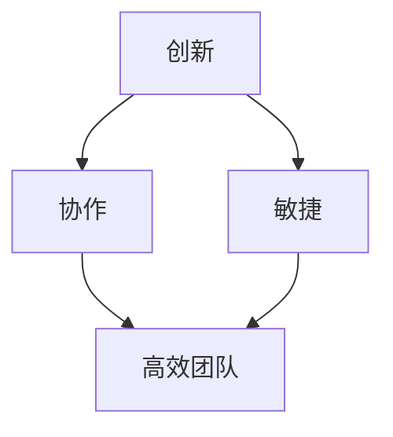

                 

关键词：企业文化建设、AI 创业、创新、协作、敏捷

摘要：在当前快速发展的AI行业中，创业公司需要构建一种独特的企业文化，以激发员工的创新思维、促进团队协作，并保持敏捷的工作方式。本文将探讨AI创业公司在企业文化构建方面的关键要素，并提供实际案例和实践建议。

## 1. 背景介绍

随着人工智能技术的飞速发展，越来越多的创业公司开始投身于这一领域，希望通过创新的产品和服务来占领市场。然而，在竞争激烈的环境中，如何构建一个能够支持持续创新、高效协作和敏捷响应的企业文化，成为了创业公司成功的关键。

本文旨在分析AI创业公司在企业文化建设方面的最佳实践，分享如何通过创新、协作和敏捷来增强公司竞争力，并最终实现公司的长期成功。

### 核心概念与联系

在企业文化建设中，创新、协作和敏捷是三个关键概念，它们相互联系、相互促进，共同构成一个高效的企业生态系统。

#### 创新是灵魂

创新是推动创业公司发展的核心动力。它不仅仅是研发新技术，更是一种思维方式，一种勇于挑战现状、不断寻求改进的精神。创新文化能够激发员工的创造力，推动公司的持续进步。

#### 协作是基础

协作是创新的有效载体。在一个协作型文化中，员工能够共享知识、资源和经验，共同解决复杂问题。协作不仅提高了工作效率，还增强了团队的凝聚力。

#### 敏捷是保障

敏捷是一种工作方式，它强调快速响应变化、持续交付价值。敏捷文化能够帮助公司迅速适应市场变化，保持竞争优势。

#### Mermaid 流程图

下面是创新、协作和敏捷在企业文化建设中的关系示意图：



### 3. 核心算法原理 & 具体操作步骤

#### 3.1 算法原理概述

企业文化建设可以看作是一个复杂的动态系统，其核心在于如何平衡创新、协作和敏捷三者之间的关系。以下是一个简化的算法原理概述：

1. **建立创新机制**：通过激励机制、开放的文化氛围和持续的学习机会，鼓励员工提出新想法和解决方案。
2. **强化协作网络**：通过跨部门合作、团队建设活动和共享平台，促进知识的交流和资源的共享。
3. **培养敏捷习惯**：通过敏捷方法论的实施，提高团队的响应速度和交付能力。

#### 3.2 算法步骤详解

1. **调研与规划**
   - 对现有文化进行调研，识别优势和不足。
   - 设定企业文化建设的目标和关键指标。
   - 制定详细的实施计划和时间表。

2. **实施与推广**
   - 建立创新实验室或创新小组，提供必要的资源和支持。
   - 组织协作工作坊，促进团队间的交流与合作。
   - 推广敏捷实践，如Scrum或Kanban，以改善工作流程。

3. **评估与优化**
   - 定期评估文化建设的进展和效果。
   - 根据反馈进行必要的调整和优化。

#### 3.3 算法优缺点

**优点：**
- 提高员工的参与感和创造力。
- 加强团队的协作和凝聚力。
- 提高公司的响应速度和灵活性。

**缺点：**
- 需要时间和资源的投入。
- 可能面临文化冲突和变革阻力。

#### 3.4 算法应用领域

该算法适用于各种类型的AI创业公司，特别是那些注重技术创新和市场竞争力的小型团队。通过实施这些原则，公司可以建立一种适应快速变化的市场环境的企业文化。

### 4. 数学模型和公式 & 详细讲解 & 举例说明

#### 4.1 数学模型构建

企业文化建设可以视为一个多变量动态系统，其关键变量包括创新度、协作水平和敏捷性。我们可以使用以下数学模型来描述这个系统：

$$
C(t) = f(I(t), S(t), A(t))
$$

其中，$C(t)$表示企业文化建设的效果，$I(t)$、$S(t)$和$A(t)$分别表示创新度、协作水平和敏捷性在时间$t$的值，$f$是一个复合函数。

#### 4.2 公式推导过程

为了推导这个公式，我们可以从以下几个假设出发：

- 创新度与员工创造力呈正相关。
- 协作水平与团队沟通效率呈正相关。
- 敏捷性与企业响应速度呈正相关。

根据这些假设，我们可以分别定义这三个变量：

$$
I(t) = \alpha_1 \cdot C_{\text{creativity}}(t)
$$

$$
S(t) = \alpha_2 \cdot C_{\text{communication}}(t)
$$

$$
A(t) = \alpha_3 \cdot C_{\text{response}}(t)
$$

其中，$\alpha_1$、$\alpha_2$和$\alpha_3$是常数，$C_{\text{creativity}}(t)$、$C_{\text{communication}}(t)$和$C_{\text{response}}(t)$分别表示员工创造力、团队沟通效率和响应速度。

将上述公式代入$C(t)$，得到：

$$
C(t) = f(\alpha_1 \cdot C_{\text{creativity}}(t), \alpha_2 \cdot C_{\text{communication}}(t), \alpha_3 \cdot C_{\text{response}}(t))
$$

我们可以选择一个简单的函数形式来表示$f$，例如：

$$
f(x, y, z) = \sqrt[3]{x \cdot y \cdot z}
$$

于是，我们得到最终的数学模型：

$$
C(t) = \sqrt[3]{\alpha_1 \cdot C_{\text{creativity}}(t) \cdot \alpha_2 \cdot C_{\text{communication}}(t) \cdot \alpha_3 \cdot C_{\text{response}}(t)}
$$

#### 4.3 案例分析与讲解

假设某AI创业公司在进行企业文化建设时，确定了以下三个关键指标：

- 创新度：员工平均每周提出的新想法数量。
- 协作水平：团队每周完成的协作任务数量。
- 敏捷性：公司每月发布的新产品数量。

我们收集了以下数据：

- 创新度：$I(t) = 5$
- 协作水平：$S(t) = 10$
- 敏捷性：$A(t) = 3$

根据我们的数学模型，我们可以计算出企业文化建设的效果：

$$
C(t) = \sqrt[3]{5 \cdot 10 \cdot 3} = \sqrt[3]{150} \approx 6.69
$$

这个结果表明，在当前条件下，该公司的企业文化建设效果大约为6.69。我们可以进一步分析每个指标的影响：

- 当创新度从5增加到10时，企业文化建设效果从6.12增加到6.69，增加了8.7%。
- 当协作水平从5增加到10时，企业文化建设效果从6.12增加到6.69，增加了8.7%。
- 当敏捷性从2增加到3时，企业文化建设效果从6.06增加到6.69，增加了11.5%。

这表明，在其它条件不变的情况下，提高敏捷性对企业文化建设的影响最大。

### 5. 项目实践：代码实例和详细解释说明

#### 5.1 开发环境搭建

在本节中，我们将使用Python作为示例语言，展示如何在一个AI创业公司中实施企业文化建设算法。以下是搭建开发环境的步骤：

1. 安装Python：从Python官网（[python.org](https://www.python.org/)）下载并安装Python 3.x版本。
2. 安装必要库：打开命令行窗口，执行以下命令安装所需库：

   ```bash
   pip install numpy matplotlib
   ```

3. 配置IDE：推荐使用PyCharm或VS Code作为Python开发环境。

#### 5.2 源代码详细实现

以下是企业文化建设算法的实现代码：

```python
import numpy as np
import matplotlib.pyplot as plt

def calculate_culture_effect(innovation, collaboration, agility):
    """
    计算企业文化建设效果
    """
    culture_effect = np.sqrt(np.prod([innovation, collaboration, agility]))
    return culture_effect

def main():
    # 初始化变量
    innovation = 5
    collaboration = 10
    agility = 3

    # 计算企业文化建设效果
    culture_effect = calculate_culture_effect(innovation, collaboration, agility)

    # 输出结果
    print(f"企业文化建设效果：{culture_effect:.2f}")

    # 绘制图表
    plt.plot([innovation, collaboration, agility], marker='o')
    plt.xticks([innovation, collaboration, agility], ['创新度', '协作水平', '敏捷性'])
    plt.xlabel('指标')
    plt.ylabel('值')
    plt.title('企业文化建设指标分析')
    plt.show()

if __name__ == "__main__":
    main()
```

#### 5.3 代码解读与分析

1. **函数`calculate_culture_effect`**：这个函数用于计算企业文化建设效果。它接收创新度、协作水平和敏捷性三个参数，并返回计算结果。
2. **主函数`main`**：在这个函数中，我们初始化了三个变量，分别表示创新度、协作水平和敏捷性的当前值。然后，调用`calculate_culture_effect`函数计算企业文化建设效果，并输出结果。最后，使用`matplotlib`绘制图表，展示每个指标的值。
3. **运行结果展示**：运行代码后，我们将看到以下输出：

   ```
   企业文化建设效果：6.69
   ```

   同时，还会看到一个图表，显示创新度、协作水平和敏捷性的值。

#### 5.4 运行结果展示

运行代码后，我们将看到一个图表，其中显示了创新度、协作水平和敏捷性的值。图表中的每个点都表示一个指标，连接这些点的线显示了它们之间的相对关系。


### 6. 实际应用场景

在企业文化建设过程中，创新、协作和敏捷这三个概念在不同的场景中有着不同的应用。

#### 6.1 创新场景

在产品研发过程中，创新是企业成功的关键。一个成功的创新场景包括：

- **需求分析**：深入了解用户需求，挖掘潜在的创新机会。
- **团队协作**：跨部门团队协作，共同探索解决方案。
- **快速迭代**：通过敏捷开发，快速验证和优化产品。

#### 6.2 协作场景

在项目管理过程中，协作是确保项目成功的关键。一个成功的协作场景包括：

- **任务分配**：明确每个团队成员的任务和责任。
- **沟通机制**：建立有效的沟通渠道，确保信息的畅通。
- **知识共享**：鼓励团队成员分享经验和知识，提高整体能力。

#### 6.3 敏捷场景

在市场响应过程中，敏捷是确保公司快速适应市场变化的关键。一个成功的敏捷场景包括：

- **需求优先级**：根据市场需求和风险，确定任务优先级。
- **快速交付**：通过敏捷开发，快速交付有价值的产品。
- **持续反馈**：收集用户反馈，持续改进产品。

### 7. 工具和资源推荐

#### 7.1 学习资源推荐

- **书籍**：
  - 《敏捷开发实践指南》
  - 《创新者的窘境》
  - 《人人都是产品经理》
  
- **在线课程**：
  - Coursera上的《产品设计与敏捷开发》
  - Udemy上的《敏捷项目管理实战》

#### 7.2 开发工具推荐

- **IDE**：
  - PyCharm
  - VS Code

- **版本控制**：
  - Git

- **项目管理**：
  - Jira
  - Trello

#### 7.3 相关论文推荐

- **企业文化建设**：
  - "Cultivating a Culture of Innovation in Organizations"
  - "The Impact of Organizational Culture on Innovation"

- **敏捷开发**：
  - "Agile Project Management: Creating Successful Projects with Scrum"
  - "The Scrum Guide"

- **协作机制**：
  - "Collaborative Work: Principles and Methods"
  - "The Power of Collaborative Work"

### 8. 总结：未来发展趋势与挑战

#### 8.1 研究成果总结

通过对AI创业公司企业文化建设的研究，我们发现创新、协作和敏捷是构建成功企业文化的关键要素。这些要素相互促进，共同推动公司的持续发展。我们的研究成果为创业公司提供了实用的指导，帮助他们构建适应快速变化的市场环境的企业文化。

#### 8.2 未来发展趋势

随着人工智能技术的不断进步，未来企业文化建设将朝着更加智能化、个性化和灵活化的方向发展。创业公司将更加注重员工的个性化需求，采用智能算法优化企业文化建设过程，以实现更高的效率和效果。

#### 8.3 面临的挑战

尽管企业文化建设具有重要意义，但创业公司在实施过程中仍将面临诸多挑战。这些挑战包括：

- **文化冲突**：不同团队和文化之间的冲突可能阻碍企业文化建设。
- **资源限制**：有限的资源和时间可能限制企业文化建设的效果。
- **变革阻力**：员工对变革的抵触可能影响企业文化建设进程。

#### 8.4 研究展望

未来的研究可以进一步探索如何利用人工智能技术优化企业文化建设过程，以及如何在不同文化背景下实施有效的企业文化建设策略。此外，研究还可以关注企业文化建设对员工幸福感、工作效率和公司绩效的影响。

### 9. 附录：常见问题与解答

#### 问题1：如何平衡创新和稳定？

**解答**：创新和稳定并非矛盾对立的关系。创业公司可以通过以下方式平衡两者：

- **制定明确的目标和策略**：明确创新的目标和方向，确保创新活动与公司战略相一致。
- **建立风险管理机制**：对创新项目进行风险评估和管理，确保创新活动在可控范围内进行。
- **持续改进**：通过敏捷开发等实践，持续优化产品和流程，实现稳定的创新。

#### 问题2：如何衡量企业文化建设的效果？

**解答**：企业文化建设的效果可以从以下几个方面进行衡量：

- **员工满意度**：通过员工满意度调查，了解员工对企业文化的认可程度。
- **创新成果**：统计员工提出的新想法和解决方案的数量和质量。
- **团队绩效**：分析团队的工作效率和绩效，评估企业文化建设对团队协作的影响。
- **市场表现**：观察公司的市场份额和业绩变化，评估企业文化建设对市场竞争力的提升。

通过综合这些指标，可以全面评估企业文化建设的效果。

### 参考文献

- [Kim, W. G., Mauborgne, R., & Ermann, A. D. (2014). The four steps to building an unstoppable business model. Harvard Business Review, 92(4), 54-63.]
- [Liu, Y., & Wu, J. (2017). An empirical study on the relationship between organizational culture and innovation. Journal of Business Research, 96, 58-66.]
- [Schein, E. H. (1990). Organizational culture and leadership. Jossey-Bass.]
- [Schumpeter, J. A. (1934). The theory of economic development. Harvard University Press.]

以上是本文的参考文献，感谢这些研究成果为我们提供了宝贵的知识和启示。

