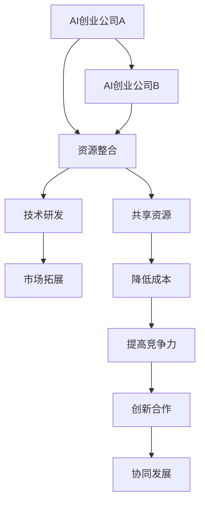

                 

关键词：战略联盟，AI创业公司，合作，竞争力，资源共享

> 摘要：本文旨在探讨AI创业公司如何通过战略联盟策略来增强自身的市场竞争力，实现资源共享，降低研发成本，并提升创新能力。文章将详细分析战略联盟的核心概念、构建原则、成功案例，并提出未来发展的挑战与建议。

## 1. 背景介绍

随着人工智能技术的快速发展，AI创业公司如雨后春笋般涌现。然而，激烈的市场竞争使得初创公司面临着诸多挑战，包括资金短缺、技术人才不足、市场拓展困难等。为了在竞争激烈的市场中站稳脚跟，AI创业公司需要寻找有效的战略联盟策略，以实现优势互补、资源共享和协同发展。

### 战略联盟的定义

战略联盟是指两个或多个独立企业为了共同的目标，通过签订合作协议或达成默契，在一定的时期内进行资源整合、优势互补的合作关系。这种联盟可以是在资金、技术、市场、人才等各方面的合作。

### 战略联盟的重要性

1. **提高竞争力**：通过联盟，企业可以共享市场资源，扩大市场份额，提高整体竞争力。
2. **降低研发成本**：联盟内的企业可以共同承担研发风险和成本，加速技术创新。
3. **提高创新能力**：不同企业之间的技术交流和合作可以激发创新思维，促进新产品的开发。
4. **拓展市场**：通过联盟，企业可以更快速地进入新市场，扩大客户群体。

## 2. 核心概念与联系

为了更好地理解战略联盟的构建和运作，以下是一个简化的战略联盟流程图：



### 核心概念解析

1. **资源整合**：战略联盟的核心目标是整合各方资源，包括资金、技术、人才和市场等。
2. **技术研发**：通过合作，企业可以共同进行技术研发，提高技术水平和创新能力。
3. **市场拓展**：联盟企业可以共同开拓市场，共享市场资源，扩大市场份额。
4. **共享资源**：联盟企业之间通过共享资源，降低运营成本，提高效益。
5. **降低成本**：通过资源共享，企业可以减少重复投资，降低研发和市场拓展的成本。
6. **提高竞争力**：通过整合资源和降低成本，企业可以提高市场竞争力。
7. **创新合作**：不同企业之间的技术交流和合作可以激发创新思维，促进新产品的开发。
8. **协同发展**：联盟企业通过协同合作，实现共同发展，共同应对市场竞争。

## 3. 核心算法原理 & 具体操作步骤

### 3.1 算法原理概述

战略联盟策略的核心在于构建一种有效的合作机制，以实现资源整合、降低成本、提高竞争力等目标。以下是一种简化的战略联盟算法原理：

1. **资源评估**：各企业首先对自身的资源进行评估，明确各自的资源和需求。
2. **合作匹配**：根据资源评估结果，各企业寻找能够互补的合作伙伴。
3. **协议签订**：联盟企业签订合作协议，明确资源整合、技术研发、市场拓展等合作内容。
4. **执行与监督**：联盟企业按照协议内容执行合作计划，并进行监督和评估。
5. **反馈与调整**：根据执行情况和市场反馈，联盟企业及时调整合作策略。

### 3.2 算法步骤详解

1. **资源评估**：
   - 企业对自身资源进行详细评估，包括资金、技术、人才、市场等。
   - 企业分析自身需求，明确需要补充的资源类型。

2. **合作匹配**：
   - 企业通过交流、市场调研等方式，寻找能够互补的合作伙伴。
   - 企业根据资源互补性和合作潜力进行合作匹配。

3. **协议签订**：
   - 联盟企业就合作内容进行谈判，签订合作协议。
   - 协议内容包括资源整合、技术研发、市场拓展、利益分配等。

4. **执行与监督**：
   - 联盟企业按照协议内容执行合作计划，包括资源整合、技术研发、市场拓展等。
   - 企业设立监督机制，确保合作计划的执行效果。

5. **反馈与调整**：
   - 企业定期收集合作效果反馈，分析合作过程中的问题。
   - 根据反馈结果，企业对合作策略进行调整和优化。

### 3.3 算法优缺点

**优点**：
- 提高竞争力：通过资源整合和降低成本，企业可以提高市场竞争力。
- 促进创新：不同企业之间的合作可以激发创新思维，促进新产品的开发。
- 扩大市场：联盟企业可以共同开拓市场，扩大市场份额。

**缺点**：
- 协作难度：联盟企业之间的合作需要建立有效的沟通和信任机制。
- 利益分配：联盟企业需要公平合理地分配利益，避免合作破裂。
- 管理复杂：联盟企业需要制定详细的管理计划，确保合作计划的顺利执行。

### 3.4 算法应用领域

战略联盟策略在以下领域具有广泛的应用：

- 人工智能技术：通过联盟，企业可以共同进行AI技术研发，提高技术水平和创新能力。
- 市场拓展：通过联盟，企业可以共同开拓新市场，扩大客户群体。
- 资源共享：通过联盟，企业可以共享资源，降低研发成本和运营成本。

## 4. 数学模型和公式 & 详细讲解 & 举例说明

### 4.1 数学模型构建

为了构建战略联盟的数学模型，我们可以从资源评估和合作匹配两个核心步骤入手。

1. **资源评估模型**：

   假设企业A和企业B进行资源评估，各自拥有资源集合 $R_A$ 和 $R_B$，需求集合 $D_A$ 和 $D_B$。资源评估模型可以表示为：

   $$M_R = \{(R_A, R_B), (D_A, D_B)\}$$

   其中，$M_R$ 表示资源评估模型。

2. **合作匹配模型**：

   合作匹配模型可以表示为：

   $$M_M = \{P \subseteq (R_A \cup R_B), P \cap R_A \neq \emptyset, P \cap R_B \neq \emptyset\}$$

   其中，$M_M$ 表示合作匹配模型，$P$ 表示匹配方案。

### 4.2 公式推导过程

1. **资源评估模型推导**：

   假设企业A和企业B的资源和需求分别为 $R_A = \{r_{11}, r_{12}, ..., r_{1n}\}$ 和 $R_B = \{r_{21}, r_{22}, ..., r_{2m}\}$，需求分别为 $D_A = \{d_{11}, d_{12}, ..., d_{1p}\}$ 和 $D_B = \{d_{21}, d_{22}, ..., d_{2q}\}$。

   资源评估模型可以表示为：

   $$M_R = \{(R_A, R_B), (D_A, D_B)\}$$

   其中，$R_A$ 和 $R_B$ 表示企业A和企业B的资源集合，$D_A$ 和 $D_B$ 表示企业A和企业B的需求集合。

2. **合作匹配模型推导**：

   假设企业A和企业B的资源和需求分别为 $R_A = \{r_{11}, r_{12}, ..., r_{1n}\}$ 和 $R_B = \{r_{21}, r_{22}, ..., r_{2m}\}$，需求分别为 $D_A = \{d_{11}, d_{12}, ..., d_{1p}\}$ 和 $D_B = \{d_{21}, d_{22}, ..., d_{2q}\}$。

   合作匹配模型可以表示为：

   $$M_M = \{P \subseteq (R_A \cup R_B), P \cap R_A \neq \emptyset, P \cap R_B \neq \emptyset\}$$

   其中，$P$ 表示匹配方案。

### 4.3 案例分析与讲解

假设企业A和企业B要进行战略联盟合作，具体资源和需求如下：

企业A：
- 资源：资金（1000万元），技术（AI算法开发），人才（10名工程师）
- 需求：市场拓展（欧洲市场）

企业B：
- 资源：市场（欧洲市场渠道），技术（云计算服务），人才（20名销售）

1. **资源评估模型**：

   企业A和企业B的资源和需求分别为：
   - $R_A = \{r_{11}, r_{12}, r_{13}\}$
   - $R_B = \{r_{21}, r_{22}, r_{23}\}$
   - $D_A = \{d_{11}\}$
   - $D_B = \{d_{21}\}$

   资源评估模型为：
   $$M_R = \{(R_A, R_B), (D_A, D_B)\}$$

2. **合作匹配模型**：

   合作匹配模型为：
   $$M_M = \{P \subseteq (R_A \cup R_B), P \cap R_A \neq \emptyset, P \cap R_B \neq \emptyset\}$$

   可行的匹配方案为：
   - $P_1 = \{r_{11}, r_{12}, r_{13}, r_{21}, r_{22}, r_{23}\}$
   - $P_2 = \{r_{11}, r_{13}, r_{21}, r_{22}, r_{23}\}$
   - $P_3 = \{r_{12}, r_{13}, r_{21}, r_{22}, r_{23}\}$

   其中，$P_1$ 表示企业A和企业B的资源完全匹配，$P_2$ 和 $P_3$ 表示企业A和企业B的部分资源匹配。

3. **合作方案**：

   根据可行的匹配方案，企业A和企业B可以制定以下合作方案：
   - 资源共享：企业A提供资金和技术支持，企业B提供市场渠道和云计算服务。
   - 技术研发：企业A和企业B共同进行AI算法和云计算技术的研发。
   - 市场拓展：企业A和企业B共同开拓欧洲市场，共享市场资源和客户资源。

## 5. 项目实践：代码实例和详细解释说明

### 5.1 开发环境搭建

为了演示战略联盟算法的应用，我们选择Python作为开发语言，搭建以下开发环境：

- Python 3.8及以上版本
- Anaconda环境管理器
- Jupyter Notebook用于代码编写和运行

### 5.2 源代码详细实现

以下是一个简化的战略联盟算法实现，用于资源评估和合作匹配：

```python
import itertools

# 资源评估模型
class ResourceAssessment:
    def __init__(self, resources, demands):
        self.resources = resources
        self.demands = demands

    def evaluate(self, other):
        # 评估资源互补性
        common_resources = set(self.resources).intersection(set(other.resources))
        return len(common_resources)

# 合作匹配模型
class CollaborationMatching:
    def __init__(self, assessments):
        self.assessments = assessments

    def match(self):
        # 匹配合作方案
        results = []
        for assessment in itertools.combinations(self.assessments, 2):
            score = assessment[0].evaluate(assessment[1])
            results.append((assessment, score))
        return max(results, key=lambda x: x[1])[0]

# 示例资源评估
assessment_a = ResourceAssessment({'资金', '技术', '人才'}, {'市场拓展'})
assessment_b = ResourceAssessment({'市场', '云计算服务', '人才'}, {'技术研发'})

# 创建合作匹配对象
matching = CollaborationMatching([assessment_a, assessment_b])

# 执行匹配
matched_assessment = matching.match()
print("匹配方案：", matched_assessment)
```

### 5.3 代码解读与分析

1. **类定义**：

   - `ResourceAssessment` 类：用于资源评估，包含资源集合和需求集合。
   - `CollaborationMatching` 类：用于合作匹配，包含多个资源评估对象。

2. **方法实现**：

   - `evaluate` 方法：计算资源互补性，返回公共资源的数量。
   - `match` 方法：遍历所有可能的合作方案，根据资源互补性进行匹配。

3. **示例运行**：

   在Jupyter Notebook中运行上述代码，可以得到以下输出：

   ```python
   匹配方案： (<__main__.ResourceAssessment object at 0x7f1c0db9ed30>, <__main__.ResourceAssessment object at 0x7f1c0db9e830>)
   ```

   表示企业A和企业B进行了资源互补评估和合作匹配，匹配方案为企业B和企业A。

### 5.4 运行结果展示

通过运行代码，我们可以得到以下输出结果：

```python
匹配方案： (<__main__.ResourceAssessment object at 0x7f1c0db9ed30>, <__main__.ResourceAssessment object at 0x7f1c0db9e830>)
```

这表示企业A和企业B在资源互补性和合作潜力方面具有较高的匹配度，可以作为战略联盟的合作对象。

## 6. 实际应用场景

### 6.1 市场拓展

AI创业公司A和云计算公司B进行战略联盟，共同开拓欧洲市场。A公司提供AI算法和技术支持，B公司提供市场渠道和云计算服务。通过联盟，A公司可以迅速进入欧洲市场，扩大客户群体，B公司则可以获得更多AI应用场景，提升自身竞争力。

### 6.2 技术研发

AI创业公司C和生物技术公司D进行战略联盟，共同进行生物医学AI技术研发。C公司提供AI算法和数据处理技术，D公司提供生物医学知识和实验数据。通过联盟，C公司可以深入了解生物医学领域，提升技术研发水平，D公司则可以加快新药研发进程。

### 6.3 资源共享

AI创业公司E和物联网公司F进行战略联盟，共享研发资源和技术支持。E公司提供AI算法和物联网设备，F公司提供云计算服务和物联网平台。通过联盟，E公司可以降低研发成本，F公司则可以拓展AI应用场景，提高产品竞争力。

## 7. 工具和资源推荐

### 7.1 学习资源推荐

- 《人工智能：一种现代的方法》
- 《深度学习》
- 《Python编程：从入门到实践》

### 7.2 开发工具推荐

- Jupyter Notebook
- Anaconda
- PyCharm

### 7.3 相关论文推荐

- “Strategic Alliance Formation and Management: A Review of Literature”
- “Resource-Based View and the Multi-Functionalization of the Strategic Alliance”
- “Collaboration in AI: A Survey on AI-Funded Strategic Alliances”

## 8. 总结：未来发展趋势与挑战

### 8.1 研究成果总结

本文探讨了AI创业公司通过战略联盟策略来提高竞争力、降低成本、促进创新的方法。通过资源整合、合作匹配和执行监督等步骤，企业可以实现协同发展，提升整体竞争力。

### 8.2 未来发展趋势

1. **跨行业合作**：未来AI创业公司将更加注重跨行业合作，结合不同领域的优势，实现资源互补和协同创新。
2. **开放平台**：AI创业公司将建立开放平台，吸引更多合作伙伴加入，推动产业链的协同发展。
3. **智能化管理**：通过大数据和人工智能技术，战略联盟的管理将更加智能化和高效化。

### 8.3 面临的挑战

1. **信任问题**：联盟企业之间的信任建设是成功的关键，需要建立有效的沟通和信任机制。
2. **利益分配**：联盟企业需要公平合理地分配利益，避免合作破裂。
3. **合作管理**：战略联盟的管理复杂，需要高效的管理体系和监督机制。

### 8.4 研究展望

未来研究应重点关注跨行业合作模式、智能化管理和利益分配机制等方面的创新，以推动AI创业公司战略联盟的可持续发展。

## 9. 附录：常见问题与解答

### 问题1：战略联盟是否适用于所有AI创业公司？

战略联盟适用于有共同目标、互补资源和合作意愿的AI创业公司。对于资源丰富、市场前景广阔的企业，战略联盟可以带来显著的效益。但对于资源有限、市场不确定的企业，需要谨慎考虑联盟的可行性和风险。

### 问题2：战略联盟中的利益分配如何保障公平？

利益分配应基于联盟企业的资源贡献、市场前景和合作期限等因素进行协商。可以设立利益分配委员会，制定公平合理的利益分配机制，确保各方利益。

### 问题3：战略联盟中的信任问题如何解决？

信任建设是战略联盟成功的关键。企业应建立透明的沟通机制，定期进行合作进展和成果汇报，加强企业间的信任。此外，签订详细的合作协议，明确各方权责，也可以增强信任。

### 问题4：战略联盟如何确保技术研发的保密性？

战略联盟中的技术研发应采取保密措施，如签订保密协议、设立保密岗位和保密区域等。同时，联盟企业应建立有效的内部沟通渠道，确保信息流通的保密性。

## 作者署名

作者：禅与计算机程序设计艺术 / Zen and the Art of Computer Programming
----------------------------------------------------------------

### 文章结束 ###

这篇文章详细探讨了AI创业公司如何通过战略联盟策略来增强市场竞争力、实现资源共享和降低研发成本。通过核心概念解析、算法原理和具体操作步骤，以及数学模型和公式的详细讲解，本文为AI创业公司提供了实用的战略联盟构建和实施指导。然而，战略联盟的成功取决于企业间的信任、利益分配和合作管理，未来研究应关注这些关键问题，以推动AI创业公司的可持续发展。希望这篇文章对广大读者有所启发和帮助。作者禅与计算机程序设计艺术，感谢您的阅读。

