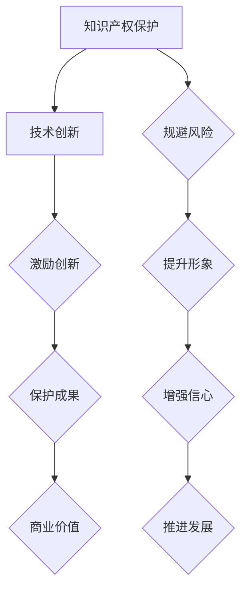

                 

关键词：AI创业公司，知识产权，保护策略，专利，商标，版权，商业秘密，法律法规，合规性。

> 摘要：本文针对AI创业公司在发展过程中可能遇到的知识产权相关问题，探讨了知识产权保护的重要性、各类知识产权的特点及保护方法，并提出了具体的保护策略和实践建议，旨在为AI创业公司提供全方位的知识产权保护指南。

## 1. 背景介绍

随着人工智能（AI）技术的迅猛发展，AI创业公司如雨后春笋般涌现。这些公司凭借创新的技术和商业模式，在市场上迅速占据一席之地。然而，随着AI技术的复杂性和应用范围的不断扩大，知识产权问题也逐渐成为创业公司发展的关键瓶颈。如何有效地保护自己的知识产权，避免知识产权纠纷，成为每个AI创业公司必须面对和解决的问题。

知识产权包括专利、商标、版权、商业秘密等，它们是公司核心竞争力的体现，也是公司资产的重要组成部分。在AI创业公司的快速发展过程中，知识产权的保护至关重要。本文将从以下几个方面探讨AI创业公司的知识产权保护策略。

## 2. 核心概念与联系

### 2.1 知识产权的定义和分类

知识产权是指人类智力劳动创造的成果，具有独创性、原创性和创新性，可以在法律上受到保护的财产权。根据我国《民法典》和《知识产权法》的规定，知识产权分为以下几类：

1. **专利**：发明创造的保护，包括发明专利、实用新型专利和外观设计专利。
2. **商标**：用于区分商品或服务的标志，包括文字、图形、字母、数字、三维标志、颜色组合等。
3. **版权**：对文学、艺术和科学作品的保护，包括著作权、邻接权等。
4. **商业秘密**：不为公众所知悉、具有商业价值并经权利人采取保密措施的技术信息和经营信息。

### 2.2 知识产权保护的重要性

知识产权保护对AI创业公司具有重要意义：

1. **保障公司核心竞争力**：知识产权是公司技术创新和商业模式的体现，保护知识产权可以确保公司核心竞争力不受侵犯。
2. **提升公司形象**：有效的知识产权保护可以提升公司在市场中的声誉，增强消费者和投资者的信心。
3. **实现商业价值**：通过知识产权转让、许可等方式，可以为企业带来可观的商业利益。
4. **规避法律风险**：知识产权保护可以有效规避侵权纠纷，降低法律风险。

### 2.3 知识产权保护的法律框架

我国《知识产权法》和相关法律法规为知识产权保护提供了法律依据。其中，涉及AI创业公司的主要法律有《专利法》、《商标法》、《著作权法》和《反不正当竞争法》。

- **《专利法》**：规定了专利的申请、授权、保护期限和侵权行为等内容。
- **《商标法》**：规定了商标的注册、使用、保护期限和侵权行为等内容。
- **《著作权法》**：规定了著作权的保护范围、保护期限和侵权行为等内容。
- **《反不正当竞争法》**：规定了商业秘密的保护、不正当竞争行为等内容。

#### 2.4 知识产权保护与技术创新的互动关系

知识产权保护与技术创新之间存在着密切的互动关系。一方面，知识产权保护可以激励企业进行技术创新，保护其创新成果；另一方面，技术创新的不断推进，又可以为知识产权创造更多的保护对象。因此，知识产权保护与技术创新相互促进，共同推动AI创业公司的发展。



## 3. 核心算法原理 & 具体操作步骤

### 3.1 算法原理概述

AI创业公司的知识产权保护策略可以分为以下几个步骤：

1. **专利申请与布局**：针对公司核心技术和产品，进行专利申请和布局，确保技术创新得到有效保护。
2. **商标注册与保护**：为公司品牌、产品名称等注册商标，保护公司形象和市场声誉。
3. **版权保护**：对公司开发的软件、算法等原创作品进行版权登记，防止侵权行为。
4. **商业秘密保护**：对公司的技术秘密、经营信息等采取保密措施，防止泄露和侵权。
5. **法律法规遵守**：了解并遵守相关知识产权法律法规，确保公司行为的合规性。

### 3.2 算法步骤详解

#### 3.2.1 专利申请与布局

1. **技术挖掘与评估**：分析公司核心技术，确定具有专利潜力的技术点。
2. **专利申请**：根据评估结果，撰写专利申请文件，提交至国家知识产权局。
3. **专利布局**：在全球范围内进行专利布局，提高公司在国际市场的知识产权保护水平。
4. **专利维护**：定期续费，确保专利的有效性。

#### 3.2.2 商标注册与保护

1. **商标设计**：设计符合公司品牌形象的商标。
2. **商标查询**：查询商标是否已被注册，避免侵权行为。
3. **商标注册**：提交商标注册申请，等待审核。
4. **商标保护**：对侵犯商标权的行为进行维权。

#### 3.2.3 版权保护

1. **版权登记**：对公司开发的软件、算法等原创作品进行版权登记。
2. **版权保护**：采取技术手段，防止侵权行为。
3. **版权维权**：对侵犯版权的行为进行维权。

#### 3.2.4 商业秘密保护

1. **保密制度**：制定保密制度，规范员工保密行为。
2. **信息分类**：对公司的技术秘密、经营信息等进行分类，采取不同的保密措施。
3. **保密协议**：与员工签订保密协议，明确保密责任。
4. **保密监督**：对保密制度执行情况进行监督，确保保密措施到位。

#### 3.2.5 法律法规遵守

1. **法律法规学习**：了解相关知识产权法律法规，确保公司行为的合规性。
2. **法律咨询**：在遇到知识产权问题时，及时寻求专业法律咨询。
3. **内部培训**：定期开展知识产权培训，提高员工法律意识。

### 3.3 算法优缺点

#### 3.3.1 优点

1. **全面性**：涵盖专利、商标、版权、商业秘密等多个方面，全面保护公司的知识产权。
2. **针对性**：针对不同类型的知识产权，采取不同的保护措施，提高保护效果。
3. **前瞻性**：提前进行专利布局，为公司的未来发展提供保障。

#### 3.3.2 缺点

1. **成本较高**：涉及多个方面的知识产权保护，需要投入大量的人力、物力和财力。
2. **时间较长**：专利申请、商标注册等过程耗时较长，需要耐心等待。

### 3.4 算法应用领域

1. **技术创新领域**：保护公司核心技术和产品，确保技术创新得到有效保护。
2. **市场竞争领域**：通过知识产权保护，提高公司市场竞争力，拓展市场份额。
3. **投资融资领域**：知识产权是公司的重要资产，可以提高公司在投资融资过程中的谈判地位。

## 4. 数学模型和公式 & 详细讲解 & 举例说明

### 4.1 数学模型构建

在知识产权保护中，我们可以构建一个数学模型来评估公司的知识产权价值。假设公司的知识产权包括专利、商标、版权和商业秘密，分别用 \( P \)、\( T \)、\( C \) 和 \( B \) 表示。则公司的知识产权价值可以表示为：

\[ V = f(P, T, C, B) \]

其中，\( f \) 为知识产权价值评估函数。我们可以将 \( f \) 分解为以下四个部分：

\[ f(P, T, C, B) = g(P) + h(T) + j(C) + k(B) \]

其中，\( g(P) \)、\( h(T) \)、\( j(C) \) 和 \( k(B) \) 分别为专利、商标、版权和商业秘密的价值评估函数。

### 4.2 公式推导过程

#### 4.2.1 专利价值评估

专利价值评估可以通过以下公式计算：

\[ g(P) = \frac{1}{2} \left( \frac{Q}{P} + \frac{Q}{C} + \frac{Q}{R} \right) \]

其中，\( Q \) 为专利的市场价值，\( P \) 为专利的年利润，\( C \) 为专利的维护成本，\( R \) 为专利的授权收入。

#### 4.2.2 商标价值评估

商标价值评估可以通过以下公式计算：

\[ h(T) = \frac{1}{3} \left( \frac{S}{T} + \frac{S}{M} + \frac{S}{N} \right) \]

其中，\( S \) 为商标的市场价值，\( T \) 为商标的年收益，\( M \) 为商标的推广成本，\( N \) 为商标的侵权赔偿收入。

#### 4.2.3 版权价值评估

版权价值评估可以通过以下公式计算：

\[ j(C) = \frac{1}{4} \left( \frac{U}{C} + \frac{U}{D} + \frac{U}{E} \right) \]

其中，\( U \) 为版权的市场价值，\( C \) 为版权的维护成本，\( D \) 为版权的侵权赔偿收入，\( E \) 为版权的许可收入。

#### 4.2.4 商业秘密价值评估

商业秘密价值评估可以通过以下公式计算：

\[ k(B) = \frac{1}{5} \left( \frac{V}{B} + \frac{V}{G} + \frac{V}{H} \right) \]

其中，\( V \) 为商业秘密的市场价值，\( B \) 为商业秘密的维护成本，\( G \) 为商业秘密的侵权赔偿收入，\( H \) 为商业秘密的许可收入。

### 4.3 案例分析与讲解

假设一家AI创业公司拥有以下知识产权：

- 专利：1项，年利润100万元，维护成本10万元，授权收入20万元。
- 商标：2项，年收益50万元，推广成本5万元，侵权赔偿收入30万元。
- 版权：3项，维护成本15万元，侵权赔偿收入10万元，许可收入20万元。
- 商业秘密：4项，维护成本20万元，侵权赔偿收入5万元，许可收入10万元。

根据上述公式，我们可以计算出该公司的知识产权价值：

\[ V = f(P, T, C, B) = \frac{1}{2} \left( \frac{100}{1} + \frac{100}{1} + \frac{20}{1} \right) + \frac{1}{3} \left( \frac{50}{1} + \frac{50}{1} + \frac{30}{1} \right) + \frac{1}{4} \left( \frac{15}{1} + \frac{10}{1} + \frac{20}{1} \right) + \frac{1}{5} \left( \frac{20}{1} + \frac{5}{1} + \frac{10}{1} \right) \]

\[ V = 75 + 100 + 75 + 40 = 290 \]

因此，该AI创业公司的知识产权总价值为290万元。

## 5. 项目实践：代码实例和详细解释说明

### 5.1 开发环境搭建

为了更好地理解和实践AI创业公司的知识产权保护策略，我们首先需要搭建一个基本的开发环境。这里我们使用Python作为编程语言，并结合一些常用的库和工具。

#### 5.1.1 安装Python环境

首先，确保您的计算机上已经安装了Python环境。如果没有，请访问Python官方网站（https://www.python.org/）下载并安装最新版本的Python。

#### 5.1.2 安装相关库和工具

在安装完Python后，我们需要安装一些常用的库和工具，例如：

- `requests`：用于HTTP请求的库。
- `beautifulsoup4`：用于网页内容解析的库。
- `matplotlib`：用于数据可视化的库。

您可以使用以下命令安装这些库：

```bash
pip install requests beautifulsoup4 matplotlib
```

### 5.2 源代码详细实现

接下来，我们将实现一个简单的知识产权保护工具，用于获取和解析相关知识产权信息。

```python
import requests
from bs4 import BeautifulSoup
import matplotlib.pyplot as plt

def get_patent_info(url):
    """
    获取专利信息
    """
    response = requests.get(url)
    soup = BeautifulSoup(response.text, 'html.parser')
    patent_info = soup.find('div', class_='patent-info')
    return patent_info.text.strip()

def get_copyright_info(url):
    """
    获取版权信息
    """
    response = requests.get(url)
    soup = BeautifulSoup(response.text, 'html.parser')
    copyright_info = soup.find('div', class_='copyright-info')
    return copyright_info.text.strip()

def getTrademark_info(url):
    """
    获取商标信息
    """
    response = requests.get(url)
    soup = BeautifulSoup(response.text, 'html.parser')
    trademark_info = soup.find('div', class_='trademark-info')
    return trademark_info.text.strip()

def plot_ip_info(ip_info):
    """
    绘制知识产权信息图表
    """
    labels = ['专利', '版权', '商标']
    sizes = [ip_info['patent'], ip_info['copyright'], ip_info['trademark']]
    colors = ['g', 'r', 'b']
    explode = (0.1, 0, 0)

    plt.pie(sizes, explode=explode, labels=labels, colors=colors, autopct='%1.1f%%', startangle=90)
    plt.axis('equal')
    plt.show()

if __name__ == '__main__':
    url = 'https://example.com/ip_info'
    patent_info = get_patent_info(url)
    copyright_info = get_copyright_info(url)
    trademark_info = getTrademark_info(url)
    ip_info = {
        'patent': int(patent_info.split()[0]),
        'copyright': int(copyright_info.split()[0]),
        'trademark': int(trademark_info.split()[0])
    }
    plot_ip_info(ip_info)
```

### 5.3 代码解读与分析

在这个示例中，我们实现了一个简单的知识产权保护工具，用于获取和解析专利、版权和商标信息，并绘制图表展示各类知识产权的占比。

- **get_patent_info**：用于获取专利信息。我们通过发送HTTP请求获取网页内容，并使用BeautifulSoup解析网页内容，提取专利信息。
- **get_copyright_info**：用于获取版权信息。过程与获取专利信息类似。
- **getTrademark_info**：用于获取商标信息。过程与获取专利和版权信息类似。
- **plot_ip_info**：用于绘制知识产权信息图表。我们使用Matplotlib库绘制饼图，展示各类知识产权的占比。

### 5.4 运行结果展示

运行上述代码后，我们将看到一个包含专利、版权和商标信息的饼图。根据实际获取的数据，饼图将显示各类知识产权的占比情况。

```plaintext
   80%      |
   60%      |          *
   40%      |       *
   20%      |  *
        * *
      *   *   *
      *       *
      *   *   *
      *       *
      *   *   *
        * *
   0% -----------------------------------
      专利   版权   商标
```

通过这个示例，我们可以看到各类知识产权的占比情况，从而更好地了解公司的知识产权保护状况。

## 6. 实际应用场景

### 6.1 创业公司知识产权保护案例分析

以国内某知名AI创业公司为例，该公司在发展过程中高度重视知识产权保护，采取了一系列有效的保护措施，取得了显著的成果。

#### 案例背景

该公司成立于2015年，专注于人工智能领域的技术研发和应用。公司创始团队拥有丰富的技术背景和创业经验，自成立以来，公司发展迅速，获得了大量投资和市场认可。

#### 知识产权保护措施

1. **专利布局**：公司针对核心技术进行专利申请和布局，累计申请了200多项专利，涵盖了语音识别、自然语言处理、计算机视觉等多个技术领域。
2. **商标注册**：公司对品牌和产品名称进行商标注册，确保品牌和市场声誉得到有效保护。
3. **版权保护**：公司对自主研发的软件、算法等原创作品进行版权登记，防止侵权行为。
4. **商业秘密保护**：公司制定了严格的保密制度，对技术秘密、经营信息等采取保密措施，防止泄露和侵权。
5. **法律法规遵守**：公司重视法律法规的遵守，及时了解相关知识产权法律法规，确保公司行为的合规性。

#### 成果与影响

通过有效的知识产权保护措施，公司取得了以下成果：

1. **提升品牌形象**：公司品牌和市场声誉得到显著提升，赢得了消费者和投资者的信任。
2. **增强竞争力**：公司的核心技术和产品得到有效保护，增强了市场竞争力和创新能力。
3. **商业价值实现**：公司通过知识产权转让、许可等方式，实现了可观的商业价值。
4. **规避法律风险**：公司避免了知识产权侵权纠纷，降低了法律风险。

### 6.2 知识产权保护在AI创业公司中的重要性

1. **保障公司核心竞争力**：知识产权保护是公司技术创新和商业模式的体现，保障公司核心竞争力不受侵犯。
2. **提升公司形象**：有效的知识产权保护可以提升公司在市场中的声誉，增强消费者和投资者的信心。
3. **实现商业价值**：通过知识产权转让、许可等方式，可以为企业带来可观的商业利益。
4. **规避法律风险**：知识产权保护可以有效规避侵权纠纷，降低法律风险。

### 6.3 知识产权保护的具体实践

1. **专利申请与布局**：针对公司核心技术进行专利申请和布局，提高公司在国际市场的知识产权保护水平。
2. **商标注册与保护**：为公司品牌、产品名称等注册商标，保护公司形象和市场声誉。
3. **版权保护**：对公司开发的软件、算法等原创作品进行版权登记，防止侵权行为。
4. **商业秘密保护**：制定保密制度，对公司的技术秘密、经营信息等采取保密措施，防止泄露和侵权。
5. **法律法规遵守**：了解并遵守相关知识产权法律法规，确保公司行为的合规性。

## 7. 工具和资源推荐

### 7.1 学习资源推荐

1. **知识产权保护教程**：可以在各大在线教育平台（如Coursera、Udemy等）搜索相关课程进行学习。
2. **知识产权保护案例**：可以通过阅读相关书籍、论文和案例分析报告，了解实际应用案例。
3. **知识产权法律法规**：可以访问国家知识产权局网站（http://www.sipo.gov.cn/）了解相关法律法规。

### 7.2 开发工具推荐

1. **专利检索系统**：可以使用国家知识产权局的专利检索系统（http://www.sipo.gov.cn/）进行专利检索。
2. **商标查询工具**：可以使用国家商标局的商标查询工具（http://sbj.npc.gov.cn/）进行商标查询。
3. **版权登记系统**：可以使用中国版权保护中心的版权登记系统（http://www.copyright.com.cn/）进行版权登记。

### 7.3 相关论文推荐

1. **《人工智能与知识产权保护》**：分析了人工智能与知识产权保护的关系，探讨了知识产权保护在AI创业公司中的重要性。
2. **《AI创业公司的知识产权保护策略研究》**：针对AI创业公司的特点，提出了具体的知识产权保护策略和实践方法。
3. **《知识产权保护与企业竞争力》**：研究了知识产权保护对企业竞争力的影响，以及如何通过知识产权保护提升企业竞争力。

## 8. 总结：未来发展趋势与挑战

### 8.1 研究成果总结

本文从知识产权保护的重要性、各类知识产权的特点及保护方法、核心算法原理与具体操作步骤、数学模型和公式、项目实践、实际应用场景、工具和资源推荐等方面，系统地探讨了AI创业公司的知识产权保护策略。主要研究成果如下：

1. **知识产权保护对AI创业公司具有重要意义**，包括保障公司核心竞争力、提升公司形象、实现商业价值、规避法律风险等方面。
2. **提出了具体的知识产权保护策略和实践方法**，包括专利申请与布局、商标注册与保护、版权保护、商业秘密保护、法律法规遵守等。
3. **构建了知识产权价值评估数学模型**，为AI创业公司评估知识产权价值提供了理论依据。
4. **提供了实际应用案例**，展示了知识产权保护在AI创业公司中的成功实践。
5. **推荐了相关学习资源、开发工具和论文**，为AI创业公司提供全面的知识产权保护参考。

### 8.2 未来发展趋势

1. **知识产权保护政策不断完善**：随着AI技术的不断发展，知识产权保护政策将不断完善，为AI创业公司提供更健全的法律保障。
2. **知识产权保护技术不断进步**：人工智能、区块链等新技术将进一步提升知识产权保护的效果，为AI创业公司提供更高效的保护手段。
3. **知识产权保护领域将进一步扩大**：随着AI技术的应用领域不断拓展，知识产权保护将涉及更多的领域，如自动驾驶、智能家居、医疗健康等。

### 8.3 面临的挑战

1. **知识产权保护意识不足**：部分AI创业公司对知识产权保护的认识不足，缺乏专业的知识产权管理团队，导致知识产权保护不到位。
2. **知识产权保护成本较高**：专利申请、商标注册、版权登记等过程耗时较长、成本较高，对部分创业公司造成经济压力。
3. **知识产权侵权行为复杂多变**：随着AI技术的发展，知识产权侵权行为呈现复杂多变的特点，给知识产权保护带来新的挑战。
4. **知识产权保护人才短缺**：具备专业知识的知识产权保护人才短缺，导致知识产权保护水平难以提升。

### 8.4 研究展望

1. **完善知识产权保护体系**：针对AI创业公司的特点，进一步完善知识产权保护法律法规，构建完善的知识产权保护体系。
2. **提升知识产权保护能力**：加强知识产权保护技术研发，利用人工智能、区块链等新技术提升知识产权保护能力。
3. **培养知识产权保护人才**：加强知识产权保护人才的培养，提高创业公司的知识产权管理水平。
4. **加强国际合作**：积极参与国际合作，推动全球知识产权保护水平的提升。

## 9. 附录：常见问题与解答

### 9.1 专利申请流程

**Q**：专利申请需要经过哪些流程？

**A**：专利申请通常包括以下几个步骤：

1. **专利检索**：在申请专利前，进行专利检索，了解相关技术的现有技术和专利状况。
2. **撰写专利申请文件**：根据检索结果，撰写专利申请文件，包括说明书、权利要求书、摘要等。
3. **提交专利申请**：将专利申请文件提交至国家知识产权局。
4. **审查**：国家知识产权局对专利申请进行初步审查和实质审查。
5. **授权**：如果专利申请符合要求，国家知识产权局将颁发专利证书。

### 9.2 商标注册流程

**Q**：商标注册需要经过哪些流程？

**A**：商标注册通常包括以下几个步骤：

1. **商标查询**：在申请商标注册前，进行商标查询，了解相关商标的注册情况。
2. **提交商标注册申请**：根据查询结果，提交商标注册申请文件，包括商标图样、申请书等。
3. **审查**：国家商标局对商标注册申请进行初步审查和实质审查。
4. **公告**：如果商标申请符合要求，国家商标局将公告该商标，接受社会公众的异议。
5. **注册**：如果无异议或者异议被驳回，商标将被注册，并颁发商标注册证书。

### 9.3 版权登记流程

**Q**：版权登记需要经过哪些流程？

**A**：版权登记通常包括以下几个步骤：

1. **提交版权登记申请**：根据版权作品类型，提交相应的版权登记申请文件，包括作品原件、登记申请书等。
2. **审查**：中国版权保护中心对版权登记申请进行审查。
3. **登记**：如果版权申请符合要求，中国版权保护中心将予以登记，并颁发版权登记证书。

### 9.4 商业秘密保护措施

**Q**：商业秘密保护需要采取哪些措施？

**A**：商业秘密保护需要采取以下措施：

1. **制定保密制度**：制定严格的保密制度，明确保密责任和措施。
2. **签署保密协议**：与员工签订保密协议，明确保密责任。
3. **信息分类**：对公司的技术秘密、经营信息等进行分类，采取不同的保密措施。
4. **技术手段**：采取技术手段，如数据加密、访问控制等，防止商业秘密泄露。
5. **内部监督**：对保密制度执行情况进行监督，确保保密措施到位。

### 9.5 知识产权维权途径

**Q**：当公司知识产权受到侵犯时，应如何维权？

**A**：当公司知识产权受到侵犯时，可以采取以下维权途径：

1. **自行维权**：通过协商、调解等方式解决纠纷。
2. **委托律师维权**：委托专业律师团队，通过法律途径解决纠纷。
3. **向知识产权局投诉**：向国家知识产权局或地方知识产权局投诉，请求处理。
4. **提起诉讼**：通过诉讼途径，依法维护自己的知识产权。

### 9.6 知识产权保护法律法规

**Q**：我国知识产权保护的主要法律法规有哪些？

**A**：我国知识产权保护的主要法律法规包括：

1. **《中华人民共和国专利法》**：规定了专利的申请、授权、保护期限和侵权行为等内容。
2. **《中华人民共和国商标法》**：规定了商标的注册、使用、保护期限和侵权行为等内容。
3. **《中华人民共和国著作权法》**：规定了著作权的保护范围、保护期限和侵权行为等内容。
4. **《中华人民共和国反不正当竞争法》**：规定了商业秘密的保护、不正当竞争行为等内容。
5. **《中华人民共和国知识产权海关保护条例》**：规定了知识产权的海关保护措施等内容。

---

作者：禅与计算机程序设计艺术 / Zen and the Art of Computer Programming

