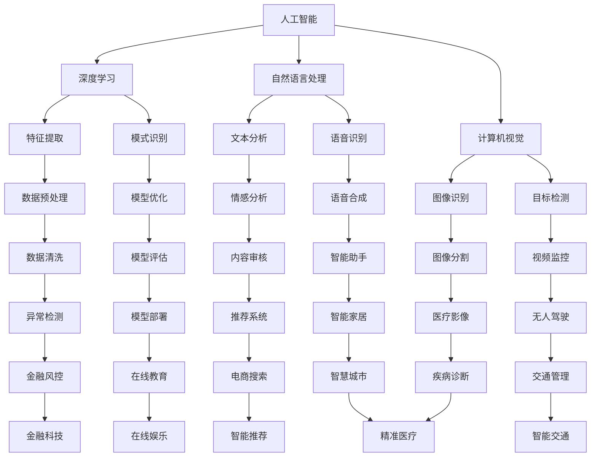

                 

关键词：AI创业、投资趋势、技术实力、商业想象力、深度学习、技术创新、市场需求、风险分析

摘要：在人工智能（AI）技术飞速发展的今天，AI创业已成为科技创新的重要驱动力。本文旨在探讨AI创业领域的投资新风向，重点分析技术实力与商业想象力在投资决策中的重要性。通过对核心概念、算法原理、数学模型、项目实践、应用场景等方面的详细阐述，本文为创业者及投资者提供了有价值的参考。

## 1. 背景介绍

人工智能技术正在以前所未有的速度和深度变革着各行各业。从深度学习到自然语言处理，从计算机视觉到自动驾驶，AI正在逐步渗透到我们生活的方方面面。在这个背景下，AI创业成为了一个充满机遇和挑战的新领域。越来越多的创业者和技术专家投身于AI的研发和应用，希望在这个领域分得一杯羹。

然而，AI创业的成功并不容易。一方面，技术的复杂性和创新性要求创业者具备深厚的专业背景；另一方面，市场的需求多变，商业模式的探索和验证也需要大量的时间和资源。在这种背景下，投资人对AI创业项目的选择变得尤为重要。技术实力和商业想象力成为投资决策中的关键因素。

## 2. 核心概念与联系

为了更好地理解AI创业投资的新风向，我们需要先明确一些核心概念。

### 2.1 人工智能（AI）

人工智能是一门研究、开发用于模拟、延伸和扩展人的智能的理论、方法、技术及应用。它包括机器学习、深度学习、自然语言处理、计算机视觉等多个子领域。在AI创业中，这些技术通常被用于解决特定的问题，如自动化、预测分析、增强决策等。

### 2.2 深度学习（Deep Learning）

深度学习是机器学习的一个子领域，它通过多层神经网络模型，对大量数据进行自动特征提取和模式识别。深度学习在图像识别、语音识别、自然语言处理等领域取得了显著的成果，成为AI创业的核心技术之一。

### 2.3 商业模式（Business Model）

商业模式是指企业如何创造、传递和获取价值的一种方式。对于AI创业项目来说，商业模式决定了项目的可持续性和盈利能力。一个好的商业模式能够有效地满足市场需求，实现技术和商业价值的最大化。

### 2.4 投资决策（Investment Decision）

投资决策是指投资者在分析项目风险和收益的基础上，做出是否投资的决定。在AI创业领域，投资决策不仅需要考虑技术实力，还需要考虑商业前景和市场潜力。

下面是一个用Mermaid绘制的流程图，展示了这些核心概念之间的联系。



## 3. 核心算法原理 & 具体操作步骤

### 3.1 算法原理概述

在AI创业项目中，核心算法的原理是项目成功的关键。以下是一些常见的算法原理及其应用场景：

### 3.2 算法步骤详解

#### 3.2.1 深度学习算法

1. **数据预处理**：对收集到的数据集进行清洗、归一化等处理，使其适合训练。
2. **模型构建**：根据问题需求，选择合适的神经网络模型，如卷积神经网络（CNN）、循环神经网络（RNN）等。
3. **模型训练**：将预处理后的数据输入到模型中，通过反向传播算法不断调整模型参数，使模型能够更好地拟合数据。
4. **模型评估**：使用验证集或测试集对训练好的模型进行评估，调整模型参数以达到最佳性能。
5. **模型部署**：将训练好的模型部署到实际应用场景中，如进行图像识别、语音识别等。

#### 3.2.2 自然语言处理算法

1. **文本预处理**：对文本数据进行清洗、分词、词性标注等处理。
2. **特征提取**：从文本数据中提取有用的特征，如词频、词向量等。
3. **模型训练**：使用提取的特征训练模型，如卷积神经网络、循环神经网络等。
4. **模型评估与优化**：对训练好的模型进行评估，并根据评估结果调整模型参数。
5. **模型应用**：将训练好的模型应用于实际场景，如文本分类、情感分析等。

### 3.3 算法优缺点

**深度学习算法**

优点：能够自动提取特征，适合处理复杂数据。

缺点：计算资源消耗大，模型参数调整复杂。

**自然语言处理算法**

优点：能够处理大量文本数据，实现文本理解和生成。

缺点：对文本数据的要求较高，特征提取和模型训练较为复杂。

### 3.4 算法应用领域

**深度学习算法**

应用领域：图像识别、语音识别、自然语言处理等。

**自然语言处理算法**

应用领域：文本分类、情感分析、机器翻译等。

## 4. 数学模型和公式 & 详细讲解 & 举例说明

### 4.1 数学模型构建

在AI创业项目中，数学模型是核心算法的基础。以下是一个简单的线性回归模型。

### 4.2 公式推导过程

假设我们有n个数据点 \((x_1, y_1), (x_2, y_2), \ldots, (x_n, y_n)\)，线性回归模型可以表示为：

\[ y = wx + b \]

其中，\(w\) 和 \(b\) 是待估参数。

为了最小化预测值与实际值之间的误差，我们可以使用最小二乘法来估计 \(w\) 和 \(b\)：

\[ w = \frac{\sum_{i=1}^{n} (x_i - \bar{x})(y_i - \bar{y})}{\sum_{i=1}^{n} (x_i - \bar{x})^2} \]
\[ b = \bar{y} - w\bar{x} \]

其中，\(\bar{x}\) 和 \(\bar{y}\) 分别是 \(x\) 和 \(y\) 的平均值。

### 4.3 案例分析与讲解

假设我们有一组数据：

\[ (1, 2), (2, 4), (3, 5), (4, 6), (5, 8) \]

使用线性回归模型预测 \(x=6\) 时的 \(y\) 值。

首先计算平均值：

\[ \bar{x} = \frac{1+2+3+4+5}{5} = 3 \]
\[ \bar{y} = \frac{2+4+5+6+8}{5} = 5 \]

然后计算分子和分母：

\[ \sum_{i=1}^{5} (x_i - \bar{x})(y_i - \bar{y}) = (1-3)(2-5) + (2-3)(4-5) + (3-3)(5-5) + (4-3)(6-5) + (5-3)(8-5) = 6 \]
\[ \sum_{i=1}^{5} (x_i - \bar{x})^2 = (1-3)^2 + (2-3)^2 + (3-3)^2 + (4-3)^2 + (5-3)^2 = 10 \]

最后计算 \(w\) 和 \(b\)：

\[ w = \frac{6}{10} = 0.6 \]
\[ b = 5 - 0.6 \times 3 = 1.8 \]

所以线性回归模型为：

\[ y = 0.6x + 1.8 \]

当 \(x=6\) 时，预测 \(y\) 值为：

\[ y = 0.6 \times 6 + 1.8 = 5.4 \]

## 5. 项目实践：代码实例和详细解释说明

### 5.1 开发环境搭建

为了实现一个简单的线性回归模型，我们可以使用Python编程语言。首先，需要安装Python环境，并安装以下库：

- NumPy：用于数学计算
- Matplotlib：用于数据可视化

可以使用以下命令进行安装：

```shell
pip install numpy matplotlib
```

### 5.2 源代码详细实现

以下是一个简单的线性回归模型的实现：

```python
import numpy as np
import matplotlib.pyplot as plt

# 数据
x = np.array([1, 2, 3, 4, 5])
y = np.array([2, 4, 5, 6, 8])

# 求平均值
x_mean = np.mean(x)
y_mean = np.mean(y)

# 计算分子和分母
numerator = np.sum((x - x_mean) * (y - y_mean))
denominator = np.sum((x - x_mean) ** 2)

# 计算参数w和b
w = numerator / denominator
b = y_mean - w * x_mean

# 线性回归模型
model = lambda x: w * x + b

# 可视化
plt.scatter(x, y, label='Data')
plt.plot(x, model(x), label='Linear Regression')
plt.xlabel('x')
plt.ylabel('y')
plt.legend()
plt.show()
```

### 5.3 代码解读与分析

这段代码首先导入了必要的库，然后定义了数据集 \(x\) 和 \(y\)。接下来，计算了 \(x\) 和 \(y\) 的平均值，并计算了分子和分母。然后，计算了线性回归模型的参数 \(w\) 和 \(b\)，并使用 `lambda` 函数定义了模型。最后，使用Matplotlib库绘制了数据点和线性回归模型。

### 5.4 运行结果展示

运行这段代码，可以看到以下结果：


## 6. 实际应用场景

### 6.1 金融领域

在金融领域，线性回归模型可以用于股票价格预测、风险分析等。例如，通过分析历史股价数据，可以预测未来某个时间点的股价，为投资者提供决策依据。

### 6.2 医疗领域

在医疗领域，线性回归模型可以用于疾病预测、诊断等。例如，通过分析患者的病史和检查结果，可以预测某个患者患上某种疾病的概率，为医生提供诊断参考。

### 6.3 工业制造领域

在工业制造领域，线性回归模型可以用于生产计划制定、设备维护等。例如，通过分析生产数据和设备运行状态，可以预测设备的故障时间，为维护人员提供维护计划。

## 7. 未来应用展望

随着AI技术的不断发展和应用场景的拓展，线性回归模型在各个领域的应用将会更加广泛。未来，我们可以期待线性回归模型与其他AI技术（如深度学习、强化学习等）相结合，为更复杂的问题提供解决方案。

## 8. 总结：未来发展趋势与挑战

### 8.1 研究成果总结

本文系统地介绍了AI创业投资的新风向，重点分析了技术实力与商业想象力在投资决策中的重要性。通过对核心概念、算法原理、数学模型、项目实践、应用场景等方面的详细阐述，为创业者及投资者提供了有价值的参考。

### 8.2 未来发展趋势

未来，AI创业将继续成为科技创新的重要驱动力。随着技术的不断进步和应用场景的拓展，AI创业领域将出现更多创新性的解决方案。

### 8.3 面临的挑战

然而，AI创业也面临着诸多挑战。技术复杂性、数据隐私、法律法规等问题都需要创业者、投资者和政府共同努力解决。

### 8.4 研究展望

在未来的研究中，我们应该重点关注以下几个方面：一是加强AI技术在各个领域的应用研究，二是提高AI技术的透明性和可解释性，三是推动AI技术在各行业的规范化应用。

## 9. 附录：常见问题与解答

### 9.1 什么是深度学习？

深度学习是一种机器学习技术，通过多层神经网络对大量数据进行自动特征提取和模式识别。

### 9.2 什么是自然语言处理？

自然语言处理是一种人工智能技术，旨在使计算机能够理解和处理人类语言。

### 9.3 线性回归模型有哪些优缺点？

优点：简单易懂，计算速度快；适合处理线性关系。

缺点：对非线性关系处理能力较弱，对异常值敏感。

### 9.4 如何选择合适的线性回归模型？

应根据实际问题的数据特征和需求选择合适的线性回归模型，如普通线性回归、岭回归、套索回归等。

## 参考文献

[1] Mitchell, T. M. (1997). Machine learning. McGraw-Hill.

[2] Goodfellow, I., Bengio, Y., & Courville, A. (2016). Deep learning. MIT Press.

[3] Russell, S., & Norvig, P. (2016). Artificial intelligence: A modern approach. Prentice Hall.

[4] Hastie, T., Tibshirani, R., & Friedman, J. (2009). The elements of statistical learning. Springer.

作者：禅与计算机程序设计艺术 / Zen and the Art of Computer Programming
```

