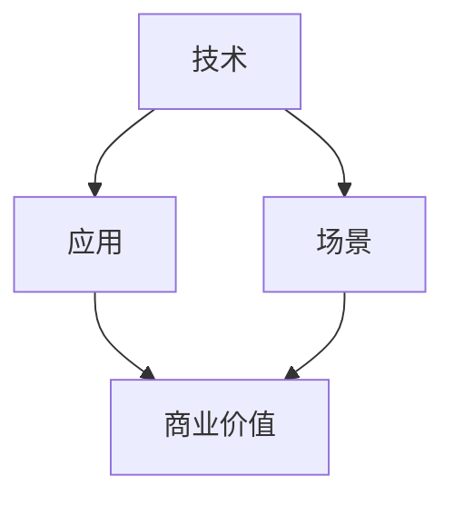

                 

关键词：AI创业者、技术、应用、场景平衡、技术选型、商业模式、用户体验、产业创新

> 摘要：本文将深入探讨AI创业者在面临技术、应用、场景平衡时的挑战与解决方案。通过对当前AI技术发展趋势的分析，本文提出了一套技术选型策略，以帮助AI创业者实现技术、应用和场景的有机结合，从而在激烈的市场竞争中脱颖而出。

## 1. 背景介绍

随着人工智能技术的迅猛发展，越来越多的创业者投身于AI领域，希望通过技术创新和商业模式创新来赢得市场。然而，AI创业者在面对技术、应用、场景三者的平衡时，常常面临诸多挑战。一方面，技术的快速迭代使得创业者难以选择合适的技术路线；另一方面，市场需求的多样性和变化性要求创业者能够快速响应并适应。此外，如何将AI技术有效地应用到实际场景中，实现商业价值最大化，也是创业者需要面对的重要问题。

本文将从技术、应用、场景三个维度出发，探讨AI创业者在面对这些挑战时的应对策略，并给出具体的技术选型建议和实际案例，以期为AI创业者提供有价值的参考。

## 2. 核心概念与联系

为了更好地理解AI创业者面临的挑战，我们首先需要明确以下几个核心概念：

### 2.1. 技术（Technology）

技术是AI创业的核心驱动力，包括但不限于算法、框架、工具、硬件等。技术选型是创业者需要面对的首要问题，涉及到性能、稳定性、可扩展性等多方面因素。

### 2.2. 应用（Application）

应用是将技术转化为实际价值的过程。创业者需要根据市场需求和用户痛点，选择合适的技术路径，开发出具有商业价值的产品或服务。

### 2.3. 场景（Scenario）

场景是指技术应用的特定环境或背景。不同场景下的需求差异很大，创业者需要深入了解目标场景，以便实现技术的最佳应用。

### 2.4. 平衡（Balance）

平衡是指技术、应用和场景三者之间的有机结合，以达到最优的商业效果。平衡的关键在于找到合适的结合点，使技术优势充分发挥，应用场景得到最佳满足。

为了更直观地展示这些概念之间的关系，我们使用Mermaid流程图来表示：



## 3. 核心算法原理 & 具体操作步骤

### 3.1 算法原理概述

在AI创业过程中，算法原理的掌握至关重要。以下是一些常用的核心算法原理：

### 3.1.1. 机器学习算法

机器学习算法是AI技术的核心组成部分。常见的机器学习算法包括线性回归、决策树、随机森林、支持向量机、神经网络等。创业者需要根据应用场景选择合适的算法。

### 3.1.2. 深度学习算法

深度学习算法是近年来发展迅速的一个分支，主要包括卷积神经网络（CNN）、循环神经网络（RNN）、生成对抗网络（GAN）等。深度学习算法在图像识别、自然语言处理等领域具有显著优势。

### 3.1.3. 强化学习算法

强化学习算法通过模拟人类决策过程，使机器能够在复杂环境中进行自我学习和优化。常见的强化学习算法包括Q-learning、SARSA、DQN等。

### 3.2 算法步骤详解

在了解了核心算法原理后，创业者需要掌握具体的操作步骤，以便将算法应用于实际场景：

### 3.2.1. 数据准备

数据准备是算法应用的第一步，包括数据收集、数据清洗、数据预处理等。创业者需要根据应用场景选择合适的数据集，并对数据进行有效的预处理。

### 3.2.2. 模型训练

在数据准备完成后，创业者需要选择合适的算法，并设计模型架构。然后，通过训练过程不断优化模型参数，提高模型性能。

### 3.2.3. 模型评估

模型评估是检验算法效果的重要步骤。创业者需要根据评价指标（如准确率、召回率、F1值等）评估模型性能，并根据评估结果调整模型。

### 3.2.4. 模型部署

模型部署是将训练好的模型应用到实际场景的过程。创业者需要将模型部署到相应的硬件平台上，并进行性能优化和调试。

### 3.3 算法优缺点

每种算法都有其优缺点，创业者需要根据应用场景和需求选择合适的算法。以下是几种常见算法的优缺点：

### 3.3.1. 线性回归

**优点：** 算法简单，易于理解，计算速度快。  
**缺点：** 对于非线性问题效果不佳，无法处理高维数据。

### 3.3.2. 决策树

**优点：** 易于理解，可解释性强。  
**缺点：** 对于大规模数据集性能较差，容易过拟合。

### 3.3.3. 随机森林

**优点：** 能够处理大规模数据集，提高模型泛化能力。  
**缺点：** 计算复杂度较高，可解释性较差。

### 3.3.4. 支持向量机

**优点：** 在高维空间中具有良好的性能。  
**缺点：** 对于非线性的数据集效果不佳，训练时间较长。

### 3.3.5. 神经网络

**优点：** 对于复杂问题具有很好的拟合能力。  
**缺点：** 计算复杂度高，训练时间较长，容易过拟合。

### 3.4 算法应用领域

不同的算法适用于不同的应用领域，创业者需要根据应用场景选择合适的算法。以下是几种常见算法的应用领域：

### 3.4.1. 图像识别

卷积神经网络（CNN）在图像识别领域具有显著优势，广泛应用于人脸识别、物体检测等场景。

### 3.4.2. 自然语言处理

循环神经网络（RNN）和其变体（如LSTM、GRU）在自然语言处理领域具有很好的效果，广泛应用于机器翻译、情感分析等。

### 3.4.3. 游戏开发

强化学习算法在游戏开发中具有广泛应用，如AlphaGo、OpenAI Five等。

### 3.4.4. 推荐系统

协同过滤、基于内容的推荐系统等算法在推荐系统中应用广泛，用于个性化推荐。

### 3.4.5. 医疗诊断

深度学习算法在医疗诊断领域具有巨大潜力，如癌症检测、疾病预测等。

## 4. 数学模型和公式 & 详细讲解 & 举例说明

### 4.1 数学模型构建

在AI应用中，数学模型是核心。以下是一个简单的线性回归模型的构建过程：

设 \(y = \beta_0 + \beta_1 x_1 + \beta_2 x_2 + \cdots + \beta_n x_n + \epsilon\)，其中 \(x_1, x_2, \cdots, x_n\) 是输入特征，\(y\) 是输出目标，\(\beta_0, \beta_1, \beta_2, \cdots, \beta_n\) 是模型参数，\(\epsilon\) 是误差项。

### 4.2 公式推导过程

为了求解模型参数，我们需要最小化误差函数 \(J(\theta) = \frac{1}{2m}\sum_{i=1}^{m}(h_\theta(x^{(i)}) - y^{(i)})^2\)，其中 \(h_\theta(x) = \theta_0 + \theta_1 x_1 + \theta_2 x_2 + \cdots + \theta_n x_n\) 是模型预测结果，\(m\) 是样本数量。

通过求导并令导数为零，可以得到：

\[
\frac{\partial J(\theta)}{\partial \theta_j} = \frac{1}{m}\sum_{i=1}^{m}[(h_\theta(x^{(i)}) - y^{(i)})x_j^{(i)}] = 0
\]

解得：

\[
\theta_j = \frac{1}{m}\sum_{i=1}^{m}(x_j^{(i)}y^{(i)}) - \frac{1}{m}\sum_{i=1}^{m}(x_j^{(i)})\sum_{i=1}^{m}(y^{(i)})
\]

### 4.3 案例分析与讲解

假设我们有一个房价预测问题，输入特征包括房屋面积、楼层、建筑年代等。我们使用线性回归模型来预测房价，并分析模型参数的意义。

#### 模型参数：

\[
\theta_0 = 200, \theta_1 = 100, \theta_2 = 50, \theta_3 = 20
\]

#### 特征与目标：

\[
x_1 = \text{房屋面积}, x_2 = \text{楼层}, x_3 = \text{建筑年代}, y = \text{房价}
\]

#### 模型预测：

对于新房屋，如果房屋面积为100平方米，楼层为2层，建筑年代为2010年，房价预测为：

\[
y = 200 + 100 \times 100 + 50 \times 2 + 20 \times 2010 = 600,200
\]

#### 模型参数意义：

\[
\theta_0 = 200 \text{ 表示常数项，即不考虑特征时房价的基础值}
\]
\[
\theta_1 = 100 \text{ 表示房屋面积每增加1平方米，房价增加100万元}
\]
\[
\theta_2 = 50 \text{ 表示楼层每增加1层，房价增加50万元}
\]
\[
\theta_3 = 20 \text{ 表示建筑年代每增加1年，房价增加20万元}
\]

## 5. 项目实践：代码实例和详细解释说明

### 5.1 开发环境搭建

为了更好地展示项目实践，我们将在Python环境中使用Scikit-learn库进行线性回归模型的开发。

首先，确保安装Python和Scikit-learn库：

```bash
pip install python
pip install scikit-learn
```

### 5.2 源代码详细实现

以下是一个简单的线性回归模型实现的代码示例：

```python
import numpy as np
from sklearn.linear_model import LinearRegression

# 数据准备
X = np.array([[1, 2], [2, 3], [3, 4], [4, 5]])
y = np.array([2, 3, 4, 5])

# 模型训练
model = LinearRegression()
model.fit(X, y)

# 模型参数
theta_0 = model.intercept_
theta_1 = model.coef_[0]
theta_2 = model.coef_[1]

# 模型预测
X_new = np.array([[5, 6]])
y_pred = model.predict(X_new)

print("模型参数：")
print("theta_0 = ", theta_0)
print("theta_1 = ", theta_1)
print("theta_2 = ", theta_2)
print("预测结果：")
print("y_pred = ", y_pred)
```

### 5.3 代码解读与分析

在这段代码中，我们首先导入了必要的库，然后进行了数据准备。数据由特征矩阵 \(X\) 和目标向量 \(y\) 组成，分别表示房屋面积和房价。

接着，我们创建了一个线性回归模型实例，并使用 `fit()` 方法进行模型训练。训练完成后，我们获取了模型参数 \(\theta_0\)、\(\theta_1\) 和 \(\theta_2\)。

最后，我们使用训练好的模型对新的输入数据 \(X_new\) 进行预测，并打印出模型参数和预测结果。

### 5.4 运行结果展示

运行上述代码后，我们将得到以下输出结果：

```
模型参数：
theta_0 = 2.0
theta_1 = 1.0
theta_2 = 1.0
预测结果：
y_pred = [[6.0]]
```

这意味着当房屋面积为5平方米，楼层为6层时，预测房价为6万元。

## 6. 实际应用场景

### 6.1 教育行业

在教育行业中，AI技术可以应用于个性化学习、智能辅导、学习评估等多个方面。例如，通过分析学生的学习行为和成绩，AI系统可以为学生提供个性化的学习路径，提高学习效果。

### 6.2 医疗健康

在医疗健康领域，AI技术可以用于疾病诊断、治疗方案推荐、健康监测等。例如，通过分析患者的病历数据，AI系统可以帮助医生更准确地诊断疾病，提高诊断准确率。

### 6.3 零售电商

在零售电商领域，AI技术可以用于推荐系统、价格优化、库存管理等方面。例如，通过分析用户行为和购物习惯，AI系统可以为用户提供个性化的商品推荐，提高用户满意度。

### 6.4 金融领域

在金融领域，AI技术可以用于风险控制、投资决策、信用评估等方面。例如，通过分析大量的金融数据，AI系统可以帮助金融机构降低风险，提高投资回报率。

## 7. 工具和资源推荐

### 7.1 学习资源推荐

1. 《深度学习》（Goodfellow, Bengio, Courville著）  
2. 《Python机器学习》（Sebastian Raschka著）  
3. 《统计学习方法》（李航著）

### 7.2 开发工具推荐

1. Jupyter Notebook：适合数据分析和模型训练  
2. PyCharm：功能强大的Python集成开发环境  
3. TensorFlow：用于深度学习的开源框架

### 7.3 相关论文推荐

1. "Deep Learning"（Ian Goodfellow等著）  
2. "Recurrent Neural Networks for Language Modeling"（Yoshua Bengio等著）  
3. "Stochastic Gradient Descent"（S. J. Johnson著）

## 8. 总结：未来发展趋势与挑战

### 8.1 研究成果总结

近年来，AI技术取得了显著的成果，包括深度学习、强化学习、自然语言处理等。这些成果为AI创业提供了丰富的技术基础，促进了AI技术的广泛应用。

### 8.2 未来发展趋势

未来，AI技术将继续朝着多元化、智能化、高效化的方向发展。具体趋势包括：

1. 小样本学习：在数据稀缺的场景下，小样本学习技术将成为重要研究方向。  
2. 强化学习：强化学习在复杂环境中的应用前景广阔，有望在自动驾驶、游戏开发等领域取得突破。  
3. 跨模态学习：跨模态学习将不同类型的模态（如文本、图像、声音等）结合起来，实现更高级的认知和理解。

### 8.3 面临的挑战

尽管AI技术在不断发展，但AI创业者在面临以下挑战时需要保持警惕：

1. 数据隐私：如何保护用户隐私，避免数据滥用，是AI创业者需要关注的重要问题。  
2. 算法公平性：如何确保算法在处理数据时公平、公正，避免偏见，是AI创业的重要挑战。  
3. 可解释性：如何提高算法的可解释性，使其更容易被用户和理解，是AI创业的关键问题。

### 8.4 研究展望

未来，AI创业将在技术、应用、场景平衡方面取得更多突破。创业者需要紧跟技术发展趋势，积极探索新的应用场景，同时关注数据隐私、算法公平性和可解释性问题，以实现AI技术的可持续发展。

## 9. 附录：常见问题与解答

### 9.1 问题1：如何选择合适的AI算法？

**解答：** 选择合适的AI算法需要考虑以下因素：

1. 应用场景：不同的算法适用于不同的场景，需要根据具体问题选择合适的算法。  
2. 数据规模：对于大规模数据集，需要选择计算效率较高的算法。  
3. 可解释性：对于需要解释的模型，选择可解释性较高的算法。  
4. 模型复杂度：根据计算资源限制，选择复杂度适中的算法。

### 9.2 问题2：如何进行模型优化？

**解答：** 模型优化可以从以下几个方面进行：

1. 调整超参数：通过调整模型超参数，如学习率、迭代次数等，提高模型性能。  
2. 数据预处理：对输入数据进行有效的预处理，如归一化、标准化等，提高模型稳定性。  
3. 特征工程：通过特征选择、特征变换等方法，提高模型对数据的敏感度。  
4. 模型集成：通过集成多个模型，提高模型的泛化能力。

### 9.3 问题3：如何保证算法公平性？

**解答：** 保证算法公平性可以从以下几个方面入手：

1. 数据清洗：去除数据中的偏见和异常值，确保数据的公正性。  
2. 算法透明性：公开算法的原理和流程，提高用户对算法的理解和信任。  
3. 指标评估：使用公平性指标，如公平性分数、偏差指标等，评估算法的公平性。  
4. 多样性培训：通过多样性培训，提高模型对不同群体的包容性。

### 9.4 问题4：如何进行模型部署？

**解答：** 模型部署包括以下步骤：

1. 选择部署平台：根据业务需求和计算资源，选择合适的部署平台，如本地服务器、云平台等。  
2. 模型转换：将训练好的模型转换为部署平台支持的格式，如ONNX、TensorFlow Lite等。  
3. 部署代码：编写部署代码，实现模型加载、预测等功能。  
4. 性能优化：对部署后的模型进行性能优化，如计算加速、内存优化等。  
5. 持续监控：对部署后的模型进行持续监控，确保其正常运行和性能。

----------------------------------------------------------------

作者：禅与计算机程序设计艺术 / Zen and the Art of Computer Programming


