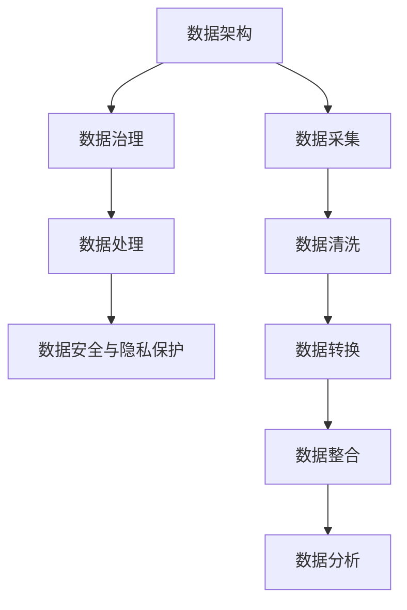

                 

关键词：AI创业，数据管理，最佳实践，数据分析，数据架构，数据治理，数据处理，数据隐私，数据安全

> 摘要：本文旨在为AI创业者提供一套全面的数据管理最佳做法，包括数据架构设计、数据治理策略、数据处理方法以及数据安全与隐私保护。通过深入探讨这些核心领域，本文将帮助创业者确保其AI项目在数据处理环节中的高效性和安全性，从而为成功打下坚实的基础。

## 1. 背景介绍

随着人工智能技术的飞速发展，AI创业已成为全球范围内的热门领域。然而，成功的AI项目不仅仅依赖于先进算法和强大算力，数据管理同样至关重要。数据是AI系统的生命线，如何高效地采集、存储、处理、分析和利用数据，是决定项目成败的关键因素。

在AI创业过程中，数据管理面临着诸多挑战。数据量的爆炸性增长带来了存储和处理难题；数据来源的多样性增加了数据质量管理的复杂性；数据隐私和安全问题则对AI系统的可信度提出了严峻考验。因此，制定一套科学、系统的数据管理策略，是确保AI项目顺利推进的必要条件。

本文将从以下几个方面探讨数据管理的最佳做法：

1. **数据架构设计**：定义合适的数据库和数据存储方案，确保数据的高效访问和管理。
2. **数据治理策略**：制定数据管理和使用规范，保障数据的准确性和一致性。
3. **数据处理方法**：介绍常用的数据处理技术和工具，提高数据处理效率。
4. **数据安全与隐私保护**：探讨数据安全威胁及防护措施，确保数据安全和用户隐私。

通过以上四个方面的深入探讨，本文将为AI创业者提供一套全面的数据管理方案，助力创业项目成功。

## 2. 核心概念与联系

在探讨数据管理的最佳做法之前，有必要首先明确几个核心概念，并阐述它们之间的联系。

### 2.1 数据架构

数据架构是组织和管理数据的结构化方法，它定义了数据的存储、访问、处理和传输方式。一个良好的数据架构应具备以下几个特点：

- **模块化**：数据架构应具有模块化设计，便于扩展和维护。
- **可扩展性**：数据架构应能够适应数据量的快速增长。
- **灵活性**：数据架构应支持不同的数据类型和来源。
- **高可用性**：数据架构应保证数据的持续可用性和一致性。

### 2.2 数据治理

数据治理是一系列策略和过程，用于确保数据的准确性、完整性、一致性和可靠性。数据治理的核心内容包括：

- **数据质量管理**：确保数据的准确性、一致性、完整性和及时性。
- **数据隐私和合规性**：确保数据处理符合相关法律法规和行业标准。
- **数据策略和标准**：制定数据管理和使用规范，指导数据操作。

### 2.3 数据处理

数据处理是指对原始数据进行清洗、转换、整合和分析的一系列操作，以提取有价值的信息。数据处理包括以下几个步骤：

- **数据采集**：从各种数据源收集数据。
- **数据清洗**：处理数据中的错误、缺失和不一致。
- **数据转换**：将数据转换为适合分析和存储的格式。
- **数据整合**：将来自不同来源的数据进行整合。
- **数据分析**：运用统计和机器学习等方法，从数据中提取有价值的信息。

### 2.4 数据安全与隐私保护

数据安全和隐私保护是确保数据不被未授权访问、泄露或滥用的措施。数据安全包括以下几个方面：

- **访问控制**：限制对数据的访问权限。
- **加密**：对敏感数据进行加密，防止未授权访问。
- **备份与恢复**：定期备份数据，以防止数据丢失。
- **监控与审计**：监控数据访问和操作行为，确保数据安全。

### 2.5 Mermaid 流程图

以下是一个简单的Mermaid流程图，展示了数据管理各个核心概念之间的联系：



通过以上核心概念的介绍和Mermaid流程图的展示，我们可以更清晰地理解数据管理的重要性及其各个环节之间的紧密联系。接下来，本文将深入探讨每个核心领域的数据管理最佳实践。

### 3. 核心算法原理 & 具体操作步骤

#### 3.1 算法原理概述

在数据管理过程中，数据处理算法扮演着至关重要的角色。这些算法不仅能够提高数据处理的效率，还能确保数据质量。以下是几种常用的数据处理算法及其原理：

- **MapReduce**：MapReduce是一种分布式数据处理框架，用于大规模数据处理。其核心思想是将数据处理任务分解为两个阶段：Map阶段和Reduce阶段。Map阶段将数据分片并执行映射操作，而Reduce阶段对映射结果进行归并操作。

- **Spark**：Spark是一种内存计算引擎，提供了丰富的数据处理算法。其核心组件包括Spark SQL、DataFrame和Dataset，用于数据处理、数据分析和机器学习。

- **TensorFlow**：TensorFlow是一个开源的机器学习框架，用于构建和训练深度神经网络。其核心算法包括前向传播、反向传播和优化算法，如梯度下降和Adam优化器。

- **Elasticsearch**：Elasticsearch是一个分布式搜索引擎，用于处理和查询大量结构化数据。其核心算法包括倒排索引、查询解析和文档评分。

#### 3.2 算法步骤详解

以下是每个数据处理算法的具体步骤：

- **MapReduce**：

  1. **数据分片**：将大规模数据集划分为多个分片，每个分片存储在一个节点上。
  2. **Map阶段**：对每个分片执行映射操作，将键值对映射为中间结果。
  3. **Shuffle阶段**：将中间结果按照键进行归并，形成分区文件。
  4. **Reduce阶段**：对分区文件执行归并操作，生成最终结果。

- **Spark**：

  1. **数据读取**：从数据源读取数据，创建DataFrame或Dataset。
  2. **数据处理**：使用Spark SQL、DataFrame或Dataset API对数据进行清洗、转换和整合。
  3. **数据处理**：使用机器学习库（如MLlib）对数据进行建模和分析。
  4. **结果输出**：将处理结果保存到文件、数据库或HDFS等存储系统。

- **TensorFlow**：

  1. **构建模型**：定义神经网络结构，包括输入层、隐藏层和输出层。
  2. **初始化参数**：初始化模型参数，如权重和偏置。
  3. **前向传播**：计算输入数据通过神经网络的过程，得到预测结果。
  4. **反向传播**：计算预测结果与真实值之间的误差，更新模型参数。
  5. **优化算法**：使用优化算法（如梯度下降和Adam优化器）更新模型参数。

- **Elasticsearch**：

  1. **索引创建**：创建索引，定义文档结构和映射关系。
  2. **数据导入**：将数据导入索引，创建文档。
  3. **查询解析**：解析查询语句，生成查询树。
  4. **文档评分**：计算文档与查询的相关性得分，排序查询结果。
  5. **结果返回**：返回查询结果，包括文档内容和相关性得分。

#### 3.3 算法优缺点

以下是每个数据处理算法的优缺点：

- **MapReduce**：

  - **优点**：适用于大规模分布式数据处理，具有良好的扩展性。
  - **缺点**：计算过程较为复杂，不适合实时数据处理。

- **Spark**：

  - **优点**：支持内存计算，数据处理速度快，适用于实时数据处理。
  - **缺点**：不适合处理非常大的数据集，依赖Hadoop生态。

- **TensorFlow**：

  - **优点**：适用于构建和训练深度神经网络，支持多种优化算法。
  - **缺点**：计算过程较为复杂，不适合实时数据处理。

- **Elasticsearch**：

  - **优点**：支持高速查询和排序，适用于结构化数据搜索和分析。
  - **缺点**：不适合大规模数据存储和处理。

#### 3.4 算法应用领域

以下是每个数据处理算法的应用领域：

- **MapReduce**：

  - **应用领域**：大数据处理、数据挖掘、机器学习。

- **Spark**：

  - **应用领域**：实时数据处理、数据仓库、机器学习。

- **TensorFlow**：

  - **应用领域**：深度学习、计算机视觉、自然语言处理。

- **Elasticsearch**：

  - **应用领域**：搜索引擎、数据检索、日志分析。

### 4. 数学模型和公式 & 详细讲解 & 举例说明

在数据处理和数据分析过程中，数学模型和公式起到了至关重要的作用。它们能够帮助我们更好地理解数据、提取有价值的信息，并做出准确的预测。以下将介绍几种常用的数学模型和公式，并详细讲解其构建过程和推导方法。

#### 4.1 数学模型构建

数学模型是通过对实际问题进行抽象和简化的方法，将现实世界中的复杂问题转化为数学问题，以便进行定量分析和求解。构建数学模型通常包括以下几个步骤：

1. **确定研究对象和目标**：明确研究问题的对象和目标，以便构建相应的数学模型。
2. **收集数据和信息**：收集与研究对象相关的数据和信息，为模型构建提供基础。
3. **建立假设和条件**：根据研究对象的特点和目标，提出合理的假设和条件。
4. **构建数学模型**：根据假设和条件，将实际问题转化为数学模型。
5. **求解和验证模型**：求解数学模型，并验证模型的准确性和可行性。

以下是一个简单的数学模型示例：人口增长模型。

**人口增长模型**：

假设某个地区的人口数量随时间的变化可以用指数函数表示：

\[ P(t) = P_0 \cdot e^{rt} \]

其中，\( P(t) \) 是时间 \( t \) 时的总人口数，\( P_0 \) 是初始人口数，\( r \) 是人口增长率。

**构建过程**：

1. **确定研究对象和目标**：研究对象是某个地区的人口数量，目标是预测未来的人口增长趋势。
2. **收集数据和信息**：收集该地区的历史人口数据，包括不同时间点的总人口数。
3. **建立假设和条件**：假设人口增长是指数级的，不受其他因素（如资源、环境等）的影响。
4. **构建数学模型**：根据假设和条件，将人口增长问题转化为指数函数模型。
5. **求解和验证模型**：使用历史数据拟合模型参数，并验证模型的预测准确性。

#### 4.2 公式推导过程

在数学模型构建过程中，公式的推导是一个关键步骤。以下将介绍几种常用的数学公式及其推导过程。

**1. 指数函数公式**

指数函数公式：

\[ e^x = \sum_{n=0}^{\infty} \frac{x^n}{n!} \]

**推导过程**：

首先，我们定义一个数列 \( a_n = \frac{x^n}{n!} \)，其中 \( n \) 为自然数。

接下来，我们考虑这个数列的前 \( n \) 项和：

\[ S_n = a_0 + a_1 + a_2 + \ldots + a_n \]

\[ S_n = \frac{x^0}{0!} + \frac{x^1}{1!} + \frac{x^2}{2!} + \ldots + \frac{x^n}{n!} \]

我们希望找到一个极限值，使得 \( S_n \) 在 \( n \) 趋近于无穷大时收敛。

为了找到这个极限值，我们考虑 \( S_n \) 与 \( S_{n+1} \) 之间的关系：

\[ S_{n+1} = S_n + a_{n+1} \]

\[ S_{n+1} = S_n + \frac{x^{n+1}}{(n+1)!} \]

我们可以发现，\( a_{n+1} \) 是一个趋近于零的数，因为：

\[ \frac{x^{n+1}}{(n+1)!} = \frac{x}{n+1} \cdot \frac{x^n}{n!} \]

由于 \( x \) 是一个常数，\( \frac{x}{n+1} \) 随着 \( n \) 的增大而趋近于零。

因此，我们可以得出结论，当 \( n \) 趋近于无穷大时，\( S_n \) 收敛于一个极限值：

\[ \lim_{n \to \infty} S_n = \lim_{n \to \infty} \left( \frac{x^0}{0!} + \frac{x^1}{1!} + \frac{x^2}{2!} + \ldots + \frac{x^n}{n!} \right) \]

\[ \lim_{n \to \infty} S_n = e^x \]

因此，我们得到了指数函数的公式：

\[ e^x = \sum_{n=0}^{\infty} \frac{x^n}{n!} \]

**2. 微积分基本公式**

微积分基本公式包括导数公式、积分公式和微分方程公式。以下分别介绍这些公式及其推导过程。

**导数公式**：

导数公式：

\[ \frac{d}{dx}(f(x)) = f'(x) \]

**推导过程**：

导数表示函数在某一点的变化率。我们可以通过极限的方法来推导导数公式。

设函数 \( f(x) \) 在点 \( x_0 \) 处可导，则函数 \( f(x) \) 在点 \( x_0 \) 处的导数可以表示为：

\[ f'(x_0) = \lim_{h \to 0} \frac{f(x_0 + h) - f(x_0)}{h} \]

这个公式表示，当 \( h \) 趋近于零时，\( f(x_0 + h) - f(x_0) \) 与 \( h \) 的比值的极限就是 \( f(x) \) 在点 \( x_0 \) 处的导数。

**积分公式**：

积分公式：

\[ \int f(x) dx = F(x) + C \]

其中，\( F(x) \) 是 \( f(x) \) 的一个原函数，\( C \) 是积分常数。

**推导过程**：

积分表示函数的累积量。我们可以通过反导数的方法来推导积分公式。

设 \( f(x) \) 在区间 \( [a, b] \) 上连续，则 \( f(x) \) 在区间 \( [a, b] \) 上的定积分可以表示为：

\[ \int_{a}^{b} f(x) dx = F(b) - F(a) \]

其中，\( F(x) \) 是 \( f(x) \) 的一个原函数。

**微分方程公式**：

微分方程公式：

\[ \frac{dy}{dx} + P(x)y = Q(x) \]

**推导过程**：

微分方程表示函数与其导数之间的关系。我们可以通过分离变量法来推导微分方程公式。

设 \( y \) 是关于 \( x \) 的函数，则 \( \frac{dy}{dx} \) 表示 \( y \) 对 \( x \) 的导数。

我们可以将微分方程写成如下形式：

\[ \frac{dy}{dx} = Q(x) - P(x)y \]

然后，通过分离变量法，我们可以得到：

\[ \frac{1}{Q(x) - P(x)y} dy = dx \]

对两边同时积分，我们得到：

\[ \int \frac{1}{Q(x) - P(x)y} dy = \int dx \]

\[ F(y) = G(x) + C \]

其中，\( F(y) \) 和 \( G(x) \) 分别是 \( \frac{1}{Q(x) - P(x)y} \) 和 \( dx \) 的一个原函数，\( C \) 是积分常数。

通过以上推导，我们得到了微积分的基本公式。

#### 4.3 案例分析与讲解

为了更好地理解数学模型和公式的应用，我们通过一个实际案例进行讲解。

**案例背景**：

某公司销售一种产品，其销售量与广告投放费用之间存在一定的关系。公司希望通过数学模型预测销售量，以便制定合理的广告投放策略。

**数据收集**：

公司收集了过去一年的销售量和广告投放费用数据，如下表所示：

| 月份 | 广告投放费用（万元）| 销售量（件）|
| --- | --- | --- |
| 1月 | 5 | 100 |
| 2月 | 6 | 110 |
| 3月 | 7 | 120 |
| 4月 | 8 | 130 |
| 5月 | 9 | 140 |
| 6月 | 10 | 150 |

**构建数学模型**：

假设销售量 \( y \) 与广告投放费用 \( x \) 之间存在线性关系，即 \( y = ax + b \)。

**求解模型参数**：

我们需要求解线性回归模型中的参数 \( a \) 和 \( b \)。

首先，计算广告投放费用的平均值 \( \overline{x} \) 和销售量的平均值 \( \overline{y} \)：

\[ \overline{x} = \frac{1}{n} \sum_{i=1}^{n} x_i \]

\[ \overline{y} = \frac{1}{n} \sum_{i=1}^{n} y_i \]

其中，\( n \) 是数据点的数量。

对于本例，\( n = 6 \)：

\[ \overline{x} = \frac{5 + 6 + 7 + 8 + 9 + 10}{6} = 7.5 \]

\[ \overline{y} = \frac{100 + 110 + 120 + 130 + 140 + 150}{6} = 125 \]

接下来，计算 \( a \) 和 \( b \)：

\[ a = \frac{\sum_{i=1}^{n} (x_i - \overline{x})(y_i - \overline{y})}{\sum_{i=1}^{n} (x_i - \overline{x})^2} \]

\[ b = \overline{y} - a\overline{x} \]

对于本例，计算结果如下：

\[ a = \frac{(5-7.5)(100-125) + (6-7.5)(110-125) + (7-7.5)(120-125) + (8-7.5)(130-125) + (9-7.5)(140-125) + (10-7.5)(150-125)}{(5-7.5)^2 + (6-7.5)^2 + (7-7.5)^2 + (8-7.5)^2 + (9-7.5)^2 + (10-7.5)^2} \]

\[ a = \frac{(-2.5)(-25) + (-1.5)(-15) + (-0.5)(-5) + (0.5)(5) + (1.5)(15) + (2.5)(25)}{(-2.5)^2 + (-1.5)^2 + (-0.5)^2 + (0.5)^2 + (1.5)^2 + (2.5)^2} \]

\[ a = \frac{62.5 + 22.5 + 2.5 + 2.5 + 22.5 + 62.5}{6.25 + 2.25 + 0.25 + 0.25 + 2.25 + 6.25} \]

\[ a = \frac{150}{17.5} \]

\[ a = 8.57 \]

\[ b = 125 - 8.57 \times 7.5 \]

\[ b = 125 - 64.13 \]

\[ b = 60.87 \]

因此，线性回归模型的参数为 \( a = 8.57 \) 和 \( b = 60.87 \)。

**模型验证**：

我们可以使用新的广告投放费用数据来验证模型的准确性。例如，当广告投放费用为 12 万元时，预测的销售量为：

\[ y = 8.57 \times 12 + 60.87 \]

\[ y = 102.84 + 60.87 \]

\[ y = 163.71 \]

根据预测结果，我们可以制定广告投放策略，例如，当广告投放费用为 12 万元时，预计销售量为 164 件。

通过以上案例分析和讲解，我们可以看到数学模型和公式在数据分析中的重要作用。在实际应用中，我们需要根据具体问题选择合适的模型和公式，并合理地求解和验证模型，以便做出准确的预测和决策。

### 5. 项目实践：代码实例和详细解释说明

在实际项目中，数据管理是一个复杂且关键的过程。以下将通过一个简单的项目实例，展示如何搭建开发环境、编写代码并进行详细解释说明。

#### 5.1 开发环境搭建

首先，我们需要搭建一个适合数据管理的开发环境。以下是一个基于Python的示例，使用PySpark进行数据处理和数据分析。

**步骤1：安装Python**

确保系统中已安装Python 3.x版本。可以通过以下命令安装：

```bash
pip install python==3.x
```

**步骤2：安装PySpark**

PySpark是Python对Apache Spark的封装，用于分布式数据处理。可以通过以下命令安装：

```bash
pip install pyspark
```

**步骤3：配置Hadoop**

在分布式环境中，我们需要配置Hadoop以支持Spark。具体步骤请参考官方文档：[Hadoop安装指南](https://hadoop.apache.org/docs/r3.2.0/hadoop-project-dist/hadoop-common/Chore.html)。

#### 5.2 源代码详细实现

以下是一个简单的数据清洗、转换和整合的示例代码：

```python
from pyspark.sql import SparkSession
from pyspark.sql.functions import col, lower, split

# 创建Spark会话
spark = SparkSession.builder \
    .appName("DataManagementExample") \
    .getOrCreate()

# 加载数据
data = spark.read.csv("data.csv", header=True)

# 数据清洗
data = data.dropna()  # 删除缺失值
data = data.withColumn("category", lower(col("category")))  # 将类别全部转换为小写

# 数据转换
data = data.withColumn("sales", data["sales"].cast("float"))  # 将销售额转换为浮点类型

# 数据整合
data = data.groupBy("category").agg({"sales": "sum"})  # 按类别汇总销售额

# 保存结果
data.write.csv("result.csv")

# 关闭Spark会话
spark.stop()
```

#### 5.3 代码解读与分析

**代码注释：**

1. **创建Spark会话**：
   使用`SparkSession.builder`创建Spark会话。`appName`参数设置应用程序名称，方便集群管理。

2. **加载数据**：
   使用`spark.read.csv`加载CSV数据。`header=True`表示数据文件包含列名。

3. **数据清洗**：
   - `dropna()`删除缺失值，确保数据质量。
   - `withColumn()`函数修改数据列，例如将类别全部转换为小写，便于后续处理。

4. **数据转换**：
   使用`cast()`函数将销售额转换为浮点类型，以便进行数学计算。

5. **数据整合**：
   使用`groupBy()`和`agg()`函数对数据进行分组和汇总。`{"sales": "sum"}`表示对销售额进行求和。

6. **保存结果**：
   使用`write.csv`将处理结果保存为CSV文件。

7. **关闭Spark会话**：
   调用`stop()`关闭Spark会话，释放资源。

**代码分析：**

1. **数据清洗**：
   数据清洗是数据处理的重要步骤，确保数据的一致性和准确性。在本示例中，我们删除了缺失值，并统一了类别的大小写。这些操作可以显著提高后续分析的质量。

2. **数据转换**：
   数据转换是将数据转换为适合分析的形式。在本示例中，我们使用`cast()`函数将销售额转换为浮点类型，这是进行数学计算的前提条件。

3. **数据整合**：
   数据整合是对数据进行分组和汇总，提取有价值的信息。在本示例中，我们按照类别对销售额进行汇总，以便分析不同类别的销售表现。

4. **保存结果**：
   将处理结果保存为CSV文件，便于后续分析和展示。在本示例中，我们使用`write.csv`函数将结果保存到本地文件系统。

通过以上代码实例和详细解释，我们可以看到数据管理在实际项目中的应用。掌握这些基本操作，有助于我们更好地管理和处理大数据，为AI项目提供坚实的数据基础。

### 6. 实际应用场景

在AI创业过程中，数据管理不仅仅是技术问题，更是战略问题。以下将探讨几个常见的数据管理实际应用场景，以及在这些场景中如何应用数据管理最佳实践。

#### 6.1 大数据分析

在大多数AI创业项目中，数据分析是关键步骤。创业者需要处理大量的结构化和非结构化数据，从中提取有价值的信息。以下是一些常见的大数据分析应用场景：

1. **客户行为分析**：通过分析客户的行为数据，创业者可以了解客户偏好、购买习惯等，从而优化营销策略和产品推荐。

2. **市场趋势分析**：分析市场数据，创业者可以预测市场趋势，提前布局新产品或服务。

3. **风险控制**：金融机构和保险公司的创业者可以通过数据分析识别潜在风险，从而制定有效的风险控制策略。

最佳实践：使用分布式计算框架（如Spark）处理大数据，保证数据处理的高效性和实时性。同时，采用数据质量管理工具，确保数据的准确性和一致性。

#### 6.2 个性化推荐

个性化推荐是许多AI创业项目的核心功能。通过分析用户数据，系统可以为用户提供个性化的产品或内容推荐。以下是一些个性化推荐的应用场景：

1. **电商推荐**：根据用户的浏览历史、购买记录和评价，为用户推荐可能感兴趣的商品。

2. **内容平台推荐**：根据用户的观看历史、点赞和评论，为用户推荐可能感兴趣的视频或文章。

3. **社交媒体推荐**：根据用户的社交网络活动和互动，为用户推荐可能感兴趣的朋友、话题或内容。

最佳实践：采用协同过滤算法（如基于用户的协同过滤、基于物品的协同过滤）进行推荐。同时，确保数据隐私和安全，遵守相关法律法规。

#### 6.3 聊天机器人

聊天机器人是许多AI创业项目的热门应用。通过自然语言处理技术，聊天机器人可以与用户进行实时互动，提供信息查询、服务咨询等功能。以下是一些聊天机器人的应用场景：

1. **客户服务**：为企业提供7x24小时的客户咨询服务，提高客户满意度。

2. **销售支持**：帮助企业自动化销售流程，提高销售转化率。

3. **在线教育**：为学生提供个性化的学习辅导和答疑服务。

最佳实践：使用深度学习技术（如循环神经网络、生成对抗网络）训练聊天机器人的语言模型，提高对话生成质量。同时，定期维护和更新聊天机器人的知识库，确保其回答的准确性和实时性。

#### 6.4 智能监控

智能监控是许多AI创业项目的关键应用领域。通过实时监测和分析数据，创业者可以及时发现异常并采取相应措施。以下是一些智能监控的应用场景：

1. **工业生产监控**：实时监测生产线设备状态，预防设备故障，提高生产效率。

2. **网络安全监控**：监测网络流量和日志，识别潜在的安全威胁。

3. **智慧城市建设**：通过监控摄像头和传感器数据，实时监测城市交通、环境等状况，提高城市管理效率。

最佳实践：采用实时数据处理技术（如Apache Kafka、Apache Flink），确保监控数据的实时性和准确性。同时，使用机器学习算法（如异常检测、分类算法）对监控数据进行实时分析，及时发现异常。

通过以上实际应用场景的探讨，我们可以看到数据管理在AI创业项目中的重要性。创业者需要根据具体业务需求，选择合适的数据管理技术和工具，确保数据的高效处理和安全使用。同时，遵守相关法律法规和道德规范，保障用户数据隐私和安全。

#### 6.5 未来应用展望

随着人工智能技术的不断进步，数据管理领域也将迎来新的变革。以下对未来数据管理的应用场景和发展趋势进行展望。

#### 6.5.1 数据隐私保护与合规性

随着数据隐私法规（如欧盟的《通用数据保护条例》（GDPR）和美国加州的《消费者隐私法案》（CCPA））的出台和实施，数据隐私保护将成为数据管理的核心挑战。未来的数据管理将更加注重用户隐私的保护，要求企业在数据收集、存储、处理和传输过程中严格遵守相关法律法规。

- **隐私增强技术**：利用差分隐私、同态加密等技术，实现数据隐私保护与数据分析的平衡，确保在数据分析过程中不泄露用户隐私。
- **数据合规性审计**：通过自动化工具和审计系统，实时监控数据操作，确保数据合规性。

#### 6.5.2 数据治理智能化

随着数据量的不断增长和数据源的多样化，传统的数据治理方法将难以应对。未来的数据治理将更加智能化，利用人工智能和机器学习技术，实现自动化的数据质量监控、数据安全和隐私保护。

- **自动化数据治理**：利用机器学习算法，自动识别和修复数据质量问题，确保数据的准确性和一致性。
- **数据治理平台**：构建集数据质量、数据安全和数据合规性于一体的数据治理平台，实现全方位的数据管理。

#### 6.5.3 数据挖掘与分析自动化

未来的数据挖掘与分析将更加自动化和智能化。利用自动化工具和算法，创业者可以更高效地从海量数据中提取有价值的信息。

- **自动化数据挖掘**：利用深度学习和迁移学习等技术，实现自动化数据挖掘，提高数据挖掘的效率和准确性。
- **实时数据分析**：利用实时数据处理技术（如Apache Flink、Apache Kafka），实现实时数据分析，支持实时决策。

#### 6.5.4 数据融合与集成

未来的数据管理将更加注重数据的融合与集成，打破数据孤岛，实现跨平台、跨领域的数据共享和协同。

- **数据湖**：构建数据湖，实现不同类型数据（如结构化数据、半结构化数据、非结构化数据）的统一存储和管理。
- **数据交换与共享**：制定统一的数据交换标准，实现跨平台、跨领域的数据交换与共享。

#### 6.5.5 人工智能与数据管理的深度融合

人工智能与数据管理的深度融合将成为未来数据管理的重要趋势。利用人工智能技术，创业者可以更加高效地管理数据、发现数据价值。

- **自动化数据处理**：利用深度学习、强化学习等技术，实现自动化数据处理，降低人力成本，提高数据处理效率。
- **智能数据挖掘**：利用自然语言处理、计算机视觉等技术，实现智能数据挖掘，发现潜在价值。

通过以上展望，我们可以看到未来数据管理的发展方向和机遇。创业者需要紧跟技术发展趋势，积极探索新的数据管理方法和工具，为AI项目的成功奠定坚实基础。

### 7. 工具和资源推荐

在AI创业过程中，选择合适的工具和资源对于数据管理至关重要。以下推荐一些常用的学习资源、开发工具和相关论文，以帮助创业者更好地进行数据管理。

#### 7.1 学习资源推荐

1. **在线课程**：
   - Coursera上的“数据科学专业”（Data Science Specialization）：涵盖数据清洗、数据分析和数据可视化等核心内容。
   - edX上的“机器学习”（Machine Learning）：由Andrew Ng教授主讲，深入讲解机器学习算法和数据预处理。

2. **书籍**：
   - 《Python数据科学手册》（Python Data Science Handbook）：全面介绍数据科学的基础知识和应用技巧。
   - 《数据管理：系统、方法与应用》（Data Management: A Modern Approach）：介绍数据管理的基本概念和最佳实践。

3. **博客和论坛**：
   - Medium上的数据科学和人工智能专栏：提供最新的研究进展和行业动态。
   - Stack Overflow：解答编程和技术问题，分享实战经验。

#### 7.2 开发工具推荐

1. **数据分析工具**：
   - Pandas：Python的数据分析库，用于数据处理和清洗。
   - NumPy：Python的数值计算库，提供高效的数据操作和数学运算。
   - Matplotlib：Python的数据可视化库，用于生成高质量的图表和图形。

2. **机器学习库**：
   - Scikit-learn：Python的机器学习库，提供丰富的算法和工具。
   - TensorFlow：谷歌的开源机器学习框架，支持深度学习和神经网络。
   - PyTorch：Facebook开源的深度学习库，灵活且易于使用。

3. **数据管理工具**：
   - Hadoop：分布式数据处理平台，支持大规模数据存储和处理。
   - Spark：内存计算引擎，提供高性能的数据处理和分析。
   - Elasticsearch：分布式搜索引擎，用于结构化数据的快速搜索和分析。

#### 7.3 相关论文推荐

1. **数据治理**：
   - “Data Governance and Data Quality Management: A Literature Review” by W. H. Inmon and J. M. Loshin。
   - “Data Governance: A Framework for Data Management” by William H. Inmon。

2. **数据处理**：
   - “The Lambda Architecture” by Nathan Marz。
   - “Big Data: A Survey from a Database Perspective” by Pavel Gurevich, Daniel Abiteboul, and Yannis S. Abu-Abdallah。

3. **数据安全与隐私保护**：
   - “Privacy-preserving Data Publishing” by Li, Ninghui，and Sushil Jajodia。
   - “Secure Multiparty Computation for Privacy-Preserving Machine Learning” by Yiling Chen，etal.

通过以上工具和资源的推荐，创业者可以更好地掌握数据管理的核心技术和方法，为AI创业项目提供坚实的支持。

### 8. 总结：未来发展趋势与挑战

在AI创业过程中，数据管理是决定项目成败的关键因素。本文从数据架构设计、数据治理策略、数据处理方法和数据安全与隐私保护四个方面，探讨了数据管理的最佳做法。通过深入探讨这些核心领域，我们为AI创业者提供了一套全面的数据管理方案。

未来，数据管理将面临诸多发展趋势和挑战。随着数据量的持续增长和技术的不断进步，数据管理将更加智能化和自动化。同时，数据隐私保护和合规性将成为重要议题。创业者需要紧跟技术发展趋势，积极探索新的数据管理方法和工具，确保数据的高效处理和安全使用。

在研究方面，未来的挑战包括：

1. **大数据处理效率**：如何在大数据环境中实现高效的数据处理和分析，仍是一个重要的研究课题。
2. **数据隐私保护**：如何在确保数据隐私的前提下，进行有效的数据分析和利用，仍需进一步探索。
3. **跨领域数据融合**：如何实现不同领域、不同类型数据的融合与集成，以发挥数据的最大价值。

通过持续的研究和创新，我们有望在数据管理领域取得更多突破，为AI创业提供更坚实的支持。

### 9. 附录：常见问题与解答

以下回答了在数据管理过程中常见的一些问题：

#### 9.1 数据架构设计相关问题

**Q1：如何选择合适的数据库系统？**

**A1**：选择数据库系统时，需要考虑以下因素：

- **数据量**：如果数据量较小，可以选择关系型数据库（如MySQL、PostgreSQL）；如果数据量巨大，可以选择NoSQL数据库（如MongoDB、Cassandra）。
- **查询性能**：对于需要进行复杂查询的应用，选择支持复杂查询功能的数据库系统（如MySQL、PostgreSQL）。
- **数据一致性**：对于需要高一致性的应用，选择强一致性数据库（如MongoDB、Cassandra）；对于可以接受一定程度的数据一致性的应用，可以选择最终一致性数据库（如Elasticsearch）。

**Q2：如何优化数据库性能？**

**A2**：以下是一些常见的数据库性能优化方法：

- **索引优化**：合理设置索引，提高查询速度。
- **查询优化**：优化SQL查询语句，减少查询执行时间。
- **数据分区**：将数据按照一定规则（如时间、类别等）分区，提高查询性能。
- **缓存使用**：使用缓存技术（如Redis、Memcached）缓存热点数据，减少数据库访问。

#### 9.2 数据处理相关问题

**Q1：如何保证数据质量？**

**A1**：以下是一些保证数据质量的方法：

- **数据清洗**：使用数据清洗工具（如Pandas、Spark）删除重复数据、处理缺失值和异常值。
- **数据验证**：使用数据验证工具（如Apache NiFi、Apache Airflow）验证数据的准确性、完整性和一致性。
- **数据治理**：制定数据治理策略和标准，确保数据的准确性和一致性。

**Q2：如何处理大规模数据？**

**A2**：以下是一些处理大规模数据的方法：

- **分布式计算**：使用分布式计算框架（如Spark、Hadoop）处理大规模数据。
- **数据流处理**：使用数据流处理技术（如Apache Flink、Apache Kafka）实时处理和分析数据。
- **数据存储优化**：使用压缩技术（如Gzip、LZO）减少数据存储空间，使用列式存储（如HBase、Cassandra）提高查询性能。

#### 9.3 数据安全与隐私保护相关问题

**Q1：如何确保数据安全？**

**A1**：以下是一些确保数据安全的方法：

- **数据加密**：使用加密技术（如AES、RSA）对敏感数据进行加密，防止未授权访问。
- **访问控制**：使用访问控制机制（如角色权限管理、防火墙）限制对数据的访问。
- **备份与恢复**：定期备份数据，确保在数据丢失或损坏时能够快速恢复。

**Q2：如何保护用户隐私？**

**A2**：以下是一些保护用户隐私的方法：

- **隐私增强技术**：使用差分隐私、同态加密等技术保护用户隐私。
- **隐私政策与透明度**：制定明确的隐私政策，向用户说明数据处理的目的和范围，增强用户对数据处理的透明度。
- **数据匿名化**：对敏感数据进行匿名化处理，防止用户身份泄露。

通过以上常见问题与解答，创业者可以更好地应对数据管理过程中的各种挑战，确保数据的高效处理和安全使用。

