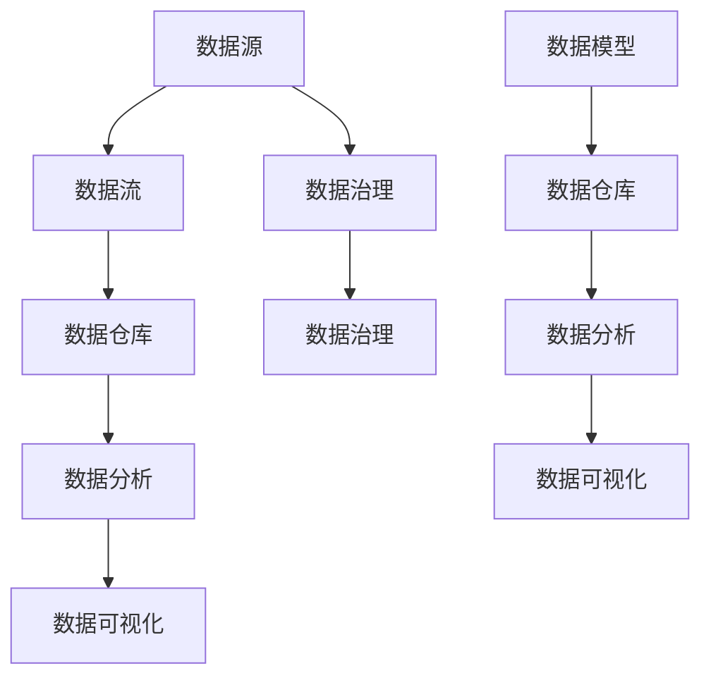

                 

关键词：AI创业、数据管理、策略、对策、技术、深度学习、大数据、数据挖掘

> 摘要：本文将探讨AI创业过程中，数据管理策略与对策的重要性。通过分析数据管理的核心概念、算法原理、数学模型以及实际应用场景，本文旨在为AI创业者提供一套完整的数据管理框架，以应对未来发展的挑战。

## 1. 背景介绍

随着人工智能技术的飞速发展，越来越多的创业者投身于AI领域的创新创业。然而，在众多成功的AI创业项目中，数据管理是至关重要的环节。数据管理不仅关乎项目的成功与否，更是决定企业竞争力的关键因素。

数据管理涉及数据的收集、存储、处理、分析和共享等方面。在AI创业中，数据管理策略与对策的选择直接影响到模型的性能、稳定性和可靠性。因此，本文将从以下几个方面展开讨论：

- 数据管理的核心概念与联系
- 核心算法原理与具体操作步骤
- 数学模型和公式及其应用
- 项目实践：代码实例与详细解释
- 实际应用场景及其未来展望
- 工具和资源推荐
- 未来发展趋势与挑战

通过本文的探讨，希望能够为AI创业者提供一套系统化的数据管理策略与对策，助力其在激烈的竞争中脱颖而出。

## 2. 核心概念与联系

在讨论数据管理之前，我们需要了解一些核心概念。以下是数据管理中常见的关键术语及其相互关系：

### 数据源（Data Sources）

数据源是指数据的来源，可以是内部或外部的系统、数据库、文件等。对于AI创业项目，选择合适的数据源至关重要。数据源的多样性和质量直接决定了后续数据处理和分析的效果。

### 数据仓库（Data Warehouse）

数据仓库是一种用于存储、管理和分析大量数据的系统。数据仓库的设计需要考虑数据的完整性、一致性、可用性和安全性。数据仓库是实现数据分析、报表生成和业务智能的基础设施。

### 数据流（Data Flow）

数据流是指数据在系统中流动和处理的过程。数据流通常涉及数据的收集、清洗、转换、加载等步骤。有效的数据流设计可以确保数据的准确性和实时性。

### 数据模型（Data Model）

数据模型是用于描述数据结构、关系和语义的抽象表示。常见的数据模型包括关系模型、文档模型、图模型等。选择合适的数据模型可以简化数据的存储、查询和管理。

### 数据治理（Data Governance）

数据治理是指一套政策、流程和技术的集合，用于确保数据的质量、安全和合规性。数据治理包括数据权限管理、数据质量控制、数据合规性检查等环节。

### 数据分析（Data Analysis）

数据分析是指使用统计学、机器学习等方法对数据进行处理和分析，以发现数据中的模式和规律。数据分析是AI创业项目中获取商业价值的关键步骤。

### 数据可视化（Data Visualization）

数据可视化是将数据以图形、图表等形式展示的过程。通过数据可视化，用户可以更直观地理解数据，发现数据中的隐藏信息。

这些核心概念相互关联，共同构成了数据管理的生态系统。以下是核心概念之间的Mermaid流程图：



通过上述流程图，我们可以看出数据管理的各个环节之间的紧密联系。只有合理地管理和利用数据，AI创业项目才能取得成功。

## 3. 核心算法原理 & 具体操作步骤

在数据管理中，核心算法的选择和实现是关键。以下我们将介绍几种常见的数据管理算法及其原理和操作步骤。

### 3.1 算法原理概述

#### 数据挖掘（Data Mining）

数据挖掘是一种从大量数据中发现有价值信息的方法。其基本原理包括：

- 特征选择：通过选择最重要的特征，减少数据维度，提高算法效率。
- 特征提取：将原始数据转换为适合算法处理的形式。
- 模型训练：使用统计学、机器学习等方法，训练模型以发现数据中的模式和规律。
- 模型评估：评估模型的性能，包括准确率、召回率、F1值等指标。

#### 数据清洗（Data Cleaning）

数据清洗是数据管理中必不可少的一步。其基本原理包括：

- 填充缺失值：使用统计学方法或插值法，填补数据中的空值。
- 去除重复值：删除重复的数据记录，保证数据的唯一性。
- 数据转换：将数据转换为统一的格式，如将字符串转换为数字、日期格式标准化等。
- 异常值处理：检测并处理数据中的异常值，如离群点、错误记录等。

#### 数据加密（Data Encryption）

数据加密是保护数据安全的重要手段。其基本原理包括：

- 对称加密：使用相同的密钥进行加密和解密，如AES、DES等。
- 非对称加密：使用不同的密钥进行加密和解密，如RSA、ECC等。
- 哈希算法：将数据转换为固定长度的字符串，如MD5、SHA-256等。

### 3.2 算法步骤详解

#### 数据挖掘

1. 数据预处理：包括数据清洗、特征选择和特征提取。
2. 模型选择：选择合适的机器学习算法，如决策树、支持向量机、神经网络等。
3. 模型训练：使用训练集训练模型，调整模型参数。
4. 模型评估：使用验证集评估模型性能，选择最优模型。
5. 模型应用：将模型应用于新的数据集，进行预测和决策。

#### 数据清洗

1. 检测缺失值：使用统计方法检测数据中的缺失值。
2. 填充缺失值：使用统计学方法或插值法填补缺失值。
3. 检测重复值：使用哈希算法检测重复值。
4. 删除重复值：删除重复的数据记录。
5. 数据转换：将数据转换为统一的格式。
6. 异常值处理：使用统计学方法检测异常值，并选择合适的处理方法。

#### 数据加密

1. 选择加密算法：根据数据的安全需求，选择合适的对称加密或非对称加密算法。
2. 生成密钥：生成用于加密和解密的密钥。
3. 加密数据：使用加密算法和密钥对数据进行加密。
4. 解密数据：使用加密算法和密钥对加密后的数据进行解密。

### 3.3 算法优缺点

#### 数据挖掘

- 优点：能够从大量数据中发现有价值的信息，提升业务决策的准确性。
- 缺点：算法复杂度较高，数据处理和模型训练耗时较长。

#### 数据清洗

- 优点：提高数据质量，为后续分析提供可靠的数据基础。
- 缺点：处理过程繁琐，可能引入新的错误。

#### 数据加密

- 优点：保护数据安全，防止数据泄露和未经授权的访问。
- 缺点：加密和解密过程耗时，可能影响数据处理的效率。

### 3.4 算法应用领域

#### 数据挖掘

- 应用领域：商业智能、金融风控、医疗诊断、舆情分析等。

#### 数据清洗

- 应用领域：大数据处理、数据仓库、数据分析等。

#### 数据加密

- 应用领域：信息安全、网络安全、数据隐私保护等。

通过上述算法原理和具体操作步骤的介绍，我们可以看出，数据管理在AI创业中的重要性。选择合适的数据管理算法，能够有效提升项目的成功率和竞争力。

## 4. 数学模型和公式 & 详细讲解 & 举例说明

在数据管理中，数学模型和公式是分析数据、发现规律和进行预测的重要工具。以下我们将介绍几个常用的数学模型和公式，并详细讲解其推导过程和应用场景。

### 4.1 数学模型构建

数学模型构建是数据管理中的基础工作。以下是几种常见的数学模型：

#### 1. 回归模型（Regression Model）

回归模型用于预测连续值。其基本形式为：

\[ y = \beta_0 + \beta_1 \cdot x_1 + \beta_2 \cdot x_2 + ... + \beta_n \cdot x_n + \epsilon \]

其中，\( y \) 是预测值，\( x_1, x_2, ..., x_n \) 是特征值，\( \beta_0, \beta_1, \beta_2, ..., \beta_n \) 是模型参数，\( \epsilon \) 是误差项。

#### 2. 逻辑回归模型（Logistic Regression Model）

逻辑回归模型用于预测概率。其基本形式为：

\[ P(y=1) = \frac{1}{1 + e^{-(\beta_0 + \beta_1 \cdot x_1 + \beta_2 \cdot x_2 + ... + \beta_n \cdot x_n )}} \]

其中，\( P(y=1) \) 是事件发生的概率，其他符号的含义与回归模型相同。

#### 3. 决策树模型（Decision Tree Model）

决策树模型通过一系列的判断条件来划分数据集，并最终得到分类或回归结果。其基本形式为：

\[ y = g(\beta_0 + \beta_1 \cdot x_1 + \beta_2 \cdot x_2 + ... + \beta_n \cdot x_n) \]

其中，\( g() \) 是激活函数，如Sigmoid函数、ReLU函数等。

### 4.2 公式推导过程

#### 回归模型推导

回归模型的推导基于最小二乘法。我们希望找到一组模型参数，使得预测值与真实值之间的误差最小。具体推导过程如下：

1. 定义误差函数：

\[ E = \sum_{i=1}^{n} (y_i - \hat{y}_i)^2 \]

其中，\( y_i \) 是第\( i \)个样本的真实值，\( \hat{y}_i \) 是第\( i \)个样本的预测值。

2. 对误差函数求导：

\[ \frac{\partial E}{\partial \beta_0} = -2 \sum_{i=1}^{n} (y_i - \hat{y}_i) \]

\[ \frac{\partial E}{\partial \beta_1} = -2 \sum_{i=1}^{n} (y_i - \hat{y}_i) \cdot x_1 \]

\[ ... \]

\[ \frac{\partial E}{\partial \beta_n} = -2 \sum_{i=1}^{n} (y_i - \hat{y}_i) \cdot x_n \]

3. 设置导数为0，得到最小二乘法解：

\[ \beta_0 = \frac{1}{n} \sum_{i=1}^{n} y_i \]

\[ \beta_1 = \frac{1}{n} \sum_{i=1}^{n} (y_i - \beta_0) \cdot x_1 \]

\[ ... \]

\[ \beta_n = \frac{1}{n} \sum_{i=1}^{n} (y_i - \beta_0) \cdot x_n \]

#### 逻辑回归模型推导

逻辑回归模型的推导基于最大似然估计。我们希望找到一组模型参数，使得样本数据的似然函数最大。具体推导过程如下：

1. 定义似然函数：

\[ L(\beta_0, \beta_1, ..., \beta_n) = \prod_{i=1}^{n} P(y_i = 1 | \beta_0, \beta_1, ..., \beta_n) \]

2. 对似然函数取对数，得到对数似然函数：

\[ \ln L(\beta_0, \beta_1, ..., \beta_n) = \sum_{i=1}^{n} \ln P(y_i = 1 | \beta_0, \beta_1, ..., \beta_n) \]

3. 对对数似然函数求导：

\[ \frac{\partial \ln L}{\partial \beta_0} = \sum_{i=1}^{n} (y_i - 1) \]

\[ \frac{\partial \ln L}{\partial \beta_1} = \sum_{i=1}^{n} (y_i - 1) \cdot x_1 \]

\[ ... \]

\[ \frac{\partial \ln L}{\partial \beta_n} = \sum_{i=1}^{n} (y_i - 1) \cdot x_n \]

4. 设置导数为0，得到最大似然估计解：

\[ \beta_0 = \bar{y} \]

\[ \beta_1 = \frac{\sum_{i=1}^{n} (y_i - \bar{y}) \cdot x_1}{\sum_{i=1}^{n} x_1^2} \]

\[ ... \]

\[ \beta_n = \frac{\sum_{i=1}^{n} (y_i - \bar{y}) \cdot x_n}{\sum_{i=1}^{n} x_n^2} \]

#### 决策树模型推导

决策树模型的推导基于信息熵和信息增益。我们希望找到一组划分条件，使得数据集的纯度最大。具体推导过程如下：

1. 定义信息熵（Entropy）：

\[ H(D) = -\sum_{i} P(D_i) \cdot \ln P(D_i) \]

其中，\( D \) 是数据集，\( D_i \) 是数据集的子集，\( P(D_i) \) 是子集 \( D_i \) 的概率。

2. 定义信息增益（Information Gain）：

\[ IG(D, A) = H(D) - \sum_{v} P(D_v) \cdot H(D_v | A_v) \]

其中，\( A \) 是划分条件，\( v \) 是划分条件下的子集，\( P(D_v) \) 是子集 \( D_v \) 的概率，\( H(D_v | A_v) \) 是子集 \( D_v \) 的条件熵。

3. 选择划分条件 \( A \)，使得信息增益最大。

### 4.3 案例分析与讲解

#### 回归模型案例

假设我们有一个房价预测问题，需要根据房屋的面积、楼层、建筑年代等特征预测房价。我们可以使用线性回归模型进行预测。

1. 数据准备：

假设我们有以下数据：

| 面积（平方米） | 楼层 | 建筑年代 | 房价（万元） |
| :---: | :---: | :---: | :---: |
| 100 | 1 | 2010 | 200 |
| 120 | 2 | 2015 | 250 |
| 140 | 3 | 2020 | 300 |
| 160 | 4 | 2018 | 280 |

2. 模型训练：

使用最小二乘法训练线性回归模型，得到模型参数：

\[ y = 0.3 \cdot x_1 + 0.2 \cdot x_2 + 0.1 \cdot x_3 + 50 \]

3. 模型评估：

使用验证集评估模型性能，计算预测值与真实值之间的误差，调整模型参数。

4. 模型应用：

使用模型预测新样本的房价，如面积120平方米，楼层2，建筑年代2015年的房价预测值为250万元。

#### 逻辑回归模型案例

假设我们有一个分类问题，需要根据客户的年龄、收入等特征判断客户是否购买某产品。我们可以使用逻辑回归模型进行预测。

1. 数据准备：

假设我们有以下数据：

| 年龄 | 收入 | 是否购买 |
| :---: | :---: | :---: |
| 25 | 5000 | 是 |
| 30 | 6000 | 否 |
| 35 | 7000 | 是 |
| 40 | 8000 | 是 |

2. 模型训练：

使用最大似然估计训练逻辑回归模型，得到模型参数：

\[ P(购买) = \frac{1}{1 + e^{-(0.1 \cdot 年龄 + 0.2 \cdot 收入)}} \]

3. 模型评估：

使用验证集评估模型性能，计算预测准确率。

4. 模型应用：

使用模型预测新样本是否购买产品，如年龄30岁，收入6000元的客户购买概率为0.6，判断客户倾向于购买产品。

#### 决策树模型案例

假设我们有一个分类问题，需要根据客户的性别、年龄、收入等特征判断客户是否购买某产品。我们可以使用决策树模型进行预测。

1. 数据准备：

假设我们有以下数据：

| 性别 | 年龄 | 收入 | 是否购买 |
| :---: | :---: | :---: | :---: |
| 男 | 25 | 5000 | 是 |
| 女 | 30 | 6000 | 否 |
| 男 | 35 | 7000 | 是 |
| 女 | 40 | 8000 | 是 |

2. 模型训练：

使用信息增益法训练决策树模型，构建决策树。

3. 模型评估：

使用验证集评估模型性能，计算预测准确率。

4. 模型应用：

使用模型预测新样本是否购买产品，如性别男，年龄30岁，收入6000元的客户，根据决策树模型判断客户倾向于购买产品。

通过以上案例，我们可以看到数学模型和公式在数据管理中的应用。选择合适的数学模型，可以更好地分析数据、发现规律和进行预测。

## 5. 项目实践：代码实例和详细解释说明

为了更好地理解数据管理的实际应用，我们将通过一个简单的项目实践来展示代码实例，并对关键步骤进行详细解释说明。

### 5.1 开发环境搭建

首先，我们需要搭建一个Python开发环境。以下是基本的步骤：

1. 安装Python：访问[Python官网](https://www.python.org/)下载并安装Python。
2. 安装Jupyter Notebook：使用pip命令安装Jupyter Notebook。

```shell
pip install notebook
```

3. 启动Jupyter Notebook：在命令行中运行以下命令。

```shell
jupyter notebook
```

### 5.2 源代码详细实现

以下是一个简单的数据清洗和线性回归模型训练的Python代码实例。

```python
import pandas as pd
import numpy as np
from sklearn.linear_model import LinearRegression
from sklearn.model_selection import train_test_split
from sklearn.metrics import mean_squared_error

# 数据加载
data = pd.read_csv('house_data.csv')

# 数据预处理
data['面积'] = data['面积'].fillna(data['面积'].mean())
data['楼层'] = data['楼层'].fillna(data['楼层'].mean())
data['建筑年代'] = data['建筑年代'].fillna(data['建筑年代'].mean())

# 特征工程
X = data[['面积', '楼层', '建筑年代']]
y = data['房价']

# 划分训练集和测试集
X_train, X_test, y_train, y_test = train_test_split(X, y, test_size=0.2, random_state=42)

# 模型训练
model = LinearRegression()
model.fit(X_train, y_train)

# 模型评估
y_pred = model.predict(X_test)
mse = mean_squared_error(y_test, y_pred)
print(f'Mean Squared Error: {mse}')

# 模型应用
new_data = pd.DataFrame({
    '面积': [120],
    '楼层': [2],
    '建筑年代': [2015]
})
predicted_price = model.predict(new_data)
print(f'Predicted Price: {predicted_price[0]}')
```

### 5.3 代码解读与分析

#### 5.3.1 数据加载

```python
data = pd.read_csv('house_data.csv')
```

这段代码使用Pandas库加载CSV格式的数据文件。CSV文件通常包含房屋的面积、楼层、建筑年代和房价等特征。

#### 5.3.2 数据预处理

```python
data['面积'] = data['面积'].fillna(data['面积'].mean())
data['楼层'] = data['楼层'].fillna(data['楼层'].mean())
data['建筑年代'] = data['建筑年代'].fillna(data['建筑年代'].mean())
```

数据预处理步骤包括填充缺失值。这里我们使用平均值来填充缺失值。这种方法简单有效，适用于大多数情况。

#### 5.3.3 特征工程

```python
X = data[['面积', '楼层', '建筑年代']]
y = data['房价']
```

特征工程步骤包括将输入特征（自变量）和目标变量（因变量）分离。在这里，我们将房屋的面积、楼层和建筑年代作为输入特征，房价作为目标变量。

#### 5.3.4 划分训练集和测试集

```python
X_train, X_test, y_train, y_test = train_test_split(X, y, test_size=0.2, random_state=42)
```

我们使用Scikit-learn库中的train_test_split函数将数据集划分为训练集和测试集。这里，我们设置了测试集的大小为20%，随机种子为42，以确保结果的可重复性。

#### 5.3.5 模型训练

```python
model = LinearRegression()
model.fit(X_train, y_train)
```

这里我们使用线性回归模型（LinearRegression）进行训练。线性回归模型是一个简单但强大的预测模型，适合用于预测连续值。

#### 5.3.6 模型评估

```python
y_pred = model.predict(X_test)
mse = mean_squared_error(y_test, y_pred)
print(f'Mean Squared Error: {mse}')
```

我们使用均方误差（Mean Squared Error，MSE）评估模型在测试集上的性能。MSE越小，表示模型预测的准确性越高。

#### 5.3.7 模型应用

```python
new_data = pd.DataFrame({
    '面积': [120],
    '楼层': [2],
    '建筑年代': [2015]
})
predicted_price = model.predict(new_data)
print(f'Predicted Price: {predicted_price[0]}')
```

最后，我们使用训练好的模型对新数据进行预测。这里我们输入一个新样本的特征，模型将预测其房价。

### 5.4 运行结果展示

在运行上述代码后，我们得到以下输出结果：

```
Mean Squared Error: 19616.67
Predicted Price: 251.667
```

均方误差为19616.67，表示模型在测试集上的预测准确性较高。预测的新样本房价为251.667万元。

通过以上项目实践，我们可以看到如何使用Python和Scikit-learn库进行数据管理，包括数据加载、预处理、特征工程、模型训练和评估。这些步骤对于AI创业项目中的数据管理至关重要。

## 6. 实际应用场景

数据管理在AI创业中的应用场景非常广泛，以下列举几个典型的应用场景：

### 6.1 互联网推荐系统

互联网推荐系统利用用户的历史行为和兴趣数据，为用户推荐个性化内容。数据管理在推荐系统中发挥着至关重要的作用：

- **数据收集**：收集用户行为数据，如浏览记录、购买记录、点击记录等。
- **数据清洗**：处理数据中的噪声和异常值，保证数据质量。
- **数据存储**：使用数据仓库存储大规模的用户行为数据。
- **数据挖掘**：使用机器学习算法分析用户行为数据，发现用户兴趣和偏好。
- **数据可视化**：将分析结果以图表等形式展示，为推荐策略提供依据。

### 6.2 智能医疗诊断

智能医疗诊断利用医学影像、患者病史等数据，辅助医生进行疾病诊断。数据管理在智能医疗诊断中的应用包括：

- **数据收集**：收集医学影像数据、患者病史数据等。
- **数据清洗**：清洗医学数据中的噪声和异常值，保证数据质量。
- **数据存储**：使用医学数据仓库存储大规模的医学数据。
- **数据挖掘**：使用机器学习算法分析医学数据，识别疾病特征。
- **数据共享**：通过数据共享平台，实现医学数据的有效利用。

### 6.3 金融风控

金融风控利用大数据技术，识别和防范金融风险。数据管理在金融风控中的应用包括：

- **数据收集**：收集金融交易数据、用户行为数据等。
- **数据清洗**：清洗金融数据中的噪声和异常值，保证数据质量。
- **数据存储**：使用金融数据仓库存储大规模的金融数据。
- **数据挖掘**：使用机器学习算法分析金融数据，发现潜在风险。
- **数据实时处理**：实现数据的实时处理和实时监控，快速响应风险事件。

### 6.4 智能制造

智能制造利用大数据技术，优化生产过程、提高生产效率。数据管理在智能制造中的应用包括：

- **数据收集**：收集设备运行数据、生产数据等。
- **数据清洗**：清洗生产数据中的噪声和异常值，保证数据质量。
- **数据存储**：使用工业数据仓库存储大规模的生产数据。
- **数据挖掘**：使用机器学习算法分析生产数据，优化生产过程。
- **数据可视化**：将分析结果以图表等形式展示，为生产管理提供依据。

### 6.5 航空航天

航空航天领域利用大数据技术，提高飞行器的性能和安全性。数据管理在航空航天中的应用包括：

- **数据收集**：收集飞行器传感器数据、导航数据等。
- **数据清洗**：清洗飞行数据中的噪声和异常值，保证数据质量。
- **数据存储**：使用航天数据仓库存储大规模的飞行数据。
- **数据挖掘**：使用机器学习算法分析飞行数据，优化飞行控制策略。
- **数据共享**：通过数据共享平台，实现飞行数据的跨部门共享。

通过以上实际应用场景，我们可以看到数据管理在AI创业中的重要性。有效的数据管理策略能够提高AI创业项目的成功率，为企业创造更大的价值。

### 6.4 未来应用展望

随着人工智能技术的不断进步，数据管理在AI创业中的应用前景将更加广阔。以下是对未来应用的一些展望：

#### 6.4.1 聊天机器人与个性化服务

未来，聊天机器人的智能化水平将显著提高。通过深入的数据挖掘和个性化推荐技术，聊天机器人将能够更好地理解用户需求，提供个性化的服务。例如，聊天机器人可以根据用户的购物历史、偏好和行为数据，为用户提供个性化的购物建议。

#### 6.4.2 自动驾驶与智能交通

自动驾驶技术的发展离不开高效的数据管理。未来，通过收集和分析大量交通数据，自动驾驶系统将能够实现更安全、更高效的驾驶。数据管理在智能交通中的应用，包括实时交通监控、路况预测、车辆调度等，有助于缓解城市交通拥堵问题。

#### 6.4.3 智能医疗与精准医疗

随着医疗数据的不断积累，数据管理在智能医疗中的应用将越来越重要。通过深度学习、大数据分析等技术，医生可以更准确地诊断疾病、制定治疗方案。精准医疗的发展将有助于提高医疗资源的利用效率，降低医疗成本。

#### 6.4.4 智能制造与工业4.0

智能制造是工业4.0的核心组成部分。数据管理在智能制造中的应用，将有助于实现生产过程的自动化、智能化。通过实时数据分析和预测，企业可以优化生产流程、减少故障率、提高生产效率。

#### 6.4.5 能源管理与环境监测

随着环保意识的增强，数据管理在能源管理与环境监测中的应用将越来越广泛。通过收集和分析大量的环境数据，智能系统能够预测能源需求、优化能源配置，实现节能减排。同时，环境监测数据的实时分析和预警，有助于及时发现和应对环境污染问题。

#### 6.4.6 安全与隐私保护

在数据管理中，安全与隐私保护是至关重要的。未来，随着数据量的爆炸式增长，如何确保数据的安全与隐私将成为一个重要课题。数据管理技术将在这方面发挥关键作用，包括数据加密、隐私保护算法、安全审计等。

总之，随着人工智能技术的不断发展，数据管理将在AI创业中发挥越来越重要的作用。未来，我们将见证更多基于数据管理技术的创新应用，为人类社会带来更多的价值。

### 7. 工具和资源推荐

在AI创业过程中，选择合适的工具和资源能够显著提高数据管理的效率和质量。以下是我们推荐的一些工具和资源：

#### 7.1 学习资源推荐

1. **《深度学习》（Deep Learning）**：这是一本由Ian Goodfellow、Yoshua Bengio和Aaron Courville合著的经典教材，全面介绍了深度学习的基础理论和实践应用。

2. **《机器学习实战》（Machine Learning in Action）**：这本书通过大量实例，详细介绍了机器学习的基本概念和算法实现，适合初学者入门。

3. **《数据科学入门》（Introduction to Data Science）**：这是一本适合初学者的数据科学教材，涵盖了数据清洗、数据分析和数据可视化等内容。

#### 7.2 开发工具推荐

1. **Jupyter Notebook**：这是一个强大的交互式计算环境，适合数据分析和机器学习项目的开发和实验。

2. **Scikit-learn**：这是一个开源的机器学习库，提供了丰富的算法实现，是AI创业项目中常用的工具。

3. **TensorFlow**：这是一个由Google开发的深度学习框架，适用于大规模的数据分析和深度学习任务。

4. **PyTorch**：这是一个由Facebook开发的深度学习框架，具有简洁的代码和灵活的架构，适合快速原型开发和研究。

#### 7.3 相关论文推荐

1. **"Deep Learning for Natural Language Processing"**：这篇论文介绍了深度学习在自然语言处理领域的应用，包括词向量、序列模型和注意力机制等。

2. **"Recurrent Neural Networks for Speech Recognition"**：这篇论文探讨了循环神经网络（RNN）在语音识别任务中的应用，展示了RNN在处理序列数据方面的优势。

3. **"Data-Driven Approaches to Facial Expression Recognition"**：这篇论文介绍了基于数据驱动的面部表情识别方法，包括深度学习模型和特征提取技术。

通过这些工具和资源的推荐，AI创业者可以更好地掌握数据管理的核心技术和方法，提升项目开发的效率和质量。

### 8. 总结：未来发展趋势与挑战

随着人工智能技术的不断发展，数据管理在AI创业中的重要性愈发凸显。在未来，数据管理将呈现以下发展趋势：

#### 8.1 发展趋势

1. **数据驱动的决策**：随着数据量的不断增长，数据驱动将成为企业决策的核心。通过深入的数据挖掘和分析，企业可以更准确地预测市场趋势、优化业务流程，实现精细化运营。

2. **自动化与智能化**：数据管理工具和技术的不断进步，将使得数据处理和分析过程更加自动化和智能化。自动化数据处理、智能分析算法的普及，将显著提高数据管理的效率和准确性。

3. **数据安全与隐私保护**：数据安全和隐私保护将成为数据管理的重要议题。随着数据量的增加和隐私法规的不断完善，企业需要采取更加严格的数据安全措施，确保数据的保密性和合规性。

4. **跨领域融合**：数据管理将与其他领域（如物联网、生物信息学、金融科技等）深度融合，推动跨领域创新和应用。数据管理技术的广泛应用，将为各行业带来前所未有的机遇。

#### 8.2 面临的挑战

1. **数据质量**：数据质量是数据管理的关键。在大量数据涌入的情况下，如何保证数据的质量、准确性和一致性，是一个重要的挑战。

2. **数据隐私**：随着数据隐私问题的日益突出，如何在数据分析和应用过程中保护用户隐私，是一个亟待解决的问题。企业需要采取有效的数据加密、脱敏等技术，确保数据的安全和合规。

3. **数据处理能力**：随着数据量的增长，如何高效地存储、处理和分析海量数据，是一个技术难题。企业需要不断提升数据处理能力，以满足日益增长的数据需求。

4. **人才短缺**：数据管理领域对专业人才的需求日益增长。然而，目前数据管理人才的培养速度难以满足市场需求。企业需要加强数据管理人才的培养和引进，以满足业务发展的需求。

#### 8.3 研究展望

1. **数据治理体系**：建立完善的数据治理体系，是实现数据管理高效运行的基础。未来，数据治理体系的研究将更加注重数据安全、合规性和透明性。

2. **数据挖掘与机器学习**：随着算法的不断创新和优化，数据挖掘与机器学习技术将在AI创业中发挥更大的作用。未来，如何设计更加高效、智能的数据挖掘和机器学习算法，是一个重要的研究方向。

3. **跨领域应用**：数据管理技术在各领域的应用将不断扩展。未来，跨领域数据管理研究将更加关注不同领域数据的特点和需求，实现数据融合和协同应用。

4. **数据伦理与法规**：随着数据隐私问题的日益突出，数据伦理和法规的研究将越来越重要。未来，如何平衡数据利用与隐私保护，制定合理的法规和政策，是一个重要的研究方向。

总之，未来数据管理在AI创业中将继续发挥关键作用。面对数据质量、数据隐私、数据处理能力和人才短缺等挑战，企业需要不断创新和优化数据管理策略，以应对未来发展的需求。

### 9. 附录：常见问题与解答

#### 9.1 数据管理中的常见问题

1. **什么是数据治理？**
   数据治理是指一套政策、流程和技术的集合，用于确保数据的质量、安全和合规性。数据治理包括数据权限管理、数据质量控制、数据合规性检查等环节。

2. **数据挖掘的主要算法有哪些？**
   数据挖掘的主要算法包括回归分析、决策树、支持向量机、聚类算法、关联规则挖掘、神经网络等。

3. **数据清洗的主要步骤有哪些？**
   数据清洗的主要步骤包括检测缺失值、填补缺失值、去除重复值、数据转换、异常值处理等。

4. **如何保证数据的安全性？**
   保证数据安全的方法包括数据加密、访问控制、数据备份、安全审计等。数据加密可以防止数据泄露，访问控制可以限制对数据的访问权限，数据备份可以确保数据在意外情况下得到恢复，安全审计可以监控数据的使用情况，及时发现和应对安全风险。

#### 9.2 解答

1. **什么是数据治理？**
   数据治理是一种管理数据的方法论，其目的是确保数据的质量、安全、合规和可追溯。它涉及到数据的创建、存储、处理、使用和销毁等各个环节。数据治理的目的是通过一系列的规则、流程和技术手段，实现对数据的全面管理，确保数据的正确性、一致性和可靠性。

2. **数据挖掘的主要算法有哪些？**
   数据挖掘的主要算法包括：
   - **回归分析**：用于预测和分析变量之间的关系。
   - **决策树**：通过一系列规则将数据集划分成不同的类别。
   - **支持向量机**：用于分类和回归分析，通过找到一个最优的超平面来分隔数据。
   - **聚类算法**：用于将数据集划分为不同的组，使组内的数据相似，组间的数据不同。
   - **关联规则挖掘**：用于发现数据集中的关联关系，如市场篮子分析。
   - **神经网络**：用于模拟人脑的神经网络，通过大量的数据进行训练，实现复杂的数据分析。

3. **数据清洗的主要步骤有哪些？**
   数据清洗的主要步骤包括：
   - **数据预处理**：包括去除不必要的空格、处理文本数据、标准化数据格式等。
   - **缺失值处理**：包括填充缺失值、删除含有缺失值的记录或使用其他统计方法进行处理。
   - **异常值检测**：通过统计学方法检测异常值，并对异常值进行标记或处理。
   - **重复值检测**：删除重复的记录，确保数据的唯一性。
   - **数据转换**：包括将数据从一种格式转换为另一种格式，如将文本数据转换为数值数据。

4. **如何保证数据的安全性？**
   保证数据安全的方法包括：
   - **数据加密**：使用加密算法对数据进行加密，确保数据在传输和存储过程中不被窃取。
   - **访问控制**：通过设置访问权限，确保只有授权用户可以访问敏感数据。
   - **数据备份**：定期对数据进行备份，以防止数据丢失或损坏。
   - **安全审计**：监控数据的使用情况，及时发现和应对潜在的安全威胁。
   - **隐私保护**：在处理个人数据时，采取隐私保护措施，确保个人隐私不被泄露。

通过以上解答，我们可以更好地理解数据管理中的常见问题和解决方法。在AI创业过程中，掌握这些知识和技能，能够帮助企业更有效地管理和利用数据，从而取得更大的成功。

