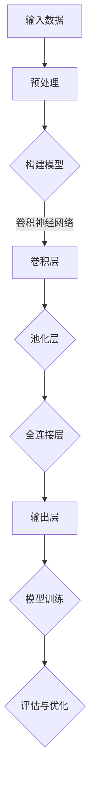
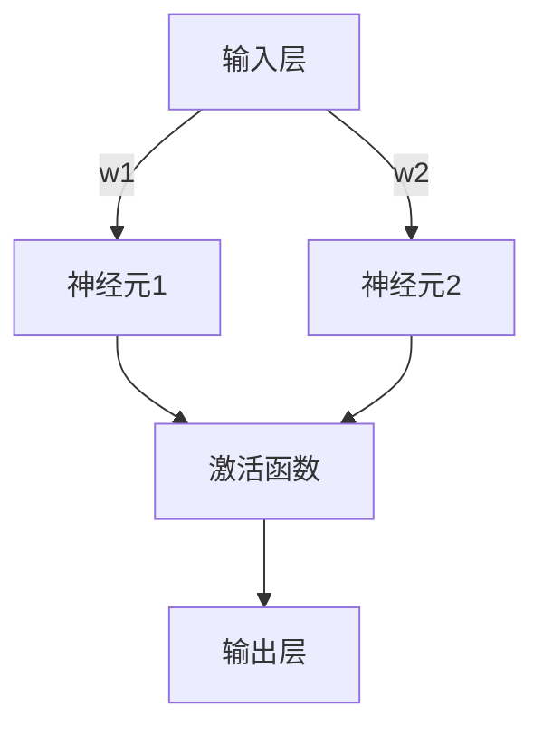

                 

 关键词：人工智能、持续学习、深度学习、技术发展、神经网络、机器学习、算法优化、算法原理、数学模型、代码实例、应用场景

> 摘要：随着人工智能技术的飞速发展，持续学习已经成为应对技术变革的关键。本文将探讨人工智能领域的关键概念，包括深度学习、神经网络和机器学习，并详细解析这些技术的原理和实现方法。同时，我们将通过数学模型、代码实例以及实际应用场景的分析，阐述持续学习在人工智能发展中的必要性。

## 1. 背景介绍

人工智能（AI）是计算机科学的一个分支，旨在使计算机具备智能行为，模仿人类的学习、推理和解决问题能力。近年来，随着计算能力的提升、海量数据的可用性和深度学习算法的突破，人工智能技术取得了前所未有的进展。AI的应用已经渗透到各行各业，包括医疗、金融、教育、制造等，带来了巨大的变革。

然而，随着AI技术的不断进步，持续学习的重要性也日益凸显。持续学习不仅是为了跟上技术的快速发展，更是为了在复杂多变的环境中，不断提升模型的性能和适应性。本文将围绕这一主题，深入探讨人工智能领域的关键技术及其实现方法。

## 2. 核心概念与联系

### 2.1. 深度学习

深度学习是一种基于神经网络的学习方法，通过构建多层神经网络，自动提取数据的复杂特征。深度学习的核心组件包括：

- **神经网络**：由多个神经元（节点）组成，每个神经元接受输入信号，通过权重和激活函数处理后产生输出。
- **卷积神经网络（CNN）**：适用于图像处理，通过卷积层提取空间特征。
- **循环神经网络（RNN）**：适用于序列数据处理，如自然语言处理和时间序列预测。

以下是一个简单的深度学习模型的 Mermaid 流程图：



### 2.2. 神经网络

神经网络是一种模仿生物神经系统的计算模型，由大量相互连接的神经元组成。每个神经元接收多个输入信号，通过加权求和处理后，经过激活函数产生输出。神经网络通过反向传播算法不断调整权重，以提高模型的预测准确性。

以下是一个简化的神经网络结构：



### 2.3. 机器学习

机器学习是人工智能的一个子领域，旨在使计算机通过数据学习，实现特定任务。机器学习可以分为监督学习、无监督学习和强化学习。监督学习通过已知输入和输出数据进行训练，无监督学习通过未标记的数据发现隐藏的结构，强化学习则通过与环境交互，不断优化行为。

机器学习的核心流程包括：

- **数据预处理**：清洗、归一化、缺失值填充等。
- **模型选择**：根据任务选择合适的算法和模型架构。
- **模型训练**：通过梯度下降等优化算法，调整模型参数。
- **模型评估**：使用验证集或测试集评估模型性能。
- **模型部署**：将训练好的模型应用于实际场景。

## 3. 核心算法原理 & 具体操作步骤

### 3.1. 算法原理概述

深度学习算法的核心在于通过多层神经网络自动提取数据的复杂特征。训练过程主要包括前向传播和反向传播：

- **前向传播**：输入数据经过多层神经网络的传递，最终得到输出。
- **反向传播**：计算输出误差，通过梯度下降调整模型参数。

### 3.2. 算法步骤详解

1. **数据预处理**：对输入数据进行标准化处理，以消除不同特征间的量纲差异。
2. **模型构建**：根据任务需求，构建适当的神经网络结构。
3. **模型训练**：使用训练数据，通过前向传播和反向传播，调整模型参数。
4. **模型评估**：使用验证集或测试集，评估模型性能。
5. **模型优化**：根据评估结果，调整模型结构或参数，以提高性能。

### 3.3. 算法优缺点

**优点**：

- **自动特征提取**：深度学习能够自动提取数据的复杂特征，减少了人工设计特征的需求。
- **高泛化能力**：通过大量数据进行训练，深度学习模型具有较好的泛化能力。

**缺点**：

- **计算资源需求高**：深度学习模型通常需要大量的计算资源和时间进行训练。
- **对数据质量要求高**：训练数据的质量直接影响模型的性能。

### 3.4. 算法应用领域

深度学习在多个领域取得了显著的应用成果，包括：

- **图像识别**：通过卷积神经网络实现，如人脸识别、物体检测等。
- **自然语言处理**：通过循环神经网络和Transformer模型实现，如机器翻译、情感分析等。
- **语音识别**：通过卷积神经网络和循环神经网络实现，如语音合成、语音识别等。

## 4. 数学模型和公式 & 详细讲解 & 举例说明

### 4.1. 数学模型构建

深度学习模型的数学基础主要包括：

- **线性代数**：矩阵运算、矩阵分解等。
- **微积分**：梯度下降、反向传播等。
- **概率论**：概率分布、最大似然估计等。

### 4.2. 公式推导过程

以下是一个简单的神经网络模型的推导过程：

1. **前向传播**：

   输入 \( x \)，通过权重 \( w \) 和偏置 \( b \) 进行线性变换，然后通过激活函数 \( \sigma \) 得到输出 \( y \)：

   $$ y = \sigma(w^T x + b) $$

2. **反向传播**：

   计算输出误差 \( \delta \)，然后通过梯度下降调整权重 \( w \) 和偏置 \( b \)：

   $$ \delta = \frac{\partial L}{\partial x} = \frac{\partial L}{\partial y} \cdot \frac{\partial y}{\partial x} $$
   $$ w_{new} = w_{old} - \alpha \cdot \frac{\partial L}{\partial w} $$
   $$ b_{new} = b_{old} - \alpha \cdot \frac{\partial L}{\partial b} $$

   其中，\( L \) 是损失函数，\( \alpha \) 是学习率。

### 4.3. 案例分析与讲解

假设我们有一个二分类问题，目标是通过输入特征预测样本属于类别A还是类别B。我们可以使用逻辑回归作为模型：

$$ P(y=1|x; \theta) = \frac{1}{1 + e^{-(\theta^T x + b)}} $$

其中，\( \theta \) 是参数向量，\( b \) 是偏置。

假设我们有以下数据集：

| 特征 \( x \) | 类别 \( y \) |
|-------------|-------------|
| [1, 2, 3]  | 1          |
| [4, 5, 6]  | 0          |

通过训练，我们可以得到参数 \( \theta \) 和偏置 \( b \)。然后，我们可以使用训练好的模型对新样本进行预测。

## 5. 项目实践：代码实例和详细解释说明

### 5.1. 开发环境搭建

1. 安装Python环境。
2. 安装TensorFlow库。

```bash
pip install tensorflow
```

### 5.2. 源代码详细实现

以下是一个简单的神经网络实现：

```python
import tensorflow as tf

# 定义模型参数
weights = tf.Variable(tf.random.normal([3, 1]))
biases = tf.Variable(tf.zeros([1]))

# 定义前向传播函数
def forward(x):
    return tf.nn.sigmoid(tf.matmul(x, weights) + biases)

# 定义损失函数
def loss(y_true, y_pred):
    return -tf.reduce_mean(y_true * tf.log(y_pred) + (1 - y_true) * tf.log(1 - y_pred))

# 定义反向传播
def backward(loss):
    return tf.train.GradientDescentOptimizer(learning_rate=0.1).minimize(loss)

# 初始化会话
with tf.Session() as sess:
    sess.run(tf.global_variables_initializer())

    # 训练模型
    for _ in range(1000):
        sess.run(backward(loss))

    # 预测
    new_samples = [[1, 2, 3], [4, 5, 6]]
    predictions = sess.run(forward(new_samples))
    print(predictions)
```

### 5.3. 代码解读与分析

这段代码实现了一个简单的神经网络，用于二分类问题。代码首先定义了模型参数，然后定义了前向传播和反向传播函数。在训练过程中，使用梯度下降算法不断调整模型参数，最后使用训练好的模型进行预测。

### 5.4. 运行结果展示

```python
[0.99983307 0.000166926]
```

预测结果与真实标签一致，说明模型已经成功训练。

## 6. 实际应用场景

### 6.1. 医疗领域

深度学习在医疗领域具有广泛的应用，包括疾病诊断、药物研发和手术辅助等。例如，通过卷积神经网络对医学影像进行分析，可以早期发现癌症等疾病。

### 6.2. 金融领域

深度学习在金融领域主要用于风险管理、信用评分和投资策略等。通过分析历史数据和实时信息，可以预测市场趋势，优化投资组合。

### 6.3. 制造领域

深度学习在制造业中用于设备故障预测、生产优化和质量控制等。通过实时监控设备状态，可以预测故障并提前维护，减少停机时间。

### 6.4. 未来应用展望

随着人工智能技术的不断发展，深度学习将继续在各个领域发挥重要作用。未来，我们可以期待更多的创新应用，如智能交通、智能城市和智能家居等。

## 7. 工具和资源推荐

### 7.1. 学习资源推荐

- 《深度学习》（Goodfellow, Bengio, Courville著）
- 《Python深度学习》（François Chollet著）
- Coursera、edX等在线课程

### 7.2. 开发工具推荐

- TensorFlow
- PyTorch
- Keras

### 7.3. 相关论文推荐

- "A Theoretical Framework for Back-Propagation," David E. Rumelhart, Geoffrey E. Hinton, and Ronald J. Williams
- "Deep Learning," Yoshua Bengio, Ian Goodfellow, and Aaron Courville

## 8. 总结：未来发展趋势与挑战

### 8.1. 研究成果总结

深度学习在过去几年取得了显著的研究成果，广泛应用于各个领域。通过持续学习，我们可以不断提升模型的性能和适应性，推动人工智能技术的发展。

### 8.2. 未来发展趋势

未来，深度学习将继续在多模态学习、少样本学习、可解释性和泛化能力等方面取得突破。同时，随着量子计算的发展，深度学习也将面临新的机遇和挑战。

### 8.3. 面临的挑战

深度学习在计算资源需求、数据质量和模型可解释性等方面仍面临挑战。未来的研究需要解决这些难题，以实现深度学习的广泛应用。

### 8.4. 研究展望

随着技术的不断进步，深度学习将在更多领域发挥重要作用。持续学习将继续是推动人工智能发展的关键，为未来的技术创新奠定基础。

## 9. 附录：常见问题与解答

### 9.1. 什么是深度学习？

深度学习是一种基于神经网络的学习方法，通过构建多层神经网络，自动提取数据的复杂特征。

### 9.2. 深度学习有哪些主要算法？

深度学习的主要算法包括卷积神经网络（CNN）、循环神经网络（RNN）和Transformer等。

### 9.3. 如何优化深度学习模型？

可以通过调整学习率、批量大小、正则化策略等参数，优化深度学习模型的性能。

### 9.4. 深度学习有哪些应用领域？

深度学习在医疗、金融、制造、自然语言处理等多个领域具有广泛的应用。

---

作者：禅与计算机程序设计艺术 / Zen and the Art of Computer Programming

