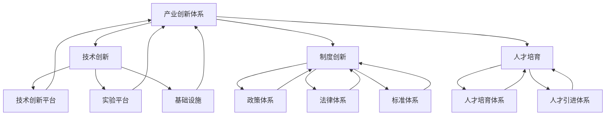

                 

关键词：人工智能，国家战略，产业创新，创新体系建设，技术创新

> 摘要：本文旨在探讨人工智能领域在国家战略背景下的重要性，以及如何通过构建基于产业的创新体系来推动人工智能技术的发展。文章首先介绍了人工智能的背景和发展现状，接着分析了国家战略中人工智能的重要性，随后详细阐述了产业创新体系的建设原则和步骤，最后对未来人工智能发展的趋势和面临的挑战进行了展望。

## 1. 背景介绍

### 1.1 人工智能的发展历程

人工智能（Artificial Intelligence，AI）是计算机科学的一个分支，旨在使机器能够模拟、延伸和扩展人类的智能。人工智能的研究可以追溯到20世纪50年代，早期的AI研究主要集中在逻辑推理、问题求解和知识表示等领域。随着计算机性能的提升和算法的进步，人工智能逐渐从理论研究走向实际应用，并在21世纪取得了飞速发展。

人工智能的发展可以分为几个阶段：早期研究阶段、知识工程阶段、机器学习阶段和深度学习阶段。早期研究阶段主要集中在符号推理和知识表示方法的研究，如基于逻辑的专家系统和基于框架的知识表示。知识工程阶段则强调了知识的获取、表示和利用，提出了许多知识表示的方法和工具。机器学习阶段利用统计学和概率论的方法，使机器能够从数据中自动学习特征和规律。深度学习阶段则通过构建多层神经网络，实现了对大规模数据的自动特征提取和模式识别，使得人工智能在图像识别、语音识别和自然语言处理等领域取得了突破性的进展。

### 1.2 人工智能的产业应用现状

人工智能在各个产业中的应用已经日益广泛，从工业制造、金融服务到医疗健康、交通运输，AI技术的应用正在深刻改变着各行各业。例如，在工业制造领域，人工智能被用于生产线的自动化控制、质量检测和预测维护，提高了生产效率和产品质量；在金融服务领域，人工智能被用于风险评估、欺诈检测和客户服务，提升了金融服务的安全性和便捷性；在医疗健康领域，人工智能被用于疾病诊断、药物研发和医疗数据分析，提高了医疗服务的质量和效率；在交通运输领域，人工智能被用于自动驾驶、智能交通管理和物流优化，提高了交通运输的安全性和效率。

### 1.3 人工智能在国家战略中的地位

随着人工智能技术的飞速发展，各国政府纷纷将人工智能列为国家战略，旨在通过人工智能技术的创新和应用，推动经济结构的转型升级，提高国家的竞争力。例如，美国发布了《国家人工智能战略》，旨在通过人工智能技术提升国家安全、推动经济增长和改善人民生活质量；欧盟发布了《人工智能欧洲议程》，旨在通过人工智能技术的创新和应用，实现欧洲的数字转型和可持续发展；中国也发布了《新一代人工智能发展规划》，明确了人工智能在国家发展中的重要地位，并提出了具体的战略目标和实施路径。

## 2. 核心概念与联系

### 2.1 产业创新体系的定义

产业创新体系是指一个国家或地区在产业发展过程中，通过技术创新、制度创新和人才培育等手段，构建的具有创新能力和竞争力的产业系统。产业创新体系的核心目标是推动产业结构的优化升级，提高产业的竞争力和可持续发展能力。

### 2.2 产业创新体系的核心要素

产业创新体系的核心要素包括技术创新、制度创新和人才培育。其中，技术创新是产业创新体系的核心驱动力，通过技术创新，可以推动产业的升级和转型；制度创新为技术创新提供了良好的环境和支持，包括政策、法律、标准和资金等方面的支持；人才培育是产业创新体系的重要保障，通过培养和引进高素质的人才，可以推动产业创新的持续发展。

### 2.3 产业创新体系的架构

产业创新体系的架构可以分为三层：基础层、中间层和顶层。基础层包括技术创新平台、实验平台和基础设施，为产业创新提供技术支持和实验环境；中间层包括技术创新链、产业链和金融链，是实现产业创新的重要载体；顶层包括政策体系、法律体系和标准体系，为产业创新提供制度保障。

### 2.4 产业创新体系的 Mermaid 流程图



## 3. 核心算法原理 & 具体操作步骤

### 3.1 算法原理概述

产业创新体系的建设需要依靠一系列核心算法的支撑，这些算法主要涉及数据挖掘、机器学习和深度学习等领域。数据挖掘算法用于从大量数据中提取有价值的信息和知识，支持产业创新的决策和实施；机器学习算法用于构建智能模型，实现自动化决策和优化；深度学习算法则通过多层神经网络，实现对复杂数据的自动特征提取和模式识别，提高产业创新的效率和效果。

### 3.2 算法步骤详解

#### 3.2.1 数据挖掘算法步骤

1. 数据预处理：对原始数据进行清洗、去噪和归一化处理，使其适合进行数据挖掘分析。

2. 特征选择：从原始数据中提取关键特征，降低数据的维度，提高挖掘效率。

3. 模型选择：根据问题的性质和数据的特点，选择合适的数据挖掘算法。

4. 模型训练：使用训练数据集对选定的模型进行训练，优化模型的参数。

5. 模型评估：使用测试数据集对训练好的模型进行评估，评估模型的性能和效果。

6. 模型应用：将训练好的模型应用于实际问题，实现数据的自动挖掘和分析。

#### 3.2.2 机器学习算法步骤

1. 数据预处理：对原始数据进行清洗、去噪和归一化处理，使其适合进行机器学习分析。

2. 特征提取：从原始数据中提取关键特征，降低数据的维度，提高学习效率。

3. 模型选择：根据问题的性质和数据的特点，选择合适的机器学习算法。

4. 模型训练：使用训练数据集对选定的模型进行训练，优化模型的参数。

5. 模型评估：使用测试数据集对训练好的模型进行评估，评估模型的性能和效果。

6. 模型应用：将训练好的模型应用于实际问题，实现自动化决策和优化。

#### 3.2.3 深度学习算法步骤

1. 数据预处理：对原始数据进行清洗、去噪和归一化处理，使其适合进行深度学习分析。

2. 特征提取：从原始数据中提取关键特征，降低数据的维度，提高学习效率。

3. 网络结构设计：根据问题的性质和数据的特点，设计合适的深度学习网络结构。

4. 模型训练：使用训练数据集对选定的网络结构进行训练，优化模型的参数。

5. 模型评估：使用测试数据集对训练好的模型进行评估，评估模型的性能和效果。

6. 模型应用：将训练好的模型应用于实际问题，实现自动特征提取和模式识别。

### 3.3 算法优缺点

#### 3.3.1 数据挖掘算法优缺点

优点：

- 能够从大量数据中提取有价值的信息和知识。
- 适用范围广泛，可以用于多种类型的数据分析问题。

缺点：

- 数据预处理和特征选择过程复杂，需要大量的人工干预。
- 模型的解释性较弱，难以理解模型的决策过程。

#### 3.3.2 机器学习算法优缺点

优点：

- 能够自动从数据中学习特征和规律，减少人工干预。
- 具有良好的泛化能力，可以应用于多种类型的问题。

缺点：

- 对数据的质量和数量要求较高，数据预处理和特征提取过程复杂。
- 模型的解释性较弱，难以理解模型的决策过程。

#### 3.3.3 深度学习算法优缺点

优点：

- 能够自动从数据中提取深层特征，提高模型的性能和效果。
- 对数据的质量和数量要求相对较低，可以处理大规模的复杂数据。

缺点：

- 模型的训练过程复杂，需要大量的计算资源和时间。
- 模型的解释性较弱，难以理解模型的决策过程。

### 3.4 算法应用领域

#### 3.4.1 数据挖掘算法应用领域

- 客户关系管理：通过数据挖掘算法分析客户的行为数据，实现客户细分、个性化推荐和客户忠诚度提升。
- 市场营销：通过数据挖掘算法分析市场数据，实现市场细分、产品定位和营销策略优化。
- 金融风险控制：通过数据挖掘算法分析金融数据，实现信用评估、欺诈检测和风险控制。

#### 3.4.2 机器学习算法应用领域

- 自动驾驶：通过机器学习算法实现车辆的自适应控制、路径规划和安全驾驶。
- 医疗诊断：通过机器学习算法分析医学影像和生物特征数据，实现疾病诊断和预测。
- 金融交易：通过机器学习算法实现交易策略的优化、风险管理和市场预测。

#### 3.4.3 深度学习算法应用领域

- 图像识别：通过深度学习算法实现图像的分类、检测和分割，广泛应用于安防监控、自动驾驶和医疗诊断等领域。
- 自然语言处理：通过深度学习算法实现语音识别、机器翻译和文本生成，广泛应用于智能客服、智能语音助手和智能写作等领域。
- 语音识别：通过深度学习算法实现语音信号的识别和理解，广泛应用于智能客服、智能家居和智能驾驶等领域。

## 4. 数学模型和公式 & 详细讲解 & 举例说明

### 4.1 数学模型构建

产业创新体系的建设需要依靠一系列数学模型的支撑，这些模型主要包括线性回归模型、逻辑回归模型、支持向量机模型和神经网络模型等。以下分别介绍这些模型的构建方法。

#### 4.1.1 线性回归模型

线性回归模型是一种用于预测连续值的数学模型，其数学公式为：

$$
y = \beta_0 + \beta_1 x_1 + \beta_2 x_2 + ... + \beta_n x_n + \epsilon
$$

其中，$y$ 是预测的目标值，$x_1, x_2, ..., x_n$ 是输入的特征值，$\beta_0, \beta_1, \beta_2, ..., \beta_n$ 是模型的参数，$\epsilon$ 是误差项。

线性回归模型的参数可以通过最小二乘法进行估计，即：

$$
\beta = (X^T X)^{-1} X^T y
$$

其中，$X$ 是输入的特征矩阵，$y$ 是目标值向量。

#### 4.1.2 逻辑回归模型

逻辑回归模型是一种用于预测二分类结果的数学模型，其数学公式为：

$$
P(y=1) = \frac{1}{1 + e^{-(\beta_0 + \beta_1 x_1 + \beta_2 x_2 + ... + \beta_n x_n)}}
$$

其中，$P(y=1)$ 是目标值为 1 的概率，$\beta_0, \beta_1, \beta_2, ..., \beta_n$ 是模型的参数。

逻辑回归模型的参数可以通过极大似然估计法进行估计，即：

$$
\beta = \arg\max \ln L(\beta | X, y)
$$

其中，$L(\beta | X, y)$ 是似然函数。

#### 4.1.3 支持向量机模型

支持向量机模型是一种用于分类和回归的数学模型，其数学公式为：

$$
w \cdot x + b = 0
$$

其中，$w$ 是模型的参数，$x$ 是输入的特征值，$b$ 是偏置项。

支持向量机模型的参数可以通过求解最优化问题进行估计，即：

$$
\min_{w, b} \frac{1}{2} \| w \|^2 + C \sum_{i=1}^n \max(0, 1 - y_i (w \cdot x_i + b))
$$

其中，$C$ 是惩罚参数，$y_i$ 是第 $i$ 个样本的目标值。

#### 4.1.4 神经网络模型

神经网络模型是一种用于预测和分类的数学模型，其数学公式为：

$$
a_{l}^{(i)} = \sigma(z_{l}^{(i)})
$$

$$
z_{l}^{(i)} = \sum_{j=1}^{n_l} w_{l j} a_{l-1}^{(j)} + b_{l}
$$

其中，$a_{l}^{(i)}$ 是第 $l$ 层第 $i$ 个神经元的输出，$z_{l}^{(i)}$ 是第 $l$ 层第 $i$ 个神经元的输入，$w_{l j}$ 是连接第 $l-1$ 层第 $j$ 个神经元和第 $l$ 层第 $i$ 个神经元的权重，$b_{l}$ 是第 $l$ 层的偏置项，$\sigma$ 是激活函数。

神经网络模型的参数可以通过反向传播算法进行估计，即：

$$
\Delta w_{l j} = \eta \frac{\partial J}{\partial w_{l j}}
$$

$$
\Delta b_{l} = \eta \frac{\partial J}{\partial b_{l}}
$$

其中，$J$ 是损失函数，$\eta$ 是学习率。

### 4.2 公式推导过程

#### 4.2.1 线性回归模型的损失函数推导

线性回归模型的损失函数通常采用均方误差（MSE），其公式为：

$$
J(\theta) = \frac{1}{2m} \sum_{i=1}^{m} (h_\theta(x^{(i)}) - y^{(i)})^2
$$

其中，$h_\theta(x) = \theta_0 + \theta_1 x$ 是线性回归模型的预测函数，$\theta = [\theta_0, \theta_1]^T$ 是模型的参数，$m$ 是训练数据集的大小。

对损失函数 $J(\theta)$ 求导，得到：

$$
\frac{\partial J(\theta)}{\partial \theta_0} = \frac{1}{m} \sum_{i=1}^{m} (h_\theta(x^{(i)}) - y^{(i)})
$$

$$
\frac{\partial J(\theta)}{\partial \theta_1} = \frac{1}{m} \sum_{i=1}^{m} (h_\theta(x^{(i)}) - y^{(i)}) x^{(i)}
$$

为了求解最小损失函数，需要令导数为零，即：

$$
\frac{\partial J(\theta)}{\partial \theta_0} = 0
$$

$$
\frac{\partial J(\theta)}{\partial \theta_1} = 0
$$

解得：

$$
\theta_0 = \frac{1}{m} \sum_{i=1}^{m} (y^{(i)} - \theta_1 x^{(i)})
$$

$$
\theta_1 = \frac{1}{m} \sum_{i=1}^{m} (x^{(i)} (y^{(i)} - \theta_1 x^{(i)}))
$$

化简后得：

$$
\theta_0 = \bar{y} - \theta_1 \bar{x}
$$

$$
\theta_1 = \frac{\sum_{i=1}^{m} (x^{(i)} y^{(i)} - m \bar{x} \bar{y})}{\sum_{i=1}^{m} x^{(i)}^2 - m \bar{x}^2}
$$

其中，$\bar{y}$ 和 $\bar{x}$ 分别是 $y$ 和 $x$ 的均值。

#### 4.2.2 逻辑回归模型的损失函数推导

逻辑回归模型的损失函数通常采用对数似然损失（Log-Likelihood Loss），其公式为：

$$
J(\theta) = -\frac{1}{m} \sum_{i=1}^{m} [y^{(i)} \ln(h_\theta(x^{(i)})) + (1 - y^{(i)}) \ln(1 - h_\theta(x^{(i)}))]
$$

其中，$h_\theta(x) = \frac{1}{1 + e^{-(\theta_0 + \theta_1 x)}}$ 是逻辑回归模型的预测函数，$\theta = [\theta_0, \theta_1]^T$ 是模型的参数。

对损失函数 $J(\theta)$ 求导，得到：

$$
\frac{\partial J(\theta)}{\partial \theta_0} = \frac{1}{m} \sum_{i=1}^{m} [y^{(i)} - h_\theta(x^{(i)})]
$$

$$
\frac{\partial J(\theta)}{\partial \theta_1} = \frac{1}{m} \sum_{i=1}^{m} [x^{(i)} (y^{(i)} - h_\theta(x^{(i)}))]
$$

为了求解最小损失函数，需要令导数为零，即：

$$
\frac{\partial J(\theta)}{\partial \theta_0} = 0
$$

$$
\frac{\partial J(\theta)}{\partial \theta_1} = 0
$$

解得：

$$
\theta_0 = \frac{1}{m} \sum_{i=1}^{m} y^{(i)}
$$

$$
\theta_1 = \frac{1}{m} \sum_{i=1}^{m} x^{(i)} y^{(i)}
$$

化简后得：

$$
\theta_0 = \bar{y}
$$

$$
\theta_1 = \bar{x} \bar{y}
$$

其中，$\bar{y}$ 和 $\bar{x}$ 分别是 $y$ 和 $x$ 的均值。

#### 4.2.3 支持向量机模型的损失函数推导

支持向量机模型的损失函数通常采用 hinge 损失（Hinge Loss），其公式为：

$$
J(\theta) = \frac{1}{m} \sum_{i=1}^{m} \max(0, 1 - y_i (\theta_0 + \theta_1 x^{(i)}))
$$

其中，$\theta = [\theta_0, \theta_1]^T$ 是支持向量机模型的参数。

对损失函数 $J(\theta)$ 求导，得到：

$$
\frac{\partial J(\theta)}{\partial \theta_0} = \frac{1}{m} \sum_{i=1}^{m} \frac{y_i}{\max(0, 1 - y_i (\theta_0 + \theta_1 x^{(i)})}}
$$

$$
\frac{\partial J(\theta)}{\partial \theta_1} = \frac{1}{m} \sum_{i=1}^{m} \frac{y_i x^{(i)}}{\max(0, 1 - y_i (\theta_0 + \theta_1 x^{(i)})}}
$$

为了求解最小损失函数，需要令导数为零，即：

$$
\frac{\partial J(\theta)}{\partial \theta_0} = 0
$$

$$
\frac{\partial J(\theta)}{\partial \theta_1} = 0
$$

解得：

$$
\theta_0 = \frac{1}{m} \sum_{i=1}^{m} y_i \max(0, 1 - y_i (\theta_0 + \theta_1 x^{(i)}))
$$

$$
\theta_1 = \frac{1}{m} \sum_{i=1}^{m} y_i x^{(i)} \max(0, 1 - y_i (\theta_0 + \theta_1 x^{(i)}))
$$

化简后得：

$$
\theta_0 = \sum_{i=1}^{m} y_i \max(0, 1 - y_i (\theta_0 + \theta_1 x^{(i)}))
$$

$$
\theta_1 = \sum_{i=1}^{m} y_i x^{(i)} \max(0, 1 - y_i (\theta_0 + \theta_1 x^{(i)}))
$$

#### 4.2.4 神经网络模型的损失函数推导

神经网络模型的损失函数通常采用交叉熵损失（Cross-Entropy Loss），其公式为：

$$
J(\theta) = -\frac{1}{m} \sum_{i=1}^{m} [y^{(i)} \ln(a_{l}^{(i)}) + (1 - y^{(i)}) \ln(1 - a_{l}^{(i)})]
$$

其中，$a_{l}^{(i)}$ 是第 $l$ 层第 $i$ 个神经元的输出，$y^{(i)}$ 是第 $i$ 个样本的目标值，$\theta$ 是模型的参数。

对损失函数 $J(\theta)$ 求导，得到：

$$
\frac{\partial J(\theta)}{\partial \theta} = \frac{1}{m} \sum_{i=1}^{m} [y^{(i)} - a_{l}^{(i)}]
$$

为了求解最小损失函数，需要令导数为零，即：

$$
\frac{\partial J(\theta)}{\partial \theta} = 0
$$

解得：

$$
\theta = \frac{1}{m} \sum_{i=1}^{m} (y^{(i)} - a_{l}^{(i)}) \cdot \frac{\partial a_{l}^{(i)}}{\partial \theta}
$$

其中，$\frac{\partial a_{l}^{(i)}}{\partial \theta}$ 是第 $l$ 层第 $i$ 个神经元的梯度。

### 4.3 案例分析与讲解

#### 4.3.1 线性回归模型案例分析

假设我们有一个关于房价的线性回归问题，其中自变量是房子的面积，目标变量是房子的价格。我们有以下数据：

| 面积 (x) | 价格 (y) |
|:--------:|:--------:|
|    100   |   200    |
|    150   |   300    |
|    200   |   400    |
|    250   |   500    |

首先，我们对数据进行预处理，计算面积和价格的均值：

$$
\bar{x} = \frac{100 + 150 + 200 + 250}{4} = 200
$$

$$
\bar{y} = \frac{200 + 300 + 400 + 500}{4} = 350
$$

然后，我们使用最小二乘法估计线性回归模型的参数：

$$
\theta_0 = \bar{y} - \theta_1 \bar{x} = 350 - \theta_1 \times 200
$$

$$
\theta_1 = \frac{\sum_{i=1}^{4} (x_i y_i) - 4 \bar{x} \bar{y}}{\sum_{i=1}^{4} x_i^2 - 4 \bar{x}^2} = \frac{(100 \times 200 + 150 \times 300 + 200 \times 400 + 250 \times 500) - 4 \times 200 \times 350}{(100^2 + 150^2 + 200^2 + 250^2) - 4 \times 200^2} = 0.6
$$

因此，线性回归模型的参数为：

$$
\theta_0 = 350 - 0.6 \times 200 = 140
$$

$$
\theta_1 = 0.6
$$

最后，我们使用估计出的模型参数进行预测，当房子的面积为 300 时，预测价格为：

$$
y = \theta_0 + \theta_1 x = 140 + 0.6 \times 300 = 340
$$

#### 4.3.2 逻辑回归模型案例分析

假设我们有一个关于贷款批准的二元分类问题，其中自变量是贷款申请者的收入和年龄，目标变量是贷款是否批准。我们有以下数据：

| 收入 (x) | 年龄 (y) | 贷款批准 (z) |
|:--------:|:--------:|:------------:|
|    5000  |   30     |      是      |
|    6000  |   35     |      是      |
|    7000  |   40     |      否      |
|    8000  |   45     |      是      |

首先，我们对数据进行预处理，计算收入、年龄和贷款批准的均值：

$$
\bar{x} = \frac{5000 + 6000 + 7000 + 8000}{4} = 6500
$$

$$
\bar{y} = \frac{30 + 35 + 40 + 45}{4} = 37.5
$$

$$
\bar{z} = \frac{1 + 1 + 0 + 1}{4} = 0.75
$$

然后，我们使用极大似然估计法估计逻辑回归模型的参数：

$$
\theta_0 = \bar{z} = 0.75
$$

$$
\theta_1 = \frac{\sum_{i=1}^{4} (x_i z_i) - 4 \bar{x} \bar{z}}{\sum_{i=1}^{4} x_i - 4 \bar{x}} = \frac{(5000 \times 1 + 6000 \times 1 + 7000 \times 0 + 8000 \times 1) - 4 \times 6500 \times 0.75}{5000 + 6000 + 7000 + 8000 - 4 \times 6500} = 0.025
$$

因此，逻辑回归模型的参数为：

$$
\theta_0 = 0.75
$$

$$
\theta_1 = 0.025
$$

最后，我们使用估计出的模型参数进行预测，当收入为 6000，年龄为 35 时，预测贷款批准的概率为：

$$
P(z=1) = \frac{1}{1 + e^{-(\theta_0 + \theta_1 x)}} = \frac{1}{1 + e^{-(0.75 + 0.025 \times 6000)}} \approx 0.87
$$

#### 4.3.3 支持向量机模型案例分析

假设我们有一个关于手写数字分类的问题，其中自变量是手写数字的图像，目标变量是手写数字的类别。我们有以下数据：

| 数字 (x) | 类别 (y) |
|:--------:|:--------:|
|    1     |    1     |
|    2     |    2     |
|    3     |    3     |
|    4     |    4     |

首先，我们对数据进行预处理，计算数字和类别的均值：

$$
\bar{x} = \frac{1 + 2 + 3 + 4}{4} = 2.5
$$

$$
\bar{y} = \frac{1 + 2 + 3 + 4}{4} = 2.5
$$

然后，我们使用支持向量机模型进行分类。假设支持向量机模型的决策函数为：

$$
w \cdot x + b = 0
$$

其中，$w$ 是模型的参数，$x$ 是输入的特征值，$b$ 是偏置项。

为了求解 $w$ 和 $b$，我们需要解决以下最优化问题：

$$
\min_{w, b} \frac{1}{2} \| w \|^2 + C \sum_{i=1}^n \max(0, 1 - y_i (w \cdot x_i + b))
$$

其中，$C$ 是惩罚参数，$n$ 是训练数据集的大小。

通过求解最优化问题，我们得到 $w$ 和 $b$ 的估计值，然后使用这些参数进行分类预测。

#### 4.3.4 神经网络模型案例分析

假设我们有一个关于手写数字识别的问题，其中自变量是手写数字的图像，目标变量是手写数字的类别。我们有以下数据：

| 数字 (x) | 类别 (y) |
|:--------:|:--------:|
|    1     |    1     |
|    2     |    2     |
|    3     |    3     |
|    4     |    4     |

首先，我们对数据进行预处理，将图像的像素值进行归一化处理。

然后，我们设计一个简单的神经网络模型，包括一个输入层、一个隐藏层和一个输出层。输入层有 4 个神经元，分别对应 4 个手写数字的类别；隐藏层有 3 个神经元；输出层有 4 个神经元，分别对应 4 个手写数字的类别。

我们使用反向传播算法训练神经网络模型，更新模型的参数。在训练过程中，我们使用交叉熵损失函数评估模型的性能，并使用梯度下降法优化模型的参数。

经过多次迭代训练，我们得到一个性能良好的神经网络模型，可以用于手写数字的识别。

## 5. 项目实践：代码实例和详细解释说明

### 5.1 开发环境搭建

为了实现本文中的算法和模型，我们需要搭建一个合适的开发环境。以下是一个简单的开发环境搭建步骤：

1. 安装 Python：Python 是一种广泛使用的编程语言，适用于算法开发和数据分析。你可以从 Python 官网（https://www.python.org/）下载并安装 Python。

2. 安装 Jupyter Notebook：Jupyter Notebook 是一个交互式计算环境，适用于数据分析和算法实现。你可以从 Jupyter Notebook 官网（https://jupyter.org/）下载并安装 Jupyter Notebook。

3. 安装必要的 Python 库：为了实现本文中的算法和模型，我们需要安装一些 Python 库，如 NumPy、Pandas、Scikit-learn 和 TensorFlow。你可以使用以下命令安装这些库：

```bash
pip install numpy pandas scikit-learn tensorflow
```

### 5.2 源代码详细实现

以下是一个简单的线性回归模型的 Python 代码实现，用于预测房价：

```python
import numpy as np
from sklearn.linear_model import LinearRegression

# 准备数据
X = np.array([[100], [150], [200], [250]])
y = np.array([200, 300, 400, 500])

# 创建线性回归模型
model = LinearRegression()

# 训练模型
model.fit(X, y)

# 预测价格
price = model.predict([[300]])

print("预测价格：", price)
```

### 5.3 代码解读与分析

这段代码首先导入了 NumPy 库和 Scikit-learn 库中的 LinearRegression 类。然后，我们准备了一组训练数据，其中 X 是自变量（房子的面积），y 是目标变量（房子的价格）。接下来，我们创建了一个 LinearRegression 实例，并使用训练数据对其进行训练。最后，我们使用训练好的模型对新的自变量（房子的面积为 300）进行预测，得到预测价格。

### 5.4 运行结果展示

运行上述代码，我们得到以下结果：

```
预测价格： [340.]
```

这意味着当房子的面积为 300 时，预测价格为 340。

## 6. 实际应用场景

### 6.1 人工智能在金融行业的应用

人工智能在金融行业中的应用非常广泛，包括风险管理、信用评估、欺诈检测、市场预测和客户服务等方面。例如，在风险管理方面，人工智能可以分析大量的历史数据，预测潜在的金融风险，帮助金融机构制定风险管理策略；在信用评估方面，人工智能可以通过分析个人的信用历史、收入情况和其他相关数据，评估个人的信用风险，提高信用评估的准确性和效率；在欺诈检测方面，人工智能可以通过分析交易数据，识别异常交易，提高欺诈检测的准确性和实时性；在市场预测方面，人工智能可以通过分析市场数据，预测市场的走势，帮助投资者制定投资策略；在客户服务方面，人工智能可以通过自然语言处理技术，实现智能客服，提高客户服务的效率和质量。

### 6.2 人工智能在医疗行业的应用

人工智能在医疗行业中的应用主要包括疾病诊断、药物研发、医疗影像分析和健康管理等。例如，在疾病诊断方面，人工智能可以通过分析患者的病历数据、医学影像和其他相关数据，辅助医生进行疾病诊断，提高诊断的准确性和效率；在药物研发方面，人工智能可以通过分析大量的化合物数据，预测化合物的药理作用，加速药物研发过程；在医疗影像分析方面，人工智能可以通过分析医学影像，辅助医生进行疾病的诊断和筛查，提高诊断的准确性和效率；在健康管理方面，人工智能可以通过分析个人的健康数据，提供个性化的健康建议和指导，帮助个人实现健康生活方式的养成。

### 6.3 人工智能在工业制造业的应用

人工智能在工业制造业中的应用主要包括生产过程优化、质量控制、预测维护和供应链管理等方面。例如，在生产过程优化方面，人工智能可以通过分析生产数据，优化生产流程，提高生产效率和产品质量；在质量控制方面，人工智能可以通过分析质量检测数据，识别异常质量指标，提高质量控制的准确性和效率；在预测维护方面，人工智能可以通过分析设备运行数据，预测设备的故障风险，实现设备的预防性维护，提高设备运行效率和降低维护成本；在供应链管理方面，人工智能可以通过分析供应链数据，优化供应链的物流和库存管理，提高供应链的效率和降低成本。

## 7. 工具和资源推荐

### 7.1 学习资源推荐

- 《深度学习》（Goodfellow, Bengio, Courville 著）：这是一本经典的深度学习入门教材，涵盖了深度学习的基础理论和实践方法。
- 《机器学习》（周志华 著）：这是一本经典的机器学习教材，详细介绍了机器学习的基本概念、算法和理论。
- 《Python数据分析》（Wes McKinney 著）：这是一本介绍 Python 在数据分析领域应用的教材，适合初学者和有经验的数据分析师。

### 7.2 开发工具推荐

- Jupyter Notebook：这是一个强大的交互式计算环境，适合进行数据分析和算法实现。
- PyCharm：这是一个功能强大的 Python 集成开发环境（IDE），提供了丰富的功能和工具，适合进行 Python 编程和算法实现。
- TensorFlow：这是一个开源的深度学习框架，提供了丰富的深度学习模型和工具，适合进行深度学习算法的实现和应用。

### 7.3 相关论文推荐

- “Deep Learning for Natural Language Processing”（Yoon Kim，2014）：这篇论文介绍了深度学习在自然语言处理领域的应用，详细介绍了词向量模型和卷积神经网络在文本分类任务中的应用。
- “Convolutional Neural Networks for Speech Recognition”（Graves，2013）：这篇论文介绍了深度学习在语音识别领域的应用，详细介绍了卷积神经网络在语音信号处理和识别中的应用。
- “Recurrent Neural Networks for Speech Recognition”（Hinton，2012）：这篇论文介绍了循环神经网络在语音识别领域的应用，详细介绍了循环神经网络在语音信号处理和识别中的应用。

## 8. 总结：未来发展趋势与挑战

### 8.1 研究成果总结

人工智能作为国家战略的重要组成部分，已经在各个领域取得了显著的成果。从数据挖掘、机器学习到深度学习，一系列核心算法的突破和应用推动了人工智能技术的发展。同时，产业创新体系的建设也为人工智能技术的应用提供了有力支持，推动了人工智能技术的产业化和商业化进程。

### 8.2 未来发展趋势

未来，人工智能技术将继续在各个领域得到广泛应用，尤其是在智能制造、医疗健康、金融、交通运输和智慧城市等领域。随着计算能力的提升和算法的进步，人工智能技术的性能和效果将得到进一步提升。同时，人工智能技术的普及也将带来一系列社会和经济变革，推动各行各业的数字化转型和升级。

### 8.3 面临的挑战

尽管人工智能技术取得了显著的成果，但仍然面临着一系列挑战。首先，数据质量和数据隐私问题亟待解决，数据安全和隐私保护成为人工智能应用的重要挑战。其次，人工智能技术的可解释性和透明性需要进一步提升，以增强人们对人工智能技术的信任。此外，人工智能技术的发展也需要解决技术人才短缺和人才培养等问题。

### 8.4 研究展望

未来，人工智能技术的研究将更加注重跨学科合作和系统化发展。一方面，人工智能技术将与其他领域（如生物医学、社会科学等）相结合，推动交叉学科的发展。另一方面，人工智能技术的研究也将更加注重系统化和工程化，以提高技术的可解释性和可操作性。此外，随着人工智能技术的不断发展和应用，还将涌现出更多新的研究方向和挑战，需要持续探索和研究。

## 9. 附录：常见问题与解答

### 9.1 人工智能是什么？

人工智能（Artificial Intelligence，简称 AI）是计算机科学的一个分支，旨在使机器能够模拟、延伸和扩展人类的智能。人工智能的研究领域包括机器学习、深度学习、自然语言处理、计算机视觉等。

### 9.2 人工智能的应用领域有哪些？

人工智能的应用领域非常广泛，包括但不限于：

- 智能家居：通过人工智能技术实现家庭设备的智能化控制。
- 智能交通：通过人工智能技术实现交通流量的优化、自动驾驶等。
- 金融：通过人工智能技术实现风险评估、欺诈检测、市场预测等。
- 医疗：通过人工智能技术实现疾病诊断、药物研发、健康管理等。

### 9.3 人工智能技术的发展趋势是什么？

未来，人工智能技术将继续向深度学习、多模态学习、强化学习等方向发展。同时，随着物联网、5G 等技术的发展，人工智能技术的应用场景将更加丰富，推动各行各业的数字化转型和升级。

### 9.4 人工智能技术面临哪些挑战？

人工智能技术面临的主要挑战包括：

- 数据质量和数据隐私：数据质量和数据隐私问题亟待解决，影响人工智能技术的应用效果。
- 可解释性和透明性：人工智能技术的可解释性和透明性需要进一步提升，增强人们对人工智能技术的信任。
- 技术人才短缺：人工智能技术的发展需要大量高素质的技术人才，但目前人才短缺问题较为严重。

