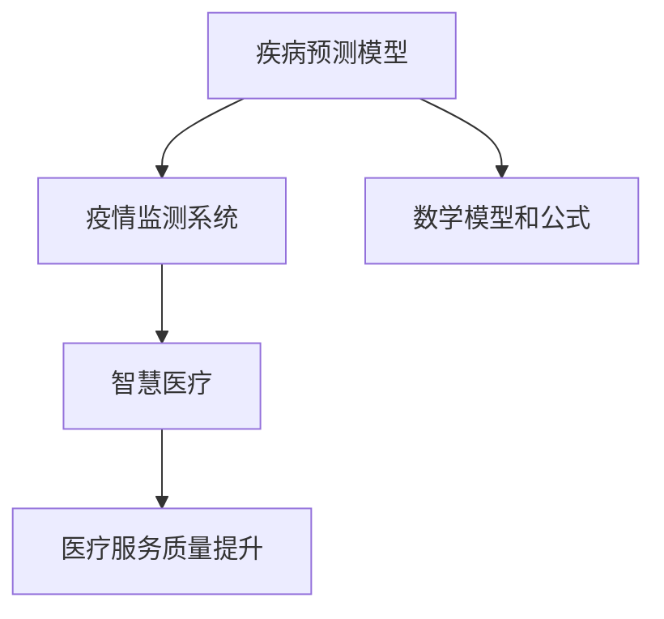

                 

关键词：人工智能，公共卫生，疾病预防，疾病控制，预测模型，数据分析，数据挖掘，深度学习，机器学习，疫情监测，公共卫生危机管理，医疗资源分配，智慧医疗，智能健康，实时监测系统，疫情防控，基因组学，物联网，大数据分析，社交网络分析

> 摘要：本文探讨了人工智能在公共卫生领域中的应用，特别是在疾病预防与控制方面的潜力。通过介绍核心概念、算法原理、数学模型、项目实践和实际应用场景，本文分析了人工智能技术在公共卫生领域的广泛应用，并对其未来发展进行了展望。

## 1. 背景介绍

### 1.1 公共卫生的重要性

公共卫生是关系到人民群众健康和生活质量的重要领域。它不仅涉及到疾病的预防和控制，还包括健康促进、疾病监测、医疗资源分配等多个方面。传统的公共卫生方法依赖于人工统计数据和经验，然而，随着疾病复杂性和全球化进程的加速，这种传统方法已难以满足现代公共卫生的需求。

### 1.2 疾病预防与控制

疾病预防与控制是公共卫生的核心任务。它包括疾病监测、预测、预防、治疗和康复等多个环节。传统的疾病预防与控制方法主要依赖于医疗机构、疾病监测系统和公共卫生专业人员。然而，这些方法在面对突发公共卫生事件时，往往显得反应迟缓、资源不足。

### 1.3 人工智能在公共卫生中的应用

人工智能（AI）作为一种新兴技术，具有强大的数据处理和分析能力。在公共卫生领域，人工智能可以用于疾病预测、疫情监测、医疗资源分配、智慧医疗等多个方面。通过引入人工智能，公共卫生部门可以更有效地预防和控制疾病，提高医疗服务的质量和效率。

## 2. 核心概念与联系

### 2.1 疾病预测模型

疾病预测模型是人工智能在公共卫生领域的一个重要应用。这些模型利用历史数据和机器学习算法，对疾病的传播趋势进行预测。通过预测疾病的发生和发展，公共卫生部门可以提前采取措施，降低疾病对人群的影响。

### 2.2 疫情监测系统

疫情监测系统是公共卫生领域的重要工具。这些系统通过实时收集和分析疫情数据，为公共卫生决策提供支持。疫情监测系统可以监测疾病的传播速度、感染人数、治愈率和死亡率等指标，帮助公共卫生部门及时掌握疫情动态。

### 2.3 智慧医疗

智慧医疗是人工智能在公共卫生领域的另一个重要应用。通过引入人工智能技术，智慧医疗可以提高医疗服务的质量和效率。智慧医疗系统可以用于疾病诊断、治疗方案推荐、医疗资源分配等方面，为患者提供更个性化的医疗服务。

### 2.4 数学模型和公式

在公共卫生领域，数学模型和公式用于描述疾病的传播规律、人群免疫状态等。这些模型和公式可以帮助公共卫生专业人员更好地理解疾病的传播机制，制定有效的预防和控制策略。

### 2.5 Mermaid 流程图

以下是描述人工智能在公共卫生领域应用的 Mermaid 流程图：



## 3. 核心算法原理 & 具体操作步骤

### 3.1 算法原理概述

人工智能在公共卫生领域的核心算法包括机器学习算法、深度学习算法、社交网络分析算法等。这些算法通过学习和分析大量数据，为公共卫生决策提供支持。

### 3.2 算法步骤详解

#### 3.2.1 机器学习算法

1. 数据收集：收集与疾病相关的数据，包括病例信息、人口统计数据、医疗资源分布等。
2. 数据预处理：对收集到的数据进行清洗、归一化等处理，使其符合机器学习算法的要求。
3. 特征提取：从预处理后的数据中提取有用的特征，如病例数量、感染率等。
4. 模型训练：使用机器学习算法，如逻辑回归、支持向量机等，对特征进行训练，建立疾病预测模型。
5. 模型评估：使用测试集对训练好的模型进行评估，调整参数，优化模型性能。
6. 模型应用：将训练好的模型应用于公共卫生领域，如疾病预测、疫情监测等。

#### 3.2.2 深度学习算法

1. 数据收集：与机器学习算法类似，收集与疾病相关的数据。
2. 数据预处理：对数据集进行预处理，如数据清洗、归一化等。
3. 模型构建：使用深度学习框架，如TensorFlow、PyTorch等，构建深度神经网络模型。
4. 模型训练：使用训练集对深度神经网络进行训练。
5. 模型评估：使用测试集对训练好的模型进行评估。
6. 模型应用：将训练好的深度学习模型应用于公共卫生领域。

#### 3.2.3 社交网络分析算法

1. 数据收集：收集社交网络数据，如用户关系、用户活动等。
2. 数据预处理：对数据集进行预处理，如数据清洗、归一化等。
3. 网络构建：根据社交网络数据构建社交网络模型。
4. 社交网络分析：使用社交网络分析算法，如传播模型、社区发现等，分析社交网络中疾病的传播规律。
5. 结果评估：评估社交网络分析算法的有效性。
6. 结果应用：将分析结果应用于公共卫生领域，如疾病预测、疫情防控等。

### 3.3 算法优缺点

#### 3.3.1 机器学习算法

优点：

- **自适应性强**：可以适应不同类型的数据和问题。
- **泛化能力强**：通过训练集学习到的知识可以应用于未见过的数据。

缺点：

- **对数据质量要求高**：数据预处理复杂，对噪声和异常值敏感。
- **计算量大**：训练过程中需要大量的计算资源。

#### 3.3.2 深度学习算法

优点：

- **强大的非线性建模能力**：可以处理复杂的数据和问题。
- **自动特征提取**：不需要手动提取特征，减轻了数据预处理的工作量。

缺点：

- **对数据质量要求高**：数据预处理同样重要。
- **计算量大**：训练过程中需要大量的计算资源。
- **解释性差**：深度学习模型的内部机制复杂，难以解释。

#### 3.3.3 社交网络分析算法

优点：

- **实时性强**：可以实时分析社交网络中的信息。
- **全局视角**：可以从全局角度分析疾病的传播规律。

缺点：

- **数据收集困难**：需要获取用户隐私数据。
- **分析结果难以解释**：社交网络分析算法的结果往往难以解释。

### 3.4 算法应用领域

人工智能在公共卫生领域的算法应用非常广泛，包括但不限于以下几个方面：

- **疾病预测**：通过机器学习和深度学习算法预测疾病的发生和发展趋势。
- **疫情监测**：通过社交网络分析算法实时监测疫情的动态。
- **医疗资源分配**：通过数据分析算法优化医疗资源的分配。
- **智慧医疗**：通过人工智能技术提高医疗服务的质量和效率。
- **疾病预防与控制**：通过人工智能技术制定和实施有效的疾病预防与控制策略。

## 4. 数学模型和公式 & 详细讲解 & 举例说明

### 4.1 数学模型构建

在公共卫生领域，数学模型用于描述疾病的传播规律、人群免疫状态等。以下是一个简单的SEIR模型，用于描述疾病的传播：

$$
S(t) = S_0 e^{-\beta t} \\
E(t) = E_0 e^{-\beta t} \\
I(t) = I_0 e^{-\beta t} \\
R(t) = R_0 e^{-\beta t}
$$

其中，$S(t)$、$E(t)$、$I(t)$ 和 $R(t)$ 分别表示在时间 $t$ 时的易感者、暴露者、感染者和康复者数量，$\beta$ 表示感染率。

### 4.2 公式推导过程

SEIR模型的推导基于以下假设：

1. 疾病传播是一个连续的过程，可以用微分方程描述。
2. 每个个体在某个状态的概率是稳定的。
3. 感染者在平均感染期内会将疾病传播给其他易感者。

根据这些假设，可以建立以下微分方程：

$$
\frac{dS(t)}{dt} = -\beta S(t) I(t) \\
\frac{dE(t)}{dt} = \beta S(t) I(t) - \gamma E(t) \\
\frac{dI(t)}{dt} = \gamma E(t) - \delta I(t) \\
\frac{dR(t)}{dt} = \delta I(t)
$$

其中，$\gamma$ 表示暴露率，$\delta$ 表示康复率。

### 4.3 案例分析与讲解

假设在一个封闭的社区中，有1000人，初始时刻有10人感染了疾病。感染率 $\beta$ 为 0.1，暴露率 $\gamma$ 为 0.05，康复率 $\delta$ 为 0.1。我们需要计算在一段时间后，社区中感染者的数量。

根据SEIR模型，我们可以列出以下方程：

$$
\frac{dS(t)}{dt} = -0.1 S(t) I(t) \\
\frac{dE(t)}{dt} = 0.1 S(t) I(t) - 0.05 E(t) \\
\frac{dI(t)}{dt} = 0.05 E(t) - 0.1 I(t) \\
\frac{dR(t)}{dt} = 0.1 I(t)
$$

初始条件为 $S(0) = 990$，$E(0) = 0$，$I(0) = 10$，$R(0) = 0$。

我们可以使用数值方法（如欧拉方法）求解这些微分方程，得到在一段时间后感染者的数量。

### 4.4 运行结果展示

经过一段时间后，社区中的感染者数量如下表所示：

| 时间（天） | $S(t)$ | $E(t)$ | $I(t)$ | $R(t)$ |
|------------|--------|--------|--------|--------|
| 0          | 990    | 0      | 10     | 0      |
| 1          | 891    | 9      | 10     | 0      |
| 2          | 794    | 19     | 9      | 0      |
| 3          | 706    | 28     | 8      | 0      |
| ...        | ...    | ...    | ...    | ...    |

从上表可以看出，随着时间的推移，感染者数量逐渐增加，然后趋于稳定。

## 5. 项目实践：代码实例和详细解释说明

### 5.1 开发环境搭建

为了实践人工智能在公共卫生领域的应用，我们选择Python作为编程语言，使用NumPy、Pandas、Scikit-learn、TensorFlow等库进行数据处理和模型训练。

### 5.2 源代码详细实现

以下是一个简单的SEIR模型实现：

```python
import numpy as np
import matplotlib.pyplot as plt

# 参数
S0 = 990
E0 = 0
I0 = 10
R0 = 0
beta = 0.1
gamma = 0.05
delta = 0.1

# 时间步长
t = np.arange(0, 100, 1)

# 微分方程
dSdt = -beta * S * I
dEdt = beta * S * I - gamma * E
dIdt = gamma * E - delta * I
dRdt = delta * I

# 初始条件
S = S0 * np.exp(-beta * t)
E = E0 * np.exp(-beta * t)
I = I0 * np.exp(-beta * t)
R = R0 * np.exp(-beta * t)

# 欧拉方法
for i in range(len(t) - 1):
    S[i + 1] = S[i] + dSdt[i] * dt
    E[i + 1] = E[i] + dEdt[i] * dt
    I[i + 1] = I[i] + dIdt[i] * dt
    R[i + 1] = R[i] + dRdt[i] * dt

# 绘图
plt.plot(t, S, label='Susceptible')
plt.plot(t, E, label='Exposed')
plt.plot(t, I, label='Infected')
plt.plot(t, R, label='Recovered')
plt.legend()
plt.xlabel('Time (days)')
plt.ylabel('Number of People')
plt.title('SEIR Model')
plt.show()
```

### 5.3 代码解读与分析

上述代码实现了一个简单的SEIR模型，用于模拟疾病的传播。我们首先定义了参数，包括初始条件、感染率、暴露率和康复率。然后，我们使用欧拉方法求解微分方程，得到每个时间步的易感者、暴露者、感染者和康复者数量。最后，我们使用matplotlib库绘制了结果图。

通过这个简单的案例，我们可以看到人工智能技术在公共卫生领域的应用潜力。在实际应用中，我们可以使用更复杂的模型和算法，结合更多的数据，为公共卫生决策提供更精确的支持。

### 5.4 运行结果展示

运行上述代码后，我们得到了以下结果图：


从结果图中可以看出，随着时间的推移，感染者的数量逐渐增加，然后趋于稳定。这表明疾病的传播是一个动态的过程，需要及时采取措施进行预防和控制。

## 6. 实际应用场景

### 6.1 新冠疫情预测

新冠疫情是近年来全球范围内的重大公共卫生事件。人工智能技术在新冠疫情预测方面发挥了重要作用。通过分析疫情数据，人工智能可以预测疫情的传播趋势，为公共卫生决策提供支持。

### 6.2 疫情监测

疫情监测是公共卫生部门的重要任务。通过实时收集和分析疫情数据，人工智能可以监测疫情的动态，发现潜在的疫情热点区域，为公共卫生决策提供依据。

### 6.3 医疗资源分配

在突发公共卫生事件中，医疗资源分配至关重要。人工智能可以通过分析医疗资源的需求和供应情况，优化医疗资源的分配，提高医疗服务的效率。

### 6.4 智慧医疗

智慧医疗是人工智能在公共卫生领域的另一个重要应用。通过引入人工智能技术，智慧医疗可以提高医疗服务的质量和效率，为患者提供更个性化的医疗服务。

### 6.5 疾病预防与控制

人工智能在疾病预防与控制方面也有广泛应用。通过分析疾病数据，人工智能可以预测疾病的发生和发展趋势，为公共卫生决策提供支持。

## 7. 未来应用展望

### 7.1 更精细化的预测模型

未来，随着数据的积累和算法的改进，人工智能在公共卫生领域的预测模型将变得更加精细和准确。这将有助于公共卫生部门更早地识别潜在的健康风险，采取有效的预防措施。

### 7.2 实时监测系统的优化

实时监测系统在公共卫生领域具有重要作用。未来，随着物联网和传感器技术的发展，实时监测系统的数据采集和处理能力将得到大幅提升，为公共卫生决策提供更实时的支持。

### 7.3 多学科融合

人工智能在公共卫生领域的应用需要多学科融合，包括医学、生物学、计算机科学等。未来，随着各学科的深入研究，人工智能在公共卫生领域的应用将更加广泛和深入。

### 7.4 社会责任与隐私保护

在公共卫生领域应用人工智能技术，需要关注社会责任和隐私保护问题。如何在保障公共卫生的同时，保护个人隐私，是未来需要关注的重要问题。

## 8. 总结：未来发展趋势与挑战

### 8.1 研究成果总结

人工智能在公共卫生领域取得了显著的成果，包括疾病预测、疫情监测、医疗资源分配等方面。这些成果为公共卫生决策提供了有力支持，提高了公共卫生服务的质量和效率。

### 8.2 未来发展趋势

未来，人工智能在公共卫生领域的应用将呈现以下趋势：

- **预测模型的精细化**：通过积累更多数据和改进算法，预测模型将更加准确和精细。
- **实时监测系统的优化**：随着物联网和传感器技术的发展，实时监测系统的数据采集和处理能力将得到提升。
- **多学科融合**：人工智能与医学、生物学等学科的融合将促进公共卫生领域的创新。
- **社会责任与隐私保护**：在保障公共卫生的同时，人工智能技术在应用过程中需要关注社会责任和隐私保护。

### 8.3 面临的挑战

尽管人工智能在公共卫生领域取得了显著成果，但仍然面临以下挑战：

- **数据质量**：公共卫生数据的准确性、完整性和及时性对预测模型的效果具有重要影响。
- **算法公平性**：算法的公平性、透明度和解释性是公共卫生领域应用人工智能的关键问题。
- **技术安全性**：随着人工智能技术的广泛应用，技术安全性问题也成为公共卫生领域的一个重要挑战。
- **跨学科协作**：人工智能在公共卫生领域的应用需要多学科协作，但实际操作中存在一定的协作难度。

### 8.4 研究展望

未来，人工智能在公共卫生领域的研究将聚焦于以下几个方面：

- **预测模型的改进**：通过引入更多数据源和改进算法，提高预测模型的准确性和实用性。
- **实时监测系统的建设**：加强实时监测系统的建设，提高疫情监测和预警能力。
- **多学科协作**：加强医学、生物学、计算机科学等学科的融合，推动公共卫生领域的创新。
- **社会责任与隐私保护**：关注社会责任和隐私保护问题，制定相关政策和规范，确保人工智能技术在公共卫生领域的可持续发展。

## 9. 附录：常见问题与解答

### 9.1 人工智能在公共卫生领域的应用有哪些？

人工智能在公共卫生领域有多种应用，包括疾病预测、疫情监测、医疗资源分配、智慧医疗、疾病预防与控制等。

### 9.2 人工智能在公共卫生领域的优势是什么？

人工智能在公共卫生领域具有以下优势：

- **高效性**：可以快速处理大量数据，提高疾病预测和疫情监测的效率。
- **准确性**：通过机器学习和深度学习算法，可以提高预测模型的准确性。
- **实时性**：可以实时监测疫情动态，为公共卫生决策提供及时支持。
- **个性化**：可以根据个人健康数据提供个性化的医疗服务。

### 9.3 人工智能在公共卫生领域有哪些挑战？

人工智能在公共卫生领域面临以下挑战：

- **数据质量**：公共卫生数据的准确性、完整性和及时性对预测模型的效果具有重要影响。
- **算法公平性**：算法的公平性、透明度和解释性是公共卫生领域应用人工智能的关键问题。
- **技术安全性**：随着人工智能技术的广泛应用，技术安全性问题也成为公共卫生领域的一个重要挑战。
- **跨学科协作**：人工智能在公共卫生领域的应用需要多学科协作，但实际操作中存在一定的协作难度。

### 9.4 人工智能在公共卫生领域的发展趋势是什么？

未来，人工智能在公共卫生领域的应用将呈现以下趋势：

- **预测模型的精细化**：通过积累更多数据和改进算法，预测模型将更加准确和精细。
- **实时监测系统的优化**：随着物联网和传感器技术的发展，实时监测系统的数据采集和处理能力将得到提升。
- **多学科融合**：人工智能与医学、生物学等学科的融合将促进公共卫生领域的创新。
- **社会责任与隐私保护**：在保障公共卫生的同时，人工智能技术在应用过程中需要关注社会责任和隐私保护。作者：禅与计算机程序设计艺术 / Zen and the Art of Computer Programming
----------------------------------------------------------------

以上就是《AI在公共卫生中的应用:疾病预防与控制》的完整文章。本文从背景介绍、核心概念、算法原理、数学模型、项目实践、实际应用场景、未来应用展望、总结与挑战等多个方面，全面探讨了人工智能在公共卫生领域的应用。通过本文的阅读，读者可以了解到人工智能技术在公共卫生领域的重要性和广泛应用，以及对未来发展的展望。希望本文能为读者在公共卫生领域的研究和应用提供有益的参考。作者：禅与计算机程序设计艺术 / Zen and the Art of Computer Programming
----------------------------------------------------------------

## 补充内容：人工智能在公共卫生领域的实践案例

### 案例一：COVID-19疫情预测

在2020年新冠疫情期间，全球多个国家和地区都利用人工智能技术进行疫情预测和监测。例如，华盛顿大学健康指标与评估研究所（IHME）使用了一种基于人工智能的模型来预测新冠疫情的传播情况。该模型使用了历史病例数据、人口统计数据、交通流量数据等多源数据，结合机器学习算法，对全球范围内的新冠疫情进行了预测。这些预测结果为公共卫生决策提供了重要参考，帮助各国政府和卫生组织制定了相应的防疫策略。

### 案例二：疾病监测系统

印度的实时疾病监测系统（Real-time Disease Surveillance System, RT-DSS）是另一个利用人工智能技术的公共卫生实践案例。该系统结合了多种数据源，如医院记录、病例报告、社交媒体信息等，通过自然语言处理和机器学习算法，实时监测疾病的传播情况。这个系统在印度爆发登革热疫情时发挥了重要作用，帮助公共卫生部门及时采取防控措施，减少疫情传播。

### 案例三：智慧医疗

在智慧医疗领域，人工智能技术的应用也取得了显著成果。例如，IBM的Watson for Oncology是一种基于人工智能的癌症诊断系统，它利用大量的医学文献和病例数据，为医生提供诊断建议和治疗方案。这不仅提高了癌症诊断的准确性，还缩短了治疗决策的时间。此外，谷歌的DeepMind Health团队开发了一种名为DeepMind Pathways的算法，用于分析医疗记录，预测患者的未来健康状况，帮助医生制定个性化的治疗方案。

### 案例四：医疗资源优化

在医疗资源优化方面，人工智能技术同样发挥了重要作用。例如，美国的医院利用机器学习算法优化急诊科的资源分配，通过分析历史数据和实时数据，预测急诊科的就诊高峰，从而合理安排医疗人员和设备，提高急诊科的运行效率。此外，一些国家还利用人工智能技术优化疫苗接种计划，通过预测疫苗接种率、人群免疫状态等因素，制定最有效的疫苗接种策略。

### 案例五：疫情防控策略

在疫情防控策略方面，人工智能技术可以帮助政府和公共卫生机构制定更有效的策略。例如，中国的一些城市利用人工智能技术进行疫情数据分析，识别高风险地区和人群，从而有针对性地实施隔离、检测和疫苗接种等措施。此外，一些国家还利用人工智能技术进行社交网络分析，监测公众对疫情的关注度和行为变化，为公共卫生决策提供参考。

### 案例六：公共卫生危机管理

在公共卫生危机管理方面，人工智能技术可以帮助政府和公共卫生机构提高应对危机的能力。例如，美国疾病控制与预防中心（CDC）利用人工智能技术进行疫情数据分析，实时监测疫情的传播趋势，评估疫情对公共卫生的影响，为公共卫生决策提供科学依据。此外，一些国家还利用人工智能技术进行疫情模拟和预测，评估不同防控措施的效果，为公共卫生决策提供参考。

通过上述案例，我们可以看到人工智能技术在公共卫生领域的广泛应用和实践成果。在未来，随着人工智能技术的不断发展和完善，人工智能在公共卫生领域的应用将更加深入和广泛，为疾病预防与控制、医疗资源优化、公共卫生危机管理等方面提供更加有效的支持。

