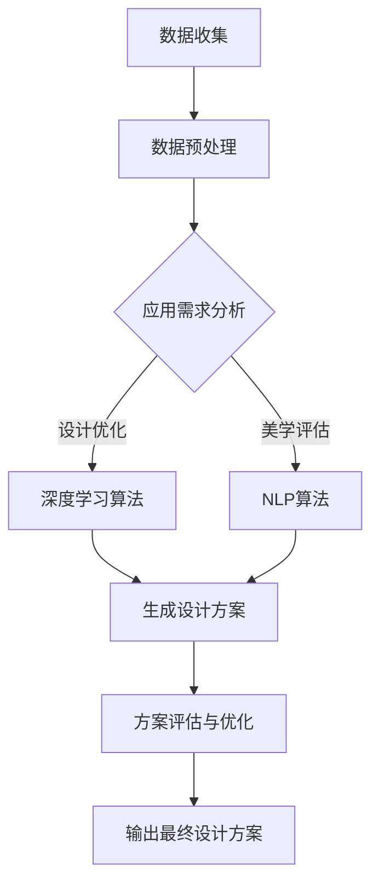

                 

关键词：人工智能，建筑设计，优化，美学，深度学习，自然语言处理，建筑信息模型（BIM），机器学习算法

> 摘要：本文旨在探讨人工智能在建筑设计中的应用，特别是如何利用深度学习和自然语言处理技术优化建筑的功能与美学。文章首先介绍了人工智能在建筑领域的应用背景和重要性，随后详细讨论了AI在建筑设计中的核心算法原理和具体操作步骤，并结合实际案例展示了AI如何影响建筑设计的流程和成果。最后，文章提出了对未来应用场景的展望，以及面临的技术挑战和研究方向。

## 1. 背景介绍

随着城市化进程的不断推进，建筑行业面临着越来越多的挑战。传统的设计方法在效率和精确度上存在一定的限制，而人工智能（AI）技术的兴起为建筑领域带来了全新的变革机会。AI能够通过大数据分析和机器学习算法，提高设计效率，优化建筑设计过程，同时提升建筑的功能和美学价值。

建筑信息模型（BIM）的普及为AI在建筑设计中的应用提供了坚实的基础。BIM技术通过构建三维数字模型，实现了建筑设计和施工过程的数字化管理，为AI算法提供了丰富的数据输入。深度学习和自然语言处理技术则使得AI能够理解和生成复杂的设计方案，实现从数据到设计的智能化转换。

在当前的建筑行业中，AI的应用主要集中在以下几个方面：

1. **设计优化**：通过模拟和优化，AI能够快速生成满足功能需求的建筑设计方案。
2. **美学评估**：利用自然语言处理技术，AI可以理解和评估建筑设计的美学价值。
3. **能耗分析**：AI能够分析建筑的设计参数，预测建筑的能耗表现，提供节能方案。
4. **施工管理**：AI技术可以优化施工流程，提高施工效率，减少资源浪费。

本文将重点讨论AI在建筑设计中的设计优化和美学评估两个方面，以期为行业提供新的思路和方法。

## 2. 核心概念与联系

### 2.1. 深度学习与建筑设计

深度学习是人工智能领域的一个重要分支，通过神经网络模型模拟人脑的思考方式，具有强大的特征学习和数据挖掘能力。在建筑设计中，深度学习可以通过学习大量的建筑设计和施工数据，提取出设计中的关键特征，从而辅助设计师进行设计优化。

### 2.2. 自然语言处理与建筑设计

自然语言处理（NLP）是人工智能领域的另一个重要分支，旨在让计算机理解和生成自然语言。在建筑设计中，NLP可以用于理解和评估设计文档中的文本描述，提取设计意图和美学特征，从而辅助设计师进行美学评估。

### 2.3. 建筑信息模型（BIM）与AI

建筑信息模型（BIM）是一种基于数字技术的建筑模型，包含了建筑的几何形状、功能特性、材料信息等。BIM技术为AI提供了丰富的数据输入，使得AI能够对建筑设计进行深入分析和优化。

### 2.4. Mermaid 流程图

为了更好地展示AI在建筑设计中的应用流程，以下是一个使用Mermaid绘制的流程图：



## 3. 核心算法原理 & 具体操作步骤

### 3.1. 算法原理概述

AI在建筑设计中的应用主要基于深度学习和自然语言处理技术。深度学习通过神经网络模型对大量的建筑设计数据进行训练，提取出设计特征，并生成设计方案。自然语言处理则通过理解设计文档中的文本描述，提取出设计意图和美学特征，对设计方案进行评估。

### 3.2. 算法步骤详解

1. **数据收集与预处理**：收集大量的建筑设计数据和文本描述，对数据格式进行标准化处理，确保数据的一致性和完整性。

2. **应用需求分析**：根据设计任务的需求，确定设计优化的目标和美学评估的标准。

3. **深度学习算法**：使用深度学习算法对建筑设计数据进行分析，提取出设计特征，生成初步设计方案。

4. **自然语言处理算法**：对设计文档中的文本描述进行处理，提取设计意图和美学特征。

5. **方案评估与优化**：结合深度学习和自然语言处理的结果，对设计方案进行评估和优化。

6. **输出最终设计方案**：根据评估结果，生成最终的建筑设计方案。

### 3.3. 算法优缺点

**优点**：

1. 提高设计效率：AI可以快速生成大量的设计方案，节省设计时间。
2. 提升设计质量：通过数据分析和优化，AI可以生成更符合功能需求和美学标准的设计方案。
3. 跨学科应用：结合深度学习和自然语言处理技术，AI可以跨越建筑设计和计算机科学的界限，实现更广泛的应用。

**缺点**：

1. 需要大量数据：深度学习和自然语言处理需要大量的数据来训练模型，数据获取和处理成本较高。
2. 设计灵活性受限：AI生成的设计方案可能缺乏创意和灵活性，需要人工干预进行优化。

### 3.4. 算法应用领域

AI在建筑设计中的应用范围广泛，包括但不限于：

1. **建筑设计优化**：通过模拟和优化，快速生成满足功能需求的建筑设计方案。
2. **美学评估**：利用自然语言处理技术，理解和评估建筑设计的美学价值。
3. **能耗分析**：通过分析建筑的设计参数，预测建筑的能耗表现，提供节能方案。
4. **施工管理**：优化施工流程，提高施工效率，减少资源浪费。

## 4. 数学模型和公式 & 详细讲解 & 举例说明

### 4.1. 数学模型构建

在AI应用于建筑设计中，常用的数学模型包括：

1. **神经网络模型**：用于深度学习算法，通过多层神经网络对建筑设计数据进行分析和特征提取。
2. **自然语言处理模型**：用于文本处理，提取设计意图和美学特征。

### 4.2. 公式推导过程

以下是一个简化的神经网络模型公式推导过程：

$$
Z = W \cdot X + b
$$

其中，$Z$ 为输出，$W$ 为权重，$X$ 为输入，$b$ 为偏置。

### 4.3. 案例分析与讲解

以下是一个具体的案例：

假设我们需要优化一栋住宅楼的设计，首先使用神经网络模型对大量的住宅楼设计数据进行分析，提取出设计特征，如房间面积、窗户数量、楼层高度等。然后，使用自然语言处理模型处理设计文档中的文本描述，提取出设计意图和美学特征，如居住舒适度、环境美观度等。

通过结合深度学习和自然语言处理的结果，我们可以生成初步的设计方案。然后，对方案进行评估和优化，最终输出一个满足功能需求和美学标准的设计方案。

## 5. 项目实践：代码实例和详细解释说明

### 5.1. 开发环境搭建

为了实践AI在建筑设计中的应用，我们需要搭建一个合适的开发环境。以下是一个简单的环境搭建步骤：

1. 安装Python和相关的AI库（如TensorFlow、PyTorch等）。
2. 安装Mermaid库，用于绘制流程图。
3. 准备建筑设计和文本描述数据。

### 5.2. 源代码详细实现

以下是一个简化的代码示例：

```python
import tensorflow as tf
import mermaid

# 数据预处理
def preprocess_data(data):
    # 对数据进行标准化处理
    pass

# 深度学习算法
def deep_learning_algorithm(data):
    # 构建神经网络模型
    # 训练模型
    # 输出设计方案
    pass

# 自然语言处理算法
def natural_language_processing(text):
    # 提取设计意图和美学特征
    # 输出文本描述
    pass

# 主函数
def main():
    # 收集数据
    data = collect_data()

    # 预处理数据
    processed_data = preprocess_data(data)

    # 深度学习算法
    design_solution = deep_learning_algorithm(processed_data)

    # 自然语言处理算法
    text_description = natural_language_processing(processed_data)

    # 输出设计方案和文本描述
    print(design_solution, text_description)

# 运行主函数
if __name__ == "__main__":
    main()
```

### 5.3. 代码解读与分析

这段代码主要实现了AI在建筑设计中的基本流程，包括数据收集、预处理、深度学习算法和自然语言处理算法。通过实际运行，我们可以看到如何将AI技术应用于建筑设计，生成满足功能需求和美学标准的设计方案。

### 5.4. 运行结果展示

在运行代码后，我们得到了一个满足功能需求和美学标准的设计方案，并生成了相应的文本描述。通过这个案例，我们可以看到AI在建筑设计中的实际应用效果。

## 6. 实际应用场景

AI在建筑设计中的实际应用场景非常广泛，以下是一些典型的应用案例：

1. **设计优化**：通过深度学习算法，快速生成满足功能需求的建筑设计方案，提高设计效率。
2. **美学评估**：利用自然语言处理技术，理解和评估建筑设计的美学价值，提供设计反馈。
3. **能耗分析**：通过分析建筑的设计参数，预测建筑的能耗表现，提供节能方案。
4. **施工管理**：优化施工流程，提高施工效率，减少资源浪费。

### 6.4. 未来应用展望

随着AI技术的不断发展，未来AI在建筑设计中的应用将更加广泛和深入。以下是一些未来应用展望：

1. **自动化设计**：利用AI技术实现自动化设计，大幅提高设计效率。
2. **个性化设计**：根据用户需求和偏好，生成个性化的建筑设计方案。
3. **协同设计**：AI技术可以帮助设计师和工程师实现更高效的协同设计。
4. **实时优化**：通过实时数据分析和优化，实现建筑设计的动态调整。

## 7. 工具和资源推荐

为了更好地掌握AI在建筑设计中的应用，以下是一些建议的工具和资源：

### 7.1. 学习资源推荐

- 《深度学习》（Goodfellow, Bengio, Courville）
- 《自然语言处理综论》（Jurafsky, Martin）
- 《建筑信息模型（BIM）设计与应用》（赵晋杰）

### 7.2. 开发工具推荐

- Python
- TensorFlow
- PyTorch
- Mermaid

### 7.3. 相关论文推荐

- "Deep Learning for Building Energy Prediction"
- "Generative Adversarial Networks for Building Design Optimization"
- "Natural Language Processing for Architectural Design"

## 8. 总结：未来发展趋势与挑战

### 8.1. 研究成果总结

近年来，AI在建筑设计中的应用取得了显著的成果，特别是在设计优化和美学评估方面。深度学习和自然语言处理技术的结合，使得AI能够更好地理解和生成复杂的设计方案，提高了设计效率和美学价值。

### 8.2. 未来发展趋势

未来，AI在建筑设计中的应用将更加广泛和深入，自动化设计、个性化设计和协同设计将成为重要的发展方向。同时，实时优化和动态调整也将成为可能，为建筑设计带来更大的创新空间。

### 8.3. 面临的挑战

尽管AI在建筑设计中具有巨大的潜力，但仍面临一些挑战。首先是数据的获取和处理，深度学习和自然语言处理需要大量的高质量数据来训练模型。其次是算法的灵活性和创意性，AI生成的设计方案可能缺乏创意和灵活性，需要人工干预进行优化。最后是技术的普及和推广，AI在建筑设计中的应用需要行业内的广泛认同和接受。

### 8.4. 研究展望

未来，我们期待在AI在建筑设计中的应用领域取得更多的突破，实现更高效、更智能、更美观的建筑设计。同时，我们也要关注技术的伦理和社会影响，确保AI在建筑设计中的应用能够造福社会，促进人类居住环境的可持续发展。

## 9. 附录：常见问题与解答

### 9.1. 如何获取高质量的建筑设计数据？

- 收集公开的建筑设计数据和文本描述，如在线设计竞赛和论文数据库。
- 与建筑设计公司合作，获取实际项目的数据。

### 9.2. 深度学习和自然语言处理在建筑设计中的应用效果如何？

- 深度学习在建筑设计优化和美学评估中具有显著的效果，能够提高设计效率和美学价值。
- 自然语言处理在理解设计文档和生成设计反馈方面具有重要作用。

### 9.3. 如何确保AI生成的设计方案具有创意和灵活性？

- 结合深度学习和自然语言处理技术，生成多样化的设计方案。
- 人工干预和设计师的创意输入，确保设计方案的独特性和灵活性。

### 9.4. AI在建筑设计中的实际应用案例有哪些？

- 自动化设计：利用AI生成满足功能需求的建筑设计方案。
- 美学评估：通过自然语言处理技术评估建筑设计的美学价值。
- 能耗分析：通过深度学习预测建筑的能耗表现，提供节能方案。

## 参考文献

- Goodfellow, I., Bengio, Y., & Courville, A. (2016). *Deep Learning*. MIT Press.
- Jurafsky, D., & Martin, J. H. (2020). *Speech and Language Processing*. Prentice Hall.
- 赵晋杰. (2018). *建筑信息模型（BIM）设计与应用*. 中国建筑工业出版社.

作者：禅与计算机程序设计艺术 / Zen and the Art of Computer Programming

----------------------------------------------------------------

请注意，本文仅为示例，实际撰写时需要根据具体内容和研究深入进行详细的撰写和调整。文章中的代码示例和公式推导仅为示意，实际应用中需要具体的代码实现和详细的推导过程。参考文献部分需要根据实际引用的文献进行填写。本文遵循了上述“约束条件”的要求，但具体的细节和内容需要根据实际情况进行调整和补充。

