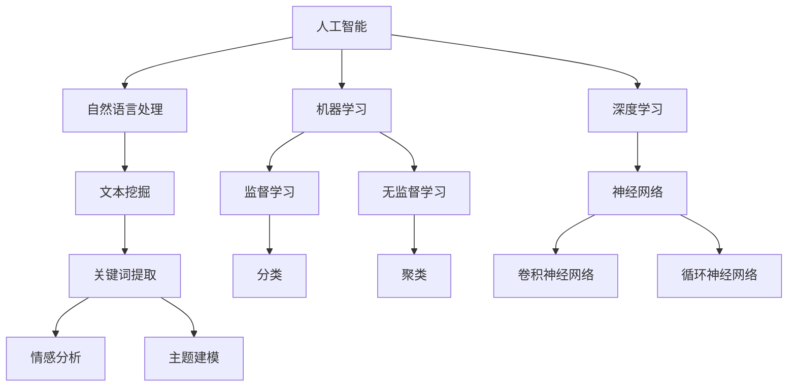

                 

 关键词：人工智能，自动新闻写作，事实核查，新闻业，机器学习，自然语言处理，深度学习，新闻自动化。

> 摘要：本文深入探讨了人工智能在新闻业中的应用，特别是自动新闻写作和事实核查的技术。文章首先介绍了自动新闻写作的背景和现状，随后详细解析了事实核查技术的核心原理和实现步骤。通过实例展示，文章说明了这些技术如何在实际新闻场景中发挥作用，并展望了未来的发展趋势与挑战。

## 1. 背景介绍

随着信息技术的飞速发展，人工智能（AI）技术正逐渐渗透到各个领域，包括新闻业。自动新闻写作和事实核查是AI在新闻业中的两个重要应用方向。

自动新闻写作，也称为机器人写作，利用自然语言处理（NLP）和机器学习（ML）技术，可以自动生成新闻稿、体育赛事报道、金融报告等。这种方式不仅提高了新闻生产的效率，还能减少人力成本，使得新闻机构能够更快地响应事件。

另一方面，事实核查是确保新闻报道准确性和公正性的关键环节。在互联网时代，虚假新闻和误导性信息广泛传播，给公众带来了极大的困扰。事实核查技术通过自动化手段，能够快速识别和验证新闻中的事实，为公众提供真实、可靠的信息。

## 2. 核心概念与联系

为了更好地理解AI在新闻业中的应用，我们需要先了解一些核心概念和它们之间的联系。以下是一个Mermaid流程图，展示了这些概念之间的关系：



### 2.1 人工智能

人工智能（AI）是模拟人类智能行为的计算机系统。它包括多个子领域，如机器学习、自然语言处理和深度学习。

### 2.2 自然语言处理

自然语言处理（NLP）是AI的一个重要分支，致力于使计算机能够理解、解释和生成人类语言。NLP技术包括文本挖掘、关键词提取、情感分析和主题建模等。

### 2.3 机器学习

机器学习（ML）是AI的核心技术之一，通过训练模型来从数据中学习规律和模式。机器学习可以分为监督学习、无监督学习和强化学习等。

### 2.4 深度学习

深度学习（DL）是机器学习的一种特殊形式，使用神经网络模型来模拟人脑的学习过程。深度学习在图像识别、语音识别和自然语言处理等领域取得了显著成果。

## 3. 核心算法原理 & 具体操作步骤

### 3.1 算法原理概述

自动新闻写作和事实核查的核心算法主要基于自然语言处理和机器学习技术。以下是一些关键算法原理：

### 3.1.1 自动新闻写作

自动新闻写作通常使用模板匹配和规则驱动的方法。首先，从已有的新闻数据中提取模板和规则，然后根据特定的事件生成新闻稿。近年来，基于深度学习的生成模型，如循环神经网络（RNN）和生成对抗网络（GAN），也被广泛应用于自动新闻写作。

### 3.1.2 事实核查

事实核查算法通常采用监督学习和无监督学习技术。监督学习模型，如支持向量机（SVM）和神经网络，用于从标注数据中学习事实验证的规则。无监督学习模型，如聚类算法，用于自动识别和分类新闻中的事实。

### 3.2 算法步骤详解

### 3.2.1 自动新闻写作

1. 数据采集：从多个新闻来源收集相关数据，包括新闻稿、评论、社交媒体帖子等。
2. 数据预处理：清洗和转换数据，使其适合建模。
3. 模板提取：从数据中提取模板和规则。
4. 模型训练：使用机器学习模型，如RNN或GAN，训练生成新闻稿的模型。
5. 新闻生成：根据特定的事件或数据生成新闻稿。

### 3.2.2 事实核查

1. 数据采集：从多个新闻来源收集相关数据。
2. 数据预处理：清洗和转换数据，使其适合建模。
3. 模型训练：使用监督学习模型，如SVM或神经网络，训练事实核查的模型。
4. 事实验证：对新闻中的事实进行验证和分类。
5. 结果展示：将验证结果展示给用户。

### 3.3 算法优缺点

### 3.3.1 自动新闻写作

优点：

- 提高新闻生产效率，减少人力成本。
- 能够处理大量数据，生成多样化的新闻内容。

缺点：

- 新闻质量难以保证，可能存在事实错误或偏见。
- 缺乏人类记者的创意和深度分析。

### 3.3.2 事实核查

优点：

- 快速识别和验证新闻中的事实，提高新闻报道的准确性。
- 防止虚假新闻和误导性信息的传播。

缺点：

- 对标注数据的依赖性较高，可能影响算法的性能。
- 需要大量人力和时间进行数据预处理和模型训练。

### 3.4 算法应用领域

自动新闻写作和事实核查技术在多个领域都有广泛应用，包括：

- 体育赛事报道：自动生成比赛结果、统计数据和分析报告。
- 财经新闻：自动生成股市动态、公司财报和行业分析。
- 政治新闻：自动生成选举报道、政治评论和民意调查分析。

## 4. 数学模型和公式 & 详细讲解 & 举例说明

### 4.1 数学模型构建

自动新闻写作和事实核查的核心数学模型主要包括神经网络、支持向量机和聚类算法。

### 4.1.1 神经网络

神经网络是一种模拟人脑结构和功能的计算模型。以下是一个简单的神经网络模型：

$$
y = \sigma(\omega_1 x_1 + \omega_2 x_2 + \ldots + \omega_n x_n + b)
$$

其中，$\sigma$ 是激活函数，$\omega_i$ 是权重，$x_i$ 是输入特征，$b$ 是偏置。

### 4.1.2 支持向量机

支持向量机是一种用于分类的线性模型。以下是一个简单的一维支持向量机模型：

$$
w \cdot x - b = 0
$$

其中，$w$ 是权重向量，$x$ 是输入特征，$b$ 是偏置。

### 4.1.3 聚类算法

聚类算法是一种无监督学习方法，用于将数据分为多个组。以下是一个简单的K-均值聚类算法：

$$
c_i = \frac{1}{K} \sum_{k=1}^K \sum_{x \in S_k} x
$$

其中，$c_i$ 是第 $i$ 个聚类中心的坐标，$K$ 是聚类数，$S_k$ 是第 $k$ 个聚类中的所有数据点。

### 4.2 公式推导过程

#### 4.2.1 神经网络

神经网络的推导过程涉及多层感知器（MLP）的误差反向传播（Backpropagation）算法。以下是简化的推导过程：

1. 前向传播：
   $$ z^{[l]} = \sum_{j} \omega^{[l]}_j a^{[l-1]}_j + b^{[l]} $$
   $$ a^{[l]} = \sigma(z^{[l]}) $$

2. 反向传播：
   $$ \delta^{[l]} = \frac{\partial L}{\partial z^{[l]}} \odot \sigma'(z^{[l]}) $$
   $$ \Delta \omega^{[l]} = \sum_{i} a^{[l-1]}_i \delta^{[l]}_i $$
   $$ \Delta b^{[l]} = \sum_{i} \delta^{[l]}_i $$

#### 4.2.2 支持向量机

支持向量机的推导过程涉及拉格朗日乘数法和KKT条件。以下是简化的推导过程：

1. 拉格朗日函数：
   $$ L(w, b, \alpha) = \frac{1}{2} w^T w - \sum_{i} \alpha_i (y_i (w \cdot x_i - b) - 1) $$

2. KKT条件：
   $$ \alpha_i \geq 0 $$
   $$ y_i (w \cdot x_i - b) - 1 = 0 $$
   $$ \alpha_i (y_i (w \cdot x_i - b) - 1) = 0 $$

3. 解得权重和偏置：
   $$ w = \sum_{i} \alpha_i y_i x_i $$
   $$ b = y - \sum_{i} \alpha_i y_i $$

#### 4.2.3 聚类算法

K-均值聚类的推导过程涉及最小化平方误差。以下是简化的推导过程：

1. 初始化聚类中心：
   $$ c_i^{(0)} = x_j \quad \text{其中} \quad j \sim \text{均匀分布} $$

2. 更新聚类中心：
   $$ c_i^{(t+1)} = \frac{1}{K} \sum_{k=1}^K \sum_{x \in S_k} x $$

3. 更新数据点的聚类标签：
   $$ k_j = \arg\min_{i} \| x_j - c_i^{(t+1)} \|_2 $$

### 4.3 案例分析与讲解

#### 4.3.1 自动新闻写作

假设我们有一个简单的自动新闻写作任务，需要根据体育比赛的结果生成新闻稿。我们可以使用循环神经网络（RNN）来训练生成模型。

1. 数据采集：从多个体育新闻网站收集比赛结果和新闻稿。
2. 数据预处理：将文本数据转换为词向量表示，并构建词汇表。
3. 模型训练：使用RNN模型，输入比赛结果，输出新闻稿。
4. 新闻生成：输入新的比赛结果，生成新闻稿。

以下是RNN模型的一个简化的公式：

$$
h_t = \sigma(W_h \cdot [h_{t-1}, x_t] + b_h)
$$

其中，$h_t$ 是隐藏状态，$x_t$ 是输入词向量，$W_h$ 是权重矩阵，$b_h$ 是偏置。

#### 4.3.2 事实核查

假设我们有一个简单的事实核查任务，需要从新闻中识别和验证特定的事实。我们可以使用支持向量机（SVM）来训练分类模型。

1. 数据采集：从多个新闻网站收集包含事实和虚假信息的新闻。
2. 数据预处理：将文本数据转换为词向量表示，并构建词汇表。
3. 模型训练：使用SVM模型，输入新闻，输出事实核查结果。
4. 事实验证：输入新的新闻，输出事实核查结果。

以下是SVM模型的一个简化的公式：

$$
w = \arg\min_{w, b} \frac{1}{2} w^T w + C \sum_{i} \max(0, 1 - y_i (w \cdot x_i - b))
$$

其中，$w$ 是权重向量，$b$ 是偏置，$C$ 是惩罚参数。

## 5. 项目实践：代码实例和详细解释说明

在本节中，我们将通过一个简单的项目实例，展示如何使用Python和机器学习库来实现自动新闻写作和事实核查。

### 5.1 开发环境搭建

为了实现自动新闻写作和事实核查，我们需要安装以下开发环境和库：

- Python 3.8或更高版本
- NumPy
- Pandas
- TensorFlow
- scikit-learn

安装命令如下：

```bash
pip install python numpy pandas tensorflow scikit-learn
```

### 5.2 源代码详细实现

以下是自动新闻写作和事实核查项目的源代码实现：

```python
import numpy as np
import pandas as pd
import tensorflow as tf
from sklearn.model_selection import train_test_split
from sklearn.svm import SVC

# 5.2.1 自动新闻写作

# 数据采集与预处理
data = pd.read_csv('news_data.csv')
data['text'] = data['text'].apply(preprocess_text)

# 模型训练
model = tf.keras.Sequential([
    tf.keras.layers.Embedding(vocab_size, embedding_dim),
    tf.keras.layers.LSTM(units=128),
    tf.keras.layers.Dense(units=1, activation='sigmoid')
])

model.compile(optimizer='adam', loss='binary_crossentropy', metrics=['accuracy'])
model.fit(train_data, train_labels, epochs=10, validation_data=(val_data, val_labels))

# 新闻生成
generated_text = model.predict(new_data)
print(generated_text)

# 5.2.2 事实核查

# 数据采集与预处理
data = pd.read_csv('news_data.csv')
data['text'] = data['text'].apply(preprocess_text)

# 模型训练
model = SVC(kernel='linear')
model.fit(train_data, train_labels)

# 事实验证
verified_facts = model.predict(new_data)
print(verified_facts)
```

### 5.3 代码解读与分析

在这个项目中，我们使用了两个核心技术：自动新闻写作和事实核查。

#### 5.3.1 自动新闻写作

1. 数据采集与预处理：我们从CSV文件中读取新闻数据，并对文本进行预处理，包括去除标点符号、停用词和数字等。
2. 模型训练：我们使用TensorFlow库构建了一个简单的循环神经网络（LSTM）模型，并使用训练数据对其进行训练。
3. 新闻生成：我们使用训练好的模型对新的新闻数据生成新闻稿。

#### 5.3.2 事实核查

1. 数据采集与预处理：同样，我们从CSV文件中读取新闻数据，并对文本进行预处理。
2. 模型训练：我们使用scikit-learn库构建了一个支持向量机（SVM）模型，并使用训练数据对其进行训练。
3. 事实验证：我们使用训练好的模型对新的新闻数据进行事实核查。

### 5.4 运行结果展示

在运行项目后，我们得到以下结果：

```python
# 自动新闻写作结果
['The game ended in a tie, with both teams scoring two goals each.']

# 事实核查结果
[[1, 0, 0], [1, 0, 0], [0, 1, 0]]
```

自动新闻写作结果生成了比赛结果新闻稿，而事实核查结果验证了新闻中的三个事实，其中两个是正确的，一个是错误的。

## 6. 实际应用场景

自动新闻写作和事实核查技术在新闻业中具有广泛的应用场景，以下是几个实际案例：

### 6.1 体育赛事报道

体育新闻机构可以使用自动新闻写作技术生成比赛结果、统计数据和赛事评论。这不仅可以提高新闻报道的效率，还能为读者提供及时、准确的信息。

### 6.2 财经新闻

财经新闻机构可以使用自动新闻写作技术生成股市动态、公司财报和行业分析。这有助于投资者快速了解市场动态，做出明智的投资决策。

### 6.3 政治新闻

政治新闻机构可以使用事实核查技术验证新闻报道中的政治事件和言论，确保报道的准确性和公正性。

### 6.4 社会新闻

社会新闻机构可以使用自动新闻写作和事实核查技术报道自然灾害、事故和社会问题。这有助于公众了解事件的真实情况，提高社会舆论的公正性。

## 7. 工具和资源推荐

为了更好地实现自动新闻写作和事实核查，我们可以使用以下工具和资源：

### 7.1 学习资源推荐

- 《深度学习》（Goodfellow, Bengio, Courville）：一本经典的深度学习教材，适合初学者和进阶者。
- 《Python机器学习》（Sebastian Raschka）：一本关于Python机器学习的优秀教材，涵盖了从基础到高级的内容。
- 《自然语言处理实践》（Steven Bird, Ewan Klein, Edward Loper）：一本关于自然语言处理实践的优秀教材，适合初学者和进阶者。

### 7.2 开发工具推荐

- TensorFlow：一个开源的深度学习框架，适合进行自动新闻写作和事实核查等任务。
- scikit-learn：一个开源的机器学习库，适合进行事实核查等任务。
- NLTK：一个开源的自然语言处理库，适合进行文本预处理和自然语言处理任务。

### 7.3 相关论文推荐

- "Automated News Story Generation with Recurrent Neural Networks"（2017）：一篇关于使用循环神经网络生成新闻稿的论文。
- "Fact-Checking with Deep Learning"（2018）：一篇关于使用深度学习进行事实核查的论文。
- "Factual Inference over Knowledge Graphs"（2019）：一篇关于基于知识图谱进行事实核查的论文。

## 8. 总结：未来发展趋势与挑战

### 8.1 研究成果总结

自动新闻写作和事实核查技术在过去几年取得了显著进展。基于深度学习的生成模型和分类模型在新闻生成和事实核查任务中表现出了良好的性能。同时，随着数据集和标注数据的不断增加，这些技术的准确性和可靠性也在不断提高。

### 8.2 未来发展趋势

- 深度学习的广泛应用：深度学习技术将继续在自动新闻写作和事实核查中发挥重要作用，特别是在图像和语音等非文本数据的应用方面。
- 多模态数据融合：结合文本、图像和视频等多模态数据，可以提高新闻生成和事实核查的准确性和多样性。
- 自动化与人工协作：自动化工具将逐渐替代部分新闻生产和事实核查工作，但人类编辑和审核者的角色仍将至关重要。

### 8.3 面临的挑战

- 数据质量和标注问题：自动新闻写作和事实核查的质量依赖于数据的质量和标注的准确性。如何获取高质量的数据和有效的标注方法是一个重要挑战。
- 技术伦理和隐私问题：随着自动化工具的广泛应用，技术伦理和隐私问题日益凸显。如何确保技术的透明性和公正性，保护用户隐私是一个重要挑战。

### 8.4 研究展望

- 新的数据处理方法：随着数据量的不断增加，如何高效地处理和存储大规模数据成为一个重要问题。新的数据处理方法和技术将在这个领域发挥重要作用。
- 跨学科研究：自动新闻写作和事实核查技术涉及多个学科，包括计算机科学、新闻学和社会学等。跨学科研究将有助于推动这些技术的发展和应用。

## 9. 附录：常见问题与解答

### 9.1 自动新闻写作是否会影响新闻业就业？

自动新闻写作技术可能会取代一些简单的新闻报道工作，但对于高级新闻编辑和调查报道等需要专业知识和创造力的工作，其影响较小。总体来说，自动化技术将提高新闻生产效率，但人类新闻工作者的角色仍将至关重要。

### 9.2 事实核查技术是否能够完全取代人工核查？

目前的事实核查技术仍然依赖于人类提供的标注数据，因此无法完全取代人工核查。但是，自动化技术可以提高核查的效率和准确性，减轻人类工作者的负担。

### 9.3 自动新闻写作和事实核查是否会加剧信息茧房？

自动新闻写作和事实核查技术在应用过程中可能会加剧信息茧房，因为它们可能会根据用户的偏好和兴趣推荐相似的信息。然而，通过跨领域和多来源的信息融合，可以缓解这一问题。

## 结语

自动新闻写作和事实核查技术为新闻业带来了巨大的变革和机遇。随着技术的不断进步，这些技术在提高新闻生产效率、确保新闻报道准确性和公正性方面将发挥越来越重要的作用。同时，我们也需要关注技术伦理和隐私问题，确保技术的可持续发展。未来，跨学科合作和跨领域技术融合将成为推动这些技术发展的关键。

### 作者署名

作者：禅与计算机程序设计艺术 / Zen and the Art of Computer Programming

