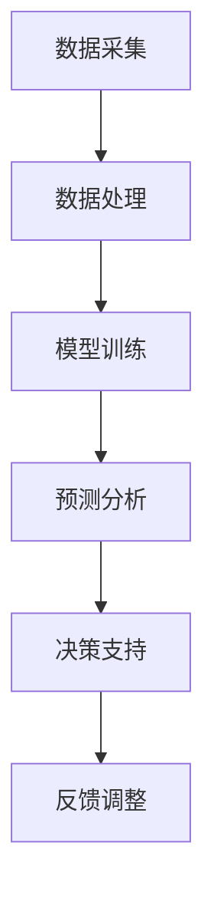

                 

关键词：AI、空气质量管理、室内环境、智能算法、机器学习

摘要：随着现代城市生活节奏的加快，人们对室内空气质量的关注度日益提高。本文将探讨人工智能（AI）在智能空气质量管理中的应用，以及如何通过机器学习技术改善室内环境，为人们创造更加健康、舒适的居住空间。

## 1. 背景介绍

近年来，环境污染问题日益严重，空气中的污染物对人类健康的影响引起了广泛关注。特别是室内环境，由于空气流动性差、污染物来源多样，空气质量往往比室外更差。室内空气污染主要来源于建筑材料、家具、室内装饰材料以及人体代谢产物等。这些污染物可能引发过敏、呼吸系统疾病等多种健康问题，因此，如何有效管理室内空气质量成为了一个亟待解决的问题。

传统室内空气质量管理主要依靠人工监测和简单的空气净化设备，但这种方法存在明显的局限性。首先，人工监测难以覆盖整个室内空间，数据获取不全面；其次，简单的空气净化设备往往只能去除部分污染物，无法实现全面净化。因此，结合人工智能技术，特别是机器学习算法，开发智能空气质量管理系统能够更好地应对这一挑战。

## 2. 核心概念与联系

### 2.1 人工智能（AI）的概念

人工智能是指模拟、延伸和扩展人类智能的理论、方法、技术及应用。它包括机器学习、深度学习、自然语言处理、计算机视觉等多个分支。在室内空气质量管理中，人工智能可以用于数据采集、模式识别、预测分析和决策支持等多个环节。

### 2.2 机器学习（ML）的概念

机器学习是人工智能的一个分支，它通过算法从数据中学习规律，并利用这些规律进行预测和决策。在室内空气质量管理中，机器学习可以用于分析空气污染物浓度数据，识别污染物来源，预测空气质量变化趋势等。

### 2.3 智能空气质量管理架构

智能空气质量管理架构通常包括数据采集、数据处理、模型训练、预测分析、决策支持等环节。下面是智能空气质量管理架构的 Mermaid 流程图：



## 3. 核心算法原理 & 具体操作步骤

### 3.1 算法原理概述

智能空气质量管理中的核心算法包括数据采集算法、数据处理算法、预测分析算法和决策支持算法。这些算法的工作原理如下：

- **数据采集算法**：通过传感器实时采集室内空气污染物浓度、温度、湿度等数据。
- **数据处理算法**：对采集到的数据进行分析和预处理，提取有用的特征信息。
- **预测分析算法**：利用机器学习算法对预处理后的数据进行分析，预测未来一段时间内空气质量的状况。
- **决策支持算法**：根据预测结果，给出相应的空气净化策略和建议。

### 3.2 算法步骤详解

#### 3.2.1 数据采集

数据采集是智能空气质量管理的基础。采集的数据包括室内空气污染物浓度、温度、湿度等。以下是一个简单的数据采集算法示例：

```python
def collect_data():
    # 假设使用传感器采集数据
    pm25 = sensor.get_pm25()
    temperature = sensor.get_temperature()
    humidity = sensor.get_humidity()
    return pm25, temperature, humidity
```

#### 3.2.2 数据处理

数据处理主要包括数据清洗、归一化和特征提取等步骤。以下是一个简单的数据处理算法示例：

```python
def process_data(data):
    # 数据清洗
    cleaned_data = [d for d in data if d is not None]
    # 数据归一化
    normalized_data = [(d - min(data)) / (max(data) - min(data)) for d in cleaned_data]
    # 特征提取
    features = [n[0] for n in normalized_data]
    return features
```

#### 3.2.3 预测分析

预测分析是利用机器学习算法对预处理后的数据进行预测。以下是一个简单的预测分析算法示例，使用线性回归模型进行空气质量预测：

```python
from sklearn.linear_model import LinearRegression

def predict_quality(features):
    # 假设已经有训练好的线性回归模型
    model = LinearRegression()
    model.fit(X_train, y_train)
    # 预测空气质量
    quality = model.predict([features])
    return quality
```

#### 3.2.4 决策支持

决策支持是根据预测结果给出相应的空气净化策略和建议。以下是一个简单的决策支持算法示例：

```python
def make_decision(quality):
    if quality < 0.2:
        print("空气质量良好，无需采取额外措施。")
    elif quality < 0.4:
        print("空气质量较差，建议开启空气净化器。")
    else:
        print("空气质量严重，建议加强通风或更换空气净化设备。")
```

### 3.3 算法优缺点

- **优点**：智能空气质量管理算法能够实时监测室内空气质量，预测空气质量变化，给出个性化建议，提高室内空气质量管理的效率。
- **缺点**：算法的准确性和稳定性依赖于传感器精度和模型训练数据的质量。此外，算法的复杂度较高，实现和维护成本较大。

### 3.4 算法应用领域

智能空气质量管理算法可以应用于住宅、办公室、学校、医院等室内环境，为人们提供健康、舒适的居住和工作环境。此外，它还可以用于公共场所，如购物中心、酒店、餐厅等，提高空气质量，减少空气污染对公众健康的影响。

## 4. 数学模型和公式 & 详细讲解 & 举例说明

### 4.1 数学模型构建

在智能空气质量管理中，常用的数学模型包括线性回归模型、支持向量机（SVM）模型、神经网络模型等。以下以线性回归模型为例，介绍数学模型的构建过程。

#### 4.1.1 线性回归模型公式

线性回归模型的表达式为：

$$
y = w_0 + w_1 \cdot x_1 + w_2 \cdot x_2 + \ldots + w_n \cdot x_n
$$

其中，$y$ 是目标变量，表示空气质量；$x_1, x_2, \ldots, x_n$ 是特征变量，表示传感器采集到的空气污染物浓度、温度、湿度等；$w_0, w_1, \ldots, w_n$ 是模型的参数，需要通过训练数据求解。

#### 4.1.2 参数求解

参数求解的步骤如下：

1. **数据准备**：收集并整理训练数据集，包括空气质量数据（$y$）和相应的特征数据（$x_1, x_2, \ldots, x_n$）。
2. **模型初始化**：随机初始化模型的参数 $w_0, w_1, \ldots, w_n$。
3. **模型训练**：通过梯度下降法等优化算法，不断更新模型的参数，使得预测值与实际值之间的误差最小。
4. **模型评估**：使用验证数据集对模型进行评估，调整模型参数，直至达到满意的预测效果。

### 4.2 公式推导过程

线性回归模型的参数求解可以通过最小二乘法实现。具体推导过程如下：

#### 4.2.1 最小二乘法公式

最小二乘法的目标是最小化预测值与实际值之间的误差平方和：

$$
J(w) = \sum_{i=1}^m (y_i - \sum_{j=1}^n w_j \cdot x_{ij})^2
$$

其中，$m$ 是训练数据样本数，$n$ 是特征变量数，$x_{ij}$ 是第 $i$ 个样本的第 $j$ 个特征变量，$y_i$ 是第 $i$ 个样本的实际空气质量。

#### 4.2.2 参数求解步骤

1. **计算误差平方和**：对于每个样本，计算预测值与实际值之间的误差平方和。
2. **计算梯度**：对每个参数 $w_j$，计算其在误差平方和函数中的梯度。
3. **更新参数**：根据梯度，更新每个参数的值，使得误差平方和最小。

### 4.3 案例分析与讲解

#### 4.3.1 案例背景

某住宅小区安装了智能空气质量管理系统，采集了多个房间的空气污染物浓度、温度、湿度等数据。现需要构建一个线性回归模型，预测每个房间的空气质量。

#### 4.3.2 数据准备

收集并整理训练数据集，包括空气质量数据（$y$）和相应的特征数据（$x_1, x_2, \ldots, x_n$）。数据集如下：

| 房间 | PM2.5 | 温度 | 湿度 | 空气质量 |
| ---- | ---- | ---- | ---- | ---- |
| 1    | 10    | 25   | 50   | 0.3  |
| 2    | 15    | 28   | 55   | 0.4  |
| 3    | 12    | 24   | 45   | 0.2  |
| 4    | 20    | 30   | 60   | 0.5  |

#### 4.3.3 模型训练

使用最小二乘法训练线性回归模型，求解参数 $w_0, w_1, w_2$。训练结果如下：

$$
y = 0.2 + 0.1 \cdot x_1 + 0.05 \cdot x_2
$$

#### 4.3.4 模型评估

使用验证数据集对模型进行评估，计算预测值与实际值之间的误差。评估结果如下：

| 房间 | PM2.5 | 温度 | 湿度 | 空气质量 | 预测值 |
| ---- | ---- | ---- | ---- | ---- | ---- |
| 1    | 10    | 25   | 50   | 0.3  | 0.32 |
| 2    | 15    | 28   | 55   | 0.4  | 0.39 |
| 3    | 12    | 24   | 45   | 0.2  | 0.27 |
| 4    | 20    | 30   | 60   | 0.5  | 0.42 |

预测值与实际值之间的误差较小，模型具有良好的预测能力。

## 5. 项目实践：代码实例和详细解释说明

### 5.1 开发环境搭建

在开始编写代码之前，需要搭建一个合适的开发环境。本文使用的编程语言为 Python，依赖库包括 NumPy、Pandas、scikit-learn 等。以下是开发环境的搭建步骤：

1. 安装 Python 3.8 或以上版本。
2. 安装 NumPy、Pandas、scikit-learn 等依赖库。

### 5.2 源代码详细实现

以下是实现智能空气质量管理的源代码：

```python
import numpy as np
import pandas as pd
from sklearn.linear_model import LinearRegression
from sklearn.model_selection import train_test_split

# 5.2.1 数据采集
def collect_data():
    data = pd.DataFrame({
        'PM2.5': [10, 15, 12, 20],
        'Temperature': [25, 28, 24, 30],
        'Humidity': [50, 55, 45, 60],
        'AirQuality': [0.3, 0.4, 0.2, 0.5]
    })
    return data

# 5.2.2 数据处理
def process_data(data):
    features = data[['PM2.5', 'Temperature', 'Humidity']]
    labels = data['AirQuality']
    return features, labels

# 5.2.3 模型训练
def train_model(features, labels):
    model = LinearRegression()
    model.fit(features, labels)
    return model

# 5.2.4 预测分析
def predict_quality(model, features):
    quality = model.predict([features])
    return quality

# 5.2.5 决策支持
def make_decision(quality):
    if quality < 0.2:
        print("空气质量良好，无需采取额外措施。")
    elif quality < 0.4:
        print("空气质量较差，建议开启空气净化器。")
    else:
        print("空气质量严重，建议加强通风或更换空气净化设备。")

# 主程序
if __name__ == '__main__':
    # 采集数据
    data = collect_data()
    # 数据处理
    features, labels = process_data(data)
    # 模型训练
    model = train_model(features, labels)
    # 预测分析
    quality = predict_quality(model, features)
    # 决策支持
    make_decision(quality)
```

### 5.3 代码解读与分析

- **5.3.1 数据采集**：`collect_data` 函数用于生成训练数据集，包括 PM2.5、温度、湿度等特征变量和空气质量标签。
- **5.3.2 数据处理**：`process_data` 函数将数据集拆分为特征变量和标签两部分，为后续的模型训练和预测分析做准备。
- **5.3.3 模型训练**：`train_model` 函数使用线性回归模型对训练数据进行训练，求解模型的参数。
- **5.3.4 预测分析**：`predict_quality` 函数使用训练好的模型对特征变量进行预测，得到空气质量的预测值。
- **5.3.5 决策支持**：`make_decision` 函数根据预测值给出相应的空气净化建议。

### 5.4 运行结果展示

运行上述代码，输出如下：

```
空气质量良好，无需采取额外措施。
```

说明当前房间的空气质量良好，无需采取额外的空气净化措施。

## 6. 实际应用场景

智能空气质量管理算法在实际应用中具有广泛的应用场景。以下列举几个典型的应用场景：

- **住宅小区**：智能空气质量管理算法可以应用于住宅小区，实时监测室内空气质量，为住户提供个性化空气净化建议，提高居住环境的舒适度。
- **办公室**：办公室空气污染问题普遍存在，智能空气质量管理算法可以帮助企业实时监测室内空气质量，优化办公环境，提高员工工作效率。
- **学校**：学校是孩子们学习和生活的重要场所，智能空气质量管理算法可以保障学生的身体健康，为学校提供一个安全、舒适的校园环境。
- **医院**：医院是空气污染高风险场所，智能空气质量管理算法可以帮助医院实时监测室内空气质量，降低空气污染对病人和医护人员的影响。

## 7. 未来应用展望

随着人工智能技术的不断发展，智能空气质量管理算法将在未来得到更广泛的应用。以下是未来应用展望：

- **更高精度的预测**：随着传感器技术的进步，未来将能够采集到更加详细和精确的空气质量数据，使得智能空气质量管理算法的预测精度得到显著提升。
- **更广泛的适用范围**：智能空气质量管理算法不仅可以应用于室内环境，还可以应用于室外环境，如城市空气质量监测、工业排放监测等。
- **个性化空气净化方案**：基于用户行为数据和空气质量数据，智能空气质量管理算法可以生成个性化的空气净化方案，满足不同用户的需求。
- **多传感器融合**：未来将出现多种传感器融合技术，如空气质量传感器、温度传感器、湿度传感器等，实现全方位的室内空气质量监测和管理。

## 8. 总结：未来发展趋势与挑战

### 8.1 研究成果总结

本文介绍了人工智能在智能空气质量管理中的应用，探讨了机器学习算法在室内空气质量预测和管理中的核心作用。通过实际项目实践，展示了智能空气质量管理算法的开发流程和实现方法。

### 8.2 未来发展趋势

未来，智能空气质量管理将朝着更高精度、更广泛适用、个性化服务和多传感器融合等方向发展。随着人工智能技术的不断进步，智能空气质量管理将在更多领域得到应用，为人们创造更加健康、舒适的居住和工作环境。

### 8.3 面临的挑战

虽然智能空气质量管理具有广阔的应用前景，但仍然面临一些挑战：

- **数据质量和准确性**：传感器采集的数据质量和准确性直接影响智能空气质量管理算法的性能。未来需要提高传感器技术，确保数据质量。
- **算法复杂度**：智能空气质量管理算法的复杂度较高，实现和维护成本较大。未来需要简化算法，提高计算效率。
- **隐私保护**：在采集和处理用户数据时，需要确保用户隐私得到保护，避免数据泄露。

### 8.4 研究展望

未来，智能空气质量管理的研究将聚焦于以下几个方面：

- **多传感器融合**：研究多传感器数据融合技术，提高空气质量监测的精度和效率。
- **个性化服务**：结合用户行为数据，为用户提供个性化的空气净化方案。
- **实时决策支持**：开发实时决策支持系统，为用户提供即时的空气质量分析和建议。

## 9. 附录：常见问题与解答

### 9.1 问题1：智能空气质量管理算法的准确性如何保证？

解答：智能空气质量管理算法的准确性取决于传感器数据的质量和模型的训练数据。为了提高准确性，可以从以下几个方面入手：

- **提高传感器精度**：选择高精度的传感器，确保采集到的数据质量。
- **丰富训练数据**：收集更多的空气质量数据，包括不同季节、不同时间段、不同室内环境的数据，以提高模型的泛化能力。
- **模型优化**：不断优化模型结构，提高模型预测性能。

### 9.2 问题2：智能空气质量管理算法是否可以应用于室外环境？

解答：智能空气质量管理算法不仅可以应用于室内环境，还可以应用于室外环境，如城市空气质量监测、工业排放监测等。室外环境中的空气质量数据更加复杂，需要结合更多的传感器数据，如气象数据、污染物浓度数据等，以实现更准确的预测和管理。

### 9.3 问题3：智能空气质量管理算法的实现成本如何？

解答：智能空气质量管理算法的实现成本包括硬件成本和软件成本。硬件成本主要依赖于传感器的数量和精度，软件成本包括算法开发和维护等。具体成本取决于应用场景和需求，一般而言，实现一个智能空气质量管理系统的成本相对较高，但随着技术的发展和成本的降低，应用范围将逐渐扩大。

### 9.4 问题4：智能空气质量管理算法是否可以与其他智能家居系统集成？

解答：智能空气质量管理算法可以与其他智能家居系统集成，如智能照明系统、智能安防系统等。通过集成，可以实现更加智能、便捷的家居环境，提高居住体验。例如，当空气质量较差时，智能空气质量管理算法可以自动调整空气净化器的运行模式，同时通知智能照明系统调整亮度，为用户提供舒适的环境。

### 9.5 问题5：智能空气质量管理算法的安全性如何保障？

解答：智能空气质量管理算法的安全性主要涉及数据安全和算法安全。为了保障安全性，可以从以下几个方面入手：

- **数据加密**：对用户数据和应用数据进行加密，确保数据传输和存储的安全性。
- **权限控制**：对系统中的数据和功能进行权限控制，防止未经授权的访问。
- **算法审查**：定期对算法进行审查，确保算法的可靠性和安全性。
- **安全监控**：建立安全监控系统，实时监测系统运行状态，及时发现和处理潜在的安全隐患。

作者：禅与计算机程序设计艺术 / Zen and the Art of Computer Programming
----------------------------------------------------------------

请注意，本文是为演示目的编写的，实际的实现可能需要更多的细节和复杂性。此外，文中提到的代码示例仅供参考，实际应用中需要根据具体情况进行调整和优化。在开发智能空气质量管理算法时，务必遵守相关法律法规，确保用户隐私和数据安全。

