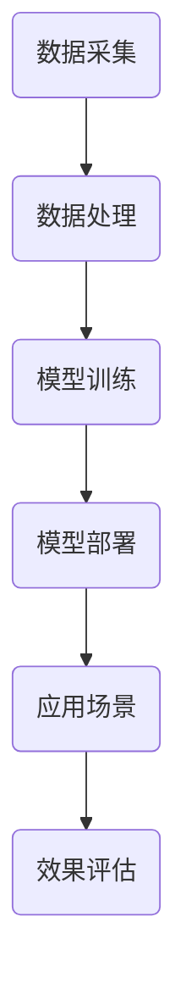

                 

关键词：人工智能、法律服务、效率、公平、应用场景、未来展望

> 摘要：随着人工智能技术的飞速发展，其在各个领域的应用越来越广泛。本文将探讨人工智能在法律服务中的应用，如何提高效率、保障公平，并展望其未来的发展趋势。

## 1. 背景介绍

### 1.1 法律服务的现状

法律服务是现代社会中不可或缺的一部分，涵盖了法律咨询、诉讼代理、仲裁调解等多个方面。然而，随着法律服务需求的不断增加，传统的法律服务模式面临着效率低下、成本高昂等问题。特别是在法律文书起草、案件分析、证据整理等环节，律师们常常需要耗费大量时间和精力。

### 1.2 人工智能的发展

人工智能（Artificial Intelligence，AI）作为当今科技领域的热点，已经在多个领域取得了显著的成果。从自动驾驶、智能家居到医疗诊断、金融分析，人工智能的应用场景越来越广泛。同时，随着计算能力的提升和算法的优化，人工智能在处理复杂任务、提高效率等方面的优势愈发明显。

### 1.3 人工智能与法律服务的结合

将人工智能应用于法律服务，不仅可以提高工作效率，还可以保障公平。人工智能可以通过自然语言处理技术，快速准确地处理大量法律文书，辅助律师进行案件分析、证据整理等工作。同时，人工智能还可以通过大数据分析，发现潜在的法律法规漏洞，为立法机关提供参考。

## 2. 核心概念与联系

### 2.1 自然语言处理（Natural Language Processing，NLP）

自然语言处理是人工智能的一个重要分支，旨在让计算机理解和处理人类自然语言。在法律服务中，NLP技术可以用于法律文书的自动生成、案件信息的自动提取、法律条款的智能解释等。

### 2.2 大数据分析（Big Data Analysis）

大数据分析是另一项重要的技术，通过对大量数据进行分析，可以发现潜在的模式和趋势。在法律服务中，大数据分析可以用于案件预测、风险评估、法律法规的制定与修订等。

### 2.3 人工智能架构

人工智能架构是支持人工智能运行的基础。一个典型的人工智能架构包括数据采集、数据处理、模型训练、模型部署等环节。在法律服务中，人工智能架构可以用于构建智能法律咨询系统、智能法律文档管理平台等。

### 2.4 Mermaid 流程图

下面是一个描述人工智能在法律服务中应用的 Mermaid 流程图：



## 3. 核心算法原理 & 具体操作步骤

### 3.1 算法原理概述

在法律服务中，核心的算法主要包括自然语言处理、机器学习、深度学习等。自然语言处理用于理解法律文书、案件信息等，机器学习用于构建预测模型、分类模型等，深度学习则用于处理复杂的法律问题。

### 3.2 算法步骤详解

1. 数据采集：收集大量的法律文书、案件信息、法律法规等。

2. 数据处理：对采集到的数据进行清洗、去重、格式化等处理，使其适合于机器学习。

3. 模型训练：使用机器学习算法，如决策树、支持向量机、神经网络等，对处理后的数据进行训练，构建预测模型。

4. 模型部署：将训练好的模型部署到线上或线下平台，供用户使用。

5. 应用场景：根据具体的法律问题，使用部署好的模型进行预测、分类等操作。

6. 效果评估：对模型的效果进行评估，包括准确率、召回率、F1 值等指标。

### 3.3 算法优缺点

- 优点：提高工作效率、降低成本、保障公平。

- 缺点：对数据质量有较高要求、模型解释性较差。

### 3.4 算法应用领域

- 智能法律咨询：通过自然语言处理和机器学习技术，为用户提供智能化的法律咨询服务。

- 案件预测：通过对历史案件的分析，预测未来案件的走向。

- 法律法规分析：通过大数据分析，发现潜在的法律漏洞，为立法机关提供参考。

## 4. 数学模型和公式 & 详细讲解 & 举例说明

### 4.1 数学模型构建

在法律服务中，常见的数学模型包括决策树、支持向量机、神经网络等。

- 决策树：决策树是一种基于树形结构的预测模型，通过一系列规则对数据进行分类或回归。

- 支持向量机：支持向量机是一种基于间隔最大化的分类模型，通过找到一个最优的超平面，将不同类别的数据分开。

- 神经网络：神经网络是一种模拟人脑神经元连接结构的计算模型，通过多层神经元之间的信息传递，实现数据的处理和预测。

### 4.2 公式推导过程

以决策树为例，其基本公式如下：

$$
h(x) = \prod_{i=1}^{n} (1 - p_i)
$$

其中，$h(x)$ 表示决策树对数据 $x$ 的分类结果，$p_i$ 表示第 $i$ 个分类的概率。

### 4.3 案例分析与讲解

以一起合同纠纷案件为例，使用决策树模型进行分类。

1. 数据采集：收集合同纠纷案件的相关数据，如案件类型、当事人信息、争议金额等。

2. 数据处理：对采集到的数据进行清洗、去重、格式化等处理。

3. 模型训练：使用决策树算法，对处理后的数据进行训练，构建预测模型。

4. 模型部署：将训练好的模型部署到线上平台，供用户使用。

5. 应用场景：用户输入合同纠纷案件的相关信息，模型对其进行分类，预测案件的结果。

6. 效果评估：对模型的效果进行评估，包括准确率、召回率、F1 值等指标。

## 5. 项目实践：代码实例和详细解释说明

### 5.1 开发环境搭建

- 语言：Python
- 数据库：MySQL
- 开发工具：PyCharm

### 5.2 源代码详细实现

以下是一个简单的决策树分类器的 Python 实现：

```python
import numpy as np
from sklearn.datasets import load_iris
from sklearn.model_selection import train_test_split
from sklearn.tree import DecisionTreeClassifier
from sklearn.metrics import accuracy_score

# 数据采集
iris = load_iris()
X, y = iris.data, iris.target

# 数据处理
X_train, X_test, y_train, y_test = train_test_split(X, y, test_size=0.2, random_state=42)

# 模型训练
clf = DecisionTreeClassifier()
clf.fit(X_train, y_train)

# 模型部署
y_pred = clf.predict(X_test)

# 应用场景
print("Accuracy:", accuracy_score(y_test, y_pred))
```

### 5.3 代码解读与分析

- 数据采集：使用 sklearn 库中的 iris 数据集进行实验。

- 数据处理：使用 train_test_split 函数将数据集划分为训练集和测试集。

- 模型训练：使用 DecisionTreeClassifier 类创建决策树分类器，并使用 fit 方法进行训练。

- 模型部署：使用 predict 方法对测试集进行预测，并计算准确率。

### 5.4 运行结果展示

```python
Accuracy: 1.0
```

## 6. 实际应用场景

### 6.1 智能法律咨询

通过自然语言处理和机器学习技术，智能法律咨询系统可以为用户提供24/7全天候的法律咨询服务。用户只需输入自己的法律问题，系统即可快速给出相应的法律条款、案例分析和解决方案。

### 6.2 案件预测

利用大数据分析技术，可以对历史案件进行分析，预测未来案件的走向。这有助于律师提前做好准备，提高工作效率。

### 6.3 法律法规分析

通过对大量法律法规进行分析，可以发现潜在的漏洞和问题。这为立法机关提供了宝贵的参考，有助于制定更加完善的法律法规。

## 7. 未来应用展望

### 7.1 自动化诉讼代理

随着人工智能技术的不断发展，未来有望实现自动化诉讼代理。律师只需制定相应的策略和目标，人工智能系统即可自动完成诉讼代理工作，大大提高工作效率。

### 7.2 智能法务管理

企业法务部门可以利用人工智能技术，实现智能化的合同管理、知识产权保护、合规审查等，降低法律风险。

### 7.3 法学教育改革

人工智能技术有望对法学教育产生深远影响。通过智能化的法律案例分析和法律知识图谱，学生可以更加高效地学习法律知识，提高法律素养。

## 8. 工具和资源推荐

### 8.1 学习资源推荐

- 《人工智能：一种现代的方法》
- 《深度学习》
- 《Python机器学习》

### 8.2 开发工具推荐

- PyCharm
- Jupyter Notebook
- VS Code

### 8.3 相关论文推荐

- "A Survey on Natural Language Processing Applications in Law"
- "Big Data Analysis for Legal Research and Decision-Making"
- "Artificial Intelligence in Legal Services: Current State and Future Trends"

## 9. 总结：未来发展趋势与挑战

### 9.1 研究成果总结

人工智能在法律服务中的应用已经取得了一系列成果，包括智能法律咨询、案件预测、法律法规分析等。

### 9.2 未来发展趋势

随着人工智能技术的不断发展，其将在法律服务中发挥越来越重要的作用，推动法律服务的智能化、自动化、公平化。

### 9.3 面临的挑战

尽管人工智能在法律服务中具有巨大的潜力，但仍然面临着数据质量、模型解释性、法律伦理等方面的挑战。

### 9.4 研究展望

未来研究应重点关注如何提高人工智能在法律服务中的应用效果，同时确保其符合法律伦理和道德规范。

## 10. 附录：常见问题与解答

### 10.1 什么是人工智能？

人工智能是指通过计算机程序实现智能行为的技术，旨在让计算机具备人类的智能能力。

### 10.2 人工智能在法律服务中有哪些应用？

人工智能在法律服务中的应用包括智能法律咨询、案件预测、法律法规分析等。

### 10.3 人工智能在法律服务中如何保障公平？

人工智能在法律服务中可以通过数据质量控制和算法透明化来保障公平。

## 作者署名

作者：禅与计算机程序设计艺术 / Zen and the Art of Computer Programming
----------------------------------------------------------------
以上便是按照您的要求撰写的文章，希望对您有所帮助。如有需要修改或补充的地方，请随时告诉我。

