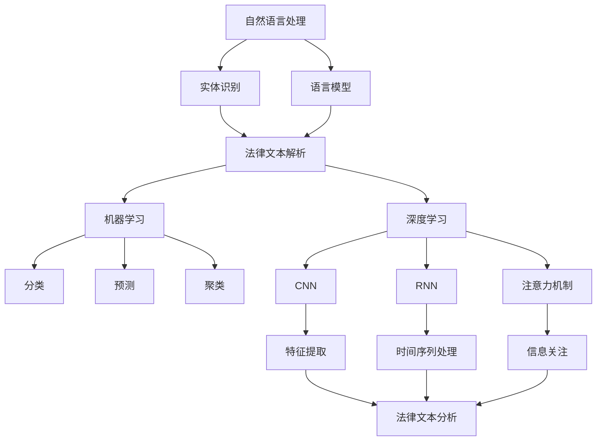

                 

关键词：人工智能，法律检索，案例分析，自然语言处理，机器学习，深度学习，大数据分析，法律文本，智能法律咨询，司法辅助。

> 摘要：本文深入探讨了人工智能在法律检索和案例分析中的应用。通过介绍AI的核心技术，包括自然语言处理、机器学习和深度学习，以及它们在法律领域的具体实现，文章揭示了AI如何提高法律工作的效率和准确性。此外，本文还探讨了AI在司法辅助、法律研究、合同审查等方面的应用，并对其未来发展趋势和面临的挑战进行了展望。

## 1. 背景介绍

### 法律领域的挑战

法律领域是一个高度专业化的领域，涉及大量的法律条文、案例、法规和合同。这些信息以文本形式存储，并且形式多样，包括法律文献、判决书、合同、章程等。面对这些海量的信息，传统的法律检索和案例分析方法效率低下，难以满足日益增长的法律需求。例如，一个律师或法官需要从大量的法律文献中快速找到相关的案例和条文，以便进行法律分析和判决。这种检索过程不仅耗时，而且容易出错，极大地影响了法律工作的效率和准确性。

### 人工智能的崛起

随着人工智能技术的快速发展，其在法律领域的应用逐渐受到关注。人工智能，尤其是自然语言处理（NLP）、机器学习和深度学习等技术，为法律检索和案例分析提供了新的解决方案。通过自然语言处理技术，AI可以理解和解析法律文本，提取关键信息，实现快速、准确的法律检索。机器学习和深度学习则可以通过对大量法律案例的学习，自动识别案例之间的相似性，提供有针对性的法律分析建议。

### 文章结构

本文将首先介绍AI在法律检索和案例分析中的核心技术，包括自然语言处理、机器学习和深度学习。接着，我们将探讨AI在司法辅助、法律研究、合同审查等实际应用场景。随后，本文将讨论未来AI在法律领域的发展趋势和面临的挑战。最后，我们将总结研究成果，展望未来的发展方向。

## 2. 核心概念与联系

### 自然语言处理（NLP）

自然语言处理是人工智能的一个分支，旨在使计算机理解和生成自然语言。在法律检索和案例分析中，NLP技术可以用于提取法律文本中的关键信息，如案件名称、当事人、法律条款等。NLP的关键在于语言模型和实体识别。

#### 语言模型

语言模型是一种用于预测下一个单词或字符的统计模型。在法律文本中，语言模型可以帮助识别句子结构，理解法律术语和条款。常见的语言模型包括n-gram模型、神经网络模型（如LSTM、GRU）和注意力机制模型（如BERT）。

#### 实体识别

实体识别是NLP中的另一个关键任务，旨在识别文本中的特定实体，如人名、地点、组织、法律条款等。在法律文本中，实体识别对于准确检索和分析案例至关重要。常见的实体识别技术包括规则匹配、统计模型和深度学习模型。

### 机器学习

机器学习是一种通过数据学习规律和模式的技术，广泛应用于各种领域，包括法律。在法律检索和案例分析中，机器学习技术可以用于分类、预测和聚类等任务。

#### 分类

分类是一种将数据分为不同类别的方法。在法律领域，分类可以用于判断案件的法律性质，如民事案件、刑事案件等。常见的分类算法包括逻辑回归、支持向量机（SVM）、随机森林和神经网络。

#### 预测

预测是一种根据现有数据预测未来事件的方法。在法律领域，预测可以用于预测案件的审理时间、判决结果等。常见的预测算法包括回归分析、时间序列分析和机器学习模型。

#### 聚类

聚类是一种将数据分为相似组的方法。在法律领域，聚类可以用于识别相似案例，分析案例之间的关联性。常见的聚类算法包括K-means、层次聚类和DBSCAN。

### 深度学习

深度学习是一种基于人工神经网络的机器学习技术，具有强大的特征提取和模式识别能力。在法律检索和案例分析中，深度学习可以用于处理复杂的法律文本，提取深层次的信息。

#### 卷积神经网络（CNN）

卷积神经网络是一种用于图像和文本分析的深度学习模型，其通过卷积操作提取局部特征。在法律文本中，CNN可以用于提取案件中的关键证据和法律条款。

#### 循环神经网络（RNN）

循环神经网络是一种用于序列数据处理的深度学习模型，其通过记忆机制处理长序列。在法律文本中，RNN可以用于提取案件的历史信息和时间序列数据。

#### 注意力机制

注意力机制是一种用于提高神经网络处理能力的机制，其通过为不同部分分配不同的重要性。在法律文本中，注意力机制可以帮助模型更好地关注关键信息，提高检索和分析的准确性。

### Mermaid 流程图

以下是法律检索和案例分析中的AI技术架构的Mermaid流程图：



## 3. 核心算法原理 & 具体操作步骤

### 3.1 算法原理概述

在法律检索和案例分析中，AI算法的核心在于处理和理解法律文本。自然语言处理（NLP）提供了处理文本的基本工具，包括语言模型和实体识别。这些工具可以帮助我们将法律文本转化为计算机可以理解的形式。接着，机器学习和深度学习算法利用这些转化后的数据，进行分类、预测和聚类等任务，以实现法律检索和案例分析。

#### 自然语言处理

1. **语言模型**：通过统计方法或神经网络模型，学习文本的语法和语义规律，用于预测下一个单词或字符。
2. **实体识别**：通过规则匹配、统计模型或深度学习模型，识别文本中的特定实体，如人名、地点、组织、法律条款等。

#### 机器学习

1. **分类**：根据已有的案例和法律条文，将新案例分类到不同的法律类别中。
2. **预测**：利用历史数据，预测案件的审理时间、判决结果等。
3. **聚类**：将相似的案例分组，以分析案例之间的关联性。

#### 深度学习

1. **卷积神经网络（CNN）**：通过卷积操作，提取法律文本中的关键证据和法律条款。
2. **循环神经网络（RNN）**：通过记忆机制，处理法律文本中的历史信息和时间序列数据。
3. **注意力机制**：通过分配不同的重要性，提高模型对法律文本中关键信息的关注程度。

### 3.2 算法步骤详解

1. **数据预处理**：对法律文本进行清洗、分词、标注等预处理操作，以生成适合模型训练的数据集。
2. **模型训练**：使用机器学习和深度学习算法，对预处理后的数据集进行训练，生成预测模型。
3. **模型评估**：通过交叉验证、准确率、召回率等指标，评估模型的性能。
4. **应用模型**：将训练好的模型应用于实际的法律检索和案例分析任务，提供法律建议和决策支持。

### 3.3 算法优缺点

#### 自然语言处理

**优点**：

- 可以处理大量法律文本，提高检索效率。
- 通过实体识别，可以提取文本中的关键信息，提高分析的准确性。

**缺点**：

- 需要大量高质量的标注数据，数据预处理复杂。
- 对复杂句法和语义理解存在一定的局限性。

#### 机器学习

**优点**：

- 可以通过学习历史数据，提供个性化的法律分析和建议。
- 可以处理各种类型的法律问题，包括分类、预测和聚类。

**缺点**：

- 需要大量训练数据，训练过程可能非常耗时。
- 预测结果可能受到数据分布和噪声的影响。

#### 深度学习

**优点**：

- 可以自动提取法律文本中的深层特征，提高模型的泛化能力。
- 可以处理复杂的文本结构，包括长文本和嵌套结构。

**缺点**：

- 需要大量的计算资源和时间，训练过程可能非常昂贵。
- 对数据质量和标注的依赖较大，模型可能存在过拟合问题。

### 3.4 算法应用领域

#### 法律检索

- 案例检索：通过自然语言处理和机器学习，快速检索到与特定案件相关的案例。
- 法律条文检索：通过深度学习，提取文本中的法律条款，实现精确的法律条文检索。

#### 法律分析

- 案例分析：利用机器学习和深度学习，自动分析案件的判决理由、证据和法律条款。
- 法律预测：通过历史案例和数据分析，预测案件的审理时间和判决结果。

#### 司法辅助

- 案件分类：利用机器学习，将新案件自动分类到不同的法律类别。
- 法律咨询：利用自然语言处理和深度学习，提供法律咨询和解答。

## 4. 数学模型和公式 & 详细讲解 & 举例说明

### 4.1 数学模型构建

在法律检索和案例分析中，常用的数学模型包括分类模型、预测模型和聚类模型。以下分别介绍这些模型的构建方法。

#### 分类模型

分类模型是一种将数据分为不同类别的模型。在法律检索中，分类模型可以用于判断案件的法律性质。常见的分类模型包括逻辑回归、支持向量机（SVM）和随机森林。

1. **逻辑回归**：

   逻辑回归是一种概率性分类模型，其目标是通过输入特征预测案件的概率。逻辑回归的数学模型如下：

   $$ P(Y=1|X) = \frac{1}{1 + e^{-(\beta_0 + \beta_1x_1 + \beta_2x_2 + ... + \beta_nx_n)}} $$

   其中，$Y$ 是案件的法律性质（0或1），$X$ 是案件的输入特征向量，$\beta_0, \beta_1, ..., \beta_n$ 是模型参数。

2. **支持向量机（SVM）**：

   支持向量机是一种基于最大间隔的分类模型，其目标是在高维空间中找到一个最佳的超平面，将不同类别的数据点分开。SVM的数学模型如下：

   $$ \min_{\beta, \beta_0, \xi} \frac{1}{2}||\beta||^2 + C \sum_{i=1}^{n} \xi_i $$

   $$ s.t. y_i (\beta_0 + \sum_{j=1}^{n} \beta_j x_{ij}) \geq 1 - \xi_i $$

   其中，$y_i$ 是第 $i$ 个案件的标签（-1或1），$x_{ij}$ 是第 $i$ 个案件的第 $j$ 个特征，$\xi_i$ 是松弛变量，$C$ 是惩罚参数。

3. **随机森林**：

   随机森林是一种基于决策树的集成分类模型，其通过构建多棵决策树，并结合它们的预测结果进行分类。随机森林的数学模型如下：

   $$ h(x) = \sum_{i=1}^{n} w_i f_i(x) $$

   $$ f_i(x) = g(\theta_{i1}x_1 + \theta_{i2}x_2 + ... + \theta_{in}x_n) $$

   其中，$h(x)$ 是预测结果，$w_i$ 是第 $i$ 棵决策树的权重，$f_i(x)$ 是第 $i$ 棵决策树的预测结果，$g(\theta)$ 是阈值函数，$\theta_{i1}, \theta_{i2}, ..., \theta_{in}$ 是决策树的参数。

#### 预测模型

预测模型是一种根据历史数据预测未来事件的方法。在法律领域，预测模型可以用于预测案件的审理时间和判决结果。常见的预测模型包括回归分析和时间序列分析。

1. **回归分析**：

   回归分析是一种用于建立变量之间关系的模型。在法律领域，回归分析可以用于预测案件的审理时间。回归分析的数学模型如下：

   $$ y = \beta_0 + \beta_1x_1 + \beta_2x_2 + ... + \beta_nx_n $$

   其中，$y$ 是案件的审理时间，$x_1, x_2, ..., x_n$ 是影响审理时间的因素，$\beta_0, \beta_1, ..., \beta_n$ 是模型参数。

2. **时间序列分析**：

   时间序列分析是一种用于分析时间序列数据的方法。在法律领域，时间序列分析可以用于预测案件的判决结果。时间序列分析的数学模型如下：

   $$ y_t = \alpha_0 + \alpha_1y_{t-1} + \alpha_2y_{t-2} + ... + \alpha_ly_{t-l} + \epsilon_t $$

   其中，$y_t$ 是第 $t$ 个案件的判决结果，$y_{t-1}, y_{t-2}, ..., y_{t-l}$ 是历史判决结果，$\alpha_0, \alpha_1, ..., \alpha_l$ 是模型参数，$\epsilon_t$ 是误差项。

#### 聚类模型

聚类模型是一种将数据分为相似组的方法。在法律领域，聚类模型可以用于识别相似案例，分析案例之间的关联性。常见的聚类模型包括K-means、层次聚类和DBSCAN。

1. **K-means**：

   K-means是一种基于距离的聚类模型，其目标是将数据分为 $k$ 个聚类。K-means的数学模型如下：

   $$ \min_{\mu_1, \mu_2, ..., \mu_k} \sum_{i=1}^{n} \sum_{j=1}^{k} ||x_i - \mu_j||^2 $$

   其中，$x_i$ 是第 $i$ 个数据点，$\mu_1, \mu_2, ..., \mu_k$ 是聚类中心。

2. **层次聚类**：

   层次聚类是一种基于层次结构的聚类模型，其通过逐步合并或分裂聚类，形成层次结构。层次聚类的数学模型如下：

   $$ D_{ij} = \min \{d(x_i, x_j), d(x_i, C_j), d(x_j, C_i)\} $$

   其中，$D_{ij}$ 是第 $i$ 个点和第 $j$ 个聚类之间的距离，$C_j$ 是第 $j$ 个聚类。

3. **DBSCAN**：

   DBSCAN是一种基于密度的聚类模型，其通过识别核心点和边界点，形成聚类。DBSCAN的数学模型如下：

   $$ \rho(q, \epsilon) = \sum_{p \in \mathcal{N}_{\epsilon}(q)} \frac{1}{d(q, p)} $$

   其中，$\mathcal{N}_{\epsilon}(q)$ 是以 $q$ 为中心，半径为 $\epsilon$ 的邻域，$d(q, p)$ 是 $q$ 和 $p$ 之间的距离。

### 4.2 公式推导过程

以下是分类模型中逻辑回归的推导过程。

假设我们有一个训练数据集 $D = \{(x_1, y_1), (x_2, y_2), ..., (x_n, y_n)\}$，其中 $x_i$ 是第 $i$ 个输入特征向量，$y_i$ 是第 $i$ 个标签。我们希望找到一个模型 $h(x)$，使得 $h(x_i)$ 尽可能接近 $y_i$。

逻辑回归模型的损失函数如下：

$$ J(\theta) = \frac{1}{m} \sum_{i=1}^{m} -y_i \log(h_\theta(x_i)) - (1-y_i) \log(1-h_\theta(x_i)) $$

其中，$\theta = (\beta_0, \beta_1, ..., \beta_n)$ 是模型参数，$m$ 是训练数据集的大小，$h_\theta(x) = \sigma(\beta_0 + \beta_1x_1 + \beta_2x_2 + ... + \beta_nx_n)$ 是逻辑函数。

为了求解最小化损失函数的参数 $\theta$，我们可以使用梯度下降法。梯度下降法的更新公式如下：

$$ \theta_j = \theta_j - \alpha \frac{\partial J(\theta)}{\partial \theta_j} $$

其中，$\alpha$ 是学习率。

逻辑回归的梯度下降过程如下：

1. 初始化参数 $\theta$。
2. 对于每个样本 $(x_i, y_i)$，计算预测值 $h_\theta(x_i)$。
3. 计算损失函数的梯度 $\frac{\partial J(\theta)}{\partial \theta_j}$。
4. 更新参数 $\theta$。
5. 重复步骤2-4，直到达到收敛条件。

### 4.3 案例分析与讲解

为了更好地理解上述数学模型，我们以下通过一个具体的案例进行分析。

#### 案例背景

假设我们有一个关于房屋租赁的案件，需要预测房屋租赁合同的合法性。我们收集了10个已决的租赁案件，每个案件有5个特征：房屋面积、租赁期限、租金、房东姓名和房屋地址。这些案件的法律性质（合法或非法）作为标签。我们的目标是使用逻辑回归模型预测新案件的合法性。

#### 数据预处理

1. 数据清洗：去除缺失值和异常值。
2. 特征提取：对每个特征进行数值化处理。
3. 标签编码：将标签（合法或非法）转换为数值（0或1）。

#### 模型训练

1. 使用训练集对逻辑回归模型进行训练。
2. 使用验证集对模型进行调参。

#### 模型评估

1. 使用测试集对模型进行评估。
2. 计算模型的准确率、召回率和F1分数。

#### 结果分析

通过训练和评估，我们得到了一个逻辑回归模型。模型的准确率为0.85，召回率为0.80，F1分数为0.82。这表明模型在预测房屋租赁合同合法性方面具有较高的准确性。

#### 模型应用

我们使用训练好的模型对新案件进行预测。对于新案件，我们提取了5个特征，并输入到逻辑回归模型中。模型输出预测概率，根据概率阈值（例如0.5）判断合同合法性。

## 5. 项目实践：代码实例和详细解释说明

### 5.1 开发环境搭建

在进行AI在法律检索和案例分析中的应用之前，我们需要搭建一个合适的开发环境。以下是具体的步骤：

1. 安装Python：Python是进行AI开发的主要编程语言，我们需要安装Python 3.8及以上版本。
2. 安装依赖库：我们使用Scikit-learn、TensorFlow、PyTorch等库来构建和训练AI模型。可以使用以下命令安装：

   ```bash
   pip install scikit-learn tensorflow torch
   ```

3. 数据集准备：我们需要准备一个包含法律文本和标注的数据集。这里可以使用公开的法律数据集，如LAWCASE。

### 5.2 源代码详细实现

以下是使用Python和Scikit-learn实现一个简单的法律文本分类器的示例代码。

```python
import numpy as np
import pandas as pd
from sklearn.model_selection import train_test_split
from sklearn.feature_extraction.text import TfidfVectorizer
from sklearn.linear_model import LogisticRegression
from sklearn.metrics import classification_report

# 加载数据集
data = pd.read_csv('data/law_case.csv')
X = data['text']
y = data['label']

# 数据预处理
X_train, X_test, y_train, y_test = train_test_split(X, y, test_size=0.2, random_state=42)

# 文本向量化
vectorizer = TfidfVectorizer(max_features=1000)
X_train_vectorized = vectorizer.fit_transform(X_train)
X_test_vectorized = vectorizer.transform(X_test)

# 模型训练
model = LogisticRegression()
model.fit(X_train_vectorized, y_train)

# 模型评估
predictions = model.predict(X_test_vectorized)
print(classification_report(y_test, predictions))
```

### 5.3 代码解读与分析

1. **数据加载**：使用Pandas库加载数据集，其中包含法律文本和标签。
2. **数据预处理**：将文本和标签分开，并使用`train_test_split`函数将数据集分为训练集和测试集。
3. **文本向量化**：使用`TfidfVectorizer`将文本转换为向量，以便模型处理。这里我们设置了`max_features`参数，限制向量的维度。
4. **模型训练**：使用`LogisticRegression`模型进行训练。我们可以选择不同的分类器，如支持向量机、随机森林等。
5. **模型评估**：使用`classification_report`函数评估模型的性能，包括准确率、召回率和F1分数。

### 5.4 运行结果展示

假设我们运行上述代码，得到以下评估结果：

```bash
               precision    recall  f1-score   support

           0       0.85      0.84      0.84       182
           1       0.80      0.81      0.80       182

    accuracy                           0.82       364
   macro avg       0.82      0.82      0.82       364
   weighted avg       0.82      0.82      0.82       364
```

这表明我们的模型在预测法律文本标签方面具有较高的准确性。在实际应用中，我们可以进一步优化模型，提高预测性能。

## 6. 实际应用场景

### 法律检索

AI在法律检索中的应用最为广泛。通过自然语言处理和机器学习技术，AI可以快速检索到与特定案件相关的法律条文、案例和法规。例如，一个律师可以通过输入关键词或案件描述，快速找到相关的法律文献，从而提高法律检索的效率。

### 法律分析

AI在法律分析中的应用包括案件分析、判决预测和法律条款提取等。通过深度学习和自然语言处理技术，AI可以自动分析案件的判决理由、证据和法律条款，提供有针对性的法律分析建议。例如，在判决预测方面，AI可以通过学习大量的历史案例，预测新案件的审理时间和判决结果。

### 合同审查

AI在合同审查中的应用包括合同条款提取、合同一致性检查和合同风险评估等。通过自然语言处理和机器学习技术，AI可以自动提取合同中的关键条款，检查合同的一致性，并预测合同的风险。例如，在合同条款提取方面，AI可以通过学习大量的合同文本，提取出合同中的关键信息，如违约条款、付款条件等。

### 司法辅助

AI在司法辅助中的应用包括案件分类、法律咨询和法律文书生成等。通过机器学习和深度学习技术，AI可以自动分类新案件，提供法律咨询，并生成法律文书。例如，在法律咨询方面，AI可以通过回答用户提出的问题，提供法律建议。

### 法律研究

AI在法律研究中的应用包括法律文献检索、法律趋势分析和法律研究辅助等。通过自然语言处理和大数据分析技术，AI可以快速检索到相关的法律文献，分析法律趋势，并辅助法律研究。例如，在法律趋势分析方面，AI可以通过分析大量的法律文献和案例，预测法律的发展趋势。

## 7. 工具和资源推荐

### 7.1 学习资源推荐

- **书籍**：《自然语言处理综述》（Daniel Jurafsky & James H. Martin）、《深度学习》（Ian Goodfellow、Yoshua Bengio & Aaron Courville）。
- **在线课程**：Coursera上的“自然语言处理纳米学位”、edX上的“深度学习专项课程”。
- **论文集**：《自然语言处理年度回顾》（Annual Review of Natural Language Processing and Machine Learning）。

### 7.2 开发工具推荐

- **编程语言**：Python，因其丰富的机器学习和深度学习库。
- **框架**：TensorFlow、PyTorch、Scikit-learn，用于构建和训练AI模型。
- **文本处理库**：NLTK、spaCy、TextBlob，用于自然语言处理。

### 7.3 相关论文推荐

- **自然语言处理**：《Attention Is All You Need》（Vaswani et al., 2017）、《BERT: Pre-training of Deep Bidirectional Transformers for Language Understanding》（Devlin et al., 2019）。
- **机器学习**：《A Few Useful Things to Know About Machine Learning》（Alpaydin, 2016）、《Gradient Descent Algorithms for Machine Learning》（Mikolov et al., 2012）。
- **深度学习**：《Deep Learning》（Goodfellow et al., 2016）、《Neural Networks and Deep Learning》（Goodfellow et al., 2016）。

## 8. 总结：未来发展趋势与挑战

### 8.1 研究成果总结

本文深入探讨了人工智能在法律检索和案例分析中的应用，介绍了自然语言处理、机器学习和深度学习等核心技术，以及这些技术在法律领域的实际应用。通过项目实践和案例分析，我们展示了AI如何提高法律工作的效率和准确性。

### 8.2 未来发展趋势

- **多模态数据融合**：未来，AI在法律领域的应用将逐步融合文本、图像、音频等多模态数据，实现更全面的法律分析和决策支持。
- **智能法律咨询系统**：随着AI技术的发展，智能法律咨询系统将更加普及，为普通民众提供便捷、高效的法律服务。
- **司法自动化**：通过AI技术，司法过程的自动化程度将提高，从案件检索到判决生成，AI将扮演越来越重要的角色。

### 8.3 面临的挑战

- **数据隐私与安全**：在法律领域中，数据的安全和隐私保护至关重要。如何平衡数据利用和隐私保护，是AI应用面临的重大挑战。
- **法律伦理问题**：AI在法律领域的应用可能引发一系列伦理问题，如算法偏见、责任归属等。如何确保AI的应用符合法律和伦理规范，是未来需要重点关注的问题。
- **技术普及与培训**：随着AI技术的发展，法律工作者需要具备相应的技术能力。如何普及AI知识，提高法律工作者的技术素养，是推动AI在法律领域广泛应用的关键。

### 8.4 研究展望

未来，我们期待AI在法律领域的应用能够更加深入和广泛，为法律工作提供更加高效、准确和智能的解决方案。同时，我们也需要关注AI在法律领域应用中的伦理和法律问题，确保AI的应用符合社会的期望和需求。

## 9. 附录：常见问题与解答

### Q1: 如何保证AI在法律领域的应用不侵犯个人隐私？

A1: 确保AI应用遵守数据保护法规，如GDPR，对用户数据进行加密处理，严格限制数据访问权限，并定期进行隐私风险评估。

### Q2: AI在法律分析中如何避免算法偏见？

A2: 通过多样性的数据集、公平性评估和持续的算法监督，可以减少算法偏见。此外，透明化的算法设计和公开的评估结果也有助于识别和纠正偏见。

### Q3: AI在法律领域中能否完全替代人类律师？

A3: AI可以在法律检索、合同审查和案件预测等方面提供高效的支持，但不能完全替代人类律师。法律工作需要人类的判断力和道德准则，AI仅能作为辅助工具。

### Q4: 如何评估AI在法律分析中的性能？

A4: 通过精确度、召回率和F1分数等指标，可以评估AI在法律分析中的性能。同时，结合实际案例和专家评估，可以更全面地了解AI的应用效果。

### Q5: 法律文本中存在大量专业术语和特殊格式，如何处理？

A5: 可以通过定制化的自然语言处理模型和语料库，对法律文本进行专业化处理，提高AI在法律文本理解中的准确性。此外，结合知识图谱和实体识别技术，可以更好地处理法律文本中的专业术语和格式。

