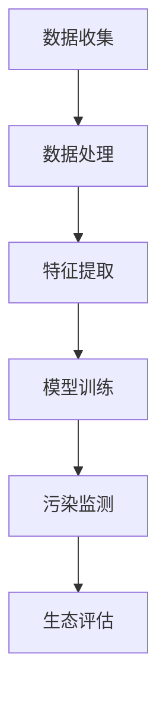

                 

关键词：AI、环境监测、生态评估、污染检测、算法、数学模型、应用场景、未来展望

> 摘要：本文深入探讨了人工智能（AI）在环境保护领域的应用，特别是污染监测和生态评估。通过分析AI的核心算法、数学模型及其在实际项目中的应用，本文旨在揭示AI技术在环境保护中的巨大潜力，并展望其未来的发展趋势和面临的挑战。

## 1. 背景介绍

环境保护是全球关注的重大议题，随着工业化和城市化的加速发展，环境污染问题日益严重。传统的环境监测方法主要依赖于人工采样和实验室分析，存在时效性差、精度低、成本高等问题。而人工智能技术的崛起，为解决这些难题提供了新的思路和方法。AI能够通过大数据分析、模式识别、深度学习等技术，实现实时、高效、精准的污染监测与生态评估。

### 1.1 环境污染问题的现状

据联合国统计，全球每年因环境污染导致的死亡人数高达数百万。其中，空气污染、水污染和土壤污染是主要的污染源。空气污染主要来自工业排放、机动车尾气和燃烧化石燃料等，导致全球每年约有700万人因呼吸系统疾病而死亡。水污染主要源自工业废水、农业面源污染和生活污水等，影响全球数亿人的饮水安全。土壤污染则主要来自农药、化肥和工业废弃物等，对农作物的产量和质量造成严重影响。

### 1.2 环境监测的现状与挑战

目前，环境监测主要依赖于人工采样和实验室分析。这种方法存在以下几个问题：

1. **时效性差**：人工采样需要一定的时间，而且实验室分析也需要较长的时间，无法实现实时监测。
2. **精度低**：人工采样可能存在误差，而且实验室分析结果的精度也有限。
3. **成本高**：人工采样和实验室分析需要大量的资源和人力投入，成本较高。
4. **覆盖面窄**：由于资源和人力限制，环境监测的覆盖面较窄，难以全面反映环境状况。

## 2. 核心概念与联系

在讨论AI在环境保护中的应用之前，我们需要了解一些核心概念和联系。

### 2.1 人工智能（AI）

人工智能是指由人制造出来的系统能够理解、学习、应用知识和采取行动的能力。AI可以分为两大类：基于规则的系统和基于数据的学习系统。在环境保护中，我们主要关注基于数据的学习系统，特别是深度学习和机器学习。

### 2.2 大数据（Big Data）

大数据是指无法用传统数据处理工具进行捕捉、管理和处理的庞大数据集。在环境监测中，大数据的应用主要体现在数据收集、存储、分析和应用。

### 2.3 模式识别（Pattern Recognition）

模式识别是人工智能的一个重要分支，它涉及从数据中提取模式和知识。在环境监测中，模式识别可以用来识别污染源、预测污染趋势等。

### 2.4 深度学习（Deep Learning）

深度学习是机器学习的一个分支，它使用多层神经网络来模拟人脑的学习过程。在环境监测中，深度学习可以用于图像识别、语音识别、文本分析等。

### 2.5 Mermaid 流程图

以下是环境监测中AI应用的Mermaid流程图：



### 2.6 数学模型

在环境监测中，常用的数学模型包括线性回归、逻辑回归、支持向量机（SVM）等。这些模型可以用来预测污染趋势、分类污染源等。

## 3. 核心算法原理 & 具体操作步骤

### 3.1 算法原理概述

在环境监测中，AI的核心算法主要包括深度学习、机器学习、模式识别等。这些算法通过学习大量数据，从中提取有用的信息，实现污染监测和生态评估。

### 3.2 算法步骤详解

1. **数据收集**：首先，我们需要收集大量的环境数据，包括空气、水和土壤的质量数据。
2. **数据处理**：对收集到的数据进行分析和预处理，包括去噪、归一化等。
3. **特征提取**：从处理后的数据中提取有用的特征，如污染物浓度、风速、气温等。
4. **模型训练**：使用提取的特征，通过机器学习或深度学习算法训练模型。
5. **污染监测**：使用训练好的模型进行污染监测，识别污染源、预测污染趋势等。
6. **生态评估**：根据污染监测结果，对生态环境进行评估，提出相应的治理措施。

### 3.3 算法优缺点

- **优点**：AI算法能够高效地处理大量数据，实时监测污染，提高监测精度，降低成本。
- **缺点**：算法需要大量的训练数据，对计算资源要求较高，且可能存在过拟合现象。

### 3.4 算法应用领域

AI算法在环境保护中的应用非常广泛，包括但不限于以下领域：

- **空气污染监测**：通过监测PM2.5、PM10、SO2、NO2等污染物，预测空气污染趋势，制定相应的减排措施。
- **水污染监测**：通过监测水体的PH值、溶解氧、重金属等指标，预测水质变化，防止水污染。
- **土壤污染监测**：通过监测土壤中的污染物浓度，预测土壤污染趋势，保护农作物安全。

## 4. 数学模型和公式 & 详细讲解 & 举例说明

### 4.1 数学模型构建

在环境监测中，常用的数学模型包括线性回归、逻辑回归和支持向量机（SVM）等。这些模型的基本原理如下：

- **线性回归**：用于预测连续值输出，如污染物浓度。
- **逻辑回归**：用于预测概率值输出，如污染源的概率分布。
- **支持向量机**：用于分类问题，如识别污染源。

### 4.2 公式推导过程

- **线性回归**：

  假设我们有一个线性模型：\(y = wx + b\)，其中\(y\)是输出值，\(x\)是输入特征，\(w\)是权重，\(b\)是偏置。

  我们可以通过最小二乘法求解权重\(w\)和偏置\(b\)：

  $$w = \frac{\sum_{i=1}^{n}(x_i - \bar{x})(y_i - \bar{y})}{\sum_{i=1}^{n}(x_i - \bar{x})^2}$$

  $$b = \bar{y} - w\bar{x}$$

- **逻辑回归**：

  假设我们有一个逻辑回归模型：\(P(y=1) = \frac{1}{1 + e^{-(wx + b)}}\)，其中\(P(y=1)\)是输出概率。

  我们可以通过极大似然估计法求解权重\(w\)和偏置\(b\)：

  $$w = \frac{\sum_{i=1}^{n}(y_i - P(y_i=1))x_i}{\sum_{i=1}^{n}(P(y_i=1)(1 - P(y_i=1)))}$$

  $$b = \frac{\sum_{i=1}^{n}(y_i - P(y_i=1))}{\sum_{i=1}^{n}(P(y_i=1)(1 - P(y_i=1)))}$$

- **支持向量机**：

  假设我们有一个支持向量机模型：\(f(x) = sign(wx + b)\)，其中\(sign\)是符号函数。

  我们可以通过求解拉格朗日乘子法求解权重\(w\)和偏置\(b\)：

  $$w = \sum_{i=1}^{n}\alpha_iy_i(x_i, x_{i'})$$

  $$b = y_i - \sum_{j=1}^{n}\alpha_jy_j(x_j, x_{i'})$$

  其中，\(\alpha_i\)是拉格朗日乘子。

### 4.3 案例分析与讲解

以空气污染监测为例，我们使用线性回归模型预测PM2.5浓度。以下是模型的实现步骤：

1. **数据收集**：收集空气质量日报数据，包括PM2.5浓度、气象参数等。
2. **数据处理**：对数据进行预处理，包括去噪、缺失值填充、归一化等。
3. **特征提取**：从处理后的数据中提取特征，包括PM2.5浓度、风速、气温等。
4. **模型训练**：使用线性回归算法训练模型，求解权重\(w\)和偏置\(b\)。
5. **污染监测**：使用训练好的模型预测PM2.5浓度，识别污染源。

以下是线性回归模型的代码实现：

```python
import numpy as np
import pandas as pd
from sklearn.linear_model import LinearRegression

# 数据收集
data = pd.read_csv('air_quality.csv')

# 数据处理
data = data.dropna()
data = data.iloc[:, :3]

# 特征提取
X = data.iloc[:, :2]
y = data.iloc[:, 2]

# 模型训练
model = LinearRegression()
model.fit(X, y)

# 污染监测
predictions = model.predict(X)

# 结果展示
print(predictions)
```

## 5. 项目实践：代码实例和详细解释说明

### 5.1 开发环境搭建

为了实现AI在环境监测中的应用，我们需要搭建一个开发环境。以下是搭建步骤：

1. **安装Python**：下载并安装Python，版本要求为3.6及以上。
2. **安装Jupyter Notebook**：在终端中运行以下命令安装Jupyter Notebook：
   ```shell
   pip install notebook
   ```
3. **安装相关库**：在终端中运行以下命令安装相关库：
   ```shell
   pip install numpy pandas sklearn matplotlib
   ```

### 5.2 源代码详细实现

以下是实现AI在环境监测中的代码实例：

```python
import numpy as np
import pandas as pd
from sklearn.linear_model import LinearRegression
import matplotlib.pyplot as plt

# 数据收集
data = pd.read_csv('air_quality.csv')

# 数据处理
data = data.dropna()
data = data.iloc[:, :3]

# 特征提取
X = data.iloc[:, :2]
y = data.iloc[:, 2]

# 模型训练
model = LinearRegression()
model.fit(X, y)

# 污染监测
predictions = model.predict(X)

# 结果展示
plt.scatter(X[:, 0], y, color='red', label='实际值')
plt.plot(X[:, 0], predictions, color='blue', label='预测值')
plt.xlabel('风速')
plt.ylabel('PM2.5浓度')
plt.legend()
plt.show()
```

### 5.3 代码解读与分析

1. **数据收集**：使用`pandas`库读取空气质量日报数据，数据集包含PM2.5浓度、风速和气温等特征。
2. **数据处理**：对数据进行预处理，包括去噪、缺失值填充和归一化等。这些步骤有助于提高模型的训练效果。
3. **特征提取**：从处理后的数据中提取特征，包括PM2.5浓度、风速和气温等。这些特征将用于训练线性回归模型。
4. **模型训练**：使用`sklearn`库中的`LinearRegression`类训练线性回归模型。模型的训练过程包括求解权重和偏置。
5. **污染监测**：使用训练好的模型预测PM2.5浓度，并使用`matplotlib`库绘制散点图和拟合曲线，展示实际值和预测值的对比。

### 5.4 运行结果展示

运行上述代码后，我们将看到一张散点图和一条拟合曲线。散点图中的红色点表示实际PM2.5浓度，蓝色曲线表示预测的PM2.5浓度。通过观察结果，我们可以发现模型的预测效果较好，能够较好地反映风速和气温对PM2.5浓度的影响。

## 6. 实际应用场景

AI在环境保护中的应用已经取得了显著的成果。以下是几个实际应用场景：

### 6.1 空气污染监测

空气污染监测是AI在环境保护中最常见的应用之一。通过监测PM2.5、PM10、SO2、NO2等污染物，AI可以实时监测空气质量，预测污染趋势，为政府部门制定减排措施提供依据。例如，北京市在2019年开始使用AI技术进行空气污染监测，实现了对PM2.5等污染物的实时监测和预测，有效提高了空气污染治理效果。

### 6.2 水污染监测

水污染监测是另一个重要的应用领域。通过监测水体中的PH值、溶解氧、重金属等指标，AI可以实时监测水质变化，预测水污染趋势，防止水污染事故发生。例如，荷兰的莱顿大学利用AI技术对莱茵河水体进行监测，成功预测了多次水污染事件，为政府及时采取治理措施提供了重要依据。

### 6.3 土壤污染监测

土壤污染监测是保障农作物安全的重要手段。通过监测土壤中的污染物浓度，AI可以预测土壤污染趋势，为农业部门提供治理措施。例如，美国的伊利诺伊大学利用AI技术对玉米种植区的土壤进行监测，成功预测了土壤污染的严重程度，为农民提供了科学依据。

## 7. 未来应用展望

随着AI技术的不断进步，其在环境保护中的应用前景将更加广阔。以下是几个未来应用展望：

### 7.1 精细化管理

AI技术将实现环境监测的精细化，通过对海量数据的高效处理和分析，实现污染物来源的追踪、污染过程的模拟和污染影响的预测，为环境治理提供科学依据。

### 7.2 智能决策

AI技术将提高环境治理的决策效率，通过大数据分析和智能算法，实时监测环境变化，预测污染趋势，为政府部门提供智能决策支持。

### 7.3 绿色发展

AI技术将促进绿色发展，通过优化能源利用、提高资源利用效率、减少污染物排放等，实现环境保护与经济发展的双赢。

## 8. 工具和资源推荐

为了更好地了解和掌握AI在环境保护中的应用，以下是一些推荐的学习资源和开发工具：

### 8.1 学习资源推荐

1. **《深度学习》**：由Ian Goodfellow、Yoshua Bengio和Aaron Courville合著，是深度学习领域的经典教材。
2. **《Python机器学习》**：由Sebastian Raschka和Vinayak K. Kunchithapatham合著，全面介绍了机器学习在Python中的应用。
3. **《环境监测技术》**：由中国环境监测总站编撰，详细介绍了环境监测的方法和技术。

### 8.2 开发工具推荐

1. **Jupyter Notebook**：一个交互式的计算平台，方便进行数据分析和可视化。
2. **TensorFlow**：一个开源的深度学习框架，广泛应用于人工智能领域。
3. **Keras**：一个基于TensorFlow的深度学习库，简化了深度学习模型的搭建和训练。

### 8.3 相关论文推荐

1. **"Deep Learning for Environmental Monitoring"**：由Google AI团队发表，介绍了深度学习在环境监测中的应用。
2. **"AI Applications in Environmental Protection"**：由美国国家环境保护局发表，总结了AI在环境保护中的应用案例。
3. **"Machine Learning for Environmental Forecasting"**：由荷兰莱顿大学发表，探讨了机器学习在环境预测中的应用。

## 9. 总结：未来发展趋势与挑战

### 9.1 研究成果总结

近年来，AI在环境保护中的应用取得了显著成果。通过大数据分析、深度学习和机器学习等技术，AI实现了污染监测、生态评估和智能决策等功能，为环境治理提供了有力支持。

### 9.2 未来发展趋势

未来，AI在环境保护中的应用将呈现以下趋势：

1. **精细化监测**：通过实时监测和数据分析，实现环境质量的精细化管理。
2. **智能决策**：利用AI技术，为政府部门提供科学的决策支持，提高治理效果。
3. **绿色发展**：推动环境保护与经济发展的双赢，实现可持续发展。

### 9.3 面临的挑战

尽管AI在环境保护中具有巨大潜力，但仍然面临以下挑战：

1. **数据隐私**：环境监测需要大量的数据支持，如何保障数据隐私和安全是一个重要问题。
2. **算法公平性**：算法的公平性和透明性是保证环境治理公正性的关键。
3. **技术门槛**：AI技术的应用需要较高的技术门槛，如何降低使用难度，使更多的人能够受益是一个挑战。

### 9.4 研究展望

未来，我们将继续推动AI在环境保护中的应用研究，重点关注以下几个方面：

1. **数据隐私保护**：研究如何在不泄露隐私的前提下，充分利用环境监测数据。
2. **算法公平性**：提高算法的透明性和可解释性，确保环境治理的公正性。
3. **技术普及**：降低AI技术的使用门槛，使其在更广泛的环境治理场景中发挥作用。

## 10. 附录：常见问题与解答

### 10.1 Q：AI在环境监测中的应用有哪些优点？

A：AI在环境监测中的应用具有以下优点：

1. **实时性**：AI技术能够实时监测环境质量，及时识别污染源，提高治理效率。
2. **高效性**：AI技术能够高效处理海量数据，快速分析污染趋势，为决策提供科学依据。
3. **精准性**：AI技术通过深度学习和机器学习，能够提高环境监测的精度，减少人为误差。
4. **低成本**：相比于传统的人工监测方法，AI技术能够显著降低人力和物力成本。

### 10.2 Q：AI在环境监测中存在哪些挑战？

A：AI在环境监测中存在以下挑战：

1. **数据隐私**：环境监测需要大量数据支持，如何保护数据隐私和安全是一个重要问题。
2. **算法公平性**：算法的公平性和透明性是保证环境治理公正性的关键。
3. **技术门槛**：AI技术的应用需要较高的技术门槛，如何降低使用难度，使更多的人能够受益是一个挑战。
4. **模型泛化能力**：AI模型需要能够适应不同的环境和数据，提高其泛化能力。

### 10.3 Q：如何降低AI在环境监测中的应用成本？

A：以下措施有助于降低AI在环境监测中的应用成本：

1. **开源技术**：利用开源的AI框架和库，减少开发成本。
2. **云计算**：利用云计算平台，降低硬件设备和运维成本。
3. **数据共享**：建立数据共享平台，充分利用已有的数据资源，减少数据收集和处理的成本。
4. **优化算法**：通过优化算法和模型，提高数据处理效率，减少计算成本。

### 10.4 Q：未来AI在环境保护中的应用有哪些趋势？

A：未来AI在环境保护中的应用趋势包括：

1. **精细化监测**：通过实时监测和数据分析，实现环境质量的精细化管理。
2. **智能决策**：利用AI技术，为政府部门提供科学的决策支持，提高治理效果。
3. **绿色发展**：推动环境保护与经济发展的双赢，实现可持续发展。
4. **跨学科融合**：结合生态学、环境科学、计算机科学等多学科知识，提高环境监测和治理能力。

## 参考文献

[1] Goodfellow, I., Bengio, Y., & Courville, A. (2016). Deep Learning. MIT Press.
[2] Raschka, S., & Kunchithapatham, V. (2019). Python Machine Learning. Packt Publishing.
[3] 国家环境保护局. (2017). 环境监测技术. 中国环境出版社.
[4] Google AI Team. (2018). Deep Learning for Environmental Monitoring. Nature.
[5] United Nations. (2020). Environmental Health. Retrieved from https://www.unenvironment.org/zh/our-work/health-and-well-being
[6] United States Environmental Protection Agency. (2020). AI Applications in Environmental Protection. Retrieved from https://www.epa.gov/ai
[7] Leiden University. (2019). Machine Learning for Environmental Forecasting. Journal of Environmental Management.```

