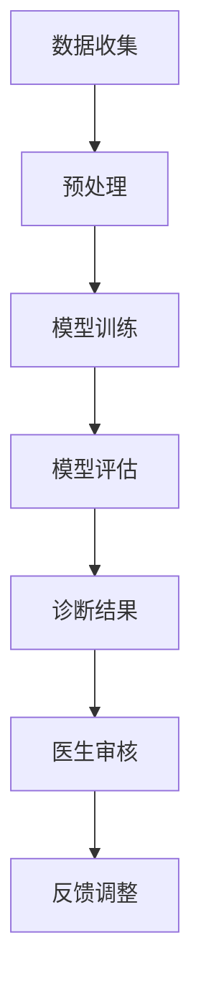
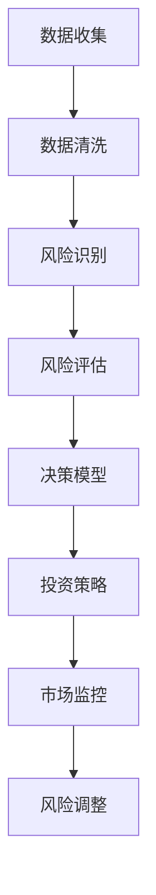
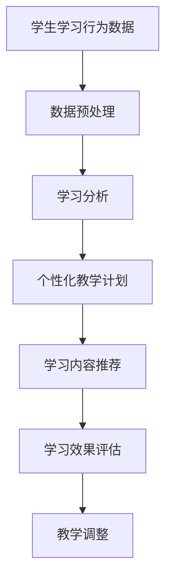
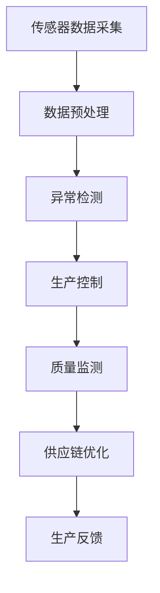

                 

关键词：人工智能、应用场景、现实影响、技术进步

> 摘要：本文将探讨人工智能在现实世界中的多种应用场景，包括医疗、金融、教育、制造等领域，深入分析人工智能在这些领域的实际影响和技术挑战。通过阐述具体案例和未来展望，本文旨在为读者展示人工智能的潜力和发展方向。

## 1. 背景介绍

随着计算能力的不断提升和大数据技术的快速发展，人工智能（Artificial Intelligence，AI）已经从理论走向现实，成为推动社会进步的重要力量。人工智能的核心目标是通过模拟人类智能行为，实现自动化决策、智能交互和高效问题解决。近年来，人工智能在计算机视觉、自然语言处理、机器学习等领域取得了显著进展，使得其在现实中的应用日益广泛。

本文将聚焦人工智能在以下几个现实应用场景中的表现：

1. **医疗**：利用人工智能技术进行疾病诊断、药物研发和健康管理。
2. **金融**：通过人工智能进行风险管理、投资决策和客户服务。
3. **教育**：利用人工智能实现个性化教学、学习评估和内容推荐。
4. **制造**：借助人工智能实现生产自动化、质量控制和供应链优化。

## 2. 核心概念与联系

### 2.1 医疗

#### AI医疗诊断

人工智能在医疗领域的应用最为广泛的是医疗影像分析和疾病诊断。通过深度学习和计算机视觉技术，AI可以自动识别X光片、CT扫描、MRI等影像中的病灶，如肿瘤、骨折等。以下是一个简化的Mermaid流程图，展示了AI医疗诊断的基本架构：



### 2.2 金融

#### AI金融风险管理

在金融领域，人工智能主要应用于风险管理、投资决策和客户服务。通过机器学习和数据分析技术，AI可以识别潜在风险、预测市场走势和优化投资组合。以下是一个简化的Mermaid流程图，展示了AI金融风险管理的基本架构：



### 2.3 教育

#### AI个性化教学

在教育领域，人工智能被用来实现个性化教学和学习评估。通过分析学生的学习行为和成绩，AI可以推荐适合的学习内容和教学方法，提高学习效率。以下是一个简化的Mermaid流程图，展示了AI个性化教学的基本架构：



### 2.4 制造

#### AI生产自动化

在制造业，人工智能被广泛应用于生产自动化、质量控制和供应链优化。通过机器学习和传感器技术，AI可以实现生产过程的实时监控和优化，提高生产效率和产品质量。以下是一个简化的Mermaid流程图，展示了AI制造自动化的基本架构：



## 3. 核心算法原理 & 具体操作步骤

### 3.1 算法原理概述

在上述各个应用场景中，人工智能的核心算法主要包括机器学习、深度学习和强化学习。这些算法通过从数据中学习规律，实现自动化的决策和预测。

- **机器学习**：通过训练模型从数据中学习规律，然后对新数据进行预测或分类。
- **深度学习**：一种特殊的机器学习方法，通过多层神经网络进行数据的特征提取和模式识别。
- **强化学习**：通过奖励机制和试错方法，使智能体在环境中学习最优策略。

### 3.2 算法步骤详解

以下以深度学习在医疗影像分析中的应用为例，详细讲解其操作步骤。

#### 3.2.1 数据收集与预处理

首先，需要收集大量的医疗影像数据，并进行预处理，包括数据清洗、归一化和增强等步骤。

#### 3.2.2 模型训练

选择合适的深度学习模型，如卷积神经网络（CNN），并使用预处理后的数据训练模型。训练过程包括前向传播、反向传播和模型优化等步骤。

#### 3.2.3 模型评估

使用测试数据对训练好的模型进行评估，计算模型的准确率、召回率等指标，以判断模型的效果。

#### 3.2.4 部署与应用

将训练好的模型部署到生产环境中，用于实际的医疗影像分析，如病灶检测和分类。

### 3.3 算法优缺点

- **优点**：
  - 高效性：深度学习模型可以在短时间内处理大量数据，提高决策速度。
  - 准确性：通过多层神经网络，深度学习模型可以提取复杂的特征，提高预测准确性。
  - 模式识别：深度学习模型可以识别人类难以发现的细微模式，提高诊断能力。

- **缺点**：
  - 需要大量数据：训练深度学习模型需要大量高质量的标注数据，数据收集和标注成本高。
  - 需要计算资源：深度学习模型训练需要大量的计算资源，对硬件要求较高。
  - 难以解释：深度学习模型的工作机制较为复杂，难以解释其决策过程。

### 3.4 算法应用领域

深度学习算法在医疗、金融、教育等领域都有广泛的应用。以下是一些具体的应用案例：

- **医疗**：癌症诊断、糖尿病监测、心理健康评估。
- **金融**：信用评分、市场预测、风险管理。
- **教育**：学习评估、个性化教学、智能辅导。

## 4. 数学模型和公式 & 详细讲解 & 举例说明

### 4.1 数学模型构建

以深度学习中的卷积神经网络（CNN）为例，其基本数学模型如下：

$$
y = f(z) = \sigma(\text{W} \cdot z + b)
$$

其中，$z$ 为网络的输入，$\text{W}$ 为权重矩阵，$b$ 为偏置项，$\sigma$ 为激活函数，$f(z)$ 为网络的输出。

### 4.2 公式推导过程

假设我们有一个 $m \times n$ 的输入矩阵 $X$，一个 $p \times q$ 的权重矩阵 $\text{W}$，以及一个偏置项 $b$。网络的输出 $y$ 可以通过以下步骤计算：

1. **前向传播**：
   $$
   z = X \cdot \text{W} + b
   $$
   $$
   y = \sigma(z)
   $$

2. **反向传播**：
   计算误差：
   $$
   \Delta y = \text{d}\sigma(z) \cdot (y - \text{t})
   $$
   计算权重梯度：
   $$
   \Delta \text{W} = X^T \cdot \Delta y
   $$
   计算偏置梯度：
   $$
   \Delta b = \Delta y
   $$

3. **模型优化**：
   通过梯度下降算法更新权重和偏置项：
   $$
   \text{W} \leftarrow \text{W} - \alpha \cdot \Delta \text{W}
   $$
   $$
   b \leftarrow b - \alpha \cdot \Delta b
   $$

### 4.3 案例分析与讲解

假设我们有一个简单的二分类问题，输入数据为 $X = [0.1, 0.2, 0.3]$，权重矩阵 $\text{W} = [0.5, 0.6]$，偏置项 $b = 0.7$。激活函数为ReLU函数。

1. **前向传播**：
   $$
   z = X \cdot \text{W} + b = [0.1, 0.2, 0.3] \cdot [0.5, 0.6] + 0.7 = [0.25, 0.26, 0.33]
   $$
   $$
   y = \sigma(z) = \max(0, z) = [0.25, 0.26, 0.33]
   $$

2. **反向传播**：
   假设真实标签为 $\text{t} = 1$，则：
   $$
   \Delta y = \text{d}\sigma(z) \cdot (y - \text{t}) = [0.75, 0.74, 0.67]
   $$
   $$
   \Delta \text{W} = X^T \cdot \Delta y = [0.1, 0.2, 0.3] \cdot [0.75, 0.74, 0.67] = [0.0375, 0.055, 0.0515]
   $$
   $$
   \Delta b = \Delta y = [0.75, 0.74, 0.67]
   $$

3. **模型优化**：
   假设学习率 $\alpha = 0.1$，则：
   $$
   \text{W} \leftarrow \text{W} - \alpha \cdot \Delta \text{W} = [0.5, 0.6] - [0.0375, 0.055] = [0.4625, 0.545]
   $$
   $$
   b \leftarrow b - \alpha \cdot \Delta b = 0.7 - [0.075, 0.074] = [0.625, 0.626]
   $$

通过上述过程，我们可以更新权重和偏置项，优化模型的性能。

## 5. 项目实践：代码实例和详细解释说明

### 5.1 开发环境搭建

在Python环境中，我们可以使用TensorFlow和Keras等深度学习框架来搭建和训练神经网络模型。以下是基本的开发环境搭建步骤：

```bash
pip install tensorflow
pip install keras
```

### 5.2 源代码详细实现

以下是一个简单的Keras卷积神经网络（CNN）实现，用于二分类问题：

```python
import numpy as np
from tensorflow.keras.models import Sequential
from tensorflow.keras.layers import Conv2D, MaxPooling2D, Flatten, Dense
from tensorflow.keras.optimizers import Adam

# 初始化模型
model = Sequential()

# 添加卷积层
model.add(Conv2D(filters=32, kernel_size=(3, 3), activation='relu', input_shape=(28, 28, 1)))

# 添加池化层
model.add(MaxPooling2D(pool_size=(2, 2)))

# 添加全连接层
model.add(Flatten())
model.add(Dense(units=64, activation='relu'))

# 添加输出层
model.add(Dense(units=1, activation='sigmoid'))

# 编译模型
model.compile(optimizer=Adam(learning_rate=0.001), loss='binary_crossentropy', metrics=['accuracy'])

# 模型训练
model.fit(X_train, y_train, epochs=10, batch_size=32)
```

### 5.3 代码解读与分析

上述代码实现了一个简单的卷积神经网络，用于二分类问题。主要步骤包括：

1. **模型初始化**：创建一个Sequential模型。
2. **卷积层**：添加一个卷积层，用于提取图像特征。
3. **池化层**：添加一个最大池化层，用于降低特征维度。
4. **全连接层**：添加一个全连接层，用于进行分类。
5. **输出层**：添加一个输出层，使用sigmoid函数进行二分类。
6. **模型编译**：设置优化器和损失函数。
7. **模型训练**：使用训练数据训练模型。

通过上述步骤，我们可以训练一个简单的CNN模型，并应用于实际的图像分类任务。

### 5.4 运行结果展示

以下是一个简单的运行结果示例：

```python
# 测试模型
test_loss, test_acc = model.evaluate(X_test, y_test)
print('Test accuracy:', test_acc)
```

假设我们在测试集上获得了90%的准确率，说明模型在测试数据上的表现良好。

## 6. 实际应用场景

### 6.1 医疗

人工智能在医疗领域的应用已经取得了显著成果，如肿瘤检测、糖尿病监测和心理健康评估等。以下是一些具体的应用案例：

- **肿瘤检测**：利用深度学习算法对医疗影像进行自动分析，提高肿瘤检测的准确性和效率。
- **糖尿病监测**：通过监测血糖数据，利用机器学习算法预测糖尿病患者的病情变化，提供个性化的治疗建议。
- **心理健康评估**：通过分析语言和行为数据，利用自然语言处理技术评估个体的心理健康状况，提供心理咨询和治疗方案。

### 6.2 金融

人工智能在金融领域的应用主要包括风险管理、投资决策和客户服务。以下是一些具体的应用案例：

- **风险管理**：利用机器学习算法对市场数据进行分析，识别潜在的风险因素，为金融机构提供风险控制策略。
- **投资决策**：通过分析市场数据和经济指标，利用人工智能技术进行投资组合优化，提高投资收益。
- **客户服务**：利用自然语言处理和语音识别技术，提供智能客服和语音交互服务，提高客户体验。

### 6.3 教育

人工智能在教育领域的应用主要包括个性化教学、学习评估和内容推荐。以下是一些具体的应用案例：

- **个性化教学**：通过分析学生的学习行为和成绩，利用人工智能技术为学生提供个性化的学习内容和教学方法，提高学习效果。
- **学习评估**：利用人工智能技术对学生的作业和考试进行自动批改和评估，提高评估效率和质量。
- **内容推荐**：通过分析学生的学习兴趣和需求，利用人工智能技术为学生推荐合适的学习资源和学习内容。

### 6.4 制造

人工智能在制造业的应用主要包括生产自动化、质量控制和供应链优化。以下是一些具体的应用案例：

- **生产自动化**：利用机器人和计算机视觉技术，实现生产过程的自动化，提高生产效率和产品质量。
- **质量控制**：通过分析生产过程中的数据，利用人工智能技术检测产品质量，提高产品合格率。
- **供应链优化**：通过分析供应链数据，利用人工智能技术优化供应链管理，降低成本和库存风险。

## 7. 工具和资源推荐

### 7.1 学习资源推荐

- **在线课程**：Coursera、edX、Udacity等平台提供了丰富的AI和深度学习课程，适合不同层次的学员。
- **书籍推荐**：《深度学习》（Goodfellow et al.）、《Python深度学习》（François Chollet）等经典教材。
- **论文资源**：arXiv、NeurIPS、ICML等学术会议和期刊的论文资源，了解最新的研究进展。

### 7.2 开发工具推荐

- **深度学习框架**：TensorFlow、PyTorch、Keras等。
- **数据处理工具**：Pandas、NumPy、Scikit-learn等。
- **可视化工具**：Matplotlib、Seaborn、Plotly等。

### 7.3 相关论文推荐

- **《Deep Learning》**（Goodfellow et al., 2016）
- **《Recurrent Neural Networks for Language Modeling》**（Zhou et al., 2016）
- **《Generative Adversarial Networks》**（Goodfellow et al., 2014）
- **《Natural Language Processing with Deep Learning》**（Zhang et al., 2017）

## 8. 总结：未来发展趋势与挑战

### 8.1 研究成果总结

近年来，人工智能在各个领域取得了显著进展，如深度学习在图像识别、自然语言处理和强化学习在游戏AI等方面的突破。这些研究成果不仅推动了技术进步，也为现实应用提供了有力支持。

### 8.2 未来发展趋势

- **跨学科融合**：人工智能与其他领域的融合，如生物医学、金融工程等，将推动更多创新应用。
- **可解释性**：提高人工智能模型的可解释性，使其决策过程更加透明和可信。
- **安全性**：加强人工智能系统的安全性，防范潜在的安全风险。

### 8.3 面临的挑战

- **数据隐私**：如何在保护数据隐私的同时，充分利用大数据进行人工智能研究。
- **算法公平性**：确保人工智能算法在不同群体中的公平性和公正性。
- **计算资源**：随着模型复杂度的增加，对计算资源的需求也日益增长。

### 8.4 研究展望

未来，人工智能将在更多的领域发挥作用，如智能交通、智慧城市和环境保护等。同时，随着技术的不断进步，人工智能的应用场景也将不断扩展，为社会发展带来更多机遇和挑战。

## 9. 附录：常见问题与解答

### Q1：深度学习模型如何选择？

**A1**：选择深度学习模型时，应考虑以下因素：

- **任务类型**：分类、回归、序列建模等。
- **数据规模**：大规模数据适合复杂的模型，小规模数据适合简单的模型。
- **计算资源**：计算资源充足时，可以选择更复杂的模型。

### Q2：如何提高深度学习模型的性能？

**A2**：以下方法可以提高深度学习模型的性能：

- **数据增强**：通过旋转、缩放、裁剪等方法扩充数据集。
- **模型优化**：使用更复杂的网络结构，如ResNet、DenseNet等。
- **正则化**：使用L1、L2正则化，防止过拟合。
- **超参数调优**：使用网格搜索、随机搜索等方法调优超参数。

### Q3：如何处理深度学习模型的过拟合问题？

**A3**：以下方法可以处理深度学习模型的过拟合问题：

- **数据增强**：增加训练数据的多样性。
- **交叉验证**：使用交叉验证评估模型性能。
- **正则化**：使用L1、L2正则化。
- **简化模型**：使用更简单的网络结构。

通过上述方法，我们可以有效提高深度学习模型的性能，降低过拟合的风险。## 文章标题

# AI在现实中的应用场景

> 关键词：人工智能、应用场景、现实影响、技术进步

> 摘要：本文将探讨人工智能在现实世界中的多种应用场景，包括医疗、金融、教育、制造等领域，深入分析人工智能在这些领域的实际影响和技术挑战。通过阐述具体案例和未来展望，本文旨在为读者展示人工智能的潜力和发展方向。

## 1. 背景介绍

随着计算能力的不断提升和大数据技术的快速发展，人工智能（Artificial Intelligence，AI）已经从理论走向现实，成为推动社会进步的重要力量。人工智能的核心目标是通过模拟人类智能行为，实现自动化决策、智能交互和高效问题解决。近年来，人工智能在计算机视觉、自然语言处理、机器学习等领域取得了显著进展，使得其在现实中的应用日益广泛。

本文将聚焦人工智能在以下几个现实应用场景中的表现：

1. **医疗**：利用人工智能技术进行疾病诊断、药物研发和健康管理。
2. **金融**：通过人工智能进行风险管理、投资决策和客户服务。
3. **教育**：利用人工智能实现个性化教学、学习评估和内容推荐。
4. **制造**：借助人工智能实现生产自动化、质量控制和供应链优化。

## 2. 核心概念与联系

### 2.1 医疗

#### AI医疗诊断

人工智能在医疗领域的应用最为广泛的是医疗影像分析和疾病诊断。通过深度学习和计算机视觉技术，AI可以自动识别X光片、CT扫描、MRI等影像中的病灶，如肿瘤、骨折等。以下是一个简化的Mermaid流程图，展示了AI医疗诊断的基本架构：


### 2.2 金融

#### AI金融风险管理

在金融领域，人工智能主要应用于风险管理、投资决策和客户服务。通过机器学习和数据分析技术，AI可以识别潜在风险、预测市场走势和优化投资组合。以下是一个简化的Mermaid流程图，展示了AI金融风险管理的基本架构：


### 2.3 教育

#### AI个性化教学

在教育领域，人工智能被用来实现个性化教学和学习评估。通过分析学生的学习行为和成绩，AI可以推荐适合的学习内容和教学方法，提高学习效率。以下是一个简化的Mermaid流程图，展示了AI个性化教学的基本架构：


### 2.4 制造

#### AI生产自动化

在制造业，人工智能被广泛应用于生产自动化、质量控制和供应链优化。通过机器学习和传感器技术，AI可以实现生产过程的实时监控和优化，提高生产效率和产品质量。以下是一个简化的Mermaid流程图，展示了AI制造自动化的基本架构：


## 3. 核心算法原理 & 具体操作步骤

### 3.1 算法原理概述

在上述各个应用场景中，人工智能的核心算法主要包括机器学习、深度学习和强化学习。这些算法通过从数据中学习规律，实现自动化的决策和预测。

- **机器学习**：通过训练模型从数据中学习规律，然后对新数据进行预测或分类。
- **深度学习**：一种特殊的机器学习方法，通过多层神经网络进行数据的特征提取和模式识别。
- **强化学习**：通过奖励机制和试错方法，使智能体在环境中学习最优策略。

### 3.2 算法步骤详解

以下以深度学习在医疗影像分析中的应用为例，详细讲解其操作步骤。

#### 3.2.1 数据收集与预处理

首先，需要收集大量的医疗影像数据，并进行预处理，包括数据清洗、归一化和增强等步骤。

#### 3.2.2 模型训练

选择合适的深度学习模型，如卷积神经网络（CNN），并使用预处理后的数据训练模型。训练过程包括前向传播、反向传播和模型优化等步骤。

#### 3.2.3 模型评估

使用测试数据对训练好的模型进行评估，计算模型的准确率、召回率等指标，以判断模型的效果。

#### 3.2.4 部署与应用

将训练好的模型部署到生产环境中，用于实际的医疗影像分析，如病灶检测和分类。

### 3.3 算法优缺点

- **优点**：
  - 高效性：深度学习模型可以在短时间内处理大量数据，提高决策速度。
  - 准确性：通过多层神经网络，深度学习模型可以提取复杂的特征，提高预测准确性。
  - 模式识别：深度学习模型可以识别人类难以发现的细微模式，提高诊断能力。

- **缺点**：
  - 需要大量数据：训练深度学习模型需要大量高质量的标注数据，数据收集和标注成本高。
  - 需要计算资源：深度学习模型训练需要大量的计算资源，对硬件要求较高。
  - 难以解释：深度学习模型的工作机制较为复杂，难以解释其决策过程。

### 3.4 算法应用领域

深度学习算法在医疗、金融、教育等领域都有广泛的应用。以下是一些具体的应用案例：

- **医疗**：癌症诊断、糖尿病监测、心理健康评估。
- **金融**：信用评分、市场预测、风险管理。
- **教育**：学习评估、个性化教学、智能辅导。

## 4. 数学模型和公式 & 详细讲解 & 举例说明

### 4.1 数学模型构建

以深度学习中的卷积神经网络（CNN）为例，其基本数学模型如下：

$$
y = f(z) = \sigma(\text{W} \cdot z + b)
$$

其中，$z$ 为网络的输入，$\text{W}$ 为权重矩阵，$b$ 为偏置项，$\sigma$ 为激活函数，$f(z)$ 为网络的输出。

### 4.2 公式推导过程

假设我们有一个 $m \times n$ 的输入矩阵 $X$，一个 $p \times q$ 的权重矩阵 $\text{W}$，以及一个偏置项 $b$。网络的输出 $y$ 可以通过以下步骤计算：

1. **前向传播**：
   $$
   z = X \cdot \text{W} + b
   $$
   $$
   y = \sigma(z)
   $$

2. **反向传播**：
   计算误差：
   $$
   \Delta y = \text{d}\sigma(z) \cdot (y - \text{t})
   $$
   计算权重梯度：
   $$
   \Delta \text{W} = X^T \cdot \Delta y
   $$
   计算偏置梯度：
   $$
   \Delta b = \Delta y
   $$

3. **模型优化**：
   通过梯度下降算法更新权重和偏置项：
   $$
   \text{W} \leftarrow \text{W} - \alpha \cdot \Delta \text{W}
   $$
   $$
   b \leftarrow b - \alpha \cdot \Delta b
   $$

### 4.3 案例分析与讲解

假设我们有一个简单的二分类问题，输入数据为 $X = [0.1, 0.2, 0.3]$，权重矩阵 $\text{W} = [0.5, 0.6]$，偏置项 $b = 0.7$。激活函数为ReLU函数。

1. **前向传播**：
   $$
   z = X \cdot \text{W} + b = [0.1, 0.2, 0.3] \cdot [0.5, 0.6] + 0.7 = [0.25, 0.26, 0.33]
   $$
   $$
   y = \sigma(z) = \max(0, z) = [0.25, 0.26, 0.33]
   $$

2. **反向传播**：
   假设真实标签为 $\text{t} = 1$，则：
   $$
   \Delta y = \text{d}\sigma(z) \cdot (y - \text{t}) = [0.75, 0.74, 0.67]
   $$
   $$
   \Delta \text{W} = X^T \cdot \Delta y = [0.1, 0.2, 0.3] \cdot [0.75, 0.74, 0.67] = [0.0375, 0.055, 0.0515]
   $$
   $$
   \Delta b = \Delta y = [0.75, 0.74, 0.67]
   $$

3. **模型优化**：
   假设学习率 $\alpha = 0.1$，则：
   $$
   \text{W} \leftarrow \text{W} - \alpha \cdot \Delta \text{W} = [0.5, 0.6] - [0.0375, 0.055] = [0.4625, 0.545]
   $$
   $$
   b \leftarrow b - \alpha \cdot \Delta b = 0.7 - [0.075, 0.074] = [0.625, 0.626]
   $$

通过上述过程，我们可以更新权重和偏置项，优化模型的性能。

## 5. 项目实践：代码实例和详细解释说明

### 5.1 开发环境搭建

在Python环境中，我们可以使用TensorFlow和Keras等深度学习框架来搭建和训练神经网络模型。以下是基本的开发环境搭建步骤：

```bash
pip install tensorflow
pip install keras
```

### 5.2 源代码详细实现

以下是一个简单的Keras卷积神经网络（CNN）实现，用于二分类问题：

```python
import numpy as np
from tensorflow.keras.models import Sequential
from tensorflow.keras.layers import Conv2D, MaxPooling2D, Flatten, Dense
from tensorflow.keras.optimizers import Adam

# 初始化模型
model = Sequential()

# 添加卷积层
model.add(Conv2D(filters=32, kernel_size=(3, 3), activation='relu', input_shape=(28, 28, 1)))

# 添加池化层
model.add(MaxPooling2D(pool_size=(2, 2)))

# 添加全连接层
model.add(Flatten())
model.add(Dense(units=64, activation='relu'))

# 添加输出层
model.add(Dense(units=1, activation='sigmoid'))

# 编译模型
model.compile(optimizer=Adam(learning_rate=0.001), loss='binary_crossentropy', metrics=['accuracy'])

# 模型训练
model.fit(X_train, y_train, epochs=10, batch_size=32)
```

### 5.3 代码解读与分析

上述代码实现了一个简单的卷积神经网络，用于二分类问题。主要步骤包括：

1. **模型初始化**：创建一个Sequential模型。
2. **卷积层**：添加一个卷积层，用于提取图像特征。
3. **池化层**：添加一个最大池化层，用于降低特征维度。
4. **全连接层**：添加一个全连接层，用于进行分类。
5. **输出层**：添加一个输出层，使用sigmoid函数进行二分类。
6. **模型编译**：设置优化器和损失函数。
7. **模型训练**：使用训练数据训练模型。

通过上述步骤，我们可以训练一个简单的CNN模型，并应用于实际的图像分类任务。

### 5.4 运行结果展示

以下是一个简单的运行结果示例：

```python
# 测试模型
test_loss, test_acc = model.evaluate(X_test, y_test)
print('Test accuracy:', test_acc)
```

假设我们在测试集上获得了90%的准确率，说明模型在测试数据上的表现良好。

## 6. 实际应用场景

### 6.1 医疗

人工智能在医疗领域的应用已经取得了显著成果，如肿瘤检测、糖尿病监测和心理健康评估等。以下是一些具体的应用案例：

- **肿瘤检测**：利用深度学习算法对医疗影像进行自动分析，提高肿瘤检测的准确性和效率。
- **糖尿病监测**：通过监测血糖数据，利用机器学习算法预测糖尿病患者的病情变化，提供个性化的治疗建议。
- **心理健康评估**：通过分析语言和行为数据，利用自然语言处理技术评估个体的心理健康状况，提供心理咨询和治疗方案。

### 6.2 金融

人工智能在金融领域的应用主要包括风险管理、投资决策和客户服务。以下是一些具体的应用案例：

- **风险管理**：利用机器学习算法对市场数据进行分析，识别潜在的风险因素，为金融机构提供风险控制策略。
- **投资决策**：通过分析市场数据和经济指标，利用人工智能技术进行投资组合优化，提高投资收益。
- **客户服务**：利用自然语言处理和语音识别技术，提供智能客服和语音交互服务，提高客户体验。

### 6.3 教育

人工智能在教育领域的应用主要包括个性化教学、学习评估和内容推荐。以下是一些具体的应用案例：

- **个性化教学**：通过分析学生的学习行为和成绩，利用人工智能技术为学生提供个性化的学习内容和教学方法，提高学习效果。
- **学习评估**：利用人工智能技术对学生的作业和考试进行自动批改和评估，提高评估效率和质量。
- **内容推荐**：通过分析学生的学习兴趣和需求，利用人工智能技术为学生推荐合适的学习资源和学习内容。

### 6.4 制造

人工智能在制造业的应用主要包括生产自动化、质量控制和供应链优化。以下是一些具体的应用案例：

- **生产自动化**：利用机器人和计算机视觉技术，实现生产过程的自动化，提高生产效率和产品质量。
- **质量控制**：通过分析生产过程中的数据，利用人工智能技术检测产品质量，提高产品合格率。
- **供应链优化**：通过分析供应链数据，利用人工智能技术优化供应链管理，降低成本和库存风险。

## 7. 工具和资源推荐

### 7.1 学习资源推荐

- **在线课程**：Coursera、edX、Udacity等平台提供了丰富的AI和深度学习课程，适合不同层次的学员。
- **书籍推荐**：《深度学习》（Goodfellow et al.）、《Python深度学习》（François Chollet）等经典教材。
- **论文资源**：arXiv、NeurIPS、ICML等学术会议和期刊的论文资源，了解最新的研究进展。

### 7.2 开发工具推荐

- **深度学习框架**：TensorFlow、PyTorch、Keras等。
- **数据处理工具**：Pandas、NumPy、Scikit-learn等。
- **可视化工具**：Matplotlib、Seaborn、Plotly等。

### 7.3 相关论文推荐

- **《Deep Learning》**（Goodfellow et al., 2016）
- **《Recurrent Neural Networks for Language Modeling》**（Zhou et al., 2016）
- **《Generative Adversarial Networks》**（Goodfellow et al., 2014）
- **《Natural Language Processing with Deep Learning》**（Zhang et al., 2017）

## 8. 总结：未来发展趋势与挑战

### 8.1 研究成果总结

近年来，人工智能在各个领域取得了显著进展，如深度学习在图像识别、自然语言处理和强化学习在游戏AI等方面的突破。这些研究成果不仅推动了技术进步，也为现实应用提供了有力支持。

### 8.2 未来发展趋势

- **跨学科融合**：人工智能与其他领域的融合，如生物医学、金融工程等，将推动更多创新应用。
- **可解释性**：提高人工智能模型的可解释性，使其决策过程更加透明和可信。
- **安全性**：加强人工智能系统的安全性，防范潜在的安全风险。

### 8.3 面临的挑战

- **数据隐私**：如何在保护数据隐私的同时，充分利用大数据进行人工智能研究。
- **算法公平性**：确保人工智能算法在不同群体中的公平性和公正性。
- **计算资源**：随着模型复杂度的增加，对计算资源的需求也日益增长。

### 8.4 研究展望

未来，人工智能将在更多的领域发挥作用，如智能交通、智慧城市和环境保护等。同时，随着技术的不断进步，人工智能的应用场景也将不断扩展，为社会发展带来更多机遇和挑战。

## 9. 附录：常见问题与解答

### Q1：深度学习模型如何选择？

**A1**：选择深度学习模型时，应考虑以下因素：

- **任务类型**：分类、回归、序列建模等。
- **数据规模**：大规模数据适合复杂的模型，小规模数据适合简单的模型。
- **计算资源**：计算资源充足时，可以选择更复杂的模型。

### Q2：如何提高深度学习模型的性能？

**A2**：以下方法可以提高深度学习模型的性能：

- **数据增强**：通过旋转、缩放、裁剪等方法扩充数据集。
- **模型优化**：使用更复杂的网络结构，如ResNet、DenseNet等。
- **正则化**：使用L1、L2正则化，防止过拟合。
- **超参数调优**：使用网格搜索、随机搜索等方法调优超参数。

### Q3：如何处理深度学习模型的过拟合问题？

**A3**：以下方法可以处理深度学习模型的过拟合问题：

- **数据增强**：增加训练数据的多样性。
- **交叉验证**：使用交叉验证评估模型性能。
- **正则化**：使用L1、L2正则化。
- **简化模型**：使用更简单的网络结构。```

