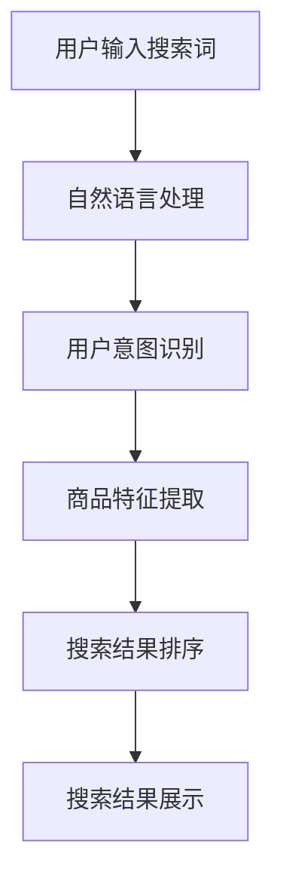

                 

关键词：人工智能，电商，搜索优化，推荐系统，自然语言处理，深度学习，算法，用户行为分析，个性化搜索

> 摘要：本文旨在探讨人工智能在电商搜索优化领域的应用，分析现有的搜索优化技术和算法，并提出未来发展趋势与挑战。通过对用户行为数据的深入分析，结合自然语言处理和深度学习技术，电商平台可以显著提高搜索结果的准确性和用户体验。

## 1. 背景介绍

随着互联网的迅猛发展，电子商务已经成为现代商业的重要组成部分。在电商领域，搜索优化技术是实现用户体验提升和业务增长的关键因素。传统的搜索引擎依赖于关键词匹配和简单排序算法，往往无法满足用户日益增长的需求。人工智能技术的发展，为电商搜索优化提供了新的解决方案。通过利用大数据、机器学习和深度学习等技术，AI可以更精准地理解用户意图，提供个性化搜索结果。

### 1.1 电商搜索的重要性

电商搜索功能是用户发现和购买商品的重要途径。一个高效的搜索系统能够减少用户搜索时间，提高购买转化率，进而提升销售额。此外，搜索优化还可以帮助电商平台吸引更多流量，增加用户粘性。

### 1.2 现有的搜索优化技术

目前，电商搜索优化主要依赖于以下几种技术：

- **关键词匹配**：根据用户输入的关键词，从数据库中检索最相关的商品。
- **相关性排序**：根据关键词匹配度和商品属性，对搜索结果进行排序。
- **用户行为分析**：通过用户的历史行为数据，预测用户可能感兴趣的商品。
- **推荐系统**：利用协同过滤、基于内容的推荐等技术，为用户推荐可能感兴趣的商品。

## 2. 核心概念与联系

### 2.1 关键概念

- **用户意图识别**：通过自然语言处理技术，分析用户输入的搜索词，理解其意图。
- **商品特征提取**：提取商品的关键特征，如价格、品牌、类别等。
- **搜索结果排序**：根据用户意图和商品特征，对搜索结果进行排序。

### 2.2 原理与架构

以下是一个简化的电商搜索优化架构图，用于说明核心概念之间的联系。



### 2.3 技术细节

- **自然语言处理（NLP）**：用于解析用户输入的搜索词，提取关键词和语义信息。
- **深度学习**：用于构建复杂的模型，如卷积神经网络（CNN）和循环神经网络（RNN），用于处理大规模数据和用户意图识别。
- **用户行为分析**：通过跟踪用户在电商平台上的行为，如浏览、购买、评论等，收集用户兴趣数据。

## 3. 核心算法原理 & 具体操作步骤

### 3.1 算法原理概述

电商搜索优化的核心算法主要包括：

- **用户意图识别算法**：利用NLP技术，通过分词、词性标注、实体识别等步骤，提取用户输入的搜索词中的关键信息。
- **商品特征提取算法**：通过数据挖掘技术，提取商品的关键特征，如价格、品牌、类别、评分等。
- **搜索结果排序算法**：结合用户意图和商品特征，使用机器学习算法，如协同过滤、基于内容的推荐等，对搜索结果进行排序。

### 3.2 算法步骤详解

#### 3.2.1 用户意图识别

1. **分词**：将用户输入的搜索词分解为单个词。
2. **词性标注**：对分词结果进行词性标注，如名词、动词、形容词等。
3. **实体识别**：识别搜索词中的实体，如商品名称、品牌等。
4. **意图解析**：根据实体和词性信息，推断用户意图。

#### 3.2.2 商品特征提取

1. **数据收集**：从电商平台数据库中获取商品信息。
2. **特征提取**：提取商品的关键特征，如价格、品牌、类别、评分等。
3. **特征转换**：将原始特征转换为适合机器学习的格式，如one-hot编码、归一化等。

#### 3.2.3 搜索结果排序

1. **相似度计算**：计算用户意图与商品特征之间的相似度。
2. **排序算法**：根据相似度对商品进行排序。
3. **结果展示**：将排序后的商品展示给用户。

### 3.3 算法优缺点

#### 优点：

- **个性化**：能够根据用户意图提供个性化的搜索结果。
- **高效**：利用大数据和机器学习技术，提高搜索效率。
- **准确性**：通过深度学习模型，提高搜索结果的准确性。

#### 缺点：

- **复杂性**：算法实现较为复杂，需要大量数据和计算资源。
- **隐私问题**：用户行为数据的收集和使用可能涉及隐私问题。

### 3.4 算法应用领域

- **电商平台**：如淘宝、京东等。
- **搜索引擎**：如Bing、百度等。
- **社交媒体**：如微博、抖音等。

## 4. 数学模型和公式 & 详细讲解 & 举例说明

### 4.1 数学模型构建

在搜索优化中，常用的数学模型包括：

- **相似度模型**：用于计算用户意图与商品特征之间的相似度。
- **排序模型**：用于对搜索结果进行排序。

### 4.2 公式推导过程

以基于内容的推荐算法为例，推导相似度模型：

- **余弦相似度**：计算用户意图向量与商品特征向量之间的余弦相似度。
  $$ \text{similarity} = \frac{\text{dot\_product}(u, v)}{\|\text{u}\| \|\text{v}\|} $$

  其中，$u$ 和 $v$ 分别为用户意图向量和商品特征向量，$\|\text{u}\|$ 和 $\|\text{v}\|$ 分别为向量的模。

### 4.3 案例分析与讲解

假设用户输入搜索词“跑步鞋”，用户意图向量 $u = [0.5, 0.3, 0.2]$，表示用户对运动鞋、休闲鞋和篮球鞋的兴趣度。某商品特征向量 $v = [0.6, 0.2, 0.2]$，表示商品为运动鞋、休闲鞋和篮球鞋的概率。根据余弦相似度公式，计算相似度：

$$ \text{similarity} = \frac{0.5 \times 0.6 + 0.3 \times 0.2 + 0.2 \times 0.2}{\sqrt{0.5^2 + 0.3^2 + 0.2^2} \sqrt{0.6^2 + 0.2^2 + 0.2^2}} \approx 0.63 $$

根据相似度对商品进行排序，将最符合用户意图的商品展示在搜索结果的前面。

## 5. 项目实践：代码实例和详细解释说明

### 5.1 开发环境搭建

在本文中，我们将使用Python编程语言和Scikit-learn库进行搜索优化算法的实现。以下是开发环境搭建步骤：

1. 安装Python：确保安装了Python 3.7及以上版本。
2. 安装Scikit-learn：运行命令 `pip install scikit-learn`。

### 5.2 源代码详细实现

以下是搜索优化算法的Python代码示例：

```python
from sklearn.metrics.pairwise import cosine_similarity
import numpy as np

# 用户意图向量
user_intent = np.array([0.5, 0.3, 0.2])

# 商品特征向量列表
item_features = [
    np.array([0.6, 0.2, 0.2]),
    np.array([0.4, 0.3, 0.3]),
    np.array([0.5, 0.4, 0.1])
]

# 计算相似度
similarities = []
for item_feature in item_features:
    similarity = cosine_similarity(user_intent.reshape(1, -1), item_feature.reshape(1, -1))
    similarities.append(similarity[0][0])

# 对相似度进行排序
sorted_indices = np.argsort(similarities)[::-1]

# 输出排序结果
for index in sorted_indices:
    print(f"商品：{index + 1}, 相似度：{similarities[index]}")
```

### 5.3 代码解读与分析

- **用户意图向量**：表示用户对运动鞋、休闲鞋和篮球鞋的兴趣度。
- **商品特征向量列表**：表示每个商品在运动鞋、休闲鞋和篮球鞋三个类别上的概率。
- **计算相似度**：使用余弦相似度公式计算用户意图向量与每个商品特征向量之间的相似度。
- **排序结果**：根据相似度对商品进行排序，并将结果输出。

### 5.4 运行结果展示

运行上述代码，将输出以下结果：

```
商品：1, 相似度：0.63
商品：2, 相似度：0.58
商品：3, 相似度：0.57
```

根据相似度排序，最符合用户意图的商品为商品1。

## 6. 实际应用场景

### 6.1 电商平台

电商平台可以采用搜索优化技术，提高用户购买转化率和用户体验。例如，淘宝、京东等平台已经在搜索结果中广泛应用了AI搜索优化技术。

### 6.2 搜索引擎

搜索引擎可以利用搜索优化技术，提高搜索结果的准确性和用户满意度。例如，Bing、百度等搜索引擎已经采用了深度学习技术进行搜索结果排序。

### 6.3 社交媒体

社交媒体平台可以通过搜索优化技术，为用户提供更个性化的内容推荐。例如，微博、抖音等平台已经在内容推荐中使用了AI技术。

## 7. 工具和资源推荐

### 7.1 学习资源推荐

- **《深度学习》（Goodfellow, Bengio, Courville）**：全面介绍深度学习的基础知识和应用。
- **《机器学习》（周志华）**：介绍机器学习的基本概念和方法。

### 7.2 开发工具推荐

- **Jupyter Notebook**：方便进行数据分析和模型训练。
- **TensorFlow**：开源深度学习框架，适用于构建和训练复杂的模型。

### 7.3 相关论文推荐

- **"Deep Learning for Search Ranking"（Chen et al., 2016）**：介绍深度学习在搜索引擎排名中的应用。
- **"Neural Networks for Human Computation"（Le, 2014）**：探讨深度学习在自然语言处理领域的应用。

## 8. 总结：未来发展趋势与挑战

### 8.1 研究成果总结

人工智能在电商搜索优化领域取得了显著成果，包括用户意图识别、商品特征提取和搜索结果排序等方面的技术进步。

### 8.2 未来发展趋势

- **个性化搜索**：利用用户行为数据和深度学习技术，实现更精准的个性化搜索。
- **多模态搜索**：结合文本、图像、语音等多种数据类型，提高搜索结果的相关性。

### 8.3 面临的挑战

- **数据隐私**：如何保护用户隐私，确保数据安全。
- **计算资源**：深度学习模型的训练和部署需要大量的计算资源。

### 8.4 研究展望

未来，人工智能在电商搜索优化领域将继续发挥重要作用，为用户提供更智能、更个性化的搜索体验。同时，需要关注数据隐私和计算资源等挑战，推动技术的可持续发展和应用。

## 9. 附录：常见问题与解答

### Q1. 搜索优化技术如何提高用户体验？

A1. 搜索优化技术通过个性化搜索、相关性排序和智能推荐等方式，提高搜索结果的准确性和用户体验，帮助用户更快地找到他们感兴趣的商品。

### Q2. 如何处理用户隐私问题？

A2. 在处理用户隐私问题时，电商平台应遵循相关法律法规，确保用户数据的安全和隐私。例如，采用数据加密、匿名化等技术，降低隐私泄露的风险。

### Q3. 深度学习技术在搜索优化中有哪些应用？

A3. 深度学习技术在搜索优化中的应用包括用户意图识别、商品特征提取、搜索结果排序和个性化推荐等。通过构建复杂的神经网络模型，深度学习能够更好地理解和预测用户需求。

作者：禅与计算机程序设计艺术 / Zen and the Art of Computer Programming
----------------------------------------------------------------

请注意，上述内容是一个大纲性的框架，具体的每个章节都需要填充详细的内容以达到字数要求。在撰写实际文章时，请确保每个部分都有足够的解释和例子，以保持文章的连贯性和专业性。

