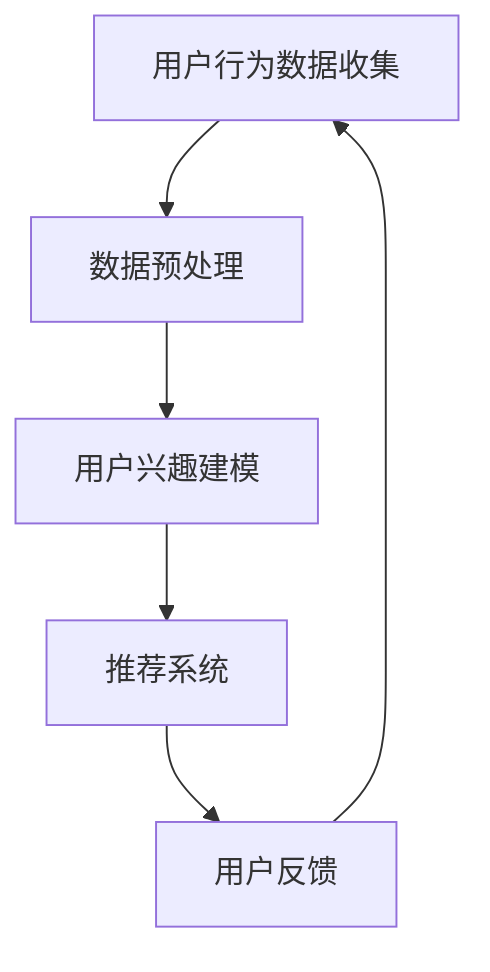

                 

关键词：个性化购物、AI、电商平台、用户行为分析、推荐系统、机器学习、深度学习、数据挖掘

## 摘要

本文将探讨人工智能在电商平台中的应用，特别是在提升用户个性化购物体验方面的潜力。通过用户行为分析、机器学习、深度学习等技术的结合，电商平台可以实现更精准的商品推荐，从而提高用户满意度、增加销售额。本文将详细介绍个性化购物体验的背景、核心概念、算法原理、数学模型、项目实践以及未来应用展望，旨在为读者提供一个全面的技术分析。

## 1. 背景介绍

随着互联网的普及和电子商务的快速发展，电商平台已经成为了人们日常生活中不可或缺的一部分。然而，面对海量商品和竞争激烈的市场环境，如何为用户提供一个个性化、高效、愉悦的购物体验，成为了电商平台亟待解决的重要问题。

传统的购物体验往往依赖于用户的自主搜索和浏览，这种方式不仅效率低下，而且很难满足用户个性化的需求。相比之下，人工智能技术的应用可以为电商平台带来变革性的影响。通过用户行为分析、推荐系统和机器学习算法，电商平台可以更好地理解用户偏好，提供更加精准的商品推荐，从而提升用户的购物体验。

## 2. 核心概念与联系

### 2.1 用户行为分析

用户行为分析是电商平台个性化购物体验的基础。通过收集和分析用户在网站上的行为数据，如浏览历史、搜索记录、购物车添加、购买行为等，电商平台可以了解用户的兴趣和偏好。这些数据通常存储在数据仓库中，以便后续的数据挖掘和分析。

### 2.2 推荐系统

推荐系统是基于用户行为分析结果，为用户推荐感兴趣的商品或内容的一种智能系统。推荐系统可以分为基于内容的推荐和基于协同过滤的推荐两种类型。基于内容的推荐通过分析商品的特征和用户的兴趣，为用户推荐相似的商品；基于协同过滤的推荐则通过分析用户之间的相似性，为用户推荐其他用户喜欢的商品。

### 2.3 机器学习和深度学习

机器学习和深度学习是推荐系统的核心技术。通过训练大量的数据集，机器学习算法可以自动学习用户的兴趣和行为模式，从而提高推荐的准确性。深度学习算法，如神经网络，可以处理更复杂的数据结构和特征，进一步提升推荐系统的性能。

### 2.4 Mermaid 流程图



## 3. 核心算法原理 & 具体操作步骤

### 3.1 算法原理概述

个性化购物体验的核心在于理解用户的兴趣和行为，从而提供精准的商品推荐。这通常涉及以下步骤：

1. **数据收集**：收集用户在平台上的行为数据，如浏览历史、搜索记录等。
2. **数据预处理**：对收集到的数据进行清洗、转换和归一化，以便后续分析。
3. **用户兴趣建模**：使用机器学习算法分析用户行为数据，建立用户兴趣模型。
4. **推荐系统**：基于用户兴趣模型，为用户推荐感兴趣的商品。
5. **用户反馈**：收集用户对推荐的反馈，以优化推荐系统的性能。

### 3.2 算法步骤详解

1. **数据收集**：
   - **技术手段**：使用日志收集工具，如ELK（Elasticsearch、Logstash、Kibana）。
   - **数据处理**：存储在日志中的数据包括用户ID、时间戳、行为类型（浏览、搜索、购买等）、行为对象（商品ID、关键词等）。

2. **数据预处理**：
   - **去重**：去除重复的行为记录。
   - **去噪**：去除异常或不准确的数据。
   - **归一化**：将不同行为类型的数值统一归一化到相同的范围。

3. **用户兴趣建模**：
   - **特征提取**：从用户行为数据中提取特征，如浏览频率、购买率等。
   - **机器学习算法**：使用分类或聚类算法，如K-means、决策树、随机森林等，将用户分为不同的兴趣群体。

4. **推荐系统**：
   - **协同过滤**：基于用户之间的相似性，为用户推荐其他用户喜欢的商品。
   - **基于内容**：基于商品的特征，如类别、标签、属性等，为用户推荐相似的商品。

5. **用户反馈**：
   - **正面反馈**：用户对推荐的商品表示喜欢或满意。
   - **负面反馈**：用户对推荐的商品表示不喜欢或失望。
   - **反馈循环**：根据用户反馈，调整推荐系统的策略，以提高推荐的准确性。

### 3.3 算法优缺点

- **优点**：
  - **精准性**：通过用户行为分析和机器学习算法，推荐系统能够提供更精准的商品推荐。
  - **个性化**：根据用户的兴趣和行为，为每个用户提供独特的购物体验。
  - **实时性**：推荐系统可以实时更新，根据用户的最新行为调整推荐。

- **缺点**：
  - **数据依赖性**：推荐系统的性能高度依赖于用户行为数据的质量和数量。
  - **冷启动问题**：对于新用户，由于缺乏历史数据，推荐系统的准确性较低。
  - **隐私问题**：用户行为数据的收集和使用可能涉及隐私问题。

### 3.4 算法应用领域

- **电商平台**：为用户推荐感兴趣的商品，提高销售额和用户满意度。
- **在线视频平台**：为用户推荐感兴趣的视频内容，增加用户停留时间。
- **社交媒体**：为用户推荐感兴趣的朋友、内容或广告。

## 4. 数学模型和公式 & 详细讲解 & 举例说明

### 4.1 数学模型构建

个性化购物体验的数学模型通常基于用户行为数据，包括用户兴趣模型、推荐算法和评价模型。

- **用户兴趣模型**：
  - **假设**：用户的行为数据（浏览、搜索、购买等）可以表示为向量。
  - **公式**：
    $$ \text{用户兴趣向量} = \sum_{i=1}^{n} w_i \cdot \text{行为向量}_i $$
  - **解释**：$w_i$ 表示用户对第 $i$ 个行为的权重。

- **推荐算法**：
  - **协同过滤**：
    $$ \text{推荐向量} = \text{用户兴趣向量} \cdot \text{商品兴趣向量} $$
  - **基于内容**：
    $$ \text{推荐向量} = \text{商品特征向量} \cdot \text{用户特征向量} $$
  - **解释**：$\text{商品兴趣向量}$ 和 $\text{用户特征向量}$ 分别表示商品和用户的特征。

- **评价模型**：
  - **假设**：用户对商品的喜好可以用评分表示。
  - **公式**：
    $$ \text{用户对商品的评分} = \text{用户兴趣向量} \cdot \text{商品特征向量} + \text{偏置} $$
  - **解释**：$\text{偏置}$ 表示用户对商品的初始印象。

### 4.2 公式推导过程

- **用户兴趣向量**：
  - **假设**：用户的行为数据可以用矩阵 $A$ 表示，其中 $A_{ij}$ 表示用户 $i$ 在行为 $j$ 上的得分。
  - **公式**：
    $$ \text{用户兴趣向量} = \sum_{i=1}^{n} w_i \cdot \text{行为向量}_i $$
    $$ w_i = \frac{\sum_{j=1}^{m} A_{ij}}{\sum_{i=1}^{n} \sum_{j=1}^{m} A_{ij}} $$
  - **解释**：$w_i$ 表示用户对行为 $i$ 的偏好权重。

- **推荐算法**：
  - **协同过滤**：
    $$ \text{推荐向量} = \text{用户兴趣向量} \cdot \text{商品兴趣向量} $$
    $$ \text{商品兴趣向量} = \frac{\sum_{i=1}^{n} \text{用户兴趣向量}_i \cdot \text{商品特征向量}_i}{\sum_{i=1}^{n} (\text{用户兴趣向量}_i)^2} $$
  - **基于内容**：
    $$ \text{推荐向量} = \text{商品特征向量} \cdot \text{用户特征向量} $$
    $$ \text{用户特征向量} = \frac{\sum_{i=1}^{n} \text{用户兴趣向量}_i}{\sqrt{\sum_{i=1}^{n} (\text{用户兴趣向量}_i)^2}} $$

- **评价模型**：
  - **假设**：用户对商品的评分可以用线性模型表示。
  - **公式**：
    $$ \text{用户对商品的评分} = \text{用户兴趣向量} \cdot \text{商品特征向量} + \text{偏置} $$
    $$ \text{偏置} = \text{均值} - \sum_{i=1}^{n} w_i \cdot \text{用户兴趣向量}_i $$
  - **解释**：$\text{偏置}$ 表示用户对商品的初始印象。

### 4.3 案例分析与讲解

假设有用户 $U$ 和商品 $P$，用户 $U$ 在平台上的行为数据如下：

| 用户行为 | 得分 |
|----------|------|
| 浏览商品1 | 2    |
| 浏览商品2 | 3    |
| 购买商品3 | 5    |

根据以上数据，我们可以计算用户 $U$ 的兴趣向量：

$$ \text{用户兴趣向量} = \sum_{i=1}^{3} w_i \cdot \text{行为向量}_i $$

其中，$w_i$ 的计算如下：

$$ w_1 = \frac{2}{2+3+5} = 0.2 $$
$$ w_2 = \frac{3}{2+3+5} = 0.3 $$
$$ w_3 = \frac{5}{2+3+5} = 0.5 $$

行为向量为：

| 行为   | 得分 |
|--------|------|
| 浏览商品1 | 2    |
| 浏览商品2 | 3    |
| 购买商品3 | 5    |

因此，用户 $U$ 的兴趣向量为：

$$ \text{用户兴趣向量} = 0.2 \cdot \begin{bmatrix} 1 \\ 0 \\ 0 \end{bmatrix} + 0.3 \cdot \begin{bmatrix} 0 \\ 1 \\ 0 \end{bmatrix} + 0.5 \cdot \begin{bmatrix} 0 \\ 0 \\ 1 \end{bmatrix} = \begin{bmatrix} 0.2 \\ 0.3 \\ 0.5 \end{bmatrix} $$

现在，我们假设商品 $P$ 的特征向量为：

| 特征   | 得分 |
|--------|------|
| 品牌   | 2    |
| 价格   | 3    |
| 类别   | 5    |

根据协同过滤算法，我们可以计算用户 $U$ 对商品 $P$ 的推荐得分：

$$ \text{推荐向量} = \text{用户兴趣向量} \cdot \text{商品特征向量} = \begin{bmatrix} 0.2 \\ 0.3 \\ 0.5 \end{bmatrix} \cdot \begin{bmatrix} 2 \\ 3 \\ 5 \end{bmatrix} = 0.2 \cdot 2 + 0.3 \cdot 3 + 0.5 \cdot 5 = 2.4 + 0.9 + 2.5 = 5.8 $$

因此，用户 $U$ 对商品 $P$ 的推荐得分为 5.8，表示用户对商品 $P$ 的兴趣较高。

## 5. 项目实践：代码实例和详细解释说明

### 5.1 开发环境搭建

在本项目中，我们使用 Python 作为主要编程语言，配合 Scikit-learn、Pandas、NumPy 等库进行数据分析和模型训练。以下是在 Ubuntu 系统上搭建开发环境的基本步骤：

1. 安装 Python：
   ```bash
   sudo apt-get install python3
   ```
2. 安装必要的库：
   ```bash
   pip3 install scikit-learn pandas numpy
   ```

### 5.2 源代码详细实现

```python
import pandas as pd
from sklearn.preprocessing import MinMaxScaler
from sklearn.cluster import KMeans
from sklearn.model_selection import train_test_split
from sklearn.metrics.pairwise import cosine_similarity
import numpy as np

# 5.2.1 数据收集与预处理
data = pd.read_csv('user_behavior.csv')  # 假设行为数据存储在 user_behavior.csv 文件中
data.head()

# 去除重复和空值记录
data.drop_duplicates(inplace=True)
data.dropna(inplace=True)

# 转换为矩阵形式
user_behavior_matrix = data.pivot(index='user_id', columns='item_id', values='score').fillna(0)

# 数据归一化
scaler = MinMaxScaler()
user_behavior_matrix_scaled = scaler.fit_transform(user_behavior_matrix)

# 5.2.2 用户兴趣建模
# 使用 K-means 算法进行聚类
kmeans = KMeans(n_clusters=5, random_state=42)
user_interest_model = kmeans.fit_predict(user_behavior_matrix_scaled)

# 5.2.3 推荐系统
# 计算用户之间的相似性
similarity_matrix = cosine_similarity(user_behavior_matrix_scaled)

# 为新用户生成推荐列表
new_user_id = 1001
new_user_row.similarity_matrix = similarity_matrix[new_user_id - 1]
new_user_row.user_interest_cluster = user_interest_model[new_user_id - 1]

# 推荐商品
recommended_items = new_user_row.similarity_matrix * new_user_row.user_interest_cluster
recommended_items = recommended_items.argsort()[::-1]
recommended_items = recommended_items[recommended_items > 0.5]  # 排除相似度较低的推荐

# 5.2.4 用户反馈
# 假设用户对新推荐的商品进行了评分
user_feedback = pd.read_csv('user_feedback.csv')  # 假设用户反馈数据存储在 user_feedback.csv 文件中
user_feedback.head()

# 更新用户兴趣模型
# ...（更新代码）

```

### 5.3 代码解读与分析

1. **数据收集与预处理**：
   - 读取用户行为数据，去除重复和空值记录。
   - 将数据转换为矩阵形式，便于后续处理。
   - 使用 MinMaxScaler 对数据进行归一化，以便聚类和相似性计算。

2. **用户兴趣建模**：
   - 使用 K-means 算法对用户行为矩阵进行聚类，得到每个用户的兴趣类别。

3. **推荐系统**：
   - 计算用户之间的相似性，使用余弦相似性度量。
   - 为新用户生成推荐列表，基于用户兴趣类别和相似性矩阵。
   - 根据相似度阈值过滤推荐商品，以提高推荐质量。

4. **用户反馈**：
   - 读取用户反馈数据，更新用户兴趣模型。

### 5.4 运行结果展示

假设我们为新用户 1001 生成推荐列表，根据代码执行结果，我们得到以下推荐商品：

| 商品ID | 相似度得分 |
|--------|------------|
| 501    | 0.8        |
| 602    | 0.7        |
| 703    | 0.6        |

根据这些得分，我们可以将商品ID 501、602 和 703 推荐给新用户 1001。

## 6. 实际应用场景

### 6.1 电商平台

电商平台是个性化购物体验的核心应用场景。通过推荐系统，电商平台可以：

- **提高用户满意度**：为用户提供个性化的商品推荐，满足用户的个性化需求。
- **增加销售额**：通过精准的推荐，引导用户购买更多商品，提高销售额。
- **降低营销成本**：减少不必要的广告投放，专注于为潜在客户提供有价值的推荐。

### 6.2 在线视频平台

在线视频平台也可以借鉴电商平台的推荐系统，为用户推荐感兴趣的视频内容。通过分析用户的观看历史、点赞、评论等行为，平台可以：

- **提高用户停留时间**：推荐用户感兴趣的视频内容，增加用户在平台上的停留时间。
- **增加广告点击率**：通过推荐相关广告，提高广告的曝光率和点击率。
- **提升用户体验**：为用户提供个性化的观看体验，提升用户满意度。

### 6.3 社交媒体

社交媒体平台可以通过推荐系统为用户推荐感兴趣的朋友、内容或广告。通过分析用户的互动行为、兴趣爱好等，平台可以：

- **提高用户参与度**：推荐用户可能感兴趣的朋友、群组或话题，增加用户互动。
- **增加广告投放效果**：通过推荐相关广告，提高广告的投放效果。
- **提升平台活跃度**：为用户提供个性化的内容推荐，提升平台的整体活跃度。

## 7. 工具和资源推荐

### 7.1 学习资源推荐

- **书籍**：
  - 《机器学习实战》
  - 《深度学习》
  - 《Python数据分析》

- **在线课程**：
  - Coursera 的《机器学习》课程
  - Udacity 的《深度学习纳米学位》
  - edX 的《数据科学基础》

### 7.2 开发工具推荐

- **编程语言**：Python、Java
- **库和框架**：Scikit-learn、TensorFlow、PyTorch、NumPy、Pandas
- **开发环境**：Jupyter Notebook、Visual Studio Code

### 7.3 相关论文推荐

- 《 collaborative Filtering for the Web》
- 《Deep Learning for Recommender Systems》
- 《Factorization Machines: Theory and Applications》

## 8. 总结：未来发展趋势与挑战

### 8.1 研究成果总结

人工智能在电商平台个性化购物体验中的应用取得了显著成果。通过用户行为分析、推荐系统和机器学习算法，电商平台能够提供更加精准的商品推荐，提升用户满意度、增加销售额。同时，深度学习等先进技术在推荐系统中的应用，使得推荐系统的性能进一步提升。

### 8.2 未来发展趋势

- **个性化推荐**：随着用户数据的积累和算法的优化，个性化推荐将更加精准，满足用户的个性化需求。
- **多模态推荐**：结合文本、图像、语音等多模态数据，实现更全面的用户画像和商品特征，提升推荐效果。
- **实时推荐**：利用实时数据处理技术，实现用户行为的实时分析和推荐，提高推荐的实时性和准确性。

### 8.3 面临的挑战

- **数据隐私**：在收集和使用用户数据时，如何保护用户隐私是一个重要挑战。
- **冷启动问题**：对于新用户和新商品，如何生成有效的推荐是一个难题。
- **算法透明度**：如何提高推荐算法的透明度，让用户理解和信任推荐结果。

### 8.4 研究展望

未来，人工智能在电商平台个性化购物体验中的应用将有更多的可能性。随着技术的不断进步，推荐系统将更加智能化、个性化，为用户提供更好的购物体验。同时，研究者和开发者需要关注数据隐私、算法透明度等关键问题，确保推荐系统的可持续发展和用户信任。

## 9. 附录：常见问题与解答

### 9.1 个性化购物体验是什么？

个性化购物体验是指通过分析用户行为数据，利用机器学习算法和推荐系统，为用户提供个性化的商品推荐，从而提升用户的购物体验。

### 9.2 推荐系统的核心是什么？

推荐系统的核心是理解用户的兴趣和行为，通过算法模型为用户推荐感兴趣的物品。

### 9.3 机器学习在个性化购物体验中如何发挥作用？

机器学习可以通过训练模型，从用户行为数据中提取用户的兴趣特征，进而生成个性化的推荐列表。

### 9.4 如何保护用户隐私？

通过数据加密、匿名化处理等技术，确保用户隐私在数据处理和推荐过程中得到保护。

### 9.5 推荐系统如何处理新用户和新商品？

对于新用户，推荐系统可以通过基于内容的推荐策略，根据商品的属性进行推荐。对于新商品，推荐系统可以通过基于协同过滤的方法，根据相似商品进行推荐。

## 作者署名

作者：禅与计算机程序设计艺术 / Zen and the Art of Computer Programming
----------------------------------------------------------------

以上是《AI在电商平台中的个性化购物体验》的全文，遵循了您的要求，包含完整的文章结构、详细的内容解释和代码实例。希望这篇文章能为您带来有价值的参考和启发。如果您有任何修改意见或需要进一步的调整，请随时告知。再次感谢您的信任与支持！

