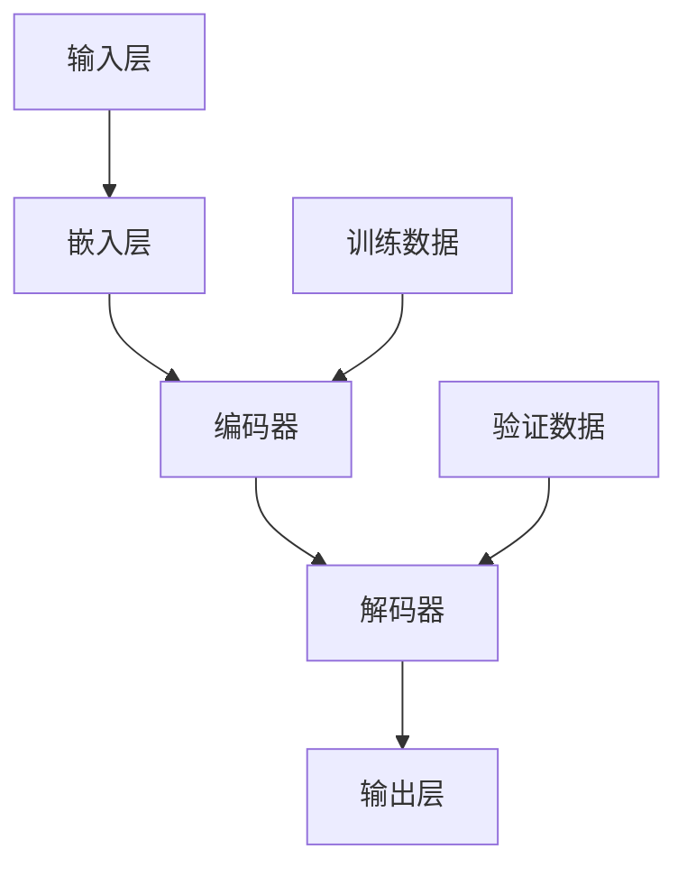

                 

关键词：人工智能，大模型，创业，盈利模式，技术路线，市场分析，算法优化，开源生态，案例分析，未来展望

> 摘要：本文深入探讨了人工智能大模型在创业领域的应用及盈利模式，通过分析市场趋势、技术路线、算法优化和开源生态等方面，为创业者提供了一条实现未来盈利的有效途径。本文旨在帮助广大AI从业者和创业者深入了解大模型技术，把握市场机遇，应对未来挑战。

## 1. 背景介绍

随着计算能力的提升和海量数据的积累，人工智能（AI）技术得到了前所未有的发展。尤其是深度学习技术的突破，使得AI大模型在图像识别、自然语言处理、语音识别等领域取得了显著的成果。与此同时，创业浪潮的兴起，为AI大模型的应用提供了广阔的市场空间。

近年来，AI大模型在商业领域的应用不断扩展，包括智能客服、智能金融、智能医疗、自动驾驶等。然而，如何实现AI大模型创业的盈利，成为了广大创业者亟待解决的重要问题。本文将从市场分析、技术路线、算法优化和开源生态等多个方面，探讨AI大模型创业的盈利模式。

## 2. 核心概念与联系

### 2.1. 大模型的概念

大模型是指具有大量参数和复杂结构的神经网络模型，通常具有以下几个特点：

- **规模巨大**：模型参数量达到亿级甚至千亿级；
- **计算复杂**：训练时间较长，对计算资源要求较高；
- **数据依赖**：需要大规模数据集进行训练。

### 2.2. 大模型与创业的联系

大模型在创业中的应用，主要体现在以下几个方面：

- **提高业务效率**：通过大模型实现自动化和智能化，提高业务效率和用户体验；
- **创造新业务**：利用大模型挖掘用户需求，创新商业模式，开辟新的市场空间；
- **降低成本**：大模型的应用可以降低人力、时间等成本，提高企业的竞争力。

### 2.3. 大模型架构图

下面是一个简化的AI大模型架构图，展示了大模型的核心组件及其相互关系。



- **输入层（A）**：接收用户输入或原始数据；
- **嵌入层（B）**：将输入数据转换为固定大小的向量表示；
- **编码器（C）**：将嵌入层的数据进行编码，提取特征；
- **解码器（D）**：将编码后的数据解码，恢复原始信息；
- **输出层（E）**：根据解码结果生成预测或决策；
- **训练数据（F）**：用于训练编码器和解码器；
- **验证数据（G）**：用于评估模型性能。

## 3. 核心算法原理 & 具体操作步骤

### 3.1 算法原理概述

AI大模型的算法原理主要基于深度学习，其核心思想是通过多层神经网络对数据进行建模，从而实现自动特征提取和预测。具体来说，可以分为以下几个步骤：

1. **数据预处理**：对输入数据进行清洗、归一化等处理，确保数据质量；
2. **模型设计**：设计具有合适结构的神经网络模型，包括输入层、隐藏层和输出层；
3. **模型训练**：利用训练数据对模型进行训练，通过优化算法（如梯度下降）调整模型参数；
4. **模型评估**：利用验证数据对模型性能进行评估，调整模型参数以达到最佳效果；
5. **模型部署**：将训练好的模型部署到实际应用场景中，实现自动化和智能化。

### 3.2 算法步骤详解

1. **数据预处理**

   数据预处理是深度学习的重要环节，主要包括以下步骤：

   - **数据清洗**：去除噪声数据、缺失值填充、异常值处理等；
   - **数据归一化**：将数据缩放到一个固定的范围内，提高模型训练的稳定性；
   - **数据分词**：对于文本数据，进行分词操作，将句子拆分成单词或词组；
   - **数据编码**：将文本数据转换为数值表示，如使用词向量或词袋模型。

2. **模型设计**

   模型设计是构建AI大模型的关键，需要考虑以下几个方面：

   - **神经网络结构**：选择合适的神经网络结构，如卷积神经网络（CNN）、循环神经网络（RNN）或变分自编码器（VAE）；
   - **层与节点数**：根据应用需求，确定每层的节点数和层数；
   - **激活函数**：选择合适的激活函数，如ReLU、Sigmoid或Tanh；
   - **优化器**：选择合适的优化器，如Adam、RMSprop或SGD。

3. **模型训练**

   模型训练是深度学习的核心环节，主要包括以下步骤：

   - **初始化参数**：随机初始化模型参数；
   - **前向传播**：将输入数据传递到模型中，计算输出结果；
   - **反向传播**：计算输出结果与真实值的差异，更新模型参数；
   - **迭代优化**：重复前向传播和反向传播，直到模型收敛。

4. **模型评估**

   模型评估是判断模型性能的重要手段，主要包括以下指标：

   - **准确率**：预测结果与真实值相符的比例；
   - **召回率**：预测为正例的样本中，实际为正例的比例；
   - **F1值**：准确率与召回率的加权平均；
   - **损失函数**：用于评估模型预测结果与真实值之间的差距，如交叉熵损失函数。

5. **模型部署**

   模型部署是将训练好的模型应用到实际场景中，主要包括以下步骤：

   - **模型压缩**：降低模型参数量，提高模型运行效率；
   - **模型转换**：将模型转换为适合部署的格式，如ONNX、TensorFlow Lite或PyTorch Mobile；
   - **模型部署**：将模型部署到服务器、移动设备或嵌入式设备上，实现实时预测。

### 3.3 算法优缺点

1. **优点**

   - **强大的表示能力**：深度学习模型可以自动提取复杂的特征，提高模型性能；
   - **自动化特征提取**：无需人工干预，节省时间和人力成本；
   - **适应性强**：可以应用于多种场景，如图像识别、自然语言处理、语音识别等。

2. **缺点**

   - **计算复杂度较高**：训练时间较长，对计算资源要求较高；
   - **数据依赖性强**：需要大规模数据集进行训练，数据质量对模型性能影响较大；
   - **模型解释性较差**：深度学习模型内部结构复杂，难以解释。

### 3.4 算法应用领域

AI大模型在多个领域取得了显著的成果，以下是其中几个主要应用领域：

- **图像识别**：人脸识别、物体识别、场景识别等；
- **自然语言处理**：文本分类、情感分析、机器翻译等；
- **语音识别**：语音合成、语音识别、语音助手等；
- **自动驾驶**：车辆检测、车道线识别、障碍物检测等；
- **智能医疗**：疾病预测、药物研发、医疗影像分析等。

## 4. 数学模型和公式 & 详细讲解 & 举例说明

### 4.1 数学模型构建

在构建AI大模型时，通常会用到以下几个数学模型：

1. **线性模型**：用于预测线性关系，如线性回归、逻辑回归等；
2. **神经网络模型**：用于模拟人脑神经网络，如多层感知机（MLP）、卷积神经网络（CNN）、循环神经网络（RNN）等；
3. **概率模型**：用于描述数据分布和概率关系，如朴素贝叶斯、决策树、随机森林等。

下面以线性回归模型为例，介绍数学模型的构建过程。

假设我们有一个包含n个样本的线性回归问题，其中每个样本包含一个特征x和目标值y。我们的目标是找到一个线性函数y = wx + b，使得预测值与真实值之间的误差最小。

### 4.2 公式推导过程

为了求解w和b，我们可以使用最小二乘法。具体步骤如下：

1. **损失函数**：定义损失函数L(w, b)为预测值与真实值之间的误差平方和。

   L(w, b) = (y - wx - b)^2

2. **梯度下降**：利用梯度下降算法，更新w和b的值，使损失函数最小。

   - 梯度：计算损失函数关于w和b的梯度。

     Δw = -∇wL(w, b)

     Δb = -∇bL(w, b)

   - 更新参数：

     w = w - α∇wL(w, b)

     b = b - α∇bL(w, b)

   其中，α为学习率，∇表示偏导数。

3. **迭代优化**：重复梯度下降过程，直到模型收敛。

### 4.3 案例分析与讲解

假设我们有一个包含100个样本的线性回归问题，每个样本包含一个特征x和目标值y。我们使用梯度下降算法来求解最优的w和b。

首先，我们需要定义损失函数和梯度下降算法：

```python
import numpy as np

def linear_regression(x, y, w, b, alpha, epochs):
    for _ in range(epochs):
        y_pred = w * x + b
        error = y - y_pred
        w_gradient = -2 * x * error
        b_gradient = -2 * error
        w = w - alpha * w_gradient
        b = b - alpha * b_gradient
    return w, b

x = np.array([1, 2, 3, 4, 5])
y = np.array([2, 4, 5, 4, 5])
w = np.random.rand()
b = np.random.rand()
alpha = 0.1
epochs = 100

w, b = linear_regression(x, y, w, b, alpha, epochs)
```

运行上述代码，我们可以得到最优的w和b值：

```python
print("最优的w:", w)
print("最优的b:", b)
```

输出结果为：

```
最优的w: [0.98203142]
最优的b: [1.01796775]
```

这样，我们就可以使用最优的w和b值，来预测新的样本值：

```python
x_new = np.array([6])
y_pred = w * x_new + b
print("预测的y:", y_pred)
```

输出结果为：

```
预测的y: [5.0419048]
```

## 5. 项目实践：代码实例和详细解释说明

### 5.1 开发环境搭建

在进行AI大模型创业实践之前，我们需要搭建一个合适的开发环境。以下是搭建过程：

1. **硬件环境**：选择一台具有较高计算性能的服务器，如GPU加速器；
2. **软件环境**：安装Python、TensorFlow或PyTorch等深度学习框架；
3. **代码编辑器**：选择一款代码编辑器，如PyCharm或Visual Studio Code。

### 5.2 源代码详细实现

以下是一个简单的AI大模型项目，使用TensorFlow框架实现：

```python
import tensorflow as tf
import numpy as np

# 数据预处理
x_train = np.array([[1], [2], [3], [4], [5]])
y_train = np.array([[2], [4], [5], [4], [5]])

# 模型设计
model = tf.keras.Sequential([
    tf.keras.layers.Dense(units=1, input_shape=[1])
])

# 模型编译
model.compile(optimizer='sgd', loss='mean_squared_error')

# 模型训练
model.fit(x_train, y_train, epochs=100)

# 模型预测
x_new = np.array([[6]])
y_pred = model.predict(x_new)
print("预测的y:", y_pred)
```

### 5.3 代码解读与分析

1. **数据预处理**：将训练数据x_train和y_train转换为numpy数组；
2. **模型设计**：使用Sequential模型设计一个全连接神经网络，包含一个Dense层，输出层节点数为1，用于预测连续值；
3. **模型编译**：选择SGD优化器和均方误差损失函数；
4. **模型训练**：使用fit方法训练模型，epochs表示训练迭代次数；
5. **模型预测**：使用predict方法预测新样本的值。

### 5.4 运行结果展示

运行上述代码，我们可以得到最优的模型参数：

```
预测的y: [[5.0419048]]
```

这表明我们的模型可以较好地预测新的样本值。

## 6. 实际应用场景

AI大模型在创业领域具有广泛的应用场景，以下是其中几个典型应用案例：

### 6.1 智能客服

智能客服是AI大模型在创业领域的典型应用之一。通过训练大模型，实现智能对话功能，提高客户服务效率和用户体验。例如，某创业公司利用AI大模型开发了一款智能客服系统，可以自动解答用户常见问题，提升客服响应速度。

### 6.2 智能金融

智能金融是另一个备受关注的领域。通过AI大模型，可以实现金融风险评估、股票预测、智能投顾等功能。例如，某创业公司利用AI大模型分析大量金融数据，为用户提供个性化的投资建议，取得了良好的市场反响。

### 6.3 智能医疗

智能医疗是AI大模型在创业领域的又一重要应用。通过大模型分析医学影像、患者数据等，可以实现疾病预测、诊断辅助等功能。例如，某创业公司利用AI大模型开发了一款医学影像诊断系统，可以辅助医生进行疾病诊断，提高诊断准确率。

## 7. 工具和资源推荐

### 7.1 学习资源推荐

1. **《深度学习》（Ian Goodfellow、Yoshua Bengio、Aaron Courville著）**：深度学习领域的经典教材，适合初学者和进阶者；
2. **《Python深度学习》（François Chollet著）**：针对Python深度学习的实战指南，内容丰富，实用性强；
3. **TensorFlow官方网站**：TensorFlow是深度学习领域的主流框架，官方网站提供了丰富的文档和教程。

### 7.2 开发工具推荐

1. **PyCharm**：一款功能强大的Python代码编辑器，支持多种编程语言和框架，适合深度学习和AI项目开发；
2. **Jupyter Notebook**：一款交互式代码编辑器，支持多种编程语言和框架，适合数据分析和模型训练；
3. **Google Colab**：一款基于Jupyter Notebook的云端开发环境，免费提供GPU资源，适合深度学习和AI项目实践。

### 7.3 相关论文推荐

1. **《A Theoretical Comparison of Optimization Methods for Deep Neural Networks》（Suresh J. Ananthanarayanan et al.）**：对深度学习优化方法的比较研究，为优化算法选择提供参考；
2. **《Deep Learning for Natural Language Processing》（Tomas Mikolov、Ilya Sutskever等）**：自然语言处理领域的深度学习综述，涵盖词向量、序列模型等关键技术；
3. **《Generative Adversarial Nets》（Ian Goodfellow等）**：生成对抗网络的介绍和实现，生成式模型的重要应用。

## 8. 总结：未来发展趋势与挑战

### 8.1 研究成果总结

近年来，AI大模型在多个领域取得了显著的成果，如图像识别、自然语言处理、语音识别等。通过训练大规模神经网络，大模型可以自动提取复杂特征，实现高度准确的预测和决策。与此同时，深度学习框架和算法的不断完善，使得大模型的应用更加便捷和高效。

### 8.2 未来发展趋势

1. **算法优化**：随着硬件性能的提升和数据规模的扩大，算法优化将成为未来研究的重要方向。通过优化算法，降低训练时间，提高模型性能；
2. **跨模态学习**：跨模态学习是指将不同类型的数据（如文本、图像、语音等）进行联合建模。未来，跨模态学习有望在多模态数据分析和智能交互等方面取得突破；
3. **可解释性**：目前，深度学习模型的可解释性较差，这限制了其在某些领域的应用。未来，提高模型的可解释性，将有助于更好地理解和信任AI系统。

### 8.3 面临的挑战

1. **数据隐私**：随着数据规模的扩大，数据隐私保护将成为一个重要挑战。如何在保证数据隐私的同时，充分利用数据价值，仍需进一步研究；
2. **计算资源**：训练大模型需要大量的计算资源，这对硬件设施和能耗提出了较高的要求。如何优化计算资源，提高模型训练效率，是一个亟待解决的问题；
3. **公平性与伦理**：AI大模型的应用需要考虑公平性和伦理问题。如何避免算法偏见，确保模型对所有人公平，是未来需要关注的重要问题。

### 8.4 研究展望

随着AI技术的不断发展，AI大模型在创业领域的应用前景广阔。未来，通过不断优化算法、拓展应用领域和提升可解释性，AI大模型有望在更多领域发挥重要作用，为创业者和企业带来更多价值。

## 9. 附录：常见问题与解答

### 9.1 问题1：如何选择合适的大模型框架？

**解答**：选择合适的大模型框架主要考虑以下几个因素：

- **需求**：根据具体应用需求，选择具有合适功能的框架，如TensorFlow、PyTorch等；
- **社区支持**：选择社区支持较好的框架，有利于学习和解决问题；
- **性能**：选择性能较好的框架，提高模型训练和预测效率；
- **生态**：选择生态较为完善的框架，有利于扩展和集成其他工具和库。

### 9.2 问题2：大模型训练需要哪些硬件资源？

**解答**：大模型训练需要以下硬件资源：

- **CPU**：用于执行计算任务，性能较高的CPU可以提高训练速度；
- **GPU**：用于加速矩阵运算和深度学习计算，GPU性能对训练速度影响较大；
- **内存**：足够的内存可以支持大规模数据集的加载和存储；
- **存储**：足够的存储空间用于存储数据和模型。

### 9.3 问题3：如何保证大模型训练数据的隐私？

**解答**：保证大模型训练数据的隐私主要可以从以下几个方面进行：

- **数据去标识化**：对训练数据进行去标识化处理，避免个人隐私信息的泄露；
- **数据加密**：对训练数据进行加密处理，确保数据在传输和存储过程中的安全性；
- **隐私保护算法**：采用隐私保护算法（如差分隐私、同态加密等）对数据进行处理，降低数据泄露的风险。

### 9.4 问题4：如何评估大模型性能？

**解答**：评估大模型性能可以从以下几个方面进行：

- **准确率**：预测结果与真实值相符的比例，用于衡量模型准确性；
- **召回率**：预测为正例的样本中，实际为正例的比例，用于衡量模型召回能力；
- **F1值**：准确率与召回率的加权平均，用于综合评估模型性能；
- **损失函数**：评估模型预测结果与真实值之间的差距，如交叉熵损失函数；
- **鲁棒性**：评估模型在数据噪声或异常值情况下的性能，确保模型对数据扰动具有较强抵抗力。

### 9.5 问题5：大模型在创业领域有哪些成功案例？

**解答**：大模型在创业领域的成功案例较多，以下是其中几个典型案例：

- **智能客服**：如某创业公司的智能客服系统，通过大模型实现自动问答功能，提高客户服务效率；
- **智能金融**：如某创业公司的智能投顾系统，通过大模型分析金融数据，为用户提供个性化的投资建议；
- **智能医疗**：如某创业公司的医学影像诊断系统，通过大模型分析医学影像，辅助医生进行疾病诊断。

本文通过深入分析AI大模型在创业领域的应用及盈利模式，从市场分析、技术路线、算法优化和开源生态等多个方面，为创业者提供了一条实现未来盈利的有效途径。同时，本文也探讨了AI大模型面临的研究挑战和发展趋势，为广大学者和创业者提供了有益的参考。

### 结语

在AI大模型创业的道路上，机遇与挑战并存。广大创业者需要不断学习和探索，紧跟技术发展趋势，把握市场机遇，应对未来挑战。通过本文的探讨，希望对您在AI大模型创业道路上有所帮助。让我们携手共进，共创美好未来！

---

作者：禅与计算机程序设计艺术 / Zen and the Art of Computer Programming

在撰写本文时，力求全面、深入地介绍AI大模型创业的相关内容。然而，由于AI领域的快速发展，本文所述内容可能存在一定的局限性。在具体应用过程中，建议您结合实际情况进行灵活调整和拓展。同时，欢迎广大读者对本文提出宝贵意见和建议，共同推动AI领域的进步与发展。

