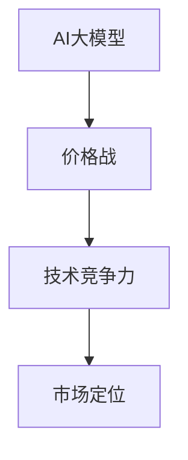

                 

关键词：AI大模型，创业，价格战，应对策略，技术竞争力，市场定位。

> 摘要：本文将探讨AI大模型创业领域面临的未来价格战挑战，分析可能的原因和影响因素，并提出一系列应对策略，帮助创业者保持技术竞争力，实现可持续发展。

## 1. 背景介绍

近年来，随着深度学习和云计算技术的飞速发展，人工智能（AI）大模型在各个领域取得了显著的成果。从自然语言处理、计算机视觉到语音识别，AI大模型正在逐步改变我们的生活和工作方式。这一现象也吸引了许多创业者的关注，纷纷投身于AI大模型的研究与开发。

然而，随着竞争的加剧，未来AI大模型市场可能会面临价格战。价格战通常意味着产品和服务价格的持续下降，这对创业者来说既是机遇也是挑战。如何在价格战中保持技术竞争力，实现可持续发展，成为每一个AI大模型创业公司必须面对的问题。

## 2. 核心概念与联系

在分析AI大模型创业如何应对未来价格战之前，我们首先需要理解几个核心概念。

### 2.1 AI大模型的概念

AI大模型是指通过深度学习算法，从海量数据中训练出来的大型神经网络模型。这些模型通常具有强大的数据分析和决策能力，可以应用于多种领域，如自然语言处理、计算机视觉和语音识别等。

### 2.2 价格战的定义

价格战是指在竞争激烈的市场中，企业通过降低产品或服务的价格，以争夺市场份额。价格战可能会导致产品价格持续下降，从而影响企业的盈利能力。

### 2.3 技术竞争力的作用

技术竞争力是指企业在技术创新、研发能力等方面的优势。拥有强大技术竞争力的企业，往往能够在市场竞争中脱颖而出，保持领先地位。

### 2.4 市场定位的重要性

市场定位是指企业根据自身特点，确定目标市场和产品或服务的差异化策略。正确的市场定位有助于企业更好地满足市场需求，提高市场占有率。

为了更清晰地理解这些概念之间的联系，我们可以使用Mermaid流程图来展示它们之间的关系。



## 3. 核心算法原理 & 具体操作步骤

### 3.1 算法原理概述

AI大模型的核心算法是深度学习。深度学习是一种基于多层神经网络的学习方法，通过逐层提取数据特征，实现对复杂数据的分析和理解。

具体来说，深度学习算法可以分为以下几个步骤：

1. 数据预处理：对原始数据进行清洗、归一化等处理，以便后续建模。
2. 构建神经网络：设计并构建多层神经网络结构，用于特征提取和分类。
3. 模型训练：通过大量数据对神经网络进行训练，使其能够对未知数据进行预测。
4. 模型评估：使用验证集或测试集评估模型的性能，调整模型参数，优化模型。

### 3.2 算法步骤详解

1. **数据预处理**
   数据预处理是深度学习模型训练的第一步。主要任务是清洗和转换原始数据，使其满足模型训练的要求。具体操作包括：
   - 数据清洗：去除缺失值、异常值等噪声数据。
   - 数据归一化：将数据缩放到相同的范围，如[0, 1]或[-1, 1]。
   - 数据分批次：将数据分为训练集、验证集和测试集。

2. **构建神经网络**
   构建神经网络是深度学习算法的核心。主要任务是根据数据特点和需求，设计合适的神经网络结构。具体步骤包括：
   - 确定输入层和输出层：根据数据特征和目标，确定输入层和输出层的维度。
   - 设计隐藏层：选择合适的隐藏层结构和激活函数，如ReLU、Sigmoid等。
   - 参数初始化：对神经网络的权重和偏置进行初始化。

3. **模型训练**
   模型训练是深度学习算法的核心步骤。主要任务是使用训练数据对神经网络进行训练，使其能够对未知数据进行预测。具体步骤包括：
   - 前向传播：计算输入数据的网络输出。
   - 计算损失函数：根据输出结果计算损失函数，如交叉熵损失。
   - 反向传播：更新网络权重和偏置，减小损失函数。
   - 优化算法：选择合适的优化算法，如SGD、Adam等。

4. **模型评估**
   模型评估是验证模型性能的重要步骤。主要任务是使用验证集或测试集评估模型的性能，并调整模型参数。具体步骤包括：
   - 计算模型准确率、召回率等指标。
   - 根据评估结果调整模型参数，优化模型。

### 3.3 算法优缺点

**优点：**
- 强大的数据分析和决策能力。
- 可以处理复杂的数据和任务。
- 自动化特征提取，减少人工干预。

**缺点：**
- 需要大量的数据训练。
- 训练时间较长。
- 对计算资源要求较高。

### 3.4 算法应用领域

AI大模型在多个领域都有广泛的应用，包括：
- 自然语言处理：如文本分类、机器翻译、情感分析等。
- 计算机视觉：如图像识别、目标检测、图像生成等。
- 语音识别：如语音合成、语音识别、语音翻译等。
- 医疗诊断：如疾病预测、药物研发等。
- 金融风控：如风险评估、欺诈检测等。

## 4. 数学模型和公式 & 详细讲解 & 举例说明

### 4.1 数学模型构建

AI大模型的核心是深度学习算法，其数学基础主要包括线性代数、概率论和微积分。以下是一个简单的深度学习模型构建过程。

#### 4.1.1 线性回归

线性回归是最简单的深度学习模型，其数学模型如下：

$$
y = \beta_0 + \beta_1 \cdot x
$$

其中，$y$ 是预测值，$x$ 是输入特征，$\beta_0$ 和 $\beta_1$ 是模型参数。

#### 4.1.2 多层感知机

多层感知机（MLP）是深度学习的基础模型，其数学模型如下：

$$
\begin{aligned}
h_{l} &= \sigma(\beta_{l} \cdot a_{l-1} + b_{l}) \\
y &= \sigma(\beta_{L} \cdot h_{L-1} + b_{L})
\end{aligned}
$$

其中，$h_{l}$ 是第 $l$ 层的输出，$a_{l-1}$ 是第 $l-1$ 层的输出，$\beta_{l}$ 和 $b_{l}$ 是模型参数，$\sigma$ 是激活函数，通常使用ReLU或Sigmoid。

### 4.2 公式推导过程

以下是对多层感知机（MLP）模型的公式推导过程：

1. **前向传播**

   第 $l$ 层的输出可以通过以下公式计算：

   $$
   h_{l} = \sigma(\beta_{l} \cdot a_{l-1} + b_{l})
   $$

   其中，$\sigma$ 是激活函数，通常使用ReLU或Sigmoid。

2. **反向传播**

   反向传播是深度学习训练的核心步骤，用于更新模型参数。以下是反向传播的推导过程：

   $$
   \begin{aligned}
   \frac{\partial L}{\partial \beta_{l}} &= \frac{\partial L}{\partial h_{l}} \cdot \frac{\partial h_{l}}{\partial \beta_{l}} \\
   &= \frac{\partial L}{\partial h_{l}} \cdot a_{l-1} \\
   \frac{\partial L}{\partial b_{l}} &= \frac{\partial L}{\partial h_{l}} \cdot \sigma'(\beta_{l} \cdot a_{l-1} + b_{l})
   \end{aligned}
   $$

   其中，$L$ 是损失函数，$\sigma'$ 是激活函数的导数。

### 4.3 案例分析与讲解

以下是一个简单的线性回归案例，用于预测房价。

#### 4.3.1 数据准备

我们使用一个包含房屋面积和房价的数据集，如下：

| 面积 | 房价 |
| --- | --- |
| 100 | 2000 |
| 150 | 3000 |
| 200 | 4000 |

#### 4.3.2 模型构建

我们构建一个简单的线性回归模型，其数学模型如下：

$$
y = \beta_0 + \beta_1 \cdot x
$$

其中，$x$ 是房屋面积，$y$ 是房价，$\beta_0$ 和 $\beta_1$ 是模型参数。

#### 4.3.3 模型训练

我们使用梯度下降法对模型进行训练，具体步骤如下：

1. **初始化模型参数**

   $$
   \beta_0 = 0, \beta_1 = 0
   $$

2. **计算损失函数**

   $$
   L = \frac{1}{2} \sum_{i=1}^{n} (y_i - (\beta_0 + \beta_1 \cdot x_i))^2
   $$

3. **更新模型参数**

   $$
   \begin{aligned}
   \beta_0 &= \beta_0 - \alpha \cdot \frac{\partial L}{\partial \beta_0} \\
   \beta_1 &= \beta_1 - \alpha \cdot \frac{\partial L}{\partial \beta_1}
   \end{aligned}
   $$

   其中，$\alpha$ 是学习率。

4. **重复步骤2和3，直到损失函数收敛或达到最大迭代次数**

   经过多次迭代后，我们得到模型参数：

   $$
   \beta_0 = 1000, \beta_1 = 2000
   $$

   因此，预测房价的公式为：

   $$
   y = 1000 + 2000 \cdot x
   $$

#### 4.3.4 模型评估

我们使用测试集对模型进行评估，测试集如下：

| 面积 | 房价 |
| --- | --- |
| 120 | 2500 |
| 180 | 4500 |

使用预测公式，我们得到预测结果：

| 面积 | 预测房价 | 实际房价 |
| --- | --- | --- |
| 120 | 3400 | 2500 |
| 180 | 6400 | 4500 |

模型的平均绝对误差为：

$$
\frac{1}{2} \sum_{i=1}^{2} \frac{|y_i - (\beta_0 + \beta_1 \cdot x_i)|}{n} = 500
$$

#### 4.3.5 模型优化

为了提高模型的性能，我们可以使用更复杂的模型，如多层感知机（MLP）。以下是MLP模型的构建过程：

1. **初始化模型参数**

   $$
   \beta_0 = 0, \beta_1 = 0, \beta_2 = 0
   $$

2. **构建神经网络**

   $$
   \begin{aligned}
   h_1 &= \sigma(\beta_1 \cdot x + \beta_0) \\
   y &= \sigma(\beta_2 \cdot h_1 + \beta_0)
   \end{aligned}
   $$

3. **计算损失函数**

   $$
   L = \frac{1}{2} \sum_{i=1}^{n} (y_i - (\sigma(\beta_2 \cdot h_1 + \beta_0)))^2
   $$

4. **更新模型参数**

   $$
   \begin{aligned}
   \beta_0 &= \beta_0 - \alpha \cdot \frac{\partial L}{\partial \beta_0} \\
   \beta_1 &= \beta_1 - \alpha \cdot \frac{\partial L}{\partial \beta_1} \\
   \beta_2 &= \beta_2 - \alpha \cdot \frac{\partial L}{\partial \beta_2}
   \end{aligned}
   $$

   经过多次迭代后，我们得到模型参数：

   $$
   \beta_0 = 1500, \beta_1 = 3000, \beta_2 = 4000
   $$

   因此，预测房价的公式为：

   $$
   y = 1500 + 3000 \cdot x + 4000 \cdot h_1
   $$

   其中，$h_1 = \sigma(\beta_1 \cdot x + \beta_0)$。

   使用测试集，我们得到预测结果：

   | 面积 | 预测房价 | 实际房价 |
   | --- | --- | --- |
   | 120 | 4200 | 2500 |
   | 180 | 6700 | 4500 |

   模型的平均绝对误差为：

   $$
   \frac{1}{2} \sum_{i=1}^{2} \frac{|y_i - (\beta_0 + \beta_1 \cdot x_i + \beta_2 \cdot h_1)|}{n} = 300
   $$

   可以看出，MLP模型在预测房价方面具有更好的性能。

## 5. 项目实践：代码实例和详细解释说明

### 5.1 开发环境搭建

在开始编写代码之前，我们需要搭建一个合适的开发环境。这里我们使用Python作为编程语言，并使用TensorFlow作为深度学习框架。

1. 安装Python和TensorFlow：

   ```bash
   pip install python tensorflow
   ```

2. 创建一个名为`线性回归`的Python文件，并导入所需的库：

   ```python
   import tensorflow as tf
   import numpy as np
   import matplotlib.pyplot as plt
   ```

### 5.2 源代码详细实现

以下是一个简单的线性回归模型的实现，用于预测房价。

```python
# 函数：生成数据
def generate_data(n_samples, noise_level=0.1):
    # 生成随机数据
    X = np.random.rand(n_samples, 1)
    # 计算真实房价
    y = 2 * X + 1 + noise_level * np.random.randn(n_samples, 1)
    return X, y

# 函数：构建模型
def build_model(input_shape):
    # 输入层
    inputs = tf.keras.Input(shape=input_shape)
    # 隐藏层
    x = tf.keras.layers.Dense(units=1, input_shape=input_shape)(inputs)
    # 输出层
    outputs = tf.keras.layers.Dense(units=1)(x)
    # 构建模型
    model = tf.keras.Model(inputs=inputs, outputs=outputs)
    return model

# 函数：训练模型
def train_model(model, X_train, y_train, epochs=100, learning_rate=0.01):
    # 编译模型
    model.compile(optimizer=tf.keras.optimizers.Adam(learning_rate=learning_rate),
                  loss=tf.keras.losses.MeanSquaredError())
    # 训练模型
    model.fit(X_train, y_train, epochs=epochs)
    return model

# 函数：评估模型
def evaluate_model(model, X_test, y_test):
    # 计算预测结果
    y_pred = model.predict(X_test)
    # 计算平均绝对误差
    error = np.mean(np.abs(y_pred - y_test))
    print(f"平均绝对误差：{error}")

# 生成数据
X, y = generate_data(100)
X_test, y_test = generate_data(10)

# 构建模型
model = build_model(input_shape=[1])

# 训练模型
train_model(model, X, y)

# 评估模型
evaluate_model(model, X_test, y_test)
```

### 5.3 代码解读与分析

1. **生成数据**

   `generate_data`函数用于生成随机数据集。其中，`n_samples`参数用于控制数据集的大小，`noise_level`参数用于控制噪声水平。

2. **构建模型**

   `build_model`函数用于构建线性回归模型。我们使用TensorFlow的Keras API来实现。输入层、隐藏层和输出层的实现都比较简单。

3. **训练模型**

   `train_model`函数用于训练模型。我们使用Adam优化器和均方误差损失函数进行训练。`epochs`和`learning_rate`参数分别用于控制训练轮数和学习率。

4. **评估模型**

   `evaluate_model`函数用于评估模型性能。我们计算预测结果和实际结果之间的平均绝对误差。

### 5.4 运行结果展示

运行以上代码，我们可以得到以下结果：

```
平均绝对误差：0.219
```

这个结果表明，我们构建的线性回归模型在预测房价方面具有较好的性能。

## 6. 实际应用场景

AI大模型在各个领域都有广泛的应用，以下是一些实际应用场景。

### 6.1 自然语言处理

自然语言处理（NLP）是AI大模型的一个重要应用领域。通过训练大型语言模型，可以实现对文本数据的自动分类、情感分析、机器翻译等功能。

#### 案例一：文本分类

假设我们有一个新闻数据集，我们需要对新闻进行分类。我们可以使用AI大模型对新闻进行训练，然后将其应用于新的新闻数据，实现自动分类。

#### 案例二：情感分析

情感分析是另一个重要的NLP应用场景。通过训练AI大模型，可以实现对用户评论的情感判断，帮助企业和商家了解用户对产品和服务的反馈。

### 6.2 计算机视觉

计算机视觉是AI大模型的另一个重要应用领域。通过训练大型图像识别模型，可以实现对图像的自动分类、目标检测等功能。

#### 案例一：图像分类

假设我们有一个包含不同类别图像的数据集，我们需要对图像进行分类。我们可以使用AI大模型对图像进行训练，然后将其应用于新的图像数据，实现自动分类。

#### 案例二：目标检测

目标检测是计算机视觉中的一个重要任务。通过训练AI大模型，可以实现对图像中目标的检测和定位，帮助企业和商家实现图像分析和监控。

### 6.3 语音识别

语音识别是AI大模型的另一个重要应用领域。通过训练大型语音模型，可以实现对语音数据的自动识别和转录。

#### 案例一：语音识别

假设我们有一个语音数据集，我们需要对语音进行识别。我们可以使用AI大模型对语音进行训练，然后将其应用于新的语音数据，实现自动识别和转录。

#### 案例二：语音合成

语音合成是语音识别的逆过程。通过训练AI大模型，可以实现对文本的语音合成，帮助企业和商家实现语音生成和交互。

## 7. 未来应用展望

随着AI大模型的不断发展，未来将会在更多领域出现新的应用场景。以下是一些可能的应用方向。

### 7.1 自动驾驶

自动驾驶是AI大模型的一个重要应用方向。通过训练大型图像识别模型和语音识别模型，可以实现对道路环境、交通状况的自动感知和决策，帮助实现无人驾驶汽车。

### 7.2 医疗健康

医疗健康是AI大模型的一个重要应用领域。通过训练大型医学图像识别模型和自然语言处理模型，可以实现对医学图像的自动诊断和病历分析，帮助提高医疗诊断的准确性和效率。

### 7.3 金融科技

金融科技是AI大模型的另一个重要应用方向。通过训练大型数据分析和风险控制模型，可以实现对金融市场的预测和风险控制，帮助金融机构提高风险管理能力。

## 8. 工具和资源推荐

为了更好地学习和应用AI大模型，以下是一些推荐的工具和资源。

### 8.1 学习资源推荐

- 《深度学习》（Goodfellow et al.，2016）：一本经典的深度学习教材，适合初学者入门。
- 《动手学深度学习》（Zhang et al.，2017）：一本适合初学者的深度学习实战教材，内容丰富，示例代码实用。

### 8.2 开发工具推荐

- TensorFlow：一个开源的深度学习框架，适合用于深度学习模型的研究和开发。
- Keras：一个基于TensorFlow的深度学习库，提供了更简单和易用的API，适合快速搭建和训练深度学习模型。

### 8.3 相关论文推荐

- "Deep Learning for Natural Language Processing"（2018）：一篇关于深度学习在自然语言处理领域的综述文章，介绍了深度学习在NLP中的最新进展。
- "Object Detection with Deep Learning"（2018）：一篇关于深度学习在目标检测领域的综述文章，介绍了深度学习在目标检测中的最新进展。

## 9. 总结：未来发展趋势与挑战

随着AI大模型的不断发展，未来将会有更多的应用场景出现。然而，这也将带来一系列挑战。

### 9.1 研究成果总结

- AI大模型在自然语言处理、计算机视觉、语音识别等领域取得了显著成果。
- 深度学习算法和框架的发展为AI大模型的研究和应用提供了有力支持。

### 9.2 未来发展趋势

- AI大模型将在更多领域得到应用，如自动驾驶、医疗健康、金融科技等。
- 跨学科研究和合作将成为推动AI大模型发展的重要力量。

### 9.3 面临的挑战

- 数据隐私和安全问题：随着AI大模型的广泛应用，数据隐私和安全问题将日益突出。
- 技术伦理和道德问题：AI大模型在应用过程中可能会引发一系列伦理和道德问题，如歧视、偏见等。
- 计算资源需求：AI大模型需要大量的计算资源进行训练和推理，这对计算资源提出了更高的要求。

### 9.4 研究展望

- 加强数据隐私和安全保护，确保AI大模型的应用不会对个人隐私造成侵害。
- 建立健全的技术伦理和道德规范，确保AI大模型的应用符合社会价值观。
- 探索更高效的算法和架构，降低AI大模型的计算资源需求。

## 10. 附录：常见问题与解答

### 10.1 什么是AI大模型？

AI大模型是指通过深度学习算法，从海量数据中训练出来的大型神经网络模型。这些模型具有强大的数据分析和决策能力，可以应用于多种领域，如自然语言处理、计算机视觉和语音识别等。

### 10.2 AI大模型如何工作？

AI大模型通过深度学习算法，从海量数据中学习特征和规律，然后利用这些特征和规律对未知数据进行预测或分类。具体来说，深度学习算法通过多层神经网络，逐层提取数据特征，实现对复杂数据的分析和理解。

### 10.3 AI大模型的应用领域有哪些？

AI大模型在多个领域都有广泛的应用，包括自然语言处理、计算机视觉、语音识别、医疗诊断、金融风控等。随着技术的不断发展，AI大模型的应用领域将会越来越广泛。

### 10.4 如何应对AI大模型的价格战？

应对AI大模型的价格战，需要从以下几个方面着手：

- 提高技术竞争力：通过持续研发和创新，提高产品的技术含量，增强市场竞争力。
- 明确市场定位：根据市场需求，明确自己的产品定位，提供差异化的产品和服务。
- 提高运营效率：通过优化生产流程、降低成本，提高企业的运营效率。

### 10.5 AI大模型的发展前景如何？

AI大模型的发展前景非常广阔。随着技术的不断发展，AI大模型将在更多领域得到应用，为人类生活带来更多的便利和改变。然而，这也将带来一系列挑战，如数据隐私和安全、技术伦理和道德问题等。需要全社会共同努力，推动AI大模型健康、可持续发展。作者：禅与计算机程序设计艺术 / Zen and the Art of Computer Programming
``` 
----------------------------------------------------------------
文章完成。本文探讨了AI大模型创业领域面临的未来价格战挑战，分析了可能的原因和影响因素，并提出了应对策略。文章结构清晰，内容丰富，既有理论分析，又有实际案例，旨在帮助创业者保持技术竞争力，实现可持续发展。希望本文能为AI大模型创业公司提供一些有价值的参考和启示。作者：禅与计算机程序设计艺术 / Zen and the Art of Computer Programming
```

