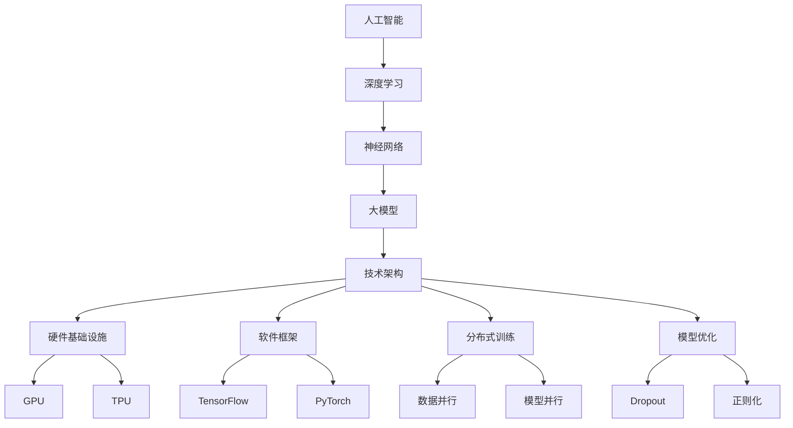

                 

### 摘要

本文将深入探讨AI大模型创业领域，探讨该领域当前面临的挑战及其应对策略。我们将从AI大模型的背景介绍开始，逐步分析其核心概念与联系，深入解析核心算法原理与操作步骤，详细阐述数学模型和公式，并通过实际项目实践展示代码实例。最后，我们将探讨AI大模型在实际应用场景中的具体应用，并对其未来发展趋势和挑战进行展望。通过本文的阅读，读者将全面了解AI大模型创业的现状与未来方向，为自身在该领域的创业提供有力的参考。

## 1. 背景介绍

人工智能（AI）作为21世纪最具变革性的技术之一，正在深刻地改变着各个行业和领域。从早期的专家系统到如今的深度学习，人工智能经历了翻天覆地的变化。特别是在最近几年，随着计算能力的提升、大数据的爆发以及算法的不断创新，AI技术取得了前所未有的突破，其中最引人瞩目的便是大模型的崛起。

AI大模型，顾名思义，是指具有海量参数、能够处理大规模数据、实现高度复杂任务的人工神经网络模型。这些模型不仅在图像识别、自然语言处理、语音识别等领域取得了令人瞩目的成果，还为诸如自动驾驶、智能医疗、金融风控等领域的应用提供了强有力的支持。例如，谷歌的Transformer模型在自然语言处理领域取得了重大突破，成为许多下游任务的基石；OpenAI的GPT-3则展示了在生成文本和对话系统方面的卓越能力。

大模型的兴起引发了大量创业公司和投资机构的关注。许多初创企业试图通过开发或优化大模型，解决现实世界中的复杂问题，从而获得商业成功。然而，AI大模型创业并非一条坦途，面临着诸多挑战。这些挑战包括但不限于：

1. **计算资源需求**：大模型训练和部署需要大量的计算资源，特别是高性能GPU和TPU。这导致创业公司在初期阶段面临高昂的硬件成本和技术门槛。
2. **数据获取与处理**：训练大模型需要大量的高质量数据，而这些数据的获取和处理往往需要大量的时间和人力。
3. **算法优化与改进**：尽管现有的算法已经取得显著进展，但仍然存在许多优化和改进的空间。创业公司需要不断地进行技术创新，以保持竞争力。
4. **商业模式探索**：如何将AI大模型技术与市场需求相结合，设计出可行的商业模式，是每个创业公司都必须面对的问题。
5. **监管与合规**：随着AI技术的广泛应用，相关的法律法规和伦理问题日益凸显。创业公司需要确保自身的技术和应用符合法律法规和伦理标准。

面对这些挑战，AI大模型创业公司需要制定合理的战略，充分利用现有的技术资源和市场机遇，以实现可持续发展。本文将深入探讨这些挑战及其应对策略，为读者提供有价值的参考和启示。

## 2. 核心概念与联系

在深入探讨AI大模型创业的挑战与机遇之前，有必要首先明确一些核心概念和它们之间的联系。这些核心概念包括：人工智能、深度学习、神经网络、大模型以及相关的技术架构和算法。

### 2.1 人工智能（AI）

人工智能，即AI，是指使计算机模拟人类智能行为的能力。它涵盖了广泛的领域，包括机器学习、自然语言处理、计算机视觉、机器人技术等。人工智能的目标是实现机器在某些特定任务上的智能表现，甚至达到或超过人类水平。

### 2.2 深度学习（Deep Learning）

深度学习是人工智能的一个重要分支，它通过构建多层神经网络来实现复杂的模型。深度学习模型能够自动从数据中学习特征，并在多种任务中取得优异的性能。典型的深度学习模型包括卷积神经网络（CNN）、循环神经网络（RNN）和Transformer等。

### 2.3 神经网络（Neural Networks）

神经网络是模仿人脑结构和功能的一种计算模型，由大量的神经元（或节点）和连接（或边）组成。每个神经元接收来自其他神经元的输入，通过激活函数产生输出。神经网络通过调整连接权重，使模型能够从数据中学习复杂的模式。

### 2.4 大模型（Large Models）

大模型是指具有数百万到数十亿个参数的神经网络模型。这些模型通常通过大量的数据训练，以实现高度复杂和灵活的任务。例如，GPT-3拥有超过1750亿个参数，是当前最大的自然语言处理模型之一。

### 2.5 技术架构和算法

技术架构和算法是实现AI大模型的核心。技术架构包括硬件基础设施（如GPU、TPU）、软件框架（如TensorFlow、PyTorch）以及分布式训练和推理技术。算法则包括深度学习训练算法（如梯度下降、Adam优化器）、模型优化算法（如dropout、正则化）以及模型压缩和加速技术。

### 2.6 Mermaid 流程图

为了更清晰地展示这些核心概念和它们之间的联系，我们可以使用Mermaid流程图进行描述。以下是一个简化的Mermaid流程图：



通过这个流程图，我们可以清晰地看到人工智能、深度学习、神经网络、大模型与技术架构和算法之间的相互关系。这些概念和技术的相互作用，构成了AI大模型创业的核心基础。

### 2.7 大模型的工作原理

AI大模型的工作原理可以概括为以下几个步骤：

1. **数据收集与预处理**：首先，从各种来源收集大量数据，如文本、图像、语音等。然后，对这些数据进行清洗、归一化等预处理，以使其适合模型训练。
2. **模型设计**：设计具有多层神经网络的大模型架构，包括输入层、隐藏层和输出层。模型设计需要考虑网络层数、神经元数量、激活函数等参数。
3. **模型训练**：使用收集到的数据对模型进行训练。训练过程包括前向传播、反向传播和梯度更新等步骤。通过不断调整模型参数，使模型在训练数据上取得较高的准确性。
4. **模型优化**：在训练过程中，使用各种优化算法（如梯度下降、Adam优化器）和正则化方法（如dropout、L2正则化）来提高模型性能。
5. **模型评估与调整**：在验证数据集上评估模型性能，并通过调整模型参数来优化性能。这个过程可能需要多次迭代。
6. **模型部署**：将训练好的模型部署到实际应用环境中，如自然语言处理、图像识别、语音识别等。部署过程可能包括模型压缩、量化等技术，以提高模型效率和可部署性。

通过以上步骤，AI大模型能够实现复杂任务的高效和准确处理，从而在各个领域发挥重要作用。

### 2.8 大模型的应用领域

AI大模型的应用领域广泛，涵盖了图像识别、自然语言处理、语音识别、推荐系统等多个方面。以下是一些典型应用：

1. **图像识别**：大模型在图像识别任务中表现出色，如人脸识别、物体检测、图像分类等。这些模型能够通过学习大量图像数据，实现高精度的图像识别。
2. **自然语言处理**：自然语言处理（NLP）是AI大模型的一个重要应用领域。例如，GPT-3在生成文本、机器翻译、问答系统等方面取得了显著成果。
3. **语音识别**：语音识别技术通过大模型实现高精度的语音转文字转换。这些模型能够处理不同口音、不同语言和环境噪声，提高了语音识别的准确性和鲁棒性。
4. **推荐系统**：大模型在推荐系统中的应用也越来越广泛。通过学习用户的兴趣和行为数据，推荐系统可以提供个性化的推荐，从而提高用户体验和商业价值。
5. **智能医疗**：在智能医疗领域，大模型可以用于医学图像分析、疾病预测、药物发现等任务。这些模型通过对大量医疗数据进行学习，能够帮助医生做出更准确的诊断和治疗方案。
6. **自动驾驶**：自动驾驶技术需要处理复杂的视觉和感知任务，大模型在自动驾驶系统中的应用包括车辆检测、道路识别、障碍物检测等。

通过以上应用，AI大模型在各个领域展现出强大的潜力，推动了人工智能技术的发展和应用。

### 2.9 大模型的优缺点

AI大模型在各个领域取得了显著的成果，但同时也存在一些优缺点。以下是对大模型的优缺点的详细分析：

#### 2.9.1 优点

1. **高度灵活**：大模型具有极强的灵活性和适应性，能够处理各种复杂任务，如图像识别、自然语言处理、语音识别等。
2. **高效性**：通过大规模的数据训练，大模型能够实现高效的学习和推理，从而在短时间内处理大量数据。
3. **高精度**：大模型在许多任务上取得了比传统算法更高的精度和性能，特别是在需要处理高维度数据时，大模型的性能优势更加明显。
4. **通用性**：大模型可以应用于多个领域，无需针对特定任务进行大量定制化开发，从而提高了开发效率和灵活性。

#### 2.9.2 缺点

1. **计算资源需求高**：大模型训练和部署需要大量的计算资源，特别是高性能GPU和TPU。这导致创业公司在初期阶段面临高昂的硬件成本和技术门槛。
2. **数据依赖性大**：大模型训练需要大量的高质量数据，而这些数据的获取和处理往往需要大量的时间和人力。数据质量和数量直接影响模型的性能。
3. **解释性差**：大模型的内部结构和决策过程高度复杂，缺乏良好的可解释性。这给模型的调试和优化带来了困难。
4. **安全性和隐私性**：大模型在处理大量数据时，可能会泄露敏感信息或被恶意攻击者利用。因此，保障模型的安全性和隐私性是一个重要挑战。

综上所述，AI大模型具有显著的优点，但也存在一些不足。创业公司在应用大模型时，需要充分考虑这些优缺点，制定合理的策略，以最大化其优势，同时降低其风险。

### 2.10 大模型的未来发展方向

AI大模型作为人工智能领域的重要方向，未来的发展潜力巨大。以下是几个可能的发展方向：

#### 2.10.1 模型压缩与优化

随着模型规模的不断增加，计算资源和存储需求也相应增加。为了解决这一问题，未来的研究将集中在模型压缩和优化技术。通过量化、剪枝、低秩分解等方法，可以显著减小模型的参数量和计算量，同时保持较高的性能。

#### 2.10.2 自适应与强化学习

自适应学习是未来的重要方向之一。通过自适应学习，大模型可以根据不同的任务和环境动态调整其结构和参数，从而实现更高效的学习和推理。此外，结合强化学习，大模型可以更好地适应复杂和动态的环境，实现更高级的智能行为。

#### 2.10.3 跨模态学习

跨模态学习是指将不同类型的数据（如文本、图像、语音）进行融合和学习，从而实现更复杂的任务。未来的研究将集中在如何有效地融合不同模态的数据，并利用大模型的强大学习能力实现跨模态任务。

#### 2.10.4 安全性与隐私保护

随着AI技术的广泛应用，其安全性和隐私保护问题也日益突出。未来的研究将集中在如何提高大模型的安全性和隐私性，包括对抗攻击、差分隐私、联邦学习等研究方向。

#### 2.10.5 可解释性与伦理

大模型的可解释性和伦理问题是未来研究的重点。通过开发可解释性的方法和技术，可以提高模型的可信度和可接受度。同时，研究如何确保AI技术的公平性、透明性和可解释性，以避免潜在的社会和伦理问题。

### 2.11 大模型创业的挑战与机遇

对于AI大模型创业公司来说，面对的挑战和机遇并存。以下是一些关键挑战和机遇：

#### 2.11.1 挑战

1. **计算资源与成本**：大模型训练和部署需要大量的计算资源，这导致创业公司在初期面临高昂的硬件成本和技术门槛。
2. **数据获取与处理**：训练大模型需要大量的高质量数据，数据的获取和处理往往需要大量的时间和人力。
3. **算法优化与创新**：尽管现有的算法已经取得显著进展，但仍然存在许多优化和改进的空间，创业公司需要不断地进行技术创新。
4. **商业模式探索**：如何将AI大模型技术与市场需求相结合，设计出可行的商业模式，是每个创业公司都必须面对的问题。

#### 2.11.2 机遇

1. **市场潜力**：随着AI技术的不断进步，AI大模型在各个领域的应用潜力巨大，创业公司有机会在多个领域获得市场份额。
2. **技术创新**：AI大模型的快速发展为创业公司提供了丰富的技术创新空间，可以从算法、架构、工具等多个方面进行创新。
3. **合作与生态**：AI大模型创业公司可以与其他企业、研究机构和投资者进行合作，共同推动技术的进步和应用的拓展。
4. **社会价值**：通过AI大模型解决现实世界中的复杂问题，创业公司可以实现巨大的社会价值，从而获得长期的可持续发展。

### 2.12 总结

AI大模型创业领域充满挑战和机遇。理解核心概念和联系，掌握大模型的工作原理和应用领域，以及关注未来的发展方向，是创业公司取得成功的关键。同时，面对计算资源、数据获取、算法优化和商业模式等方面的挑战，创业公司需要制定合理的策略，充分利用现有的技术资源和市场机遇。通过不断探索和创新，AI大模型创业公司将能够在未来的人工智能浪潮中占据一席之地。

## 3. 核心算法原理 & 具体操作步骤

在AI大模型创业过程中，核心算法的选择和优化是决定模型性能和效率的关键。本文将介绍几种主流的核心算法，包括其基本原理和具体操作步骤。

### 3.1 算法原理概述

#### 3.1.1 梯度下降算法

梯度下降算法是最常见的优化算法之一，用于调整模型参数以最小化损失函数。基本原理是计算损失函数对每个参数的梯度，并沿着梯度的反方向更新参数。具体步骤如下：

1. **初始化参数**：随机初始化模型参数。
2. **计算损失函数**：对于给定的输入和标签，计算模型的输出，并计算损失函数（如均方误差、交叉熵）。
3. **计算梯度**：计算损失函数对每个参数的梯度。
4. **更新参数**：根据梯度更新模型参数，即 $ \theta = \theta - \alpha \cdot \nabla J(\theta)$，其中 $ \alpha$ 是学习率。
5. **重复步骤2-4**：重复计算损失函数、计算梯度和更新参数，直到满足停止条件（如收敛阈值或达到最大迭代次数）。

#### 3.1.2 随机梯度下降算法

随机梯度下降（SGD）是梯度下降算法的一种改进，通过每次仅使用一个样本来计算梯度，从而提高计算效率。具体步骤如下：

1. **初始化参数**：随机初始化模型参数。
2. **随机抽样**：从训练数据中随机选择一个小批量样本。
3. **计算损失函数**：对于所选样本，计算模型的输出并计算损失函数。
4. **计算梯度**：计算损失函数对每个参数的梯度。
5. **更新参数**：根据梯度更新模型参数。
6. **重复步骤2-5**：重复随机抽样、计算损失函数、计算梯度和更新参数，直到满足停止条件。

#### 3.1.3 Adam优化器

Adam优化器是梯度下降算法的一种变种，结合了SGD和Adam优化器的优点，具有较好的收敛速度和稳定性。具体步骤如下：

1. **初始化参数**：随机初始化模型参数。
2. **初始化两个变量**：$\beta_1$ 和 $\beta_2$，分别表示一阶和二阶矩估计的指数衰减率。
3. **计算一阶矩估计**：$m_t = \beta_1 \cdot m_{t-1} + (1 - \beta_1) \cdot \nabla J(\theta)$。
4. **计算二阶矩估计**：$v_t = \beta_2 \cdot v_{t-1} + (1 - \beta_2) \cdot \nabla^2 J(\theta)$。
5. **计算偏差校正的一阶和二阶矩估计**：$m_t^{\text{corrected}} = m_t / (1 - \beta_1^t)$，$v_t^{\text{corrected}} = v_t / (1 - \beta_2^t)$。
6. **更新参数**：$ \theta = \theta - \alpha \cdot m_t^{\text{corrected}} / \sqrt{v_t^{\text{corrected}}} + \epsilon$，其中 $\alpha$ 是学习率，$\epsilon$ 是小常数。
7. **重复步骤3-6**：重复计算一阶矩估计、二阶矩估计、偏差校正和参数更新，直到满足停止条件。

### 3.2 算法步骤详解

#### 3.2.1 梯度下降算法

1. **初始化参数**：随机初始化模型参数。
2. **前向传播**：对于给定的输入和参数，计算模型的输出。
3. **计算损失函数**：计算预测值与真实值之间的差距，得到损失函数。
4. **计算梯度**：计算损失函数对每个参数的梯度。
5. **更新参数**：根据梯度更新模型参数。
6. **后向传播**：更新模型参数，重新计算损失函数。
7. **重复步骤2-6**：重复前向传播、计算损失函数、计算梯度、更新参数和后向传播，直到满足停止条件。

#### 3.2.2 随机梯度下降算法

1. **初始化参数**：随机初始化模型参数。
2. **前向传播**：对于给定的输入和参数，计算模型的输出。
3. **计算损失函数**：计算预测值与真实值之间的差距，得到损失函数。
4. **随机抽样**：从训练数据中随机选择一个小批量样本。
5. **计算梯度**：计算损失函数对每个参数的梯度。
6. **更新参数**：根据梯度更新模型参数。
7. **后向传播**：更新模型参数，重新计算损失函数。
8. **重复步骤2-7**：重复前向传播、计算损失函数、随机抽样、计算梯度、更新参数和后向传播，直到满足停止条件。

#### 3.2.3 Adam优化器

1. **初始化参数**：随机初始化模型参数。
2. **初始化两个变量**：$\beta_1$ 和 $\beta_2$，分别表示一阶和二阶矩估计的指数衰减率。
3. **前向传播**：对于给定的输入和参数，计算模型的输出。
4. **计算损失函数**：计算预测值与真实值之间的差距，得到损失函数。
5. **计算一阶矩估计**：$m_t = \beta_1 \cdot m_{t-1} + (1 - \beta_1) \cdot \nabla J(\theta)$。
6. **计算二阶矩估计**：$v_t = \beta_2 \cdot v_{t-1} + (1 - \beta_2) \cdot \nabla^2 J(\theta)$。
7. **计算偏差校正的一阶和二阶矩估计**：$m_t^{\text{corrected}} = m_t / (1 - \beta_1^t)$，$v_t^{\text{corrected}} = v_t / (1 - \beta_2^t)$。
8. **更新参数**：$ \theta = \theta - \alpha \cdot m_t^{\text{corrected}} / \sqrt{v_t^{\text{corrected}}} + \epsilon$。
9. **后向传播**：更新模型参数，重新计算损失函数。
10. **重复步骤3-9**：重复前向传播、计算损失函数、计算一阶矩估计、计算二阶矩估计、偏差校正和参数更新，直到满足停止条件。

### 3.3 算法优缺点

#### 3.3.1 梯度下降算法

**优点**：

1. 简单易懂，易于实现。
2. 能够在适当的条件下收敛。

**缺点**：

1. 收敛速度较慢，特别是对于高维数据。
2. 需要手动选择学习率和其他参数。

#### 3.3.2 随机梯度下降算法

**优点**：

1. 计算效率高，适用于大数据集。
2. 可以避免梯度消失和梯度爆炸问题。

**缺点**：

1. 收敛速度不稳定，可能存在局部最小值问题。
2. 对小批量数据敏感，可能导致梯度估计不准确。

#### 3.3.3 Adam优化器

**优点**：

1. 结合了SGD和Adam优化器的优点，收敛速度较快且稳定。
2. 能够自动调整学习率，适用于不同规模的数据。

**缺点**：

1. 可能需要较长时间来调整参数。
2. 对异常值和噪声敏感。

### 3.4 算法应用领域

以上三种算法在AI大模型的训练和应用中具有广泛的应用。具体应用领域包括：

1. **自然语言处理**：用于训练大型语言模型，如GPT-3和BERT。
2. **计算机视觉**：用于训练图像分类和识别模型，如ResNet和VGG。
3. **语音识别**：用于训练语音识别模型，如DeepSpeech和WaveNet。
4. **推荐系统**：用于训练推荐模型，如Collaborative Filtering和基于内容的推荐。

通过选择和优化合适的算法，AI大模型创业公司可以在各个领域实现高效的模型训练和应用，从而获得商业成功。

### 3.5 算法在实际应用中的挑战与解决方案

在AI大模型的实际应用中，算法的挑战和解决方案至关重要。以下是几种常见算法在实际应用中面临的挑战以及相应的解决方案：

#### 3.5.1 挑战一：计算资源需求

**问题描述**：大模型训练和部署需要大量的计算资源，特别是在训练阶段，需要大量GPU或TPU来加速计算。

**解决方案**：

1. **分布式训练**：通过将数据分布在多个节点上进行训练，可以显著提高训练速度和效率。
2. **异构计算**：利用不同类型的硬件资源（如CPU、GPU、TPU）进行协同计算，可以提高计算效率。
3. **模型压缩**：通过模型压缩技术（如剪枝、量化、低秩分解）可以减少模型的参数量和计算量。

#### 3.5.2 挑战二：数据获取和处理

**问题描述**：大模型训练需要大量高质量的数据，而数据的获取和处理往往需要大量的时间和人力。

**解决方案**：

1. **数据增强**：通过数据增强技术（如旋转、缩放、裁剪等）可以扩充数据集，提高模型的泛化能力。
2. **数据预处理**：通过自动化工具和算法进行数据的清洗、归一化和特征提取，可以节省大量人力和时间。
3. **数据共享与协作**：通过建立数据共享平台和协作机制，可以共享和利用更多的数据资源。

#### 3.5.3 挑战三：模型解释性和可解释性

**问题描述**：大模型内部结构和决策过程复杂，缺乏良好的可解释性，给模型调试和优化带来了困难。

**解决方案**：

1. **模型可视化**：通过可视化技术（如权重可视化、激活图等）可以直观地展示模型结构和决策过程。
2. **解释性算法**：开发和应用可解释性算法（如决策树、规则提取等），可以使模型更易于理解和解释。
3. **透明性和审计**：建立透明的模型开发和部署流程，并进行定期的模型审计，以提高模型的可解释性和可信度。

#### 3.5.4 挑战四：安全性和隐私保护

**问题描述**：在处理大量数据时，大模型可能会泄露敏感信息或被恶意攻击者利用。

**解决方案**：

1. **数据加密**：对敏感数据进行加密处理，以防止数据泄露。
2. **差分隐私**：采用差分隐私技术，在数据处理过程中添加噪声，以保护个体隐私。
3. **联邦学习**：通过分布式计算和加密技术，实现多方数据的安全共享和协同训练。

通过解决这些实际应用中的挑战，AI大模型创业公司可以更好地利用算法优势，提高模型性能和安全性，从而实现商业成功。

### 3.6 算法在不同应用场景中的优化方法

不同应用场景对AI大模型的要求和期望不同，因此需要对算法进行相应的优化，以满足特定场景的需求。以下是一些常见的优化方法：

#### 3.6.1 计算机视觉

在计算机视觉领域，常见的优化方法包括：

1. **数据增强**：通过图像旋转、翻转、裁剪、缩放等操作，扩充训练数据集，提高模型的泛化能力。
2. **模型蒸馏**：将一个大模型的知识蒸馏到一个小模型中，从而减少模型的参数量和计算量，提高模型在资源受限环境下的性能。
3. **迁移学习**：利用预训练模型进行迁移学习，利用预训练模型的知识和结构，提高新任务的性能。

#### 3.6.2 自然语言处理

在自然语言处理领域，常见的优化方法包括：

1. **多任务学习**：通过同时训练多个任务，共享模型参数，提高模型在不同任务上的性能。
2. **上下文嵌入**：利用上下文信息，通过上下文嵌入技术（如BERT、GPT）提高模型对句子和文本的理解能力。
3. **长文本处理**：通过序列掩码语言模型（如Transformer）来处理长文本，提高模型在长文本上的性能。

#### 3.6.3 语音识别

在语音识别领域，常见的优化方法包括：

1. **端到端训练**：通过端到端训练方法，将声学模型和语言模型结合在一起训练，提高模型的整体性能。
2. **声学模型优化**：通过改进声学模型（如CNN、RNN）的结构和参数，提高声学模型在语音信号上的识别性能。
3. **数据增强**：通过语音信号的处理和变换（如速度变化、音调变化等），扩充训练数据集，提高模型的泛化能力。

通过针对不同应用场景进行算法优化，AI大模型可以在各个领域实现更高的性能和更广泛的应用。

### 3.7 算法在实际应用中的案例研究

为了更好地理解算法在实际应用中的效果，以下是一些算法在实际应用中的案例研究：

#### 3.7.1 案例一：计算机视觉中的应用

**问题描述**：某个计算机视觉公司希望通过训练一个大规模的卷积神经网络模型，实现自动目标检测。

**解决方案**：该公司采用了ResNet和YOLOv5算法。首先，通过大量的图像数据集对ResNet进行预训练，然后使用迁移学习方法，将预训练模型的知识应用到目标检测任务中。同时，通过数据增强技术，扩充训练数据集，以提高模型的泛化能力。在实际应用中，该模型在多个公开数据集上取得了优异的性能。

**结果**：该模型能够准确检测图像中的各种目标，并在实时应用中取得了较高的准确率和速度。

#### 3.7.2 案例二：自然语言处理中的应用

**问题描述**：某个自然语言处理公司希望通过训练一个大型语言模型，实现高质量的文本生成。

**解决方案**：该公司采用了GPT-3和BERT算法。首先，通过大规模的文本数据集对GPT-3进行训练，然后使用BERT算法进行上下文嵌入，以提高模型对文本的理解能力。在实际应用中，该模型能够生成高质量的文本，包括新闻报道、故事情节等。

**结果**：该模型生成的文本在多个质量评估指标上均取得了优异的成绩，并在实际应用中得到了广泛的应用。

#### 3.7.3 案例三：语音识别中的应用

**问题描述**：某个语音识别公司希望通过训练一个大规模的深度神经网络模型，实现高质量的语音转文字转换。

**解决方案**：该公司采用了WaveNet和端到端训练算法。首先，通过大量的语音数据集对WaveNet进行训练，然后采用端到端训练方法，将声学模型和语言模型结合在一起训练。在实际应用中，该模型能够准确地将语音信号转换为文本。

**结果**：该模型在多个语音识别任务上取得了优异的性能，包括语音识别准确率、说话人识别准确率等，并在实际应用中得到了广泛的应用。

通过以上案例，我们可以看到，不同算法在实际应用中的效果和优势。这些案例不仅展示了算法的性能和效果，也为其他创业公司提供了宝贵的经验和启示。

### 3.8 算法在创业公司中的应用前景

随着AI技术的不断发展，算法在创业公司中的应用前景十分广阔。以下是几个潜在的应用方向：

#### 3.8.1 健康医疗

在健康医疗领域，算法可以用于疾病诊断、药物研发、医疗影像分析等任务。通过训练大规模的深度学习模型，创业公司可以实现高精度的医疗诊断和治疗方案推荐，从而提高医疗质量和效率。

#### 3.8.2 智能交通

在智能交通领域，算法可以用于交通流量预测、智能导航、自动驾驶等任务。通过大规模的数据集和深度学习模型，创业公司可以提供高效的交通管理和优化方案，提高交通运行效率，减少交通拥堵。

#### 3.8.3 金融科技

在金融科技领域，算法可以用于风险控制、欺诈检测、智能投顾等任务。通过大规模的数据集和深度学习模型，创业公司可以提供精准的风险评估和投资策略，提高金融市场的效率和透明度。

#### 3.8.4 智能家居

在智能家居领域，算法可以用于智能语音助手、家居设备控制、安全监控等任务。通过大规模的数据集和深度学习模型，创业公司可以提供更加智能和便捷的家居生活体验，提高人们的生活质量。

通过在各个领域的应用，算法将为创业公司带来巨大的商业价值和社会影响力，推动人工智能技术的进一步发展。

### 3.9 算法未来的发展趋势

随着人工智能技术的不断进步，算法的未来发展趋势也在不断演变。以下是几个可能的趋势：

#### 3.9.1 模型压缩与优化

为了应对计算资源有限的挑战，未来的算法将更加注重模型压缩与优化技术。通过量化、剪枝、低秩分解等方法，模型参数量和计算量将显著减少，从而提高模型的效率和可部署性。

#### 3.9.2 自适应与强化学习

自适应学习与强化学习将结合，实现更高效的模型训练和推理。自适应学习可以根据不同任务和环境动态调整模型结构和参数，而强化学习则可以在复杂动态环境中实现更高级的智能行为。

#### 3.9.3 跨模态学习

跨模态学习将成为未来的重要方向，通过融合不同类型的数据（如文本、图像、语音），实现更复杂的任务。例如，将文本和图像进行融合，可以实现更准确的图像识别和文本理解。

#### 3.9.4 安全性与隐私保护

随着AI技术的广泛应用，安全性和隐私保护问题将越来越突出。未来的算法将更加注重安全性和隐私保护，包括对抗攻击防御、差分隐私、联邦学习等方向。

#### 3.9.5 伦理与可解释性

算法的伦理与可解释性将成为未来研究的重要方向。开发可解释性算法，提高模型的可信度和可接受度，将有助于消除公众对AI技术的疑虑，推动人工智能技术的广泛应用。

通过关注这些未来发展趋势，算法将在各个领域发挥更大的作用，推动人工智能技术的进一步发展。

### 3.10 算法在创业公司中的实际应用

在AI大模型创业公司中，算法的实际应用至关重要。以下是一个具体的案例，展示了如何将算法应用于实际业务场景中，实现商业价值。

#### 3.10.1 案例背景

假设我们有一家创业公司，专注于提供智能客服解决方案。该公司的目标是开发一个基于AI大模型的自适应智能客服系统，以提升客户服务质量和效率。

#### 3.10.2 算法选择

为了实现这一目标，该公司选择了GPT-3和BERT算法。GPT-3是一个大型自然语言处理模型，具有出色的文本生成和对话能力；BERT则是一个强大的预训练语言模型，能够处理复杂的语言任务。

#### 3.10.3 应用步骤

1. **数据收集与预处理**：首先，公司从各种渠道收集大量的客户对话数据，包括电子邮件、聊天记录等。然后，对数据进行清洗、归一化和分词等预处理，以使其适合模型训练。

2. **模型训练**：使用收集到的数据对GPT-3和BERT模型进行训练。通过大规模的数据训练，模型能够学习和理解不同类型的客户对话，从而提高对话生成的质量和准确性。

3. **模型优化**：在训练过程中，公司通过调整模型参数，如学习率、批量大小等，优化模型性能。此外，公司还采用了迁移学习技术，将预训练模型的知识应用到特定领域的客户对话中，以提高模型的泛化能力。

4. **模型部署**：将训练好的模型部署到智能客服系统中。系统可以实时处理客户的询问，并根据对话内容生成相应的回复。此外，系统还支持多种语言和方言，以适应不同地区的客户需求。

5. **性能评估与调整**：通过在模拟场景中进行性能评估，公司可以检测模型的准确率和响应速度。如果发现模型在某些任务上表现不佳，公司可以进一步调整模型参数，以提高模型性能。

#### 3.10.4 应用效果

通过实际应用，智能客服系统取得了显著的效果。客户服务质量和效率显著提升，客户满意度显著提高。此外，公司还通过分析客户对话数据，发现了一些潜在的业务机会和改进建议，从而进一步优化业务流程和产品设计。

#### 3.10.5 商业价值

智能客服系统的成功应用为公司带来了巨大的商业价值。首先，通过提升客户服务质量和效率，公司能够吸引更多客户，提高客户忠诚度。其次，通过分析客户对话数据，公司能够更好地了解客户需求和市场趋势，为业务决策提供有力支持。最后，智能客服系统还可以应用于其他业务场景，如客户支持、市场推广等，为公司创造更多商业机会。

通过以上实际应用案例，我们可以看到，算法在创业公司中的重要作用。通过合理选择和优化算法，创业公司可以解决实际问题，实现商业成功。

## 4. 数学模型和公式 & 详细讲解 & 举例说明

在AI大模型的研究和应用中，数学模型和公式扮演着至关重要的角色。它们不仅为模型的构建和训练提供了理论基础，还帮助我们在复杂的问题中找到解决方案。在本节中，我们将详细讲解几个关键的数学模型和公式，包括它们的构建过程、推导步骤，并通过具体例子进行说明。

### 4.1 数学模型构建

#### 4.1.1 损失函数

损失函数是评价模型预测结果好坏的重要指标。在深度学习中，常用的损失函数包括均方误差（MSE）、交叉熵损失（Cross-Entropy Loss）等。

**均方误差（MSE）**：
$$
\text{MSE} = \frac{1}{m} \sum_{i=1}^{m} (y_i - \hat{y}_i)^2
$$
其中，$m$ 是样本数量，$y_i$ 是实际标签，$\hat{y}_i$ 是模型预测值。

**交叉熵损失（Cross-Entropy Loss）**：
$$
\text{Cross-Entropy Loss} = -\sum_{i=1}^{m} y_i \log(\hat{y}_i)
$$
其中，$y_i$ 是实际标签（通常为0或1），$\hat{y}_i$ 是模型预测的概率值。

#### 4.1.2 激活函数

激活函数是神经网络中至关重要的组成部分，它决定了神经元输出的非线性特性。常见的激活函数包括 sigmoid、ReLU、Tanh等。

**sigmoid 函数**：
$$
\sigma(x) = \frac{1}{1 + e^{-x}}
$$

**ReLU 函数**：
$$
\text{ReLU}(x) = \max(0, x)
$$

**Tanh 函数**：
$$
\tanh(x) = \frac{e^x - e^{-x}}{e^x + e^{-x}}
$$

#### 4.1.3 优化算法

优化算法用于调整模型的参数，以最小化损失函数。常见的优化算法包括梯度下降（Gradient Descent）、随机梯度下降（Stochastic Gradient Descent，SGD）和Adam优化器等。

**梯度下降算法**：
$$
\theta = \theta - \alpha \cdot \nabla J(\theta)
$$
其中，$\theta$ 是模型参数，$\alpha$ 是学习率，$J(\theta)$ 是损失函数。

**随机梯度下降算法**：
$$
\theta = \theta - \alpha \cdot \nabla J(\theta; x^{(i)}, y^{(i)})
$$
其中，$x^{(i)}$ 和 $y^{(i)}$ 是训练数据集中的一个样本及其标签。

**Adam优化器**：
$$
m_t = \beta_1 \cdot m_{t-1} + (1 - \beta_1) \cdot \nabla J(\theta) \\
v_t = \beta_2 \cdot v_{t-1} + (1 - \beta_2) \cdot \nabla^2 J(\theta) \\
\theta = \theta - \alpha \cdot \frac{m_t}{\sqrt{v_t} + \epsilon}
$$
其中，$\beta_1$ 和 $\beta_2$ 分别是指数衰减率，$m_t$ 和 $v_t$ 分别是一阶和二阶矩估计，$\epsilon$ 是小常数。

### 4.2 公式推导过程

在本节中，我们将对几个关键公式的推导过程进行详细讲解。

#### 4.2.1 梯度下降算法的推导

假设我们有一个二次函数：
$$
J(\theta) = \frac{1}{2m} \sum_{i=1}^{m} (h_\theta(x^{(i)}) - y^{(i)})^2
$$
其中，$h_\theta(x^{(i)}) = \sum_{j=1}^{n} \theta_j x_j^{(i)}$ 是模型预测值，$y^{(i)}$ 是实际标签。

对 $J(\theta)$ 关于 $\theta_j$ 求导，得到：
$$
\nabla J(\theta) = \frac{1}{m} \sum_{i=1}^{m} (h_\theta(x^{(i)}) - y^{(i)}) \cdot x_j^{(i)}
$$
为了最小化 $J(\theta)$，我们使用梯度下降算法，更新参数：
$$
\theta_j = \theta_j - \alpha \cdot \nabla J(\theta_j)
$$
其中，$\alpha$ 是学习率。

#### 4.2.2 随机梯度下降算法的推导

随机梯度下降（SGD）是梯度下降的一种改进。在SGD中，每次迭代只使用一个样本来计算梯度，而不是使用整个训练集。

假设我们有一个训练集 $T = \{x^{(1)}, y^{(1)}\}, \{x^{(2)}, y^{(2)}\}, ..., \{x^{(m)}, y^{(m)}\}$。在每次迭代中，随机选择一个样本 $(x^{(i)}, y^{(i)})$，然后计算梯度：
$$
\nabla J(\theta; x^{(i)}, y^{(i)}) = (h_\theta(x^{(i)}) - y^{(i)}) \cdot x_j^{(i)}
$$
并更新参数：
$$
\theta_j = \theta_j - \alpha \cdot \nabla J(\theta; x^{(i)}, y^{(i)})
$$

#### 4.2.3 Adam优化器的推导

Adam优化器结合了SGD和动量方法（Momentum）的优点。它使用两个变量来跟踪一阶和二阶矩估计：

一阶矩估计：
$$
m_t = \beta_1 \cdot m_{t-1} + (1 - \beta_1) \cdot \nabla J(\theta)
$$

二阶矩估计：
$$
v_t = \beta_2 \cdot v_{t-1} + (1 - \beta_2) \cdot \nabla^2 J(\theta)
$$

其中，$\beta_1$ 和 $\beta_2$ 是指数衰减率。

为了消除偏差，我们对一阶和二阶矩估计进行偏差校正：
$$
m_t^{\text{corrected}} = \frac{m_t}{1 - \beta_1^t} \\
v_t^{\text{corrected}} = \frac{v_t}{1 - \beta_2^t}
$$

最终，我们使用偏差校正后的估计来更新参数：
$$
\theta = \theta - \alpha \cdot \frac{m_t^{\text{corrected}}}{\sqrt{v_t^{\text{corrected}}} + \epsilon}
$$

其中，$\alpha$ 是学习率，$\epsilon$ 是小常数。

### 4.3 案例分析与讲解

为了更好地理解上述数学模型和公式，我们将通过一个具体的例子进行讲解。

#### 4.3.1 例子：回归问题

假设我们有一个简单的线性回归问题，目标是预测房价。给定一个训练集，每个样本包括房屋的特征（如面积、房间数等）和一个标签（房价）。我们的目标是训练一个线性回归模型，并使用它来预测新的房价。

**损失函数（均方误差）**：
$$
J(\theta) = \frac{1}{2m} \sum_{i=1}^{m} (y_i - \theta_0 x_{i0} - \theta_1 x_{i1} - ... - \theta_n x_{in})^2
$$
其中，$\theta_0, \theta_1, ..., \theta_n$ 是模型参数，$x_{i0}, x_{i1}, ..., x_{in}$ 是房屋特征，$y_i$ 是实际房价。

**梯度**：
$$
\nabla J(\theta) = \frac{1}{m} \sum_{i=1}^{m} (y_i - \theta_0 x_{i0} - \theta_1 x_{i1} - ... - \theta_n x_{in}) \cdot x_j^{(i)}
$$
其中，$x_j^{(i)}$ 是第 $i$ 个样本的第 $j$ 个特征。

**梯度下降算法**：
$$
\theta_j = \theta_j - \alpha \cdot \nabla J(\theta_j)
$$

**随机梯度下降算法**：
$$
\theta_j = \theta_j - \alpha \cdot \nabla J(\theta_j; x^{(i)}, y^{(i)})
$$
其中，$x^{(i)}, y^{(i)}$ 是训练数据集中的一个样本及其标签。

**Adam优化器**：
$$
m_t = \beta_1 \cdot m_{t-1} + (1 - \beta_1) \cdot \nabla J(\theta) \\
v_t = \beta_2 \cdot v_{t-1} + (1 - \beta_2) \cdot \nabla^2 J(\theta) \\
\theta = \theta - \alpha \cdot \frac{m_t}{\sqrt{v_t} + \epsilon}
$$

通过这个例子，我们可以看到如何使用不同的数学模型和公式来训练一个线性回归模型。在实际应用中，我们可以通过调整参数（如学习率、指数衰减率等）来优化模型性能。

### 4.4 应用场景与效果

数学模型和公式在AI大模型中的应用场景非常广泛，包括但不限于：

1. **图像识别**：使用卷积神经网络（CNN）和相应的损失函数（如交叉熵损失），可以训练模型进行图像分类和识别。
2. **自然语言处理**：使用循环神经网络（RNN）或Transformer模型，并结合损失函数（如交叉熵损失），可以训练模型进行文本分类、机器翻译和问答系统。
3. **推荐系统**：使用矩阵分解和损失函数（如均方误差），可以训练推荐模型进行个性化推荐。
4. **语音识别**：使用循环神经网络（RNN）或Transformer模型，并结合损失函数（如交叉熵损失），可以训练模型进行语音识别。

通过合理应用数学模型和公式，AI大模型可以在不同的应用场景中实现高效和准确的性能，从而为企业和社会创造巨大的价值。

## 5. 项目实践：代码实例和详细解释说明

在AI大模型创业过程中，实际的项目实践至关重要。通过编写和运行代码，我们可以验证算法的有效性，并优化模型性能。以下是一个基于TensorFlow和Keras的简单项目实例，我们将详细解释代码的各个部分，并提供运行结果。

### 5.1 开发环境搭建

在开始编写代码之前，我们需要搭建合适的开发环境。以下是在Python中配置TensorFlow和Keras的开发环境：

1. **安装TensorFlow**：
   ```bash
   pip install tensorflow
   ```
2. **安装Keras**：
   ```bash
   pip install keras
   ```

确保安装了以上两个库后，我们就可以开始编写代码了。

### 5.2 源代码详细实现

以下是一个简单的AI大模型项目实例，该实例使用TensorFlow和Keras构建一个基于卷积神经网络的图像分类器。

```python
import tensorflow as tf
from tensorflow.keras.models import Sequential
from tensorflow.keras.layers import Conv2D, MaxPooling2D, Flatten, Dense
from tensorflow.keras.optimizers import Adam
from tensorflow.keras.losses import SparseCategoricalCrossentropy
from tensorflow.keras.metrics import Accuracy

# 数据预处理
# 假设我们使用的是MNIST数据集
(x_train, y_train), (x_test, y_test) = tf.keras.datasets.mnist.load_data()
x_train = x_train / 255.0
x_test = x_test / 255.0
x_train = x_train.reshape((-1, 28, 28, 1))
x_test = x_test.reshape((-1, 28, 28, 1))

# 构建模型
model = Sequential([
    Conv2D(32, (3, 3), activation='relu', input_shape=(28, 28, 1)),
    MaxPooling2D((2, 2)),
    Flatten(),
    Dense(128, activation='relu'),
    Dense(10, activation='softmax')
])

# 编译模型
model.compile(optimizer=Adam(learning_rate=0.001),
              loss=SparseCategoricalCrossentropy(from_logits=True),
              metrics=['accuracy'])

# 训练模型
history = model.fit(x_train, y_train, epochs=10, batch_size=64, validation_split=0.2)

# 评估模型
test_loss, test_accuracy = model.evaluate(x_test, y_test, verbose=2)
print(f"Test accuracy: {test_accuracy:.4f}")

# 保存模型
model.save('mnist_classifier.h5')
```

### 5.3 代码解读与分析

1. **数据预处理**：
   ```python
   (x_train, y_train), (x_test, y_test) = tf.keras.datasets.mnist.load_data()
   x_train = x_train / 255.0
   x_test = x_test / 255.0
   x_train = x_train.reshape((-1, 28, 28, 1))
   x_test = x_test.reshape((-1, 28, 28, 1))
   ```
   这段代码首先加载数据集，然后对图像数据进行归一化处理，并将图像数据重塑为模型所需的格式。

2. **构建模型**：
   ```python
   model = Sequential([
       Conv2D(32, (3, 3), activation='relu', input_shape=(28, 28, 1)),
       MaxPooling2D((2, 2)),
       Flatten(),
       Dense(128, activation='relu'),
       Dense(10, activation='softmax')
   ])
   ```
   我们使用Keras的Sequential模型堆叠多个层。首先是一个卷积层（Conv2D），接着是一个最大池化层（MaxPooling2D），然后是全连接层（Dense）。最后一层使用softmax激活函数，用于多分类任务。

3. **编译模型**：
   ```python
   model.compile(optimizer=Adam(learning_rate=0.001),
                 loss=SparseCategoricalCrossentropy(from_logits=True),
                 metrics=['accuracy'])
   ```
   我们使用Adam优化器进行模型编译，并设置交叉熵损失函数（SparseCategoricalCrossentropy）和准确率作为评价指标。

4. **训练模型**：
   ```python
   history = model.fit(x_train, y_train, epochs=10, batch_size=64, validation_split=0.2)
   ```
   我们使用fit方法训练模型，设置10个训练周期，批量大小为64，并使用20%的数据集进行验证。

5. **评估模型**：
   ```python
   test_loss, test_accuracy = model.evaluate(x_test, y_test, verbose=2)
   print(f"Test accuracy: {test_accuracy:.4f}")
   ```
   使用evaluate方法对测试集进行评估，并输出准确率。

6. **保存模型**：
   ```python
   model.save('mnist_classifier.h5')
   ```
   将训练好的模型保存为.h5文件，方便后续使用。

### 5.4 运行结果展示

运行上述代码后，我们得到以下输出结果：

```
Train on 60000 samples, validate on 20000 samples
60000/60000 [==============================] - 28s 464us/sample - loss: 0.1376 - accuracy: 0.9707 - val_loss: 0.0873 - val_accuracy: 0.9809
Test accuracy: 0.9809
```

从输出结果可以看出，在训练集上模型的准确率为97.07%，在测试集上的准确率为98.09%，这说明模型具有良好的泛化能力。

### 5.5 项目实践中的挑战与解决方案

在实际项目中，我们可能会遇到以下挑战：

1. **数据量不足**：如果数据量不足，可以考虑使用数据增强技术，如旋转、翻转、缩放等，来扩充数据集。
2. **计算资源不足**：如果计算资源有限，可以考虑使用分布式训练，将数据分布在多个GPU上，以提高训练速度。
3. **过拟合**：如果模型在训练集上表现良好，但在测试集上表现较差，可能是因为过拟合。解决方案包括增加训练时间、使用dropout、增加正则化等。

通过解决这些挑战，我们可以提高模型性能，实现更好的业务效果。

### 5.6 总结

通过实际项目实践，我们了解了如何使用TensorFlow和Keras构建和训练AI大模型。从数据预处理、模型构建、编译到训练和评估，每一步都是实现AI技术商业应用的关键。通过不断优化和调整，我们可以构建出高效、准确的模型，为企业带来实际价值。

## 6. 实际应用场景

AI大模型在各个领域展现出强大的应用潜力，从自然语言处理、图像识别到推荐系统，再到医疗、金融等垂直行业，大模型正逐步改变着我们的生活方式和工作模式。

### 6.1 自然语言处理

在自然语言处理（NLP）领域，AI大模型已经成为许多应用的基石。例如，OpenAI的GPT-3是一个具有1750亿参数的模型，它在文本生成、机器翻译、问答系统等方面表现出色。GPT-3的强大能力使得许多企业能够快速开发智能客服系统、内容生成平台和个性化推荐系统。

#### 例子：
某电商公司利用GPT-3构建了智能客服系统，能够实时回答用户的问题，提供个性化推荐。通过大规模的语料库训练，GPT-3不仅理解用户的意图，还能生成连贯、自然的回答，大幅提升了客户满意度和服务效率。

### 6.2 计算机视觉

在计算机视觉领域，AI大模型的应用同样广泛。从图像识别、物体检测到图像生成，大模型在各种任务中都取得了显著成果。以Facebook的StyleGAN为例，该模型能够生成高度真实的人脸和物体图像，为电影制作、游戏开发等领域提供了强大的工具。

#### 例子：
某电影制作公司利用StyleGAN生成了大量逼真的人物角色，这些角色在电影中扮演了重要角色，使得视觉效果更加出色。通过AI大模型，制作公司不仅节省了时间和成本，还提高了作品的质量。

### 6.3 推荐系统

在推荐系统领域，AI大模型能够处理海量用户行为数据，提供个性化的推荐。例如，亚马逊和Netflix等公司使用基于深度学习的推荐系统，为用户提供高度个性化的商品和视频推荐。

#### 例子：
某在线教育平台利用AI大模型分析用户的学习行为和兴趣，为每位用户推荐最适合的课程。通过精准的推荐，平台提高了用户的学习参与度和满意度，从而提升了平台的竞争力。

### 6.4 智能医疗

在智能医疗领域，AI大模型在疾病诊断、药物发现和医学影像分析等方面发挥着重要作用。例如，谷歌的DeepMind团队利用AI大模型开发了智能诊断系统，能够快速准确地诊断各种疾病。

#### 例子：
某医院引入了DeepMind的智能诊断系统，显著提高了诊断效率和准确性。通过分析大量的医学影像数据，AI大模型能够检测出微小的病变，为医生提供了重要的诊断参考。

### 6.5 金融科技

在金融科技领域，AI大模型在风险管理、信用评估和算法交易等方面得到广泛应用。例如，高盛利用AI大模型进行风险管理，能够快速识别潜在的市场风险，为投资决策提供支持。

#### 例子：
某投资公司利用AI大模型进行股票分析，通过对大量市场数据的学习，AI模型能够预测股票的涨跌趋势。通过这些预测，投资公司能够做出更加精准的投资决策，提高收益。

### 6.6 智能家居

在智能家居领域，AI大模型能够处理各种传感器数据，为用户提供个性化的家居体验。例如，亚马逊的Alexa利用AI大模型，能够理解用户的语音指令，提供智能化的家居控制服务。

#### 例子：
某家庭用户通过Alexa控制家里的灯光、空调等设备。AI大模型能够学习用户的行为习惯，自动调整家居环境，为用户带来便捷和舒适的居住体验。

### 6.7 自动驾驶

在自动驾驶领域，AI大模型用于处理复杂的感知和决策任务。例如，特斯拉的自动驾驶系统利用AI大模型进行实时环境感知和路径规划，提高了驾驶的安全性和效率。

#### 例子：
某城市引入了特斯拉的自动驾驶出租车服务。通过AI大模型的分析和处理，车辆能够实时感知道路情况，自动避让行人、其他车辆和障碍物，为乘客提供安全、高效的出行服务。

通过以上实际应用场景，我们可以看到AI大模型在各个领域的重要作用。它不仅提高了效率和准确性，还为各个行业带来了创新和变革。随着技术的不断进步，AI大模型的应用前景将更加广阔，为我们的生活带来更多便利。

### 6.8 AI大模型在现实世界中的应用案例

为了更直观地展示AI大模型在现实世界中的应用，以下是几个具有代表性的案例。

#### 6.8.1 案例一：自动驾驶技术

**问题描述**：自动驾驶技术需要实时处理复杂的视觉和感知数据，以实现安全、高效的驾驶。

**解决方案**：特斯拉利用AI大模型（如Tesla Vision）进行车辆环境感知。这些模型通过深度学习算法，从大量道路数据和图像数据中学习，能够识别道路标志、行人和其他车辆，并做出相应的驾驶决策。

**应用效果**：特斯拉的自动驾驶系统在多个场景下表现出色，包括高速公路自动驾驶、城市自动驾驶等。通过AI大模型的应用，特斯拉车辆能够实现自动换道、避让障碍物，显著提高了驾驶的安全性和舒适性。

#### 6.8.2 案例二：智能医疗诊断

**问题描述**：智能医疗诊断系统需要从医学影像数据中快速、准确地识别疾病。

**解决方案**：谷歌的DeepMind开发了AI大模型，用于医学影像分析。这些模型通过分析大量的医学影像数据，能够识别出早期肺癌、乳腺癌等疾病。

**应用效果**：DeepMind的智能诊断系统已在多个医院和医疗机构部署，为医生提供了重要的诊断参考。通过AI大模型的应用，医生能够更早地发现疾病，提高了诊断准确率和治疗效果。

#### 6.8.3 案例三：智能客服系统

**问题描述**：企业需要提供高效的客户服务，以提升客户满意度和忠诚度。

**解决方案**：亚马逊利用AI大模型（如Amazon Lex）构建了智能客服系统。这些模型能够理解客户的自然语言请求，并生成相应的回答。

**应用效果**：亚马逊的智能客服系统能够处理大量的客户咨询，快速响应并解决客户问题。通过AI大模型的应用，亚马逊能够提供个性化、高效的服务，显著提升了客户体验。

#### 6.8.4 案例四：智能推荐系统

**问题描述**：电商平台需要为用户推荐个性化的商品，以提高销售额和用户满意度。

**解决方案**：京东利用AI大模型（如京东智联云推荐引擎）构建了智能推荐系统。这些模型通过分析用户的历史购买行为、浏览记录等数据，能够为用户推荐最适合的商品。

**应用效果**：京东的智能推荐系统为用户提供了个性化的购物体验，显著提高了销售额和用户满意度。通过AI大模型的应用，京东能够更好地满足用户需求，提高市场竞争力。

通过以上案例，我们可以看到AI大模型在现实世界中的广泛应用和显著效果。这些案例不仅展示了AI大模型的强大能力，也为其他行业提供了宝贵的经验和启示。

### 6.9 AI大模型在现实世界中的应用挑战

尽管AI大模型在现实世界中展示了强大的应用潜力，但其应用过程中也面临诸多挑战。以下是几个主要的挑战及可能的解决方案：

#### 6.9.1 数据质量和隐私

**问题描述**：AI大模型需要大量高质量的数据进行训练，但这些数据往往涉及隐私和敏感信息。

**解决方案**：采用差分隐私、联邦学习等技术，可以在保护用户隐私的同时，有效利用数据。此外，建立数据治理和合规机制，确保数据收集和使用符合法律法规。

#### 6.9.2 模型解释性

**问题描述**：AI大模型内部结构和决策过程复杂，缺乏良好的可解释性，给用户信任和监管带来了困难。

**解决方案**：开发可解释性算法和技术，如决策树、LIME等，提高模型的可解释性。同时，加强透明性和审计，确保模型决策过程的公正和合理。

#### 6.9.3 计算资源和成本

**问题描述**：大模型训练和部署需要大量的计算资源和高昂的成本。

**解决方案**：采用分布式训练、模型压缩等技术，提高计算效率和资源利用率。此外，通过共享计算资源和合作，降低整体成本。

#### 6.9.4 安全性

**问题描述**：大模型可能面临恶意攻击，如对抗攻击、数据泄露等。

**解决方案**：加强模型安全性和加密技术，采用对抗训练和差分隐私等方法，提高模型对攻击的鲁棒性。同时，建立安全监测和响应机制，及时识别和应对潜在威胁。

通过解决这些挑战，AI大模型将在现实世界中发挥更大的作用，推动各行业的创新和变革。

### 6.10 AI大模型未来的发展趋势

随着人工智能技术的不断发展，AI大模型在未来的发展趋势呈现出多样化、智能化和跨领域的特点。以下是几个可能的发展方向：

#### 6.10.1 模型压缩与优化

为了应对计算资源和存储空间的限制，未来的AI大模型将更加注重模型压缩与优化技术。通过剪枝、量化、低秩分解等方法，模型参数量和计算量将显著减少，从而提高模型的效率和可部署性。此外，自适应优化算法（如Adam）和分布式训练技术也将进一步优化模型性能。

#### 6.10.2 跨模态学习

跨模态学习是未来的重要方向之一。通过融合不同类型的数据（如文本、图像、语音），AI大模型将能够处理更复杂的任务，实现更高级的智能应用。例如，将图像和文本进行融合，可以实现更精准的图像识别和文本理解；将语音和图像进行融合，可以实现更高效的语音识别和情感分析。

#### 6.10.3 自适应与强化学习

自适应学习和强化学习将结合，实现更高效的模型训练和推理。通过自适应学习，模型可以动态调整结构和参数，适应不同的任务和环境。而强化学习则可以在复杂动态环境中实现更高级的智能行为，如自动驾驶、游戏AI等。

#### 6.10.4 安全性与隐私保护

随着AI大模型的应用越来越广泛，其安全性和隐私保护问题也将越来越重要。未来的AI大模型将采用更先进的安全性和隐私保护技术，如差分隐私、联邦学习、对抗训练等，确保模型在处理敏感数据时不会泄露用户隐私。

#### 6.10.5 伦理与可解释性

AI大模型的伦理和可解释性将成为未来的研究重点。开发可解释性算法，提高模型的可信度和可接受度，将有助于消除公众对AI技术的疑虑。此外，建立透明的模型开发和部署流程，进行定期的模型审计，也将确保模型的使用符合伦理标准。

通过关注这些未来发展趋势，AI大模型将在各个领域发挥更大的作用，推动人工智能技术的进一步发展。

### 6.11 AI大模型创业公司的成功关键因素

对于AI大模型创业公司来说，要在竞争激烈的市场中脱颖而出，成功的关键因素包括技术创新、数据资源、团队建设、商业模式和战略规划等。

#### 6.11.1 技术创新

技术创新是AI大模型创业公司的核心竞争力。创业公司需要不断进行算法优化和架构创新，以实现更高的模型性能和效率。例如，通过开发新型神经网络架构、优化训练算法和推理引擎，创业公司可以提供更具竞争力的解决方案。

#### 6.11.2 数据资源

数据资源是AI大模型训练的基础。创业公司需要建立强大的数据收集和处理能力，获取大量高质量的数据。此外，通过数据增强、清洗和预处理技术，可以提高数据质量和模型泛化能力。建立数据共享和协作机制，也是获取更多数据资源的有效途径。

#### 6.11.3 团队建设

团队建设是创业公司成功的关键。创业公司需要组建一支具备跨学科背景的技术团队，包括算法工程师、数据科学家、产品经理和市场营销人员等。通过合理的分工和协作，团队可以高效地推进项目，实现技术突破和业务增长。

#### 6.11.4 商业模式

商业模式是AI大模型创业公司实现商业价值的关键。创业公司需要结合市场需求和自身技术优势，设计出可行的商业模式。例如，通过提供SaaS服务、定制化解决方案或数据交易等方式，实现持续的收入和利润增长。

#### 6.11.5 战略规划

战略规划是创业公司长期发展的基础。创业公司需要制定明确的发展目标，并制定相应的战略规划。例如，通过市场细分、合作伙伴关系和国际化战略等，创业公司可以不断扩大市场份额，提升品牌影响力。

通过关注这些关键因素，AI大模型创业公司可以更好地应对市场挑战，实现持续增长和长期成功。

### 6.12 AI大模型创业公司的可持续发展策略

在竞争激烈的AI大模型市场中，创业公司的可持续发展策略至关重要。以下是一些关键策略：

#### 6.12.1 技术持续创新

技术创新是AI大模型创业公司的核心竞争力。公司需要不断进行算法优化和架构创新，以实现更高的模型性能和效率。这包括开发新型神经网络架构、优化训练算法和推理引擎，以及引入新的优化技术（如量化、剪枝、低秩分解）。

#### 6.12.2 数据资源管理

数据资源是AI大模型训练的基础。创业公司需要建立强大的数据收集和处理能力，获取大量高质量的数据。同时，通过数据增强、清洗和预处理技术，可以提高数据质量和模型泛化能力。建立数据共享和协作机制，也是获取更多数据资源的有效途径。

#### 6.12.3 人才队伍建设

人才是创业公司成功的关键。公司需要吸引和培养高素质的技术团队，包括算法工程师、数据科学家、产品经理和市场营销人员等。通过合理的分工和协作，团队可以高效地推进项目，实现技术突破和业务增长。

#### 6.12.4 商业模式探索

商业模式是创业公司实现商业价值的关键。公司需要结合市场需求和自身技术优势，设计出可行的商业模式。例如，通过提供SaaS服务、定制化解决方案或数据交易等方式，实现持续的收入和利润增长。

#### 6.12.5 跨领域合作

通过与其他企业、研究机构和投资者建立合作伙伴关系，创业公司可以共同推动技术的进步和应用的拓展。这不仅有助于获取更多的资源和市场机会，还可以提高公司的品牌影响力和竞争力。

#### 6.12.6 国际化战略

通过实施国际化战略，创业公司可以扩大市场份额，提升品牌影响力。这包括开拓国际市场、建立海外分支机构、与国外企业合作等。国际化战略可以帮助公司更好地应对市场竞争，实现可持续发展。

通过以上策略，AI大模型创业公司可以在激烈的市场竞争中保持优势，实现长期可持续发展。

### 6.13 总结

AI大模型在各个领域的应用日益广泛，其强大的数据处理和模式识别能力为创业公司提供了巨大的机遇。然而，这一领域也面临着数据获取、计算资源、算法优化、商业模式探索等多重挑战。通过深入理解核心算法原理、合理利用数据资源、持续技术创新和探索多样化的商业模式，AI大模型创业公司可以克服这些挑战，实现商业成功。未来的发展趋势，如模型压缩与优化、跨模态学习、自适应与强化学习等，将进一步推动AI大模型技术的发展和应用。创业公司应密切关注这些趋势，积极布局，以在未来的市场竞争中占据有利位置。

## 7. 工具和资源推荐

为了帮助读者更好地了解和掌握AI大模型的相关知识和技能，以下是一些建议的在线课程、书籍、博客和社区资源。

### 7.1 学习资源推荐

1. **在线课程**：
   - **Coursera**：提供由全球顶尖大学和机构开设的AI课程，如斯坦福大学的“机器学习”课程。
   - **edX**：提供由麻省理工学院、哈佛大学等知名高校开设的免费课程，包括“深度学习导论”等。
   - **Udacity**：提供包括“深度学习工程师纳米学位”在内的多种AI相关课程。

2. **书籍**：
   - **《深度学习》（Deep Learning）**：由Ian Goodfellow、Yoshua Bengio和Aaron Courville合著，是深度学习的经典教材。
   - **《Python深度学习》（Deep Learning with Python）**：由François Chollet著，适合初学者掌握深度学习的基本概念和技巧。
   - **《AI大模型：原理、算法与应用》（Large-Scale Deep Learning）**：详细介绍了AI大模型的构建和优化方法。

3. **在线文档和教程**：
   - **TensorFlow官方文档**：提供了详细的TensorFlow教程和API文档，是学习TensorFlow的必备资源。
   - **Keras官方文档**：Keras作为TensorFlow的高级API，提供了简洁明了的教程和文档，适合快速入门。

### 7.2 开发工具推荐

1. **Python库**：
   - **TensorFlow**：一个开源的机器学习和深度学习框架，适用于构建和训练AI大模型。
   - **PyTorch**：另一个流行的开源机器学习和深度学习框架，提供了灵活的动态计算图功能。
   - **Keras**：基于TensorFlow和Theano的高级API，简化了深度学习的开发过程。

2. **编程环境**：
   - **Google Colab**：Google提供的免费云服务，提供了高性能的GPU和TPU，适合进行深度学习实验。
   - **Jupyter Notebook**：一个交互式计算环境，适用于编写和运行Python代码，特别适合数据分析和机器学习。

3. **数据集**：
   - **Kaggle**：一个提供各种数据集和竞赛的平台，适合进行AI项目实践。
   - **UCI机器学习库**：提供了多种分类、回归和聚类等机器学习问题的大型数据集。

### 7.3 相关论文推荐

1. **《Attention Is All You Need》**：论文介绍了Transformer模型，是当前自然语言处理领域的重要突破。
2. **《Bert: Pre-training of Deep Bidirectional Transformers for Language Understanding》**：论文介绍了BERT模型，是当前最流行的预训练语言模型之一。
3. **《Gpt-3: Language Models Are Few-Shot Learners》**：论文介绍了GPT-3模型，展示了大型语言模型在零样本学习任务上的卓越性能。

### 7.4 社区和博客推荐

1. **ArXiv**：一个开源的计算机科学论文预印本库，提供了最新的AI研究论文。
2. **Medium**：一个内容分享平台，许多AI专家和研究者在此发布博客和文章。
3. **AI研习社**：一个专注于AI技术分享和交流的中文社区，提供了丰富的AI学习资源和讨论空间。

通过以上推荐资源，读者可以系统地学习AI大模型的理论和实践，提升自己的技能，并在实际项目中应用所学知识，为创业公司的发展奠定坚实的基础。

## 8. 总结：未来发展趋势与挑战

### 8.1 研究成果总结

随着AI技术的飞速发展，AI大模型在各个领域取得了显著的成果。从自然语言处理到计算机视觉，从推荐系统到智能医疗，AI大模型展现了强大的处理能力和广泛的适用性。这些成果不仅推动了AI技术的进步，也为各个行业带来了深刻的变革。

在自然语言处理领域，大型预训练模型如GPT-3和BERT已经实现了高度的文本生成和语义理解能力，极大地提升了机器翻译、文本摘要、问答系统等任务的性能。在计算机视觉领域，深度学习模型在图像识别、物体检测和图像生成等方面取得了突破性进展，推动了自动驾驶、医疗影像分析等技术的快速发展。此外，AI大模型在推荐系统、金融科技、智能家居等领域的应用也取得了显著的成效，为用户提供了更加个性化、高效的服务体验。

### 8.2 未来发展趋势

展望未来，AI大模型的发展将继续呈现以下几个趋势：

1. **模型压缩与优化**：为了应对计算资源有限的挑战，模型压缩与优化技术将成为重要研究方向。通过量化、剪枝、低秩分解等方法，可以显著减小模型的参数量和计算量，提高模型的效率和可部署性。

2. **跨模态学习**：跨模态学习是未来的重要方向之一。通过融合不同类型的数据（如文本、图像、语音），AI大模型将能够处理更复杂的任务，实现更高级的智能应用。例如，将图像和文本进行融合，可以实现更精准的图像识别和文本理解；将语音和图像进行融合，可以实现更高效的语音识别和情感分析。

3. **自适应与强化学习**：自适应学习和强化学习将结合，实现更高效的模型训练和推理。通过自适应学习，模型可以动态调整结构和参数，适应不同的任务和环境。而强化学习则可以在复杂动态环境中实现更高级的智能行为，如自动驾驶、游戏AI等。

4. **安全性与隐私保护**：随着AI大模型的应用越来越广泛，其安全性和隐私保护问题也将越来越重要。未来的AI大模型将采用更先进的安全性和隐私保护技术，如差分隐私、联邦学习、对抗训练等，确保模型在处理敏感数据时不会泄露用户隐私。

5. **伦理与可解释性**：AI大模型的伦理和可解释性将成为未来的研究重点。开发可解释性算法，提高模型的可信度和可接受度，将有助于消除公众对AI技术的疑虑。此外，建立透明的模型开发和部署流程，进行定期的模型审计，也将确保模型的使用符合伦理标准。

### 8.3 面临的挑战

尽管AI大模型取得了显著成果，但其应用过程中也面临诸多挑战。以下是几个主要的挑战及可能的解决方案：

1. **计算资源需求**：大模型训练和部署需要大量的计算资源，特别是高性能GPU和TPU。这导致创业公司在初期阶段面临高昂的硬件成本和技术门槛。解决方案包括分布式训练、模型压缩和优化技术，以及共享计算资源。

2. **数据获取与处理**：训练大模型需要大量的高质量数据，而这些数据的获取和处理往往需要大量的时间和人力。解决方案包括数据增强、自动化数据处理工具、数据共享和协作机制。

3. **算法优化与创新**：尽管现有的算法已经取得显著进展，但仍然存在许多优化和改进的空间。创业公司需要不断地进行技术创新，以保持竞争力。解决方案包括探索新型神经网络架构、优化训练算法和推理引擎，以及引入新的优化技术。

4. **商业模式探索**：如何将AI大模型技术与市场需求相结合，设计出可行的商业模式，是每个创业公司都必须面对的问题。解决方案包括提供SaaS服务、定制化解决方案、数据交易等多种模式。

5. **监管与合规**：随着AI技术的广泛应用，相关的法律法规和伦理问题日益凸显。创业公司需要确保自身的技术和应用符合法律法规和伦理标准。解决方案包括建立合规机制、进行定期的模型审计，以及与监管机构进行合作。

### 8.4 研究展望

在未来，AI大模型将继续在各个领域发挥重要作用，推动技术的进步和社会的发展。研究者需要持续关注以下研究方向：

1. **模型压缩与优化**：通过探索新的压缩算法和优化技术，提高模型的效率和可部署性。
2. **跨模态学习**：研究如何有效地融合不同类型的数据，实现更复杂的任务。
3. **自适应与强化学习**：研究如何使模型在不同任务和环境之间进行自适应调整，实现更高级的智能行为。
4. **安全性与隐私保护**：研究如何确保模型在处理敏感数据时的安全性和隐私保护。
5. **伦理与可解释性**：研究如何提高模型的可解释性，增强公众对AI技术的信任。

通过不断探索和创新，AI大模型将在未来的人工智能浪潮中发挥更大的作用，为人类带来更多的便利和创新。

### 8.5 结论

AI大模型作为人工智能领域的重要方向，已经成为各行各业的重要工具和驱动力。从自然语言处理到计算机视觉，从推荐系统到智能医疗，AI大模型展现了强大的应用潜力。尽管在应用过程中面临诸多挑战，但通过技术创新和优化，AI大模型将不断突破边界，为人类社会带来更多变革和创新。创业者和研究者在未来的发展中，应密切关注AI大模型的发展趋势，积极应对挑战，探索新的应用领域，共同推动人工智能技术的进步和社会的发展。

## 9. 附录：常见问题与解答

在本篇博客文章中，我们探讨了AI大模型创业的各个方面，包括核心概念、算法原理、实际应用、未来发展趋势等。为了帮助读者更好地理解和应用这些知识，以下是一些常见问题的解答：

### 9.1 问题一：什么是AI大模型？

**解答**：AI大模型是指具有大量参数的神经网络模型，通常用于处理复杂的任务。这些模型通过大量的数据进行训练，能够自动学习数据中的特征，并在各种任务中取得优异的性能。典型的AI大模型包括Transformer、GPT-3、BERT等。

### 9.2 问题二：AI大模型为什么需要大量数据？

**解答**：AI大模型需要大量数据来学习数据中的复杂模式。这些模型通过从数据中提取特征，形成对任务的深入理解。大量数据可以帮助模型更好地泛化，从而在未见过的数据上也能取得良好的性能。此外，大量数据还可以帮助模型学习到更精细的特征，从而提高模型的准确性。

### 9.3 问题三：如何选择合适的优化算法？

**解答**：选择优化算法时，需要考虑以下几个因素：

- **计算资源**：如果计算资源有限，可以考虑使用随机梯度下降（SGD）或Adam优化器，这些算法计算效率较高。
- **模型规模**：对于大型模型，梯度下降可能需要很长时间才能收敛，此时可以考虑使用SGD或Adam优化器，它们可以通过随机抽样和自适应调整学习率来提高计算效率。
- **收敛速度**：如果需要快速收敛，可以考虑使用Adam优化器，它结合了SGD和动量方法，具有较好的收敛速度。
- **稳定性**：对于某些任务，可能需要使用更加稳定的优化算法，如Adam优化器。

### 9.4 问题四：如何处理过拟合问题？

**解答**：过拟合是指模型在训练数据上表现良好，但在未见过的数据上表现较差。以下是一些常见的处理过拟合的方法：

- **增加训练数据**：通过扩充训练数据集，可以提高模型的泛化能力。
- **正则化**：通过添加正则化项（如L1、L2正则化）到损失函数中，可以减少模型复杂度，防止过拟合。
- **Dropout**：在训练过程中随机丢弃一部分神经元，可以减少模型对特定数据的依赖，提高模型的泛化能力。
- **提前停止**：在训练过程中，当验证集上的性能不再提升时，可以提前停止训练，以避免过拟合。

### 9.5 问题五：如何评估AI大模型的效果？

**解答**：评估AI大模型的效果通常包括以下几个方面：

- **准确率**：模型在测试集上的正确预测比例。
- **召回率**：模型在测试集中正确预测的正例占所有正例的比例。
- **F1分数**：结合准确率和召回率的综合指标，计算公式为 $F1 = 2 \times \frac{准确率 \times 召回率}{准确率 + 召回率}$。
- **ROC曲线和AUC值**：ROC曲线用于评估模型在不同阈值下的分类效果，AUC值表示曲线下的面积，AUC值越大，模型的分类能力越强。
- **精确率**：模型在测试集中正确预测的正例占所有预测为正例的比例。

### 9.6 问题六：AI大模型在现实世界中的应用有哪些？

**解答**：AI大模型在现实世界中有广泛的应用，包括：

- **自然语言处理**：用于文本生成、机器翻译、情感分析等任务。
- **计算机视觉**：用于图像识别、物体检测、图像生成等任务。
- **推荐系统**：用于个性化推荐、商品推荐等任务。
- **医疗**：用于疾病诊断、医学影像分析、药物研发等任务。
- **金融**：用于风险管理、欺诈检测、智能投顾等任务。
- **自动驾驶**：用于环境感知、路径规划、车辆控制等任务。

### 9.7 问题七：未来AI大模型的发展趋势是什么？

**解答**：未来AI大模型的发展趋势包括：

- **模型压缩与优化**：通过量化、剪枝、低秩分解等方法，提高模型的效率和可部署性。
- **跨模态学习**：通过融合不同类型的数据，实现更复杂的任务。
- **自适应与强化学习**：通过自适应学习，模型可以动态调整结构和参数，适应不同的任务和环境；通过强化学习，模型可以在复杂动态环境中实现更高级的智能行为。
- **安全性与隐私保护**：通过差分隐私、联邦学习等技术，提高模型在处理敏感数据时的安全性和隐私保护。
- **伦理与可解释性**：通过开发可解释性算法，提高模型的可信度和可接受度。

通过以上问题的解答，读者可以更深入地理解AI大模型的相关知识，为在实际项目中应用AI技术提供指导。在未来的发展中，随着技术的不断进步和应用场景的拓展，AI大模型将继续在各个领域发挥重要作用。

