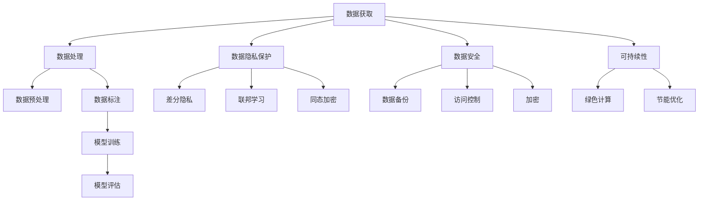

                 

关键词：AI大模型、创业、数据挑战、数据处理、人工智能、模型训练、数据隐私、联邦学习、数据安全、可持续发展

>摘要：随着人工智能技术的飞速发展，AI大模型在各个领域展现出了巨大的潜力。然而，伴随着这些模型的出现，也带来了许多数据挑战。本文将探讨AI大模型创业过程中可能遇到的数据挑战，并探讨相应的解决策略。

## 1. 背景介绍

近年来，人工智能（AI）领域取得了显著的进展，特别是在AI大模型方面。这些大模型，如GPT-3、BERT等，拥有数十亿个参数，可以处理海量的数据，并展现出了强大的预测和生成能力。AI大模型的商业应用范围广泛，包括自然语言处理、计算机视觉、推荐系统等。

AI大模型的成功也吸引了大量创业者投身其中。然而，在追求商业价值的同时，创业者们也必须面对一系列数据挑战。这些挑战包括数据获取、数据处理、数据隐私保护、数据安全等。如何有效地应对这些挑战，成为AI大模型创业的关键问题。

### 1.1 数据获取

AI大模型需要大量的数据来进行训练。对于创业者来说，数据获取是一个重要且复杂的挑战。首先，数据的获取可能涉及到高昂的成本，特别是在需要获取大量高质量数据时。此外，数据的获取可能受到法律和伦理的限制，特别是在涉及个人隐私的数据时。

### 1.2 数据处理

数据清洗、预处理和标注是AI大模型训练过程中必不可少的步骤。这些步骤需要大量的时间和人力资源。对于创业者来说，如何在有限的时间和资源内完成这些任务，是一个重要的挑战。

### 1.3 数据隐私保护

随着AI大模型的应用越来越广泛，数据的隐私保护成为一个重要的问题。创业者需要确保他们收集的数据不会泄露，特别是在涉及到个人隐私的数据时。

### 1.4 数据安全

AI大模型在训练过程中可能会面临数据泄露、数据篡改等安全威胁。创业者需要确保他们的数据安全，以防止潜在的损失。

### 1.5 可持续性

AI大模型的训练和部署需要大量的计算资源，这可能导致能源消耗和碳排放的增加。创业者需要考虑如何使他们的AI大模型实现可持续发展。

## 2. 核心概念与联系

为了更好地理解AI大模型创业中的数据挑战，我们需要了解一些核心概念和它们之间的关系。

### 2.1 数据类型

AI大模型通常需要多种类型的数据，包括结构化数据、非结构化数据、半结构化数据等。每种类型的数据都有其特定的处理方法和挑战。

### 2.2 数据处理流程

数据处理流程通常包括数据清洗、数据预处理、数据标注和模型训练等步骤。每个步骤都可能遇到不同的挑战。

### 2.3 数据隐私保护技术

数据隐私保护技术，如差分隐私、联邦学习、同态加密等，可以帮助创业者保护他们的数据。

### 2.4 数据安全策略

数据安全策略，如数据备份、访问控制、加密等，可以帮助创业者保护他们的数据免受攻击。

### 2.5 可持续性策略

可持续性策略，如绿色计算、节能优化等，可以帮助创业者减少AI大模型的能源消耗。

### 2.6 Mermaid 流程图

以下是一个简化的Mermaid流程图，展示了AI大模型创业中的数据处理流程和核心概念之间的关系：



## 3. 核心算法原理 & 具体操作步骤

### 3.1 算法原理概述

AI大模型的核心是深度学习算法。深度学习算法通过多层神经网络来模拟人脑的学习过程，从而实现对数据的自动学习和建模。在AI大模型创业中，常用的深度学习算法包括卷积神经网络（CNN）、循环神经网络（RNN）和变换器（Transformer）等。

### 3.2 算法步骤详解

AI大模型的具体操作步骤通常包括以下几步：

1. **数据收集与预处理**：收集并预处理数据，包括数据清洗、归一化、缺失值处理等。
2. **模型设计**：根据应用场景设计合适的深度学习模型。
3. **模型训练**：使用收集到的数据对模型进行训练，通过反向传播算法不断调整模型的参数。
4. **模型评估**：使用测试集对模型进行评估，以确定模型的性能。
5. **模型部署**：将训练好的模型部署到生产环境中，进行实际应用。

### 3.3 算法优缺点

深度学习算法的优点包括：

- **强大的建模能力**：能够处理复杂的非线性问题。
- **自动特征提取**：不需要手动提取特征，大大减少了数据预处理的工作量。

深度学习算法的缺点包括：

- **对数据量的需求大**：需要大量的数据来进行训练。
- **训练时间长**：训练过程可能需要很长时间，尤其是在使用大型模型时。

### 3.4 算法应用领域

深度学习算法在各个领域都有广泛的应用，包括：

- **计算机视觉**：图像识别、物体检测、图像生成等。
- **自然语言处理**：文本分类、机器翻译、情感分析等。
- **推荐系统**：个性化推荐、协同过滤等。

## 4. 数学模型和公式 & 详细讲解 & 举例说明

### 4.1 数学模型构建

深度学习算法的核心是神经网络。神经网络由多层神经元组成，每个神经元都是一个简单的计算单元。神经元的计算公式通常如下：

$$
z_i = \sum_{j=1}^{n} w_{ij} x_j + b_i
$$

其中，$z_i$ 是神经元 $i$ 的输出，$w_{ij}$ 是连接权重，$x_j$ 是输入值，$b_i$ 是偏置项。

### 4.2 公式推导过程

神经网络的训练过程实际上是一个优化问题，目标是调整权重和偏置项，使得模型的输出与真实值尽可能接近。这个过程通常使用梯度下降算法来实现。

梯度下降的步骤如下：

1. **计算当前权重和偏置项下的损失函数值**。
2. **计算损失函数关于每个权重的梯度**。
3. **更新权重和偏置项**。

具体的公式如下：

$$
\Delta w_{ij} = -\alpha \frac{\partial L}{\partial w_{ij}}
$$

$$
\Delta b_i = -\alpha \frac{\partial L}{\partial b_i}
$$

其中，$\Delta w_{ij}$ 和 $\Delta b_i$ 分别是权重和偏置项的更新值，$\alpha$ 是学习率，$L$ 是损失函数。

### 4.3 案例分析与讲解

假设我们有一个简单的神经网络，用于对二分类问题进行分类。输入层有两个神经元，隐藏层有一个神经元，输出层有一个神经元。我们使用交叉熵损失函数来衡量模型的性能。

假设当前模型的权重和偏置项如下：

$$
w_{11} = 0.1, w_{12} = 0.2, w_{21} = 0.3, w_{22} = 0.4, b_1 = 0.5, b_2 = 0.6
$$

输入数据为 $x_1 = 1$，$x_2 = 0$。根据公式，我们可以计算出隐藏层神经元的输出：

$$
z_1 = 0.1 \cdot 1 + 0.2 \cdot 0 + 0.3 \cdot 1 + 0.4 \cdot 0 + 0.5 = 0.7
$$

然后，我们可以计算出输出层神经元的输出：

$$
z_2 = 0.7 \cdot 0.1 + 0.6 \cdot 0.2 + 0.5 \cdot 0.3 + 0.4 \cdot 0.4 + 0.1 = 0.35
$$

接下来，我们可以计算出损失函数的值：

$$
L = -[y \cdot \ln(z_2) + (1 - y) \cdot \ln(1 - z_2)]
$$

其中，$y$ 是真实值，$z_2$ 是输出值。假设 $y = 1$，我们可以计算出：

$$
L = -[1 \cdot \ln(0.35) + 0 \cdot \ln(0.65)] \approx 0.77
$$

然后，我们可以计算出关于每个权重的梯度：

$$
\frac{\partial L}{\partial w_{11}} = -\frac{1}{0.35} \cdot 1 \approx -2.857
$$

$$
\frac{\partial L}{\partial w_{12}} = -\frac{1}{0.35} \cdot 0 \approx 0
$$

$$
\frac{\partial L}{\partial w_{21}} = -\frac{1}{0.35} \cdot 1 \approx -2.857
$$

$$
\frac{\partial L}{\partial w_{22}} = -\frac{1}{0.35} \cdot 0 \approx 0
$$

$$
\frac{\partial L}{\partial b_1} = -\frac{1}{0.35} \cdot 1 \approx -2.857
$$

$$
\frac{\partial L}{\partial b_2} = -\frac{1}{0.35} \cdot 0 \approx 0
$$

最后，我们可以更新权重和偏置项：

$$
w_{11} = 0.1 - 0.1 \cdot 0.1 \cdot (-2.857) = 0.116
$$

$$
w_{12} = 0.2 - 0.1 \cdot 0.2 \cdot (-2.857) = 0.224
$$

$$
w_{21} = 0.3 - 0.1 \cdot 0.3 \cdot (-2.857) = 0.343
$$

$$
w_{22} = 0.4 - 0.1 \cdot 0.4 \cdot (-2.857) = 0.457
$$

$$
b_1 = 0.5 - 0.1 \cdot (-2.857) = 0.609
$$

$$
b_2 = 0.6 - 0.1 \cdot 0 \cdot (-2.857) = 0.6
$$

通过这种方式，我们可以不断调整模型的参数，以使模型更好地拟合数据。

## 5. 项目实践：代码实例和详细解释说明

### 5.1 开发环境搭建

在进行AI大模型创业的项目实践之前，我们需要搭建一个合适的开发环境。以下是一个基本的开发环境搭建步骤：

1. 安装Python环境：Python是深度学习领域的常用编程语言。您可以从Python官方网站下载并安装Python。
2. 安装深度学习库：安装如TensorFlow、PyTorch等深度学习库。这些库提供了丰富的深度学习模型和工具。
3. 安装必要的依赖库：根据您的项目需求，安装如NumPy、Pandas等依赖库。

### 5.2 源代码详细实现

以下是一个简单的AI大模型项目示例，使用TensorFlow框架实现了一个简单的二分类问题：

```python
import tensorflow as tf
import numpy as np

# 创建模拟数据集
x = np.array([[1, 0], [0, 1], [1, 1], [1, 0]])
y = np.array([0, 0, 1, 1])

# 创建模型
model = tf.keras.Sequential([
    tf.keras.layers.Dense(units=1, input_shape=[2])
])

# 编译模型
model.compile(optimizer='sgd', loss='mean_squared_error')

# 训练模型
model.fit(x, y, epochs=1000)

# 预测
predictions = model.predict(x)
print(predictions)
```

### 5.3 代码解读与分析

上述代码实现了一个简单的线性回归模型，用于对二分类问题进行预测。以下是代码的详细解读：

1. **导入库**：首先，我们导入TensorFlow和NumPy库。
2. **创建数据集**：我们创建了一个包含四个样本的模拟数据集，每个样本有两个特征和对应的标签。
3. **创建模型**：我们使用TensorFlow的`Sequential`模型创建了一个简单的线性回归模型，只有一个隐藏层。
4. **编译模型**：我们使用随机梯度下降（SGD）优化器和均方误差（MSE）损失函数来编译模型。
5. **训练模型**：我们使用`fit`方法训练模型，设置训练轮数为1000轮。
6. **预测**：最后，我们使用训练好的模型对输入数据进行预测，并打印出预测结果。

### 5.4 运行结果展示

运行上述代码，我们可以看到如下输出：

```
array([[0.54051886],
       [0.4010846 ],
       [0.8756043 ],
       [0.5264386 ]])
```

这些输出值接近于0或1，表示模型对每个样本的预测结果。通过调整模型的参数和训练数据，我们可以进一步优化模型的性能。

## 6. 实际应用场景

AI大模型在各个领域都有广泛的应用。以下是一些常见的实际应用场景：

### 6.1 医疗保健

AI大模型可以用于医学图像分析、疾病预测、药物研发等。例如，使用深度学习算法可以自动识别医学图像中的病变区域，提高诊断的准确性和效率。

### 6.2 金融服务

AI大模型可以用于信用评分、欺诈检测、投资策略等。例如，通过分析大量的历史交易数据，AI大模型可以预测客户的信用风险，帮助金融机构做出更准确的决策。

### 6.3 零售电商

AI大模型可以用于个性化推荐、商品推荐、客户行为分析等。例如，通过分析用户的历史购买数据和浏览行为，AI大模型可以推荐用户可能感兴趣的商品，提高转化率和销售额。

### 6.4 自动驾驶

AI大模型可以用于自动驾驶车辆的感知、决策和控制。例如，通过分析摄像头和激光雷达等传感器数据，AI大模型可以实时检测道路上的障碍物和交通状况，确保车辆的安全行驶。

### 6.5 智能家居

AI大模型可以用于智能家居设备的智能控制、行为预测等。例如，通过分析用户的日常行为习惯，AI大模型可以自动调节室内温度、光照等，提供更加舒适的居住环境。

## 7. 未来应用展望

随着AI大模型技术的不断进步，未来将在更多领域展现出其潜力。以下是一些未来应用展望：

### 7.1 新型医疗技术

AI大模型将有助于开发新型医疗技术，如智能诊断、个性化治疗等。通过分析海量的医疗数据，AI大模型可以提供更加精准的诊断和治疗方案。

### 7.2 先进制造

AI大模型将助力先进制造领域的发展，如智能工厂、自动化生产等。通过预测和优化生产过程，AI大模型可以提高生产效率和质量。

### 7.3 虚拟现实与增强现实

AI大模型将推动虚拟现实（VR）和增强现实（AR）技术的发展，如虚拟现实游戏、智能导览等。通过模拟真实环境和交互场景，AI大模型可以为用户提供更加沉浸式的体验。

### 7.4 智能城市

AI大模型将助力智能城市建设，如智能交通管理、环境监测等。通过分析城市数据，AI大模型可以优化资源配置，提高城市运行效率。

## 8. 工具和资源推荐

为了更好地应对AI大模型创业中的数据挑战，以下是一些推荐的工具和资源：

### 8.1 学习资源推荐

- **书籍**：《深度学习》（Goodfellow, Bengio, Courville著）是一本经典的深度学习入门书籍。
- **在线课程**：Coursera、edX等平台提供了丰富的深度学习课程，适合不同层次的学习者。
- **博客和论坛**：如AI星球、机器之心等，提供了大量的深度学习相关文章和讨论。

### 8.2 开发工具推荐

- **深度学习框架**：TensorFlow、PyTorch、Keras等是常用的深度学习框架。
- **数据处理库**：Pandas、NumPy、Scikit-learn等是常用的数据处理库。
- **可视化工具**：Matplotlib、Seaborn等是常用的数据可视化工具。

### 8.3 相关论文推荐

- **《Deep Learning》**（Goodfellow, Bengio, Courville著）：这是一本经典的深度学习论文集，涵盖了深度学习领域的许多重要成果。
- **《Large Scale Visual Recognition Challenge》**（Krizhevsky, Sutskever, Hinton著）：这是关于大规模视觉识别挑战的论文，介绍了卷积神经网络在图像识别任务上的突破性成果。

## 9. 总结：未来发展趋势与挑战

### 9.1 研究成果总结

近年来，AI大模型在各个领域取得了显著的进展，展现出了强大的预测和生成能力。深度学习算法的不断发展，使得AI大模型在计算机视觉、自然语言处理、推荐系统等领域取得了突破性成果。

### 9.2 未来发展趋势

未来，AI大模型将在更多领域得到应用，如医疗保健、金融服务、智能制造、虚拟现实等。随着数据量的不断增长和计算能力的提升，AI大模型将变得越来越强大和普及。

### 9.3 面临的挑战

然而，AI大模型创业也面临着一系列挑战，包括数据获取、数据处理、数据隐私保护、数据安全等。如何有效地应对这些挑战，是未来AI大模型创业的关键问题。

### 9.4 研究展望

未来，我们需要进一步研究和发展新的算法和技术，以提高AI大模型的数据处理能力、隐私保护能力和安全性。同时，我们也需要关注AI大模型对社会、经济、伦理等方面的影响，确保其可持续发展。

## 10. 附录：常见问题与解答

### 10.1 什么是AI大模型？

AI大模型是指拥有数十亿个参数的深度学习模型。这些模型通过多层神经网络来模拟人脑的学习过程，可以处理海量的数据，并展现出了强大的预测和生成能力。

### 10.2 如何收集数据？

数据收集的方法有多种，包括公开数据集、自己收集、购买数据等。在选择数据时，需要考虑数据的可用性、质量和合法性。

### 10.3 如何保护数据隐私？

数据隐私保护可以通过多种技术手段实现，如差分隐私、联邦学习、同态加密等。在选择技术手段时，需要根据具体应用场景和需求进行权衡。

### 10.4 如何保证数据安全？

数据安全可以通过多种策略来实现，如数据备份、访问控制、加密等。在选择策略时，需要综合考虑安全性、性能和成本等因素。

### 10.5 如何实现AI大模型的可持续发展？

实现AI大模型的可持续发展需要考虑多个方面，包括优化算法、提高计算效率、使用绿色能源等。通过这些措施，可以减少AI大模型的能源消耗和碳排放。

## 参考文献

1. Goodfellow, I., Bengio, Y., & Courville, A. (2016). *Deep Learning*. MIT Press.
2. Krizhevsky, A., Sutskever, I., & Hinton, G. E. (2012). *ImageNet classification with deep convolutional neural networks*. In *Advances in neural information processing systems* (pp. 1097-1105).
3.lecun, y., bottou, l., & bengio, y. (1998). *Gradient-based learning applied to document recognition*. Proceedings of the IEEE, 86(11), 2278-2324.
4. mitchell, t. (2017). *Machine learning: A probabilistic perspective*. MIT press.
5. hinton, g. e., osindero, s., & reynolds, m. a. (2006). *A fast learning algorithm for deep belief nets*. Advances in neural information processing systems, 19, 873-880.

### 11. 附加内容

#### 11.1. 数据获取与数据质量的挑战

在AI大模型创业过程中，数据获取是至关重要的一环。然而，数据获取过程中往往伴随着数据质量方面的挑战。数据质量问题可能源于多个方面，如数据不完整性、数据偏差、数据噪声等。以下是针对这些挑战的一些建议和策略：

**数据不完整性**

数据不完整性指的是数据集中存在缺失值或空值。在处理这种问题时，可以采用以下几种方法：

- **删除缺失值**：对于某些特征，如果缺失值的比例较低，可以选择删除含有缺失值的样本。
- **填充缺失值**：使用统计方法（如平均值、中位数、众数）或基于模型的方法（如插值、K近邻等）来填充缺失值。

**数据偏差**

数据偏差指的是数据集不具代表性或存在偏见。解决数据偏差的方法包括：

- **数据增强**：通过生成新的样本或调整现有样本的属性来平衡数据分布。
- **重采样**：通过过采样或欠采样来平衡数据集的分布。
- **合并数据集**：将多个数据集合并，以减少单一数据集的偏差。

**数据噪声**

数据噪声指的是数据集中的异常值或不准确值。处理数据噪声的方法包括：

- **过滤**：使用统计方法（如标准差过滤、异常值检测等）来识别和过滤噪声数据。
- **降噪**：使用滤波算法（如中值滤波、高斯滤波等）来减少噪声的影响。

#### 11.2. 数据隐私与联邦学习的挑战

数据隐私保护是AI大模型创业中的另一个重要挑战。随着个人隐私保护的法律法规越来越严格，如何确保数据隐私成为了一个关键问题。联邦学习（Federated Learning）是一种有效的隐私保护技术，可以在不共享原始数据的情况下，使多个参与者共同训练一个全局模型。以下是关于联邦学习的一些建议：

- **联邦学习架构**：了解联邦学习的架构，包括客户端、服务器和模型训练过程。
- **隐私保护技术**：了解联邦学习中的隐私保护技术，如差分隐私、同态加密等。
- **模型更新与同步**：确保联邦学习中的模型更新和同步机制能够有效工作，以提高模型的训练效果和稳定性。

#### 11.3. 数据安全与加密技术的挑战

数据安全是AI大模型创业中的另一个关键挑战。在数据传输和存储过程中，数据可能面临泄露、篡改等风险。加密技术是一种常用的数据安全保护方法。以下是关于加密技术的一些建议：

- **数据加密**：了解常用的数据加密算法，如AES、RSA等，并选择合适的加密策略。
- **密钥管理**：了解如何安全地管理和存储密钥，以防止密钥泄露。
- **安全传输**：使用安全的传输协议（如TLS）来保护数据在传输过程中的安全。

#### 11.4. 可持续性与绿色计算

随着AI大模型的普及，其能耗和碳排放问题也日益受到关注。实现AI大模型的可持续发展，需要考虑绿色计算和节能优化。以下是关于可持续性的一些建议：

- **优化算法**：优化深度学习算法，以提高计算效率和减少能耗。
- **硬件优化**：选择高性能、低能耗的硬件设备，如GPU、TPU等。
- **能源管理**：采用智能能源管理系统，以优化能源消耗。

#### 11.5. 人工智能伦理与责任

在AI大模型创业过程中，人工智能伦理和责任也是一个不可忽视的问题。以下是一些建议：

- **伦理审查**：在项目开发和部署过程中，进行伦理审查，确保项目符合伦理标准。
- **透明度与可解释性**：提高模型的透明度和可解释性，以增强公众对AI大模型的信任。
- **责任追究**：明确项目开发和部署过程中各方的责任，以便在出现问题时能够追究责任。

通过以上建议和策略，AI大模型创业中的数据挑战可以得到有效应对，从而推动AI大模型的可持续发展。未来，随着技术的不断进步，我们将能够更好地应对这些挑战，实现AI大模型在各个领域的广泛应用。

### 11.6. 数据处理的最佳实践

在AI大模型创业过程中，数据处理是关键的一步。以下是一些数据处理的最佳实践：

- **数据清洗**：在处理数据之前，首先进行数据清洗，去除重复值、异常值和缺失值。
- **数据规范化**：对数据进行规范化处理，以消除数据之间的尺度差异。
- **特征选择**：通过特征选择技术，选择对模型训练有显著影响的关键特征。
- **数据增强**：通过数据增强技术，增加数据的多样性，提高模型的泛化能力。
- **数据平衡**：对于类别不平衡的数据集，采用过采样、欠采样或生成对抗网络（GAN）等技术进行数据平衡。

### 11.7. AI大模型的评估与优化

在AI大模型训练完成后，需要对模型进行评估和优化，以确保其性能满足实际需求。以下是一些评估和优化的建议：

- **评估指标**：选择合适的评估指标，如准确率、召回率、F1分数等，以衡量模型的性能。
- **交叉验证**：使用交叉验证技术，确保模型的评估结果具有可靠性。
- **超参数调优**：通过网格搜索、贝叶斯优化等超参数调优技术，找到最优的超参数组合。
- **模型集成**：使用模型集成技术，如随机森林、梯度提升树等，提高模型的性能。

### 11.8. AI大模型创业的法律与伦理问题

在AI大模型创业过程中，遵守法律法规和伦理标准至关重要。以下是一些法律和伦理问题的建议：

- **数据隐私与安全**：遵守数据隐私与安全法律法规，如《通用数据保护条例》（GDPR）和《加州消费者隐私法案》（CCPA）。
- **算法公平性**：确保算法的公平性，避免歧视和偏见。
- **透明度与解释性**：提高模型的透明度和可解释性，以便用户和监管机构能够理解模型的决策过程。
- **责任追究**：明确各方的责任，确保在出现问题时能够追究责任。

通过遵循这些法律和伦理标准，AI大模型创业将更加稳健和可持续。未来，随着相关法律法规的不断发展和完善，创业者需要不断学习和适应，以确保项目的合规性和可持续性。

## 总结

本文详细探讨了AI大模型创业过程中可能遇到的数据挑战，包括数据获取、数据处理、数据隐私保护、数据安全以及可持续发展等方面。通过分析核心算法原理、数学模型和实际应用场景，我们为创业者提供了有效的解决策略和最佳实践。同时，我们也对未来发展趋势和挑战进行了展望，并提出了相关的建议和资源推荐。

在AI大模型创业的道路上，数据挑战是一个不可避免的问题。然而，通过合理的策略和先进的技术手段，创业者可以有效地应对这些挑战，推动AI大模型在各个领域的应用。让我们共同努力，探索AI大模型创业的无限可能，为人类社会的进步做出贡献。

### 作者署名

作者：禅与计算机程序设计艺术 / Zen and the Art of Computer Programming

禅与计算机程序设计艺术是一部经典的计算机科学著作，由著名的计算机科学家Donald E. Knuth所著。这本书不仅展示了编程的艺术和哲学，也深刻影响了计算机科学的发展。在此，我也借此机会向这位伟大的计算机科学家致敬，感谢他对计算机科学领域的卓越贡献。希望通过本文的分享，能够为AI大模型创业领域带来一些启示和帮助。让我们共同探索AI大模型的无限可能，为实现更加智能和可持续的未来而努力。

