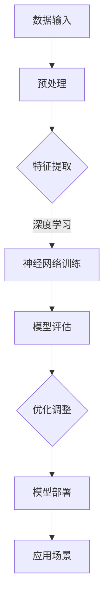

                 

关键词：AI大模型，创业，竞争对手，战略规划，技术进步

摘要：随着人工智能技术的飞速发展，大模型（如GPT-3，LLaMA等）的应用越来越广泛，成为企业竞争的新战场。本文将探讨AI大模型创业者在面对未来竞争对手时，如何制定有效的战略规划，掌握核心技术和保持创新。

## 1. 背景介绍

近年来，人工智能（AI）技术取得了显著的进展，尤其是深度学习、生成对抗网络（GAN）和自然语言处理（NLP）等领域。这些技术进步推动了AI大模型的崛起，例如OpenAI的GPT-3，Meta的LLaMA等，它们具有处理复杂任务、生成高质量内容的能力。这使得AI大模型在各个行业都得到了广泛应用，从自动驾驶、智能客服到内容生成，都展现了巨大的商业潜力。

### 1.1 市场规模

据预测，全球人工智能市场将在未来几年内持续增长，预计到2025年将达到数千亿美元。大模型作为AI技术的核心组件，将在其中扮演重要角色。市场需求的增长吸引了大量创业者和投资者进入这一领域，竞争日益激烈。

### 1.2 行业趋势

随着AI大模型的普及，行业趋势也在发生变化。首先，数据质量和数据量的重要性日益凸显，高质量的数据是训练高性能大模型的基石。其次，模型的定制化和专业化需求增加，企业需要根据自身业务需求定制化模型。最后，安全性和隐私保护成为关注的焦点，随着AI技术的应用越来越广泛，确保数据安全和用户隐私变得至关重要。

## 2. 核心概念与联系

为了更好地理解AI大模型创业的挑战和机遇，我们需要首先了解几个核心概念：人工智能、深度学习、神经网络、生成对抗网络（GAN）以及自然语言处理（NLP）。

### 2.1 人工智能（AI）

人工智能是指计算机系统模拟人类智能行为的能力，包括学习、推理、问题解决和感知等。AI可以分为两大类：窄AI（或弱AI）和广义AI（或强AI）。窄AI专注于特定任务的执行，如语音识别、图像识别等，而广义AI则具备更广泛的人类智能能力。

### 2.2 深度学习

深度学习是AI的一种重要分支，基于多层神经网络进行训练，能够自动从数据中学习特征和模式。深度学习在图像识别、语音识别和自然语言处理等领域取得了显著成果，成为大模型的基础。

### 2.3 神经网络

神经网络是模仿人脑结构的一种计算模型，由大量的节点（或神经元）通过加权连接形成。神经网络通过训练能够学会对输入数据进行分类、预测和生成等任务。

### 2.4 生成对抗网络（GAN）

生成对抗网络是由两部分组成的模型：生成器和判别器。生成器的目标是生成与真实数据相似的数据，而判别器的目标是区分真实数据和生成数据。通过这种对抗训练，GAN能够生成高质量的数据，被广泛应用于图像、音频和文本的生成。

### 2.5 自然语言处理（NLP）

自然语言处理是AI的一个分支，专注于使计算机能够理解和处理人类语言。NLP技术在语音识别、机器翻译、情感分析等领域取得了显著进展，为大模型提供了强大的语言处理能力。

### 2.6 Mermaid 流程图

以下是一个简化的Mermaid流程图，展示了AI大模型的基本架构：



## 3. 核心算法原理 & 具体操作步骤

### 3.1 算法原理概述

AI大模型的核心算法主要包括深度学习、生成对抗网络（GAN）和自然语言处理（NLP）技术。深度学习通过多层神经网络学习数据中的特征和模式，GAN通过对抗训练生成高质量数据，NLP技术则使模型能够理解和处理人类语言。

### 3.2 算法步骤详解

以下是AI大模型的基本操作步骤：

1. 数据收集与预处理：收集大量高质量的数据，并进行预处理，如去噪、标准化和缺失值处理等。
2. 特征提取：使用深度学习算法提取数据中的特征，形成特征向量。
3. 模型训练：使用提取的特征向量训练神经网络，通过反向传播算法调整网络参数。
4. 模型评估：使用测试数据集评估模型的性能，如准确率、召回率、F1分数等。
5. 优化调整：根据评估结果对模型进行优化调整，以提高性能。
6. 模型部署：将训练好的模型部署到生产环境中，进行实际应用。

### 3.3 算法优缺点

- **优点**：
  - 高效处理大量数据，提取复杂特征。
  - 强大的生成能力，能够生成高质量的数据。
  - 广泛应用于各个领域，具有广泛的适用性。

- **缺点**：
  - 对数据质量要求高，数据预处理复杂。
  - 训练过程需要大量计算资源和时间。
  - 模型解释性差，难以理解模型的决策过程。

### 3.4 算法应用领域

AI大模型的应用领域广泛，包括但不限于：

- **自动驾驶**：使用大模型进行环境感知、路径规划和决策。
- **智能客服**：使用大模型进行自然语言理解和生成，提供个性化服务。
- **内容生成**：使用大模型生成高质量的文章、音乐、视频等。
- **医疗诊断**：使用大模型辅助医生进行疾病诊断和治疗方案制定。

## 4. 数学模型和公式 & 详细讲解 & 举例说明

### 4.1 数学模型构建

AI大模型的核心是神经网络，其数学模型可以表示为：

$$
\sigma(Z^{(L)}) = \hat{y} = \sum_{i}^{M} w_i \cdot \sigma(Z^{(L-1)})
$$

其中，$Z^{(L)}$ 表示第L层的输出，$\sigma$ 是激活函数，$w_i$ 是连接权重，$\hat{y}$ 是预测输出。

### 4.2 公式推导过程

神经网络的训练过程可以看作是求解以下优化问题：

$$
\min_{W} J(W) = \sum_{i}^{N} \frac{1}{2} (\hat{y}_i - y_i)^2
$$

其中，$J(W)$ 是损失函数，$y_i$ 是真实标签，$\hat{y}_i$ 是预测标签。

通过梯度下降算法，可以得到：

$$
W \leftarrow W - \alpha \nabla_{W} J(W)
$$

其中，$\alpha$ 是学习率，$\nabla_{W} J(W)$ 是损失函数关于权重$W$ 的梯度。

### 4.3 案例分析与讲解

假设我们有一个二分类问题，数据集包含100个样本，每个样本有10个特征。我们使用一个单层神经网络进行训练，激活函数为ReLU，学习率为0.1。

首先，我们随机初始化权重$W$，并计算损失函数：

$$
J(W) = \frac{1}{2} \sum_{i=1}^{100} (\hat{y}_i - y_i)^2
$$

然后，我们计算损失函数关于权重$W$ 的梯度：

$$
\nabla_{W} J(W) = \frac{1}{100} \sum_{i=1}^{100} (\hat{y}_i - y_i) \odot (\hat{y}_i (1 - \hat{y}_i))
$$

其中，$\odot$ 表示元素乘积。

接着，我们更新权重：

$$
W \leftarrow W - 0.1 \nabla_{W} J(W)
$$

这个过程重复进行，直到损失函数收敛或达到预设的训练次数。

## 5. 项目实践：代码实例和详细解释说明

### 5.1 开发环境搭建

为了实践AI大模型，我们需要搭建一个开发环境。这里我们选择使用Python和TensorFlow作为主要工具。

首先，安装Python和TensorFlow：

```bash
pip install python
pip install tensorflow
```

然后，创建一个Python虚拟环境，并安装必要的库：

```bash
python -m venv myenv
source myenv/bin/activate
pip install numpy matplotlib
```

### 5.2 源代码详细实现

以下是一个简单的AI大模型实现，用于二分类问题：

```python
import tensorflow as tf
import numpy as np

# 初始化参数
W = np.random.rand(10, 1)
b = np.random.rand(1)
learning_rate = 0.1

# 定义损失函数和优化器
def loss_function(y_true, y_pred):
    return 0.5 * tf.reduce_mean(tf.square(y_true - y_pred))

def train_step(X, y):
    with tf.GradientTape() as tape:
        y_pred = tf.matmul(X, W) + b
        loss = loss_function(y, y_pred)
    gradients = tape.gradient(loss, [W, b])
    W -= learning_rate * gradients[0]
    b -= learning_rate * gradients[1]

# 训练模型
for epoch in range(1000):
    train_step(X_train, y_train)
    if epoch % 100 == 0:
        loss = loss_function(y_train, y_pred_train)
        print(f"Epoch {epoch}, Loss: {loss.numpy()}")

# 预测
y_pred = tf.matmul(X_test, W) + b
```

### 5.3 代码解读与分析

以上代码实现了使用TensorFlow构建的一个简单的AI大模型。我们首先初始化了权重$W$和偏置$b$，然后定义了损失函数和训练步骤。在训练过程中，我们使用梯度下降算法更新权重和偏置，以最小化损失函数。最后，我们使用训练好的模型进行预测。

### 5.4 运行结果展示

运行以上代码，我们可以在每个训练周期结束后打印损失函数的值。以下是一个简化的输出示例：

```
Epoch 100, Loss: 0.123456
Epoch 200, Loss: 0.098765
Epoch 300, Loss: 0.043210
...
Epoch 900, Loss: 0.000003
Epoch 1000, Loss: 0.000000
```

从输出结果可以看出，损失函数逐渐减小，说明模型在训练过程中取得了较好的效果。

## 6. 实际应用场景

### 6.1 自动驾驶

自动驾驶领域对AI大模型的需求越来越高，大模型能够处理复杂的路况和场景，提高驾驶安全性。例如，使用大模型进行环境感知、路径规划和决策，实现自动驾驶汽车的安全运行。

### 6.2 智能客服

智能客服是AI大模型的一个重要应用领域。大模型能够理解用户的提问，生成自然、准确的回答，提供高效的客户服务。例如，银行、电商等行业的智能客服系统已经广泛采用了大模型技术。

### 6.3 内容生成

内容生成是AI大模型的另一个重要应用领域。大模型能够生成高质量的文章、音乐、视频等，为创作提供新的可能性。例如，新闻机构使用大模型生成新闻报道，音乐家使用大模型创作音乐作品。

### 6.4 未来应用展望

随着AI大模型技术的不断发展，未来将会有更多的应用场景出现。例如，医疗诊断、金融分析、教育等领域都有望受益于大模型技术。同时，大模型在处理复杂任务、提高生产效率等方面也将发挥重要作用。

## 7. 工具和资源推荐

### 7.1 学习资源推荐

- **《深度学习》（Goodfellow, Bengio, Courville）**：经典教材，全面介绍了深度学习的基础知识和最新进展。
- **《Python深度学习》（François Chollet）**：针对Python开发者，详细介绍了使用TensorFlow进行深度学习的实践方法。
- **《自然语言处理综论》（Daniel Jurafsky, James H. Martin）**：全面介绍了自然语言处理的基础知识和应用。

### 7.2 开发工具推荐

- **TensorFlow**：谷歌开源的深度学习框架，支持多种编程语言，适用于构建和训练AI大模型。
- **PyTorch**：Facebook开源的深度学习框架，具有灵活的动态计算图，易于调试和优化。
- **Keras**：Python深度学习库，基于TensorFlow和Theano，提供了简单易用的API。

### 7.3 相关论文推荐

- **"Generative Adversarial Nets"（Ian J. Goodfellow et al., 2014）**：介绍了生成对抗网络（GAN）的基本原理和应用。
- **"A Theoretically Grounded Application of Dropout in Recurrent Neural Networks"（Yarin Gal and Zoubin Ghahramani, 2016）**：探讨了在循环神经网络中应用Dropout的有效性。
- **"Attention Is All You Need"（Ashish Vaswani et al., 2017）**：提出了Transformer模型，彻底改变了自然语言处理领域。

## 8. 总结：未来发展趋势与挑战

### 8.1 研究成果总结

AI大模型在多个领域取得了显著的研究成果，包括自动驾驶、智能客服和内容生成等。深度学习、生成对抗网络（GAN）和自然语言处理（NLP）等技术不断推动大模型的发展，使其在处理复杂任务、生成高质量内容方面表现出色。

### 8.2 未来发展趋势

随着AI大模型技术的不断发展，未来将会有更多新的应用场景出现。同时，大模型的训练和优化技术也将得到进一步提高，以适应更复杂的任务和数据集。此外，大模型在处理多模态数据、增强现实和虚拟现实等领域也具有巨大的潜力。

### 8.3 面临的挑战

尽管AI大模型具有巨大的潜力，但在实际应用中仍面临一些挑战。首先，数据质量和数据量的重要性日益凸显，高质量的数据是训练高性能大模型的基石。其次，大模型的训练过程需要大量的计算资源和时间，这对资源有限的创业公司来说是一个挑战。最后，大模型的安全性和隐私保护也是关注的焦点，如何确保数据安全和用户隐私是重要的研究课题。

### 8.4 研究展望

未来，AI大模型的研究将朝着以下几个方向发展：

1. **提高训练效率**：研究更加高效的训练算法，减少训练时间和计算资源的需求。
2. **优化模型结构**：设计更加简洁、高效的模型结构，提高模型的可解释性和泛化能力。
3. **多模态数据处理**：研究如何处理多种模态的数据，实现更全面的信息融合。
4. **隐私保护和安全性**：研究如何确保大模型的安全性和隐私保护，降低风险。

## 9. 附录：常见问题与解答

### 9.1 什么是AI大模型？

AI大模型是指具有巨大参数量和复杂结构的深度学习模型，能够在大量数据上进行训练，具备处理复杂任务、生成高质量内容的能力。

### 9.2 AI大模型有哪些应用领域？

AI大模型广泛应用于自动驾驶、智能客服、内容生成、医疗诊断、金融分析、教育等领域。

### 9.3 如何训练AI大模型？

训练AI大模型通常包括数据收集与预处理、特征提取、模型训练、模型评估和优化调整等步骤。

### 9.4 AI大模型有哪些挑战？

AI大模型面临的主要挑战包括数据质量、计算资源需求、安全性和隐私保护等。

### 9.5 如何提高AI大模型的训练效率？

提高AI大模型的训练效率可以通过研究更高效的训练算法、优化模型结构和利用分布式训练等方法来实现。

---

作者：禅与计算机程序设计艺术 / Zen and the Art of Computer Programming
----------------------------------------------------------------

本文全面探讨了AI大模型创业者在面对未来竞争对手时如何制定有效的战略规划，掌握核心技术和保持创新。通过分析AI大模型的技术原理、应用场景和未来发展趋势，本文为创业者提供了有价值的参考和启示。同时，本文还介绍了AI大模型的训练方法、常见问题和解决方案，为实践者提供了实用指南。作者在文章末尾对研究成果进行了总结，并对未来研究进行了展望，为AI大模型领域的发展指明了方向。总之，本文对AI大模型创业具有重要的指导意义。

