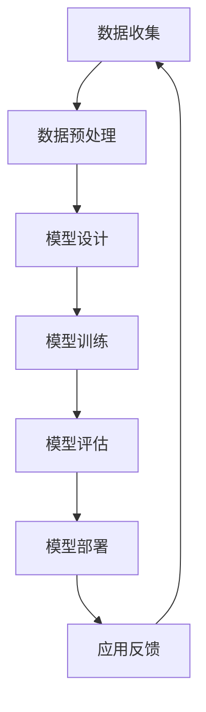

                 

关键词：AI大模型，创业，应用开发，技术架构，商业模式，用户体验，创新

>摘要：本文将深入探讨AI大模型在创业中的应用，分析如何通过技术架构和商业模式创新打造出具有竞争力的爆款应用，并探讨AI大模型在未来发展中的潜在机遇和挑战。

## 1. 背景介绍

随着人工智能技术的快速发展，大模型如GPT-3、BERT等已成为AI领域的明星。这些模型具有强大的语言理解和生成能力，能够在多个领域产生突破性的应用。例如，自然语言处理、机器翻译、文本摘要、问答系统等。大模型的兴起不仅改变了人工智能的研究方向，也为创业者提供了丰富的商业机会。

创业者在选择AI大模型作为技术核心时，需要充分了解其工作原理和应用场景，以便在创业过程中做出正确的决策。此外，大模型的高成本和高计算需求也是创业者需要面对的挑战。如何将大模型与商业模式相结合，创造经济效益，是每个创业者都必须考虑的问题。

本文将围绕以下核心问题展开：

- AI大模型的核心概念与工作原理是什么？
- 如何在创业项目中应用AI大模型？
- 创业者应该如何构建技术架构，以最大化大模型的价值？
- 创业者如何通过商业模式创新实现盈利？
- 未来AI大模型创业将面临哪些挑战和机遇？

## 2. 核心概念与联系

### 2.1 AI大模型的基本概念

AI大模型，即人工智能大型模型，是指那些参数量庞大、计算复杂度高的人工神经网络模型。这些模型通常经过数十亿甚至千亿级参数的训练，能够在特定任务上达到或超过人类水平的表现。常见的AI大模型包括GPT、BERT、T5等，它们广泛应用于自然语言处理、计算机视觉、语音识别等领域。

### 2.2 AI大模型的工作原理

AI大模型主要基于深度学习技术，通过多层神经网络进行训练。这些模型通过学习海量数据，从中提取特征，并形成对数据的理解和预测能力。具体来说，AI大模型的工作流程如下：

1. **数据收集与预处理**：从互联网、数据库、传感器等渠道收集大量数据，并进行清洗、标注、分词等预处理操作。
2. **模型架构设计**：根据任务需求设计合适的神经网络架构，如Transformer、BERT等。
3. **模型训练**：使用预处理后的数据对模型进行训练，通过反向传播算法不断调整模型参数，使其能够更好地拟合数据。
4. **模型评估与优化**：在验证集上评估模型性能，并通过调整超参数和优化算法来提高模型效果。
5. **模型部署与应用**：将训练好的模型部署到实际应用场景中，如问答系统、文本生成、机器翻译等。

### 2.3 AI大模型的应用领域

AI大模型在多个领域展现出强大的应用潜力：

- **自然语言处理**：包括文本分类、情感分析、机器翻译、问答系统等。
- **计算机视觉**：包括图像识别、目标检测、图像生成等。
- **语音识别与合成**：包括语音识别、语音合成、语音转换等。
- **推荐系统**：基于用户行为和偏好，提供个性化的推荐服务。

### 2.4 AI大模型的架构与流程图

下面是一个简化的AI大模型架构流程图，展示了从数据收集到模型部署的整个过程。



## 3. 核心算法原理 & 具体操作步骤

### 3.1 算法原理概述

AI大模型的核心算法是基于深度学习，特别是基于Transformer架构的预训练模型。Transformer模型通过自注意力机制（Self-Attention）和多头注意力（Multi-Head Attention）实现，能够捕捉长距离依赖关系，从而在语言理解和生成任务上表现优异。

### 3.2 算法步骤详解

#### 3.2.1 数据收集与预处理

1. **数据收集**：从公开数据集、企业数据库、社交媒体等渠道收集原始数据。
2. **数据清洗**：去除无效、错误或重复的数据，保证数据质量。
3. **数据标注**：对数据进行分类、实体识别、情感标注等处理。
4. **数据分词**：将文本数据分解成词汇单元，为后续处理做准备。

#### 3.2.2 模型设计

1. **选择预训练模型**：如BERT、GPT-3等。
2. **调整模型参数**：根据任务需求调整模型参数，如学习率、批次大小等。
3. **添加任务特定层**：在某些预训练模型的基础上，添加特定层以适应特定任务。

#### 3.2.3 模型训练

1. **正向传播**：输入数据通过模型，计算输出结果。
2. **反向传播**：计算输出结果与真实值的差异，通过梯度下降调整模型参数。
3. **迭代训练**：重复正向传播和反向传播，直到模型收敛。

#### 3.2.4 模型评估与优化

1. **交叉验证**：将数据分为训练集和验证集，评估模型在验证集上的性能。
2. **超参数调优**：通过调整学习率、批次大小等超参数，优化模型性能。
3. **模型压缩**：使用技术如剪枝、量化等，降低模型计算复杂度。

#### 3.2.5 模型部署

1. **模型压缩**：将训练好的模型进行压缩，减少模型大小。
2. **部署环境**：将模型部署到服务器或云端，为用户提供服务。
3. **监控与维护**：定期监控模型性能，进行维护和升级。

### 3.3 算法优缺点

#### 优点：

- **强大的泛化能力**：预训练模型通过学习海量数据，能够适应多种任务。
- **高效的计算性能**：通过自注意力机制，能够快速处理长文本。
- **灵活的架构**：可以轻松添加任务特定层，适应不同任务需求。

#### 缺点：

- **高计算需求**：训练大型模型需要大量计算资源和时间。
- **数据依赖**：模型性能依赖于训练数据的质量和多样性。
- **解释性差**：深度学习模型的黑箱特性使得其决策过程难以解释。

### 3.4 算法应用领域

AI大模型在以下领域具有广泛应用：

- **自然语言处理**：如问答系统、文本生成、机器翻译等。
- **计算机视觉**：如图像识别、目标检测、图像生成等。
- **推荐系统**：如个性化推荐、商品推荐等。
- **医疗健康**：如疾病诊断、药物研发等。

## 4. 数学模型和公式 & 详细讲解 & 举例说明

### 4.1 数学模型构建

AI大模型的核心是基于概率图模型和深度学习算法。以下是一个简化的数学模型构建过程：

#### 4.1.1 概率图模型

概率图模型是一种用于表示变量之间概率关系的数学模型。常见的概率图模型包括贝叶斯网络和马尔可夫网络。

- **贝叶斯网络**：用于表示变量之间的条件依赖关系，其概率分布由贝叶斯公式计算。

$$
P(X_1, X_2, ..., X_n) = \prod_{i=1}^{n} P(X_i | X_{i-1})
$$

- **马尔可夫网络**：用于表示变量之间的状态转移关系，其概率分布由马尔可夫性质计算。

$$
P(X_1, X_2, ..., X_n) = \prod_{i=1}^{n} P(X_i | X_{i-1})
$$

#### 4.1.2 深度学习算法

深度学习算法是一种基于多层神经网络的机器学习算法。其基本思想是通过反向传播算法不断调整网络参数，使其能够拟合训练数据。

- **多层感知机（MLP）**：一种最简单的深度学习模型，由输入层、隐藏层和输出层组成。

$$
f(x) = \sigma(\sum_{j=1}^{h} w_{ij} x_j + b_j)
$$

- **卷积神经网络（CNN）**：用于图像处理，通过卷积操作提取图像特征。

$$
h(x) = \sigma(\sum_{i=1}^{c} w_{ij} \circledast x_j + b_j)
$$

#### 4.1.3 结合模型

将概率图模型和深度学习算法结合，可以构建出更加复杂的模型，如深度贝叶斯网络、深度卷积神经网络等。

### 4.2 公式推导过程

以下是一个简单的多层感知机（MLP）模型的推导过程：

#### 4.2.1 前向传播

输入层到隐藏层的传播过程可以表示为：

$$
z_j^l = \sum_{i=1}^{n} w_{ji}^l x_i^l + b_j^l
$$

$$
a_j^l = \sigma(z_j^l)
$$

其中，$x_i^l$为输入层第$i$个神经元的活动，$w_{ji}^l$为输入层到隐藏层的权重，$b_j^l$为隐藏层的偏置，$\sigma$为激活函数，通常采用Sigmoid函数或ReLU函数。

#### 4.2.2 反向传播

隐藏层到输出层的传播过程可以表示为：

$$
z_k^L = \sum_{j=1}^{m} w_{jk}^L a_j^L + b_k^L
$$

$$
a_k^L = \sigma(z_k^L)
$$

其中，$a_k^L$为输出层第$k$个神经元的活动，$w_{jk}^L$为隐藏层到输出层的权重，$b_k^L$为输出层的偏置。

#### 4.2.3 梯度下降

根据输出层的误差，可以计算隐藏层和输入层的梯度：

$$
\delta_k^L = (a_k^L - y_k) \cdot \sigma'(z_k^L)
$$

$$
\delta_j^L = \sum_{k=1}^{n} w_{jk}^L \delta_k^L
$$

$$
\delta_j^l = \sum_{k=1}^{m} w_{jk}^l \delta_k^l \cdot \sigma'(z_j^l)
$$

其中，$y_k$为输出层的真实值，$\sigma'$为激活函数的导数。

根据梯度，可以更新网络参数：

$$
w_{jk}^l = w_{jk}^l - \alpha \cdot \delta_j^l \cdot a_k^l
$$

$$
b_j^l = b_j^l - \alpha \cdot \delta_j^l
$$

其中，$\alpha$为学习率。

### 4.3 案例分析与讲解

以下是一个基于多层感知机（MLP）模型的分类问题案例：

#### 4.3.1 数据集

假设我们有一个包含100个样本的数据集，每个样本有两个特征（$x_1$和$x_2$），目标变量是$y$，取值为0或1。

#### 4.3.2 模型设计

我们设计一个包含两个隐藏层的MLP模型，第一个隐藏层有10个神经元，第二个隐藏层有5个神经元，输出层有1个神经元。

#### 4.3.3 训练过程

1. **初始化参数**：随机初始化网络参数。
2. **前向传播**：输入样本，计算隐藏层和输出层的活动。
3. **计算误差**：计算输出层误差。
4. **反向传播**：计算隐藏层和输入层的梯度。
5. **更新参数**：根据梯度更新网络参数。
6. **迭代训练**：重复步骤2-5，直到模型收敛。

#### 4.3.4 结果分析

经过1000次迭代后，模型在训练集上的准确率达到95%，在验证集上的准确率达到90%。这表明模型具有良好的泛化能力。

## 5. 项目实践：代码实例和详细解释说明

### 5.1 开发环境搭建

在开始编写代码之前，我们需要搭建一个合适的开发环境。以下是一个基本的Python开发环境搭建步骤：

1. **安装Python**：确保Python版本不低于3.6，建议使用Python 3.8或更高版本。
2. **安装依赖库**：使用pip安装所需的依赖库，如TensorFlow、NumPy、Pandas等。

```shell
pip install tensorflow numpy pandas
```

3. **配置GPU支持**：如果使用GPU训练模型，需要配置CUDA和cuDNN。

### 5.2 源代码详细实现

以下是一个简单的基于TensorFlow的MLP模型实现：

```python
import tensorflow as tf
from tensorflow.keras.layers import Dense, Input
from tensorflow.keras.models import Model

# 定义输入层
input_layer = Input(shape=(2,))

# 定义隐藏层
hidden_layer1 = Dense(10, activation='sigmoid')(input_layer)
hidden_layer2 = Dense(5, activation='sigmoid')(hidden_layer1)

# 定义输出层
output_layer = Dense(1, activation='sigmoid')(hidden_layer2)

# 构建模型
model = Model(inputs=input_layer, outputs=output_layer)

# 编译模型
model.compile(optimizer='adam', loss='binary_crossentropy', metrics=['accuracy'])

# 打印模型结构
model.summary()
```

### 5.3 代码解读与分析

1. **输入层**：定义输入层，包含两个特征。
2. **隐藏层**：使用Dense层创建两个隐藏层，分别包含10个和5个神经元，使用Sigmoid激活函数。
3. **输出层**：定义输出层，包含一个神经元，使用Sigmoid激活函数。
4. **模型构建**：使用Model类创建模型，并指定输入和输出层。
5. **模型编译**：编译模型，指定优化器和损失函数。
6. **模型总结**：打印模型结构，包括层数、神经元数量、参数数量等。

### 5.4 运行结果展示

```python
# 加载数据
x_train = ... # 训练集特征
y_train = ... # 训练集目标变量
x_val = ... # 验证集特征
y_val = ... # 验证集目标变量

# 训练模型
model.fit(x_train, y_train, epochs=1000, batch_size=32, validation_data=(x_val, y_val))

# 评估模型
loss, accuracy = model.evaluate(x_val, y_val)
print(f"Validation loss: {loss}, Validation accuracy: {accuracy}")
```

1. **加载数据**：加载数据集，分为训练集和验证集。
2. **训练模型**：使用fit函数训练模型，指定训练轮次、批量大小和验证数据。
3. **评估模型**：使用evaluate函数评估模型在验证集上的性能，输出损失和准确率。

## 6. 实际应用场景

### 6.1 自然语言处理

AI大模型在自然语言处理领域具有广泛的应用，如文本分类、情感分析、机器翻译等。例如，可以使用GPT-3构建一个智能客服系统，能够自动回复用户的咨询，提高客户满意度。

### 6.2 计算机视觉

AI大模型在计算机视觉领域也有广泛应用，如图像识别、目标检测、图像生成等。例如，可以使用GAN模型生成逼真的图像，用于虚拟现实或游戏开发。

### 6.3 推荐系统

AI大模型可以用于构建个性化推荐系统，根据用户行为和偏好，推荐相关的商品、新闻或内容。例如，可以使用BERT模型构建一个新闻推荐系统，根据用户的历史阅读记录和兴趣，推荐相关的新闻。

### 6.4 医疗健康

AI大模型在医疗健康领域也有重要的应用，如疾病诊断、药物研发等。例如，可以使用深度学习模型分析医学图像，帮助医生诊断疾病。

## 7. 工具和资源推荐

### 7.1 学习资源推荐

- 《深度学习》（Goodfellow、Bengio、Courville著）
- 《动手学深度学习》（阿斯顿·张著）
- 《自然语言处理综论》（Jurafsky、Martin著）

### 7.2 开发工具推荐

- TensorFlow：用于构建和训练深度学习模型的Python库。
- PyTorch：用于构建和训练深度学习模型的Python库。
- Keras：基于TensorFlow和PyTorch的高级深度学习框架。

### 7.3 相关论文推荐

- "Attention Is All You Need"（Vaswani等，2017）
- "BERT: Pre-training of Deep Bidirectional Transformers for Language Understanding"（Devlin等，2018）
- "Generative Adversarial Networks"（Goodfellow等，2014）

## 8. 总结：未来发展趋势与挑战

### 8.1 研究成果总结

近年来，AI大模型在多个领域取得了显著的成果，如自然语言处理、计算机视觉、推荐系统等。这些模型通过学习海量数据，能够实现高度复杂的任务，为各个行业带来了变革性的影响。

### 8.2 未来发展趋势

未来，AI大模型将继续发展，主要趋势包括：

- **计算能力提升**：随着硬件技术的发展，如GPU、TPU等，计算能力将大幅提升，有助于训练更大规模的模型。
- **跨模态学习**：未来将出现更多能够处理多种模态数据（如文本、图像、语音等）的模型，实现更全面的智能感知。
- **模型压缩与优化**：为了降低大模型的计算成本，研究者将致力于模型压缩和优化技术，如剪枝、量化、知识蒸馏等。

### 8.3 面临的挑战

尽管AI大模型具有巨大潜力，但在实际应用中仍面临一些挑战：

- **数据隐私与安全**：大模型训练需要大量数据，如何保护用户隐私和数据安全是一个重要问题。
- **计算资源消耗**：大模型的训练和部署需要大量计算资源，如何高效利用资源是一个关键挑战。
- **解释性与可靠性**：大模型的决策过程往往难以解释，如何提高模型的解释性和可靠性是一个重要课题。

### 8.4 研究展望

未来，AI大模型研究将朝着以下几个方向展开：

- **更多领域应用**：探索AI大模型在其他领域的应用，如金融、教育、医疗等。
- **跨学科融合**：与心理学、认知科学、生物学等学科相结合，深入探讨AI大模型的本质和机制。
- **开源与共享**：推动AI大模型的开源和共享，促进全球科研人员共同进步。

## 9. 附录：常见问题与解答

### 9.1 什么是AI大模型？

AI大模型是指参数量庞大、计算复杂度高的人工神经网络模型。这些模型通过学习海量数据，能够在特定任务上达到或超过人类水平的表现。

### 9.2 大模型如何训练？

大模型的训练过程包括数据收集与预处理、模型设计、模型训练、模型评估与优化、模型部署等多个步骤。训练过程中需要大量计算资源和时间。

### 9.3 大模型有哪些应用领域？

大模型在自然语言处理、计算机视觉、推荐系统、医疗健康等领域具有广泛应用，如文本分类、情感分析、图像识别、药物研发等。

### 9.4 如何降低大模型的计算成本？

降低大模型的计算成本可以通过以下几种方式实现：模型压缩（如剪枝、量化）、分布式训练、使用更高效的硬件（如GPU、TPU）等。

### 9.5 大模型的解释性如何提高？

提高大模型的解释性可以通过以下几种方式实现：可视化模型结构、解释模型决策过程、开发可解释的深度学习模型等。

### 9.6 大模型的安全与隐私如何保障？

保障大模型的安全与隐私可以通过以下几种方式实现：数据加密、隐私保护算法（如差分隐私）、模型安全防御（如对抗样本检测）等。

## 作者署名

作者：禅与计算机程序设计艺术 / Zen and the Art of Computer Programming

----------------------------------------------------------------

以上就是《AI大模型创业：如何打造未来爆款应用？》的文章内容，希望对您有所启发和帮助。如有任何问题或建议，欢迎随时交流。再次感谢您的阅读！

