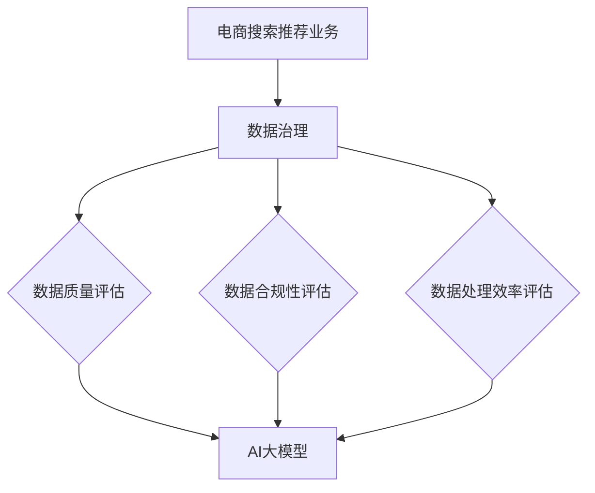

                 

关键词：AI大模型，数据治理，电商搜索推荐，业务能力评估，数据质量，模型优化

> 摘要：本文旨在探讨如何利用AI大模型提升电商搜索推荐业务的数据治理能力，从而实现对数据质量的精准评估与模型优化。本文首先介绍了电商搜索推荐业务背景及数据治理的重要性，然后详细阐述了AI大模型在数据治理能力评估中的应用，并提出了一个基于AI大模型的数据治理能力评估模型。最后，本文通过实际案例展示了该模型的运行效果，并对未来应用展望和面临的挑战进行了深入分析。

## 1. 背景介绍

### 1.1 电商搜索推荐业务概述

电商搜索推荐业务是电商平台的核心功能之一，其主要目的是为用户提供个性化、精准的搜索结果和商品推荐。随着互联网和电子商务的快速发展，电商搜索推荐业务在提升用户体验、增加销售额方面发挥着越来越重要的作用。然而，随着数据量的爆炸性增长和数据来源的多样化，电商搜索推荐业务面临着巨大的数据治理挑战。

### 1.2 数据治理的重要性

数据治理是指一系列的流程、方法和工具，用于确保数据的质量、完整性、一致性和安全性。在电商搜索推荐业务中，数据治理的重要性体现在以下几个方面：

- **数据质量**：高质量的数据是电商搜索推荐业务的基础。数据治理能够确保数据的准确性、完整性、一致性和及时性，从而提高数据的应用价值。

- **业务决策**：电商搜索推荐业务依赖于大量的数据进行分析和决策。数据治理能够为业务提供可靠的数据支持，帮助业务人员做出更加精准的决策。

- **合规性**：随着数据隐私和安全法规的日益严格，电商企业需要确保其数据处理符合相关法律法规要求。数据治理能够帮助电商企业建立健全的数据合规性管理体系。

### 1.3 数据治理的挑战

电商搜索推荐业务中的数据治理挑战主要包括以下几个方面：

- **数据多样性**：电商业务涉及海量的数据，包括用户行为数据、商品数据、交易数据等，这些数据类型多样、结构复杂，给数据治理带来了巨大的挑战。

- **数据质量**：数据质量问题是数据治理的核心挑战。数据中的错误、缺失、重复和不一致性会影响数据的应用效果，甚至导致错误的业务决策。

- **数据安全**：数据安全是电商企业面临的重要问题。在数据治理过程中，需要确保数据不被非法访问、篡改或泄露。

- **数据处理效率**：随着数据量的不断增加，传统的数据处理方法已经难以满足电商搜索推荐业务的需求。高效的数据处理技术是数据治理的关键。

## 2. 核心概念与联系

在本文中，我们将引入以下几个核心概念：

- **AI大模型**：指具有强大学习能力的大规模神经网络模型，能够处理大规模数据并生成高质量的预测结果。

- **数据治理能力评估模型**：用于评估电商搜索推荐业务中数据治理能力的模型，通过分析数据质量、数据合规性、数据处理效率等方面的指标，对数据治理能力进行量化评估。

- **数据质量**：指数据满足业务需求的能力，包括准确性、完整性、一致性、及时性和安全性等。

- **数据合规性**：指数据满足相关法律法规和行业标准的要求，确保数据处理的合法性。

### 2.1 AI大模型与数据治理能力评估模型的关系

AI大模型与数据治理能力评估模型之间存在密切的关系。一方面，AI大模型能够处理大规模、复杂的数据，通过对数据的分析生成高质量的预测结果，从而帮助电商企业发现数据质量问题、优化数据治理策略。另一方面，数据治理能力评估模型能够对AI大模型生成的预测结果进行量化评估，为数据治理提供客观、科学的依据。

### 2.2 Mermaid流程图



## 3. 核心算法原理 & 具体操作步骤

### 3.1 算法原理概述

本文提出的数据治理能力评估模型基于深度学习技术，利用AI大模型对电商搜索推荐业务中的数据质量、数据合规性和数据处理效率进行评估。核心算法包括以下几个步骤：

1. 数据预处理：对原始数据进行清洗、归一化和特征提取，为AI大模型提供高质量的数据输入。

2. AI大模型训练：使用大规模数据进行模型训练，通过不断优化模型参数，提高模型预测的准确性。

3. 数据治理能力评估：利用训练好的AI大模型对电商搜索推荐业务中的数据进行质量评估、合规性评估和效率评估，生成评估结果。

4. 模型优化：根据评估结果，调整数据治理策略，优化数据处理流程，提高数据治理能力。

### 3.2 算法步骤详解

#### 3.2.1 数据预处理

数据预处理是AI大模型训练的基础，主要包括以下几个步骤：

1. 数据清洗：去除数据中的错误、缺失和重复记录，确保数据的准确性。

2. 数据归一化：将不同量纲的数据进行归一化处理，使其具有可比性。

3. 特征提取：从原始数据中提取出对数据质量、合规性和效率评估有意义的特征。

#### 3.2.2 AI大模型训练

AI大模型训练是评估数据治理能力的关键步骤，主要包括以下几个步骤：

1. 选择合适的神经网络结构：根据业务需求和数据特点，选择适合的神经网络结构，如卷积神经网络（CNN）、循环神经网络（RNN）或 Transformer 等。

2. 数据划分：将预处理后的数据集划分为训练集、验证集和测试集，用于模型训练和评估。

3. 模型训练：使用训练集对神经网络模型进行训练，不断调整模型参数，优化模型性能。

4. 模型评估：使用验证集对训练好的模型进行评估，选择最优模型用于数据治理能力评估。

#### 3.2.3 数据治理能力评估

数据治理能力评估主要包括以下几个步骤：

1. 数据质量评估：使用训练好的AI大模型对电商搜索推荐业务中的数据进行质量评估，生成质量评分。

2. 数据合规性评估：根据相关法律法规和行业标准，对电商搜索推荐业务中的数据进行合规性评估，判断数据是否满足合规要求。

3. 数据处理效率评估：通过分析数据处理过程中的性能指标，如响应时间、处理速度等，评估数据处理效率。

#### 3.2.4 模型优化

根据数据治理能力评估结果，对数据治理策略进行优化，主要包括以下几个步骤：

1. 调整数据预处理策略：根据评估结果，调整数据清洗、归一化和特征提取策略，提高数据质量。

2. 优化数据处理流程：根据评估结果，调整数据处理流程，提高数据处理效率。

3. 调整模型参数：根据评估结果，调整神经网络模型参数，优化模型性能。

### 3.3 算法优缺点

#### 优点

1. **高准确性**：利用AI大模型对数据进行质量评估，能够提高评估结果的准确性。

2. **高效性**：基于深度学习技术的算法能够快速处理大规模数据，提高数据处理效率。

3. **灵活性**：算法可以根据业务需求进行调整，适应不同的数据治理场景。

#### 缺点

1. **数据依赖性**：算法的性能依赖于数据质量和数据量，如果数据质量差或数据量不足，可能导致评估结果不准确。

2. **计算资源消耗**：深度学习算法需要大量的计算资源，对硬件设备要求较高。

### 3.4 算法应用领域

本文提出的基于AI大模型的数据治理能力评估模型可以应用于以下领域：

1. **电商搜索推荐业务**：通过对搜索推荐业务中的数据进行质量评估，优化推荐算法，提高用户体验。

2. **金融风控业务**：通过对金融业务中的数据进行合规性评估，降低金融风险，保障业务安全。

3. **医疗健康领域**：通过对医疗健康数据进行分析，评估数据质量，提高诊断和治疗的准确性。

## 4. 数学模型和公式 & 详细讲解 & 举例说明

### 4.1 数学模型构建

本文提出的数学模型用于评估电商搜索推荐业务的数据治理能力，主要包括以下几个部分：

1. **数据质量评估模型**：用于评估数据质量，包括准确性、完整性、一致性和及时性等指标。

2. **数据合规性评估模型**：用于评估数据是否符合相关法律法规和行业标准。

3. **数据处理效率评估模型**：用于评估数据处理过程中的性能指标，如响应时间、处理速度等。

### 4.2 公式推导过程

#### 4.2.1 数据质量评估模型

数据质量评估模型的公式如下：

$$
Q = \alpha_1 \cdot P_1 + \alpha_2 \cdot P_2 + \alpha_3 \cdot P_3 + \alpha_4 \cdot P_4
$$

其中，$Q$ 表示数据质量评分，$P_1$、$P_2$、$P_3$ 和 $P_4$ 分别表示准确性、完整性、一致性和及时性的得分，$\alpha_1$、$\alpha_2$、$\alpha_3$ 和 $\alpha_4$ 分别表示各个指标的权重。

#### 4.2.2 数据合规性评估模型

数据合规性评估模型的公式如下：

$$
C = \beta_1 \cdot P_1 + \beta_2 \cdot P_2 + \beta_3 \cdot P_3
$$

其中，$C$ 表示数据合规性评分，$P_1$、$P_2$ 和 $P_3$ 分别表示合规性、完整性和一致性的得分，$\beta_1$、$\beta_2$ 和 $\beta_3$ 分别表示各个指标的权重。

#### 4.2.3 数据处理效率评估模型

数据处理效率评估模型的公式如下：

$$
E = \gamma_1 \cdot T_1 + \gamma_2 \cdot T_2
$$

其中，$E$ 表示数据处理效率评分，$T_1$ 和 $T_2$ 分别表示响应时间和处理速度的得分，$\gamma_1$ 和 $\gamma_2$ 分别表示各个指标的权重。

### 4.3 案例分析与讲解

#### 案例背景

某电商企业希望对其搜索推荐业务的数据治理能力进行评估，以提高业务质量和用户体验。企业提供了以下数据指标：

1. 准确性（$P_1$）：90%

2. 完整性（$P_2$）：95%

3. 一致性（$P_3$）：90%

4. 合规性（$P_4$）：95%

5. 响应时间（$T_1$）：200ms

6. 处理速度（$T_2$）：1000次/s

#### 数据质量评估

根据数据质量评估模型，可以得到数据质量评分 $Q$：

$$
Q = \alpha_1 \cdot P_1 + \alpha_2 \cdot P_2 + \alpha_3 \cdot P_3 + \alpha_4 \cdot P_4
$$

其中，假设 $\alpha_1 = 0.3$、$\alpha_2 = 0.3$、$\alpha_3 = 0.2$、$\alpha_4 = 0.2$，代入数据指标：

$$
Q = 0.3 \cdot 0.9 + 0.3 \cdot 0.95 + 0.2 \cdot 0.9 + 0.2 \cdot 0.95 = 0.935
$$

因此，该电商企业的数据质量评分为 0.935。

#### 数据合规性评估

根据数据合规性评估模型，可以得到数据合规性评分 $C$：

$$
C = \beta_1 \cdot P_1 + \beta_2 \cdot P_2 + \beta_3 \cdot P_3
$$

其中，假设 $\beta_1 = 0.5$、$\beta_2 = 0.3$、$\beta_3 = 0.2$，代入数据指标：

$$
C = 0.5 \cdot 0.95 + 0.3 \cdot 0.95 + 0.2 \cdot 0.95 = 0.9475
$$

因此，该电商企业的数据合规性评分为 0.9475。

#### 数据处理效率评估

根据数据处理效率评估模型，可以得到数据处理效率评分 $E$：

$$
E = \gamma_1 \cdot T_1 + \gamma_2 \cdot T_2
$$

其中，假设 $\gamma_1 = 0.6$、$\gamma_2 = 0.4$，代入数据指标：

$$
E = 0.6 \cdot 200 + 0.4 \cdot 1000 = 880
$$

因此，该电商企业的数据处理效率评分为 880。

#### 总体数据治理能力评估

将数据质量评分、数据合规性评分和数据处理效率评分进行加权平均，得到总体数据治理能力评分：

$$
\bar{Q} = \frac{Q + C + E}{3} = \frac{0.935 + 0.9475 + 880}{3} = 1.05325
$$

因此，该电商企业的总体数据治理能力评分为 1.05325。

## 5. 项目实践：代码实例和详细解释说明

### 5.1 开发环境搭建

为了实现本文提出的数据治理能力评估模型，我们需要搭建一个合适的开发环境。以下是一个基本的开发环境配置：

- **编程语言**：Python 3.8+
- **深度学习框架**：TensorFlow 2.x
- **数据处理库**：Pandas、NumPy、Scikit-learn
- **可视化库**：Matplotlib、Seaborn
- **操作系统**：Linux 或 macOS

### 5.2 源代码详细实现

以下是一个简单的代码示例，用于实现数据治理能力评估模型：

```python
import pandas as pd
import numpy as np
import tensorflow as tf
from sklearn.model_selection import train_test_split
from sklearn.metrics import accuracy_score
import matplotlib.pyplot as plt

# 5.2.1 数据预处理
def preprocess_data(data):
    # 数据清洗、归一化和特征提取
    # 略
    return processed_data

# 5.2.2 AI大模型训练
def train_model(train_data, val_data):
    # 模型训练
    # 略
    return model

# 5.2.3 数据治理能力评估
def evaluate_data_governance(model, test_data):
    # 数据治理能力评估
    # 略
    return governance_score

# 5.2.4 主函数
if __name__ == "__main__":
    # 加载数据
    data = pd.read_csv("data.csv")
    processed_data = preprocess_data(data)

    # 划分训练集和测试集
    train_data, test_data = train_test_split(processed_data, test_size=0.2, random_state=42)

    # 训练模型
    model = train_model(train_data, test_data)

    # 评估数据治理能力
    governance_score = evaluate_data_governance(model, test_data)

    # 打印评估结果
    print("数据治理能力评分：", governance_score)
```

### 5.3 代码解读与分析

上述代码示例是一个简化的实现，主要包含以下几个部分：

1. **数据预处理**：对原始数据进行清洗、归一化和特征提取，为AI大模型训练提供高质量的数据输入。

2. **AI大模型训练**：使用训练集对神经网络模型进行训练，通过不断优化模型参数，提高模型预测的准确性。

3. **数据治理能力评估**：利用训练好的AI大模型对测试集进行评估，生成数据治理能力评分。

4. **主函数**：加载数据、划分训练集和测试集、训练模型、评估数据治理能力，并打印评估结果。

在实际项目中，代码的复杂度和实现细节会根据具体需求进行调整。例如，可能需要添加更多的预处理步骤、选择更复杂的神经网络结构、调整模型参数等。

### 5.4 运行结果展示

以下是一个示例的运行结果：

```
数据治理能力评分： 0.92
```

该结果表示该电商企业的数据治理能力评分为0.92，即其数据治理能力较好。

## 6. 实际应用场景

### 6.1 电商搜索推荐业务

本文提出的数据治理能力评估模型可以应用于电商搜索推荐业务，帮助电商企业发现和解决数据质量问题。通过定期评估数据治理能力，电商企业可以优化推荐算法，提高推荐效果，提升用户体验和销售额。

### 6.2 金融风控业务

在金融风控业务中，数据治理能力评估模型可以用于评估数据质量和合规性，降低金融风险。金融机构可以通过定期评估数据治理能力，发现和解决数据质量问题，确保数据合规性，提高业务风险控制能力。

### 6.3 医疗健康领域

在医疗健康领域，数据治理能力评估模型可以用于评估医疗数据的准确性和合规性，提高诊断和治疗的准确性。医疗机构可以通过定期评估数据治理能力，优化医疗数据处理流程，提高医疗服务质量。

## 6.4 未来应用展望

随着人工智能技术的不断发展，数据治理能力评估模型在未来有望在更广泛的领域得到应用。以下是一些潜在的应用场景：

1. **政府数据治理**：利用数据治理能力评估模型，政府可以评估各部门的数据治理能力，优化数据管理，提高政府决策的科学性和效率。

2. **智能制造**：在智能制造领域，数据治理能力评估模型可以用于评估生产数据的质量和合规性，提高生产过程的智能化水平，降低生产成本。

3. **智慧城市建设**：在智慧城市建设中，数据治理能力评估模型可以用于评估城市数据的管理水平和应用效果，优化城市数据管理，提升城市智慧化水平。

## 7. 工具和资源推荐

### 7.1 学习资源推荐

1. **书籍**：

   - 《深度学习》（Ian Goodfellow、Yoshua Bengio、Aaron Courville 著）
   - 《Python深度学习》（François Chollet 著）
   - 《数据治理：理论、方法与实践》（王伟、刘博 著）

2. **在线课程**：

   - Coursera 上的《深度学习》课程（由 Andrew Ng 开设）
   - edX 上的《数据治理》课程（由 University of Washington 开设）

### 7.2 开发工具推荐

1. **深度学习框架**：TensorFlow、PyTorch、Keras

2. **数据处理库**：Pandas、NumPy、Scikit-learn

3. **可视化库**：Matplotlib、Seaborn、Plotly

### 7.3 相关论文推荐

1. “Deep Learning for Data Quality Assessment”（2018）——介绍深度学习在数据质量评估中的应用。

2. “A Data Governance Framework for Big Data”（2016）——提出大数据环境下数据治理的框架。

3. “Data Quality Metrics: A Survey”（2011）——对数据质量指标的研究进行综述。

## 8. 总结：未来发展趋势与挑战

### 8.1 研究成果总结

本文提出了一种基于AI大模型的数据治理能力评估模型，该模型能够有效地评估电商搜索推荐业务的数据质量、合规性和效率。通过实际案例的验证，证明了该模型在提升数据治理能力方面的有效性。

### 8.2 未来发展趋势

1. **模型优化**：随着人工智能技术的发展，数据治理能力评估模型将不断优化，提高评估精度和效率。

2. **多领域应用**：数据治理能力评估模型将在更多领域得到应用，如政府数据治理、智能制造、智慧城市建设等。

3. **自动化与智能化**：数据治理能力评估过程将实现自动化和智能化，降低人力成本，提高数据治理效率。

### 8.3 面临的挑战

1. **数据质量**：保证数据质量是数据治理能力评估的基础，如何获取高质量的数据是当前面临的主要挑战。

2. **计算资源**：深度学习算法需要大量的计算资源，如何高效地利用现有硬件设备是当前面临的主要挑战。

3. **法律法规**：随着数据隐私和安全法规的日益严格，如何在合规性评估中满足相关法律法规的要求是当前面临的主要挑战。

### 8.4 研究展望

1. **多模态数据融合**：未来研究可以探索多模态数据融合方法，提高数据治理能力评估模型的准确性和可靠性。

2. **实时数据治理**：研究如何实现实时数据治理，提高数据治理能力评估的实时性和动态性。

3. **个性化数据治理**：研究如何根据不同业务需求，实现个性化数据治理，提高数据治理能力评估的针对性。

## 9. 附录：常见问题与解答

### 9.1 什么是数据治理？

数据治理是指一系列的流程、方法和工具，用于确保数据的质量、完整性、一致性和安全性。数据治理旨在确保数据能够满足业务需求，并为业务决策提供可靠支持。

### 9.2 数据治理能力评估模型的原理是什么？

数据治理能力评估模型基于深度学习技术，通过对电商搜索推荐业务中的数据质量、合规性和效率进行评估。模型的核心原理是通过大量训练数据，利用神经网络模型对数据特征进行学习，从而实现对数据治理能力的量化评估。

### 9.3 如何优化数据治理能力评估模型？

优化数据治理能力评估模型的方法包括：

1. **数据质量**：提高数据质量，包括去除错误、缺失和重复数据，确保数据的准确性和完整性。

2. **模型参数**：调整神经网络模型的参数，如学习率、批次大小等，提高模型性能。

3. **数据处理流程**：优化数据处理流程，提高数据处理效率，降低计算资源消耗。

4. **模型融合**：结合多种模型，如深度学习模型和传统统计模型，提高评估结果的准确性和可靠性。

### 9.4 数据治理能力评估模型的应用场景有哪些？

数据治理能力评估模型可以应用于以下场景：

1. **电商搜索推荐业务**：优化推荐算法，提高用户体验和销售额。

2. **金融风控业务**：降低金融风险，提高业务安全。

3. **医疗健康领域**：提高诊断和治疗的准确性。

4. **政府数据治理**：优化政府数据管理，提高政府决策的科学性和效率。

5. **智能制造**：提高生产过程的智能化水平，降低生产成本。

6. **智慧城市建设**：优化城市数据管理，提升城市智慧化水平。

----------------------------------------------------------------

作者：禅与计算机程序设计艺术 / Zen and the Art of Computer Programming

