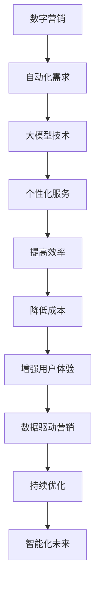

                 

关键词：AI大模型、数字营销、自动化、应用前景

## 摘要

随着人工智能技术的飞速发展，大模型技术在多个领域展现出了巨大的潜力。本文将探讨AI大模型在数字营销自动化中的应用前景。通过对大模型技术的基本原理和现有应用进行深入分析，本文将阐述大模型如何助力数字营销自动化，提高营销效率，提供个性化服务，以及其未来可能面临的挑战和解决方案。本文旨在为从事数字营销和相关领域的研究者和从业者提供一个全面而深入的理解，以及未来发展的思考。

## 1. 背景介绍

### 1.1 数字营销的兴起

数字营销是指利用数字技术和互联网渠道进行的营销活动。随着互联网的普及和移动设备的广泛使用，数字营销已经成为企业获取客户、提高品牌知名度、实现销售目标的主要手段。相比传统营销，数字营销具有更高的精准性、互动性和实时性，能够更有效地满足消费者的需求。

### 1.2 自动化的趋势

在数字营销中，自动化技术的应用正逐渐成为趋势。通过自动化工具，企业可以大幅度提高营销活动的效率，降低人力成本，并实现更加个性化的用户服务。自动化技术的应用涵盖了邮件营销、社交媒体管理、客户关系管理等多个方面。

### 1.3 大模型技术的崛起

近年来，人工智能领域的一项重要突破是大模型技术的崛起。大模型，如GPT-3、BERT等，具有处理大规模数据、生成高质量文本、理解复杂语义等能力。这些大模型的出现，为数字营销自动化带来了新的机遇和挑战。

## 2. 核心概念与联系

### 2.1 大模型的基本原理

大模型是基于深度学习技术构建的神经网络模型，通过在大量数据上进行训练，使其能够自动学习数据的规律和模式。大模型的典型特征是参数数量庞大，训练时间较长，但具有出色的泛化能力和文本生成能力。

### 2.2 数字营销与自动化的关系

数字营销自动化是利用技术手段将营销活动中的重复性、规则性工作自动化，以减少人工操作，提高效率。大模型技术为数字营销自动化提供了强有力的支持，使其能够更加智能、精准地处理大量数据，生成个性化的营销内容和策略。

### 2.3 Mermaid流程图



## 3. 核心算法原理 & 具体操作步骤

### 3.1 算法原理概述

大模型技术的核心在于其强大的文本生成能力和语义理解能力。通过在大量文本数据上进行训练，大模型能够学习到语言的统计规律和语义信息，从而实现高质量文本的生成和语义理解。

### 3.2 算法步骤详解

1. **数据收集与预处理**：收集大量的文本数据，并进行清洗和格式化处理，以去除噪声和重复信息。

2. **模型训练**：使用训练数据进行模型训练，通过反向传播算法优化模型参数，使模型能够准确地预测文本的下一个单词或句子。

3. **模型评估与优化**：使用验证集对模型进行评估，并根据评估结果对模型进行调整和优化。

4. **文本生成**：使用训练好的模型生成文本，可以根据输入的提示或问题生成相关的内容。

### 3.3 算法优缺点

**优点**：
- **高效性**：大模型能够快速处理大量文本数据，提高营销活动的效率。
- **个性化**：大模型能够根据用户的行为和偏好生成个性化的营销内容和策略。
- **智能化**：大模型能够理解复杂的语义信息，实现智能化的营销自动化。

**缺点**：
- **计算资源需求高**：大模型的训练和推理需要大量的计算资源，可能导致成本上升。
- **数据质量要求高**：数据的质量直接影响模型的性能，需要大量高质量的训练数据。

### 3.4 算法应用领域

大模型技术可以在数字营销的多个领域得到应用，包括：
- **内容生成**：自动生成营销文案、博客文章、产品描述等。
- **客户服务**：自动回复客户咨询，提供个性化的服务。
- **广告投放**：自动生成广告内容，优化广告投放策略。

## 4. 数学模型和公式 & 详细讲解 & 举例说明

### 4.1 数学模型构建

大模型通常采用深度神经网络模型，其基本结构如下：

$$
\text{Output} = \text{sigmoid}(\text{Weight} \cdot \text{Input} + \text{Bias})
$$

其中，Input是输入特征，Weight和Bias是模型参数，sigmoid函数用于将输出映射到[0,1]范围内。

### 4.2 公式推导过程

大模型的训练过程是通过优化模型参数，使得模型能够最小化预测误差。具体来说，使用梯度下降算法优化模型参数，公式如下：

$$
\Delta \text{Weight} = -\alpha \cdot \frac{\partial J}{\partial \text{Weight}}
$$

其中，$\Delta \text{Weight}$是参数更新量，$\alpha$是学习率，$J$是损失函数。

### 4.3 案例分析与讲解

假设我们有一个简单的二元分类问题，需要判断一个新闻文章是否为负面新闻。我们可以使用大模型对新闻文章进行文本分析，然后根据分析结果生成一个概率值，概率值越高，表示文章越可能是负面新闻。

1. **数据准备**：收集大量新闻文章，并标注为正面或负面。

2. **模型训练**：使用训练数据对大模型进行训练，使其能够学习到正面和负面新闻的文本特征。

3. **模型评估**：使用验证集对模型进行评估，计算模型的准确率、召回率等指标。

4. **文本生成**：使用训练好的模型对新的新闻文章进行分析，生成一个负面新闻的概率值。

通过这个案例，我们可以看到大模型技术在文本分类任务中的应用，以及如何通过数学模型和公式来实现这一目标。

## 5. 项目实践：代码实例和详细解释说明

### 5.1 开发环境搭建

1. 安装Python环境，版本要求3.6及以上。
2. 安装TensorFlow和Keras库，可以使用以下命令：

```bash
pip install tensorflow
pip install keras
```

### 5.2 源代码详细实现

以下是一个简单的文本分类项目的代码示例：

```python
from keras.models import Sequential
from keras.layers import Dense, Embedding, LSTM
from keras.preprocessing.sequence import pad_sequences
from keras.preprocessing.text import Tokenizer

# 数据准备
tokenizer = Tokenizer(num_words=10000)
tokenizer.fit_on_texts(training_data)
sequences = tokenizer.texts_to_sequences(training_data)
data = pad_sequences(sequences, maxlen=500)

# 模型构建
model = Sequential()
model.add(Embedding(10000, 32, input_length=500))
model.add(LSTM(128))
model.add(Dense(1, activation='sigmoid'))

# 模型编译
model.compile(optimizer='rmsprop', loss='binary_crossentropy', metrics=['accuracy'])

# 模型训练
model.fit(data, labels, epochs=10, batch_size=32)

# 文本生成
text = "This is a negative review of the product."
sequence = tokenizer.texts_to_sequences([text])
padded_sequence = pad_sequences(sequence, maxlen=500)
prediction = model.predict(padded_sequence)
print(prediction)
```

### 5.3 代码解读与分析

1. **数据准备**：首先，我们需要准备训练数据。数据集应该包含正面和负面的新闻文章，并将其转换为数字序列。我们使用`Tokenizer`将文本转换为序列，并使用`pad_sequences`将序列补齐到相同的长度。

2. **模型构建**：我们构建了一个简单的序列模型，包括嵌入层（Embedding）、循环神经网络层（LSTM）和输出层（Dense）。嵌入层用于将文本转换为密集向量表示，LSTM层用于处理序列数据，输出层用于分类。

3. **模型编译**：我们使用`binary_crossentropy`作为损失函数，因为这是一个二元分类问题。`sigmoid`激活函数用于输出概率值。

4. **模型训练**：我们使用`fit`方法训练模型，设置训练轮数为10，批量大小为32。

5. **文本生成**：我们使用训练好的模型对新的文本进行分析，生成负面新闻的概率值。

### 5.4 运行结果展示

运行上述代码后，我们可以得到新文本的预测概率值。如果概率值接近1，表示文本很可能是负面新闻；如果概率值接近0，表示文本很可能是正面新闻。

## 6. 实际应用场景

### 6.1 社交媒体营销

大模型技术可以应用于社交媒体营销，自动生成吸引人的广告内容，并根据用户的兴趣和行为生成个性化的营销策略。例如，可以自动生成针对不同用户的推荐内容，提高用户的参与度和转化率。

### 6.2 邮件营销

邮件营销是数字营销中非常重要的一环。大模型技术可以用于自动生成个性化的邮件内容，提高邮件的打开率和转化率。例如，可以根据用户的阅读习惯和偏好生成个性化的产品推荐邮件。

### 6.3 客户服务

大模型技术可以用于自动回复客户的咨询，提供个性化的服务。例如，可以自动生成针对不同客户问题的回答，提高客户满意度和服务质量。

## 7. 未来应用展望

### 7.1 智能广告投放

未来，大模型技术有望在智能广告投放中发挥更大的作用。通过分析用户的行为数据和兴趣偏好，大模型可以自动生成精准的广告内容，提高广告的点击率和转化率。

### 7.2 个性化服务

随着大数据和人工智能技术的不断发展，个性化服务将成为数字营销的重要方向。大模型技术可以用于实现高度个性化的服务，满足用户多样化的需求。

### 7.3 智能客服

智能客服是数字营销中一个重要的应用场景。未来，大模型技术有望实现更加智能的客服系统，提供高效、优质的客户服务。

## 8. 工具和资源推荐

### 8.1 学习资源推荐

1. **《深度学习》（Goodfellow, Bengio, Courville著）**：这是一本经典的深度学习入门书籍，涵盖了深度学习的基本概念和算法。
2. **《Python机器学习》（Sebastian Raschka著）**：这本书详细介绍了Python在机器学习领域的应用，适合初学者和进阶者。

### 8.2 开发工具推荐

1. **TensorFlow**：这是一个开源的深度学习框架，提供了丰富的API和工具，适合进行深度学习和模型训练。
2. **Keras**：这是一个基于TensorFlow的高层API，提供了更简单的接口和更强大的功能，适合快速开发和实验。

### 8.3 相关论文推荐

1. **《Attention is All You Need》（Vaswani et al., 2017）**：这篇文章介绍了Transformer模型，这是一种基于注意力机制的深度学习模型，广泛应用于自然语言处理任务。
2. **《BERT: Pre-training of Deep Bidirectional Transformers for Language Understanding》（Devlin et al., 2019）**：这篇文章介绍了BERT模型，这是一种预训练的深度学习模型，在多项自然语言处理任务上取得了显著的成果。

## 9. 总结：未来发展趋势与挑战

### 9.1 研究成果总结

近年来，大模型技术在数字营销自动化领域取得了显著的研究成果。通过深度学习和自然语言处理技术，大模型能够自动生成高质量的文本内容，提供个性化的服务，并优化营销策略。这些成果为数字营销自动化提供了新的机遇和可能性。

### 9.2 未来发展趋势

未来，大模型技术将在数字营销自动化中发挥更加重要的作用。随着计算能力和数据资源的不断提升，大模型的性能将进一步提高，应用范围将不断扩展。同时，跨领域的融合也将成为趋势，大模型将与其他技术相结合，实现更加智能化、个性化的数字营销。

### 9.3 面临的挑战

尽管大模型技术在数字营销自动化中具有巨大潜力，但同时也面临一些挑战。首先，大模型的计算资源需求较高，可能导致成本上升。其次，数据质量直接影响模型的性能，需要大量高质量的训练数据。此外，大模型的安全性和隐私保护问题也需要引起重视。

### 9.4 研究展望

未来，大模型技术将在数字营销自动化中发挥更加重要的作用。通过不断优化算法和模型，提高大模型的性能和可解释性，我们可以实现更加智能化、个性化的数字营销。同时，大模型技术也将与其他技术相结合，推动数字营销自动化向更高级别发展。

## 附录：常见问题与解答

### Q1：大模型技术如何提高数字营销的效率？

A1：大模型技术通过自动生成高质量的内容和策略，减少人工操作，提高营销活动的效率。例如，自动生成广告文案、博客文章和产品描述，以及自动分析用户行为，提供个性化的营销策略。

### Q2：大模型技术对数据质量有何要求？

A2：大模型技术对数据质量有较高的要求。需要收集大量高质量的训练数据，并确保数据的多样性和代表性。数据的质量直接影响模型的性能，因此需要进行数据清洗和预处理。

### Q3：大模型技术在数字营销自动化中面临哪些挑战？

A3：大模型技术在数字营销自动化中面临的主要挑战包括计算资源需求高、数据质量要求高以及大模型的安全性和隐私保护问题。

### Q4：大模型技术是否适用于所有类型的数字营销？

A4：大模型技术适用于多种类型的数字营销，包括社交媒体营销、邮件营销和客户服务等领域。但在具体应用中，需要根据业务需求和数据特点选择合适的大模型技术。

作者：禅与计算机程序设计艺术 / Zen and the Art of Computer Programming
----------------------------------------------------------------

<|end_of_element|> <|st двумap|>

