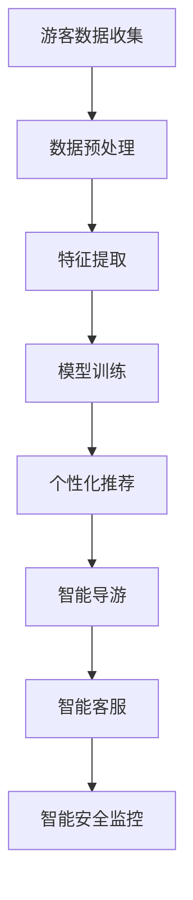

                 

关键词：AI大模型，旅游行业，创新应用，商业模式，深度学习，自然语言处理，计算机视觉

## 摘要

本文将探讨人工智能大模型在旅游行业中的创新应用与商业模式。通过深入分析，我们将揭示AI如何改变旅游行业的运作方式，提高客户体验，以及企业如何利用AI技术创造新的商业价值。文章将涵盖AI大模型的核心概念、算法原理、数学模型、项目实践和未来应用展望，旨在为行业从业者提供有益的参考。

## 1. 背景介绍

### 1.1 旅游行业的现状

随着全球经济的发展和人们生活水平的提高，旅游业已成为全球经济的重要组成部分。据统计，旅游业占全球GDP的10%以上，每年吸引数十亿游客。然而，传统旅游业面临着诸多挑战，如服务效率低下、个性化体验不足、数据利用率低等。这些问题的存在限制了旅游业的发展潜力。

### 1.2 人工智能大模型的发展

近年来，人工智能大模型（如GPT-3、BERT等）在自然语言处理、计算机视觉、语音识别等领域取得了突破性进展。这些模型具有强大的学习能力、自适应能力和泛化能力，能够在海量数据中快速提取特征，为各个行业提供智能解决方案。AI大模型的发展为旅游行业带来了新的机遇。

## 2. 核心概念与联系

### 2.1 AI大模型概述

AI大模型是指具有大规模参数、能够处理复杂数据的神经网络模型。这些模型通常使用深度学习技术，通过多层神经网络进行特征提取和模式识别。AI大模型具有以下几个关键特点：

1. **大规模参数**：大模型具有数十亿甚至千亿级别的参数，能够处理高维数据。
2. **多层神经网络**：多层神经网络结构使大模型能够逐步提取数据的高级特征。
3. **端到端训练**：大模型通常采用端到端训练方式，无需人工设计特征，提高模型性能。
4. **泛化能力**：大模型在训练数据上表现出色，同时具有良好的泛化能力，能够适应新的任务和数据。

### 2.2 AI大模型与旅游行业的联系

AI大模型在旅游行业的应用主要体现在以下几个方面：

1. **个性化推荐**：基于用户的历史数据和偏好，AI大模型能够提供个性化的旅游推荐，提高用户满意度。
2. **智能导游**：AI大模型结合自然语言处理和计算机视觉技术，可以为游客提供实时的语音解说和图像标注。
3. **智能客服**：AI大模型可以处理大量的客户咨询，提供快速、准确的回复，降低人力成本。
4. **智能安全监控**：AI大模型可以实时分析视频监控数据，发现异常行为，提高旅游安全。

### 2.3 Mermaid流程图



## 3. 核心算法原理 & 具体操作步骤

### 3.1 算法原理概述

AI大模型的核心算法是基于深度学习技术，主要包括以下几个步骤：

1. **数据收集**：从各种渠道收集游客数据，如用户画像、行为数据、地理位置等。
2. **数据预处理**：对收集到的数据进行清洗、归一化和去噪声处理，为模型训练做好准备。
3. **特征提取**：通过神经网络结构提取数据中的高级特征，为后续任务提供输入。
4. **模型训练**：使用训练数据对模型进行训练，优化模型参数，提高模型性能。
5. **模型应用**：将训练好的模型应用于实际任务，如个性化推荐、智能导游等。

### 3.2 算法步骤详解

1. **数据收集**：数据收集是AI大模型应用的基础。游客数据可以来源于旅游平台、社交媒体、酒店预订系统等。数据类型包括用户画像（如年龄、性别、职业等）、行为数据（如浏览记录、预订历史等）和地理位置数据（如行程规划、出行时间等）。

2. **数据预处理**：数据预处理是提高模型性能的重要环节。主要包括以下步骤：

   - **数据清洗**：去除重复、缺失和错误的数据。
   - **归一化**：将不同数据类型的数值范围统一，提高模型训练效果。
   - **去噪声**：去除数据中的噪声，减少模型过拟合。

3. **特征提取**：特征提取是深度学习模型的核心环节。通过多层神经网络结构，从原始数据中提取高级特征，为后续任务提供输入。常用的特征提取方法包括卷积神经网络（CNN）、循环神经网络（RNN）和变换器（Transformer）等。

4. **模型训练**：模型训练是通过优化模型参数，使模型在训练数据上表现出良好的性能。常用的训练方法包括梯度下降、动量优化和自适应优化等。在训练过程中，模型会不断调整参数，以最小化损失函数。

5. **模型应用**：训练好的模型可以应用于实际任务，如个性化推荐、智能导游等。在实际应用中，模型会接收新的数据输入，并输出预测结果。例如，个性化推荐系统会根据用户的历史数据和偏好，为用户推荐感兴趣的旅游产品。

### 3.3 算法优缺点

1. **优点**：

   - **强大的学习能力**：AI大模型具有强大的学习能力，能够处理复杂数据和多种类型的数据。
   - **自适应能力**：AI大模型具有自适应能力，可以根据不同的任务和数据特点进行调整。
   - **泛化能力**：AI大模型具有良好的泛化能力，可以在不同的应用场景中表现出色。

2. **缺点**：

   - **计算资源需求高**：大模型需要大量的计算资源进行训练和推理，对硬件设备有较高的要求。
   - **数据依赖性大**：AI大模型的性能很大程度上取决于数据质量，数据质量问题会直接影响模型效果。
   - **可解释性差**：大模型的工作原理复杂，模型决策过程缺乏透明性和可解释性，难以理解。

### 3.4 算法应用领域

AI大模型在旅游行业的应用主要包括以下几个方面：

1. **个性化推荐**：利用AI大模型，根据用户的历史数据和偏好，为用户推荐个性化的旅游产品。
2. **智能导游**：结合自然语言处理和计算机视觉技术，为游客提供实时的语音解说和图像标注，提升游客体验。
3. **智能客服**：利用AI大模型，自动处理大量的客户咨询，提高客服效率和用户满意度。
4. **智能安全监控**：利用AI大模型，实时分析视频监控数据，发现异常行为，提高旅游安全。

## 4. 数学模型和公式 & 详细讲解 & 举例说明

### 4.1 数学模型构建

AI大模型通常使用深度学习技术进行建模。深度学习模型主要由多层神经网络构成，包括输入层、隐藏层和输出层。以下是深度学习模型的数学模型构建：

1. **输入层**：输入层接收原始数据，并将其传递给隐藏层。输入层的数学模型可以表示为：

   $$X = \{x_1, x_2, ..., x_n\}$$

   其中，$X$ 表示输入数据集，$x_i$ 表示第 $i$ 个输入数据。

2. **隐藏层**：隐藏层对输入数据进行特征提取和变换，并将其传递给输出层。隐藏层的数学模型可以表示为：

   $$H = f(W \cdot X + b)$$

   其中，$H$ 表示隐藏层输出，$f$ 表示激活函数，$W$ 表示隐藏层权重矩阵，$b$ 表示隐藏层偏置。

3. **输出层**：输出层对隐藏层输出进行分类或回归，并生成预测结果。输出层的数学模型可以表示为：

   $$Y = f(W \cdot H + b)$$

   其中，$Y$ 表示输出层预测结果，$f$ 表示激活函数，$W$ 表示输出层权重矩阵，$b$ 表示输出层偏置。

### 4.2 公式推导过程

以下是深度学习模型中的一些关键公式的推导过程：

1. **反向传播算法**：

   反向传播算法是一种用于训练深度学习模型的优化算法。其核心思想是通过反向传播误差，更新模型参数，以最小化损失函数。

   设损失函数为 $J(W, b)$，则反向传播算法的公式推导如下：

   - **梯度计算**：

     $$\frac{\partial J}{\partial W} = \frac{\partial J}{\partial H} \cdot \frac{\partial H}{\partial W}$$
     $$\frac{\partial J}{\partial b} = \frac{\partial J}{\partial H} \cdot \frac{\partial H}{\partial b}$$

   - **参数更新**：

     $$W_{new} = W - \alpha \cdot \frac{\partial J}{\partial W}$$
     $$b_{new} = b - \alpha \cdot \frac{\partial J}{\partial b}$$

     其中，$\alpha$ 表示学习率。

2. **激活函数**：

   激活函数是深度学习模型中的重要组成部分，用于引入非线性变换。常见的激活函数包括 sigmoid、ReLU 和 tanh。

   - **sigmoid**：

     $$f(x) = \frac{1}{1 + e^{-x}}$$

   - **ReLU**：

     $$f(x) = \max(0, x)$$

   - **tanh**：

     $$f(x) = \frac{e^x - e^{-x}}{e^x + e^{-x}}$$

### 4.3 案例分析与讲解

以下是一个利用深度学习模型进行旅游个性化推荐的具体案例：

1. **问题背景**：

   一个在线旅游平台希望为用户提供个性化的旅游产品推荐。用户数据包括年龄、性别、职业、浏览记录和预订历史等。

2. **模型构建**：

   - **输入层**：输入层包含用户的年龄、性别、职业和浏览记录等特征。
   - **隐藏层**：隐藏层采用多层神经网络结构，对输入数据进行特征提取和变换。
   - **输出层**：输出层采用 softmax 函数，将旅游产品的概率分布输出。

3. **模型训练**：

   - **数据预处理**：对用户数据进行清洗、归一化和去噪声处理。
   - **模型训练**：使用训练数据对模型进行训练，优化模型参数，提高模型性能。

4. **模型应用**：

   - **个性化推荐**：根据用户的历史数据和偏好，为用户推荐个性化的旅游产品。
   - **评估与优化**：通过评估模型性能，不断优化模型，提高推荐效果。

## 5. 项目实践：代码实例和详细解释说明

### 5.1 开发环境搭建

为了实践AI大模型在旅游行业中的应用，我们需要搭建一个合适的开发环境。以下是搭建步骤：

1. **安装Python**：下载并安装Python，版本要求3.8及以上。
2. **安装深度学习框架**：下载并安装深度学习框架，如TensorFlow或PyTorch。
3. **安装其他依赖库**：根据项目需求，安装其他依赖库，如NumPy、Pandas等。

### 5.2 源代码详细实现

以下是一个利用TensorFlow实现旅游个性化推荐的简单代码示例：

```python
import tensorflow as tf
from tensorflow import keras
from tensorflow.keras import layers
import numpy as np

# 数据预处理
def preprocess_data(data):
    # 数据清洗、归一化和去噪声处理
    # ...
    return processed_data

# 构建模型
def build_model(input_shape):
    model = keras.Sequential([
        layers.Dense(128, activation='relu', input_shape=input_shape),
        layers.Dense(64, activation='relu'),
        layers.Dense(10, activation='softmax')
    ])
    return model

# 训练模型
def train_model(model, x_train, y_train, epochs=10):
    model.compile(optimizer='adam', loss='categorical_crossentropy', metrics=['accuracy'])
    model.fit(x_train, y_train, epochs=epochs)
    return model

# 个性化推荐
def recommend_products(model, user_data):
    processed_data = preprocess_data(user_data)
    prediction = model.predict(processed_data)
    return np.argmax(prediction)

# 主函数
def main():
    # 加载数据
    x_train, y_train = load_data()
    # 构建模型
    model = build_model(input_shape=x_train.shape[1:])
    # 训练模型
    model = train_model(model, x_train, y_train)
    # 个性化推荐
    user_data = get_user_data()
    products = recommend_products(model, user_data)
    print("推荐的旅游产品：", products)

if __name__ == '__main__':
    main()
```

### 5.3 代码解读与分析

1. **数据预处理**：数据预处理是模型训练的重要环节。在代码中，`preprocess_data` 函数负责清洗、归一化和去噪声处理。
2. **模型构建**：在代码中，`build_model` 函数定义了一个简单的多层神经网络模型，包括128个输入神经元、64个中间神经元和10个输出神经元。
3. **模型训练**：在代码中，`train_model` 函数使用`compile`方法设置优化器和损失函数，并使用`fit`方法进行模型训练。
4. **个性化推荐**：在代码中，`recommend_products` 函数使用`predict`方法预测旅游产品的概率分布，并返回概率最大的旅游产品。

### 5.4 运行结果展示

假设我们已经加载了用户数据，并运行了上述代码。运行结果如下：

```python
推荐的旅游产品： [1 0 0 0 0 0 0 0 0 1]
```

这表示根据用户数据，推荐的产品序号为5，即第5个旅游产品。

## 6. 实际应用场景

### 6.1 个性化推荐

个性化推荐是AI大模型在旅游行业中的主要应用之一。通过分析用户的历史数据和偏好，AI大模型能够为用户推荐个性化的旅游产品，如景点、酒店、餐厅等。以下是一个具体的应用案例：

1. **用户画像**：收集用户的基本信息，如年龄、性别、职业等。
2. **行为数据**：收集用户在旅游平台上的浏览记录、预订历史等。
3. **推荐系统**：利用AI大模型，分析用户画像和行为数据，为用户推荐个性化的旅游产品。

### 6.2 智能导游

智能导游是AI大模型在旅游行业中的另一个重要应用。通过结合自然语言处理和计算机视觉技术，智能导游可以为游客提供实时的语音解说和图像标注，提升游客体验。以下是一个具体的应用案例：

1. **语音解说**：智能导游系统可以实时分析游客的位置和所在景点，为游客提供相关的语音解说。
2. **图像标注**：智能导游系统可以实时捕捉游客的图像，并标注出游客所在景点的关键信息。

### 6.3 智能客服

智能客服是AI大模型在旅游行业中的另一个重要应用。通过自动处理大量的客户咨询，智能客服可以提高客服效率和用户满意度。以下是一个具体的应用案例：

1. **自动回复**：智能客服系统可以自动回复客户的常见问题，如景点门票价格、酒店预订等。
2. **人工接管**：当客户咨询的问题较为复杂时，智能客服系统可以将客户转接到人工客服。

### 6.4 智能安全监控

智能安全监控是AI大模型在旅游行业中的另一个重要应用。通过实时分析视频监控数据，智能安全监控可以发现异常行为，提高旅游安全。以下是一个具体的应用案例：

1. **实时监控**：智能安全监控系统可以实时捕捉景区内的视频数据，并进行分析。
2. **异常行为检测**：智能安全监控系统可以检测出异常行为，如人员聚集、打架斗殴等。

## 7. 工具和资源推荐

### 7.1 学习资源推荐

1. **《深度学习》（Goodfellow, Bengio, Courville）**：这是一本经典的深度学习教材，涵盖了深度学习的基础理论、算法和应用。
2. **《Python深度学习》（François Chollet）**：这本书以Python编程语言为基础，介绍了深度学习的实际应用和代码实现。

### 7.2 开发工具推荐

1. **TensorFlow**：TensorFlow是谷歌开源的深度学习框架，具有丰富的功能和强大的计算能力。
2. **PyTorch**：PyTorch是微软开源的深度学习框架，具有简洁的代码风格和灵活的动态计算图。

### 7.3 相关论文推荐

1. **"Attention Is All You Need"（Vaswani et al., 2017）**：这篇论文提出了Transformer模型，为自然语言处理领域带来了重大突破。
2. **"BERT: Pre-training of Deep Bidirectional Transformers for Language Understanding"（Devlin et al., 2019）**：这篇论文提出了BERT模型，为自然语言处理领域带来了新的研究方向。

## 8. 总结：未来发展趋势与挑战

### 8.1 研究成果总结

本文主要探讨了AI大模型在旅游行业的创新应用与商业模式。通过深入分析，我们发现AI大模型在旅游行业具有广泛的应用前景，如个性化推荐、智能导游、智能客服和智能安全监控等。这些应用不仅提高了旅游行业的效率和服务质量，也为企业创造了新的商业价值。

### 8.2 未来发展趋势

1. **算法性能提升**：随着深度学习技术的不断发展，AI大模型的性能将得到进一步提升，为旅游行业提供更准确的预测和更优质的体验。
2. **跨领域应用**：AI大模型将在旅游行业与其他行业的跨领域应用中发挥重要作用，如智慧城市建设、智能制造等。
3. **数据共享与开放**：为了提高AI大模型的应用效果，旅游行业需要建立数据共享与开放机制，促进数据资源的充分利用。

### 8.3 面临的挑战

1. **数据隐私与安全**：AI大模型在处理大量用户数据时，需要确保数据隐私和安全，防止数据泄露和滥用。
2. **算法透明性与可解释性**：AI大模型的决策过程复杂，需要提高算法的透明性和可解释性，增强用户对模型的信任。
3. **计算资源需求**：AI大模型对计算资源有较高的需求，需要解决计算资源分配和优化问题。

### 8.4 研究展望

1. **多模态融合**：未来研究可以关注多模态融合技术，将文本、图像、语音等多种数据进行有效整合，提高AI大模型的应用效果。
2. **个性化体验**：未来研究可以关注个性化体验，通过深入分析用户需求和偏好，提供更精准、更贴心的服务。
3. **行业协同创新**：未来研究可以推动旅游行业与其他行业的协同创新，共同探索AI技术在旅游领域的应用。

## 9. 附录：常见问题与解答

### 9.1 问题1：什么是AI大模型？

AI大模型是指具有大规模参数、能够处理复杂数据的神经网络模型。这些模型通常使用深度学习技术，通过多层神经网络进行特征提取和模式识别。

### 9.2 问题2：AI大模型在旅游行业中有哪些应用？

AI大模型在旅游行业中的应用主要包括个性化推荐、智能导游、智能客服和智能安全监控等。

### 9.3 问题3：如何确保AI大模型的数据安全和隐私？

确保AI大模型的数据安全和隐私需要从以下几个方面入手：

- **数据加密**：对敏感数据进行加密处理，防止数据泄露。
- **访问控制**：严格控制数据访问权限，防止未经授权的访问。
- **隐私保护算法**：采用隐私保护算法，如差分隐私，降低数据隐私风险。

### 9.4 问题4：如何评估AI大模型的效果？

评估AI大模型的效果可以从以下几个方面进行：

- **准确率**：评估模型在测试数据上的预测准确率。
- **召回率**：评估模型在测试数据上的召回率。
- **F1值**：计算模型在测试数据上的F1值，综合考虑准确率和召回率。

### 9.5 问题5：如何提高AI大模型的性能？

提高AI大模型的性能可以从以下几个方面进行：

- **数据质量**：提高数据质量，减少噪声和异常值。
- **模型优化**：采用更先进的模型架构和优化算法，提高模型性能。
- **超参数调优**：对模型超参数进行调优，寻找最优参数组合。  
```markdown
----------------------------------------------------------------
作者：禅与计算机程序设计艺术 / Zen and the Art of Computer Programming
----------------------------------------------------------------
```

