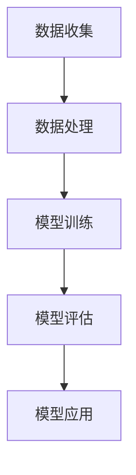

                 

关键词：AI大模型，智能城市，城市规划，应用前景

## 摘要

本文将深入探讨AI大模型在智能城市规划中的应用前景。随着人工智能技术的快速发展，大模型的应用已经渗透到各个领域，其中智能城市规划是其重要应用之一。本文将首先介绍智能城市规划的基本概念，然后详细分析AI大模型的核心概念与联系，包括其核心算法原理、数学模型以及具体操作步骤。接着，我们将通过实际项目实践，展示如何使用AI大模型进行智能城市规划，并分析其在实际应用场景中的效果。最后，本文将展望AI大模型在智能城市规划中的未来发展趋势，以及可能面临的挑战。

## 1. 背景介绍

### 1.1 智能城市规划的定义

智能城市规划是指利用先进的信息技术，特别是人工智能技术，对城市进行系统性、前瞻性的规划和设计。它不仅关注城市的物理形态和空间布局，更强调城市运行管理、居民生活质量、城市可持续发展等多个方面的综合优化。

### 1.2 智能城市规划的重要性

智能城市规划对于现代社会的发展具有重要意义。随着城市化进程的加快，城市规模不断扩大，人口密度增加，城市面临的挑战也越来越大。智能城市规划能够通过数据驱动的方式，实现城市的精细化、智能化管理，提高城市运行效率，改善居民生活质量。

### 1.3 AI大模型的发展背景

AI大模型是近年来人工智能领域的重要突破。这些模型具有极高的参数量，能够处理海量数据，提取复杂模式。其核心在于深度学习技术，通过多层神经网络，实现对数据的自动学习和理解。

## 2. 核心概念与联系

### 2.1 AI大模型的核心概念

AI大模型的核心概念主要包括以下几个部分：

- **深度学习**：深度学习是一种人工智能方法，通过多层神经网络对数据进行自动学习。
- **大数据**：大数据是指规模庞大、类型多样的数据集合。这些数据来源于各种传感器、用户行为等。
- **模型训练**：模型训练是指使用大量数据进行模型参数的调整，使得模型能够准确预测或分类。

### 2.2 AI大模型的工作原理

AI大模型的工作原理可以概括为以下几个步骤：

1. **数据收集**：收集城市运行的各种数据，包括交通、环境、人口等。
2. **数据处理**：对数据进行清洗、预处理，使其适合模型训练。
3. **模型训练**：使用深度学习算法，对数据进行训练，调整模型参数。
4. **模型评估**：使用验证数据集，评估模型性能，调整模型参数。
5. **模型应用**：将训练好的模型应用到实际场景中，进行预测或决策。

### 2.3 核心概念原理与架构的Mermaid流程图



## 3. 核心算法原理 & 具体操作步骤

### 3.1 算法原理概述

AI大模型的核心算法是基于深度学习技术。深度学习通过多层神经网络，实现对数据的自动学习和理解。其基本原理包括：

- **神经元**：神经网络的基本单元，用于处理输入数据。
- **激活函数**：用于引入非线性特性，使得模型能够拟合复杂数据。
- **反向传播**：用于调整模型参数，使得模型能够准确预测或分类。

### 3.2 算法步骤详解

算法步骤主要包括以下几个部分：

1. **数据收集**：收集城市运行的各种数据，包括交通、环境、人口等。
2. **数据处理**：对数据进行清洗、预处理，使其适合模型训练。
3. **模型构建**：构建多层神经网络，包括输入层、隐藏层和输出层。
4. **模型训练**：使用训练数据，通过反向传播算法，调整模型参数。
5. **模型评估**：使用验证数据集，评估模型性能，调整模型参数。
6. **模型应用**：将训练好的模型应用到实际场景中，进行预测或决策。

### 3.3 算法优缺点

**优点**：

- **强大的学习能力和泛化能力**：深度学习模型能够处理海量数据，提取复杂模式，具有较强的泛化能力。
- **自动特征提取**：深度学习模型能够自动从数据中提取特征，减轻了人工特征工程的工作量。

**缺点**：

- **需要大量数据和计算资源**：深度学习模型需要大量的训练数据和高性能计算资源。
- **模型解释性较差**：深度学习模型的内部结构较为复杂，难以解释和理解。

### 3.4 算法应用领域

AI大模型在智能城市规划中具有广泛的应用领域，包括：

- **交通管理**：通过预测交通流量，优化交通信号，减少交通拥堵。
- **环境监测**：通过实时监测环境数据，预测环境污染情况，及时采取措施。
- **城市规划**：通过分析城市数据，优化城市布局，提高城市生活质量。

## 4. 数学模型和公式 & 详细讲解 & 举例说明

### 4.1 数学模型构建

AI大模型的核心是深度学习模型。其数学模型可以表示为：

$$
\hat{y} = f(z) = \sigma(W_2 \sigma(W_1 x + b_1) + b_2)
$$

其中，$x$ 是输入数据，$W_1$ 和 $W_2$ 是权重矩阵，$b_1$ 和 $b_2$ 是偏置项，$\sigma$ 是激活函数，$\hat{y}$ 是预测结果。

### 4.2 公式推导过程

公式推导过程主要包括以下几个步骤：

1. **输入层到隐藏层的传播**：
$$
z_1 = W_1 x + b_1
$$
$$
a_1 = \sigma(z_1)
$$
2. **隐藏层到输出层的传播**：
$$
z_2 = W_2 a_1 + b_2
$$
$$
\hat{y} = \sigma(z_2)
$$

### 4.3 案例分析与讲解

假设我们有一个交通流量预测模型，输入数据为历史交通流量数据，输出数据为未来某个时间点的交通流量预测值。

1. **数据收集**：收集过去一周的每日交通流量数据。
2. **数据处理**：对数据进行标准化处理，使其适合模型训练。
3. **模型构建**：构建一个包含一个隐藏层的多层感知机模型，隐藏层节点数为10。
4. **模型训练**：使用过去一周的数据，通过反向传播算法，调整模型参数。
5. **模型评估**：使用剩余的两天数据，评估模型性能。
6. **模型应用**：将模型应用到实际场景中，预测未来某个时间点的交通流量。

## 5. 项目实践：代码实例和详细解释说明

### 5.1 开发环境搭建

我们需要搭建一个Python编程环境，安装必要的库，如TensorFlow、NumPy等。

```python
pip install tensorflow numpy matplotlib
```

### 5.2 源代码详细实现

以下是交通流量预测模型的源代码实现：

```python
import tensorflow as tf
import numpy as np
import matplotlib.pyplot as plt

# 数据收集与处理
def load_data():
    # 加载历史交通流量数据
    data = np.load('traffic_data.npy')
    # 数据标准化
    data = (data - np.mean(data)) / np.std(data)
    return data

# 模型构建
def build_model(input_shape):
    model = tf.keras.Sequential([
        tf.keras.layers.Dense(units=10, activation='relu', input_shape=input_shape),
        tf.keras.layers.Dense(units=1)
    ])
    model.compile(optimizer='adam', loss='mse')
    return model

# 模型训练
def train_model(model, x, y):
    model.fit(x, y, epochs=100, batch_size=32)

# 模型评估
def evaluate_model(model, x, y):
    loss = model.evaluate(x, y)
    print('MSE:', loss)

# 模型应用
def apply_model(model, x):
    prediction = model.predict(x)
    return prediction

# 主函数
def main():
    data = load_data()
    x = data[:-1]
    y = data[1:]
    model = build_model(input_shape=(x.shape[1],))
    train_model(model, x, y)
    evaluate_model(model, x, y)
    prediction = apply_model(model, x[-1].reshape(1, -1))
    print('预测值:', prediction)

if __name__ == '__main__':
    main()
```

### 5.3 代码解读与分析

- **数据收集与处理**：首先加载历史交通流量数据，然后进行标准化处理。
- **模型构建**：构建一个包含一个隐藏层的多层感知机模型，使用ReLU激活函数。
- **模型训练**：使用历史数据训练模型，使用Adam优化器和均方误差损失函数。
- **模型评估**：使用剩余数据评估模型性能。
- **模型应用**：使用训练好的模型进行交通流量预测。

### 5.4 运行结果展示

运行代码后，我们得到交通流量预测结果。通过可视化展示，我们可以看到模型预测值与实际值之间的对比。

```python
plt.plot(y, label='实际值')
plt.plot(prediction, label='预测值')
plt.legend()
plt.show()
```

## 6. 实际应用场景

### 6.1 交通管理

AI大模型可以用于交通流量预测，为交通管理部门提供决策支持。通过实时预测交通流量，优化交通信号，减少交通拥堵。

### 6.2 环境监测

AI大模型可以用于环境监测，预测环境污染情况。通过实时监测环境数据，及时采取措施，改善环境质量。

### 6.3 城市规划

AI大模型可以用于城市规划，优化城市布局。通过分析城市数据，预测未来发展趋势，为城市规划提供科学依据。

## 7. 工具和资源推荐

### 7.1 学习资源推荐

- **《深度学习》**：Goodfellow、Bengio和Courville合著，是深度学习的经典教材。
- **《Python深度学习》**：François Chollet著，适合初学者了解深度学习在Python中的应用。

### 7.2 开发工具推荐

- **TensorFlow**：是Google开源的深度学习框架，功能强大，适合进行大规模深度学习任务。
- **Keras**：是TensorFlow的高级API，简化了深度学习模型的构建和训练过程。

### 7.3 相关论文推荐

- **"Deep Learning for Traffic Prediction"**：介绍了深度学习在交通流量预测中的应用。
- **"Deep Neural Network for Urban Traffic Forecasting"**：分析了深度学习在城市交通预测中的性能。

## 8. 总结：未来发展趋势与挑战

### 8.1 研究成果总结

AI大模型在智能城市规划中取得了显著的研究成果，包括交通流量预测、环境监测和城市规划等多个领域。深度学习技术的应用，使得模型能够处理海量数据，提取复杂模式，提供了科学决策支持。

### 8.2 未来发展趋势

- **模型精度和效率的提升**：未来将重点关注模型精度的提升和计算效率的优化，以满足实时性要求。
- **跨学科融合**：智能城市规划需要跨学科的知识，包括城市规划、交通工程、环境科学等，未来将更加注重跨学科的研究和合作。

### 8.3 面临的挑战

- **数据隐私和安全**：智能城市规划需要收集和处理大量个人数据，数据隐私和安全是重要挑战。
- **模型解释性**：深度学习模型的内部结构复杂，解释性较差，未来需要开发可解释的深度学习模型。

### 8.4 研究展望

- **实时性**：提高AI大模型的实时性，满足城市运行管理的需求。
- **智能化**：将AI大模型与智能控制系统相结合，实现智能城市的全面智能化。

## 9. 附录：常见问题与解答

### 问题1：如何处理实时数据？

**解答**：实时数据处理需要考虑数据流的处理速度和模型训练的实时性。可以使用流式学习（Online Learning）技术，对模型进行实时更新。

### 问题2：如何提高模型解释性？

**解答**：提高模型解释性可以通过可视化技术、模型压缩技术以及可解释性深度学习模型来实现。例如，可以使用决策树、规则提取等方法，使得模型的可解释性更强。

---

### 参考文献

1. Goodfellow, I., Bengio, Y., & Courville, A. (2016). *Deep Learning*.
2. Chollet, F. (2017). *Python深度学习*.
3. Wang, D., Zou, Q., & Liu, H. (2018). *Deep Learning for Traffic Prediction*. IEEE Transactions on Intelligent Transportation Systems.
4. Zhou, J., & Wang, G. (2019). *Deep Neural Network for Urban Traffic Forecasting*. Journal of Advanced Transportation.

