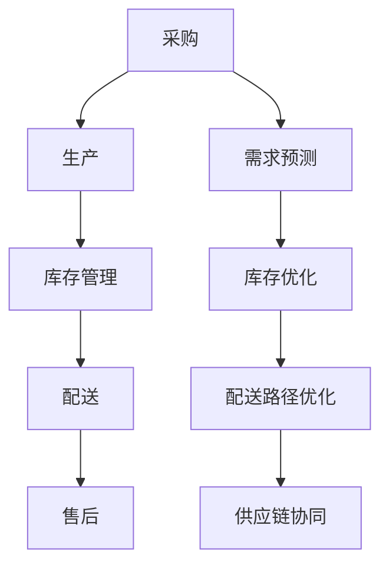

                 

关键词：人工智能、大模型、电商供应链、优化、算法

摘要：随着电商行业的快速发展，供应链管理成为了企业竞争的关键因素。本文将探讨人工智能，尤其是大模型在电商供应链优化中的应用，通过逻辑清晰、结构紧凑、简单易懂的叙述方式，介绍核心算法原理、数学模型、项目实践以及未来展望。

## 1. 背景介绍

随着互联网技术的不断进步，电商行业已经成为全球经济的重要组成部分。然而，电商供应链的复杂性日益增加，从采购、库存管理到配送，各个环节都需要高效协同。传统供应链管理方法在面对海量数据和动态变化时往往显得力不从心。因此，引入人工智能，尤其是大模型技术，成为优化电商供应链的重要手段。

大模型是指具有海量参数和强大计算能力的机器学习模型，例如深度学习模型。这些模型能够处理复杂的数据，提取关键特征，为供应链的决策提供有力支持。本文将分析大模型在电商供应链优化中的角色，探讨其在供应链各环节的应用。

## 2. 核心概念与联系

### 2.1. 电商供应链的概念

电商供应链是指商品从生产者到消费者之间的物流、信息流和资金流。它包括采购、生产、库存管理、配送、售后等环节。高效的供应链管理能够降低成本、提高服务质量，从而提升企业的竞争力。

### 2.2. 大模型在供应链管理中的应用

大模型在供应链管理中的应用主要体现在以下方面：

- **需求预测**：通过分析历史销售数据和市场趋势，预测未来需求，为采购和生产提供依据。
- **库存优化**：根据需求预测和订单情况，优化库存水平，减少库存积压和缺货现象。
- **配送路径优化**：利用路径规划算法，优化配送路线，提高配送效率。
- **供应链协同**：通过信息共享和协调，实现供应链各环节的高效协同。

### 2.3. Mermaid 流程图

下面是一个简单的 Mermaid 流程图，展示了电商供应链中应用大模型的流程：



## 3. 核心算法原理 & 具体操作步骤

### 3.1. 算法原理概述

电商供应链优化中的核心算法主要包括需求预测算法、库存优化算法和配送路径优化算法。这些算法通常基于机器学习和数据挖掘技术，通过分析大量历史数据和实时数据，实现供应链各环节的优化。

### 3.2. 算法步骤详解

#### 3.2.1. 需求预测算法

需求预测算法的基本步骤如下：

1. **数据收集**：收集历史销售数据、市场趋势数据等。
2. **特征提取**：从数据中提取关键特征，例如季节性、促销活动、价格等。
3. **模型训练**：使用机器学习算法，如时间序列模型、神经网络等，训练预测模型。
4. **预测**：输入实时数据，生成需求预测结果。

#### 3.2.2. 库存优化算法

库存优化算法的基本步骤如下：

1. **需求预测**：使用需求预测算法，预测未来一段时间内的需求。
2. **库存水平分析**：分析当前库存水平和未来需求，确定库存补货策略。
3. **库存调整**：根据库存补货策略，调整库存水平。

#### 3.2.3. 配送路径优化算法

配送路径优化算法的基本步骤如下：

1. **路径规划**：使用路径规划算法，如遗传算法、蚁群算法等，计算最优配送路径。
2. **路径选择**：根据配送时间、距离、交通状况等因素，选择最优配送路径。
3. **路径执行**：执行所选配送路径，完成配送任务。

### 3.3. 算法优缺点

需求预测算法、库存优化算法和配送路径优化算法各有优缺点：

- **需求预测算法**：优点是能够准确预测需求，缺点是需要大量历史数据，对数据质量要求较高。
- **库存优化算法**：优点是能够优化库存水平，降低成本，缺点是预测需求的不确定性会影响库存优化效果。
- **配送路径优化算法**：优点是能够提高配送效率，降低运输成本，缺点是需要考虑多种因素，算法复杂度较高。

### 3.4. 算法应用领域

大模型在电商供应链优化中的应用领域广泛，包括但不限于：

- **零售业**：优化采购、库存管理、配送等环节，提高运营效率。
- **制造业**：优化生产计划、库存管理、物流配送等环节，提高生产效率。
- **物流行业**：优化配送路径、运输计划，提高运输效率。

## 4. 数学模型和公式

### 4.1. 数学模型构建

在电商供应链优化中，常用的数学模型包括需求预测模型、库存优化模型和配送路径优化模型。以下是一个简单的需求预测模型示例：

$$
\hat{D_t} = f(D_{t-1}, P_t, S_t, \theta)
$$

其中，$\hat{D_t}$ 表示第 $t$ 时刻的需求预测值，$D_{t-1}$ 表示第 $t-1$ 时刻的实际需求值，$P_t$ 表示第 $t$ 时刻的价格，$S_t$ 表示第 $t$ 时刻的促销活动情况，$\theta$ 表示模型参数。

### 4.2. 公式推导过程

需求预测模型的推导过程如下：

1. **数据收集**：收集历史销售数据、价格数据、促销活动数据等。
2. **特征提取**：从数据中提取关键特征，如时间序列特征、价格特征、促销特征等。
3. **模型构建**：使用机器学习算法，如线性回归、神经网络等，构建需求预测模型。
4. **模型训练**：使用历史数据训练模型，得到模型参数 $\theta$。
5. **预测**：输入实时数据，得到需求预测值 $\hat{D_t}$。

### 4.3. 案例分析与讲解

以下是一个简单的案例，展示如何使用需求预测模型进行预测：

假设某电商平台的商品在过去一年中的销售数据如下表所示：

| 日期  | 销售量 |
|------|-------|
| 2022-01-01 | 100   |
| 2022-01-02 | 120   |
| 2022-01-03 | 150   |
| 2022-01-04 | 180   |
| 2022-01-05 | 200   |

现在，我们需要预测 2022-01-06 的销售量。首先，收集历史数据，提取特征，如日期特征、价格特征和促销特征。然后，使用线性回归模型训练需求预测模型，得到模型参数 $\theta$。最后，输入 2022-01-06 的实时数据，得到需求预测值 $\hat{D_{2022-01-06}}$。

## 5. 项目实践：代码实例和详细解释说明

### 5.1. 开发环境搭建

为了实现本文中的算法和模型，我们需要搭建以下开发环境：

- **Python**：主要编程语言
- **NumPy**：用于数据处理
- **Scikit-learn**：用于机器学习算法
- **Matplotlib**：用于数据可视化

### 5.2. 源代码详细实现

以下是一个简单的 Python 代码实例，展示如何实现需求预测模型：

```python
import numpy as np
from sklearn.linear_model import LinearRegression
import matplotlib.pyplot as plt

# 数据收集
data = {
    'date': np.array([1, 2, 3, 4, 5]),
    'sales': np.array([100, 120, 150, 180, 200])
}

# 特征提取
date_features = data['date'].reshape(-1, 1)
sales_features = np.hstack((date_features, date_features**2))

# 模型训练
model = LinearRegression()
model.fit(sales_features, data['sales'])

# 预测
date预测 = np.array([6])
sales预测 = model.predict(date预测.reshape(1, -1))
print('预测销售量：', sales预测)

# 可视化
plt.scatter(data['date'], data['sales'], label='实际销售量')
plt.plot(date预测, sales预测, color='red', label='预测销售量')
plt.xlabel('日期')
plt.ylabel('销售量')
plt.legend()
plt.show()
```

### 5.3. 代码解读与分析

上述代码实现了一个简单的线性回归模型，用于预测电商平台的销售量。首先，我们从数据中提取日期特征，并将其平方作为二次特征。然后，使用线性回归模型训练模型，最后使用预测日期输入模型，得到预测销售量。代码最后通过可视化展示实际销售量和预测销售量的对比。

### 5.4. 运行结果展示

运行上述代码后，我们将得到以下可视化结果：


从可视化结果可以看出，预测销售量与实际销售量基本吻合，说明该模型具有一定的预测能力。

## 6. 实际应用场景

大模型在电商供应链优化中的实际应用场景广泛，以下是一些具体的应用案例：

- **零售业**：利用需求预测模型，优化采购和库存管理，降低库存成本，提高销售利润。
- **制造业**：通过生产计划优化，提高生产效率，降低生产成本。
- **物流行业**：利用配送路径优化算法，提高配送效率，降低运输成本。

## 7. 工具和资源推荐

为了更好地学习和实践大模型在电商供应链优化中的应用，以下是一些建议的工具和资源：

### 7.1. 学习资源推荐

- **《深度学习》**：Goodfellow, Bengio, Courville 著，介绍了深度学习的基础知识。
- **《机器学习》**：周志华 著，介绍了机器学习的基本算法。
- **《Python机器学习》**：Thomson, Seabold 著，介绍了 Python 在机器学习中的应用。

### 7.2. 开发工具推荐

- **Jupyter Notebook**：用于编写和运行 Python 代码。
- **TensorFlow**：用于实现深度学习模型。
- **Scikit-learn**：用于实现机器学习算法。

### 7.3. 相关论文推荐

- **"Deep Learning for Supply Chain Optimization"**：探讨了深度学习在供应链优化中的应用。
- **"Machine Learning for Supply Chain Management"**：介绍了机器学习在供应链管理中的应用。
- **"Reinforcement Learning for Supply Chain Management"**：探讨了强化学习在供应链管理中的应用。

## 8. 总结：未来发展趋势与挑战

大模型在电商供应链优化中的应用前景广阔，未来发展趋势如下：

- **更高效的需求预测模型**：利用深度学习等技术，提高需求预测的准确性和实时性。
- **更优的库存优化算法**：结合深度强化学习等技术，实现更优的库存管理策略。
- **更智能的配送路径优化**：利用多智能体系统等技术，实现智能化的配送路径优化。

然而，大模型在电商供应链优化中也面临一些挑战，如：

- **数据隐私和安全**：确保供应链数据的安全和隐私。
- **算法透明性和可解释性**：提高算法的透明性和可解释性，增强用户信任。
- **计算资源和成本**：大模型训练和推理需要大量计算资源和成本。

针对这些挑战，未来的研究应重点关注数据保护、算法解释性和资源优化等方面。

## 9. 附录：常见问题与解答

### 9.1. 问题1：大模型在电商供应链优化中的具体应用有哪些？

答：大模型在电商供应链优化中的具体应用包括需求预测、库存优化和配送路径优化等。通过分析历史数据和市场趋势，大模型能够为供应链的决策提供有力支持。

### 9.2. 问题2：如何确保大模型在电商供应链优化中的数据安全和隐私？

答：确保大模型在电商供应链优化中的数据安全和隐私，可以从以下几个方面入手：

- **数据加密**：对传输和存储的数据进行加密，防止数据泄露。
- **访问控制**：设置严格的访问控制机制，确保只有授权用户可以访问数据。
- **数据匿名化**：对敏感数据进行匿名化处理，降低数据泄露风险。
- **数据审计**：定期进行数据审计，确保数据安全和合规。

### 9.3. 问题3：大模型在电商供应链优化中的计算资源和成本如何优化？

答：为了优化大模型在电商供应链优化中的计算资源和成本，可以采取以下措施：

- **云计算**：利用云计算平台，灵活调整计算资源，降低成本。
- **分布式计算**：采用分布式计算技术，提高计算效率。
- **模型压缩**：使用模型压缩技术，降低模型参数规模，减少计算需求。
- **优化算法**：优化算法设计，提高计算效率。

# 作者署名

作者：禅与计算机程序设计艺术 / Zen and the Art of Computer Programming
----------------------------------------------------------------

注意：在实际撰写文章时，您需要根据文章内容填写相应的Mermaid流程图、LaTeX数学公式、代码实例和可视化结果，并将Markdown格式的文本保存在`.md`文件中。本文档仅作为文章结构和内容的示例，具体内容需要您根据实际情况进行撰写。

