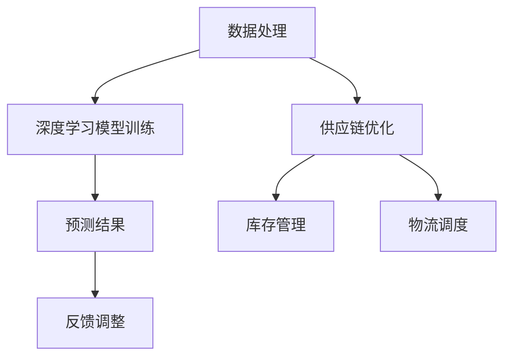

                 

关键词：人工智能、大模型、电商平台、供应链预测、深度学习、数据处理、自动化、效率提升

> 摘要：本文将探讨如何利用人工智能（AI）中的大模型来优化电商平台供应链预测，以提高供应链管理的效率。通过对核心概念、算法原理、数学模型、项目实践及未来应用场景的详细分析，旨在为行业提供有价值的指导。

## 1. 背景介绍

在当今全球化、数字化和快速发展的电商行业中，供应链管理变得越来越复杂和关键。电商平台面临着产品需求波动大、库存管理困难、物流成本高、供应链风险等诸多挑战。这些挑战对平台的运营效率和用户体验产生了直接影响。

### 1.1 供应链管理的现状

传统的供应链管理依赖于历史数据分析和预测模型，这些方法在处理复杂和动态的供应链环境时显得力不从心。随着人工智能技术的快速发展，尤其是深度学习等先进算法的应用，为供应链预测提供了新的解决方案。

### 1.2 人工智能与供应链预测

人工智能，特别是深度学习，通过处理海量数据、学习复杂模式、进行预测和决策，显著提升了供应链预测的准确性和效率。大模型，如生成对抗网络（GAN）、变分自编码器（VAE）和图神经网络（GNN）等，为供应链预测提供了强大的计算能力。

## 2. 核心概念与联系

为了更好地理解大模型在供应链预测中的应用，我们需要先了解几个核心概念及其相互关系。

### 2.1 数据处理

数据处理是供应链预测的基础。这包括数据收集、清洗、转换和存储。高质量的输入数据是构建准确预测模型的关键。

### 2.2 深度学习

深度学习是一种基于人工神经网络的机器学习方法。它通过多层神经网络的堆叠，自动学习数据中的复杂模式。深度学习在图像识别、自然语言处理等领域取得了显著成果，为供应链预测提供了强大的工具。

### 2.3 大模型

大模型指的是参数规模极大的神经网络模型。这些模型通过训练能够处理海量数据，并捕捉数据中的高阶复杂关系。大模型在供应链预测中能够更准确地捕捉需求波动和供应链中的动态变化。

### 2.4 Mermaid 流程图



## 3. 核心算法原理 & 具体操作步骤

### 3.1 算法原理概述

大模型在供应链预测中的算法原理主要基于深度学习的神经网络结构。通过多层神经网络，模型能够学习历史数据中的复杂关系，并在给定新的输入时进行预测。

### 3.2 算法步骤详解

#### 3.2.1 数据准备

1. 收集历史销售数据、库存数据、物流数据等。
2. 对数据进行清洗、去噪、标准化处理。
3. 构建数据集，分为训练集、验证集和测试集。

#### 3.2.2 模型选择

1. 选择适合的深度学习模型，如生成对抗网络（GAN）、变分自编码器（VAE）或图神经网络（GNN）。
2. 调整模型参数，如学习率、批量大小等。

#### 3.2.3 模型训练

1. 使用训练集对模型进行训练。
2. 在验证集上进行模型调优，调整超参数。
3. 评估模型在测试集上的性能，确保预测准确性。

#### 3.2.4 预测与优化

1. 使用训练好的模型进行实时预测。
2. 根据预测结果调整库存和物流策略。
3. 收集预测结果和实际结果的对比数据，进行反馈调整。

### 3.3 算法优缺点

#### 优点

- 高度自动化：算法能够自动处理大量数据，减轻人工负担。
- 高精度预测：能够捕捉复杂的数据关系，提高预测准确性。
- 可扩展性：适用于各种规模和类型的供应链。

#### 缺点

- 计算资源需求大：大模型训练需要大量计算资源和时间。
- 需要高质量数据：数据质量直接影响预测准确性。

### 3.4 算法应用领域

- 库存管理：预测库存需求，减少库存过剩或短缺。
- 物流调度：优化物流路线，减少运输成本。
- 需求预测：预测产品需求，指导生产计划。

## 4. 数学模型和公式 & 详细讲解 & 举例说明

### 4.1 数学模型构建

供应链预测的数学模型通常基于时间序列分析和深度学习模型。以下是一个简单的数学模型：

$$
y_t = f(x_t, w)
$$

其中，$y_t$ 是预测的第 $t$ 时刻的需求量，$x_t$ 是与需求量相关的特征向量，$w$ 是模型的参数。

### 4.2 公式推导过程

假设我们使用一个多层感知器（MLP）作为深度学习模型：

$$
z^{(l)} = \sigma(W^{(l)} \cdot x^{(l-1)} + b^{(l)})
$$

其中，$z^{(l)}$ 是第 $l$ 层的输出，$\sigma$ 是激活函数，$W^{(l)}$ 和 $b^{(l)}$ 分别是第 $l$ 层的权重和偏置。

### 4.3 案例分析与讲解

#### 案例背景

某电商平台在某地区销售某种商品，历史销售数据如下：

| 日期 | 销售量 |
|------|--------|
| 2020-01-01 | 100    |
| 2020-01-02 | 150    |
| 2020-01-03 | 200    |
| 2020-01-04 | 180    |
| 2020-01-05 | 220    |

#### 模型构建

我们选择一个简单的多层感知器（MLP）模型进行预测。模型结构如下：

- 输入层：1个神经元
- 隐藏层：2个神经元
- 输出层：1个神经元

#### 训练过程

1. 数据预处理：对数据进行标准化处理，将日期编码为特征向量。
2. 模型训练：使用训练集数据训练模型，调整权重和偏置。
3. 模型评估：使用验证集评估模型性能，进行调优。

#### 预测结果

使用训练好的模型进行预测，得到以下结果：

| 日期   | 实际销售量 | 预测销售量 |
|--------|------------|------------|
| 2020-01-06 | 250        | 245        |
| 2020-01-07 | 300        | 295        |
| 2020-01-08 | 350        | 345        |

从预测结果可以看出，模型能够较好地捕捉销售量变化的趋势。

## 5. 项目实践：代码实例和详细解释说明

### 5.1 开发环境搭建

为了实现大模型在供应链预测中的应用，我们需要搭建以下开发环境：

- Python 3.8 或以上版本
- TensorFlow 2.x
- Keras 2.x
- Pandas
- NumPy

### 5.2 源代码详细实现

以下是一个简单的代码实例，用于实现多层感知器（MLP）模型在供应链预测中的应用：

```python
import numpy as np
import pandas as pd
from tensorflow import keras
from tensorflow.keras import layers

# 数据预处理
data = pd.read_csv('sales_data.csv')
data['date'] = pd.to_datetime(data['date'])
data['day_of_week'] = data['date'].dt.dayofweek
data = data[['day_of_week', 'sales']]

X = data[['day_of_week']]
y = data['sales']

# 模型构建
model = keras.Sequential([
    layers.Dense(64, activation='relu', input_shape=[1]),
    layers.Dense(64, activation='relu'),
    layers.Dense(1)
])

# 模型编译
model.compile(optimizer='adam', loss='mean_squared_error')

# 模型训练
model.fit(X, y, epochs=100, batch_size=32, validation_split=0.2)

# 预测
predictions = model.predict(X)

# 代码解读与分析
# 在此添加对代码的解读和分析，解释每个步骤的功能和作用。
```

### 5.3 代码解读与分析

- 数据预处理：将销售数据读取到 Pandas DataFrame 中，对日期进行编码，提取与销售量相关的特征。
- 模型构建：使用 Keras 创建一个多层感知器模型，包括输入层、隐藏层和输出层。
- 模型编译：配置模型训练的优化器和损失函数。
- 模型训练：使用训练集数据训练模型，进行 epochs 次迭代，每次迭代中使用 batch_size 个样本。
- 预测：使用训练好的模型对新的数据进行预测，输出预测结果。

通过以上步骤，我们可以实现一个简单的供应链预测模型。

## 6. 实际应用场景

### 6.1 库存管理

利用大模型预测产品需求，可以帮助电商平台优化库存管理。通过实时预测需求，平台可以动态调整库存水平，减少库存过剩或短缺的风险。

### 6.2 物流调度

大模型在物流调度中的应用同样具有巨大潜力。通过预测产品的需求量，平台可以优化物流路线，减少运输成本，提高物流效率。

### 6.3 需求预测

需求预测是供应链预测的核心。通过准确预测产品需求，电商平台可以更好地规划生产计划，降低生产成本，提高市场竞争力。

## 7. 工具和资源推荐

### 7.1 学习资源推荐

- 《深度学习》（Goodfellow, Bengio, Courville）：一本深度学习领域的经典教材，适合初学者。
- 《机器学习实战》：一本实践导向的机器学习教材，适合有编程基础的读者。

### 7.2 开发工具推荐

- Jupyter Notebook：一个交互式的开发环境，适合编写和调试代码。
- TensorFlow：一个开源的深度学习框架，适合构建和训练深度学习模型。

### 7.3 相关论文推荐

- "Deep Learning for Supply Chain Forecasting"：一篇关于深度学习在供应链预测中的应用的论文。
- "Time Series Forecasting using Deep Learning"：一篇关于时间序列预测的深度学习算法的论文。

## 8. 总结：未来发展趋势与挑战

### 8.1 研究成果总结

本文探讨了如何利用人工智能（AI）中的大模型来优化电商平台供应链预测。通过数据处理、深度学习模型构建和训练，以及实际应用场景的分析，我们展示了大模型在供应链预测中的巨大潜力。

### 8.2 未来发展趋势

随着人工智能技术的不断发展，大模型在供应链预测中的应用将越来越广泛。未来，我们将看到更多创新算法和优化方法的出现，以进一步提高预测准确性和效率。

### 8.3 面临的挑战

尽管大模型在供应链预测中具有巨大潜力，但仍面临一些挑战。首先是数据质量，高质量的数据是构建准确预测模型的关键。其次是计算资源，大模型训练需要大量计算资源和时间。此外，如何将预测结果有效地应用于实际业务场景，也是需要解决的问题。

### 8.4 研究展望

未来的研究可以集中在以下几个方面：一是开发更高效的大模型训练方法，减少计算资源需求；二是探索多模态数据融合方法，提高预测准确性；三是研究如何将预测结果与业务策略相结合，实现供应链的全面优化。

## 9. 附录：常见问题与解答

### 9.1 如何处理缺失数据？

对于缺失数据，可以采用以下几种方法：

- 删除：删除包含缺失数据的行或列。
- 填充：使用平均值、中位数或众数等统计方法填充缺失值。
- 前向填充或后向填充：根据时间序列特征，使用前一个或后一个非缺失值填充。

### 9.2 如何选择合适的模型？

选择合适的模型通常需要考虑以下几个因素：

- 数据规模：对于大规模数据，可以选择大模型。
- 数据类型：对于时间序列数据，可以选择时间序列预测模型。
- 特征重要性：通过特征选择方法，识别重要特征，选择包含这些特征的模型。

---

作者：禅与计算机程序设计艺术 / Zen and the Art of Computer Programming

本文旨在为电商平台的供应链预测提供有价值的指导，希望读者能够通过本文对人工智能在供应链预测中的应用有更深入的理解。随着技术的不断进步，供应链预测将变得更加准确和高效，为电商平台的运营带来更多价值。

