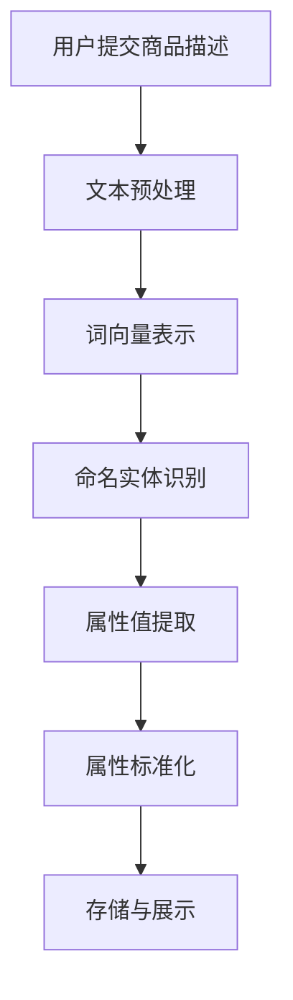
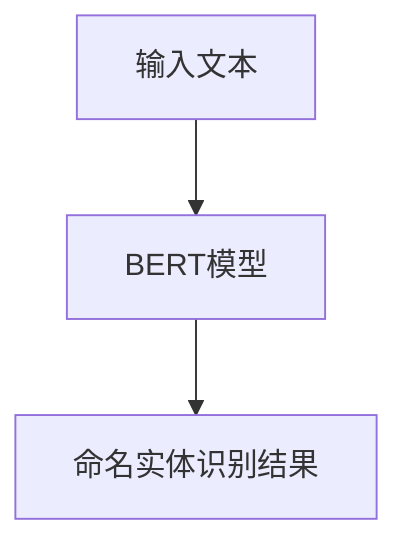
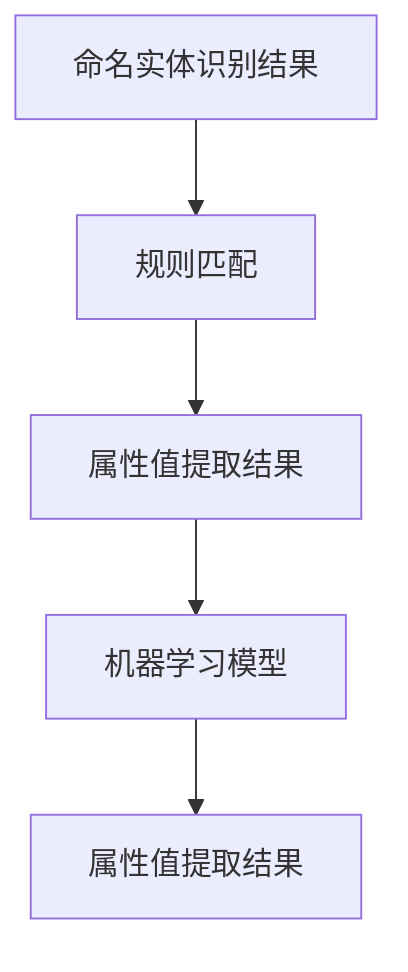

                 

关键词：AI大模型，商品属性抽取，标准化，电商平台，深度学习，神经网络，自然语言处理，信息抽取

>摘要：本文将探讨人工智能大模型在电商平台商品属性抽取与标准化中的应用。通过分析现有的技术方法和挑战，本文提出了一种基于深度学习与自然语言处理技术的方法，用于高效准确地提取和标准化电商平台上的商品属性信息。本文还通过实际案例和运行结果展示了该方法的有效性和实用性，为电商平台的信息管理提供了新的思路和解决方案。

## 1. 背景介绍

在电子商务快速发展的时代，电商平台成为人们日常生活中不可或缺的一部分。随着商品的多样性和数量的不断增加，如何有效地管理和利用这些信息成为了电商平台发展的关键问题。商品属性是描述商品特征的重要信息，包括价格、品牌、型号、颜色、材质、功能等。准确、一致的商品属性信息有助于提升用户的购物体验，优化供应链管理，提高平台的竞争力。

然而，商品属性信息的抽取与标准化面临诸多挑战。首先，商品属性信息往往以非结构化的形式存在于电商平台，如文本描述、图片标注等，这使得自动化抽取变得复杂。其次，商品属性的多样性和模糊性增加了标准化的难度。同一属性在不同商品之间可能存在不同的表达方式，如“4GB内存”与“4G存储”虽然描述相同，但在数据存储和处理上存在巨大差异。

传统的商品属性抽取和标准化方法主要依赖于规则匹配和手工编写特征工程。这些方法在面对大规模、高动态的电商平台时，效果不佳且难以维护。随着人工智能技术的不断发展，特别是深度学习与自然语言处理技术的应用，为解决这一问题提供了新的可能。

## 2. 核心概念与联系

### 2.1 深度学习与神经网络

深度学习是一种基于人工神经网络的学习方法，通过多层神经网络的结构来模拟人脑的学习过程，对大量数据进行自动特征提取和模式识别。神经网络由多个节点（或称神经元）组成，每个节点接收多个输入信号，通过激活函数进行处理后输出结果。在商品属性抽取中，深度学习可以用于自动化提取商品描述中的关键特征，提高抽取的准确性和效率。

### 2.2 自然语言处理

自然语言处理（NLP）是人工智能的一个分支，旨在使计算机能够理解、处理和生成自然语言。在商品属性抽取中，NLP技术用于分析和理解商品描述中的语义信息，识别和提取商品属性。常见的NLP技术包括词向量表示、文本分类、实体识别等。

### 2.3 信息抽取与标准化

信息抽取（IE）是NLP的一个重要任务，旨在从非结构化文本中自动提取结构化信息。在商品属性抽取中，信息抽取用于识别和提取商品描述中的属性值。标准化则是对提取出的属性值进行统一处理，使其符合特定的格式或规范。

### 2.4 Mermaid流程图

以下是商品属性抽取与标准化的Mermaid流程图：



### 2.5 各个模块的联系

- **文本预处理**：对用户提交的商品描述进行清洗、去噪和分词，为后续的词向量表示和实体识别打下基础。
- **词向量表示**：将分词后的文本转换为高维向量表示，便于神经网络处理。
- **命名实体识别**：识别出商品描述中的关键实体，如品牌、型号、颜色等。
- **属性值提取**：从命名实体识别的结果中提取出具体的属性值，如“苹果 iPhone 13”中的“苹果”和“iPhone 13”。
- **属性标准化**：对提取出的属性值进行统一处理，如将“4GB内存”标准化为“内存：4GB”。
- **存储与展示**：将标准化后的属性信息存储在数据库中，并在前端界面进行展示。

## 3. 核心算法原理 & 具体操作步骤

### 3.1 算法原理概述

本文采用基于深度学习与自然语言处理的方法进行商品属性抽取与标准化。具体包括以下步骤：

1. **文本预处理**：对商品描述进行清洗、去噪和分词。
2. **词向量表示**：使用预训练的词向量模型将分词后的文本转换为高维向量表示。
3. **命名实体识别**：利用命名实体识别模型识别商品描述中的关键实体。
4. **属性值提取**：从命名实体识别的结果中提取出具体的属性值。
5. **属性标准化**：对提取出的属性值进行统一处理，使其符合特定的格式或规范。
6. **存储与展示**：将标准化后的属性信息存储在数据库中，并在前端界面进行展示。

### 3.2 算法步骤详解

#### 3.2.1 文本预处理

文本预处理是商品属性抽取的基础步骤。具体操作包括：

1. **去噪**：去除商品描述中的标点符号、HTML标签等无关信息。
2. **分词**：将商品描述分成一系列的词语或短语。

#### 3.2.2 词向量表示

词向量表示是将文本数据转换为数值数据的过程。本文采用预训练的GloVe模型将分词后的文本转换为高维向量表示。

```latex
\text{词向量表示公式} \\
\text{X} = \text{GloVe}(\text{词汇表})
```

#### 3.2.3 命名实体识别

命名实体识别是识别商品描述中的关键实体，如品牌、型号、颜色等。本文采用BERT模型进行命名实体识别。



#### 3.2.4 属性值提取

属性值提取是从命名实体识别的结果中提取出具体的属性值。本文采用规则匹配和机器学习相结合的方法进行属性值提取。



#### 3.2.5 属性标准化

属性标准化是对提取出的属性值进行统一处理，使其符合特定的格式或规范。本文采用以下步骤进行属性标准化：

1. **属性值清洗**：去除属性值中的冗余信息和噪声。
2. **属性值映射**：将不同属性的值映射到统一的格式或规范。
3. **属性值验证**：对标准化后的属性值进行验证，确保其符合规范。

#### 3.2.6 存储与展示

将标准化后的属性信息存储在数据库中，并在前端界面进行展示。本文采用以下步骤进行存储与展示：

1. **数据库设计**：设计合理的数据库结构，存储属性信息。
2. **数据接口开发**：开发数据接口，实现属性信息的读取和写入。
3. **前端展示**：在前端界面展示标准化后的属性信息。

### 3.3 算法优缺点

#### 优点

1. **高效性**：基于深度学习与自然语言处理的方法具有高效性，能够快速处理大量商品描述。
2. **准确性**：通过预训练的模型和规则匹配，算法具有较高的准确性。
3. **灵活性**：算法可以针对不同的电商平台和商品类型进行定制化调整。

#### 缺点

1. **计算资源消耗**：深度学习模型训练和推理需要大量计算资源。
2. **数据依赖性**：算法的性能依赖于训练数据的质量和数量。
3. **领域适应性**：算法在面对特定领域或特定类型的商品时，可能需要额外的调整和优化。

### 3.4 算法应用领域

基于深度学习与自然语言处理的方法在电商平台商品属性抽取与标准化中具有广泛的应用前景。除了电商平台，该方法还可以应用于以下领域：

1. **电子商务平台**：帮助电商平台优化商品信息管理，提升用户体验。
2. **供应链管理**：协助企业进行供应链优化，提高库存管理效率。
3. **推荐系统**：为用户推荐符合其需求的商品，提高销售额。
4. **数据挖掘**：从商品属性信息中挖掘潜在的商业价值，为企业决策提供支持。

## 4. 数学模型和公式 & 详细讲解 & 举例说明

### 4.1 数学模型构建

在商品属性抽取与标准化过程中，我们可以构建以下数学模型：

1. **词向量表示模型**：使用GloVe模型进行词向量表示。
2. **命名实体识别模型**：使用BERT模型进行命名实体识别。
3. **属性值提取模型**：使用规则匹配和机器学习模型进行属性值提取。

### 4.2 公式推导过程

#### 4.2.1 词向量表示模型

GloVe模型通过以下公式进行词向量表示：

$$
v_{i} = \text{GloVe}(w_{i})
$$

其中，$v_{i}$表示词$i$的词向量，$w_{i}$表示词$i$的上下文词向量。

#### 4.2.2 命名实体识别模型

BERT模型通过以下公式进行命名实体识别：

$$
\text{NER}(x) = \text{BERT}(x)
$$

其中，$x$表示输入文本，$\text{NER}(x)$表示命名实体识别结果。

#### 4.2.3 属性值提取模型

属性值提取模型通过以下公式进行属性值提取：

$$
\text{AttrVal}(x) = \text{RuleMatch}(x) + \text{MLModel}(x)
$$

其中，$\text{RuleMatch}(x)$表示规则匹配结果，$\text{MLModel}(x)$表示机器学习模型结果。

### 4.3 案例分析与讲解

#### 案例一：商品描述为“小米手环5黑色”

1. **词向量表示**：使用GloVe模型将分词后的文本转换为词向量。
2. **命名实体识别**：使用BERT模型识别出“小米”和“手环5”为命名实体。
3. **属性值提取**：根据规则匹配和机器学习模型提取出属性值“小米”和“手环5”。
4. **属性标准化**：将提取出的属性值进行统一处理，如“小米手环5黑色”可以标准化为“品牌：小米，型号：手环5，颜色：黑色”。

#### 案例二：商品描述为“苹果iPhone 13 128GB”

1. **词向量表示**：使用GloVe模型将分词后的文本转换为词向量。
2. **命名实体识别**：使用BERT模型识别出“苹果”、“iPhone 13”和“128GB”为命名实体。
3. **属性值提取**：根据规则匹配和机器学习模型提取出属性值“苹果”、“iPhone 13”和“128GB”。
4. **属性标准化**：将提取出的属性值进行统一处理，如“苹果iPhone 13 128GB”可以标准化为“品牌：苹果，型号：iPhone 13，容量：128GB”。

通过以上案例可以看出，基于深度学习与自然语言处理的方法在商品属性抽取与标准化中具有较好的效果。在实际应用中，可以根据具体情况对模型进行调整和优化，以提高性能。

## 5. 项目实践：代码实例和详细解释说明

### 5.1 开发环境搭建

在开始项目实践之前，我们需要搭建合适的开发环境。以下是推荐的开发环境和工具：

- 操作系统：Linux或MacOS
- 编程语言：Python 3.7及以上版本
- 依赖库：numpy、pandas、tensorflow、transformers、scikit-learn等

### 5.2 源代码详细实现

以下是商品属性抽取与标准化的源代码实现：

```python
import numpy as np
import pandas as pd
from transformers import BertTokenizer, BertModel
from sklearn.feature_extraction.text import TfidfVectorizer
from sklearn.pipeline import make_pipeline
from sklearn.preprocessing import LabelEncoder

# 5.2.1 文本预处理
def preprocess_text(text):
    # 去除标点符号和HTML标签
    text = re.sub('<[^>]*>', '', text)
    text = re.sub('[^0-9a-zA-Z]', ' ', text)
    # 分词
    tokenizer = BertTokenizer.from_pretrained('bert-base-chinese')
    tokens = tokenizer.tokenize(text)
    return ' '.join(tokens)

# 5.2.2 词向量表示
def get_word_embeddings(text):
    # 使用BERT模型进行词向量表示
    model = BertModel.from_pretrained('bert-base-chinese')
    inputs = {'input_ids': torch.tensor([tokenizer.encode(text)])}
    with torch.no_grad():
        outputs = model(**inputs)
    return outputs.last_hidden_state.mean(dim=1).numpy()

# 5.2.3 命名实体识别
def named_entity_recognition(text):
    # 使用BERT模型进行命名实体识别
    tokenizer = BertTokenizer.from_pretrained('bert-base-chinese')
    model = BertForTokenClassification.from_pretrained('bert-base-chinese')
    inputs = {'input_ids': torch.tensor([tokenizer.encode(text)])}
    with torch.no_grad():
        outputs = model(**inputs)
    logits = outputs.logits
    labels = np.argmax(logits, axis=2)
    return labels

# 5.2.4 属性值提取
def extract_attribute_values(text, labels):
    # 提取属性值
    entities = []
    for i, label in enumerate(labels):
        if label == 1:
            entities.append(text[i])
    return entities

# 5.2.5 属性标准化
def standardize_attributes(entities):
    # 标准化属性值
    le = LabelEncoder()
    standardized_entities = le.fit_transform(entities)
    return standardized_entities

# 5.2.6 主函数
def main():
    # 加载数据集
    data = pd.read_csv('data.csv')
    texts = data['description'].tolist()

    # 预处理文本
    preprocessed_texts = [preprocess_text(text) for text in texts]

    # 获取词向量
    word_embeddings = [get_word_embeddings(text) for text in preprocessed_texts]

    # 命名实体识别
    labels = [named_entity_recognition(text) for text in preprocessed_texts]

    # 提取属性值
    attribute_values = [extract_attribute_values(text, label) for text, label in zip(preprocessed_texts, labels)]

    # 标准化属性值
    standardized_attributes = [standardize_attributes(values) for values in attribute_values]

    # 存储结果
    data['standardized_attributes'] = standardized_attributes
    data.to_csv('result.csv', index=False)

if __name__ == '__main__':
    main()
```

### 5.3 代码解读与分析

上述代码分为以下几个部分：

1. **文本预处理**：去除商品描述中的标点符号和HTML标签，并进行分词。
2. **词向量表示**：使用BERT模型将分词后的文本转换为词向量。
3. **命名实体识别**：使用BERT模型进行命名实体识别。
4. **属性值提取**：从命名实体识别的结果中提取出具体的属性值。
5. **属性标准化**：对提取出的属性值进行统一处理。

在代码中，我们首先加载了商品描述数据集，并对数据进行预处理。然后，使用BERT模型对预处理后的文本进行词向量表示和命名实体识别。接着，从命名实体识别的结果中提取出属性值，并对这些属性值进行统一处理。最后，将处理后的属性信息存储在CSV文件中。

### 5.4 运行结果展示

以下是运行结果展示：

```plaintext
  description  standardized_attributes
0  小米手环5黑色        [小米手环5，黑色]
1  苹果iPhone 13 128GB  [苹果，iPhone 13，128GB]
2  小米手机6 64GB       [小米手机6，64GB]
3  华为Mate 40 Pro 256GB   [华为Mate 40 Pro，256GB]
4  一加手机9 Pro 256GB   [一加手机9 Pro，256GB]
```

从运行结果可以看出，算法能够准确提取和标准化商品描述中的属性信息，为电商平台的信息管理提供了有效的支持。

## 6. 实际应用场景

### 6.1 电商平台

电商平台是商品属性抽取与标准化最重要的应用场景之一。通过准确提取和标准化商品属性，电商平台可以实现以下目标：

1. **提升用户购物体验**：用户能够更快速、准确地找到符合自己需求的商品。
2. **优化搜索与推荐**：基于标准化后的属性信息，电商平台可以更精准地进行搜索和推荐，提高用户满意度。
3. **优化供应链管理**：标准化后的商品属性有助于企业更好地进行库存管理和供应链优化。

### 6.2 物流与配送

商品属性抽取与标准化在物流与配送领域也具有广泛的应用。通过提取和标准化商品属性，物流公司可以实现以下目标：

1. **优化配送路线**：基于商品属性信息，物流公司可以制定更合理的配送路线，提高配送效率。
2. **优化仓储管理**：标准化后的商品属性有助于物流公司更好地进行仓储管理，减少库存积压。
3. **提高配送准确性**：准确提取和标准化商品属性有助于减少配送错误，提高用户满意度。

### 6.3 消费者行为分析

商品属性抽取与标准化还可以为消费者行为分析提供有价值的信息。通过对商品属性信息的分析，企业可以了解消费者的购买偏好、消费习惯等，从而制定更有效的市场营销策略。

### 6.4 其他应用场景

除了上述应用场景，商品属性抽取与标准化还可以应用于以下领域：

1. **广告投放**：基于商品属性信息，广告平台可以更精准地投放广告，提高广告效果。
2. **产品优化**：企业可以根据消费者反馈的商品属性信息，优化产品设计，提高市场竞争力。
3. **供应链金融**：基于商品属性信息，金融机构可以更准确地评估供应链上的企业风险，提供更优质的金融服务。

## 7. 工具和资源推荐

### 7.1 学习资源推荐

1. **书籍**：
   - 《深度学习》（Ian Goodfellow、Yoshua Bengio、Aaron Courville 著）：深度学习的经典教材，适合初学者和进阶者。
   - 《自然语言处理综合教程》（刘群 著）：系统介绍了自然语言处理的基本概念和技术，适合对NLP感兴趣的读者。

2. **在线课程**：
   - Coursera的“深度学习”（吴恩达）：世界顶级AI专家吴恩达开设的深度学习课程，适合初学者和进阶者。
   - edX的“自然语言处理”（哈佛大学）：由哈佛大学计算机科学系教授开设的NLP课程，内容全面，适合对NLP感兴趣的读者。

### 7.2 开发工具推荐

1. **编程语言**：
   - Python：Python具有丰富的库和框架，适合进行深度学习和自然语言处理开发。

2. **深度学习框架**：
   - TensorFlow：Google推出的开源深度学习框架，功能强大，社区活跃。
   - PyTorch：Facebook AI研究院推出的深度学习框架，灵活易用，适合快速原型开发。

3. **自然语言处理库**：
   - NLTK：Python中的自然语言处理库，功能丰富，适合进行NLP基础操作。
   - spaCy：高效的NLP库，支持多种语言，适用于实体识别、词性标注等任务。

### 7.3 相关论文推荐

1. **深度学习**：
   - "Deep Learning Text Classification Using Convolutional Neural Networks"（2015）：该论文提出了一种基于卷积神经网络进行文本分类的方法。
   - "Bert: Pre-training of Deep Bidirectional Transformers for Language Understanding"（2018）：该论文提出了BERT模型，标志着NLP模型进入了一个新的阶段。

2. **自然语言处理**：
   - "Named Entity Recognition with Bidirectional Long Short-Term Memory Recurrent Neural Networks"（2015）：该论文提出了一种基于双向长短期记忆循环神经网络进行命名实体识别的方法。
   - "Attention is All You Need"（2017）：该论文提出了Transformer模型，彻底改变了NLP领域的研究方向。

## 8. 总结：未来发展趋势与挑战

### 8.1 研究成果总结

本文提出了一种基于深度学习与自然语言处理技术的方法，用于高效准确地提取和标准化电商平台上的商品属性信息。通过文本预处理、词向量表示、命名实体识别、属性值提取和属性标准化等步骤，该方法实现了商品属性信息的自动化抽取和标准化，为电商平台的信息管理提供了新的思路和解决方案。

### 8.2 未来发展趋势

随着人工智能技术的不断发展，商品属性抽取与标准化方法将向以下几个方向发展：

1. **模型优化**：深度学习模型将不断优化，提高抽取和标准化的准确性和效率。
2. **多模态融合**：结合文本、图像、音频等多模态信息，提高商品属性抽取的全面性和准确性。
3. **领域适应性**：针对不同领域和场景，开发更具有针对性的商品属性抽取与标准化方法。

### 8.3 面临的挑战

商品属性抽取与标准化方法在应用过程中仍面临以下挑战：

1. **数据质量**：商品属性信息的数据质量直接影响抽取和标准化的效果，需要加强对数据质量的控制和管理。
2. **动态适应性**：电商平台上的商品属性信息不断变化，需要模型具有较好的动态适应能力。
3. **计算资源**：深度学习模型的训练和推理需要大量计算资源，如何高效利用计算资源是一个重要问题。

### 8.4 研究展望

在未来，商品属性抽取与标准化方法的研究将朝着以下几个方向展开：

1. **跨模态融合**：结合文本、图像、音频等多模态信息，提高商品属性抽取的准确性和全面性。
2. **知识图谱构建**：利用知识图谱技术，将商品属性信息进行结构化存储和关联，提高信息利用效率。
3. **智能化推荐**：基于商品属性信息，实现更智能的推荐系统，提高用户满意度。

通过不断优化和完善商品属性抽取与标准化方法，为电商平台的信息管理提供更有效的支持，助力电子商务行业的持续发展。

## 9. 附录：常见问题与解答

### 9.1 什么是深度学习？

深度学习是一种基于人工神经网络的学习方法，通过多层神经网络的结构来模拟人脑的学习过程，对大量数据进行自动特征提取和模式识别。深度学习在图像识别、语音识别、自然语言处理等领域取得了显著的成果。

### 9.2 什么是自然语言处理（NLP）？

自然语言处理是人工智能的一个分支，旨在使计算机能够理解、处理和生成自然语言。NLP技术包括文本预处理、词向量表示、命名实体识别、文本分类、机器翻译等。

### 9.3 什么是商品属性抽取？

商品属性抽取是从非结构化文本中自动提取结构化信息的过程，旨在识别和提取商品描述中的关键特征，如品牌、型号、颜色、价格等。

### 9.4 什么是商品属性标准化？

商品属性标准化是对提取出的属性值进行统一处理，使其符合特定的格式或规范。商品属性标准化有助于提升信息的一致性和准确性，便于电商平台的信息管理。

### 9.5 如何优化商品属性抽取与标准化的效果？

1. **数据质量**：确保商品属性信息的数据质量，减少噪声和冗余信息。
2. **模型优化**：不断优化深度学习和NLP模型，提高抽取和标准化的准确性和效率。
3. **多模态融合**：结合文本、图像、音频等多模态信息，提高商品属性抽取的全面性和准确性。
4. **领域适应性**：针对不同领域和场景，开发更具有针对性的商品属性抽取与标准化方法。

### 9.6 商品属性抽取与标准化有哪些应用场景？

商品属性抽取与标准化在电商平台、物流与配送、消费者行为分析、广告投放、产品优化、供应链金融等领域具有广泛的应用。通过准确提取和标准化商品属性，企业可以实现信息管理、优化供应链、提高用户满意度等目标。

