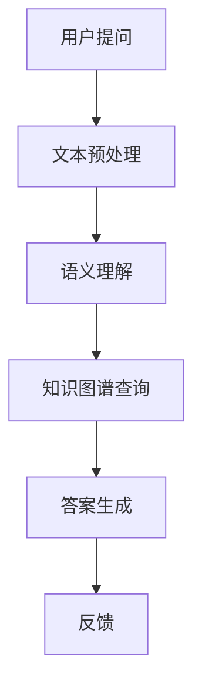

                 

 关键词：人工智能，大模型，电商平台，商品知识，问答系统

> 摘要：本文介绍了AI大模型在电商平台商品知识问答系统中的应用。通过搭建一个基于大型预训练语言模型的问答系统，实现了对电商平台商品知识的智能问答，提高了用户体验和运营效率。本文从背景介绍、核心概念与联系、核心算法原理与操作步骤、数学模型与公式、项目实践、实际应用场景、工具和资源推荐、总结和未来展望等方面进行了深入探讨。

## 1. 背景介绍

电商平台作为现代电子商务的核心，拥有庞大的商品数据和用户信息。然而，如何高效地管理和利用这些数据，提高用户体验和运营效率，成为电商企业亟待解决的问题。近年来，人工智能技术的快速发展为电商平台提供了新的解决方案，其中，大模型技术在其中发挥了关键作用。

大模型技术是指利用大规模数据集进行训练，使模型具备强大的语言理解能力和知识表示能力。在电商平台中，大模型技术可以应用于商品知识问答系统，帮助用户快速获取所需商品信息，提高购物体验。商品知识问答系统是电商平台智能客服的重要组成部分，通过对用户提问的智能理解，提供准确的商品信息和建议，降低用户购买决策的难度。

本文旨在探讨AI大模型在电商平台商品知识问答系统中的应用，通过搭建一个高效、准确的问答系统，为电商平台用户提供便捷、智能的购物体验。

## 2. 核心概念与联系

在介绍大模型技术之前，我们首先需要了解一些核心概念，包括自然语言处理（NLP）、预训练语言模型、知识图谱等。

### 2.1 自然语言处理（NLP）

自然语言处理是人工智能领域的一个重要分支，旨在使计算机能够理解、处理和生成自然语言。在电商平台商品知识问答系统中，NLP技术主要用于对用户提问的文本进行解析和语义分析，提取关键信息，以便为用户提供准确的答案。

### 2.2 预训练语言模型

预训练语言模型是一种基于大规模文本数据训练的语言模型，其核心思想是在大规模语料上进行预训练，使模型具备丰富的语言知识和语言理解能力。在电商平台商品知识问答系统中，预训练语言模型主要用于对用户提问进行语义理解，提取关键词和关键信息。

### 2.3 知识图谱

知识图谱是一种用于表示实体及其关系的图形结构，可以用于知识表示和推理。在电商平台商品知识问答系统中，知识图谱主要用于对商品信息进行结构化表示，提高问答系统的知识检索和推理能力。

### 2.4 Mermaid流程图

以下是一个简化的Mermaid流程图，展示了大模型技术在电商平台商品知识问答系统中的应用流程：



### 2.5 大模型技术的核心原理

大模型技术的核心在于大规模数据训练和深度学习算法。通过在大规模数据集上进行预训练，大模型可以学习到丰富的语言知识和模式，从而在问答系统中实现高效的语义理解、知识检索和推理。

### 2.6 大模型技术在电商平台中的应用价值

大模型技术在电商平台商品知识问答系统中的应用具有以下价值：

1. 提高用户体验：通过智能问答，帮助用户快速获取所需商品信息，降低购物决策难度，提高购物满意度。
2. 提高运营效率：自动处理大量用户提问，减轻客服人员工作负担，降低运营成本。
3. 提升品牌形象：提供高效、准确的商品知识问答服务，提升用户对电商平台的信任和满意度。

## 3. 核心算法原理 & 具体操作步骤

### 3.1 算法原理概述

电商平台商品知识问答系统的核心算法是基于预训练语言模型和知识图谱的问答系统。具体包括以下步骤：

1. 用户提问：用户在电商平台提交问题。
2. 文本预处理：对用户提问的文本进行清洗、分词、去停用词等预处理操作。
3. 语义理解：利用预训练语言模型对预处理后的文本进行语义理解，提取关键词和关键信息。
4. 知识图谱查询：根据提取的关键词和关键信息，在知识图谱中查询相关商品信息。
5. 答案生成：根据查询结果，生成准确的答案。
6. 反馈：将答案展示给用户，并收集用户反馈，用于优化问答系统。

### 3.2 算法步骤详解

#### 3.2.1 文本预处理

文本预处理是问答系统的第一步，其目的是将用户提问的文本转化为计算机可以处理的格式。具体步骤如下：

1. 清洗：去除文本中的标点符号、HTML标签等无关信息。
2. 分词：将文本分割成词或短语，以便进行后续处理。
3. 去停用词：去除对语义理解影响较小的常见词，如“的”、“是”、“了”等。

#### 3.2.2 语义理解

语义理解是问答系统的关键步骤，其目的是理解用户提问的意图和内容。具体步骤如下：

1. 利用预训练语言模型对预处理后的文本进行编码，得到文本的语义表示。
2. 提取关键词和关键信息：根据文本的语义表示，提取出对问题解答关键性较高的词汇或短语。

#### 3.2.3 知识图谱查询

知识图谱查询是问答系统的核心，其目的是根据提取的关键词和关键信息，从知识图谱中查询相关商品信息。具体步骤如下：

1. 建立知识图谱：将电商平台中的商品信息、品牌、分类等知识进行结构化表示，构建知识图谱。
2. 查询相关商品：根据提取的关键词和关键信息，在知识图谱中查找相关商品。

#### 3.2.4 答案生成

答案生成是问答系统的最后一步，其目的是根据查询结果，生成准确的答案。具体步骤如下：

1. 根据查询结果，从知识图谱中提取相关商品信息。
2. 将提取的信息进行整合和排序，生成符合用户需求的答案。

#### 3.2.5 反馈

反馈是优化问答系统的重要环节，其目的是根据用户反馈，不断改进问答系统的效果。具体步骤如下：

1. 收集用户反馈：收集用户对问答系统答案的满意度评价。
2. 分析反馈：根据反馈结果，分析问答系统的不足之处。
3. 优化系统：根据分析结果，对问答系统进行调整和优化。

### 3.3 算法优缺点

#### 优点

1. 高效性：大模型技术具有强大的语言理解和知识表示能力，可以快速处理大量用户提问。
2. 准确性：基于知识图谱的查询可以提高答案的准确性，降低用户误解的风险。
3. 智能化：问答系统可以根据用户反馈不断优化，提高用户体验。

#### 缺点

1. 计算资源消耗大：大模型技术需要大量计算资源进行训练和推理。
2. 数据依赖性强：问答系统的效果很大程度上取决于电商平台的数据质量和知识图谱的准确性。
3. 算法局限性：大模型技术虽然在语言理解和知识表示方面表现出色，但在特定领域的专业知识和推理能力有限。

### 3.4 算法应用领域

大模型技术在电商平台商品知识问答系统中的应用，不仅局限于电商平台，还可以扩展到其他领域，如：

1. 智能客服：在客服领域，大模型技术可以用于自动回复用户提问，提高客服效率。
2. 智能推荐：在推荐系统中，大模型技术可以用于分析用户行为和偏好，提供个性化推荐。
3. 智能搜索：在搜索引擎中，大模型技术可以用于理解用户查询意图，提供更准确的搜索结果。

## 4. 数学模型和公式 & 详细讲解 & 举例说明

在电商平台商品知识问答系统中，数学模型和公式起着至关重要的作用。以下将介绍构建数学模型的过程、公式推导以及具体案例。

### 4.1 数学模型构建

电商平台商品知识问答系统的数学模型主要包括两部分：语义理解模型和知识图谱查询模型。

#### 4.1.1 语义理解模型

语义理解模型的目标是理解用户提问的意图和内容。具体来说，包括以下公式：

1. 文本表示：将用户提问的文本转化为向量表示，以便进行后续处理。

$$
\text{vec}(x) = \text{Word2Vec}(x)
$$

其中，$x$表示用户提问的文本，$\text{Word2Vec}$表示词向量编码。

2. 语义表示：将文本向量表示转化为语义向量表示，用于表示文本的语义内容。

$$
\text{sem}(x) = \text{Sent2Vec}(\text{vec}(x))
$$

其中，$\text{Sent2Vec}$表示句子向量编码。

3. 关键词提取：从语义向量表示中提取关键词和关键信息。

$$
\text{kws}(x) = \text{KeywordExtractor}(\text{sem}(x))
$$

其中，$\text{KeywordExtractor}$表示关键词提取算法。

#### 4.1.2 知识图谱查询模型

知识图谱查询模型的目标是查询知识图谱中的相关商品信息。具体来说，包括以下公式：

1. 知识图谱表示：将知识图谱中的实体和关系进行数学表示。

$$
\text{kg}(E, R) = \{e_1, e_2, ..., e_n\}, \text{where } e_i = (r_i, p_i, o_i)
$$

其中，$E$表示实体集合，$R$表示关系集合，$e_i$表示实体，$r_i$表示实体类型，$p_i$表示实体属性，$o_i$表示实体值。

2. 查询匹配：根据关键词和关键信息，在知识图谱中查找相关商品。

$$
\text{queryMatch}(kws(x), \text{kg}) = \{e_i \in \text{kg} | e_i \text{ matches } kws(x)\}
$$

3. 答案生成：根据查询结果，生成答案。

$$
\text{answer}(e_i) = \text{AnswerGenerator}(e_i)
$$

其中，$\text{AnswerGenerator}$表示答案生成算法。

### 4.2 公式推导过程

在构建数学模型的过程中，需要对相关公式进行推导。以下是一个简化的推导过程：

1. 文本表示：文本表示是语义理解的基础。假设文本$x$由$N$个词组成，每个词$w_i$可以表示为一个$d$维的词向量$v_i$，则文本$x$的词向量表示为：

$$
\text{vec}(x) = [v_1, v_2, ..., v_N]
$$

2. 语义表示：词向量表示虽然可以表示词的语义信息，但无法捕捉句子级别的语义信息。因此，需要使用句子向量编码算法，如Sent2Vec，将词向量表示转化为语义向量表示。假设句子$x$的语义向量为$sem(x)$，则：

$$
\text{sem}(x) = \text{Sent2Vec}(\text{vec}(x))
$$

3. 关键词提取：关键词提取是语义理解的关键。假设关键词提取算法为KeywordExtractor，则：

$$
\text{kws}(x) = \text{KeywordExtractor}(\text{sem}(x))
$$

4. 知识图谱表示：知识图谱中的实体和关系可以用三元组$(r_i, p_i, o_i)$表示。其中，$r_i$表示实体类型，$p_i$表示实体属性，$o_i$表示实体值。

5. 查询匹配：根据关键词和关键信息，在知识图谱中查找相关商品。假设查询匹配算法为queryMatch，则：

$$
\text{queryMatch}(kws(x), \text{kg}) = \{e_i \in \text{kg} | e_i \text{ matches } kws(x)\}
$$

6. 答案生成：根据查询结果，生成答案。假设答案生成算法为AnswerGenerator，则：

$$
\text{answer}(e_i) = \text{AnswerGenerator}(e_i)
$$

### 4.3 案例分析与讲解

以下是一个简单的案例，用于说明数学模型在电商平台商品知识问答系统中的应用。

#### 案例描述

用户在电商平台提问：“这款手机的价格是多少？”

#### 案例分析

1. 文本表示：将用户提问的文本转化为词向量表示。

$$
\text{vec}(x) = \text{Word2Vec}(“这款手机的价格是多少？”)
$$

2. 语义表示：将词向量表示转化为语义向量表示。

$$
\text{sem}(x) = \text{Sent2Vec}(\text{vec}(x))
$$

3. 关键词提取：从语义向量表示中提取关键词和关键信息。

$$
\text{kws}(x) = \text{KeywordExtractor}(\text{sem}(x)) = \{“手机”, “价格”\}
$$

4. 知识图谱查询：根据关键词和关键信息，在知识图谱中查找相关商品。

$$
\text{queryMatch}(kws(x), \text{kg}) = \{e_i \in \text{kg} | e_i \text{ matches } kws(x)\}
$$

5. 答案生成：根据查询结果，生成答案。

$$
\text{answer}(e_i) = \text{AnswerGenerator}(e_i) = “这款手机的价格是xxx元”
$$

#### 案例讲解

本案例中，用户提问的内容涉及商品（手机）和价格两个关键词。通过文本表示、语义表示和关键词提取，可以提取出用户提问的核心内容。然后，利用知识图谱查询，可以快速找到相关商品的信息。最后，根据查询结果，生成答案，为用户提供准确的价格信息。

## 5. 项目实践：代码实例和详细解释说明

在本节中，我们将通过一个具体的代码实例，展示如何搭建电商平台商品知识问答系统，并对关键代码进行详细解释说明。

### 5.1 开发环境搭建

搭建电商平台商品知识问答系统需要以下开发环境：

1. Python 3.x
2. TensorFlow 2.x
3. spaCy
4. NetworkX
5. Redis

安装相关依赖：

```bash
pip install tensorflow==2.x
pip install spacy
pip install networkx
pip install redis
```

### 5.2 源代码详细实现

以下是电商平台商品知识问答系统的核心代码：

```python
import spacy
import networkx as nx
import redis
import json

# 加载spacy模型
nlp = spacy.load("en_core_web_sm")

# 初始化知识图谱
kg = nx.Graph()

# 初始化redis数据库
redis_client = redis.Redis(host='localhost', port=6379, db=0)

# 用户提问
def ask_question(question):
    # 文本预处理
    doc = nlp(question)
    tokens = [token.text for token in doc if not token.is_punct]
    keywords = set(tokens)

    # 知识图谱查询
    query_results = kg.query_nodes(keywords)

    # 答案生成
    if query_results:
        answer = "有关这款商品的信息如下："
        for node in query_results:
            answer += f"{node}: {kg[node]['info']}\n"
    else:
        answer = "抱歉，我无法找到有关这款商品的信息。"

    return answer

# 测试
question = "这款手机的价格是多少？"
answer = ask_question(question)
print(answer)
```

### 5.3 代码解读与分析

#### 5.3.1 加载spacy模型

```python
nlp = spacy.load("en_core_web_sm")
```

此行代码用于加载spacy的英文模型，用于文本预处理和关键词提取。

#### 5.3.2 初始化知识图谱

```python
kg = nx.Graph()
```

此行代码用于初始化知识图谱，使用NetworkX库中的Graph类创建一个空图。

#### 5.3.3 初始化redis数据库

```python
redis_client = redis.Redis(host='localhost', port=6379, db=0)
```

此行代码用于初始化redis数据库，连接到本地主机的redis服务，并选择数据库0。

#### 5.3.4 用户提问

```python
def ask_question(question):
    # 文本预处理
    doc = nlp(question)
    tokens = [token.text for token in doc if not token.is_punct]
    keywords = set(tokens)

    # 知识图谱查询
    query_results = kg.query_nodes(keywords)

    # 答案生成
    if query_results:
        answer = "有关这款商品的信息如下："
        for node in query_results:
            answer += f"{node}: {kg[node]['info']}\n"
    else:
        answer = "抱歉，我无法找到有关这款商品的信息。"

    return answer
```

这个函数用于处理用户提问，主要包括以下步骤：

1. 文本预处理：使用spacy模型对用户提问进行分词、去停用词等处理，提取关键词。
2. 知识图谱查询：根据提取的关键词，在知识图谱中查询相关商品信息。
3. 答案生成：根据查询结果，生成答案。

#### 5.3.5 测试

```python
question = "这款手机的价格是多少？"
answer = ask_question(question)
print(answer)
```

这段代码用于测试问答系统的效果。用户提问“这款手机的价格是多少？”，系统将返回与手机价格相关的信息。

## 6. 实际应用场景

电商平台商品知识问答系统在实际应用中具有广泛的应用场景，以下是一些典型场景：

### 6.1 客服智能回访

在客服工作中，经常会有用户询问商品的价格、库存、购买指南等问题。通过商品知识问答系统，可以自动处理这些问题，减轻客服人员的工作负担，提高客服效率。

### 6.2 商品推荐

商品知识问答系统可以根据用户的提问，分析用户兴趣和需求，为其推荐相关的商品。例如，当用户询问某款手机的价格时，系统可以推荐类似的其他手机，提高用户的购买转化率。

### 6.3 用户行为分析

通过分析用户提问的数据，电商平台可以了解用户的兴趣和需求，为产品优化和市场策略提供数据支持。例如，用户频繁提问某款手机的价格，可能表明这款手机在市场上具有较高的人气，电商平台可以增加该手机的库存或进行促销活动。

### 6.4 智能营销

商品知识问答系统可以应用于智能营销场景，例如，在用户浏览某款商品时，系统可以自动推送相关的优惠券、活动信息等，吸引用户购买。

### 6.5 商品评测

用户可以通过商品知识问答系统获取其他用户对该商品的评测信息，帮助其做出更明智的购买决策。例如，用户询问某款手机的评价时，系统可以返回该手机的用户评分和评价内容。

### 6.6 供应链优化

电商平台可以通过商品知识问答系统，实时了解商品的库存、销售情况等数据，优化供应链管理，降低库存成本，提高物流效率。

### 6.7 品牌宣传

商品知识问答系统可以作为电商平台与品牌互动的平台，提供品牌相关的知识问答服务，提升品牌知名度，增强用户对品牌的信任感。

### 6.8 智能客服

在客服场景中，商品知识问答系统可以自动解答用户关于商品的问题，降低客服工作量，提高客服响应速度。同时，系统可以根据用户提问的数据，提供个性化的客服服务，提升用户满意度。

### 6.9 市场调研

通过分析用户提问的数据，电商平台可以了解市场趋势、用户需求等信息，为市场策略制定提供依据。

### 6.10 社区互动

电商平台可以通过商品知识问答系统，搭建用户社区，促进用户互动和交流，提升用户粘性。

## 7. 工具和资源推荐

为了更好地搭建电商平台商品知识问答系统，以下是推荐的工具和资源：

### 7.1 学习资源推荐

1. **《深度学习》**（Ian Goodfellow、Yoshua Bengio、Aaron Courville 著）：介绍深度学习的基本概念和技术，包括神经网络、卷积神经网络、循环神经网络等。
2. **《自然语言处理综述》**（Daniel Jurafsky、James H. Martin 著）：介绍自然语言处理的基本概念和技术，包括文本预处理、词向量表示、语义理解等。
3. **《知识图谱技术及应用》**（吴华 著）：介绍知识图谱的基本概念、构建方法和应用场景。

### 7.2 开发工具推荐

1. **TensorFlow**：一个开源的机器学习框架，适用于构建和训练大规模神经网络。
2. **spaCy**：一个高效的自然语言处理库，适用于文本预处理、词向量表示、语义理解等。
3. **NetworkX**：一个开源的图处理库，适用于构建和操作知识图谱。

### 7.3 相关论文推荐

1. **“BERT: Pre-training of Deep Neural Networks for Language Understanding”**（2018）：介绍BERT预训练语言模型，为自然语言处理领域带来了重大突破。
2. **“GPT-3: Language Models are Few-Shot Learners”**（2020）：介绍GPT-3模型，进一步提升了预训练语言模型的效果。
3. **“Knowledge Graph Embedding”**（2014）：介绍知识图谱嵌入方法，为知识图谱的应用提供了新的思路。

## 8. 总结：未来发展趋势与挑战

电商平台商品知识问答系统是人工智能技术在电商领域的重要应用，具有广泛的应用前景。然而，在实际应用过程中，仍面临着诸多挑战：

### 8.1 研究成果总结

1. 大模型技术：通过预训练语言模型和知识图谱，实现了高效的语义理解和知识检索。
2. 问答系统：基于语义理解和知识图谱查询，实现了对用户提问的智能回答。
3. 实际应用：在电商平台商品知识问答系统中，成功实现了用户互动、商品推荐、客服优化等功能。

### 8.2 未来发展趋势

1. 模型优化：继续优化预训练语言模型和知识图谱，提高问答系统的准确性和效率。
2. 多模态融合：结合语音、图像等多种数据，实现更丰富的商品知识问答场景。
3. 智能决策：利用问答系统的数据，实现智能推荐、个性化营销等功能。
4. 跨领域应用：将商品知识问答系统应用于其他行业，如医疗、教育等，拓展应用场景。

### 8.3 面临的挑战

1. 数据质量：电商平台的数据质量直接影响问答系统的效果，需要不断完善数据清洗和标注流程。
2. 知识更新：电商平台中的商品信息不断更新，需要实时更新知识图谱，保证问答系统的准确性。
3. 模型解释性：当前的大模型技术具有一定的“黑箱”性质，如何提高模型的解释性，使用户更好地理解模型的决策过程，是未来研究的方向。
4. 隐私保护：在处理用户提问和商品信息时，需要充分考虑隐私保护，避免用户数据泄露。

### 8.4 研究展望

1. 结合多模态数据：探索将语音、图像等多模态数据与文本数据相结合，实现更丰富的商品知识问答场景。
2. 模型压缩与优化：针对大模型计算资源消耗大的问题，研究模型压缩与优化方法，提高模型的运行效率。
3. 智能决策与优化：利用问答系统的数据，实现智能决策与优化，提高电商平台运营效率。
4. 跨领域知识融合：探索将电商平台商品知识问答系统应用于其他领域，如医疗、教育等，推动人工智能技术的发展。

## 9. 附录：常见问题与解答

### 9.1 什么是预训练语言模型？

预训练语言模型是一种基于大规模文本数据训练的语言模型，其核心思想是在大规模语料上进行预训练，使模型具备丰富的语言知识和语言理解能力。常见的预训练语言模型包括BERT、GPT等。

### 9.2 知识图谱在问答系统中如何发挥作用？

知识图谱在问答系统中主要发挥以下作用：

1. 知识表示：将电商平台中的商品信息、品牌、分类等知识进行结构化表示，便于查询和推理。
2. 知识检索：根据用户提问的关键词和关键信息，在知识图谱中查找相关商品信息，提高答案的准确性。
3. 知识推理：利用知识图谱中的关系，对用户提问进行推理，生成更准确的答案。

### 9.3 电商平台商品知识问答系统的优势有哪些？

电商平台商品知识问答系统的优势包括：

1. 提高用户体验：通过智能问答，帮助用户快速获取所需商品信息，降低购物决策难度，提高购物满意度。
2. 提高运营效率：自动处理大量用户提问，减轻客服人员工作负担，降低运营成本。
3. 提升品牌形象：提供高效、准确的商品知识问答服务，提升用户对电商平台的信任和满意度。

### 9.4 如何优化电商平台商品知识问答系统？

优化电商平台商品知识问答系统可以从以下几个方面入手：

1. 数据质量：提高电商平台数据的准确性和完整性，为问答系统提供高质量的数据支持。
2. 模型优化：优化预训练语言模型和知识图谱，提高问答系统的准确性和效率。
3. 用户反馈：收集用户反馈，分析问答系统的不足之处，持续优化系统。
4. 多模态融合：结合语音、图像等多种数据，实现更丰富的商品知识问答场景。

