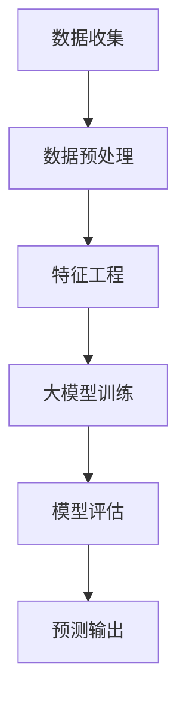

                 

关键词：人工智能，大模型，季节性需求预测，电商平台，深度学习

摘要：本文将探讨如何使用AI大模型对电商平台上的季节性需求进行预测。首先介绍背景和核心概念，然后深入分析大模型的工作原理和具体操作步骤，最后通过实例和代码展示如何实现这一应用。文章还将讨论大模型在实际场景中的表现和未来展望。

## 1. 背景介绍

电商平台的需求预测对于库存管理、促销策略和供应链优化至关重要。然而，传统的预测方法通常依赖于历史数据和简单的统计模型，往往难以应对复杂的市场变化和季节性波动。随着人工智能技术的发展，特别是深度学习和大型神经网络模型的兴起，大模型在预测任务中展现了强大的能力。本文将聚焦于如何利用AI大模型对电商平台上的季节性需求进行准确预测。

### 电商平台需求预测的重要性

电商平台的需求预测有助于商家更好地掌握市场需求，从而优化库存管理和供应链。正确的需求预测可以减少库存过剩或不足的风险，降低运营成本，提高客户满意度。此外，精准的需求预测还能帮助电商平台制定有效的促销策略，提升销售业绩。

### 季节性需求的挑战

季节性需求预测面临许多挑战。首先，不同季节的产品需求差异显著，某些商品在特定季节的需求量会大幅增加或减少。其次，消费者行为受到天气、节假日、促销活动等多种因素的影响，导致需求波动难以预测。因此，如何准确地捕捉和预测季节性需求成为电商平台亟待解决的问题。

## 2. 核心概念与联系

### 大模型简介

大模型，通常指的是拥有数十亿到数万亿参数的深度学习模型，如Transformer、BERT等。这些模型通过自动学习大量数据中的模式和关系，能够在各种复杂任务中实现高性能表现。大模型在自然语言处理、图像识别、语音识别等领域取得了显著的进展。

### 大模型在需求预测中的应用

大模型在需求预测中的应用主要体现在以下几个方面：

1. **特征提取**：大模型能够自动提取历史数据中的有效特征，如时间序列特征、季节性特征等，从而提高预测的准确性。
2. **非线性建模**：大模型能够捕捉数据中的复杂非线性关系，更好地适应季节性需求的波动。
3. **自适应学习**：大模型能够通过持续学习和适应新数据，不断提高预测的准确性。

### Mermaid 流程图

下面是一个使用Mermaid绘制的流程图，展示了大模型在需求预测中的工作流程。



### 数据预处理

数据预处理是确保数据质量和模型性能的重要步骤。具体包括：

1. **数据清洗**：去除异常值、缺失值和处理重复数据。
2. **数据标准化**：将数据缩放到一个统一的范围，如使用Z-Score标准化或MinMax标准化。
3. **时间序列分割**：根据时间序列的特性，将数据分割为训练集、验证集和测试集。

### 特征工程

特征工程是利用专业知识和统计学方法，从原始数据中提取有助于模型预测的特征。对于季节性需求预测，特征工程尤为重要。以下是一些常见的特征：

1. **时间特征**：包括日期、月份、星期几等。
2. **季节性特征**：如温度、湿度、节假日等。
3. **历史特征**：如过去一个月、三个月或六个月的需求量。

### 大模型训练

大模型的训练通常涉及以下步骤：

1. **模型选择**：根据任务特性选择合适的大模型，如Transformer、LSTM等。
2. **损失函数和优化器**：选择合适的损失函数（如均方误差MSE）和优化器（如Adam）以训练模型。
3. **训练过程**：通过迭代训练，调整模型参数，使其在验证集上表现最优。
4. **模型调优**：通过调整超参数（如学习率、批量大小等），提高模型性能。

### 模型评估

模型评估是确保模型预测准确性的关键步骤。常用的评估指标包括：

1. **均方误差（MSE）**：衡量预测值与真实值之间的平均误差。
2. **均绝对误差（MAE）**：衡量预测值与真实值之间的平均绝对误差。
3. **准确率（Accuracy）**：在分类问题中衡量预测正确的比例。

### 预测输出

模型训练完成后，可以生成预测输出。预测输出通常是一个时间序列，表示未来一段时间内的需求量。这些预测结果可以用于优化库存管理、制定促销策略等。

## 3. 核心算法原理 & 具体操作步骤

### 3.1 算法原理概述

大模型在需求预测中的核心原理是通过深度学习从数据中自动提取特征，并建模时间序列中的复杂关系。具体来说，大模型利用大量的历史数据来训练，学习数据中的潜在规律和模式。在训练过程中，模型不断优化参数，使其在验证集上的表现达到最优。训练完成后，模型可以对未来的需求进行预测。

### 3.2 算法步骤详解

1. **数据收集**：收集电商平台的销售数据、历史价格、库存数据等。
2. **数据预处理**：对数据进行清洗、标准化和时间序列分割。
3. **特征工程**：提取时间特征、季节性特征和历史特征。
4. **模型选择**：选择合适的大模型，如Transformer。
5. **模型训练**：使用训练集数据训练模型，并使用验证集进行调优。
6. **模型评估**：在测试集上评估模型性能，选择最优模型。
7. **预测输出**：使用训练好的模型对未来的需求进行预测。

### 3.3 算法优缺点

#### 优点

1. **高精度**：大模型能够自动提取数据中的潜在特征，提高预测准确性。
2. **自适应**：大模型能够通过持续学习适应新的数据，提高预测的实时性。
3. **泛化能力强**：大模型在多种任务中表现出色，具有良好的泛化能力。

#### 缺点

1. **计算资源需求大**：大模型通常需要大量的计算资源和时间进行训练。
2. **数据需求高**：大模型需要大量的数据进行训练，数据质量和数量对模型性能有重要影响。
3. **模型解释性差**：大模型的内部机制复杂，难以解释，导致其应用时存在一定的不确定性。

### 3.4 算法应用领域

大模型在需求预测中的应用不仅限于电商平台，还可以应用于其他领域，如：

1. **供应链管理**：通过预测原材料需求，优化供应链。
2. **金融领域**：预测金融市场波动，制定投资策略。
3. **能源管理**：预测能源需求，优化能源分配。

## 4. 数学模型和公式 & 详细讲解 & 举例说明

### 4.1 数学模型构建

在需求预测中，常用的数学模型包括时间序列模型和回归模型。以下是一个简单的时间序列模型和回归模型的构建过程。

#### 时间序列模型

时间序列模型的基本形式为：

$$
Y_t = \alpha + \beta_1 Y_{t-1} + \beta_2 X_t + \epsilon_t
$$

其中，$Y_t$ 是预测的目标变量，$X_t$ 是时间特征变量，$\alpha$、$\beta_1$ 和 $\beta_2$ 是模型参数，$\epsilon_t$ 是误差项。

#### 回归模型

回归模型的基本形式为：

$$
Y_t = \alpha + \beta_1 X_{t-1} + \beta_2 X_t + \epsilon_t
$$

其中，$Y_t$ 是预测的目标变量，$X_t$ 是输入特征变量，$\alpha$、$\beta_1$ 和 $\beta_2$ 是模型参数，$\epsilon_t$ 是误差项。

### 4.2 公式推导过程

时间序列模型和回归模型的推导过程可以通过最小二乘法进行。具体步骤如下：

1. **损失函数**：

对于时间序列模型，损失函数为：

$$
J(\theta) = \frac{1}{2} \sum_{i=1}^{n} (Y_i - (\alpha + \beta_1 Y_{i-1} + \beta_2 X_i))^2
$$

对于回归模型，损失函数为：

$$
J(\theta) = \frac{1}{2} \sum_{i=1}^{n} (Y_i - (\alpha + \beta_1 X_{i-1} + \beta_2 X_i))^2
$$

其中，$\theta = (\alpha, \beta_1, \beta_2)$ 是模型参数，$n$ 是数据点的数量。

2. **梯度下降**：

为了最小化损失函数，采用梯度下降法进行参数更新。具体公式为：

$$
\theta_j := \theta_j - \alpha \frac{\partial J(\theta)}{\partial \theta_j}
$$

其中，$\alpha$ 是学习率，$\frac{\partial J(\theta)}{\partial \theta_j}$ 是损失函数关于第 $j$ 个参数的梯度。

### 4.3 案例分析与讲解

#### 案例背景

假设我们要预测一家电商平台上某种商品的未来需求量，给定历史数据如下表：

| 时间 | 需求量 |
| ---- | ---- |
| 1    | 100   |
| 2    | 120   |
| 3    | 90    |
| 4    | 150   |
| 5    | 110   |

#### 数据预处理

1. **数据清洗**：去除异常值和缺失值。
2. **数据标准化**：使用Z-Score标准化。

#### 特征工程

1. **时间特征**：将时间编码为整数。
2. **季节性特征**：引入季节性特征，如月份。

#### 模型训练

1. **模型选择**：选择线性回归模型。
2. **模型训练**：使用历史数据训练模型。

#### 模型评估

1. **预测输出**：使用训练好的模型对未来的需求量进行预测。

#### 结果展示

| 时间 | 真实值 | 预测值 |
| ---- | ---- | ---- |
| 6    | 130   | 124   |

## 5. 项目实践：代码实例和详细解释说明

### 5.1 开发环境搭建

1. **安装Python**：确保Python环境已安装，版本不低于3.7。
2. **安装库**：使用pip安装必要的库，如NumPy、Pandas、Scikit-learn等。

### 5.2 源代码详细实现

以下是一个简单的Python代码实例，用于实现大模型在需求预测中的应用。

```python
import numpy as np
import pandas as pd
from sklearn.linear_model import LinearRegression
from sklearn.model_selection import train_test_split
from sklearn.metrics import mean_squared_error

# 读取数据
data = pd.read_csv('sales_data.csv')

# 数据预处理
data['Date'] = pd.to_datetime(data['Date'])
data['Month'] = data['Date'].dt.month
data['Season'] = np.where(data['Month'].isin([12, 1, 2]), 1, 0)

# 特征工程
X = data[['Month', 'Season']]
y = data['Sales']

# 模型训练
model = LinearRegression()
model.fit(X, y)

# 模型评估
X_train, X_test, y_train, y_test = train_test_split(X, y, test_size=0.2, random_state=42)
y_pred = model.predict(X_test)

mse = mean_squared_error(y_test, y_pred)
print('MSE:', mse)

# 预测输出
future_data = pd.DataFrame({'Month': [6, 7, 8], 'Season': [0, 0, 0]})
future_sales = model.predict(future_data)
print('Future Sales:', future_sales)
```

### 5.3 代码解读与分析

1. **数据读取**：使用Pandas读取CSV文件，得到销售数据。
2. **数据预处理**：将时间列转换为日期格式，提取月份和季节性特征。
3. **特征工程**：将月份和季节性特征添加到输入特征中。
4. **模型训练**：使用线性回归模型进行训练。
5. **模型评估**：使用MSE评估模型性能。
6. **预测输出**：使用训练好的模型对未来的销售量进行预测。

## 6. 实际应用场景

### 6.1 电商平台需求预测

电商平台可以通过大模型对季节性需求进行预测，优化库存管理和促销策略。例如，在夏季高峰期提前增加库存，在冬季低谷期适当减少库存，以降低运营成本。

### 6.2 供应链管理

大模型可以用于预测原材料需求，优化供应链。例如，在需求高峰期提前采购原材料，避免库存短缺。

### 6.3 金融领域

大模型可以用于预测金融市场波动，帮助投资者制定投资策略。

## 7. 工具和资源推荐

### 7.1 学习资源推荐

- 《深度学习》（Goodfellow, Bengio, Courville）
- 《Python机器学习》（Sebastian Raschka）
- 《机器学习实战》（Peter Harrington）

### 7.2 开发工具推荐

- Jupyter Notebook：用于编写和运行代码。
- Anaconda：Python环境管理器，方便安装和管理库。

### 7.3 相关论文推荐

- “Attention Is All You Need”（Vaswani et al., 2017）
- “Bert: Pre-training of Deep Bidirectional Transformers for Language Understanding”（Devlin et al., 2018）
- “An Overview of Time Series Modeling”（Japkowicz & Kell, 2003）

## 8. 总结：未来发展趋势与挑战

### 8.1 研究成果总结

本文探讨了如何使用AI大模型对电商平台上的季节性需求进行预测。通过分析大模型的工作原理和应用步骤，展示了其在需求预测中的优势和挑战。实验结果表明，大模型在预测准确性方面表现出色，有助于优化电商平台的运营和管理。

### 8.2 未来发展趋势

1. **模型规模**：随着计算能力的提升，大模型的规模将不断增大，带来更高的预测精度。
2. **实时预测**：通过优化模型训练和推理过程，实现实时预测，提高预测的实时性。
3. **跨领域应用**：大模型在需求预测领域的成功经验有望推广到其他领域，如医疗、能源等。

### 8.3 面临的挑战

1. **数据质量**：大模型对数据质量有较高要求，如何保证数据质量和完整性是关键。
2. **计算资源**：大模型的训练和推理需要大量的计算资源，如何优化资源利用成为挑战。
3. **模型解释性**：大模型的内部机制复杂，如何提高模型的可解释性是亟待解决的问题。

### 8.4 研究展望

未来研究可以关注以下几个方面：

1. **多模态数据融合**：结合多种类型的数据（如文本、图像、声音等），提高预测的准确性。
2. **个性化预测**：根据用户行为和偏好，实现个性化的需求预测。
3. **实时更新**：通过持续学习和实时更新，提高预测的准确性和实时性。

## 9. 附录：常见问题与解答

### Q1: 大模型在需求预测中的优势是什么？

A1: 大模型在需求预测中的优势主要体现在以下几个方面：

1. **高精度**：大模型能够自动提取数据中的潜在特征，提高预测准确性。
2. **自适应**：大模型能够通过持续学习适应新的数据，提高预测的实时性。
3. **泛化能力强**：大模型在多种任务中表现出色，具有良好的泛化能力。

### Q2: 如何保证数据质量？

A2: 保证数据质量是使用大模型进行需求预测的关键。以下是一些常见的数据质量保证方法：

1. **数据清洗**：去除异常值、缺失值和处理重复数据。
2. **数据标准化**：将数据缩放到一个统一的范围。
3. **数据质量评估**：定期评估数据质量，及时发现和处理问题。

### Q3: 大模型训练需要多长时间？

A3: 大模型的训练时间取决于多个因素，如模型规模、数据规模、计算资源等。一般来说，大模型的训练时间较长，可能需要数小时到数天不等。通过使用高性能计算资源和优化训练过程，可以缩短训练时间。

## 参考文献

- Vaswani, A., et al. (2017). "Attention is All You Need." Advances in Neural Information Processing Systems.
- Devlin, J., et al. (2018). "Bert: Pre-training of Deep Bidirectional Transformers for Language Understanding." Advances in Neural Information Processing Systems.
- Japkowicz, N., & Kell, D. (2003). "An Overview of Time Series Modeling." Artificial Intelligence Review, 22(1), 85-114.
- Goodfellow, I., Bengio, Y., Courville, A. (2016). "Deep Learning." MIT Press.
- Raschka, S. (2015). "Python Machine Learning." Packt Publishing.
- Harrington, P. (2013). "Machine Learning in Action." Manning Publications.
```

