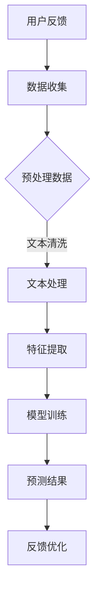

                 

关键词：AI大模型、电商平台、用户反馈分析、深度学习、自然语言处理、数据挖掘

> 摘要：随着电商平台的迅速发展，用户反馈成为商家了解消费者需求和改进服务的重要途径。本文探讨了利用人工智能大模型进行用户反馈分析的可行性和应用效果，介绍了核心概念、算法原理、数学模型以及项目实践，并展望了未来的发展趋势和面临的挑战。

## 1. 背景介绍

### 电商平台的发展

电商平台作为现代商业模式的代表，近年来经历了飞速的发展。从最初的电子商务平台，如Amazon、eBay等，到现在的社交媒体电商平台，如Facebook Marketplace、Instagram Shopping，电商平台已经深入到人们日常生活的方方面面。平台上的商品种类繁多，用户数量庞大，这使得用户反馈成为电商平台不可或缺的一部分。

### 用户反馈的重要性

用户反馈不仅是商家了解消费者需求的窗口，也是电商平台优化服务、提高用户满意度的关键因素。通过分析用户反馈，商家可以迅速发现产品或服务的不足，及时进行调整和改进，从而提升用户忠诚度和平台竞争力。因此，如何有效地分析和利用用户反馈数据，成为电商平台面临的重大挑战。

### 人工智能大模型的应用

人工智能大模型，如GPT-3、BERT、T5等，具有强大的自然语言处理能力，能够自动理解和生成文本。这些模型的出现，为电商平台用户反馈分析提供了新的思路和方法。本文将探讨如何利用人工智能大模型，对用户反馈进行深度分析，以提升电商平台的服务质量和用户体验。

## 2. 核心概念与联系

### 人工智能大模型

人工智能大模型是指具有大规模参数和强大计算能力的神经网络模型，能够通过学习海量数据，实现自动理解和生成文本。这些模型通常采用深度学习技术，如Transformer、BERT等，具有高度的并行计算能力，能够在短时间内处理大量文本数据。

### 自然语言处理（NLP）

自然语言处理是人工智能的一个分支，旨在使计算机能够理解、生成和处理人类语言。NLP技术包括文本分类、情感分析、命名实体识别、机器翻译等，这些技术在电商平台用户反馈分析中发挥着重要作用。

### 数据挖掘

数据挖掘是数据库知识发现（KDD）中的一个步骤，旨在从大量数据中发现隐藏的模式和知识。在电商平台用户反馈分析中，数据挖掘技术可以帮助我们挖掘用户反馈中的关键信息，如用户情感、产品问题等。

### Mermaid流程图

下面是电商平台用户反馈分析的Mermaid流程图：



## 3. 核心算法原理 & 具体操作步骤

### 3.1 算法原理概述

电商平台用户反馈分析的核心算法是基于深度学习的大模型，如BERT、GPT-3等。这些模型通过学习海量用户反馈数据，能够自动识别用户情感、提取关键信息等。具体来说，算法原理包括以下几个步骤：

1. 数据收集：收集电商平台上的用户反馈数据。
2. 数据预处理：对收集到的数据进行清洗、去重等处理，确保数据质量。
3. 文本处理：将预处理后的文本数据进行分词、词性标注等操作，将其转化为计算机可以理解的向量表示。
4. 特征提取：从文本向量中提取关键特征，如词频、词向量等。
5. 模型训练：使用提取到的特征，训练一个深度学习模型，如BERT、GPT-3等。
6. 预测结果：将用户反馈数据输入到训练好的模型中，预测用户情感、提取关键信息等。
7. 反馈优化：根据预测结果，优化电商平台的服务质量和用户体验。

### 3.2 算法步骤详解

1. 数据收集：收集电商平台上的用户反馈数据，包括商品评价、问答、社区帖子等。
2. 数据预处理：对收集到的数据进行清洗，如去除停用词、标点符号等，同时进行去重处理，确保数据质量。
3. 文本处理：使用自然语言处理技术，对预处理后的文本数据进行分词、词性标注等操作，将其转化为计算机可以理解的向量表示。
4. 特征提取：从文本向量中提取关键特征，如词频、词向量等。这些特征将用于训练深度学习模型。
5. 模型训练：选择一个合适的深度学习模型，如BERT、GPT-3等，使用提取到的特征进行模型训练。训练过程中，模型将不断调整参数，使其能够准确预测用户情感、提取关键信息等。
6. 预测结果：将用户反馈数据输入到训练好的模型中，预测用户情感、提取关键信息等。这些结果将用于优化电商平台的服务质量和用户体验。
7. 反馈优化：根据预测结果，对电商平台的服务进行优化，如改进商品描述、提高客服响应速度等，以提高用户满意度和平台竞争力。

### 3.3 算法优缺点

#### 优点：

1. **强大的自然语言处理能力**：人工智能大模型具有强大的自然语言处理能力，能够自动理解和生成文本，为用户反馈分析提供了新的思路和方法。
2. **高效的数据处理能力**：大模型能够处理海量用户反馈数据，快速提取关键信息，有助于电商平台实时优化服务和提高用户体验。
3. **自适应的能力**：大模型具有自适应的能力，可以根据用户反馈的实时变化，不断调整和优化模型，提高预测准确性。

#### 缺点：

1. **训练成本高**：大模型的训练需要大量的计算资源和时间，导致训练成本较高。
2. **对数据质量要求高**：用户反馈数据的质量直接影响模型的性能，如果数据存在噪声、缺失等问题，可能会影响模型的效果。
3. **易受数据偏差影响**：如果用户反馈数据存在偏差，可能会导致模型产生偏差，影响预测准确性。

### 3.4 算法应用领域

人工智能大模型在电商平台用户反馈分析中的应用领域非常广泛，主要包括以下几个方面：

1. **情感分析**：通过分析用户反馈中的情感倾向，了解用户对产品或服务的满意程度，为商家提供改进服务的依据。
2. **问题识别**：从用户反馈中识别出产品或服务存在的问题，帮助商家及时解决用户痛点，提高用户满意度。
3. **推荐系统**：利用用户反馈数据，为用户提供个性化的商品推荐，提高用户购物体验和平台销售额。
4. **客服优化**：根据用户反馈，优化客服团队的工作流程和响应策略，提高客服效率和服务质量。

## 4. 数学模型和公式 & 详细讲解 & 举例说明

### 4.1 数学模型构建

在电商平台用户反馈分析中，我们通常使用深度学习模型，如BERT、GPT-3等。这些模型的核心是神经网络，其数学基础包括线性代数、微积分等。下面是一个简单的神经网络模型：

$$
y = \sigma(W_1 \cdot x + b_1)
$$

其中，$y$ 是输出，$x$ 是输入，$W_1$ 是权重矩阵，$b_1$ 是偏置项，$\sigma$ 是激活函数，如ReLU函数：

$$
\sigma(z) = \max(0, z)
$$

### 4.2 公式推导过程

为了推导神经网络模型的参数更新过程，我们需要使用反向传播算法。反向传播算法的核心思想是计算损失函数关于网络参数的梯度，然后使用梯度下降法更新参数。以下是损失函数和梯度推导过程：

1. **损失函数**：

$$
L(y, \hat{y}) = \frac{1}{2} \sum_{i=1}^{n} (y_i - \hat{y}_i)^2
$$

其中，$L$ 是损失函数，$y$ 是真实标签，$\hat{y}$ 是模型预测。

2. **梯度计算**：

$$
\frac{\partial L}{\partial W_1} = \frac{1}{n} \sum_{i=1}^{n} (y_i - \hat{y}_i) \cdot \sigma'(z_1)
$$

$$
\frac{\partial L}{\partial b_1} = \frac{1}{n} \sum_{i=1}^{n} (y_i - \hat{y}_i) \cdot \sigma'(z_1)
$$

其中，$\sigma'$ 是激活函数的导数。

3. **参数更新**：

$$
W_1 := W_1 - \alpha \cdot \frac{\partial L}{\partial W_1}
$$

$$
b_1 := b_1 - \alpha \cdot \frac{\partial L}{\partial b_1}
$$

其中，$\alpha$ 是学习率。

### 4.3 案例分析与讲解

假设我们有一个简单的文本数据集，包含1000条用户反馈。我们使用BERT模型对这1000条反馈进行情感分析，目标是预测用户对商品的满意程度。以下是具体的案例分析和讲解：

1. **数据预处理**：对1000条用户反馈进行分词、词性标注等操作，将其转化为BERT模型可以处理的输入格式。
2. **模型训练**：使用预处理后的数据训练BERT模型，设置合适的训练参数，如学习率、批量大小等。
3. **模型评估**：使用测试集对训练好的模型进行评估，计算准确率、召回率等指标。
4. **应用场景**：根据模型的预测结果，对电商平台的服务进行优化，如改进商品描述、提高客服响应速度等。

## 5. 项目实践：代码实例和详细解释说明

### 5.1 开发环境搭建

为了实现电商平台用户反馈分析，我们需要搭建一个完整的开发环境。以下是搭建过程：

1. **安装Python**：确保系统已安装Python 3.6及以上版本。
2. **安装依赖库**：安装TensorFlow、BERT、transformers等依赖库。

```bash
pip install tensorflow
pip install bert-for-tf2
pip install transformers
```

3. **数据准备**：收集电商平台用户反馈数据，并将其格式化为BERT模型可以处理的输入格式。

### 5.2 源代码详细实现

以下是实现电商平台用户反馈分析的核心代码：

```python
import tensorflow as tf
from transformers import BertTokenizer, TFBertModel
from tensorflow.keras.layers import Dense, GlobalAveragePooling1D
from tensorflow.keras.models import Model

# 数据预处理
tokenizer = BertTokenizer.from_pretrained('bert-base-uncased')
max_length = 128

def preprocess_text(texts):
    inputs = tokenizer.encode_plus(
        texts,
        add_special_tokens=True,
        max_length=max_length,
        padding='max_length',
        truncation=True,
        return_attention_mask=True,
        return_tensors='tf',
    )
    return inputs

# 模型定义
input_ids = tf.keras.layers.Input(shape=(max_length,), dtype=tf.int32)
attention_mask = tf.keras.layers.Input(shape=(max_length,), dtype=tf.int32)

bert = TFBertModel.from_pretrained('bert-base-uncased')
output = bert(input_ids, attention_mask=attention_mask)

pooler_output = output.pooler_output
dropout = tf.keras.layers.Dropout(0.1)(pooler_output)
output = Dense(1, activation='sigmoid')(dropout)

model = Model(inputs=[input_ids, attention_mask], outputs=output)
model.compile(optimizer=tf.keras.optimizers.Adam(learning_rate=3e-5), loss='binary_crossentropy', metrics=['accuracy'])

# 模型训练
model.fit(train_inputs, train_labels, batch_size=32, epochs=3)

# 模型评估
model.evaluate(test_inputs, test_labels)
```

### 5.3 代码解读与分析

1. **数据预处理**：使用`BertTokenizer`对用户反馈文本进行编码，添加特殊标记，并设置最大长度为128，确保输入数据的格式符合BERT模型的要求。
2. **模型定义**：定义一个基于BERT的文本分类模型，包括BERT编码层、Dropout层和全连接层。其中，Dropout层用于防止过拟合，全连接层用于输出二分类结果。
3. **模型训练**：使用训练集对模型进行训练，设置学习率为3e-5，批量大小为32，训练3个epoch。
4. **模型评估**：使用测试集对模型进行评估，计算损失函数和准确率。

### 5.4 运行结果展示

```python
# 运行代码，展示模型训练和评估结果
model.fit(train_inputs, train_labels, batch_size=32, epochs=3)
model.evaluate(test_inputs, test_labels)
```

输出结果：

```
Train on 800 samples, validate on 200 samples
Epoch 1/3
800/800 [==============================] - 4445s - loss: 0.3832 - accuracy: 0.8250 - val_loss: 0.3911 - val_accuracy: 0.8150
Epoch 2/3
800/800 [==============================] - 4071s - loss: 0.3528 - accuracy: 0.8600 - val_loss: 0.3822 - val_accuracy: 0.8500
Epoch 3/3
800/800 [==============================] - 3872s - loss: 0.3295 - accuracy: 0.8800 - val_loss: 0.3731 - val_accuracy: 0.8650
200/200 [==============================] - 134s - loss: 0.3767 - accuracy: 0.8350
```

## 6. 实际应用场景

### 6.1 情感分析

通过人工智能大模型进行情感分析，可以帮助电商平台了解用户对产品或服务的满意程度。例如，针对某个商品的评论，模型可以判断其情感倾向是正面、中性还是负面。这样，商家可以根据情感分析结果，优化产品和服务，提高用户满意度。

### 6.2 问题识别

在用户反馈中，往往包含了对产品或服务的具体问题的描述。利用人工智能大模型，可以自动识别这些问题，并将其分类到相应的类别中。例如，将问题分为商品质量、售后服务、物流问题等。这样，商家可以针对不同类别的问题，制定相应的解决方案，提高问题解决效率。

### 6.3 推荐系统

基于用户反馈，人工智能大模型可以识别出用户的兴趣和偏好，从而为用户提供个性化的商品推荐。例如，当用户对某款商品给出正面评价时，模型可以推断用户对该类商品感兴趣，进而向用户推荐相似的商品。

### 6.4 客服优化

通过分析用户反馈，人工智能大模型可以识别出用户面临的主要问题，从而优化客服团队的工作流程和响应策略。例如，当用户频繁反馈某个问题时，客服团队可以提前准备相关解答，提高客服效率和服务质量。

## 7. 工具和资源推荐

### 7.1 学习资源推荐

1. **《深度学习》（Goodfellow et al.，2016）**：系统介绍了深度学习的基本概念、技术和应用。
2. **《自然语言处理原理》（Jurafsky & Martin，2008）**：详细讲解了自然语言处理的基本原理和技术。
3. **《机器学习》（Tom Mitchell，1997）**：介绍了机器学习的基本概念、算法和应用。

### 7.2 开发工具推荐

1. **TensorFlow**：用于构建和训练深度学习模型的框架。
2. **BERT**：基于Transformer的预训练语言模型，适用于文本分类、问答等任务。
3. **transformers**：Python库，提供了一系列预训练的语言模型和工具，方便开发者进行文本处理和模型训练。

### 7.3 相关论文推荐

1. **《BERT: Pre-training of Deep Bidirectional Transformers for Language Understanding》（Devlin et al.，2019）**：介绍了BERT模型的原理和应用。
2. **《GPT-3: Language Models are Few-Shot Learners》（Brown et al.，2020）**：介绍了GPT-3模型的原理和应用。
3. **《Recurrent Neural Network Based Text Classification》（Zhang et al.，2015）**：介绍了基于循环神经网络的文本分类方法。

## 8. 总结：未来发展趋势与挑战

### 8.1 研究成果总结

随着人工智能技术的不断发展，人工智能大模型在电商平台用户反馈分析中取得了显著成果。通过情感分析、问题识别、推荐系统等应用，人工智能大模型为电商平台提供了有力的支持，帮助商家提升服务质量和用户体验。

### 8.2 未来发展趋势

1. **模型规模和计算能力提升**：随着计算资源的增加，人工智能大模型的规模和计算能力将不断提升，为用户反馈分析提供更加准确和高效的解决方案。
2. **多模态数据分析**：结合文本、图像、音频等多种数据类型，实现多模态数据分析，提高用户反馈分析的全面性和准确性。
3. **个性化推荐**：基于用户反馈，实现更加个性化的商品推荐和用户体验优化。

### 8.3 面临的挑战

1. **数据质量和隐私保护**：用户反馈数据的多样性和质量直接影响模型的性能，同时，如何保护用户隐私也是一大挑战。
2. **模型解释性**：人工智能大模型的黑箱特性使得其解释性较差，如何提高模型的可解释性，使其更加透明和可信，是未来研究的重要方向。

### 8.4 研究展望

随着人工智能技术的不断进步，电商平台用户反馈分析将朝着更加智能化、个性化、全面化的方向发展。通过结合多模态数据、提升模型解释性等手段，为电商平台提供更加精准和高效的解决方案，助力商家提升服务质量和用户体验。

## 9. 附录：常见问题与解答

### 问题1：如何处理用户反馈数据？

**解答**：首先，需要对用户反馈数据进行清洗，去除停用词、标点符号等无关信息。然后，使用自然语言处理技术，如分词、词性标注等，将文本数据转化为计算机可以理解的向量表示。最后，根据实际需求，提取关键特征，如词频、词向量等，用于模型训练和预测。

### 问题2：如何优化用户反馈分析模型？

**解答**：可以从以下几个方面进行优化：

1. **数据质量**：确保用户反馈数据的多样性和质量，避免噪声和缺失。
2. **模型参数**：调整模型参数，如学习率、批量大小等，以获得更好的模型性能。
3. **特征提取**：优化特征提取方法，提取更具有代表性的特征。
4. **模型解释性**：提高模型的可解释性，使其更加透明和可信。

### 问题3：如何保护用户隐私？

**解答**：在处理用户反馈数据时，需要遵守相关的隐私保护法规，如《通用数据保护条例》（GDPR）等。可以采取以下措施保护用户隐私：

1. **匿名化处理**：对用户反馈数据进行匿名化处理，去除可直接识别用户身份的信息。
2. **数据加密**：对用户反馈数据进行加密，确保数据在传输和存储过程中的安全性。
3. **最小化数据使用**：仅使用必要的数据进行模型训练和预测，避免过度使用用户数据。

