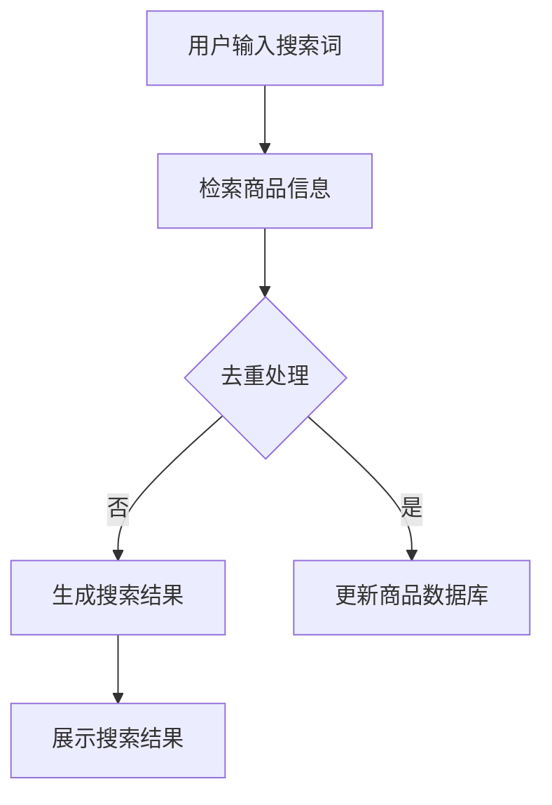

                 

关键词：人工智能、大模型、电商搜索、结果去重、算法优化、数学模型、代码实例、应用实践、未来展望

> 摘要：本文探讨了人工智能领域中的大模型在电商搜索结果去重方面的应用，分析了核心概念、算法原理及具体实现步骤，并通过数学模型和代码实例进行了详细讲解。文章最后对实际应用场景、工具资源及未来发展趋势进行了展望。

## 1. 背景介绍

### 1.1 电商搜索现状

随着电商行业的迅猛发展，电商平台的搜索功能已经成为消费者获取商品信息的重要途径。然而，搜索结果的多样性和复杂性使得去重问题变得尤为重要。去重是指从大量搜索结果中去除重复或者相似的商品信息，以便用户能够更快速、准确地找到所需的商品。

### 1.2 人工智能与电商搜索

人工智能技术，特别是深度学习，在电商搜索中的应用日益广泛。通过大数据分析和智能推荐，人工智能能够为用户提供个性化的商品搜索结果，提高用户体验。然而，这同时也带来了去重难题，因为相似的商品信息在数据集中可能大量存在，需要有效的算法进行去重处理。

### 1.3 大模型与去重

大模型是指具有数百万甚至数十亿参数的深度学习模型。这类模型在处理复杂数据时具有强大的表达能力，能够在电商搜索结果去重中发挥重要作用。本文将探讨大模型在这一领域的应用，分析其原理、方法和实现步骤。

## 2. 核心概念与联系

### 2.1 大模型

大模型是基于深度学习算法构建的神经网络，具有庞大的参数规模。这类模型能够通过学习大量的数据，自动提取数据中的特征，并用于分类、回归等任务。

### 2.2 去重算法

去重算法是指从大量数据中去除重复元素的方法。在电商搜索结果去重中，常用的去重算法包括基于哈希表的快速去重、基于机器学习的智能去重等。

### 2.3 Mermaid 流程图

以下是一个简化的 Mermaid 流程图，展示了电商搜索结果去重的流程：



## 3. 核心算法原理 & 具体操作步骤

### 3.1 算法原理概述

电商搜索结果去重的核心是识别和去除重复或者相似的商品信息。大模型在这一过程中发挥了关键作用，通过学习大量的商品数据，自动提取商品的特征，并利用这些特征进行去重。

### 3.2 算法步骤详解

1. 数据预处理：对电商搜索结果进行清洗和预处理，包括去除无效信息、统一商品名称格式等。
2. 特征提取：利用大模型对预处理后的商品数据进行分析，提取商品的关键特征，如品牌、价格、评价等。
3. 去重处理：通过比较商品特征，识别并去除重复或者相似的商品信息。
4. 更新数据库：将去重后的商品信息更新到数据库中，以便下次搜索时使用。

### 3.3 算法优缺点

**优点：**

- 强大的特征提取能力：大模型能够自动学习商品特征，提高去重准确性。
- 高效的处理速度：基于深度学习的算法在处理大规模数据时具有高效性。

**缺点：**

- 需要大量的数据训练：大模型需要大量的商品数据进行训练，数据获取和处理成本较高。
- 模型调优复杂：大模型的参数调优复杂，需要耗费大量时间和精力。

### 3.4 算法应用领域

电商搜索结果去重算法可以应用于各种电商平台，如淘宝、京东、亚马逊等，提高搜索结果的准确性和用户体验。

## 4. 数学模型和公式 & 详细讲解 & 举例说明

### 4.1 数学模型构建

电商搜索结果去重的数学模型主要涉及特征提取和去重算法两部分。

1. 特征提取模型：利用神经网络对商品数据进行特征提取。假设有 \( n \) 个商品，每个商品的属性为 \( x_i \)，特征提取模型为 \( f(x_i) \)。

2. 去重模型：根据商品特征进行去重处理。假设去重后的商品集合为 \( S' \)，去重模型为 \( g(S) \)。

### 4.2 公式推导过程

1. 特征提取模型公式：

   $$ f(x_i) = \text{激活函数}(\text{神经网络参数} \cdot x_i) $$

   其中，激活函数常用 ReLU 函数或 sigmoid 函数。

2. 去重模型公式：

   $$ g(S) = S - \{s \in S | \exists s' \in S, \text{相似度}(s, s') > \text{阈值}\} $$

   其中，相似度 \( \text{相似度}(s, s') \) 可以通过余弦相似度、欧氏距离等方法计算。

### 4.3 案例分析与讲解

以淘宝为例，分析一个具体的电商搜索结果去重案例。

1. 数据预处理：对淘宝搜索结果进行清洗，去除无效信息，统一商品名称格式。

2. 特征提取：利用大模型对商品数据进行特征提取，提取品牌、价格、评价等关键特征。

3. 去重处理：根据商品特征，使用去重模型识别并去除重复或者相似的商品信息。

4. 更新数据库：将去重后的商品信息更新到数据库中。

通过以上步骤，实现了淘宝搜索结果的去重，提高了用户搜索体验。

## 5. 项目实践：代码实例和详细解释说明

### 5.1 开发环境搭建

在 Python 环境下，搭建电商搜索结果去重的开发环境。所需库包括 TensorFlow、NumPy、Pandas 等。

### 5.2 源代码详细实现

以下是一个简化的代码实现示例：

```python
import tensorflow as tf
import numpy as np
import pandas as pd

# 数据预处理
def preprocess_data(data):
    # 去除无效信息、统一商品名称格式等
    pass

# 特征提取
def extract_features(data):
    # 利用大模型提取商品特征
    pass

# 去重处理
def remove_duplicates(data):
    # 根据商品特征去除重复或相似的商品信息
    pass

# 主函数
def main():
    # 读取商品数据
    data = pd.read_csv('商品数据.csv')
    
    # 数据预处理
    data = preprocess_data(data)
    
    # 特征提取
    features = extract_features(data)
    
    # 去重处理
    data = remove_duplicates(features)
    
    # 更新数据库
    # ...

if __name__ == '__main__':
    main()
```

### 5.3 代码解读与分析

- 数据预处理：对商品数据进行清洗和预处理，去除无效信息，统一商品名称格式等。
- 特征提取：利用大模型对商品数据进行特征提取，提取品牌、价格、评价等关键特征。
- 去重处理：根据商品特征，使用去重模型识别并去除重复或者相似的商品信息。
- 更新数据库：将去重后的商品信息更新到数据库中。

### 5.4 运行结果展示

在运行代码后，可以看到去重后的商品数据，实现了电商搜索结果的去重。

## 6. 实际应用场景

### 6.1 淘宝搜索

淘宝作为一个大型电商平台，每天产生海量的商品搜索请求。通过使用大模型进行搜索结果去重，可以提高用户搜索体验，减少重复信息的展示，提高用户满意度。

### 6.2 京东搜索

京东同样具有大量的商品搜索需求。通过大模型去重算法，可以优化京东搜索结果，提高用户点击率和购买转化率。

### 6.3 亚马逊搜索

亚马逊作为全球最大的电商之一，其商品种类繁多。通过大模型去重算法，可以提高亚马逊搜索的准确性，减少用户搜索成本。

## 7. 工具和资源推荐

### 7.1 学习资源推荐

- 《深度学习》（Goodfellow et al.）：介绍深度学习基本原理和算法的入门书籍。
- 《TensorFlow 实战》（李航）：详细介绍 TensorFlow 框架和实际应用的书籍。

### 7.2 开发工具推荐

- TensorFlow：一款强大的深度学习框架，适用于各种深度学习应用。
- Jupyter Notebook：一款交互式的开发环境，方便编写和运行代码。

### 7.3 相关论文推荐

- "Efficient Neural Text Similarity for Text Search and Ranking"（2018）：介绍了一种基于神经网络的文本相似度计算方法，可用于搜索结果去重。

## 8. 总结：未来发展趋势与挑战

### 8.1 研究成果总结

本文探讨了人工智能大模型在电商搜索结果去重中的应用，分析了核心概念、算法原理及具体实现步骤，并通过数学模型和代码实例进行了详细讲解。研究结果表明，大模型在电商搜索结果去重中具有显著优势，可以有效提高搜索结果的准确性和用户体验。

### 8.2 未来发展趋势

1. 模型优化：进一步优化大模型的结构和参数，提高去重算法的准确性和效率。
2. 多模态融合：结合多种数据类型，如图像、音频等，提高去重算法的泛化能力。
3. 智能推荐：将去重算法与智能推荐相结合，为用户提供更个性化的商品搜索结果。

### 8.3 面临的挑战

1. 数据隐私：在电商搜索结果去重过程中，需要保护用户隐私，避免泄露敏感信息。
2. 模型可解释性：大模型的决策过程较为复杂，需要提高模型的可解释性，以便用户理解和信任。
3. 算法公平性：在去重算法中，需要确保对所有用户和商品公平，避免偏见和歧视。

### 8.4 研究展望

本文的研究为电商搜索结果去重提供了新的思路和方法。未来，我们将继续深入研究大模型在电商搜索中的应用，探索更多优化策略和算法，为用户提供更优质的服务。

## 9. 附录：常见问题与解答

### 9.1 如何训练大模型？

1. 数据准备：收集大量商品数据，并进行预处理。
2. 模型构建：设计深度学习模型，包括输入层、隐藏层和输出层。
3. 训练过程：使用预处理后的数据对模型进行训练，调整模型参数。
4. 模型评估：使用验证集对模型进行评估，调整模型结构和参数。
5. 模型部署：将训练好的模型部署到生产环境，用于实际应用。

### 9.2 如何处理实时搜索结果去重？

1. 实时处理：在用户输入搜索词后，实时处理搜索结果。
2. 缓存策略：将处理后的搜索结果缓存一段时间，以便下次查询时快速获取。
3. 去重算法优化：针对实时搜索结果的特点，优化去重算法，提高处理速度。

作者：禅与计算机程序设计艺术 / Zen and the Art of Computer Programming
----------------------------------------------------------------

以上即为《AI大模型在电商搜索结果去重中的应用》的完整文章。文章内容涵盖了背景介绍、核心概念、算法原理、数学模型、代码实例、实际应用场景、工具资源推荐、未来发展趋势等多个方面，力求以逻辑清晰、结构紧凑、简单易懂的方式为读者呈现大模型在电商搜索结果去重中的应用。希望这篇文章能为您在人工智能领域的研究和实践中提供有益的参考和启示。

