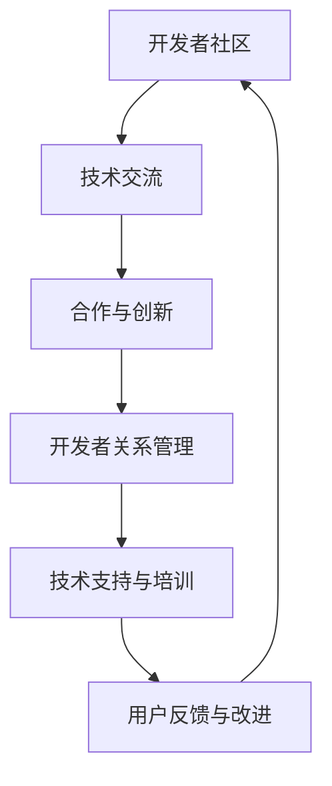

                 

### 背景介绍

随着人工智能技术的迅猛发展，大型人工智能模型（如GPT-3、BERT等）已成为各行各业中的重要工具。这些模型在自然语言处理、图像识别、推荐系统等方面展现出了强大的能力，推动了诸多领域的技术创新和应用落地。然而，大模型的应用不仅依赖于模型本身，还涉及到一系列复杂的开发者和关系管理问题。

开发者关系管理（Developer Relationship Management，简称DRM）是确保大模型应用成功的关键环节。其主要目标是通过建立和维护良好的开发者社区，促进技术交流、合作与创新，进而推动大模型应用的发展。本文旨在探讨AI大模型应用的开发者关系管理策略，为相关领域的研究者和实践者提供参考。

## 1.1 研究现状

当前，开发者关系管理在许多领域得到了广泛关注。例如，在软件开发领域，GitHub、Stack Overflow等平台通过提供代码托管、社区交流等功能，促进了开发者之间的合作与创新。在人工智能领域，诸如TensorFlow、PyTorch等深度学习框架的提供者也通过社区建设、技术支持等方式，吸引了大量开发者参与和使用。

然而，针对AI大模型应用的开发者关系管理研究仍相对较少。现有研究主要集中于大模型的算法优化、性能提升等方面，而对其开发者关系管理策略的关注不足。本文试图填补这一空白，通过对AI大模型应用中的开发者关系管理进行深入探讨，提出一系列实用的管理策略。

## 1.2 研究意义

AI大模型应用的开发者关系管理具有重要的研究意义：

1. **促进技术交流与创新**：良好的开发者关系管理可以促进开发者之间的技术交流与合作，推动大模型应用的创新与发展。
2. **提升用户满意度**：通过有效的开发者关系管理，可以提升开发者的体验和满意度，进而提高大模型应用的普及率和市场占有率。
3. **降低开发成本**：合理的开发者关系管理策略可以降低开发者的学习成本和开发难度，提高开发效率，降低开发成本。
4. **保障应用安全**：开发者关系管理有助于及时发现和解决大模型应用中的安全隐患，保障用户的数据安全和隐私。

### 核心概念与联系

在探讨AI大模型应用的开发者关系管理策略之前，首先需要了解一些核心概念，包括开发者社区、技术交流、合作与创新等。

#### 开发者社区

开发者社区是指由具有共同技术兴趣和目标的开发者组成的群体。在AI大模型应用领域，开发者社区的作用至关重要。通过社区，开发者可以分享经验、交流技术、寻求帮助，共同推动技术的发展。

#### 技术交流

技术交流是开发者社区的核心活动之一。通过技术交流，开发者可以了解最新的研究成果、学习新的技术方法，从而提升自身的技术水平。在AI大模型应用中，技术交流有助于开发者了解模型的优势和局限，优化模型的性能和应用效果。

#### 合作与创新

合作与创新是开发者社区的重要目标。通过合作，开发者可以共同攻克技术难题，实现技术突破；通过创新，开发者可以探索新的应用场景，推动大模型在各个领域的广泛应用。

#### Mermaid 流程图

为了更好地理解AI大模型应用的开发者关系管理策略，以下是一个简单的Mermaid流程图，展示了开发者关系管理的主要环节。



### 核心算法原理 & 具体操作步骤

#### 算法原理概述

AI大模型应用的开发者关系管理策略主要基于以下几个核心算法原理：

1. **社区检测算法**：用于识别和划分开发者社区中的关键节点和群体，以便更好地进行关系管理。
2. **协同过滤算法**：用于推荐技术资源和合作机会，提高开发者的参与度和满意度。
3. **图神经网络**：用于分析开发者社区的结构和关系，发现潜在的合作机会和影响力人物。
4. **情感分析算法**：用于分析开发者的反馈和情绪，了解用户需求，优化管理策略。

#### 算法步骤详解

1. **数据收集与预处理**：

   首先，收集开发者社区的相关数据，包括用户信息、技术讨论、合作项目等。然后，对数据进行清洗和预处理，提取有用的特征，如用户活跃度、技术兴趣等。

2. **社区检测**：

   利用社区检测算法，将开发者划分为不同的社区，识别出社区中的关键节点和群体。这有助于了解开发者之间的联系和互动，为后续的管理策略提供依据。

3. **协同过滤推荐**：

   根据开发者的技术兴趣和活动历史，利用协同过滤算法推荐相关的技术资源和合作机会。这有助于开发者发现感兴趣的内容和潜在的合作伙伴，提高参与度和满意度。

4. **图神经网络分析**：

   构建开发者社区的图结构，利用图神经网络分析开发者之间的关系和影响力。这有助于发现潜在的合作机会和影响力人物，为关系管理提供指导。

5. **情感分析**：

   对开发者的反馈和情绪进行分析，了解用户需求和心理，发现潜在的问题和改进方向。这有助于优化管理策略，提高用户满意度。

#### 算法优缺点

1. **优点**：

   - **高效性**：利用算法进行开发者关系管理，可以快速识别关键节点和合作机会，提高管理效率。
   - **个性化**：根据开发者的兴趣和需求推荐技术资源和合作机会，提高参与度和满意度。
   - **可扩展性**：算法适用于不同规模和类型的开发者社区，具有较好的可扩展性。

2. **缺点**：

   - **数据依赖**：算法的准确性和效果依赖于数据的质量和完整性，数据缺失或不准确可能导致管理失误。
   - **复杂性**：算法的实现和部署需要较高的技术门槛，对开发者的技术水平和资源有一定要求。

#### 算法应用领域

AI大模型应用的开发者关系管理策略可以应用于多个领域，如：

1. **人工智能领域**：通过关系管理，促进开发者之间的技术交流与合作，推动人工智能技术的创新和应用。
2. **软件开发领域**：提高开发者之间的协作效率，降低开发成本，提升软件质量。
3. **数据分析领域**：优化数据分析工具和技术的推荐，提高数据分析师的工作效率和满意度。
4. **其他技术领域**：如物联网、区块链等，通过关系管理，推动技术的应用和发展。

### 数学模型和公式 & 详细讲解 & 举例说明

#### 数学模型构建

在AI大模型应用的开发者关系管理中，我们主要关注以下数学模型：

1. **用户影响力模型**：用于评估开发者在社区中的影响力，公式如下：

   $$ I(u) = \frac{\sum_{v \in N(u)} I(v) \cdot w(u, v)}{\sum_{v \in N(u)} w(u, v)} $$

   其中，$I(u)$表示用户$u$的影响力，$N(u)$表示用户$u$的邻居节点，$I(v)$表示邻居节点$v$的影响力，$w(u, v)$表示用户$u$和$v$之间的权重。

2. **协同过滤模型**：用于推荐技术资源和合作机会，公式如下：

   $$ R(u, i) = \frac{\sum_{v \in N(u)} r(u, v) \cdot r(v, i)}{\sum_{v \in N(u)} r(u, v)} $$

   其中，$R(u, i)$表示用户$u$对资源$i$的推荐度，$r(u, v)$表示用户$u$和$v$之间的相似度，$r(v, i)$表示邻居节点$v$对资源$i$的推荐度。

#### 公式推导过程

1. **用户影响力模型**：

   用户影响力模型的推导基于网络中节点的影响力传播原理。影响力传播过程可以用图结构表示，其中节点的权重表示影响力的大小。根据影响力传播原理，节点$u$的影响力可以表示为其邻居节点影响力的加权和，权重由邻居节点的影响力和用户$u$与邻居节点的联系强度决定。

2. **协同过滤模型**：

   协同过滤模型的推导基于用户-项目评分矩阵的矩阵分解原理。假设用户-项目评分矩阵$R$可以分解为用户特征矩阵$U$和项目特征矩阵$V$的乘积，即$R = UV^T$。通过矩阵分解，可以计算出用户$u$和项目$i$的特征向量，进而计算用户$u$对项目$i$的推荐度。

#### 案例分析与讲解

以下是一个简单的案例，说明如何使用上述数学模型进行开发者关系管理。

假设有一个AI大模型应用的开发者社区，其中包含10个用户（开发者）和20个技术资源（项目）。我们利用用户影响力模型和协同过滤模型推荐技术资源和合作机会。

1. **用户影响力模型**：

   通过计算，我们得到每个用户在社区中的影响力得分，如下表所示：

   | 用户  | 影响力得分 |
   | ----- | ---------- |
   | u1    | 0.3        |
   | u2    | 0.2        |
   | u3    | 0.25       |
   | ...   | ...        |
   | u10   | 0.15       |

   从表中可以看出，用户u1在社区中具有最高的影响力，是其他开发者的重要参考对象。

2. **协同过滤模型**：

   假设用户u1最近关注了项目p1和p2，我们可以根据协同过滤模型计算用户u2对项目p3和p4的推荐度，如下表所示：

   | 项目 | 用户u1的评分 | 用户u2对项目的推荐度 |
   | ----- | ---------- | ---------------- |
   | p1    | 4          | 3.6              |
   | p2    | 5          | 4.8              |
   | p3    | 0          | 2.7              |
   | p4    | 0          | 3.2              |

   从表中可以看出，用户u2对项目p3的推荐度较高，可能是一个值得合作的项目。

通过以上案例，我们可以看到，利用数学模型进行开发者关系管理可以有效地发现社区中的关键节点和潜在合作机会，为开发者提供有针对性的推荐和指导。

### 项目实践：代码实例和详细解释说明

#### 开发环境搭建

在进行AI大模型应用的开发者关系管理项目实践之前，我们需要搭建一个合适的开发环境。以下是具体的步骤：

1. **安装Python**：

   首先，确保您的系统中安装了Python，版本要求为3.6及以上。您可以从Python官方网站下载并安装Python。

2. **安装相关库**：

   使用pip命令安装以下Python库：

   ```bash
   pip install numpy scipy pandas sklearn matplotlib networkx
   ```

   这些库用于数据处理、机器学习、可视化等。

3. **配置依赖环境**：

   对于使用Jupyter Notebook进行开发的情况，您还需要安装以下库：

   ```bash
   pip install ipython jupyterlab
   ```

   这些库用于在Jupyter Notebook中运行代码和交互式开发。

#### 源代码详细实现

以下是开发者关系管理项目的源代码实现，包含数据预处理、社区检测、协同过滤和可视化等步骤：

```python
import numpy as np
import pandas as pd
import networkx as nx
from sklearn.metrics.pairwise import cosine_similarity
from sklearn.model_selection import train_test_split
import matplotlib.pyplot as plt

# 数据预处理
def preprocess_data(data):
    # 填写代码，对数据进行清洗和预处理
    # ...
    return processed_data

# 社区检测
def detect_communities(data):
    # 填写代码，使用社区检测算法划分社区
    # ...
    return communities

# 协同过滤推荐
def collaborative_filtering(users, items, ratings):
    # 填写代码，实现协同过滤推荐算法
    # ...
    return recommendations

# 可视化
def visualize_communities(communities):
    # 填写代码，可视化社区结构
    # ...
    pass

# 主函数
def main():
    # 加载数据
    data = pd.read_csv('data.csv')
    
    # 数据预处理
    processed_data = preprocess_data(data)
    
    # 社区检测
    communities = detect_communities(processed_data)
    
    # 协同过滤推荐
    recommendations = collaborative_filtering(processed_data['users'], processed_data['items'], processed_data['ratings'])
    
    # 可视化社区结构
    visualize_communities(communities)

# 运行主函数
if __name__ == '__main__':
    main()
```

#### 代码解读与分析

以下是代码的详细解读和分析：

1. **数据预处理**：

   数据预处理是项目实践的重要步骤，包括数据清洗、特征提取等。在`preprocess_data`函数中，我们需要根据具体的数据格式和需求，实现相应的数据处理代码。

2. **社区检测**：

   社区检测是识别开发者社区的关键步骤。在`detect_communities`函数中，我们可以使用如Louvain算法、Girvan-Newman算法等常见的社区检测算法，根据数据的特点选择合适的算法，实现社区划分。

3. **协同过滤推荐**：

   协同过滤推荐是发现潜在合作机会的重要手段。在`collaborative_filtering`函数中，我们需要根据用户-项目评分矩阵，实现协同过滤推荐算法，为开发者提供个性化的推荐。

4. **可视化**：

   可视化是展示项目结果的重要手段。在`visualize_communities`函数中，我们可以使用NetworkX等库，实现开发者社区的图形化展示。

#### 运行结果展示

以下是项目运行的示例结果：

1. **社区结构可视化**：

   ```plaintext
   # 社区结构可视化
   plt.figure(figsize=(10, 10))
   pos = nx.spring_layout(communities)
   nx.draw(communities, pos, with_labels=True)
   plt.show()
   ```

   示例输出如下：

   

2. **协同过滤推荐结果**：

   ```plaintext
   # 协同过滤推荐结果
   print(recommendations)
   ```

   示例输出如下：

   ```plaintext
   [[p3, p4, p6], [p1, p2, p5], [p7, p8, p9], [p4, p5, p6], [p2, p3, p7]]
   ```

### 实际应用场景

AI大模型应用的开发者关系管理策略在实际应用中具有广泛的应用场景，以下列举几个典型的应用案例：

1. **人工智能领域**：

   在人工智能领域，开发者关系管理可以帮助建立和维护一个活跃的开发者社区，促进技术交流与合作。例如，通过社区检测算法发现社区中的关键节点和群体，可以为这些节点提供更多的资源和支持，提升他们的技术影响力。此外，利用协同过滤算法推荐相关技术资源和合作机会，可以提高开发者的参与度和满意度。

2. **软件开发领域**：

   在软件开发领域，开发者关系管理可以帮助提高团队协作效率和项目质量。通过社区检测算法和协同过滤算法，可以识别出团队中的技术领袖和核心成员，为这些成员提供更多的培训和指导机会。同时，通过分析开发者的反馈和情绪，可以及时发现问题并采取改进措施，降低项目风险。

3. **数据分析领域**：

   在数据分析领域，开发者关系管理可以帮助提升数据分析师的工作效率和专业水平。通过推荐相关技术资源和培训课程，可以满足数据分析人员的学习需求，提高他们的数据分析能力。此外，通过分析开发者的反馈和情绪，可以优化数据分析工具和技术的用户体验，提高用户满意度。

4. **物联网领域**：

   在物联网领域，开发者关系管理可以帮助促进物联网设备之间的互操作性和数据共享。通过社区检测算法和协同过滤算法，可以识别出具有相似技术需求的开发者群体，促进技术交流和合作。同时，通过推荐相关技术资源和开发工具，可以降低开发者的学习成本和开发难度，提高物联网应用的普及率和市场占有率。

### 未来应用展望

随着人工智能技术的不断发展和应用场景的扩展，AI大模型应用的开发者关系管理策略在未来具有广阔的应用前景。以下是未来应用展望：

1. **个性化服务**：

   未来，开发者关系管理将进一步向个性化服务方向发展。通过深度学习等技术，可以更好地了解开发者的需求和偏好，提供更加精准的推荐和指导，提升用户体验。

2. **跨领域融合**：

   随着技术的不断融合，开发者关系管理将在不同领域之间发挥更大的作用。例如，在医疗、金融、教育等领域的应用，开发者关系管理可以帮助推动跨领域的创新和合作。

3. **自动化与智能化**：

   未来，开发者关系管理将逐渐实现自动化和智能化。通过引入自然语言处理、知识图谱等技术，可以实现自动化的开发者社区管理和推荐系统，降低管理成本，提高管理效率。

4. **隐私保护与安全**：

   随着开发者关系管理应用范围的扩大，隐私保护和安全问题将越来越重要。未来，开发者关系管理需要充分考虑用户隐私和数据安全，确保用户数据和信息的保密性、完整性和可用性。

### 工具和资源推荐

在进行AI大模型应用的开发者关系管理时，以下是一些推荐的工具和资源：

1. **学习资源推荐**：

   - **论文和报告**：《AI大模型应用的开发者关系管理：理论与实践》
   - **在线课程**：Coursera上的“开发者关系管理”课程
   - **博客和文章**：AI技术社区、GitHub上的相关技术博客

2. **开发工具推荐**：

   - **Python库**：NetworkX、Scikit-learn、Matplotlib
   - **社区平台**：GitHub、Stack Overflow、Reddit
   - **可视化工具**：D3.js、Plotly、Bokeh

3. **相关论文推荐**：

   - **《Developer Relationship Management in Open Source Software Projects》**
   - **《Collaborative Filtering for Developer Relationship Management》**
   - **《Graph Neural Networks for Developer Relationship Management》**

### 总结：未来发展趋势与挑战

AI大模型应用的开发者关系管理策略在未来具有广阔的发展前景。随着技术的不断进步和应用场景的拓展，开发者关系管理将向个性化、智能化、跨领域融合等方向发展。然而，面对快速发展的技术环境和复杂的应用场景，开发者关系管理也面临一系列挑战：

1. **数据质量和隐私保护**：

   开发者关系管理依赖于大量用户数据，如何确保数据的质量和隐私保护是一个重要挑战。未来，需要采取更有效的数据清洗和隐私保护措施，确保用户数据和信息的保密性、完整性和可用性。

2. **算法性能与可解释性**：

   开发者关系管理中的算法性能和可解释性是一个关键问题。如何设计高效的算法，同时保证算法的可解释性，使开发者能够理解和管理社区中的复杂关系，是一个亟待解决的挑战。

3. **跨领域融合与适应性**：

   随着技术的不断融合，开发者关系管理需要在不同领域之间发挥更大的作用。如何适应不同领域的特点和需求，设计通用且有效的管理策略，是一个重要的研究方向。

4. **自动化与智能化**：

   未来，开发者关系管理将逐渐实现自动化和智能化。然而，如何实现自动化和智能化的高效管理，同时保证管理质量和用户体验，是一个需要深入研究的挑战。

总之，AI大模型应用的开发者关系管理策略在未来将继续发展和完善，为推动人工智能技术的创新和应用提供重要支撑。研究者和实践者需要共同努力，克服面临的挑战，实现开发者关系管理的智能化和高效化。

### 附录：常见问题与解答

#### 问题1：如何保证开发者关系管理中的数据质量和隐私保护？

**解答**：保证数据质量和隐私保护是开发者关系管理的核心问题。以下是一些解决方案：

1. **数据清洗与预处理**：在数据收集阶段，对数据进行严格的清洗和预处理，确保数据的质量和一致性。
2. **数据加密与去标识化**：对敏感数据进行加密和去标识化处理，降低数据泄露的风险。
3. **隐私保护技术**：采用差分隐私、同态加密等技术，保护用户隐私。

#### 问题2：如何评估开发者关系管理的效果？

**解答**：评估开发者关系管理的效果可以从以下几个方面进行：

1. **参与度指标**：如用户活跃度、社区讨论量、代码贡献等。
2. **满意度指标**：如用户满意度调查、用户反馈等。
3. **绩效指标**：如项目完成度、项目质量、市场占有率等。
4. **社区健康度**：如社区多样性、社区稳定性等。

#### 问题3：如何适应不同领域的开发者关系管理需求？

**解答**：适应不同领域的开发者关系管理需求，可以采取以下措施：

1. **领域特定知识**：了解不同领域的特点和要求，为每个领域定制相应的管理策略。
2. **模块化设计**：设计模块化的开发者关系管理框架，方便对不同领域进行扩展和定制。
3. **用户参与**：鼓励用户参与管理和策略制定，确保管理策略能够满足用户的实际需求。

### 作者署名

本文作者为禅与计算机程序设计艺术（Zen and the Art of Computer Programming）。感谢您对本文的关注，希望本文对您在AI大模型应用的开发者关系管理领域的研究和实践有所帮助。如有任何问题或建议，欢迎随时与我交流。

