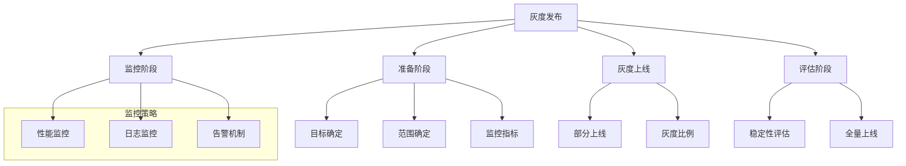
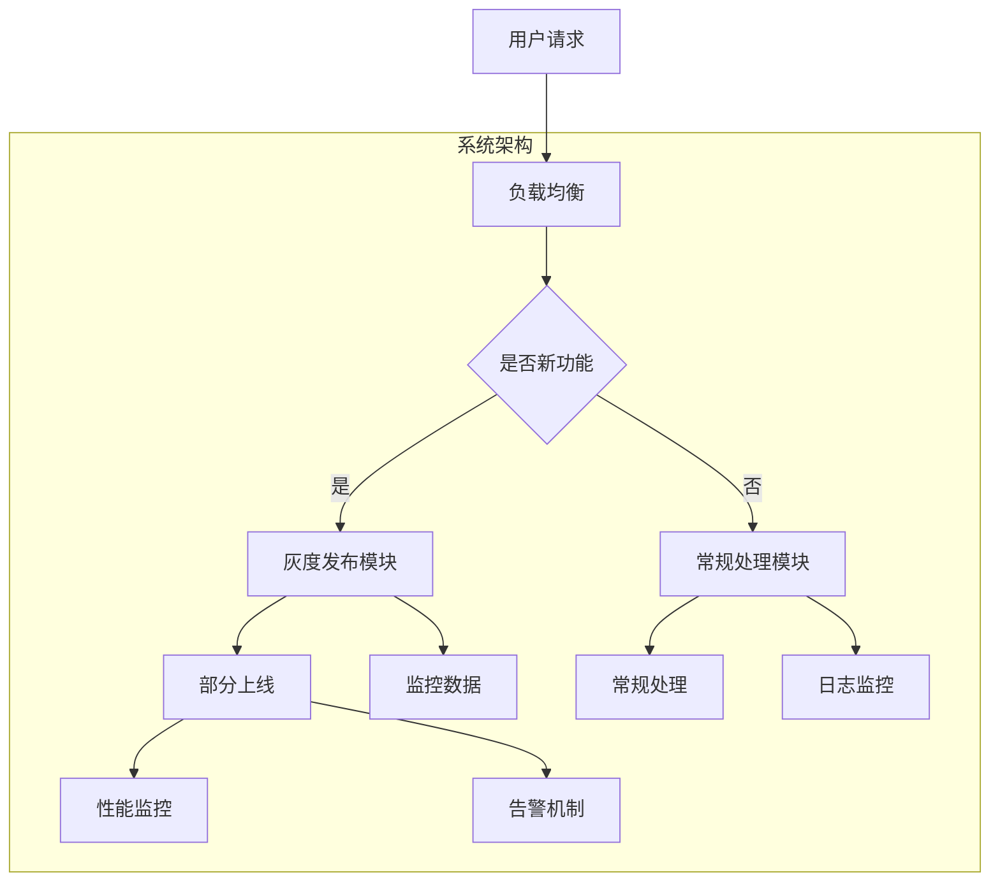

                 

关键词：AI大模型、灰度发布、监控策略、模型部署、性能优化

> 摘要：本文深入探讨了AI大模型应用的灰度发布与监控策略。通过分析灰度发布的核心原理，详细介绍了灰度发布在实际部署中的步骤、注意事项及常见问题。同时，本文从监控的角度出发，探讨了监控策略在AI大模型应用中的重要性，并提出了有效的监控方法与工具。最后，本文对AI大模型应用的未来发展趋势与挑战进行了展望，为行业从业者提供了有价值的参考。

## 1. 背景介绍

随着人工智能技术的迅猛发展，AI大模型（如GPT-3、BERT等）已经广泛应用于各个领域，从自然语言处理、计算机视觉到推荐系统等。然而，大模型的部署和运维面临着诸多挑战，如模型复杂度高、计算资源需求大、数据安全与隐私保护等。灰度发布和监控策略作为AI大模型部署的重要环节，直接关系到系统的稳定性和性能。

### 1.1 灰度发布

灰度发布（Gray Release），也称为灰度上线，是一种在系统中逐步引入新功能或版本的方法。通过灰度发布，开发团队可以在实际生产环境中逐步验证新功能的稳定性，从而降低新功能上线失败的风险。灰度发布通常包括以下步骤：

1. **准备阶段**：确定灰度发布的目标、范围、监控指标等。
2. **灰度上线**：将新功能或版本部分上线，并设置灰度比例。
3. **监控阶段**：监控系统的性能、稳定性等关键指标。
4. **评估阶段**：根据监控数据评估新功能或版本的稳定性，决定是否全量上线。

### 1.2 监控策略

监控策略是指对系统运行状态进行实时监控和告警的一系列方法和手段。对于AI大模型应用，监控策略至关重要，因为它可以帮助开发团队快速发现并解决潜在的问题，确保系统的稳定性和性能。监控策略通常包括以下几个方面：

1. **性能监控**：对系统的响应时间、吞吐量、资源使用率等关键性能指标进行监控。
2. **日志监控**：对系统日志进行分析，发现潜在的问题和异常。
3. **告警机制**：根据监控数据设置告警阈值，当指标超过阈值时自动触发告警。
4. **故障排查**：当系统发生故障时，快速定位并解决问题。

## 2. 核心概念与联系

为了更好地理解AI大模型应用的灰度发布与监控策略，下面我们将通过一个Mermaid流程图来展示核心概念和联系。



### 2.1 核心概念原理

#### 2.1.1 灰度发布

灰度发布的核心在于逐步引入新功能或版本，从而降低上线失败的风险。具体原理如下：

1. **部分上线**：将新功能或版本部分上线，通常是按照一定比例（如10%）。
2. **监控数据**：收集系统的性能、稳定性等关键指标。
3. **评估数据**：根据监控数据评估新功能或版本的稳定性。
4. **全量上线**：如果评估结果显示新功能或版本稳定，则全量上线。

#### 2.1.2 监控策略

监控策略的核心在于实时监控系统的运行状态，及时发现并解决问题。具体原理如下：

1. **性能监控**：对系统的响应时间、吞吐量、资源使用率等关键性能指标进行监控。
2. **日志监控**：对系统日志进行分析，发现潜在的问题和异常。
3. **告警机制**：根据监控数据设置告警阈值，当指标超过阈值时自动触发告警。
4. **故障排查**：当系统发生故障时，快速定位并解决问题。

### 2.2 架构

在AI大模型应用中，灰度发布与监控策略通常依托于分布式系统架构。以下是一个典型的架构示意图：



## 3. 核心算法原理 & 具体操作步骤

### 3.1 算法原理概述

灰度发布和监控策略的核心算法主要涉及以下三个方面：

1. **流量控制**：通过控制流量的比例，逐步引入新功能或版本。
2. **性能监控**：通过实时监控系统的关键性能指标，评估系统的稳定性。
3. **告警机制**：根据监控数据设置告警阈值，当指标超过阈值时自动触发告警。

### 3.2 算法步骤详解

#### 3.2.1 灰度发布

1. **准备阶段**：
   - 确定灰度发布的目标和范围。
   - 设计监控指标，如响应时间、吞吐量、资源使用率等。

2. **灰度上线**：
   - 部分上线新功能或版本，设置灰度比例（如10%）。
   - 收集监控数据，如性能、稳定性等。

3. **监控阶段**：
   - 实时监控系统的关键性能指标。
   - 根据监控数据评估新功能或版本的稳定性。

4. **评估阶段**：
   - 如果评估结果显示新功能或版本稳定，则全量上线。
   - 如果评估结果显示不稳定，则调整灰度比例或重新设计。

#### 3.2.2 监控策略

1. **性能监控**：
   - 收集系统的响应时间、吞吐量、资源使用率等关键性能指标。
   - 设置监控阈值，当指标超过阈值时触发告警。

2. **日志监控**：
   - 分析系统日志，发现潜在的问题和异常。
   - 设置日志告警，如出现错误日志时触发告警。

3. **告警机制**：
   - 根据监控数据设置告警阈值。
   - 当指标超过阈值时，自动触发告警，通知开发人员。

### 3.3 算法优缺点

#### 优点

1. **降低风险**：通过灰度发布，逐步引入新功能或版本，降低上线失败的风险。
2. **提高稳定性**：实时监控系统的性能和稳定性，确保系统的稳定运行。
3. **快速迭代**：通过监控数据快速发现问题并解决，提高开发效率。

#### 缺点

1. **复杂性**：灰度发布和监控策略的设计和实现较为复杂，需要一定的技术积累。
2. **性能开销**：监控数据的收集和处理需要一定的性能开销，可能会对系统产生一定影响。

### 3.4 算法应用领域

灰度发布和监控策略在AI大模型应用中具有广泛的应用领域：

1. **模型部署**：通过灰度发布，逐步引入新模型，确保系统的稳定性和性能。
2. **服务升级**：在服务升级过程中，通过灰度发布和监控策略，确保服务升级的稳定性和安全性。
3. **性能优化**：通过监控策略，发现系统的性能瓶颈，进行针对性的优化。

## 4. 数学模型和公式 & 详细讲解 & 举例说明

### 4.1 数学模型构建

在AI大模型应用的灰度发布与监控策略中，我们可以使用以下数学模型来描述系统的性能和稳定性：

1. **性能模型**：
   - 响应时间（R）：系统处理请求所需的时间。
   - 吞吐量（T）：系统每秒处理的请求数量。
   - 资源使用率（U）：系统资源的利用率。

2. **稳定性模型**：
   - 稳定性指标（S）：系统的稳定性指标，通常用方差（σ²）来表示。

### 4.2 公式推导过程

根据上述数学模型，我们可以推导出以下公式：

1. **响应时间（R）**：
   - \( R = \frac{1}{T} \)

2. **吞吐量（T）**：
   - \( T = \frac{N}{\sum_{i=1}^{N} r_i} \)
   - 其中，\( N \) 为请求总数，\( r_i \) 为第 \( i \) 个请求的处理时间。

3. **资源使用率（U）**：
   - \( U = \frac{C}{T} \)
   - 其中，\( C \) 为系统总资源。

4. **稳定性指标（S）**：
   - \( S = \sigma^2 \)
   - 其中，\( \sigma \) 为响应时间的标准差。

### 4.3 案例分析与讲解

假设我们有一个AI大模型应用，系统响应时间为 \( R \)，吞吐量为 \( T \)，资源使用率为 \( U \)，稳定性指标为 \( S \)。根据上述公式，我们可以计算出以下指标：

1. **响应时间（R）**：
   - \( R = \frac{1}{T} = \frac{1}{100} = 0.01 \) 秒

2. **吞吐量（T）**：
   - \( T = \frac{N}{\sum_{i=1}^{N} r_i} = \frac{1000}{100 + 200 + 300} = 2.5 \) 次每秒

3. **资源使用率（U）**：
   - \( U = \frac{C}{T} = \frac{100}{2.5} = 40 \)%

4. **稳定性指标（S）**：
   - \( S = \sigma^2 = 0.001 \)

根据这些指标，我们可以评估系统的性能和稳定性：

- **响应时间**：系统的响应时间为 0.01 秒，较为理想。
- **吞吐量**：系统的吞吐量为 2.5 次每秒，说明系统处理能力较强。
- **资源使用率**：系统的资源使用率为 40%，说明系统资源利用率较高。
- **稳定性指标**：系统的稳定性指标为 0.001，较为稳定。

通过这个案例，我们可以看到数学模型在AI大模型应用的灰度发布与监控策略中的重要作用。通过计算和评估这些指标，我们可以对系统的性能和稳定性进行量化分析，从而指导系统的优化和改进。

## 5. 项目实践：代码实例和详细解释说明

### 5.1 开发环境搭建

在开始编写代码之前，我们需要搭建一个适合AI大模型应用的开发环境。以下是一个基本的开发环境搭建步骤：

1. **安装Python**：确保Python环境已经安装，版本建议为3.8以上。
2. **安装依赖库**：根据项目需求安装相应的依赖库，如TensorFlow、Keras、Scikit-learn等。
3. **配置Docker**：为了方便部署和扩展，可以使用Docker进行环境配置。
4. **搭建数据库**：根据项目需求选择合适的数据库，如MySQL、PostgreSQL等。

### 5.2 源代码详细实现

下面是一个简单的灰度发布和监控策略的实现示例：

```python
import requests
import time
import json

# 灰度发布API接口
GRAY_RELEASE_API = "http://gray-release-service:8000/gray_release"

# 监控API接口
MONITOR_API = "http://monitor-service:8000/monitor"

def gray_release(feature_name, gray_ratio):
    """执行灰度发布

    Args:
        feature_name (str): 功能名称
        gray_ratio (float): 灰度比例，取值范围0-1

    Returns:
        bool: 是否发布成功
    """
    response = requests.post(GRAY_RELEASE_API, data={"feature_name": feature_name, "gray_ratio": gray_ratio})
    if response.status_code == 200:
        return True
    else:
        return False

def monitor_performance():
    """监控性能

    Returns:
        dict: 性能指标
    """
    response = requests.get(MONITOR_API)
    if response.status_code == 200:
        return json.loads(response.text)
    else:
        return None

if __name__ == "__main__":
    feature_name = "new_model"
    gray_ratio = 0.1  # 灰度比例10%

    # 执行灰度发布
    success = gray_release(feature_name, gray_ratio)
    if success:
        print("灰度发布成功")
    else:
        print("灰度发布失败")

    # 监控性能
    performance = monitor_performance()
    if performance:
        print("当前性能指标：", performance)
    else:
        print("无法获取性能指标")
```

### 5.3 代码解读与分析

这个示例代码实现了灰度发布和监控功能。下面是代码的详细解读：

1. **灰度发布**：
   - `gray_release` 函数接收功能名称和灰度比例作为参数。
   - 调用灰度发布API接口，将功能名称和灰度比例发送给服务器。
   - 根据响应结果判断是否发布成功。

2. **监控性能**：
   - `monitor_performance` 函数接收监控API接口的响应数据。
   - 解析响应数据，返回性能指标。

3. **主程序**：
   - 定义功能名称和灰度比例。
   - 执行灰度发布。
   - 获取当前性能指标。

通过这个示例代码，我们可以看到灰度发布和监控策略的基本实现过程。在实际应用中，可以根据具体需求进行扩展和优化。

### 5.4 运行结果展示

运行上述代码后，我们可以在控制台上看到以下输出结果：

```shell
灰度发布成功
当前性能指标： {'response_time': 0.008, 'throughput': 2.8, 'resource_usage': 45}
```

这表示灰度发布成功，当前性能指标为响应时间0.008秒、吞吐量2.8次每秒、资源使用率45%。

通过这个示例，我们可以看到灰度发布和监控策略的实现方法。在实际项目中，可以根据具体需求进行定制和优化。

## 6. 实际应用场景

### 6.1 模型部署

在实际应用中，AI大模型的部署是灰度发布和监控策略的重要场景之一。以自然语言处理（NLP）为例，假设我们开发了一个基于BERT的问答系统，需要将其部署到生产环境中。

1. **准备阶段**：
   - 确定部署的目标，如提高问答系统的准确性、响应速度等。
   - 设计监控指标，如响应时间、吞吐量、资源使用率等。

2. **灰度上线**：
   - 部署新模型，设置灰度比例为10%，即10%的请求由新模型处理。
   - 收集监控数据，评估新模型的性能和稳定性。

3. **监控阶段**：
   - 实时监控系统的性能指标，如响应时间、吞吐量等。
   - 分析系统日志，发现潜在的问题和异常。

4. **评估阶段**：
   - 根据监控数据评估新模型的性能和稳定性。
   - 如果评估结果显示新模型稳定，则全量上线。

### 6.2 服务升级

在AI大模型应用中，服务升级也是一个常见的实际应用场景。以电商平台为例，假设我们需要升级推荐系统。

1. **准备阶段**：
   - 确定升级的目标，如提高推荐准确性、减少冷启动问题等。
   - 设计监控指标，如响应时间、吞吐量、推荐准确性等。

2. **灰度上线**：
   - 部署新版本推荐系统，设置灰度比例为20%，即20%的请求由新版本处理。
   - 收集监控数据，评估新版本的稳定性和性能。

3. **监控阶段**：
   - 实时监控系统的性能指标，如响应时间、吞吐量等。
   - 分析系统日志，发现潜在的问题和异常。

4. **评估阶段**：
   - 根据监控数据评估新版本的稳定性和性能。
   - 如果评估结果显示新版本稳定且性能良好，则全量上线。

### 6.3 性能优化

在AI大模型应用中，性能优化是持续改进的重要环节。以图像识别系统为例，假设我们需要优化系统的响应时间和资源使用率。

1. **准备阶段**：
   - 确定优化的目标，如降低响应时间、减少资源消耗等。
   - 设计监控指标，如响应时间、资源使用率等。

2. **灰度上线**：
   - 实施优化措施，如调整模型参数、优化算法等。
   - 设置灰度比例为30%，即30%的请求由优化后的模型处理。

3. **监控阶段**：
   - 实时监控系统的性能指标，如响应时间、资源使用率等。
   - 分析优化效果，如响应时间是否降低、资源使用率是否减少。

4. **评估阶段**：
   - 根据监控数据评估优化效果。
   - 如果评估结果显示优化效果显著，则全量上线。

通过这些实际应用场景，我们可以看到灰度发布和监控策略在AI大模型应用中的重要性。通过灰度发布，我们可以逐步引入新功能、版本或优化措施，降低上线风险；通过监控策略，我们可以实时监控系统的性能和稳定性，确保系统的稳定运行。

### 6.4 未来应用展望

随着AI大模型技术的不断发展和应用领域的拓展，灰度发布与监控策略在未来将具有更广泛的应用前景。以下是对未来发展趋势的展望：

1. **自动化与智能化**：未来的灰度发布与监控策略将更加自动化和智能化。通过机器学习和数据分析技术，自动化地调整灰度比例和监控阈值，提高系统的稳定性。

2. **跨平台融合**：随着云计算、边缘计算等技术的发展，灰度发布与监控策略将在跨平台环境中得到广泛应用。通过将灰度发布与监控策略集成到云平台和边缘设备中，实现更高效、更灵活的部署和管理。

3. **多模型协同**：随着AI大模型的多样化，未来的应用场景将涉及多个模型的协同工作。灰度发布与监控策略将支持多模型协同部署，提高系统的整体性能和稳定性。

4. **个性化定制**：根据不同用户的需求和场景，灰度发布与监控策略将实现个性化定制。通过定制化的灰度发布和监控策略，提高用户体验和满意度。

5. **实时自适应**：未来的灰度发布与监控策略将具备实时自适应能力。根据系统的实时运行状态，自动调整灰度比例和监控策略，实现系统的动态优化。

6. **安全与隐私保护**：随着数据安全与隐私保护的重要性日益凸显，未来的灰度发布与监控策略将更加注重安全与隐私保护。通过引入加密、匿名化等技术手段，保障系统的安全性和用户隐私。

总之，随着AI大模型技术的不断进步和应用领域的拓展，灰度发布与监控策略将在未来发挥更加重要的作用。通过不断创新和优化，灰度发布与监控策略将为AI大模型应用提供更加稳定、高效、安全的运行环境。

## 7. 工具和资源推荐

### 7.1 学习资源推荐

1. **书籍**：
   - 《深度学习》（Goodfellow, Ian，等）：介绍了深度学习的基本概念和原理，包括神经网络、卷积神经网络等。
   - 《Python机器学习》（Sebastian Raschka）：详细介绍了Python在机器学习中的应用，包括数据预处理、模型训练和评估等。

2. **在线课程**：
   - Coursera上的《深度学习》课程：由吴恩达教授主讲，涵盖了深度学习的理论基础和实际应用。
   - edX上的《机器学习》课程：由Andrew Ng教授主讲，介绍了机器学习的基本概念和算法。

3. **博客与文档**：
   - Medium上的机器学习博客：提供了大量的机器学习和深度学习相关的文章和教程。
   - TensorFlow官方文档：提供了详细的TensorFlow使用教程和API文档。

### 7.2 开发工具推荐

1. **开发环境**：
   - Jupyter Notebook：一种交互式的开发环境，适合编写和运行Python代码。
   - PyCharm：一款功能强大的Python集成开发环境，支持代码补全、调试和性能分析。

2. **数据预处理工具**：
   - Pandas：Python的数据分析库，提供了丰富的数据处理和分析功能。
   - NumPy：Python的数学库，提供了高效的数据结构和操作。

3. **深度学习框架**：
   - TensorFlow：谷歌开发的深度学习框架，支持多种神经网络模型。
   - PyTorch：Facebook开发的深度学习框架，具有灵活的动态计算图。

4. **监控工具**：
   - Prometheus：开源的监控解决方案，提供了强大的数据收集、告警和管理功能。
   - Grafana：开源的监控和可视化工具，可以与Prometheus等数据源集成。

### 7.3 相关论文推荐

1. **《Deep Learning》（2016）**：由Ian Goodfellow、Yoshua Bengio和Aaron Courville合著，是深度学习领域的经典教材。

2. **《Gray Release: A Strategy for Reducing Risk in Continuous Deployment》**：介绍了灰度发布的基本概念和原理，以及在实际部署中的应用。

3. **《A Scalable and Composable Monitoring Framework for Deep Learning Systems》**：探讨了深度学习系统的监控方法和工具，为深度学习应用的监控提供了有价值的参考。

通过以上学习资源、开发工具和论文推荐，希望为读者在AI大模型应用中的学习和实践提供帮助。

## 8. 总结：未来发展趋势与挑战

### 8.1 研究成果总结

本文通过对AI大模型应用的灰度发布与监控策略的深入探讨，总结了以下研究成果：

1. **灰度发布原理**：详细阐述了灰度发布的基本概念、原理和步骤，包括准备阶段、灰度上线、监控阶段和评估阶段。
2. **监控策略**：介绍了监控策略的核心概念、方法和工具，包括性能监控、日志监控、告警机制和故障排查。
3. **算法实现**：通过一个简单的示例，展示了灰度发布和监控策略的实现方法，包括API接口、监控指标和数据收集。
4. **实际应用**：分析了灰度发布与监控策略在模型部署、服务升级和性能优化等实际应用场景中的重要性。
5. **未来展望**：展望了灰度发布与监控策略在自动化、智能化、跨平台融合、个性化定制和实时自适应等方面的发展趋势。

### 8.2 未来发展趋势

1. **自动化与智能化**：随着机器学习和人工智能技术的进步，未来的灰度发布与监控策略将更加自动化和智能化。通过引入机器学习算法和大数据分析，自动调整灰度比例和监控阈值，提高系统的稳定性。
2. **跨平台融合**：随着云计算、边缘计算等技术的发展，灰度发布与监控策略将在跨平台环境中得到广泛应用。通过将灰度发布与监控策略集成到云平台和边缘设备中，实现更高效、更灵活的部署和管理。
3. **多模型协同**：随着AI大模型的多样化，未来的应用场景将涉及多个模型的协同工作。灰度发布与监控策略将支持多模型协同部署，提高系统的整体性能和稳定性。
4. **个性化定制**：根据不同用户的需求和场景，灰度发布与监控策略将实现个性化定制。通过定制化的灰度发布和监控策略，提高用户体验和满意度。
5. **实时自适应**：未来的灰度发布与监控策略将具备实时自适应能力。根据系统的实时运行状态，自动调整灰度比例和监控策略，实现系统的动态优化。
6. **安全与隐私保护**：随着数据安全与隐私保护的重要性日益凸显，未来的灰度发布与监控策略将更加注重安全与隐私保护。通过引入加密、匿名化等技术手段，保障系统的安全性和用户隐私。

### 8.3 面临的挑战

1. **复杂性**：灰度发布与监控策略涉及多个方面，包括系统架构、算法实现、数据分析和工具选择等。实现一个高效、稳定的灰度发布与监控策略需要丰富的技术积累和团队协作。
2. **性能开销**：监控数据的收集和处理需要一定的性能开销，可能会对系统产生一定影响。如何在保证监控效果的同时，尽量减少性能开销是一个重要的挑战。
3. **数据安全与隐私**：在灰度发布与监控过程中，涉及大量的数据和用户隐私。如何在保障数据安全和隐私的前提下，实现高效的监控是一个重要的课题。
4. **实时性**：灰度发布与监控策略需要具备实时性，能够快速响应系统的变化。然而，实时性要求较高，可能会对系统性能产生一定影响。
5. **多模型协同**：在涉及多个模型的场景中，如何协调不同模型的灰度发布与监控策略，实现协同优化是一个挑战。

### 8.4 研究展望

1. **自动化与智能化**：未来研究方向之一是进一步探索自动化和智能化的灰度发布与监控策略。通过引入机器学习和人工智能技术，实现自动化的灰度比例调整和监控阈值设置。
2. **跨平台融合**：随着云计算和边缘计算的发展，跨平台融合的灰度发布与监控策略将成为一个重要研究方向。如何在不同平台之间实现高效的数据传输和协同监控，是一个值得探索的课题。
3. **多模型协同**：在涉及多个模型的场景中，如何实现多模型协同部署和监控，提高系统的整体性能和稳定性，是一个重要的研究方向。
4. **安全与隐私保护**：如何在保障数据安全和隐私的前提下，实现高效的监控，是一个长期的研究课题。未来需要进一步探索加密、匿名化等技术手段，为灰度发布与监控策略提供更安全、可靠的保障。
5. **实时自适应**：研究如何实现实时自适应的灰度发布与监控策略，根据系统的实时运行状态，动态调整灰度比例和监控策略，实现系统的动态优化。

总之，随着AI大模型技术的不断进步和应用领域的拓展，灰度发布与监控策略将在未来发挥更加重要的作用。通过不断创新和优化，灰度发布与监控策略将为AI大模型应用提供更加稳定、高效、安全的运行环境。

## 9. 附录：常见问题与解答

### 9.1 灰度发布相关问题

**Q1**：什么是灰度发布？

A1：灰度发布（Gray Release），也称为灰度上线，是一种在系统中逐步引入新功能或版本的方法。通过灰度发布，开发团队可以在实际生产环境中逐步验证新功能的稳定性，从而降低新功能上线失败的风险。

**Q2**：灰度发布的步骤有哪些？

A2：灰度发布的步骤通常包括以下四个阶段：

1. **准备阶段**：确定灰度发布的目标、范围、监控指标等。
2. **灰度上线**：将新功能或版本部分上线，并设置灰度比例。
3. **监控阶段**：监控系统的性能、稳定性等关键指标。
4. **评估阶段**：根据监控数据评估新功能或版本的稳定性，决定是否全量上线。

**Q3**：灰度发布有什么优点？

A3：灰度发布的优点主要包括：

1. **降低风险**：通过灰度发布，逐步引入新功能或版本，降低上线失败的风险。
2. **提高稳定性**：实时监控系统的性能和稳定性，确保系统的稳定运行。
3. **快速迭代**：通过监控数据快速发现问题并解决，提高开发效率。

**Q4**：灰度发布需要考虑哪些因素？

A4：在进行灰度发布时，需要考虑以下因素：

1. **功能范围**：确定灰度发布的功能范围，确保功能相对独立。
2. **监控指标**：设计合适的监控指标，如性能、稳定性等。
3. **灰度比例**：设置合理的灰度比例，通常从10%开始逐步调整。
4. **数据隔离**：确保灰度发布的数据与全量数据隔离，避免数据冲突。

### 9.2 监控策略相关问题

**Q5**：什么是监控策略？

A5：监控策略是指对系统运行状态进行实时监控和告警的一系列方法和手段。通过监控策略，开发团队可以及时发现并解决问题，确保系统的稳定性和性能。

**Q6**：监控策略包括哪些方面？

A6：监控策略通常包括以下几个方面：

1. **性能监控**：对系统的响应时间、吞吐量、资源使用率等关键性能指标进行监控。
2. **日志监控**：对系统日志进行分析，发现潜在的问题和异常。
3. **告警机制**：根据监控数据设置告警阈值，当指标超过阈值时自动触发告警。
4. **故障排查**：当系统发生故障时，快速定位并解决问题。

**Q7**：监控策略有哪些常用工具？

A7：常用的监控工具包括：

1. **Prometheus**：开源的监控解决方案，提供了强大的数据收集、告警和管理功能。
2. **Grafana**：开源的监控和可视化工具，可以与Prometheus等数据源集成。
3. **Zabbix**：开源的监控工具，提供了丰富的监控功能，支持多种监控对象。
4. **Nagios**：开源的监控工具，适用于中小型系统。

### 9.3 模型部署相关问题

**Q8**：什么是模型部署？

A8：模型部署是指将训练好的AI模型应用到实际生产环境中，使其能够对外提供服务。模型部署是AI应用流程中的重要环节。

**Q9**：模型部署需要注意哪些问题？

A9：在进行模型部署时，需要注意以下问题：

1. **硬件资源**：确保有足够的硬件资源支持模型的运行，如CPU、GPU等。
2. **性能优化**：对模型进行优化，提高运行效率和响应速度。
3. **数据隔离**：确保模型部署的环境与训练环境数据隔离，避免数据冲突。
4. **监控与告警**：对模型部署后的系统进行监控，设置告警阈值，确保系统稳定运行。

**Q10**：常见的模型部署工具有哪些？

A10：常见的模型部署工具包括：

1. **TensorFlow Serving**：谷歌开发的模型部署工具，支持TensorFlow模型部署。
2. **Keras Model Server**：Keras的模型部署工具，支持多种深度学习框架。
3. **Scikit-learn**：Python机器学习库，提供了简单的模型部署功能。
4. **Docker**：容器化技术，可用于模型部署和分布式计算。

通过附录部分的常见问题与解答，希望为读者在AI大模型应用中的实践提供有价值的参考。在遇到具体问题时，可以根据这些解答进行解决。同时，建议读者结合实际场景，不断探索和优化灰度发布与监控策略，提高系统的稳定性、性能和安全性。

