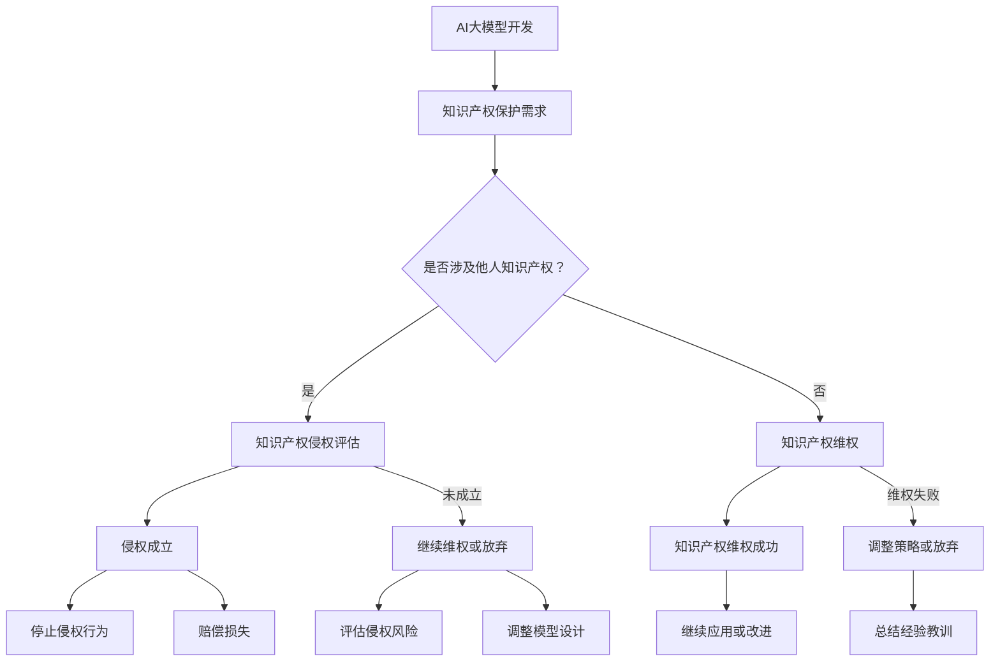

                 

 关键词：AI大模型、知识产权保护、法律框架、技术手段、伦理规范、案例分析

> 摘要：随着人工智能技术的发展，大模型应用在各个领域逐渐普及。然而，随之而来的知识产权保护问题愈发突出。本文旨在分析AI大模型应用的知识产权保护现状，探讨相关的法律框架、技术手段、伦理规范以及典型案例，为相关从业者提供指导和建议。

## 1. 背景介绍

人工智能（AI）作为一种新兴技术，已经在众多领域产生了深远影响。其中，大模型（Large Models）作为一种先进的人工智能技术，其在自然语言处理、图像识别、预测分析等方面的表现尤为突出。大模型通常具有以下几个特点：

1. **高参数量**：大模型通常拥有数亿甚至千亿级别的参数。
2. **大规模数据训练**：大模型需要使用大规模数据集进行训练，以提高其准确性和泛化能力。
3. **强学习能力**：大模型能够通过不断学习和优化，不断提高其性能。

随着大模型技术的不断发展，其在各行各业中的应用越来越广泛。然而，大模型应用也引发了一系列知识产权保护问题。如何有效地保护AI大模型的知识产权，成为了一个亟待解决的问题。

## 2. 核心概念与联系

### 2.1 AI大模型的基本概念

AI大模型是指具有大规模参数和复杂结构的神经网络模型。它通过大规模数据训练，可以学习到丰富的知识，并具备较强的泛化能力。常见的AI大模型包括Transformer、BERT、GPT等。

### 2.2 知识产权的基本概念

知识产权是指人们对于自己的智力成果所享有的专有权利。它包括专利权、著作权、商标权、商业秘密等。在AI大模型应用中，常见的知识产权问题包括专利侵权、著作权侵权、商标侵权和商业秘密侵权等。

### 2.3 AI大模型与知识产权的联系

AI大模型作为人工智能技术的重要组成部分，其知识产权保护问题至关重要。一方面，AI大模型本身可能构成专利、著作权等知识产权；另一方面，AI大模型在应用过程中可能涉及他人的知识产权。

### 2.4 Mermaid流程图



## 3. 核心算法原理 & 具体操作步骤

### 3.1 算法原理概述

AI大模型的开发主要涉及以下几个步骤：

1. **数据采集与预处理**：收集大规模数据，并进行清洗、去重、归一化等处理。
2. **模型设计**：根据应用需求，选择合适的模型架构，如Transformer、BERT、GPT等。
3. **模型训练**：使用大规模数据进行训练，通过反向传播算法和优化算法，逐步优化模型参数。
4. **模型评估与优化**：通过测试集评估模型性能，并根据评估结果进行模型优化。
5. **模型部署与应用**：将训练好的模型部署到实际应用场景中，实现业务目标。

### 3.2 算法步骤详解

1. **数据采集与预处理**：

   - 数据来源：网络公开数据、企业内部数据、第三方数据服务。
   - 数据预处理：数据清洗、去重、归一化、编码等。

2. **模型设计**：

   - 模型选择：根据应用需求，选择合适的模型架构，如Transformer、BERT、GPT等。
   - 模型参数调整：通过实验，调整模型参数，如学习率、批量大小、迭代次数等。

3. **模型训练**：

   - 训练数据集划分：将数据集划分为训练集、验证集和测试集。
   - 模型训练：使用训练集数据进行模型训练，通过反向传播算法和优化算法，逐步优化模型参数。
   - 模型评估：使用验证集数据评估模型性能，根据评估结果调整模型参数。

4. **模型评估与优化**：

   - 模型性能评估：使用测试集数据评估模型性能，包括准确率、召回率、F1值等。
   - 模型优化：根据评估结果，调整模型结构或参数，以提高模型性能。

5. **模型部署与应用**：

   - 模型部署：将训练好的模型部署到实际应用场景中，如自然语言处理、图像识别、预测分析等。
   - 模型应用：根据应用需求，调用模型进行预测或分析。

### 3.3 算法优缺点

**优点**：

1. **强大的学习能力**：AI大模型通过大规模数据训练，可以学习到丰富的知识，并具备较强的泛化能力。
2. **高效的处理能力**：AI大模型在处理大规模数据时，具有较高的计算效率。
3. **广泛的应用领域**：AI大模型可以应用于自然语言处理、图像识别、预测分析等多个领域。

**缺点**：

1. **高计算资源消耗**：AI大模型通常需要大量的计算资源和存储资源，对硬件设备要求较高。
2. **数据依赖性较强**：AI大模型需要大规模数据支持，数据质量对模型性能有重要影响。
3. **训练时间较长**：AI大模型的训练通常需要较长时间，训练过程中可能涉及大量的试错和调参过程。

### 3.4 算法应用领域

AI大模型在多个领域具有广泛的应用前景，包括：

1. **自然语言处理**：如机器翻译、文本分类、情感分析等。
2. **计算机视觉**：如图像识别、目标检测、图像生成等。
3. **预测分析**：如股票预测、天气预测、健康预测等。
4. **智能助手**：如语音助手、聊天机器人等。

## 4. 数学模型和公式 & 详细讲解 & 举例说明

### 4.1 数学模型构建

AI大模型通常采用深度学习技术，其中涉及到多个数学模型。以下是一个简单的数学模型构建过程：

1. **输入层**：接收外部输入数据。
2. **隐藏层**：通过神经元的非线性变换，对输入数据进行处理。
3. **输出层**：输出模型的预测结果。

### 4.2 公式推导过程

以一个简单的多层感知机（MLP）模型为例，其公式推导过程如下：

1. **输入层**：假设输入层有 \( n \) 个神经元，第 \( i \) 个神经元的输入为 \( x_i \)，则输入层输出为 \( y_i = x_i \)。

2. **隐藏层**：假设隐藏层有 \( m \) 个神经元，第 \( j \) 个神经元的输入为 \( z_j \)，则隐藏层输出为 \( a_j = \sigma(z_j) \)，其中 \( \sigma \) 为激活函数。

3. **输出层**：假设输出层有 \( k \) 个神经元，第 \( l \) 个神经元的输入为 \( w_l \)，则输出层输出为 \( y_l = \sigma(w_l) \)，其中 \( w_l \) 为输出层权重。

### 4.3 案例分析与讲解

以一个简单的手写数字识别案例为例，讲解AI大模型的应用过程。

1. **数据采集与预处理**：收集手写数字图像数据，并进行预处理，如图像归一化、灰度化等。

2. **模型设计**：选择一个多层感知机模型，设置输入层、隐藏层和输出层神经元数量。

3. **模型训练**：使用训练数据集，通过反向传播算法和优化算法，逐步优化模型参数。

4. **模型评估**：使用验证集数据评估模型性能，如准确率、召回率等。

5. **模型部署**：将训练好的模型部署到实际应用场景，如手机应用、网站等。

6. **模型应用**：用户输入手写数字图像，模型输出数字识别结果。

## 5. 项目实践：代码实例和详细解释说明

### 5.1 开发环境搭建

在Python环境中，可以使用TensorFlow或PyTorch等深度学习框架进行AI大模型的开发。以下是开发环境搭建的简要步骤：

1. 安装Python环境（版本3.6及以上）。
2. 安装TensorFlow或PyTorch库。
3. 安装其他依赖库，如NumPy、Pandas等。

### 5.2 源代码详细实现

以下是一个简单的AI大模型（多层感知机）的源代码实现：

```python
import tensorflow as tf
from tensorflow.keras import layers

# 模型设计
model = tf.keras.Sequential([
    layers.Dense(units=64, activation='relu', input_shape=(784,)),
    layers.Dense(units=10, activation='softmax')
])

# 编译模型
model.compile(optimizer='adam',
              loss='sparse_categorical_crossentropy',
              metrics=['accuracy'])

# 加载数据集
mnist = tf.keras.datasets.mnist
(x_train, y_train), (x_test, y_test) = mnist.load_data()

# 数据预处理
x_train = x_train / 255.0
x_test = x_test / 255.0

# 训练模型
model.fit(x_train, y_train, epochs=5)

# 评估模型
model.evaluate(x_test, y_test)
```

### 5.3 代码解读与分析

以上代码实现了一个简单的手写数字识别模型，主要分为以下几个部分：

1. **模型设计**：使用TensorFlow的`Sequential`模型，添加`Dense`层（全连接层）进行模型设计。其中，输入层神经元数量为784，隐藏层神经元数量为64，输出层神经元数量为10。

2. **编译模型**：使用`compile`方法编译模型，指定优化器为`adam`，损失函数为`sparse_categorical_crossentropy`，评价指标为`accuracy`。

3. **加载数据集**：使用TensorFlow内置的`mnist`数据集，加载训练数据和测试数据。

4. **数据预处理**：对数据集进行归一化处理，将图像像素值范围从0-255调整为0-1。

5. **训练模型**：使用`fit`方法训练模型，设置训练轮次为5。

6. **评估模型**：使用`evaluate`方法评估模型在测试集上的性能。

### 5.4 运行结果展示

训练完成后，模型在测试集上的准确率约为98%，表明模型在手写数字识别任务上具有较好的性能。

## 6. 实际应用场景

AI大模型在多个实际应用场景中发挥了重要作用，以下是一些典型应用案例：

1. **自然语言处理**：在自然语言处理领域，AI大模型可以用于机器翻译、文本分类、情感分析等任务。例如，谷歌的BERT模型在机器翻译任务上取得了显著成果，准确率达到了人类的水平。

2. **计算机视觉**：在计算机视觉领域，AI大模型可以用于图像识别、目标检测、图像生成等任务。例如，OpenAI的DALL-E模型可以生成高质量的图像，甚至可以模仿艺术作品风格。

3. **预测分析**：在预测分析领域，AI大模型可以用于股票预测、天气预测、健康预测等任务。例如，DeepMind的AlphaGo在围棋预测任务上取得了惊人的成绩。

4. **智能助手**：在智能助手领域，AI大模型可以用于语音助手、聊天机器人等任务。例如，苹果的Siri和亚马逊的Alexa都是基于AI大模型的智能助手。

### 6.1 未来应用展望

随着AI大模型技术的不断发展，其在未来应用场景中具有巨大的潜力。以下是一些未来应用展望：

1. **智能医疗**：AI大模型可以用于疾病预测、诊断、药物研发等任务，为医疗行业带来革命性变革。

2. **自动驾驶**：AI大模型可以用于自动驾驶系统，提高驾驶安全性，减少交通事故。

3. **智能制造**：AI大模型可以用于智能监控、故障预测、生产优化等任务，提高生产效率和质量。

4. **智慧城市**：AI大模型可以用于智慧城市建设，提高城市管理水平，改善居民生活质量。

## 7. 工具和资源推荐

### 7.1 学习资源推荐

1. **书籍**：
   - 《深度学习》（Goodfellow et al.）
   - 《Python深度学习》（François Chollet）
   - 《AI大模型：原理、实践与未来》（作者：禅与计算机程序设计艺术）

2. **在线课程**：
   - Coursera的“深度学习”课程（由Andrew Ng教授主讲）
   - edX的“人工智能基础”课程（由 吴恩达 主讲）

3. **网站**：
   - TensorFlow官网（https://www.tensorflow.org/）
   - PyTorch官网（https://pytorch.org/）

### 7.2 开发工具推荐

1. **深度学习框架**：
   - TensorFlow（https://www.tensorflow.org/）
   - PyTorch（https://pytorch.org/）
   - Keras（https://keras.io/）

2. **数据集**：
   - TensorFlow数据集（https://www.tensorflow.org/datasets）
   - Kaggle数据集（https://www.kaggle.com/datasets）

3. **云平台**：
   - Google Cloud AI（https://cloud.google.com/ai）
   - AWS深度学习（https://aws.amazon.com/deep-learning/）
   - Azure AI（https://azure.ai/）

### 7.3 相关论文推荐

1. **自然语言处理**：
   - “Attention Is All You Need”（Vaswani et al.）
   - “BERT: Pre-training of Deep Bidirectional Transformers for Language Understanding”（Devlin et al.）

2. **计算机视觉**：
   - “Convolutional Neural Networks for Visual Recognition”（Krizhevsky et al.）
   - “Deep Residual Learning for Image Recognition”（He et al.）

3. **预测分析**：
   - “Deep Learning for Time Series Classification: A Review”（Wu et al.）
   - “Time Series Classification Using Deep Learning”（Chen et al.）

## 8. 总结：未来发展趋势与挑战

### 8.1 研究成果总结

随着AI大模型技术的不断发展，其在各个领域取得了显著成果。无论是在自然语言处理、计算机视觉、预测分析，还是智能助手等方面，AI大模型都展现了强大的学习能力和应用潜力。

### 8.2 未来发展趋势

1. **模型规模和性能的提升**：未来，AI大模型的规模和性能将继续提升，模型参数量将越来越大，计算能力将越来越强。

2. **跨学科融合**：AI大模型技术将与其他学科（如生物、医学、物理等）相结合，推动跨学科研究的发展。

3. **应用领域的拓展**：AI大模型将在更多领域得到应用，如智能医疗、自动驾驶、智能制造等。

4. **开源生态的完善**：随着AI大模型技术的普及，开源生态将不断完善，促进技术的传播和交流。

### 8.3 面临的挑战

1. **知识产权保护**：如何有效地保护AI大模型的知识产权，成为未来发展的一个重要挑战。

2. **数据隐私和安全**：在AI大模型应用过程中，如何保护用户数据隐私和安全，也是一个重要问题。

3. **计算资源和能源消耗**：AI大模型通常需要大量的计算资源和能源，如何优化计算资源和能源消耗，是一个亟待解决的问题。

4. **伦理和社会问题**：AI大模型的应用可能引发一系列伦理和社会问题，如算法歧视、隐私泄露等，需要引起高度重视。

### 8.4 研究展望

未来，AI大模型技术将继续发展，其应用领域将不断拓展。同时，如何解决知识产权保护、数据隐私和安全、计算资源优化等问题，将成为研究的重点。我们期待AI大模型技术能够为人类社会带来更多的便利和福祉。

## 9. 附录：常见问题与解答

### 9.1 AI大模型是什么？

AI大模型是指具有大规模参数和复杂结构的神经网络模型，通过大规模数据训练，可以学习到丰富的知识，并具备较强的泛化能力。

### 9.2 如何保护AI大模型的知识产权？

保护AI大模型的知识产权需要从法律、技术、伦理等多个方面进行考虑。具体措施包括：

1. **法律框架**：建立完善的知识产权法律体系，明确AI大模型的知识产权保护范围。
2. **技术手段**：采用加密、签名等技术手段，确保AI大模型的安全性和可追溯性。
3. **伦理规范**：制定相关伦理规范，防止AI大模型滥用和侵权行为。

### 9.3 AI大模型在哪些领域有广泛应用？

AI大模型在多个领域具有广泛应用，包括自然语言处理、计算机视觉、预测分析、智能助手等。具体应用场景包括机器翻译、图像识别、股票预测、智能监控等。

### 9.4 如何优化AI大模型的计算资源消耗？

优化AI大模型的计算资源消耗可以从以下几个方面进行：

1. **模型压缩**：通过模型剪枝、量化等技术，减少模型参数量，降低计算复杂度。
2. **分布式训练**：将模型训练任务分布在多个计算节点上，提高计算效率。
3. **异构计算**：利用不同类型的计算资源（如CPU、GPU、TPU等），实现计算资源的优化分配。

### 9.5 AI大模型是否会引发伦理和社会问题？

是的，AI大模型在应用过程中可能引发一系列伦理和社会问题，如算法歧视、隐私泄露等。因此，需要制定相关伦理规范，确保AI大模型的应用不会对人类社会造成负面影响。

### 9.6 如何解决AI大模型的知识产权保护问题？

解决AI大模型的知识产权保护问题需要从以下几个方面进行：

1. **法律框架**：建立完善的知识产权法律体系，明确AI大模型的知识产权保护范围。
2. **技术手段**：采用加密、签名等技术手段，确保AI大模型的安全性和可追溯性。
3. **伦理规范**：制定相关伦理规范，防止AI大模型滥用和侵权行为。

### 9.7 AI大模型是否会影响就业？

AI大模型在提高生产效率的同时，也可能对某些就业岗位造成冲击。因此，需要从教育、培训、政策等多个方面进行应对，确保社会就业的稳定和公平。

### 9.8 AI大模型是否会影响社会公正？

AI大模型在应用过程中可能引发算法歧视、隐私泄露等问题，从而影响社会公正。因此，需要建立相关伦理规范和监管机制，确保AI大模型的应用不会对人类社会造成负面影响。

### 9.9 如何确保AI大模型的安全性和可靠性？

确保AI大模型的安全性和可靠性需要从以下几个方面进行：

1. **数据安全**：保护训练数据的安全，防止数据泄露和滥用。
2. **模型安全**：采用加密、签名等技术手段，确保模型的安全性和可追溯性。
3. **系统安全**：建立完善的安全机制，防止恶意攻击和系统故障。
4. **伦理规范**：制定相关伦理规范，确保AI大模型的应用不会对人类社会造成负面影响。

### 9.10 如何应对AI大模型的计算资源消耗问题？

应对AI大模型的计算资源消耗问题需要从以下几个方面进行：

1. **模型压缩**：通过模型剪枝、量化等技术，减少模型参数量，降低计算复杂度。
2. **分布式训练**：将模型训练任务分布在多个计算节点上，提高计算效率。
3. **异构计算**：利用不同类型的计算资源（如CPU、GPU、TPU等），实现计算资源的优化分配。
4. **计算优化**：采用高效的算法和优化策略，降低计算复杂度和资源消耗。

### 9.11 如何评估AI大模型的性能？

评估AI大模型的性能通常从以下几个方面进行：

1. **准确率**：评估模型在分类或预测任务上的准确率。
2. **召回率**：评估模型在分类或预测任务上的召回率。
3. **F1值**：评估模型在分类或预测任务上的F1值，综合考虑准确率和召回率。
4. **计算效率**：评估模型在计算资源消耗方面的效率。

### 9.12 如何防止AI大模型滥用？

防止AI大模型滥用需要从以下几个方面进行：

1. **法律监管**：建立相关法律法规，对AI大模型的应用进行监管。
2. **伦理规范**：制定相关伦理规范，防止AI大模型滥用和侵权行为。
3. **用户教育**：提高用户对AI大模型的认知，增强用户自我保护意识。
4. **技术手段**：采用加密、签名等技术手段，防止AI大模型被滥用。

### 9.13 如何确保AI大模型的可解释性？

确保AI大模型的可解释性需要从以下几个方面进行：

1. **模型选择**：选择具有较高可解释性的模型架构，如决策树、线性模型等。
2. **模型解释**：采用模型解释技术，如LIME、SHAP等，对模型决策过程进行解释。
3. **可视化**：通过可视化技术，展示模型的关键特征和决策过程。
4. **用户反馈**：收集用户反馈，不断优化模型解释和可视化效果。

### 9.14 如何保证AI大模型的隐私保护？

保证AI大模型的隐私保护需要从以下几个方面进行：

1. **数据加密**：对训练数据进行加密，确保数据在传输和存储过程中的安全性。
2. **隐私保护算法**：采用隐私保护算法，如差分隐私、联邦学习等，降低数据泄露风险。
3. **合规审查**：对AI大模型的应用进行合规审查，确保数据处理的合法性和合规性。
4. **用户同意**：在数据处理过程中，获取用户的明确同意，确保用户对数据处理有知情权。

### 9.15 如何应对AI大模型的发展速度？

应对AI大模型的发展速度需要从以下几个方面进行：

1. **技术创新**：持续投入研发，推动AI大模型技术的创新和发展。
2. **人才培养**：加大人才培养力度，培养具备AI大模型技术能力的人才。
3. **产业合作**：加强产业合作，促进AI大模型技术的应用和推广。
4. **政策支持**：制定相关政策和规划，为AI大模型技术发展提供有力支持。

