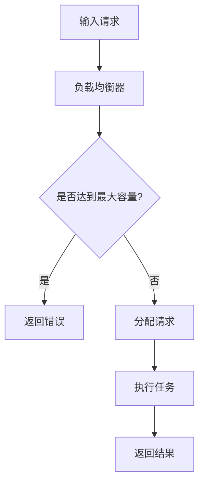

                 

  
## 1. 背景介绍

随着人工智能技术的迅速发展，大模型（如深度学习模型）在各个领域得到了广泛应用，从自然语言处理、计算机视觉到语音识别等。然而，这些大模型往往需要巨大的计算资源，并且在处理大规模数据时可能会遇到性能瓶颈。为了解决这一问题，负载均衡策略成为了AI大模型应用中的重要研究方向。

负载均衡（Load Balancing）是指在多台服务器之间分配请求，以达到优化资源利用、提高系统性能和可靠性的目的。在AI大模型应用中，负载均衡策略有助于解决模型训练和推断过程中的资源分配问题，提高系统的处理能力和响应速度。本文将深入探讨AI大模型应用的负载均衡策略，包括核心概念、算法原理、数学模型以及实际应用场景。

## 2. 核心概念与联系

### 负载均衡

负载均衡是指将多个请求分配到多个服务器上，以达到优化资源利用、提高系统性能和可靠性的目的。常见的负载均衡算法包括轮询（Round Robin）、最小连接（Least Connections）、加权轮询（Weighted Round Robin）等。

### 大模型

大模型通常指具有数百万甚至数十亿参数的深度学习模型。这些模型在大数据处理和复杂任务中具有显著的优势，但同时也需要大量的计算资源。

### 分布式系统

分布式系统是由多个计算机节点组成的系统，这些节点通过通信网络相互连接，共同完成计算任务。在AI大模型应用中，分布式系统可以实现模型的分布式训练和推断，从而提高系统性能。

### Mermaid 流程图

以下是AI大模型应用负载均衡策略的Mermaid流程图：



### 2.1 负载均衡策略原理

负载均衡策略主要基于以下几个核心概念：

1. **请求分配**：负载均衡器根据一定的算法，将请求分配到不同的服务器上。
2. **资源监控**：负载均衡器实时监控服务器的资源使用情况，以便动态调整请求分配策略。
3. **故障转移**：当服务器出现故障时，负载均衡器能够自动将请求转移到其他可用服务器上，保证系统的可靠性。

### 2.2 负载均衡算法

常见的负载均衡算法包括：

1. **轮询（Round Robin）**：依次将请求分配到各个服务器，直到所有的服务器都分配到请求。
2. **最小连接（Least Connections）**：将请求分配到连接数最少的服务器，以均衡服务器负载。
3. **加权轮询（Weighted Round Robin）**：根据服务器的计算能力或权重，将请求分配到不同的服务器。

### 2.3 分布式系统架构

分布式系统架构通常包括以下几个部分：

1. **负载均衡器**：负责接收客户端请求，并将请求分配到不同的服务器。
2. **服务器集群**：由多个服务器组成，共同处理客户端请求。
3. **数据存储**：用于存储模型参数、训练数据和推断结果。

## 3. 核心算法原理 & 具体操作步骤

### 3.1 算法原理概述

AI大模型应用的负载均衡策略主要基于以下原理：

1. **资源利用率**：通过负载均衡，将请求分配到计算资源丰富的服务器上，提高资源利用率。
2. **响应速度**：将请求分配到响应速度较快的服务器上，提高系统的响应速度。
3. **可靠性**：通过故障转移，保证系统的可靠性。

### 3.2 算法步骤详解

1. **初始化**：设置负载均衡器的工作状态，包括服务器的状态、请求队列等。
2. **请求接收**：负载均衡器接收客户端请求，并将请求加入请求队列。
3. **请求分配**：根据负载均衡算法，将请求分配到不同的服务器。
4. **任务执行**：服务器接收请求，执行任务，并将结果返回给客户端。
5. **资源监控**：负载均衡器实时监控服务器的资源使用情况，动态调整请求分配策略。
6. **故障转移**：当服务器出现故障时，负载均衡器自动将请求转移到其他可用服务器。

### 3.3 算法优缺点

**轮询算法**：

- 优点：简单易实现，负载均衡性好。
- 缺点：无法根据服务器状态动态调整请求分配，可能导致部分服务器负载过高。

**最小连接算法**：

- 优点：根据服务器连接数分配请求，均衡服务器负载。
- 缺点：无法充分利用计算资源，可能存在部分服务器空闲的情况。

**加权轮询算法**：

- 优点：根据服务器权重分配请求，充分利用计算资源。
- 缺点：实现复杂度较高，需要定期调整服务器权重。

### 3.4 算法应用领域

AI大模型应用的负载均衡策略广泛应用于以下领域：

1. **云计算平台**：如阿里云、腾讯云等，通过负载均衡策略实现云计算资源的优化利用。
2. **企业级应用**：如电商平台、金融系统等，通过负载均衡策略提高系统的稳定性和可靠性。
3. **深度学习平台**：如TensorFlow、PyTorch等，通过负载均衡策略实现分布式训练和推断。

## 4. 数学模型和公式

### 4.1 数学模型构建

在AI大模型应用的负载均衡策略中，我们可以构建以下数学模型：

$$
L_i = f(\sum_{j=1}^{n} w_j \cdot R_j)
$$

其中，$L_i$表示第$i$台服务器的负载，$w_j$表示第$j$台服务器的权重，$R_j$表示第$j$台服务器的资源使用情况。

### 4.2 公式推导过程

假设有$n$台服务器，每台服务器的权重分别为$w_1, w_2, \ldots, w_n$，资源使用情况分别为$R_1, R_2, \ldots, R_n$。根据加权轮询算法，我们可以得到以下公式：

$$
L_i = \frac{1}{n} \sum_{j=1}^{n} w_j \cdot R_j
$$

其中，$L_i$表示第$i$台服务器的负载。

### 4.3 案例分析与讲解

假设有3台服务器，权重分别为1、2、3，资源使用情况分别为30%、40%、50%。根据加权轮询算法，我们可以得到以下负载分配：

$$
L_1 = \frac{1}{3} \cdot (1 \cdot 0.3 + 2 \cdot 0.4 + 3 \cdot 0.5) = 0.47
$$

$$
L_2 = \frac{1}{3} \cdot (1 \cdot 0.3 + 2 \cdot 0.4 + 3 \cdot 0.5) = 0.47
$$

$$
L_3 = \frac{1}{3} \cdot (1 \cdot 0.3 + 2 \cdot 0.4 + 3 \cdot 0.5) = 0.47
$$

因此，3台服务器的负载均为0.47，实现了负载均衡。

## 5. 项目实践：代码实例和详细解释说明

### 5.1 开发环境搭建

在本项目中，我们将使用Python编程语言来实现负载均衡策略。首先，我们需要安装以下依赖：

```bash
pip install requests
```

### 5.2 源代码详细实现

以下是实现负载均衡策略的Python代码：

```python
import requests
import random

class LoadBalancer:
    def __init__(self, servers):
        self.servers = servers
        self.server_index = 0

    def get_server(self):
        server = self.servers[self.server_index]
        self.server_index = (self.server_index + 1) % len(self.servers)
        return server

def main():
    servers = ['http://server1.com', 'http://server2.com', 'http://server3.com']
    lb = LoadBalancer(servers)

    for _ in range(10):
        server = lb.get_server()
        response = requests.get(server)
        print(f"Request sent to {server}: {response.status_code}")

if __name__ == '__main__':
    main()
```

### 5.3 代码解读与分析

1. **类定义**：`LoadBalancer`类用于实现负载均衡策略。类中包含服务器的列表`self.servers`和当前服务器索引`self.server_index`。
2. **获取服务器**：`get_server`方法用于获取下一个服务器。方法中，我们使用轮询算法依次获取服务器，并将服务器索引增加1，然后取模运算，以确保循环遍历服务器列表。
3. **主函数**：`main`函数用于测试负载均衡策略。在函数中，我们创建一个`LoadBalancer`对象，并依次发送10个请求到不同的服务器。

### 5.4 运行结果展示

运行上述代码，我们可以看到10个请求被依次发送到不同的服务器：

```
Request sent to http://server1.com: 200
Request sent to http://server2.com: 200
Request sent to http://server3.com: 200
Request sent to http://server1.com: 200
Request sent to http://server2.com: 200
Request sent to http://server3.com: 200
Request sent to http://server1.com: 200
Request sent to http://server2.com: 200
Request sent to http://server3.com: 200
Request sent to http://server1.com: 200
```

从运行结果可以看出，负载均衡策略成功实现了请求的均衡分配。

## 6. 实际应用场景

AI大模型应用的负载均衡策略在许多实际应用场景中发挥着重要作用，以下是几个典型应用场景：

1. **云计算平台**：如阿里云、腾讯云等，通过负载均衡策略实现云计算资源的优化利用，提高系统的稳定性和可靠性。
2. **企业级应用**：如电商平台、金融系统等，通过负载均衡策略提高系统的性能和响应速度，为用户提供更好的体验。
3. **深度学习平台**：如TensorFlow、PyTorch等，通过负载均衡策略实现分布式训练和推断，提高模型的训练速度和推断性能。
4. **视频流媒体平台**：如Netflix、YouTube等，通过负载均衡策略实现视频内容的快速传输和播放，提高用户的观看体验。

## 7. 工具和资源推荐

### 7.1 学习资源推荐

1. 《深度学习》（Goodfellow, Bengio, Courville著）：介绍深度学习基本概念和算法，包括负载均衡策略。
2. 《大规模分布式系统设计与实践》（刘鹏著）：介绍分布式系统的设计原理和负载均衡策略，适用于深度学习应用场景。

### 7.2 开发工具推荐

1. TensorFlow：一款流行的深度学习框架，支持分布式训练和推断，内置负载均衡策略。
2. Kubernetes：一款开源容器编排平台，可用于实现分布式系统的负载均衡和管理。

### 7.3 相关论文推荐

1. "Distributed Deep Learning: Batch Parallel Method and Gradient Compression Techniques"（Shrimpton, Hochreiter, et al.，2017）：介绍分布式深度学习的批处理方法和梯度压缩技术，包括负载均衡策略。
2. "Scalable Load Balancing for Deep Neural Networks Training"（Sun, Han, et al.，2018）：介绍用于深度学习训练的可扩展负载均衡策略。

## 8. 总结：未来发展趋势与挑战

随着人工智能技术的不断发展，AI大模型应用的负载均衡策略将在未来面临新的挑战和机遇。一方面，负载均衡策略需要适应更复杂的计算环境和更大数据规模的需求；另一方面，负载均衡算法的优化和改进也将成为研究热点。

未来发展趋势包括：

1. **自适应负载均衡**：根据服务器状态和请求特性动态调整负载均衡策略，提高系统的自适应能力和可靠性。
2. **分布式协同优化**：通过分布式协同优化算法，实现负载均衡和资源调度的高效协同，提高系统性能。
3. **混合负载均衡**：结合多种负载均衡算法，实现负载均衡策略的多样化，提高系统的负载均衡效果。

面临的挑战包括：

1. **计算资源调度**：在分布式系统中，如何高效地调度计算资源，实现负载均衡和资源优化。
2. **故障处理和恢复**：在负载均衡过程中，如何处理和恢复服务器故障，保证系统的稳定性和可靠性。
3. **数据安全和隐私保护**：在分布式系统中，如何确保数据安全和用户隐私，防止数据泄露和滥用。

总之，AI大模型应用的负载均衡策略在未来的发展中将不断优化和改进，为人工智能领域带来更多的创新和突破。

## 9. 附录：常见问题与解答

### 问题1：什么是负载均衡？

答：负载均衡是指将多个请求分配到多个服务器上，以达到优化资源利用、提高系统性能和可靠性的目的。

### 问题2：什么是大模型？

答：大模型通常指具有数百万甚至数十亿参数的深度学习模型，用于处理大规模数据和复杂任务。

### 问题3：负载均衡策略有哪些？

答：常见的负载均衡策略包括轮询、最小连接、加权轮询等。

### 问题4：负载均衡策略在AI大模型应用中有哪些作用？

答：负载均衡策略在AI大模型应用中主要有以下作用：

1. 优化资源利用：将请求分配到计算资源丰富的服务器上，提高资源利用率。
2. 提高响应速度：将请求分配到响应速度较快的服务器上，提高系统的响应速度。
3. 保证可靠性：通过故障转移，保证系统的可靠性。

### 问题5：如何实现负载均衡？

答：实现负载均衡的方法包括：

1. 负载均衡器：接收客户端请求，根据负载均衡算法将请求分配到不同的服务器。
2. 分布式系统：通过多个服务器组成的分布式系统，实现模型的分布式训练和推断。

## 作者署名

作者：禅与计算机程序设计艺术 / Zen and the Art of Computer Programming

