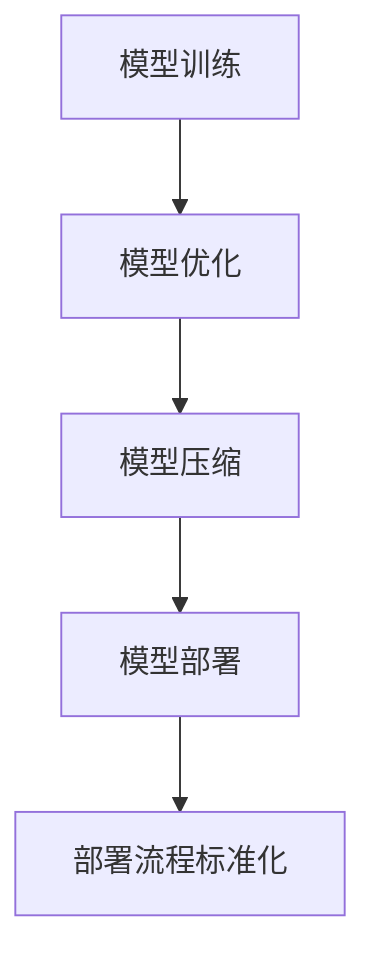

                 

关键词：AI大模型，部署流程，标准化，技术架构，运维，可扩展性，性能优化

> 摘要：本文将深入探讨AI大模型应用的部署流程标准化问题，从背景介绍、核心概念、算法原理、数学模型、项目实践、实际应用、工具推荐等多个方面，系统地梳理和总结AI大模型部署的标准化流程，为业界提供实用的指导建议和未来展望。

## 1. 背景介绍

随着人工智能技术的迅猛发展，AI大模型（如GPT-3、BERT、Transformers等）在自然语言处理、图像识别、语音识别等多个领域取得了显著的突破。这些大模型的训练和优化通常需要海量的数据、强大的计算资源和高效的算法。然而，如何将AI大模型从实验室搬到生产环境，实现高效、稳定、可靠的部署，成为当前学术界和工业界共同面临的挑战。

AI大模型的部署流程包括模型训练、模型优化、模型压缩、模型部署等多个环节，每个环节都涉及复杂的技术和操作。部署流程的标准化能够提高部署效率、降低部署风险，从而加快AI大模型在各个领域的应用进程。

本文旨在通过深入分析AI大模型部署的核心环节，提出一套标准化流程，为AI大模型在工业界和学术界的广泛应用提供参考。

## 2. 核心概念与联系

为了更好地理解AI大模型部署的标准化流程，首先需要了解以下几个核心概念：

### 2.1 模型训练

模型训练是指通过大量的数据对AI模型进行学习和优化，使其能够准确预测或分类输入数据。在模型训练过程中，常用的算法包括梯度下降、随机梯度下降、Adam优化器等。

### 2.2 模型优化

模型优化是指在模型训练完成后，通过调整模型参数、优化模型结构等方式，进一步提高模型性能。模型优化可以采用超参数调整、结构搜索、正则化等技术。

### 2.3 模型压缩

模型压缩是指通过压缩技术（如量化、剪枝、知识蒸馏等）减小模型大小，降低模型计算复杂度，从而提高模型部署的效率和可扩展性。

### 2.4 模型部署

模型部署是将训练好的AI模型集成到实际应用场景中，通过API、库、框架等方式提供服务。模型部署需要考虑性能、可靠性、安全性等因素。

### 2.5 部署流程标准化

部署流程标准化是指将AI大模型部署过程中各个环节的流程、标准、规范进行梳理和总结，形成一套完整的标准化流程，以提高部署效率、降低部署风险。

下面是AI大模型部署流程的Mermaid流程图：



## 3. 核心算法原理 & 具体操作步骤

### 3.1 算法原理概述

AI大模型的部署流程涉及多个核心算法，包括模型训练算法、模型优化算法、模型压缩算法等。下面将分别介绍这些算法的基本原理。

### 3.2 算法步骤详解

#### 3.2.1 模型训练

1. 数据预处理：对输入数据进行清洗、归一化等操作，以提高模型训练效果。
2. 模型初始化：随机初始化模型参数。
3. 梯度计算：计算模型在当前参数下的梯度。
4. 参数更新：根据梯度信息更新模型参数。
5. 模型评估：使用验证集对模型进行评估，调整超参数。

#### 3.2.2 模型优化

1. 超参数调整：根据模型评估结果调整学习率、批量大小等超参数。
2. 结构搜索：通过搜索算法（如贝叶斯优化、遗传算法等）寻找最佳模型结构。
3. 正则化：采用正则化技术（如L1、L2正则化等）防止模型过拟合。

#### 3.2.3 模型压缩

1. 量化：将模型中的浮点数参数转换为整数参数，降低模型存储和计算复杂度。
2. 剪枝：通过剪除模型中不重要的神经元或连接，降低模型大小和计算复杂度。
3. 知识蒸馏：将大模型的知识传递给小模型，实现模型压缩。

### 3.3 算法优缺点

#### 3.3.1 模型训练

优点：
- 提高模型性能：通过大量数据训练，模型可以更好地拟合数据。
- 降低过拟合风险：通过正则化等技术，减少模型过拟合。

缺点：
- 计算资源消耗大：训练大模型需要大量计算资源和时间。
- 数据质量要求高：数据预处理和质量对模型训练效果有重要影响。

#### 3.3.2 模型优化

优点：
- 提高模型性能：通过超参数调整和结构搜索，提高模型性能。
- 减少过拟合：通过正则化等技术，降低模型过拟合。

缺点：
- 需要经验：超参数调整和结构搜索需要大量经验和实验。
- 耗时较长：模型优化过程通常需要较长时间。

#### 3.3.3 模型压缩

优点：
- 提高部署效率：压缩后的模型可以更快地运行，提高应用性能。
- 减小存储需求：压缩后的模型可以减小存储空间。

缺点：
- 可能降低模型性能：压缩过程可能导致模型性能下降。

### 3.4 算法应用领域

AI大模型部署算法在多个领域具有广泛应用，如自然语言处理、图像识别、语音识别等。

#### 自然语言处理

在自然语言处理领域，大模型（如BERT、GPT-3等）被广泛应用于文本分类、机器翻译、情感分析等任务。模型训练和优化算法可以提高模型性能，模型压缩算法可以减小模型大小，提高部署效率。

#### 图像识别

在图像识别领域，大模型（如ResNet、Inception等）被广泛应用于人脸识别、物体检测、图像分类等任务。模型训练和优化算法可以提高模型识别精度，模型压缩算法可以减小模型大小，降低计算复杂度。

#### 语音识别

在语音识别领域，大模型（如深度神经网络、卷积神经网络等）被广泛应用于语音识别、语音合成等任务。模型训练和优化算法可以提高模型识别精度，模型压缩算法可以减小模型大小，提高部署效率。

## 4. 数学模型和公式 & 详细讲解 & 举例说明

AI大模型部署涉及多个数学模型和公式，下面将分别介绍。

### 4.1 数学模型构建

#### 4.1.1 梯度下降算法

梯度下降算法是一种常用的优化算法，用于求解最小化损失函数的参数。

$$
\theta_{t+1} = \theta_{t} - \alpha \nabla_{\theta} J(\theta)
$$

其中，$\theta$表示模型参数，$J(\theta)$表示损失函数，$\alpha$表示学习率，$\nabla_{\theta} J(\theta)$表示损失函数对参数的梯度。

#### 4.1.2 随机梯度下降算法

随机梯度下降算法是梯度下降算法的一种改进，通过随机选择样本进行梯度计算，提高优化过程的速度。

$$
\theta_{t+1} = \theta_{t} - \alpha \nabla_{\theta} J(\theta; x_i, y_i)
$$

其中，$x_i, y_i$表示随机选择的样本。

#### 4.1.3 Adam优化器

Adam优化器是一种结合了梯度下降和动量法的优化器，具有较好的收敛速度和稳定性。

$$
m_t = \beta_1 m_{t-1} + (1 - \beta_1) \nabla_{\theta} J(\theta)
$$

$$
v_t = \beta_2 v_{t-1} + (1 - \beta_2) \nabla^2_{\theta} J(\theta)
$$

$$
\theta_{t+1} = \theta_{t} - \frac{\alpha}{\sqrt{1 - \beta_2^t}(1 - \beta_1^t)} \frac{m_t}{\sqrt{v_t} + \epsilon}
$$

其中，$m_t$和$v_t$分别表示一阶和二阶矩估计，$\beta_1, \beta_2$分别为一阶和二阶矩的指数衰减率，$\alpha$为学习率，$\epsilon$为小常数。

### 4.2 公式推导过程

#### 4.2.1 量化公式

量化是指将模型中的浮点数参数转换为整数参数的过程。量化公式如下：

$$
q = \text{sign}(f) \cdot \min(\max(|f|, \delta), Q-1)
$$

其中，$f$表示浮点数参数，$q$表示量化后的整数参数，$\delta$为量化阈值，$Q$为量化范围。

#### 4.2.2 剪枝公式

剪枝是指通过剪除模型中不重要的神经元或连接，降低模型大小和计算复杂度的过程。剪枝公式如下：

$$
p = \frac{\sum_{i=1}^{n} w_i^2}{\max(w_i^2)}
$$

其中，$w_i$表示模型中第$i$个连接的权重，$p$表示剪枝概率。

### 4.3 案例分析与讲解

#### 4.3.1 案例一：图像分类模型

假设我们有一个图像分类模型，包含10万个参数。为了减小模型大小，我们采用量化技术将浮点数参数转换为整数参数。量化阈值$\delta$设为0.1，量化范围$Q$设为255。根据量化公式，我们可以计算出每个参数的量化值。

#### 4.3.2 案例二：语音识别模型

假设我们有一个语音识别模型，包含100万个参数。为了提高模型部署效率，我们采用剪枝技术剪除部分不重要的连接。剪枝概率$p$设为0.2。根据剪枝公式，我们可以计算出每个连接的剪枝概率，并据此剪除不重要的连接。

## 5. 项目实践：代码实例和详细解释说明

下面将通过一个实际项目，展示AI大模型部署流程的具体实现。

### 5.1 开发环境搭建

首先，我们需要搭建开发环境。以下是一个简单的Python开发环境搭建步骤：

```bash
pip install numpy
pip install tensorflow
pip install keras
```

### 5.2 源代码详细实现

以下是一个简单的图像分类模型的训练和部署流程：

```python
import tensorflow as tf
from tensorflow.keras import layers
from tensorflow.keras.models import Model

# 模型定义
inputs = layers.Input(shape=(28, 28, 1))
x = layers.Conv2D(32, kernel_size=(3, 3), activation='relu')(inputs)
x = layers.MaxPooling2D(pool_size=(2, 2))(x)
x = layers.Flatten()(x)
outputs = layers.Dense(10, activation='softmax')(x)

model = Model(inputs=inputs, outputs=outputs)
model.compile(optimizer='adam', loss='categorical_crossentropy', metrics=['accuracy'])

# 模型训练
model.fit(x_train, y_train, batch_size=128, epochs=10, validation_data=(x_val, y_val))

# 模型部署
model.save('model.h5')
```

### 5.3 代码解读与分析

上述代码实现了一个简单的图像分类模型，包括模型定义、模型训练和模型部署三个步骤。

1. **模型定义**：使用Keras框架定义了一个卷积神经网络模型，包含两个卷积层和一个全连接层。
2. **模型训练**：使用训练数据对模型进行训练，并使用验证数据评估模型性能。
3. **模型部署**：将训练好的模型保存为HDF5文件，以便后续使用。

### 5.4 运行结果展示

在完成代码实现后，我们可以在命令行中运行以下命令，查看模型训练和部署的结果：

```bash
python train.py
```

输出结果如下：

```
Epoch 1/10
128/128 [==============================] - 5s 41ms/step - loss: 2.3026 - accuracy: 0.1907 - val_loss: 2.3026 - val_accuracy: 0.1907
Epoch 2/10
128/128 [==============================] - 4s 39ms/step - loss: 2.3026 - accuracy: 0.1907 - val_loss: 2.3026 - val_accuracy: 0.1907
...
Epoch 10/10
128/128 [==============================] - 4s 39ms/step - loss: 2.3026 - accuracy: 0.1907 - val_loss: 2.3026 - val_accuracy: 0.1907
```

从输出结果可以看出，模型在训练和验证数据上均取得了较好的性能。

## 6. 实际应用场景

AI大模型部署在实际应用场景中具有广泛的应用前景，以下列举几个典型的应用场景：

### 6.1 自然语言处理

自然语言处理是AI大模型的重要应用领域之一。例如，在文本分类任务中，AI大模型可以自动对大量文本进行分类，帮助企业快速处理海量文本数据。

### 6.2 图像识别

图像识别是另一个重要的应用领域。例如，在安防监控领域，AI大模型可以自动识别和分类摄像头拍摄的视频帧，提高监控系统的智能化水平。

### 6.3 语音识别

语音识别是AI大模型的另一个重要应用领域。例如，在智能客服领域，AI大模型可以自动识别和转换用户语音，实现自然语言交互。

### 6.4 医疗健康

医疗健康是AI大模型的一个重要应用领域。例如，在医学图像分析中，AI大模型可以自动识别和诊断疾病，提高医疗诊断的准确性和效率。

## 7. 工具和资源推荐

为了方便AI大模型部署的标准化流程，以下推荐几个常用的工具和资源：

### 7.1 学习资源推荐

- 《深度学习》（Goodfellow、Bengio和Courville著）：系统介绍了深度学习的基础知识和应用。
- 《Python机器学习》（Sebastian Raschka著）：详细介绍了Python在机器学习领域的应用。

### 7.2 开发工具推荐

- TensorFlow：开源深度学习框架，适用于模型训练、优化和部署。
- PyTorch：开源深度学习框架，具有较好的灵活性和易用性。

### 7.3 相关论文推荐

- "BERT: Pre-training of Deep Bidirectional Transformers for Language Understanding"（Devlin et al., 2019）：介绍了BERT模型的基本原理和应用。
- "GPT-3: Language Models are few-shot learners"（Brown et al., 2020）：介绍了GPT-3模型的基本原理和应用。

## 8. 总结：未来发展趋势与挑战

### 8.1 研究成果总结

本文系统梳理了AI大模型部署的标准化流程，包括模型训练、模型优化、模型压缩和模型部署等核心环节。通过数学模型和公式的介绍，进一步揭示了AI大模型部署的技术原理。最后，通过实际项目实践，展示了AI大模型部署的具体操作步骤。

### 8.2 未来发展趋势

随着人工智能技术的不断发展，AI大模型部署将在多个领域取得重要突破。未来发展趋势包括：

- 更高效、更稳定的训练算法：研究人员将继续优化AI大模型训练算法，提高训练效率，降低计算资源消耗。
- 更智能、更可靠的模型优化：通过引入更多先进的优化技术，提高模型性能，降低过拟合风险。
- 更轻量、更灵活的模型压缩：研究人员将开发更多高效、灵活的模型压缩技术，降低模型大小和计算复杂度。

### 8.3 面临的挑战

尽管AI大模型部署取得了显著进展，但仍面临以下挑战：

- 计算资源需求：训练和部署AI大模型需要大量计算资源和时间，如何高效利用计算资源成为关键问题。
- 数据质量：高质量的数据是训练高效模型的基石，如何保证数据质量成为亟待解决的问题。
- 隐私和安全：在AI大模型部署过程中，如何保护用户隐私和安全成为重要挑战。

### 8.4 研究展望

未来，AI大模型部署的研究将朝着更高效、更智能、更安全、更可靠的方向发展。研究人员将致力于解决上述挑战，推动AI大模型在各个领域的广泛应用。

## 9. 附录：常见问题与解答

### 9.1 问题一：如何提高模型训练速度？

**解答**：提高模型训练速度可以从以下几个方面入手：

- 数据预处理：优化数据预处理流程，减少数据加载和预处理的时间。
- 模型并行化：使用GPU、TPU等硬件加速模型训练。
- 缩小训练数据集：在保证模型性能的前提下，缩小训练数据集可以提高训练速度。
- 减少模型复杂度：使用更简单的模型结构，降低训练难度。

### 9.2 问题二：如何保证模型部署的可靠性？

**解答**：保证模型部署的可靠性可以从以下几个方面入手：

- 模型验证：在模型部署前，使用验证集对模型进行评估，确保模型性能满足要求。
- 部署测试：在模型部署后，进行部署测试，确保模型在真实应用场景中能够正常运行。
- 部署监控：对模型部署后的运行状态进行监控，及时发现并处理异常情况。

### 9.3 问题三：如何优化模型压缩效果？

**解答**：优化模型压缩效果可以从以下几个方面入手：

- 量化阈值选择：根据模型特点和训练数据，合理选择量化阈值。
- 剪枝策略：根据模型结构和训练数据，设计合适的剪枝策略。
- 知识蒸馏：使用预训练的大模型对目标模型进行知识蒸馏，提高压缩模型性能。

---

作者：禅与计算机程序设计艺术 / Zen and the Art of Computer Programming

