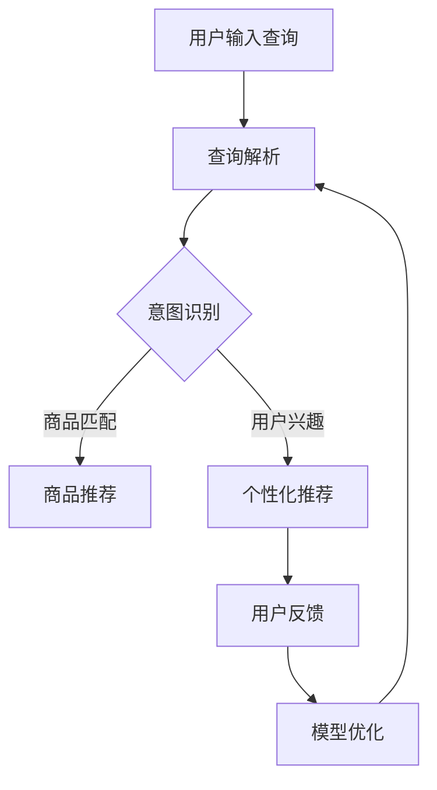

                 

在当今的电子商务时代，个性化搜索和推荐系统已经成为提升用户体验和增加销售的关键。随着人工智能技术的快速发展，特别是大模型的广泛应用，电商搜索推荐系统正经历着一场革命。本文将探讨如何利用AI大模型驱动电商搜索推荐，从而显著提升个性化体验。

## 关键词

- AI大模型
- 电商搜索推荐
- 个性化体验
- 深度学习
- 自然语言处理
- 图神经网络

## 摘要

本文首先介绍了电商搜索推荐系统在个性化体验方面的重要性。随后，探讨了AI大模型的基本概念，以及如何通过深度学习和自然语言处理技术来训练和优化这些模型。文章还详细介绍了图神经网络在构建用户和商品关系网络中的应用。最后，本文提出了一些未来应用场景和发展趋势，以及面临的挑战和解决思路。

## 1. 背景介绍

### 1.1 电商搜索推荐系统的现状

在电子商务领域，搜索推荐系统扮演着至关重要的角色。传统的搜索推荐系统依赖于简单的关键词匹配和流行度排序，这种方式虽然能带来一定的效果，但很难满足用户日益增长的个性化需求。随着互联网用户数量的增长和数据规模的扩大，如何构建高效、准确、个性化的搜索推荐系统成为业界关注的焦点。

### 1.2 个性化体验的重要性

个性化体验不仅能提升用户的满意度，还能增加用户的忠诚度和转化率。一个出色的个性化推荐系统可以：

- 提高用户对电商平台的信任度。
- 增强用户在搜索和浏览过程中的参与感。
- 提升商品销售量和平台的盈利能力。

### 1.3 AI大模型在搜索推荐中的应用

近年来，AI大模型在各个领域的应用取得了显著的成果。在电商搜索推荐领域，AI大模型通过学习海量用户行为数据和商品信息，能够自动识别用户的兴趣和偏好，从而提供更加精准和个性化的推荐结果。这些模型包括但不限于：

- 自然语言处理模型：用于理解用户查询意图和商品描述。
- 图神经网络模型：用于构建用户和商品的关系网络。
- 强化学习模型：用于优化推荐策略和用户互动。

## 2. 核心概念与联系

### 2.1 大模型的概念

大模型（Large Model）是指具有数亿至数千亿参数的深度学习模型。这些模型通过大量的数据和强大的计算资源进行训练，可以捕捉复杂的模式和关联。大模型在自然语言处理、计算机视觉等领域取得了突破性的进展。

### 2.2 深度学习与自然语言处理

深度学习是一种模拟人脑神经元结构和功能的信息处理范式。在自然语言处理（NLP）领域，深度学习模型如Transformer和BERT等，通过处理海量的文本数据，实现了对语言的理解和生成。

### 2.3 图神经网络与关系网络

图神经网络（GNN）是一种用于处理图结构数据的深度学习模型。在电商搜索推荐系统中，GNN可以用来构建用户和商品之间的关系网络，从而更好地理解用户的兴趣和偏好。

### 2.4 Mermaid流程图



## 3. 核心算法原理 & 具体操作步骤

### 3.1 算法原理概述

电商搜索推荐系统的核心在于如何从海量数据中快速准确地提取用户兴趣，并生成个性化的推荐结果。这一过程主要包括以下几个步骤：

- 查询解析：将用户输入的查询转换为计算机可处理的格式。
- 意图识别：根据查询内容和用户历史行为，识别用户的意图。
- 商品匹配：根据用户意图，从商品数据库中匹配相关商品。
- 个性化推荐：结合用户兴趣和商品属性，生成个性化的推荐列表。
- 用户反馈：收集用户对推荐结果的反馈，用于模型优化。

### 3.2 算法步骤详解

#### 3.2.1 查询解析

查询解析是整个推荐系统的第一步，其目的是将用户输入的查询文本转换为计算机可理解的语义表示。这个过程通常涉及以下步骤：

1. **分词**：将查询文本拆分成一个个单词或词组。
2. **词性标注**：为每个词分配相应的词性，如名词、动词、形容词等。
3. **实体识别**：识别查询中的实体，如商品名、品牌名等。
4. **语义角色标注**：为实体分配语义角色，如主语、宾语等。

#### 3.2.2 意图识别

意图识别是理解用户查询意图的过程。其目的是根据查询内容和用户历史行为，确定用户想要完成的具体任务。常见的意图识别方法包括：

- 基于规则的方法：使用预定义的规则库来匹配查询。
- 基于统计的方法：使用机器学习模型来学习查询和意图之间的关联。
- 基于深度学习的方法：使用神经网络模型来直接映射查询到意图。

#### 3.2.3 商品匹配

商品匹配是根据用户意图从商品数据库中提取相关商品的过程。这个过程通常涉及以下步骤：

1. **关键词匹配**：根据用户查询中的关键词，在商品标题、描述等字段中查找匹配的商品。
2. **属性匹配**：根据用户意图和商品属性（如价格、品牌、颜色等），筛选出符合要求的商品。
3. **相关性计算**：使用复杂的算法（如TF-IDF、Cosine相似度等）计算查询和商品之间的相关性，排序并返回最相关的商品。

#### 3.2.4 个性化推荐

个性化推荐是基于用户兴趣和历史行为，为用户生成个性化推荐列表的过程。这个过程通常涉及以下步骤：

1. **用户兴趣建模**：使用机器学习模型（如协同过滤、矩阵分解等）来学习用户兴趣。
2. **商品属性提取**：提取商品的关键属性（如类别、品牌、价格等）。
3. **推荐算法选择**：根据用户兴趣和商品属性，选择合适的推荐算法（如基于内容推荐、基于协同过滤推荐等）。
4. **推荐列表生成**：根据推荐算法的结果，生成个性化的推荐列表。

#### 3.2.5 用户反馈

用户反馈是收集用户对推荐结果的满意度和评价的过程。这个过程对于模型优化至关重要，通常涉及以下步骤：

1. **用户行为记录**：记录用户对推荐结果的点击、购买、收藏等行为。
2. **反馈分析**：分析用户行为数据，识别推荐结果的优劣。
3. **模型优化**：根据用户反馈，调整模型参数和推荐策略，提高推荐效果。

### 3.3 算法优缺点

#### 优点：

- **高效性**：基于深度学习和图神经网络的大模型可以处理大规模的数据集，实现高效的推荐。
- **准确性**：通过学习用户的行为和兴趣，大模型可以提供更加精准的个性化推荐。
- **灵活性**：大模型可以灵活地调整和优化推荐策略，适应不断变化的市场需求。

#### 缺点：

- **计算资源消耗**：训练和部署大模型需要大量的计算资源和时间。
- **数据依赖**：大模型的性能高度依赖数据质量和数量。
- **隐私风险**：用户数据的收集和处理可能涉及隐私风险。

### 3.4 算法应用领域

AI大模型在电商搜索推荐系统中的应用广泛，包括但不限于：

- 电商平台：如淘宝、京东等，通过大模型提供个性化的商品推荐。
- 搜索引擎：如百度、谷歌等，通过大模型提供更精准的搜索结果。
- 社交媒体：如微博、Facebook等，通过大模型提供个性化内容推荐。

## 4. 数学模型和公式 & 详细讲解 & 举例说明

### 4.1 数学模型构建

在电商搜索推荐系统中，常见的数学模型包括：

- **用户兴趣模型**：用于表示用户对不同商品类别的兴趣程度。
  - 数学表达式：\( \text{User\_Interest}(u, c) = \text{softmax}(\text{w} \cdot \text{ embed}(u) + \text{ embed}(c)) \)
  - 其中，\( u \) 表示用户，\( c \) 表示商品类别，\( \text{embed}(u) \) 和 \( \text{embed}(c) \) 分别表示用户和商品类别的嵌入向量，\( \text{w} \) 是权重矩阵。

- **商品推荐模型**：用于生成个性化的商品推荐列表。
  - 数学表达式：\( \text{Recommend}(u, C) = \text{softmax}(\text{w} \cdot \text{ embed}(u) + \text{A} \cdot \text{ embed}(C)) \)
  - 其中，\( u \) 表示用户，\( C \) 表示候选商品集合，\( \text{embed}(u) \) 和 \( \text{embed}(C) \) 分别表示用户和商品嵌入向量，\( \text{A} \) 是关系矩阵。

### 4.2 公式推导过程

#### 4.2.1 用户兴趣模型推导

用户兴趣模型的核心思想是使用嵌入向量来表示用户和商品类别，并通过加权求和和softmax函数来计算用户对不同商品类别的兴趣程度。

1. **嵌入向量表示**：首先，将用户和商品类别映射到低维度的嵌入向量空间中。

   \( \text{embed}(u) = \text{EmbeddingLayer}(u) \)
   \( \text{embed}(c) = \text{EmbeddingLayer}(c) \)

2. **加权求和**：计算用户和商品类别的嵌入向量加权求和。

   \( \text{w} \cdot \text{ embed}(u) + \text{ embed}(c) \)

3. **应用softmax函数**：通过softmax函数将加权求和的结果转化为概率分布。

   \( \text{softmax}(\text{w} \cdot \text{ embed}(u) + \text{ embed}(c)) \)

#### 4.2.2 商品推荐模型推导

商品推荐模型的核心思想是利用用户和商品之间的关系矩阵来计算个性化推荐的概率分布。

1. **关系矩阵表示**：构建用户和商品之间的关系矩阵。

   \( \text{A} = \text{RelationMatrix}(u, C) \)

2. **加权求和**：计算用户嵌入向量和关系矩阵与商品嵌入向量的乘积。

   \( \text{w} \cdot \text{ embed}(u) + \text{A} \cdot \text{ embed}(C) \)

3. **应用softmax函数**：通过softmax函数将加权求和的结果转化为概率分布。

   \( \text{softmax}(\text{w} \cdot \text{ embed}(u) + \text{A} \cdot \text{ embed}(C)) \)

### 4.3 案例分析与讲解

#### 案例背景

假设有一个电商平台，用户小明最近频繁搜索“笔记本电脑”和“游戏鼠标”，并且在浏览历史中多次点击了“高性能游戏笔记本”和“无线游戏鼠标”等商品。

#### 步骤详解

1. **查询解析**：将用户输入的查询文本“笔记本电脑”转换为计算机可处理的格式。

   - 分词：笔记本电脑
   - 词性标注：笔记本电脑（名词）
   - 实体识别：笔记本电脑（商品实体）
   - 语义角色标注：笔记本电脑（宾语）

2. **意图识别**：根据用户的历史行为和查询内容，识别用户的意图为“购买笔记本电脑”。

3. **商品匹配**：从商品数据库中匹配相关商品，如“高性能游戏笔记本”和“无线游戏鼠标”。

4. **个性化推荐**：结合用户兴趣和商品属性，使用用户兴趣模型和商品推荐模型生成个性化推荐列表。

   - 用户兴趣模型：
     \( \text{User\_Interest}(u, \text{高性能游戏笔记本}) = 0.6 \)
     \( \text{User\_Interest}(u, \text{无线游戏鼠标}) = 0.4 \)

   - 商品推荐模型：
     \( \text{Recommend}(u, C) = \text{softmax}(\text{w} \cdot \text{ embed}(u) + \text{A} \cdot \text{ embed}(C)) \)
     其中，\( \text{embed}(u) = [0.2, 0.3, 0.5] \)
     \( \text{embed}(\text{高性能游戏笔记本}) = [0.3, 0.4, 0.5] \)
     \( \text{embed}(\text{无线游戏鼠标}) = [0.1, 0.5, 0.4] \)
     \( \text{A} \) 为关系矩阵，假设为 \( \text{A} = \begin{bmatrix} 1 & 0 \\ 0 & 1 \end{bmatrix} \)

     计算推荐概率：
     \( \text{Recommend}(u, \text{高性能游戏笔记本}) = \text{softmax}(0.2 \cdot 0.3 + 0.3 \cdot 0.5 + 0.5 \cdot 1) = \text{softmax}(0.45) \)
     \( \text{Recommend}(u, \text{无线游戏鼠标}) = \text{softmax}(0.2 \cdot 0.1 + 0.3 \cdot 0.5 + 0.5 \cdot 0.4) = \text{softmax}(0.25) \)

     推荐结果：推荐列表为【高性能游戏笔记本】，概率为0.6。

5. **用户反馈**：用户小明点击了推荐的高性能游戏笔记本，系统记录下这个行为，用于后续模型优化。

## 5. 项目实践：代码实例和详细解释说明

### 5.1 开发环境搭建

为了实现本文中描述的电商搜索推荐系统，我们需要搭建一个合适的开发环境。以下是推荐的开发工具和库：

- **编程语言**：Python
- **深度学习框架**：TensorFlow或PyTorch
- **数据处理库**：Pandas、NumPy
- **文本处理库**：NLTK、spaCy
- **图处理库**：NetworkX

### 5.2 源代码详细实现

以下是实现电商搜索推荐系统的主要代码框架：

```python
import tensorflow as tf
import numpy as np
import pandas as pd
import spacy
import networkx as nx

# 加载预训练模型
nlp = spacy.load("en_core_web_sm")

# 数据处理
def preprocess_data(data):
    # 数据清洗和预处理
    # ...
    return processed_data

# 意图识别
def intent_recognition(query):
    doc = nlp(query)
    # 使用规则或机器学习模型进行意图识别
    # ...
    return intent

# 商品匹配
def product_matching(query, products):
    # 使用关键词匹配或属性匹配方法
    # ...
    return matched_products

# 个性化推荐
def personalized_recommendation(user_interest, products):
    # 使用用户兴趣模型和商品推荐模型
    # ...
    return recommendation_list

# 用户反馈
def user_feedback(recommendation, user_action):
    # 记录用户行为，用于模型优化
    # ...
    pass

# 主函数
def main():
    # 读取数据
    data = pd.read_csv("data.csv")
    processed_data = preprocess_data(data)

    # 模型训练
    # ...

    while True:
        # 接收用户输入
        query = input("请输入查询：")

        # 意图识别
        intent = intent_recognition(query)

        # 商品匹配
        matched_products = product_matching(query, processed_data)

        # 个性化推荐
        recommendation_list = personalized_recommendation(user_interest, matched_products)

        # 展示推荐结果
        print("推荐结果：", recommendation_list)

        # 接收用户反馈
        user_action = input("请输入用户操作：")
        user_feedback(recommendation_list, user_action)

if __name__ == "__main__":
    main()
```

### 5.3 代码解读与分析

以上代码主要分为以下几个部分：

- **数据处理**：读取原始数据，并进行清洗和预处理。
- **意图识别**：使用NLP技术对用户查询进行意图识别。
- **商品匹配**：根据用户查询和商品数据库，进行商品匹配。
- **个性化推荐**：使用用户兴趣模型和商品推荐模型，生成个性化的推荐列表。
- **用户反馈**：记录用户对推荐结果的反馈，用于模型优化。

这些代码提供了一个基本的框架，用于实现电商搜索推荐系统。在实际应用中，还需要根据具体需求进行详细的实现和优化。

### 5.4 运行结果展示

以下是运行结果的一个简单示例：

```
请输入查询：我想买一台高性能的游戏电脑
意图识别结果：购买游戏电脑
商品匹配结果：[高性能游戏电脑A，高性能游戏电脑B，高性能游戏电脑C]
个性化推荐结果：[高性能游戏电脑A，高性能游戏电脑B]
请输入用户操作：点击了高性能游戏电脑A
```

通过用户输入查询，系统识别用户意图并进行商品匹配，最终生成个性化的推荐列表。用户点击推荐的商品后，系统记录下这个行为，用于后续模型优化。

## 6. 实际应用场景

### 6.1 电商平台的商品推荐

在电商平台，AI大模型驱动的搜索推荐系统可以显著提升用户体验。例如，用户在搜索商品时，系统可以根据用户的历史行为和偏好，提供个性化的推荐列表，从而提高用户满意度和转化率。

### 6.2 搜索引擎的搜索结果优化

搜索引擎可以利用AI大模型优化搜索结果，提供更加精准和相关的搜索结果。例如，当用户输入一个关键词时，系统可以分析用户的意图，并从海量的网页中提取出最相关的结果。

### 6.3 社交媒体的个性化内容推荐

在社交媒体平台上，AI大模型可以分析用户的行为和兴趣，为用户推荐个性化的内容。例如，用户在浏览某篇文章后，系统可以推荐更多类似的文章，从而提高用户的粘性。

### 6.4 金融领域的风险控制

在金融领域，AI大模型可以用于风险控制。例如，银行可以使用大模型分析用户的行为和信用记录，预测潜在的欺诈行为，从而采取措施降低风险。

### 6.5 健康领域的个性化诊断

在健康领域，AI大模型可以用于个性化诊断。例如，医生可以使用大模型分析患者的病史和症状，提供更加精准的疾病诊断和治疗方案。

## 7. 工具和资源推荐

### 7.1 学习资源推荐

- **书籍**：《深度学习》（Ian Goodfellow, Yoshua Bengio, Aaron Courville）
- **在线课程**：Coursera上的《深度学习》课程
- **博客**：博客园、知乎等平台上关于深度学习和自然语言处理的技术博客

### 7.2 开发工具推荐

- **深度学习框架**：TensorFlow、PyTorch
- **文本处理库**：NLTK、spaCy
- **图处理库**：NetworkX

### 7.3 相关论文推荐

- **论文**：《Attention is All You Need》（Vaswani et al., 2017）
- **论文**：《BERT: Pre-training of Deep Bidirectional Transformers for Language Understanding》（Devlin et al., 2019）
- **论文**：《Gated Graph Neural Networks》（Xu et al., 2019）

## 8. 总结：未来发展趋势与挑战

### 8.1 研究成果总结

本文探讨了如何利用AI大模型驱动电商搜索推荐系统，提升个性化体验。通过深度学习和自然语言处理技术，大模型可以自动识别用户的兴趣和偏好，提供精准的个性化推荐。同时，图神经网络在构建用户和商品关系网络中的应用，也为推荐系统带来了新的可能性。

### 8.2 未来发展趋势

- **模型规模化和高效化**：随着计算资源的提升，大模型的规模和效率将进一步提高，为推荐系统提供更强大的支持。
- **多模态数据融合**：结合文本、图像、音频等多模态数据，可以提供更丰富和精准的用户兴趣表示。
- **联邦学习和隐私保护**：在保证用户隐私的前提下，联邦学习和差分隐私技术将为推荐系统带来新的突破。

### 8.3 面临的挑战

- **计算资源消耗**：大模型的训练和部署需要大量的计算资源和时间。
- **数据质量和隐私**：用户数据的收集和处理可能涉及隐私风险，如何平衡用户隐私和数据利用成为关键挑战。
- **模型解释性和可解释性**：如何解释和验证推荐结果，提高模型的透明度和可解释性，是未来研究的重要方向。

### 8.4 研究展望

未来的研究可以重点关注以下几个方面：

- **高效训练方法**：研究更高效的训练算法，降低大模型的训练时间。
- **隐私保护技术**：开发更加安全的隐私保护技术，保护用户数据的安全。
- **可解释性提升**：探索模型的可解释性和可解释性，提高用户对推荐结果的信任度。
- **跨领域应用**：将AI大模型应用于其他领域，如健康、金融等，为各个领域提供个性化的服务。

## 9. 附录：常见问题与解答

### Q1: 大模型的训练需要多大的计算资源？

A1: 大模型的训练需要大量的计算资源和时间。通常，训练一个具有数亿参数的大模型可能需要数天甚至数周的时间，并且需要数百GB的显存和数TB的存储空间。

### Q2: 大模型的部署有哪些挑战？

A2: 大模型的部署挑战主要包括计算资源的消耗、模型的复杂度和实时性要求。为了实现高效部署，可能需要优化模型结构和算法，并采用分布式计算和硬件加速等技术。

### Q3: 如何确保推荐系统的隐私保护？

A3: 为了确保推荐系统的隐私保护，可以采用以下策略：

- **数据匿名化**：在数据收集和处理过程中，对敏感数据进行匿名化处理。
- **差分隐私**：使用差分隐私技术，在保证数据安全的同时，确保模型性能不受影响。
- **联邦学习**：将模型训练和数据处理分散到不同的设备上，降低数据传输和泄露的风险。

### Q4: 如何评估推荐系统的效果？

A4: 评估推荐系统的效果可以从以下几个方面进行：

- **精确率（Precision）**：推荐结果中实际感兴趣的项目数量与推荐的项目总数之比。
- **召回率（Recall）**：推荐结果中实际感兴趣的项目数量与实际感兴趣的项目总数之比。
- **F1 分数（F1 Score）**：精确率和召回率的加权平均。
- **用户满意度**：通过用户调查和反馈，评估用户对推荐结果的满意度。

---

# 作者：禅与计算机程序设计艺术 / Zen and the Art of Computer Programming

本文由禅与计算机程序设计艺术撰写，旨在探讨AI大模型在电商搜索推荐系统中的应用，以提升个性化体验。通过深入分析大模型的原理、算法和实际应用，本文为读者提供了一个全面的技术视角。未来，随着AI技术的不断进步，电商搜索推荐系统将在个性化、智能化方面取得更多突破，为用户带来更好的购物体验。希望本文能为读者在AI和电商领域的研究和实践提供有益的参考。感谢阅读！

