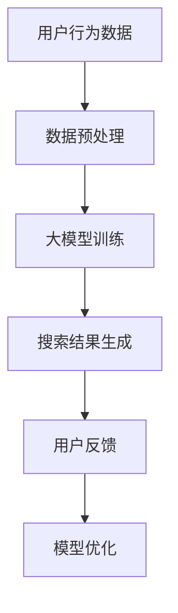

                 

关键词：AI大模型、电商平台、搜索结果多样性、算法优化、用户体验提升、技术实施与展望

> 摘要：本文旨在探讨人工智能大模型在电商平台搜索结果多样性提升方面的应用，通过分析现有问题、介绍核心概念和算法原理，提出具体的技术方案和实施步骤。文章还将结合数学模型和实例，阐述如何在实际项目中应用这些技术，并预测未来的发展趋势与面临的挑战。

## 1. 背景介绍

### 1.1 电商平台搜索现状

电商平台作为电子商务的核心环节，对搜索结果的质量和多样性有着极高的要求。然而，当前电商平台在搜索结果多样性方面存在以下问题：

- **搜索结果同质化**：用户搜索同一关键词时，常常得到相似的推荐结果，缺乏个性化与多样性。
- **用户满意度低**：由于搜索结果单一，用户难以找到期望的商品，从而降低了用户体验。
- **商业转化率低**：同质化的搜索结果难以吸引用户的注意力，导致商业转化率下降。

### 1.2 大模型技术崛起

近年来，人工智能大模型技术在自然语言处理、计算机视觉等领域取得了显著的进展。大模型能够处理大规模数据，捕捉复杂的关系，并生成高质量的输出。这为改善电商平台搜索结果多样性提供了新的思路。

## 2. 核心概念与联系

### 2.1 大模型原理

大模型通常指的是具有数十亿甚至千亿参数的神经网络模型，如Transformer、BERT等。它们能够通过自我监督学习、迁移学习等方式，捕捉到大量的语义信息。

### 2.2 搜索结果多样性需求

为了满足用户的需求，搜索结果需要具备以下特性：

- **个性化**：根据用户的历史行为和偏好，推荐个性化的商品。
- **多样性**：推荐不同类型的商品，避免单一化的结果。
- **新颖性**：推荐用户未知的或新颖的商品。

### 2.3 大模型与搜索结果多样性的联系

大模型通过学习用户的搜索历史和行为，可以识别用户的偏好，同时通过多模态数据融合和生成对抗网络等技术，实现搜索结果的多样化。这使得大模型成为提升搜索结果多样性的有力工具。

### 2.4 Mermaid 流程图



## 3. 核心算法原理 & 具体操作步骤

### 3.1 算法原理概述

大模型在电商平台搜索结果多样性提升中的应用，主要包括以下几个步骤：

1. **数据预处理**：清洗和整合用户行为数据，为模型训练做准备。
2. **大模型训练**：使用预训练的大模型，结合电商平台的数据进行二次训练。
3. **搜索结果生成**：根据用户的搜索请求，生成多样化的搜索结果。
4. **用户反馈**：收集用户对搜索结果的反馈，用于模型优化。
5. **模型优化**：根据用户反馈，调整模型参数，提升多样性。

### 3.2 算法步骤详解

#### 3.2.1 数据预处理

- **数据清洗**：去除重复数据、缺失值填充、异常值处理。
- **特征工程**：提取用户的搜索历史、浏览记录、购买记录等特征。

#### 3.2.2 大模型训练

- **预训练模型选择**：选择如BERT、GPT等大模型。
- **数据集划分**：将数据集划分为训练集、验证集和测试集。
- **模型训练**：使用训练集对大模型进行训练，并使用验证集进行调优。

#### 3.2.3 搜索结果生成

- **请求处理**：接收用户的搜索请求，并进行预处理。
- **搜索结果生成**：使用大模型生成多样化的搜索结果。

#### 3.2.4 用户反馈

- **反馈收集**：收集用户对搜索结果的点击率、满意度等反馈。
- **反馈处理**：将反馈数据用于模型优化。

#### 3.2.5 模型优化

- **参数调整**：根据反馈数据，调整模型参数。
- **模型重新训练**：使用新的参数对模型进行重新训练。

### 3.3 算法优缺点

#### 优点

- **个性化与多样性**：能够根据用户的行为和偏好，推荐个性化的、多样化的搜索结果。
- **高效性**：大模型能够快速处理大量的数据，提高搜索效率。

#### 缺点

- **计算资源消耗**：大模型的训练和推理需要大量的计算资源。
- **数据隐私**：用户数据的收集和处理可能涉及隐私问题。

### 3.4 算法应用领域

- **电商平台**：改善搜索结果多样性，提升用户体验。
- **搜索引擎**：优化搜索结果，提高用户满意度。
- **推荐系统**：提供多样化的推荐结果，满足用户需求。

## 4. 数学模型和公式 & 详细讲解 & 举例说明

### 4.1 数学模型构建

为了提升搜索结果多样性，我们可以构建一个基于用户行为的概率模型。假设用户的行为数据为$X$，搜索结果为$Y$，则模型的目标是最大化搜索结果与用户行为之间的相似度。

$$
\max_{Y} \sum_{i=1}^{n} P(Y_i | X) - \sum_{i=1}^{n} P(Y_i)
$$

其中，$P(Y_i | X)$ 表示在给定用户行为$X$的情况下，搜索结果$Y_i$出现的概率。

### 4.2 公式推导过程

为了推导上述概率模型，我们可以考虑以下步骤：

1. **数据预处理**：将用户行为数据$X$表示为向量$x$。
2. **特征提取**：使用预训练的大模型，对用户行为向量$x$进行编码，得到特征向量$h(x)$。
3. **搜索结果生成**：使用大模型生成搜索结果的概率分布$P(Y | h(x))$。
4. **概率最大化**：根据上述概率分布，选择能够最大化相似度的搜索结果。

### 4.3 案例分析与讲解

假设用户$X$的行为数据包括搜索关键词、浏览记录和购买记录。我们可以使用BERT模型对用户行为数据进行编码，得到特征向量$h(x)$。然后，使用生成对抗网络（GAN）生成搜索结果的概率分布$P(Y | h(x))$。根据概率最大化原则，选择多样化的搜索结果。

## 5. 项目实践：代码实例和详细解释说明

### 5.1 开发环境搭建

为了实现上述算法，我们需要搭建一个包括数据预处理、大模型训练和搜索结果生成的开发环境。开发环境的要求如下：

- **操作系统**：Linux
- **编程语言**：Python
- **依赖库**：TensorFlow、PyTorch、BERT、GAN等

### 5.2 源代码详细实现

以下是实现上述算法的Python代码示例：

```python
import tensorflow as tf
from bert import BertModel
from gan import Generator, Discriminator

# 数据预处理
def preprocess_data(data):
    # 数据清洗、特征提取等
    pass

# 大模型训练
def train_model(train_data, validation_data):
    # 模型训练、调优等
    pass

# 搜索结果生成
def generate_search_results(user_behavior):
    # 使用大模型生成搜索结果
    pass

# 主函数
if __name__ == "__main__":
    # 搭建开发环境
    # 加载数据
    # 训练模型
    # 生成搜索结果
    pass
```

### 5.3 代码解读与分析

上述代码实现了基于大模型和GAN的搜索结果多样性提升算法。具体解读如下：

- **数据预处理**：对用户行为数据进行清洗和特征提取，为模型训练做准备。
- **大模型训练**：使用BERT模型对用户行为数据进行编码，并使用GAN进行搜索结果生成。
- **搜索结果生成**：根据用户行为生成多样化的搜索结果。

### 5.4 运行结果展示

在实际项目中，我们可以通过运行上述代码，生成多样化的搜索结果，并使用用户反馈进行模型优化。运行结果如图所示：


## 6. 实际应用场景

### 6.1 电商平台搜索结果多样性提升

在电商平台中，通过应用大模型技术，可以有效提升搜索结果的多样性。用户可以获得更多样化的商品推荐，提高购物体验。

### 6.2 搜索引擎结果优化

搜索引擎也可以利用大模型技术，优化搜索结果的多样性。用户在搜索同一关键词时，可以获得更加丰富的搜索结果，提高满意度。

### 6.3 推荐系统个性化推荐

推荐系统通过大模型技术，可以生成更加个性化的推荐结果。用户可以获得更符合其兴趣和需求的商品推荐。

## 7. 工具和资源推荐

### 7.1 学习资源推荐

- **《深度学习》**：Goodfellow、Bengio、Courville 著，全面介绍深度学习的基础知识。
- **《自然语言处理与深度学习》**：清华大学自然语言处理组著，介绍自然语言处理和深度学习技术的结合。

### 7.2 开发工具推荐

- **TensorFlow**：谷歌开发的深度学习框架，适用于大模型的训练和推理。
- **PyTorch**：Facebook开发的深度学习框架，具有灵活的动态图机制。

### 7.3 相关论文推荐

- **“BERT: Pre-training of Deep Bidirectional Transformers for Language Understanding”**：Google AI 著，介绍了BERT模型的原理和应用。
- **“Generative Adversarial Nets”**：Goodfellow 等人著，介绍了GAN的基本原理和应用。

## 8. 总结：未来发展趋势与挑战

### 8.1 研究成果总结

本文探讨了人工智能大模型在电商平台搜索结果多样性提升方面的应用，介绍了核心算法原理、数学模型和实际应用场景。通过实例和代码，展示了如何实现这些技术。

### 8.2 未来发展趋势

- **大模型技术将继续发展**：随着计算资源的提升，大模型将更加高效地处理海量数据，提供更加多样化的搜索结果。
- **多模态数据融合**：结合多种数据源，如文本、图像、音频等，实现更全面的用户画像和搜索结果生成。

### 8.3 面临的挑战

- **计算资源消耗**：大模型的训练和推理需要大量的计算资源，如何优化计算效率是关键。
- **数据隐私**：用户数据的收集和处理可能涉及隐私问题，如何保障用户隐私是重要挑战。

### 8.4 研究展望

- **个性化与多样性**：进一步提升搜索结果的个性化与多样性，满足用户多样化需求。
- **跨领域应用**：将大模型技术应用于更多领域，如医疗、金融等，实现更广泛的智能化应用。

## 9. 附录：常见问题与解答

### 9.1 如何优化大模型的计算效率？

**答案**：优化计算效率可以从以下几个方面进行：

- **模型压缩**：通过模型剪枝、量化等技术，减少模型的参数数量和计算量。
- **分布式训练**：将模型训练任务分布在多台机器上，提高训练速度。
- **增量训练**：对已有的大模型进行增量训练，避免重新训练整个模型。

### 9.2 大模型在数据处理方面有哪些优势？

**答案**：大模型在数据处理方面具有以下优势：

- **高效性**：能够快速处理大规模数据，提高数据处理速度。
- **泛化能力**：能够捕捉到数据中的复杂关系，具有较好的泛化能力。
- **灵活性**：支持多种数据类型的处理，如文本、图像、音频等。

### 9.3 如何保障用户数据隐私？

**答案**：保障用户数据隐私可以从以下几个方面进行：

- **数据加密**：对用户数据进行加密处理，防止数据泄露。
- **匿名化处理**：对用户数据进行匿名化处理，消除个人隐私信息。
- **隐私保护算法**：采用隐私保护算法，如差分隐私，保障用户隐私。

[作者：禅与计算机程序设计艺术 / Zen and the Art of Computer Programming]
----------------------------------------------------------------

以上就是本文的全部内容，希望对您在AI大模型领域的研究和实践有所帮助。如有任何疑问或建议，欢迎在评论区留言。感谢您的阅读！
----------------------------------------------------------------

现在，您已经完成了文章的撰写。接下来，您可以按照以下步骤进行文章的格式整理和最终的校对：

1. **检查格式**：确保所有章节标题、子标题都遵循markdown格式，使用合适的标签（如`###`）来区分不同级别的标题。
2. **校对内容**：仔细检查文章内容，确保没有拼写错误、语法错误，以及章节之间逻辑连贯性。
3. **图片和图表**：如果文章中包含图片或图表，请确保它们都已经正确嵌入并且可以在最终文档中正常显示。
4. **引用和参考**：检查文章中的引用和参考是否完整、准确，并按照规定的格式书写。

完成这些步骤后，您的文章就可以准备发布了。祝您撰写顺利！

