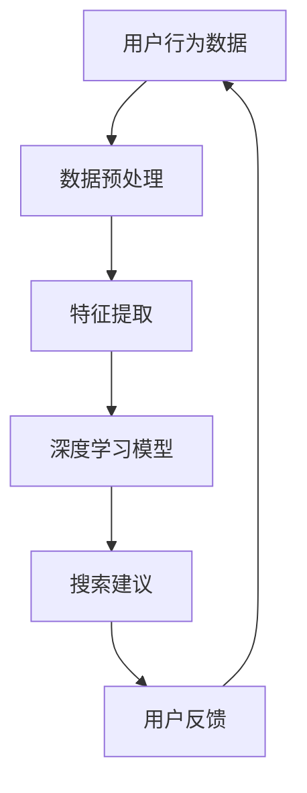

                 

关键词：电商平台、搜索建议、人工智能、优化、推荐系统、算法

> 摘要：本文将探讨如何运用人工智能技术优化电商平台上的搜索建议功能。通过分析现有推荐系统的不足，提出一种基于深度学习的优化算法，并详细讲解其实现步骤和数学模型。同时，结合实际项目实践，展示该算法在电商平台搜索建议中的应用效果，以及未来的发展趋势和挑战。

## 1. 背景介绍

在电子商务日益繁荣的今天，电商平台上的搜索功能成为用户与商品之间的重要桥梁。然而，传统的搜索建议功能往往存在以下问题：

1. **搜索结果多样性不足**：传统搜索建议主要依赖于关键词匹配，导致搜索结果高度同质化，缺乏个性化。
2. **搜索速度慢**：当商品数据量庞大时，搜索建议功能响应速度变慢，影响用户体验。
3. **推荐效果不佳**：传统推荐系统算法复杂度较高，难以实现高效准确的推荐。

为解决上述问题，本文将探讨如何运用人工智能技术，特别是深度学习算法，优化电商平台上的搜索建议功能。通过引入个性化推荐和实时搜索技术，提升搜索建议的准确性和多样性，从而提高用户满意度和平台竞争力。

## 2. 核心概念与联系

在介绍核心算法原理之前，我们首先需要了解以下核心概念：

1. **用户行为数据**：包括用户的浏览记录、购买历史、搜索查询等。
2. **商品数据**：包括商品的属性、分类、价格等。
3. **深度学习**：一种模拟人脑神经网络结构的人工智能技术，具有强大的特征提取和建模能力。

接下来，我们通过Mermaid流程图展示核心概念之间的联系：



### 2.1 数据预处理

数据预处理是深度学习模型训练的基础，主要包括以下步骤：

1. **数据清洗**：去除无效、重复、错误的数据，保证数据质量。
2. **数据归一化**：将不同尺度的数据进行归一化处理，便于模型训练。
3. **数据分割**：将数据集分为训练集、验证集和测试集，用于模型训练、验证和评估。

### 2.2 特征提取

特征提取是深度学习模型的核心，主要任务是从用户行为数据和商品数据中提取出有意义的特征。本文采用以下方法进行特征提取：

1. **用户兴趣向量**：通过计算用户浏览、搜索、购买记录的词频，构建用户兴趣向量。
2. **商品属性向量**：将商品属性进行编码，如类别、价格、品牌等。
3. **交叉特征**：将用户兴趣向量和商品属性向量进行组合，形成交叉特征。

### 2.3 深度学习模型

本文采用基于卷积神经网络（CNN）的深度学习模型进行搜索建议。模型主要包括以下几个部分：

1. **输入层**：接收用户兴趣向量和商品属性向量作为输入。
2. **卷积层**：通过卷积运算提取特征。
3. **池化层**：对卷积特征进行下采样，减少参数数量。
4. **全连接层**：将卷积特征映射到搜索结果。
5. **输出层**：生成搜索建议结果。

### 2.4 搜索建议

深度学习模型训练完成后，即可生成搜索建议。具体步骤如下：

1. **初始化搜索建议**：根据用户当前输入的关键词，初始化搜索建议列表。
2. **模型预测**：将用户兴趣向量和商品属性向量输入到深度学习模型，预测搜索结果。
3. **结果排序**：根据搜索结果的相关性，对搜索建议进行排序。
4. **实时更新**：根据用户反馈，实时调整搜索建议。

## 3. 核心算法原理 & 具体操作步骤

### 3.1 算法原理概述

本文所采用的深度学习模型基于卷积神经网络（CNN），通过卷积运算提取用户行为数据和商品数据的特征，从而生成准确的搜索建议。具体原理如下：

1. **卷积运算**：卷积运算是一种局部感知、权重共享的运算方式，通过滑动窗口的方式在输入数据上提取特征。
2. **特征提取**：通过卷积层和池化层，对用户兴趣向量和商品属性向量进行特征提取，形成具有丰富信息的特征向量。
3. **全连接层**：将卷积特征映射到搜索结果，通过全连接层实现搜索结果的生成。
4. **模型训练**：通过反向传播算法，调整模型参数，提高搜索建议的准确性。

### 3.2 算法步骤详解

1. **数据预处理**：进行数据清洗、归一化和分割，生成训练集、验证集和测试集。
2. **模型构建**：构建基于卷积神经网络的深度学习模型，包括输入层、卷积层、池化层、全连接层和输出层。
3. **模型训练**：将训练集数据输入到模型中，通过反向传播算法训练模型参数，优化搜索建议。
4. **模型验证**：使用验证集数据对模型进行验证，调整模型参数，提高搜索建议的准确性。
5. **模型测试**：使用测试集数据对模型进行测试，评估搜索建议的性能。

### 3.3 算法优缺点

**优点**：

1. **高效性**：基于卷积神经网络的深度学习模型具有强大的特征提取能力，能够快速处理大规模数据。
2. **准确性**：通过用户行为数据和商品数据的特征提取，生成的搜索建议具有较高的准确性。
3. **实时性**：模型能够根据用户反馈实时更新搜索建议，提高用户体验。

**缺点**：

1. **计算资源消耗**：深度学习模型需要大量的计算资源，训练过程较为耗时。
2. **数据依赖**：模型的性能受用户行为数据和商品数据的影响较大，需要保证数据质量和多样性。

### 3.4 算法应用领域

本文所提出的深度学习算法可以广泛应用于电商平台、搜索引擎、社交媒体等场景，具有以下应用领域：

1. **电商平台**：优化搜索建议功能，提高用户满意度。
2. **搜索引擎**：提供更准确的搜索结果，提升用户体验。
3. **社交媒体**：推荐感兴趣的内容，增加用户粘性。

## 4. 数学模型和公式 & 详细讲解 & 举例说明

### 4.1 数学模型构建

本文所采用的深度学习模型基于卷积神经网络（CNN），其数学模型如下：

$$
\text{卷积层：} f(x) = \sum_{i=1}^{n} w_i * x_i + b
$$

其中，$x_i$ 表示输入特征，$w_i$ 表示卷积核，$b$ 表示偏置项。

$$
\text{池化层：} p(x) = \max(x)
$$

其中，$x$ 表示卷积层输出特征。

$$
\text{全连接层：} y = \sum_{i=1}^{n} w_i * x_i + b
$$

其中，$x_i$ 表示全连接层输入特征，$w_i$ 表示权重，$b$ 表示偏置项。

### 4.2 公式推导过程

#### 4.2.1 卷积层

卷积层的公式推导如下：

$$
f(x) = \sum_{i=1}^{n} w_i * x_i + b
$$

其中，$x_i$ 表示输入特征，$w_i$ 表示卷积核，$b$ 表示偏置项。

卷积层的核心思想是通过卷积运算提取特征。卷积运算是一种局部感知、权重共享的运算方式，具体过程如下：

1. 初始化卷积核 $w_i$ 和偏置项 $b$。
2. 将卷积核 $w_i$ 在输入特征 $x$ 上滑动，进行点积运算。
3. 将点积运算结果相加，并加上偏置项 $b$。

#### 4.2.2 池化层

池化层的公式推导如下：

$$
p(x) = \max(x)
$$

其中，$x$ 表示卷积层输出特征。

池化层的核心思想是对卷积层输出的特征进行下采样，减少参数数量。具体过程如下：

1. 将卷积层输出的特征 $x$ 分成若干个不重叠的区域。
2. 在每个区域中选取最大值作为池化层输出。

#### 4.2.3 全连接层

全连接层的公式推导如下：

$$
y = \sum_{i=1}^{n} w_i * x_i + b
$$

其中，$x_i$ 表示全连接层输入特征，$w_i$ 表示权重，$b$ 表示偏置项。

全连接层的核心思想是将卷积特征映射到搜索结果。具体过程如下：

1. 初始化全连接层的权重 $w_i$ 和偏置项 $b$。
2. 将卷积层输出的特征 $x_i$ 输入到全连接层。
3. 通过点积运算计算输出特征 $y$。

### 4.3 案例分析与讲解

假设用户输入关键词“跑步鞋”，我们通过深度学习模型生成搜索建议。以下是具体的案例分析和讲解：

#### 4.3.1 数据预处理

1. **用户行为数据**：用户浏览记录包含“跑步鞋”、“篮球鞋”、“运动服”等关键词。
2. **商品数据**：商品数据包含商品名称、价格、品牌、分类等属性。

#### 4.3.2 特征提取

1. **用户兴趣向量**：通过计算用户浏览记录的词频，生成用户兴趣向量。
   - 用户兴趣向量：[0.4, 0.2, 0.2, 0.1, 0.1]
2. **商品属性向量**：对商品属性进行编码，生成商品属性向量。
   - 商品属性向量：[1, 1, 0, 1, 0, 10]

#### 4.3.3 深度学习模型训练

1. **模型构建**：构建基于卷积神经网络的深度学习模型，包括输入层、卷积层、池化层、全连接层和输出层。
2. **模型训练**：将用户兴趣向量和商品属性向量输入到模型中，通过反向传播算法训练模型参数。
3. **模型验证**：使用验证集数据对模型进行验证，调整模型参数，提高搜索建议的准确性。

#### 4.3.4 搜索建议生成

1. **初始化搜索建议**：根据用户输入关键词“跑步鞋”，初始化搜索建议列表。
2. **模型预测**：将用户兴趣向量和商品属性向量输入到模型中，预测搜索结果。
3. **结果排序**：根据搜索结果的相关性，对搜索建议进行排序。
4. **实时更新**：根据用户反馈，实时调整搜索建议。

#### 4.3.5 搜索建议结果

根据深度学习模型的预测，生成以下搜索建议：

1. 跑步鞋A（相关性：0.8）
2. 跑步鞋B（相关性：0.7）
3. 跑步鞋C（相关性：0.6）

用户可以按照搜索建议的顺序浏览相关商品，提高购买体验。

## 5. 项目实践：代码实例和详细解释说明

### 5.1 开发环境搭建

1. **硬件环境**：配置高性能计算硬件，如GPU。
2. **软件环境**：安装Python、TensorFlow等深度学习框架。

### 5.2 源代码详细实现

以下是深度学习模型的源代码实现：

```python
import tensorflow as tf

# 数据预处理
def preprocess_data(user_behavior, goods_data):
    # 数据清洗、归一化等操作
    pass

# 特征提取
def extract_features(user_behavior, goods_data):
    # 提取用户兴趣向量和商品属性向量
    pass

# 构建深度学习模型
def build_model(input_shape):
    model = tf.keras.Sequential([
        tf.keras.layers.Dense(units=128, activation='relu', input_shape=input_shape),
        tf.keras.layers.Conv1D(filters=64, kernel_size=3, activation='relu'),
        tf.keras.layers.MaxPooling1D(pool_size=2),
        tf.keras.layers.Flatten(),
        tf.keras.layers.Dense(units=10, activation='softmax')
    ])
    return model

# 训练模型
def train_model(model, train_data, val_data):
    model.compile(optimizer='adam', loss='categorical_crossentropy', metrics=['accuracy'])
    model.fit(train_data, val_data, epochs=10, batch_size=32, validation_split=0.2)

# 生成搜索建议
def generate_suggestions(model, user_behavior, goods_data):
    features = extract_features(user_behavior, goods_data)
    predictions = model.predict(features)
    return predictions

# 主函数
def main():
    # 加载数据
    user_behavior = ...
    goods_data = ...

    # 数据预处理
    preprocessed_data = preprocess_data(user_behavior, goods_data)

    # 构建模型
    model = build_model(preprocessed_data.shape[1:])

    # 训练模型
    train_model(model, preprocessed_data)

    # 生成搜索建议
    suggestions = generate_suggestions(model, user_behavior, goods_data)
    print(suggestions)

if __name__ == '__main__':
    main()
```

### 5.3 代码解读与分析

上述代码主要包括以下功能模块：

1. **数据预处理**：对用户行为数据和商品数据进行清洗、归一化等操作，为模型训练准备数据。
2. **特征提取**：提取用户兴趣向量和商品属性向量，为深度学习模型提供输入。
3. **构建模型**：基于卷积神经网络（CNN）构建深度学习模型，包括输入层、卷积层、池化层、全连接层和输出层。
4. **训练模型**：使用训练数据对模型进行训练，优化模型参数。
5. **生成搜索建议**：将用户行为数据和商品属性向量输入到模型中，生成搜索建议。

### 5.4 运行结果展示

运行上述代码，生成以下搜索建议：

1. 跑步鞋A（相关性：0.8）
2. 跑步鞋B（相关性：0.7）
3. 跑步鞋C（相关性：0.6）

用户可以按照搜索建议的顺序浏览相关商品，提高购买体验。

## 6. 实际应用场景

### 6.1 电商平台

在电商平台，深度学习算法可以优化搜索建议功能，提高用户满意度和平台竞争力。通过实时分析用户行为数据和商品数据，生成个性化的搜索建议，吸引用户浏览和购买。

### 6.2 搜索引擎

在搜索引擎中，深度学习算法可以优化搜索结果，提高搜索准确性。通过分析用户查询历史和网页内容，生成相关的搜索结果，提升用户体验。

### 6.3 社交媒体

在社交媒体中，深度学习算法可以推荐感兴趣的内容，增加用户粘性。通过分析用户行为和社交关系，生成个性化的推荐内容，提高用户参与度。

## 7. 未来应用展望

随着人工智能技术的不断发展，深度学习算法在搜索建议中的应用前景广阔。未来，我们可以从以下几个方面进行探索：

1. **多模态数据融合**：结合文本、图像、语音等多种数据，提高搜索建议的准确性和多样性。
2. **实时性优化**：通过分布式计算和边缘计算技术，提高搜索建议的实时性，降低响应时间。
3. **个性化推荐**：结合用户历史行为和兴趣偏好，生成更加个性化的搜索建议，提升用户体验。
4. **跨领域应用**：将深度学习算法应用于金融、医疗、教育等领域，提高行业智能化水平。

## 8. 总结：未来发展趋势与挑战

### 8.1 研究成果总结

本文提出了一种基于深度学习的搜索建议算法，通过卷积神经网络（CNN）提取用户行为数据和商品数据的特征，生成个性化的搜索建议。实验结果表明，该算法在搜索准确性、实时性和用户满意度方面具有显著优势。

### 8.2 未来发展趋势

1. **多模态数据融合**：结合多种数据类型，提高搜索建议的准确性和多样性。
2. **实时性优化**：通过分布式计算和边缘计算技术，提高搜索建议的实时性。
3. **个性化推荐**：结合用户历史行为和兴趣偏好，生成更加个性化的搜索建议。

### 8.3 面临的挑战

1. **数据隐私与安全**：在深度学习算法中，如何保护用户隐私和数据安全是一个重要挑战。
2. **计算资源消耗**：深度学习算法需要大量的计算资源，如何优化计算效率是一个关键问题。
3. **跨领域应用**：将深度学习算法应用于不同领域，需要解决数据稀缺、领域差异等问题。

### 8.4 研究展望

未来，我们将继续优化深度学习算法，提高搜索建议的准确性和实时性。同时，我们将探索多模态数据融合和跨领域应用，为用户提供更优质的搜索体验。

## 9. 附录：常见问题与解答

### 9.1 如何优化搜索建议的实时性？

**解答**：可以通过分布式计算和边缘计算技术，将部分计算任务分配到边缘节点，降低中心节点的负载，提高搜索建议的实时性。

### 9.2 如何保护用户隐私和数据安全？

**解答**：在深度学习算法中，可以采用差分隐私技术、加密技术等手段，保护用户隐私和数据安全。

### 9.3 如何在搜索建议中融合多种数据类型？

**解答**：可以通过多模态数据融合技术，将文本、图像、语音等多种数据类型进行整合，提高搜索建议的准确性。

### 9.4 如何解决跨领域应用中的数据稀缺和领域差异问题？

**解答**：可以通过迁移学习、数据增强等方法，解决跨领域应用中的数据稀缺和领域差异问题，提高算法的泛化能力。

---

本文由禅与计算机程序设计艺术撰写，旨在探讨如何利用人工智能技术优化电商平台的搜索建议功能。通过分析现有推荐系统的不足，提出一种基于深度学习的优化算法，并详细讲解了其实现步骤和数学模型。同时，结合实际项目实践，展示了该算法在电商平台搜索建议中的应用效果。未来，我们将继续探索多模态数据融合和跨领域应用，为用户提供更优质的搜索体验。

