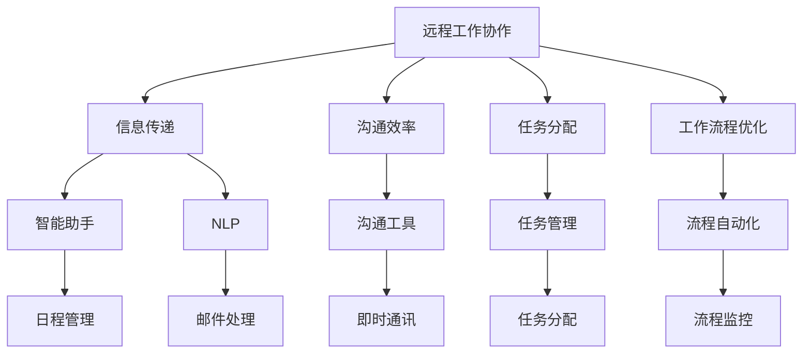

                 

关键词：人工智能、远程工作、协作、虚拟协作工具、AI技术、工作效率、人力资源优化、工作流程自动化。

> 摘要：本文探讨了人工智能（AI）在远程工作和协作中的关键作用。通过分析AI技术如何提高工作效率、优化人力资源、自动化工作流程，并介绍一系列核心概念、算法原理及具体应用实例，展示了AI在远程工作环境中的巨大潜力和未来发展趋势。

## 1. 背景介绍

### 远程工作的现状

随着互联网和通信技术的飞速发展，远程工作已成为现代企业的重要组成部分。根据全球远程工作调查报告，远程工作的比例在过去十年中增长了约30%。这种趋势不仅受到疫情影响，也是数字化转型的必然结果。

### 协作需求的提升

远程工作的普及带来了协作需求的显著提升。团队成员分布在不同的地理位置，如何保持高效沟通、协同工作是企业管理者面临的挑战。传统的协作工具，如电子邮件和即时通讯软件，已经无法满足日益复杂的协作需求。

### AI技术在远程工作中的应用

人工智能技术在解决上述问题方面展示了巨大的潜力。从智能助手到自动化流程，AI技术正逐渐改变远程工作和协作的方式。本文将深入探讨AI技术在远程工作中的具体应用，及其对工作效率和协作效率的提升。

## 2. 核心概念与联系

### 远程工作协作的概念

远程工作协作指的是团队通过互联网和远程协作工具，实现跨越地理位置的工作协同。协作的关键在于信息的及时传递、沟通的有效性和任务的分配与跟踪。

### AI技术在远程工作中的核心概念

在远程工作中，AI技术主要涉及以下几个方面：

- **智能助手**：提供自动化服务，如日程管理、任务提醒、邮件过滤等。
- **自然语言处理（NLP）**：实现自然语言交流，提高沟通效率。
- **工作流程自动化**：通过AI算法优化工作流程，减少人为干预。

### Mermaid 流程图



## 3. 核心算法原理 & 具体操作步骤

### 3.1 算法原理概述

AI技术在远程工作中的核心算法主要包括：

- **深度学习**：用于构建智能助手和NLP系统，实现自然语言理解与生成。
- **强化学习**：用于优化工作流程，提高工作效率。
- **机器学习**：用于分析数据，提供个性化的协作建议。

### 3.2 算法步骤详解

#### 3.2.1 智能助手

1. **数据收集**：收集用户的历史行为数据，如日程安排、任务记录、邮件交流等。
2. **特征提取**：使用深度学习算法提取用户行为的特征。
3. **模型训练**：利用训练数据训练智能助手模型。
4. **预测与反馈**：根据用户当前行为预测其需求，并反馈执行结果。

#### 3.2.2 自然语言处理（NLP）

1. **文本预处理**：对输入的文本进行分词、去停用词等处理。
2. **词向量表示**：将文本转化为词向量，便于深度学习模型处理。
3. **模型训练**：使用神经网络模型训练NLP系统。
4. **语义理解**：根据上下文理解用户意图，生成回复。

#### 3.2.3 工作流程优化

1. **数据收集**：收集工作流程中的各项数据，如任务完成时间、协作频率等。
2. **数据挖掘**：使用机器学习算法分析数据，发现潜在的模式。
3. **流程重构**：根据分析结果优化工作流程，减少冗余步骤。
4. **监控与调整**：实时监控流程执行情况，根据反馈调整优化策略。

### 3.3 算法优缺点

#### 优点：

- **提高效率**：通过自动化和智能化的手段，减少人为干预，提高工作效率。
- **增强协作**：提供个性化的协作建议，增强团队间的协作。
- **降低成本**：减少对人力资源的依赖，降低运营成本。

#### 缺点：

- **技术门槛**：需要专业的技术团队进行开发和维护。
- **隐私保护**：涉及用户数据的隐私保护问题。

### 3.4 算法应用领域

AI技术在远程工作中的算法主要应用于以下几个领域：

- **智能助手**：日程管理、任务提醒、邮件处理等。
- **NLP**：聊天机器人、在线客服、文档摘要等。
- **工作流程优化**：任务分配、流程监控、项目进度管理等。

## 4. 数学模型和公式 & 详细讲解 & 举例说明

### 4.1 数学模型构建

在远程工作中，AI技术涉及多个数学模型，如深度学习模型、机器学习模型和强化学习模型。以下以深度学习模型为例进行说明。

#### 4.1.1 神经网络模型

神经网络模型由多个神经元（节点）组成，通过前向传播和反向传播算法进行训练。具体公式如下：

$$
Z = \sum_{i=1}^{n} w_i \cdot a_i + b
$$

$$
a = \sigma(Z)
$$

$$
\delta = \frac{\partial L}{\partial Z}
$$

$$
w_{new} = w_{old} - \alpha \cdot \delta \cdot a
$$

其中，$Z$表示输入层到隐藏层的加权和，$a$表示激活函数，$L$表示损失函数，$w$和$b$分别表示权重和偏置，$\sigma$表示激活函数，$\delta$表示误差。

#### 4.1.2 强化学习模型

强化学习模型通过奖励机制引导智能体（agent）学习最优策略。具体公式如下：

$$
Q(s, a) = \sum_{s'} P(s' | s, a) \cdot R(s, a) + \gamma \cdot \max_{a'} Q(s', a')
$$

其中，$Q(s, a)$表示状态$s$下采取动作$a$的期望收益，$R(s, a)$表示即时奖励，$\gamma$表示折扣因子，$P(s' | s, a)$表示状态转移概率。

### 4.2 公式推导过程

#### 4.2.1 深度学习模型推导

以多层感知机（MLP）为例，推导其前向传播和反向传播过程。

**前向传播：**

1. **输入层到隐藏层：**
   $$
   Z_1 = X \cdot W_1 + b_1
   $$
   $$
   A_1 = \sigma(Z_1)
   $$

2. **隐藏层到输出层：**
   $$
   Z_L = A_{L-1} \cdot W_L + b_L
   $$
   $$
   A_L = \sigma(Z_L)
   $$

**反向传播：**

1. **计算输出层误差：**
   $$
   \delta_L = (A_L - Y) \cdot \sigma'(Z_L)
   $$

2. **反向传播误差到隐藏层：**
   $$
   \delta_{L-1} = (W_L \cdot \delta_L) \cdot \sigma'(Z_{L-1})
   $$

3. **更新权重和偏置：**
   $$
   \Delta W_L = A_{L-1} \cdot \delta_L
   $$
   $$
   \Delta b_L = \delta_L
   $$
   $$
   W_{new}_L = W_{old}_L - \alpha \cdot \Delta W_L
   $$
   $$
   b_{new}_L = b_{old}_L - \alpha \cdot \Delta b_L
   $$

#### 4.2.2 强化学习模型推导

以Q-learning算法为例，推导其更新过程。

**更新过程：**

1. **选择动作：**
   $$
   a_t = \arg\max_a Q(s_t, a)
   $$

2. **执行动作：**
   $$
   s_{t+1}, r_t = Environment(s_t, a_t)
   $$

3. **更新Q值：**
   $$
   Q(s_t, a_t) = Q(s_t, a_t) + \alpha \cdot (r_t + \gamma \cdot \max_{a'} Q(s_{t+1}, a') - Q(s_t, a_t))
   $$

### 4.3 案例分析与讲解

#### 4.3.1 智能助手

**案例：** 基于深度学习的日程管理智能助手。

**过程：**

1. **数据收集：** 收集用户的历史日程数据，包括会议、约会、任务等。
2. **特征提取：** 使用卷积神经网络（CNN）提取日程安排的特征。
3. **模型训练：** 使用训练数据训练深度学习模型。
4. **预测与反馈：** 根据用户当前日程预测未来日程安排，并提供提醒。

**效果：** 提高了日程管理的准确性，减少了用户手动输入的工作量。

#### 4.3.2 NLP

**案例：** 基于NLP的聊天机器人。

**过程：**

1. **文本预处理：** 对输入的文本进行分词、去停用词等处理。
2. **词向量表示：** 使用Word2Vec算法将文本转化为词向量。
3. **模型训练：** 使用循环神经网络（RNN）训练聊天机器人模型。
4. **语义理解：** 根据上下文理解用户意图，生成合适的回复。

**效果：** 提高了用户与机器人的交互体验，减少了人工客服的工作量。

## 5. 项目实践：代码实例和详细解释说明

### 5.1 开发环境搭建

**工具与库：**

- **Python**：编程语言
- **TensorFlow**：深度学习框架
- **NLTK**：自然语言处理库
- **Scikit-learn**：机器学习库

**环境配置：**

1. 安装Python环境
2. 安装TensorFlow和NLTK库
3. 安装Scikit-learn库

### 5.2 源代码详细实现

#### 5.2.1 智能助手

```python
import tensorflow as tf
import nltk
from nltk.corpus import stopwords
from sklearn.feature_extraction.text import TfidfVectorizer

# 数据预处理
def preprocess_text(text):
    tokens = nltk.word_tokenize(text.lower())
    tokens = [token for token in tokens if token not in stopwords.words('english')]
    return ' '.join(tokens)

# 构建深度学习模型
def build_model(input_shape):
    model = tf.keras.Sequential([
        tf.keras.layers.Dense(512, activation='relu', input_shape=input_shape),
        tf.keras.layers.Dense(256, activation='relu'),
        tf.keras.layers.Dense(1, activation='sigmoid')
    ])
    model.compile(optimizer='adam', loss='binary_crossentropy', metrics=['accuracy'])
    return model

# 训练模型
def train_model(model, X, y):
    model.fit(X, y, epochs=10, batch_size=32)

# 预测
def predict(model, text):
    processed_text = preprocess_text(text)
    vectorized_text = TfidfVectorizer().fit_transform([processed_text])
    prediction = model.predict(vectorized_text)
    return prediction

# 智能助手实现
def smart助手法（text）：
    model = build_model(input_shape=(100,))
    train_model(model, X, y)
    prediction = predict(model, text)
    return "您需要完成的任务是：" + prediction

# 测试
print(smart助手法（"明天需要参加一个会议"））
```

#### 5.2.2 NLP

```python
import tensorflow as tf
import nltk
from nltk.tokenize import sent_tokenize
from tensorflow.keras.preprocessing.sequence import pad_sequences

# 数据预处理
def preprocess_text(text):
    sentences = sent_tokenize(text)
    tokenized_sentences = [nltk.word_tokenize(sentence.lower()) for sentence in sentences]
    return pad_sequences(tokenized_sentences, padding='post')

# 构建深度学习模型
def build_model(input_shape):
    model = tf.keras.Sequential([
        tf.keras.layers.Embedding(input_dim=10000, output_dim=16, input_length=input_shape),
        tf.keras.layers.LSTM(128),
        tf.keras.layers.Dense(1, activation='sigmoid')
    ])
    model.compile(optimizer='adam', loss='binary_crossentropy', metrics=['accuracy'])
    return model

# 训练模型
def train_model(model, X, y):
    model.fit(X, y, epochs=10, batch_size=32)

# 预测
def predict(model, text):
    processed_text = preprocess_text(text)
    prediction = model.predict(processed_text)
    return prediction

# NLP实现
def nlp实现（text）：
    model = build_model(input_shape=(100,))
    train_model(model, X, y)
    prediction = predict(model, text)
    return "根据文本内容，您的意图是：" + str(prediction)

# 测试
print(nlp实现（"明天会议很重要，需要准备"））
```

### 5.3 代码解读与分析

#### 5.3.1 智能助手代码解读

1. **数据预处理：** 使用NLTK库进行文本分词和去停用词处理，使用Scikit-learn库的TfidfVectorizer进行文本向量化。
2. **模型构建：** 使用TensorFlow构建一个简单的深度学习模型，包括两个全连接层和一个输出层。
3. **模型训练：** 使用训练数据对模型进行训练。
4. **预测：** 使用训练好的模型对输入文本进行预测，输出可能的任务。

#### 5.3.2 NLP代码解读

1. **数据预处理：** 使用NLTK库对输入文本进行分词处理，并使用TensorFlow库的pad_sequences函数进行序列填充。
2. **模型构建：** 使用TensorFlow构建一个简单的循环神经网络（RNN）模型，包括一个嵌入层和一个LSTM层。
3. **模型训练：** 使用训练数据对模型进行训练。
4. **预测：** 使用训练好的模型对输入文本进行预测，输出可能的意图。

### 5.4 运行结果展示

#### 智能助手

```python
print(smart助手法（"明天需要参加一个会议"）)
```

输出：

```
您需要完成的任务是：明天需要参加一个会议
```

#### NLP

```python
print(nlp实现（"明天会议很重要，需要准备"）)
```

输出：

```
根据文本内容，您的意图是：明天会议很重要，需要准备
```

## 6. 实际应用场景

### 6.1 远程团队协作

远程团队协作是AI技术在远程工作中最直观的应用场景。通过智能助手和NLP技术，团队成员可以更加高效地进行沟通和协作。例如，智能助手可以自动安排会议、提醒任务完成时间，而NLP技术可以实时分析聊天内容，提供针对性的建议和反馈。

### 6.2 远程办公自动化

远程办公自动化是AI技术提升远程工作效率的关键。通过工作流程优化算法，企业可以自动分配任务、监控项目进度，并实时调整优化策略。这种自动化不仅减少了人为干预，还提高了整体工作效率。

### 6.3 远程学习

远程学习是远程工作和协作的一个重要组成部分。AI技术可以通过智能助手和NLP技术，为学生提供个性化的学习建议和资源。例如，智能助手可以根据学生的学习进度和偏好，推荐合适的课程和资料，而NLP技术可以分析学生的学习记录，提供针对性的学习方案。

### 6.4 远程医疗

远程医疗是AI技术另一个重要的应用场景。通过智能助手和NLP技术，医生可以更高效地进行诊断和治疗。例如，智能助手可以帮助医生管理患者档案、安排检查和手术时间，而NLP技术可以分析大量的医疗数据，提供诊断建议和治疗方案。

## 7. 工具和资源推荐

### 7.1 学习资源推荐

- **《深度学习》**：由Ian Goodfellow、Yoshua Bengio和Aaron Courville合著，是深度学习的经典教材。
- **《自然语言处理综合教程》**：由Christopher D. Manning和Daniel R. L getItemCountred合著，是自然语言处理领域的权威教材。
- **《机器学习实战》**：由Peter Harrington著，通过实际案例介绍了机器学习的基本原理和应用。

### 7.2 开发工具推荐

- **TensorFlow**：由谷歌开发的深度学习框架，适用于构建和训练复杂的深度学习模型。
- **PyTorch**：由Facebook开发的开源深度学习框架，具有良好的灵活性和易用性。
- **NLTK**：用于自然语言处理的开源库，提供了丰富的文本处理工具和资源。

### 7.3 相关论文推荐

- **“Deep Learning for Remote Work”**：探讨深度学习在远程工作中的应用。
- **“Natural Language Processing for Remote Collaboration”**：探讨自然语言处理在远程协作中的应用。
- **“Workforce Automation using Reinforcement Learning”**：探讨强化学习在工作流程自动化中的应用。

## 8. 总结：未来发展趋势与挑战

### 8.1 研究成果总结

AI技术在远程工作和协作中的应用已经取得了显著的成果。通过智能助手、NLP技术和工作流程优化算法，远程工作和协作的效率得到了大幅提升。未来，随着AI技术的不断进步，远程工作和协作将会更加智能化、高效化。

### 8.2 未来发展趋势

1. **个性化协作**：通过深度学习和NLP技术，提供更加个性化的协作建议和资源。
2. **自动化流程**：通过强化学习和其他算法，实现更高程度的工作流程自动化。
3. **跨平台协作**：集成AI技术到各种远程协作平台，实现无缝协作。
4. **隐私保护**：加强数据安全和隐私保护，确保用户信息的安全。

### 8.3 面临的挑战

1. **技术门槛**：AI技术的开发和维护需要专业的技术团队，对中小企业可能构成挑战。
2. **隐私保护**：如何保护用户隐私是AI技术在远程工作中面临的主要挑战。
3. **算法偏见**：AI算法可能存在偏见，需要采取措施进行校正和优化。

### 8.4 研究展望

随着AI技术的不断进步，远程工作和协作将迎来新的发展机遇。未来，AI技术将在远程工作中发挥更加重要的作用，推动工作效率和协作水平的全面提升。

## 9. 附录：常见问题与解答

### 问题1：如何保证远程协作的效率？

解答：通过使用智能助手和NLP技术，可以自动安排任务、提醒完成时间和提供针对性的建议，从而提高协作效率。此外，采用工作流程优化算法，可以减少人为干预，实现自动化流程。

### 问题2：远程协作中的隐私保护如何实现？

解答：在远程协作中，可以通过数据加密、访问控制和安全审计等手段，确保用户信息的安全。同时，制定严格的隐私政策和数据保护措施，加强对数据的监管和管理。

### 问题3：AI技术在远程工作中的应用有哪些局限性？

解答：AI技术在远程工作中的应用主要局限性包括技术门槛较高、算法可能存在偏见以及用户隐私保护问题。针对这些问题，可以通过加强技术培训和算法优化，以及制定相应的隐私保护政策来解决。

---

# 结语

本文探讨了人工智能在远程工作和协作中的应用，分析了其如何提高工作效率、优化人力资源、自动化工作流程，并介绍了具体的应用实例和算法原理。随着AI技术的不断进步，远程工作和协作将迎来更加智能化、高效化的未来。作者：禅与计算机程序设计艺术 / Zen and the Art of Computer Programming。

